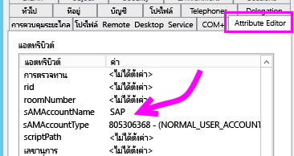
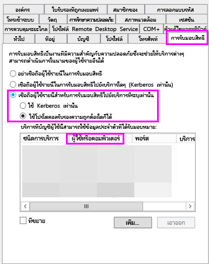
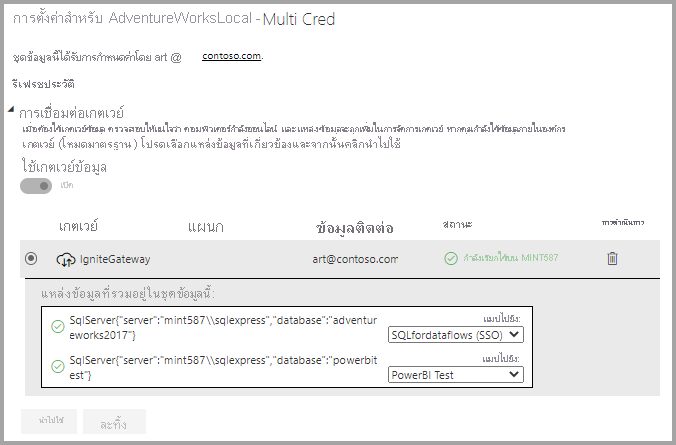
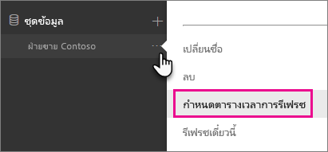

# <a name="troubleshoot-gateways---power-bi"></a><span data-ttu-id="ad550-104">แก้ไขปัญหาเกตเวย์ - Power BI</span><span class="sxs-lookup"><span data-stu-id="ad550-104">Troubleshoot gateways - Power BI</span></span>

[!INCLUDE [gateway-rewrite](../includes/gateway-rewrite.md)]

<span data-ttu-id="ad550-105">บทความนี้อธิบายถึงปัญหาทั่วไปเมื่อใช้เกตเวย์ข้อมูลภายในองค์กรกับ Power BI</span><span class="sxs-lookup"><span data-stu-id="ad550-105">This article discusses some common issues when you use the on-premises data gateway with Power BI.</span></span> <span data-ttu-id="ad550-106">ถ้าคุณพบปัญหาที่ไม่ได้อยู่ในรายการนี้ คุณสามารถใช้ไซต์ [ชุมชน Power BI ](https://community.powerbi.com)ได้</span><span class="sxs-lookup"><span data-stu-id="ad550-106">If you encounter an issue that isn't listed here, you can use the Power BI [Community](https://community.powerbi.com) site.</span></span> <span data-ttu-id="ad550-107">หรือคุณสามารถสร้าง [ตั๋วการสนับสนุน](https://powerbi.microsoft.com/support)</span><span class="sxs-lookup"><span data-stu-id="ad550-107">Or, you can create a [support ticket](https://powerbi.microsoft.com/support).</span></span>

## <a name="configuration"></a><span data-ttu-id="ad550-108">การกำหนดค่า</span><span class="sxs-lookup"><span data-stu-id="ad550-108">Configuration</span></span>

### <a name="error-power-bi-service-reported-local-gateway-as-unreachable-restart-the-gateway-and-try-again"></a><span data-ttu-id="ad550-109">ข้อผิดพลาด: บริการ Power BI รายงานว่าไม่สามารถเข้าถึงเกตเวย์ภายในเครื่องได้</span><span class="sxs-lookup"><span data-stu-id="ad550-109">Error: Power BI service reported local gateway as unreachable.</span></span> <span data-ttu-id="ad550-110">รีสตาร์ทเกตเวย์และลองอีกครั้ง</span><span class="sxs-lookup"><span data-stu-id="ad550-110">Restart the gateway and try again.</span></span>

<span data-ttu-id="ad550-111">ตอนท้ายของการกำหนดค่า บริการ Power BI จะถูกเรียกอีกครั้งเพื่อตรวจสอบเกตเวย์</span><span class="sxs-lookup"><span data-stu-id="ad550-111">At the end of configuration, the Power BI service is called again to validate the gateway.</span></span> <span data-ttu-id="ad550-112">บริการของ Power BI ไม่ได้รายงานสถานะเกตเวย์ว่าสด</span><span class="sxs-lookup"><span data-stu-id="ad550-112">The Power BI service doesn't report the gateway as live.</span></span> <span data-ttu-id="ad550-113">รีสตาร์ทบริการของ Windows อาจช่วยให้สื่อสารสำเร็จ</span><span class="sxs-lookup"><span data-stu-id="ad550-113">Restarting the Windows service might allow the communication to be successful.</span></span> <span data-ttu-id="ad550-114">หากต้องการข้อมูลเพิ่มเติม คุณสามารถรวบรวมและตรวจทานบันทึกตามที่อธิบายไว้ใน[เก็บรวบรวมบันทึกจากแอปในเกตเวย์ข้อมูลภายในองค์กร](/data-integration/gateway/service-gateway-tshoot#collect-logs-from-the-on-premises-data-gateway-app)</span><span class="sxs-lookup"><span data-stu-id="ad550-114">To get more information, you can collect and review the logs as described in [Collect logs from the on-premises data gateway app](/data-integration/gateway/service-gateway-tshoot#collect-logs-from-the-on-premises-data-gateway-app).</span></span>

## <a name="data-sources"></a><span data-ttu-id="ad550-115">แหล่งข้อมูล</span><span class="sxs-lookup"><span data-stu-id="ad550-115">Data sources</span></span>

### <a name="error-unable-to-connect-details-invalid-connection-credentials"></a><span data-ttu-id="ad550-116">ข้อผิดพลาด: ไม่สามารถเชื่อมต่อได้</span><span class="sxs-lookup"><span data-stu-id="ad550-116">Error: Unable to Connect.</span></span> <span data-ttu-id="ad550-117">รายละเอียด: "ข้อมูลประจำตัวของการเชื่อมต่อไม่ถูกต้อง"</span><span class="sxs-lookup"><span data-stu-id="ad550-117">Details: "Invalid connection credentials"</span></span>

<span data-ttu-id="ad550-118">ภายใน **แสดงรายละเอียด** ข้อความแสดงข้อผิดพลาดที่ได้รับจากแหล่งข้อมูลจะแสดงขึ้นมา</span><span class="sxs-lookup"><span data-stu-id="ad550-118">Within **Show details**, the error message that was received from the data source is displayed.</span></span> <span data-ttu-id="ad550-119">สำหรับ SQL Server คุณจะเห็นข้อความดังต่อไปนี้:</span><span class="sxs-lookup"><span data-stu-id="ad550-119">For SQL Server, you see a message like the following:</span></span>

```output
Login failed for user 'username'.
```

<span data-ttu-id="ad550-120">ตรวจสอบว่า คุณมีชื่อผู้ใช้และรหัสผ่านที่ถูกต้อง</span><span class="sxs-lookup"><span data-stu-id="ad550-120">Verify that you have the correct username and password.</span></span> <span data-ttu-id="ad550-121">อีกทั้ง ตรวจสอบว่า ข้อมูลประจำตัวเหล่านั้นสามารถเชื่อมต่อกับแหล่งข้อมูลเรียบร้อยแล้ว</span><span class="sxs-lookup"><span data-stu-id="ad550-121">Also, verify that those credentials can successfully connect to the data source.</span></span> <span data-ttu-id="ad550-122">ตรวจสอบให้แน่ใจว่าบัญชีที่ใช้ตรงกับ วิธีการรับรองความถูกต้อง</span><span class="sxs-lookup"><span data-stu-id="ad550-122">Make sure the account that's being used matches the authentication method.</span></span>

### <a name="error-unable-to-connect-details-cannot-connect-to-the-database"></a><span data-ttu-id="ad550-123">ข้อผิดพลาด: ไม่สามารถเชื่อมต่อได้</span><span class="sxs-lookup"><span data-stu-id="ad550-123">Error: Unable to Connect.</span></span> <span data-ttu-id="ad550-124">รายละเอียด: "ไม่สามารถติดต่อแหล่งข้อมูลได้"</span><span class="sxs-lookup"><span data-stu-id="ad550-124">Details: "Cannot connect to the database"</span></span>

<span data-ttu-id="ad550-125">คุณสามารถเชื่อมต่อไปยังเซิร์ฟเวอร์ แต่ไม่สามารถเชื่อมต่อไปยังฐานข้อมูลที่ให้มา</span><span class="sxs-lookup"><span data-stu-id="ad550-125">You were able to connect to the server but not to the database that was supplied.</span></span> <span data-ttu-id="ad550-126">ตรวจสอบชื่อของฐานข้อมูล และตรวจสอบว่าข้อมูลประจำตัวของผู้ใช้มีสิทธิ์เข้าถึงฐานข้อมูลนั้น</span><span class="sxs-lookup"><span data-stu-id="ad550-126">Verify the name of the database and that the user credential has the proper permission to access that database.</span></span>

<span data-ttu-id="ad550-127">ภายใน **แสดงรายละเอียด** ข้อความแสดงข้อผิดพลาดที่ได้รับจากแหล่งข้อมูลจะแสดงขึ้นมา</span><span class="sxs-lookup"><span data-stu-id="ad550-127">Within **Show details**, the error message that was received from the data source is displayed.</span></span> <span data-ttu-id="ad550-128">สำหรับ SQL Server คุณจะเห็นบางอย่างดังต่อไปนี้</span><span class="sxs-lookup"><span data-stu-id="ad550-128">For SQL Server, you see something like the following:</span></span>

```output
Cannot open database "AdventureWorks" requested by the login. The login failed. Login failed for user 'username'.
```

### <a name="error-unable-to-connect-details-unknown-error-in-data-gateway"></a><span data-ttu-id="ad550-129">ข้อผิดพลาด: ไม่สามารถเชื่อมต่อได้</span><span class="sxs-lookup"><span data-stu-id="ad550-129">Error: Unable to Connect.</span></span> <span data-ttu-id="ad550-130">รายละเอียด: "เกิดข้อผิดพลาดที่ไม่รู้จักในเกตเวย์ข้อมูล"</span><span class="sxs-lookup"><span data-stu-id="ad550-130">Details: "Unknown error in data gateway"</span></span>

<span data-ttu-id="ad550-131">ข้อผิดพลาดนี้อาจเกิดขึ้นจากหลายสาเหตุ</span><span class="sxs-lookup"><span data-stu-id="ad550-131">This error might occur for different reasons.</span></span> <span data-ttu-id="ad550-132">ตรวจสอบให้แน่ใจว่าคุณสามารถเชื่อมต่อกับแหล่งข้อมูลจากเครื่องที่โฮสต์เกตเวย์</span><span class="sxs-lookup"><span data-stu-id="ad550-132">Be sure to validate that you can connect to the data source from the machine that hosts the gateway.</span></span> <span data-ttu-id="ad550-133">สถานการณ์นี้อาจเป็นผลมาจากเซิร์ฟเวอร์ที่ไม่สามารถเข้าถึงได้</span><span class="sxs-lookup"><span data-stu-id="ad550-133">This situation could be the result of the server not being accessible.</span></span>

<span data-ttu-id="ad550-134">ภายใน **แสดงรายละเอียด** คุณสามารถเห็นรหัสข้อผิดพลาดของ **DM_GWPipeline_UnknownError** ได้</span><span class="sxs-lookup"><span data-stu-id="ad550-134">Within **Show details**, you can see an error code of **DM_GWPipeline_UnknownError**.</span></span>

<span data-ttu-id="ad550-135">คุณยังสามารถค้นหาใน **บันทึกเหตุการณ์** > **บันทึกแอปพลิเคชันและบริการ** > **บริการเกตเวย์ข้อมูลภายในองค์กร** สำหรับรายละเอียดเพิ่มเติม</span><span class="sxs-lookup"><span data-stu-id="ad550-135">You can also look in **Event Logs** > **Applications and Services Logs** > **On-premises data gateway Service** for more information.</span></span>

### <a name="error-we-encountered-an-error-while-trying-to-connect-to-server-details-we-reached-the-data-gateway-but-the-gateway-cant-access-the-on-premises-data-source"></a><span data-ttu-id="ad550-136">ข้อผิดพลาด: เราพบข้อผิดพลาดในระหว่างลองทำการเชื่อมต่อไปยัง\<server\></span><span class="sxs-lookup"><span data-stu-id="ad550-136">Error: We encountered an error while trying to connect to \<server\>.</span></span> <span data-ttu-id="ad550-137">รายละเอียด: "เราสามารถเข้าถึงเกตเวย์ข้อมูลได้ แต่เกตเวย์ข้อมูลไม่สามารถเข้าถึงแหล่งข้อมูลในองค์กรได้"</span><span class="sxs-lookup"><span data-stu-id="ad550-137">Details: "We reached the data gateway, but the gateway can't access the on-premises data source."</span></span>

<span data-ttu-id="ad550-138">คุณไม่สามารถเชื่อมต่อไปยังแหล่งข้อมูลที่ระบุไว้</span><span class="sxs-lookup"><span data-stu-id="ad550-138">You were unable to connect to the specified data source.</span></span> <span data-ttu-id="ad550-139">ตรวจสอบให้แน่ใจว่าข้อมูลที่ให้ไว้สำหรับแหล่งข้อมูลนั้นถูกต้อง</span><span class="sxs-lookup"><span data-stu-id="ad550-139">Be sure to validate the information provided for that data source.</span></span>

<span data-ttu-id="ad550-140">ภายใน **แสดงรายละเอียด** คุณสามารถเห็นรหัสข้อผิดพลาดของ **DM_GWPipeline_Gateway_DataSourceAccessError** ได้</span><span class="sxs-lookup"><span data-stu-id="ad550-140">Within **Show details**, you can see an error code of **DM_GWPipeline_Gateway_DataSourceAccessError**.</span></span>

<span data-ttu-id="ad550-141">ถ้าข้อผิดพลาดเบื้องต้นคล้ายกับข้อความต่อไปนี้ แสดงว่าบัญชีผู้ใช้ที่คุณกำลังใช้สำหรับแหล่งข้อมูล ไม่ใช่บัญชีผู้ดูแลระบบเซิร์ฟเวอร์สำหรับอินสแตนซ์ของ Analysis Services นั้น</span><span class="sxs-lookup"><span data-stu-id="ad550-141">If the underlying error message is similar to the following, this means that the account you're using for the data source isn't a server admin for that Analysis Services instance.</span></span> <span data-ttu-id="ad550-142">สำหรับข้อมูลเพิ่มเติม ให้ดู [การให้สิทธิ์ผู้ดูแลระบบเซิร์ฟเวอร์กับอินสแตนซ์ของ Analysis Services](/sql/analysis-services/instances/grant-server-admin-rights-to-an-analysis-services-instance)</span><span class="sxs-lookup"><span data-stu-id="ad550-142">For more information, see [Grant server admin rights to an Analysis Services instance](/sql/analysis-services/instances/grant-server-admin-rights-to-an-analysis-services-instance).</span></span>

```output
The 'CONTOSO\account' value of the 'EffectiveUserName' XML for Analysis property is not valid.
```

<span data-ttu-id="ad550-143">ถ้าข้อผิดพลาดเบื้องต้นคล้ายกับข้อความต่อไปนี้ แสดงว่าบัญชีบริการสำหรับ Analysis Services อาจจะขาดแอตทริบิวต์ไดเรกทอรี [token-groups-global-and-universal](/windows/win32/adschema/a-tokengroupsglobalanduniversal) (TGGAU)</span><span class="sxs-lookup"><span data-stu-id="ad550-143">If the underlying error message is similar to the following, it could mean that the service account for Analysis Services might be missing the [token-groups-global-and-universal](/windows/win32/adschema/a-tokengroupsglobalanduniversal) (TGGAU) directory attribute.</span></span>

```output
The username or password is incorrect.
```

<span data-ttu-id="ad550-144">โดเมนที่มีการเข้าถึงความเข้ากันได้ของ Windows รุ่นก่อน 2000 มีแอตทริบิวต์ TGGAU ที่เปิดใช้งาน</span><span class="sxs-lookup"><span data-stu-id="ad550-144">Domains with pre-Windows 2000 compatibility access have the TGGAU attribute enabled.</span></span> <span data-ttu-id="ad550-145">โดเมนที่สร้างขึ้นใหม่ส่วนใหญ่ไม่เปิดใช้งานแอตทริบิวต์นี้ตามค่าเริ่มต้น</span><span class="sxs-lookup"><span data-stu-id="ad550-145">Most newly created domains don't enable this attribute by default.</span></span> <span data-ttu-id="ad550-146">สำหรับข้อมูลเพิ่มเติม ให้ดู [แอปพลิเคชันและ API บางอย่างจำเป็นต้องมีสิทธิ์เข้าถึงข้อมูลการรับรองความถูกต้องเกี่ยวกับออบเจ็กต์ของบัญชี](https://support.microsoft.com/kb/331951)</span><span class="sxs-lookup"><span data-stu-id="ad550-146">For more information, see [Some applications and APIs require access to authorization information on account objects](https://support.microsoft.com/kb/331951).</span></span>

<span data-ttu-id="ad550-147">เพื่อยืนยันว่าเปิดใช้งานแอตทริบิวต์หรือไม่ ให้ทำตามขั้นตอนเหล่านี้</span><span class="sxs-lookup"><span data-stu-id="ad550-147">To confirm whether the attribute is enabled, follow these steps.</span></span>

1. <span data-ttu-id="ad550-148">เชื่อมต่อไปยังเครื่อง Analysis Services ภายใน SQL Server Management Studio</span><span class="sxs-lookup"><span data-stu-id="ad550-148">Connect to the Analysis Services machine within SQL Server Management Studio.</span></span> <span data-ttu-id="ad550-149">ภายในคุณสมบัติการเชื่อมต่อขั้นสูง ใส่ EffectiveUserName สำหรับผู้ใช้ที่มีปัญหา และดูว่ามีข้อผิดพลาดแบบเดียวกันเกิดขึ้นอีกหรือไม่</span><span class="sxs-lookup"><span data-stu-id="ad550-149">Within the Advanced connection properties, include EffectiveUserName for the user in question and see if this addition reproduces the error.</span></span>
2. <span data-ttu-id="ad550-150">คุณสามารถใช้เครื่องมือ dsacls ของ Active Directory เพื่อตรวจสอบว่ามีแอตทริบิวต์ในรายการหรือไม่</span><span class="sxs-lookup"><span data-stu-id="ad550-150">You can use the dsacls Active Directory tool to validate whether the attribute is listed.</span></span> <span data-ttu-id="ad550-151">เครื่องมือนี้มีอยู่ในตัวควบคุมโดเมน</span><span class="sxs-lookup"><span data-stu-id="ad550-151">This tool is found on a domain controller.</span></span> <span data-ttu-id="ad550-152">คุณจำเป็นต้องทราบชื่อโดเมนเฉพาะสำหรับบัญชีผู้ใช้ และส่งชื่อนั้นไปยังเครื่องมือ</span><span class="sxs-lookup"><span data-stu-id="ad550-152">You need to know what the distinguished domain name is for the account and pass that name to the tool.</span></span>

   ```console
   dsacls "CN=John Doe,CN=UserAccounts,DC=contoso,DC=com"
   ```

    <span data-ttu-id="ad550-153">คุณต้องการผลลัพธ์ที่คล้ายกับข้อความต่อไปนี้</span><span class="sxs-lookup"><span data-stu-id="ad550-153">You want to see something similar to the following in the results:</span></span>

   ```console
   Allow BUILTIN\Windows Authorization Access Group
                                   SPECIAL ACCESS for tokenGroupsGlobalAndUniversal
                                   READ PROPERTY
   ```

<span data-ttu-id="ad550-154">เมื่อต้องการแก้ไขปัญหานี้ คุณต้องเปิดใช้งาน TGGAU บนบัญชีที่ใช้สำหรับบริการ Analysis Services ของ Windows</span><span class="sxs-lookup"><span data-stu-id="ad550-154">To correct this issue, you must enable TGGAU on the account used for the Analysis Services Windows service.</span></span>

#### <a name="another-possibility-for-the-username-or-password-is-incorrect"></a><span data-ttu-id="ad550-155">อีกสาเหตุหนึ่งที่เป็นไปได้คือ “ชื่อผู้ใช้หรือรหัสผ่านไม่ถูกต้อง”</span><span class="sxs-lookup"><span data-stu-id="ad550-155">Another possibility for "The username or password is incorrect."</span></span>

<span data-ttu-id="ad550-156">ข้อผิดพลาดนี้ก็ยังเกิดขึ้นได้ถ้าเซิร์ฟเวอร์ Analysis Services อยู่ในคนละโดเมนกับผู้ใช้ และไม่มีการกำหนดความน่าเชื่อถือแบบสองทิศทางเอาไว้ก่อน</span><span class="sxs-lookup"><span data-stu-id="ad550-156">This error could also be caused if the Analysis Services server is in a different domain than the users and there isn't a two-way trust established.</span></span>

<span data-ttu-id="ad550-157">ทำงานร่วมกับผู้ดูแลระบบโดเมนของคุณเพื่อตรวจสอบความสัมพันธ์ที่น่าเชื่อถือระหว่างโดเมน</span><span class="sxs-lookup"><span data-stu-id="ad550-157">Work with your domain administrators to verify the trust relationship between domains.</span></span>

#### <a name="unable-to-see-the-data-gateway-data-sources-in-the-get-data-experience-for-analysis-services-from-the-power-bi-service"></a><span data-ttu-id="ad550-158">ไม่สามารถมองเห็นแหล่งข้อมูลของเกตเวย์ข้อมูลในประสบการณ์ใช้งาน 'รับข้อมูล' สำหรับ Analysis Services จากบริการของ Power BI</span><span class="sxs-lookup"><span data-stu-id="ad550-158">Unable to see the data gateway data sources in the Get Data experience for Analysis Services from the Power BI service</span></span>

<span data-ttu-id="ad550-159">ตรวจสอบให้แน่ใจว่า บัญชีของคุณอยู่ในรายการในแท็บ **ผู้ใช้** ของแหล่งข้อมูล ในการกำหนดค่าของเกตเวย์</span><span class="sxs-lookup"><span data-stu-id="ad550-159">Make sure that your account is listed in the **Users** tab of the data source within the gateway configuration.</span></span> <span data-ttu-id="ad550-160">ถ้าคุณไม่สามารถเข้าถึงเกตเวย์ ตรวจสอบกับผู้ดูแลระบบของเกตเวย์ และขอให้เขาตรวจสอบให้</span><span class="sxs-lookup"><span data-stu-id="ad550-160">If you don't have access to the gateway, check with the administrator of the gateway and ask them to verify.</span></span> <span data-ttu-id="ad550-161">เฉพาะบัญชีผู้ใช้ในรายการ **ผู้ใช้** เท่านั้นที่สามารถดูแหล่งข้อมูลที่แสดงอยู่ในรายการของ Analysis Services ได้</span><span class="sxs-lookup"><span data-stu-id="ad550-161">Only accounts in the **Users** list can see the data source listed in the Analysis Services list.</span></span>

### <a name="error-you-dont-have-any-gateway-installed-or-configured-for-the-data-sources-in-this-dataset"></a><span data-ttu-id="ad550-162">ข้อผิดพลาด: คุณไม่ได้ติดตั้งหรือการกำหนดค่าเกตเวย์ สำหรับแหล่งข้อมูลในชุดข้อมูลนี้</span><span class="sxs-lookup"><span data-stu-id="ad550-162">Error: You don't have any gateway installed or configured for the data sources in this dataset.</span></span>

<span data-ttu-id="ad550-163">ตรวจสอบให้แน่ใจว่าคุณได้เพิ่มแหล่งข้อมูลหนึ่งรายการหรือมากกว่าไปยังเกตเวย์ ตามที่อธิบายไว้ใน[เพิ่มแหล่งข้อมูล](service-gateway-data-sources.md#add-a-data-source)</span><span class="sxs-lookup"><span data-stu-id="ad550-163">Ensure that you've added one or more data sources to the gateway, as described in [Add a data source](service-gateway-data-sources.md#add-a-data-source).</span></span> <span data-ttu-id="ad550-164">ถ้าเกตเวย์ไม่ปรากฏในพอร์ทัลผู้ดูแลระบบภายใต้ **จัดการเกตเวย์** ให้ล้างแคชของเบราว์เซอร์ หรือลงชื่อออกจากบริการแล้วลงชื่อเข้าใช้อีกครั้ง</span><span class="sxs-lookup"><span data-stu-id="ad550-164">If the gateway doesn't appear in the admin portal under **Manage gateways**, clear your browser cache or sign out of the service and then sign back in.</span></span>

## <a name="datasets"></a><span data-ttu-id="ad550-165">ชุดข้อมูล</span><span class="sxs-lookup"><span data-stu-id="ad550-165">Datasets</span></span>

### <a name="error-there-is-not-enough-space-for-this-row"></a><span data-ttu-id="ad550-166">ข้อผิดพลาด: มีเนื้อที่ไม่เพียงพอสำหรับแถวนี้</span><span class="sxs-lookup"><span data-stu-id="ad550-166">Error: There is not enough space for this row.</span></span>

<span data-ttu-id="ad550-167">ข้อผิดพลาดนี้เกิดขึ้นถ้าคุณมีแถวเดียวที่มีขนาดมากกว่า 4 เมกะไบต์</span><span class="sxs-lookup"><span data-stu-id="ad550-167">This error occurs if you have a single row greater than 4 MB in size.</span></span> <span data-ttu-id="ad550-168">ตรวจหาว่าแถวไหนมาจากแหล่งข้อมูลของคุณ และพยายามทำการกรองออกหรือลดขนาดสำหรับแถวนั้น</span><span class="sxs-lookup"><span data-stu-id="ad550-168">Determine what the row is from your data source, and attempt to filter it out or reduce the size for that row.</span></span>

### <a name="error-the-server-name-provided-doesnt-match-the-server-name-on-the-sql-server-ssl-certificate"></a><span data-ttu-id="ad550-169">ข้อผิดพลาด: ชื่อเซิร์ฟเวอร์ที่ระบุไม่ตรงกับชื่อเซิร์ฟเวอร์บนใบรับรอง SSL ของ SQL Server</span><span class="sxs-lookup"><span data-stu-id="ad550-169">Error: The server name provided doesn't match the server name on the SQL Server SSL certificate.</span></span>

<span data-ttu-id="ad550-170">ข้อผิดพลาดนี้สามารถเกิดขึ้นเมื่อชื่อสามัญของใบรับรองมีไว้สำหรับเซิร์ฟเวอร์ที่มีชื่อโดเมนที่มีคุณสมบัติครบถ้วน (FQDN) แต่คุณใส่เพียงชื่อ NetBIOS สำหรับเซิร์ฟเวอร์</span><span class="sxs-lookup"><span data-stu-id="ad550-170">This error can occur when the certificate common name is for the server's fully qualified domain name (FQDN), but you supplied only the NetBIOS name for the server.</span></span> <span data-ttu-id="ad550-171">สถานการณ์นี้ทำให้เกิดการไม่ตรงกันสำหรับใบรับรอง</span><span class="sxs-lookup"><span data-stu-id="ad550-171">This situation causes a mismatch for the certificate.</span></span> <span data-ttu-id="ad550-172">เมื่อต้องแก้ไขปัญหานี้ ต้องตั้งชื่อเซิร์ฟเวอร์ภายในแหล่งข้อมูลเกตเวย์ และไฟล์ PBIX จะใช้ FQDN ของเซิร์ฟเวอร์</span><span class="sxs-lookup"><span data-stu-id="ad550-172">To resolve this issue, make the server name within the gateway data source and the PBIX file use the FQDN of the server.</span></span>

### <a name="error-you-dont-see-the-on-premises-data-gateway-present-when-you-configure-scheduled-refresh"></a><span data-ttu-id="ad550-173">ข้อผิดพลาด: คุณไม่เห็นเกตเวย์ข้อมูลภายในองค์กรอยู่เมื่อกำหนดค่าการรีเฟรชตามกำหนดการ</span><span class="sxs-lookup"><span data-stu-id="ad550-173">Error: You don't see the on-premises data gateway present when you configure scheduled refresh.</span></span>

<span data-ttu-id="ad550-174">สถานการณ์ที่แตกต่างกันบางอย่างอาจเป็นต้นเหตุของข้อผิดพลาดนี้:</span><span class="sxs-lookup"><span data-stu-id="ad550-174">A few different scenarios could be responsible for this error:</span></span>

- <span data-ttu-id="ad550-175">ชื่อเซิร์ฟเวอร์และชื่อฐานข้อมูลไม่ตรงกันกับชื่อที่ระบุไว้ใน Power BI Desktop และแหล่งข้อมูลที่กำหนดค่าสำหรับเกตเวย์</span><span class="sxs-lookup"><span data-stu-id="ad550-175">The server and database name don't match what was entered in Power BI Desktop and the data source configured for the gateway.</span></span> <span data-ttu-id="ad550-176">ชื่อเหล่านี้จะต้องเหมือนกัน</span><span class="sxs-lookup"><span data-stu-id="ad550-176">These names must be the same.</span></span> <span data-ttu-id="ad550-177">ซึ่งไม่ต้องตรงตามตัวพิมพ์ใหญ่-เล็กก็ได้</span><span class="sxs-lookup"><span data-stu-id="ad550-177">They aren't case sensitive.</span></span>
- <span data-ttu-id="ad550-178">บัญชีของคุณไม่ได้แสดงอยู่ในรายการในแท็บ **ผู้ใช้** ของแหล่งข้อมูลในการกำหนดค่าของเกตเวย์</span><span class="sxs-lookup"><span data-stu-id="ad550-178">Your account isn't listed in the **Users** tab of the data source within the gateway configuration.</span></span> <span data-ttu-id="ad550-179">คุณจะต้องเพิ่มในรายการนั้นโดยสิทธิ์ของผู้ดูแลระบบของเกตเวย์</span><span class="sxs-lookup"><span data-stu-id="ad550-179">You need to be added to that list by the administrator of the gateway.</span></span>
- <span data-ttu-id="ad550-180">ไฟล์ Power BI Desktop ของคุณมีแหล่งข้อมูลหลายแหล่ง แต่บางแหล่งข้อมูลไม่ได้กำหนดค่าไว้ในเกตเวย์</span><span class="sxs-lookup"><span data-stu-id="ad550-180">Your Power BI Desktop file has multiple data sources within it, and not all of those data sources are configured with the gateway.</span></span> <span data-ttu-id="ad550-181">คุณจำเป็นต้องมีแหล่งข้อมูลแต่ละแหล่งที่กำหนดด้วยเกตเวย์สำหรับเกตเวย์เพื่อแสดงขึ้นภายในการรีเฟรชตามกำหนดการ</span><span class="sxs-lookup"><span data-stu-id="ad550-181">You need to have each data source defined with the gateway for the gateway to show up within scheduled refresh.</span></span>

### <a name="error-the-received-uncompressed-data-on-the-gateway-client-has-exceeded-the-limit"></a><span data-ttu-id="ad550-182">ข้อผิดพลาด: ข้อมูลที่ไม่มีการบีบอัดที่ได้รับบนไคลเอ็นต์ของเกตเวย์ได้เกินขีดจำกัด</span><span class="sxs-lookup"><span data-stu-id="ad550-182">Error: The received uncompressed data on the gateway client has exceeded the limit.</span></span>

<span data-ttu-id="ad550-183">มีการจำกัดขนาดของข้อมูลไม่บีบอัดที่ 10 GB ต่อ ตาราง</span><span class="sxs-lookup"><span data-stu-id="ad550-183">The exact limitation is 10 GB of uncompressed data per table.</span></span> <span data-ttu-id="ad550-184">ถ้าคุณกำลังมีปัญหานี้ มีหลายทางเลือกในการปรับให้เหมาะสม และหลีกเลี่ยงปัญหาดังกล่าว</span><span class="sxs-lookup"><span data-stu-id="ad550-184">If you're hitting this issue, there are good options to optimize and avoid it.</span></span> <span data-ttu-id="ad550-185">โดยเฉพาะอย่างยิ่ง ลดการใช้ค่าสตริงที่คงที่ สูง และยาว แล้วใช้คีย์ปกติแทน</span><span class="sxs-lookup"><span data-stu-id="ad550-185">In particular, reduce the use of highly constant, long string values and instead use a normalized key.</span></span> <span data-ttu-id="ad550-186">หรือการเอาคอลัมน์ออกถ้าไม่ได้ใช้งานจะช่วยได้</span><span class="sxs-lookup"><span data-stu-id="ad550-186">Or, removing the column if it's not in use helps.</span></span>

## <a name="reports"></a><span data-ttu-id="ad550-187">รายงาน</span><span class="sxs-lookup"><span data-stu-id="ad550-187">Reports</span></span>

### <a name="error-report-could-not-access-the-data-source-because-you-do-not-have-access-to-our-data-source-via-an-on-premises-data-gateway"></a><span data-ttu-id="ad550-188">ข้อผิดพลาด: รายงานไม่สามารถเข้าถึงแหล่งข้อมูลได้ เนื่องจากคุณไม่มีสิทธิ์การเข้าถึงแหล่งข้อมูลของเราผ่านเกตเวย์ข้อมูลภายในองค์กร</span><span class="sxs-lookup"><span data-stu-id="ad550-188">Error: Report could not access the data source because you do not have access to our data source via an on-premises data gateway.</span></span>

<span data-ttu-id="ad550-189">ข้อผิดพลาดนี้มักจะเกิดจากหนึ่งในสาเหตุต่อไปนี้:</span><span class="sxs-lookup"><span data-stu-id="ad550-189">This error is usually caused by one of the following:</span></span>

- <span data-ttu-id="ad550-190">ข้อมูลจากแหล่งข้อมูลไม่ตรงกับข้อมูลที่อยู่ในชุดข้อมูลเบื้องต้น</span><span class="sxs-lookup"><span data-stu-id="ad550-190">The data source information doesn't match what's in the underlying dataset.</span></span> <span data-ttu-id="ad550-191">ชื่อเซิร์ฟเวอร์และฐานข้อมูลที่กำหนดในแหล่งข้อมูลของเกตเวย์ข้อมูลในองค์กร และที่คุณใส่ใน Power BI Desktop ต้องตรงกัน</span><span class="sxs-lookup"><span data-stu-id="ad550-191">The server and database name need to match between the data source defined for the on-premises data gateway and what you supply within Power BI Desktop.</span></span> <span data-ttu-id="ad550-192">ถ้าคุณใช้อยู่ที่อยู่ IP ใน Power BI Desktop แล้ว แหล่งข้อมูลในเกตเวย์ข้อมูลภายในองค์กร ก็ต้องใช้ที่อยู่ IP เช่นกัน</span><span class="sxs-lookup"><span data-stu-id="ad550-192">If you use an IP address in Power BI Desktop, the data source for the on-premises data gateway needs to use an IP address as well.</span></span>
- <span data-ttu-id="ad550-193">ไม่มีแหล่งข้อมูลใดในเกตเวย์ใด ๆ ภายในองค์กรของคุณพร้อมใช้งาน</span><span class="sxs-lookup"><span data-stu-id="ad550-193">There's no data source available on any gateway within your organization.</span></span> <span data-ttu-id="ad550-194">คุณสามารถกำหนดค่าแหล่งข้อมูลบนเกตเวย์ข้อมูลภายในองค์กรที่มีอยู่หรืออันใหม่</span><span class="sxs-lookup"><span data-stu-id="ad550-194">You can configure the data source on a new or existing on-premises data gateway.</span></span>

### <a name="error-data-source-access-error-please-contact-the-gateway-administrator"></a><span data-ttu-id="ad550-195">ข้อผิดพลาด: ข้อผิดพลาดในการเข้าถึงแหล่งข้อมูล</span><span class="sxs-lookup"><span data-stu-id="ad550-195">Error: Data source access error.</span></span> <span data-ttu-id="ad550-196">โปรดติดต่อผู้ดูแลระบบเกตเวย์</span><span class="sxs-lookup"><span data-stu-id="ad550-196">Please contact the gateway administrator.</span></span>

<span data-ttu-id="ad550-197">ถ้ารายงานนี้ใช้การเชื่อมต่อสดของ Analysis Services คุณอาจเจอปัญหากับค่าที่ส่งผ่านไปยัง EffectiveUserName ที่ไม่ถูกต้อง หรือไม่มีสิทธิ์บนเครื่องของ Analysis Services</span><span class="sxs-lookup"><span data-stu-id="ad550-197">If this report makes use of a live Analysis Services connection, you could encounter an issue with a value being passed to EffectiveUserName that either isn't valid or doesn't have permissions on the Analysis Services machine.</span></span> <span data-ttu-id="ad550-198">โดยทั่วไปแล้ว ปัญหาในการรับรองความถูกต้องเกิดจากค่า EffectiveUserName ไม่ตรงกับภายในชื่อผู้ใช้หลัก (UPN) ในเครื่อง</span><span class="sxs-lookup"><span data-stu-id="ad550-198">Typically, an authentication issue is due to the fact that the value being passed for EffectiveUserName doesn't match a local user principal name (UPN).</span></span>

<span data-ttu-id="ad550-199">เมื่อต้องการยืนยันชื่อผู้ใช้ที่มีผลบังคับ ให้ทำตามขั้นตอนเหล่านี้</span><span class="sxs-lookup"><span data-stu-id="ad550-199">To confirm the effective username, follow these steps.</span></span>

1. <span data-ttu-id="ad550-200">ค้นหาชื่อผู้ใช้ที่มีผลบังคับใช้จากใน[รายการบันทึกของเกตเวย์](/data-integration/gateway/service-gateway-tshoot#collect-logs-from-the-on-premises-data-gateway-app)</span><span class="sxs-lookup"><span data-stu-id="ad550-200">Find the effective username within the [gateway logs](/data-integration/gateway/service-gateway-tshoot#collect-logs-from-the-on-premises-data-gateway-app).</span></span>
2. <span data-ttu-id="ad550-201">หลังจากที่คุณได้รับค่าที่ส่งผ่าน ให้ตรวจสอบว่าข้อมูลนั้นถูกต้อง</span><span class="sxs-lookup"><span data-stu-id="ad550-201">After you have the value being passed, validate that it's correct.</span></span> <span data-ttu-id="ad550-202">ถ้าเป็นผู้ใช้ของคุณ คุณสามารถใช้คำสั่งต่อไปนี้จากพร้อมท์คำสั่งเพื่อดู UPN</span><span class="sxs-lookup"><span data-stu-id="ad550-202">If it's your user, you can use the following command from a command prompt to see the UPN.</span></span> <span data-ttu-id="ad550-203">UPN มีลักษณะเหมือนกับที่อยู่อีเมล</span><span class="sxs-lookup"><span data-stu-id="ad550-203">The UPN looks like an email address.</span></span>

   ```console
   whoami /upn
   ```

<span data-ttu-id="ad550-204">อีกทางเลือกหนึ่ง คุณดูว่า Power BI ได้รับอะไรจาก Azure Active Directory</span><span class="sxs-lookup"><span data-stu-id="ad550-204">Optionally, you can see what Power BI gets from Azure Active Directory.</span></span>

1. <span data-ttu-id="ad550-205">เรียกดู[https://developer.microsoft.com/graph/graph-explorer](https://developer.microsoft.com/graph/graph-explorer)</span><span class="sxs-lookup"><span data-stu-id="ad550-205">Browse to [https://developer.microsoft.com/graph/graph-explorer](https://developer.microsoft.com/graph/graph-explorer).</span></span>
2. <span data-ttu-id="ad550-206">เลือก **ลงชื่อเข้าใช้** ที่มุมขวาบน</span><span class="sxs-lookup"><span data-stu-id="ad550-206">Select **Sign in** in the upper-right corner.</span></span>
3. <span data-ttu-id="ad550-207">เรียกใช้คิวรีต่อไปนี้</span><span class="sxs-lookup"><span data-stu-id="ad550-207">Run the following query.</span></span> <span data-ttu-id="ad550-208">คุณเห็นการตอบสนอง JSON ขนาดใหญ่แทน</span><span class="sxs-lookup"><span data-stu-id="ad550-208">You see a rather large JSON response.</span></span>

   ```http
   https://graph.windows.net/me?api-version=1.5
   ```

4. <span data-ttu-id="ad550-209">ค้นหา **userPrincipalName**</span><span class="sxs-lookup"><span data-stu-id="ad550-209">Look for **userPrincipalName**.</span></span>

<span data-ttu-id="ad550-210">ถ้า Azure Active Directory UPN ของคุณไม่ตรงกับ UPN Active Directory ในเครื่องของคุณ คุณสามารถใช้การ[แมปชื่อผู้ใช้](service-gateway-enterprise-manage-ssas.md#map-user-names-for-analysis-services-data-sources)เพื่อแทนที่ด้วยค่าถูกต้องได้</span><span class="sxs-lookup"><span data-stu-id="ad550-210">If your Azure Active Directory UPN doesn't match your local Active Directory UPN, you can use the [Map user names](service-gateway-enterprise-manage-ssas.md#map-user-names-for-analysis-services-data-sources) feature to replace it with a valid value.</span></span> <span data-ttu-id="ad550-211">หรือคุณสามารถทำงานกับผู้ดูแลระบบ Power BI หรือผู้ดูแลระบบ Active Directory ภายในองค์กรของคุณเพื่อเปลี่ยนแปลง UPN ของคุณ</span><span class="sxs-lookup"><span data-stu-id="ad550-211">Or, you can work with either your Power BI admin or local Active Directory admin to get your UPN changed.</span></span>

## <a name="kerberos"></a><span data-ttu-id="ad550-212">Kerberos</span><span class="sxs-lookup"><span data-stu-id="ad550-212">Kerberos</span></span>

<span data-ttu-id="ad550-213">ถ้าเซิร์ฟเวอร์ฐานข้อมูลเบื้องต้นและเกตเวย์ข้อมูลภายในองค์กรไม่ได้รับการกำหนดค่าอย่างเหมาะสมสำหรับ [การรับมอบสิทธิ์แบบจำกัดของ Kerberos](service-gateway-sso-kerberos.md) ให้เปิดใช้งาน [การเข้าสู่ระบบ verbose](/data-integration/gateway/service-gateway-performance#slow-performing-queries) บนเกตเวย์</span><span class="sxs-lookup"><span data-stu-id="ad550-213">If the underlying database server and on-premises data gateway aren't appropriately configured for [Kerberos constrained delegation](service-gateway-sso-kerberos.md), enable [verbose logging](/data-integration/gateway/service-gateway-performance#slow-performing-queries) on the gateway.</span></span> <span data-ttu-id="ad550-214">จากนั้นให้ตรวจสอบโดยยึดตามข้อผิดพลาดหรือการติดตามในแฟ้มบันทึกของเกตเวย์เป็นจุดเริ่มต้นสำหรับการแก้ไขปัญหา</span><span class="sxs-lookup"><span data-stu-id="ad550-214">Then, investigate based on the errors or traces in the gateway’s log files as a starting point for troubleshooting.</span></span> <span data-ttu-id="ad550-215">เมื่อต้องการรวบรวมบันทึกเกตเวย์สำหรับการดู ดูที่ [รวบรวมบันทึกจากแอปในเกตเวย์ข้อมูลภายในองค์กร](/data-integration/gateway/service-gateway-tshoot#collect-logs-from-the-on-premises-data-gateway-app)</span><span class="sxs-lookup"><span data-stu-id="ad550-215">To collect the gateway logs for viewing, see [Collect logs from the on-premises data gateway app](/data-integration/gateway/service-gateway-tshoot#collect-logs-from-the-on-premises-data-gateway-app).</span></span>

### <a name="impersonationlevel"></a><span data-ttu-id="ad550-216">ImpersonationLevel</span><span class="sxs-lookup"><span data-stu-id="ad550-216">ImpersonationLevel</span></span>

<span data-ttu-id="ad550-217">ค่า ImpersonationLevel เกี่ยวข้องกับการตั้งค่า SPN หรือการตั้งค่านโยบายภายใน</span><span class="sxs-lookup"><span data-stu-id="ad550-217">The ImpersonationLevel is related to the SPN setup or the local policy setting.</span></span>

```
[DataMovement.PipeLine.GatewayDataAccess] About to impersonate user DOMAIN\User (IsAuthenticated: True, ImpersonationLevel: Identification)
```

<span data-ttu-id="ad550-218">**วิธีแก้**</span><span class="sxs-lookup"><span data-stu-id="ad550-218">**Solution**</span></span>

<span data-ttu-id="ad550-219">ทำตามขั้นตอนต่อไปนี้เพื่อแก้ไขปัญหา:</span><span class="sxs-lookup"><span data-stu-id="ad550-219">Follow these steps to solve the issue.</span></span>

1. <span data-ttu-id="ad550-220">ตั้งค่า SPN สำหรับเกตเวย์ภายในองค์กร</span><span class="sxs-lookup"><span data-stu-id="ad550-220">Set up an SPN for the on-premises gateway.</span></span>
2. <span data-ttu-id="ad550-221">ตั้งค่าการรับสิทธิ์ที่มีข้อจำกัดใน Active Directory ของคุณ</span><span class="sxs-lookup"><span data-stu-id="ad550-221">Set up constrained delegation in your Active Directory.</span></span>

### <a name="failedtoimpersonateuserexception-failed-to-create-windows-identity-for-user-userid"></a><span data-ttu-id="ad550-222">FailedToImpersonateUserException: ไม่สามารถสร้างข้อมูลประจำตัวของ windows สำหรับผู้ใช้ userid</span><span class="sxs-lookup"><span data-stu-id="ad550-222">FailedToImpersonateUserException: Failed to create Windows identity for user userid</span></span>

<span data-ttu-id="ad550-223">FailedToImpersonateUserException จะเกิดขึ้นถ้าคุณไม่สามารถเลียนแบบในนามของผู้ใช้อื่น</span><span class="sxs-lookup"><span data-stu-id="ad550-223">The FailedToImpersonateUserException happens if you're unable to impersonate on behalf of another user.</span></span> <span data-ttu-id="ad550-224">ข้อผิดพลาดนี้อาจเกิดขึ้นถ้าบัญชีผู้ใช้ของคุณกำลังพยายามจะเลียนแบบ มาจากโดเมนอื่นนอกเหนือจากโดเมนที่บริการเกตเวย์อยู่</span><span class="sxs-lookup"><span data-stu-id="ad550-224">This error could also happen if the account you're trying to impersonate is from another domain than the one the gateway service domain is on.</span></span> <span data-ttu-id="ad550-225">นี่คือข้อจำกัด</span><span class="sxs-lookup"><span data-stu-id="ad550-225">This is a limitation.</span></span>

<span data-ttu-id="ad550-226">**วิธีแก้**</span><span class="sxs-lookup"><span data-stu-id="ad550-226">**Solution**</span></span>

* <span data-ttu-id="ad550-227">ตรวจสอบว่าการกำหนดค่าถูกต้องตามขั้นตอนในส่วน “ImpersonationLevel” ก่อนหน้านี้</span><span class="sxs-lookup"><span data-stu-id="ad550-227">Verify that the configuration is correct as per the steps in the previous "ImpersonationLevel" section.</span></span>
* <span data-ttu-id="ad550-228">ให้แน่ใจว่า ID ผู้ใช้ที่จะพยายามเลียนแบบเป็นบัญชี Active Directory ที่ถูกต้อง</span><span class="sxs-lookup"><span data-stu-id="ad550-228">Ensure that the user ID it's trying to impersonate is a valid Active Directory account.</span></span>

### <a name="general-error-1033-error-while-you-parse-the-protocol"></a><span data-ttu-id="ad550-229">ข้อผิดพลาดทั่วไป: ข้อผิดพลาด 1033 ขณะที่คุณแยกวิเคราะห์โพรโทคอล</span><span class="sxs-lookup"><span data-stu-id="ad550-229">General error: 1033 error while you parse the protocol</span></span>

<span data-ttu-id="ad550-230">คุณได้รับข้อมูลข้อผิดพลาด 1033 เมื่อ ID ภายนอกของคุณที่กำหนดค่าไว้ใน SAP HANA ไม่ตรงกับการลงชื่อเข้าใช้ถ้าผู้ใช้ถูกเลียนแบบโดยใช้ UPN (alias@domain.com)</span><span class="sxs-lookup"><span data-stu-id="ad550-230">You get the 1033 error when your external ID that's configured in SAP HANA doesn't match the sign-in if the user is impersonated by using the UPN (alias@domain.com).</span></span> <span data-ttu-id="ad550-231">ในบันทึก คุณจะเห็น "UPN ต้นฉบับ 'alias@domain.com' ที่แทนที่ด้วย UPN 'alias@domain.com' ใหม่" ที่ด้านบนของบันทึกข้อผิดพลาดตามที่เห็นที่นี่:</span><span class="sxs-lookup"><span data-stu-id="ad550-231">In the logs, you see "Original UPN 'alias@domain.com' replaced with a new UPN 'alias@domain.com'" at the top of the error logs, as seen here:</span></span>

```
[DM.GatewayCore] SingleSignOn Required. Original UPN 'alias@domain.com' replaced with new UPN 'alias@domain.com.'
```

<span data-ttu-id="ad550-232">**วิธีแก้**</span><span class="sxs-lookup"><span data-stu-id="ad550-232">**Solution**</span></span>

* <span data-ttu-id="ad550-233">SAP HANA กำหนดให้ผู้ใช้ที่เลียนแบบต้องใช้แอตทริบิวต์ sAMAccountName ใน Active Directory (นามแฝงผู้ใช้)</span><span class="sxs-lookup"><span data-stu-id="ad550-233">SAP HANA requires the impersonated user to use the sAMAccountName attribute in Active Directory (user alias).</span></span> <span data-ttu-id="ad550-234">ถ้าแอตทริบิวต์ไม่ถูกต้อง คุณเห็นข้อผิดพลาด 1033</span><span class="sxs-lookup"><span data-stu-id="ad550-234">If this attribute isn't correct, you see the 1033 error.</span></span>

    

* <span data-ttu-id="ad550-236">ในบันทึก คุณเห็น sAMAccountName (นามแฝง) และไม่ใช่ UPN ซึ่งเป็นนามแฝงที่ตามด้วยโดเมน (alias@doimain.com)</span><span class="sxs-lookup"><span data-stu-id="ad550-236">In the logs, you see the sAMAccountName (alias) and not the UPN, which is the alias followed by the domain (alias@doimain.com).</span></span>

    

```xml
      <setting name="ADUserNameReplacementProperty" serializeAs="String">
        <value>sAMAccount</value>
      </setting>
      <setting name="ADServerPath" serializeAs="String">
        <value />
      </setting>
      <setting name="CustomASDataSource" serializeAs="String">
        <value />
      </setting>
      <setting name="ADUserNameLookupProperty" serializeAs="String">
        <value>AADEmail</value>
```

### <a name="sap-aglibodbchdb-dllhdbodbc-communication-link-failure-10709-connection-failed-rte-1-kerberos-error-major-miscellaneous-failure-851968-minor-no-credentials-are-available-in-the-security-package"></a><span data-ttu-id="ad550-238">[SAP AG] [LIBODBCHDB DLL] [HDBODBC] การเชื่อมโยงการสื่อสารล้มเหลว: -10709 เชื่อมต่อล้มเหลว (RTE: ข้อผิดพลาด Kerberos [-1]</span><span class="sxs-lookup"><span data-stu-id="ad550-238">[SAP AG][LIBODBCHDB DLL][HDBODBC] Communication link failure:-10709 Connection failed (RTE:[-1] Kerberos error.</span></span> <span data-ttu-id="ad550-239">หลัก: "ล้มเหลวไม่รุนแรง [851968]"</span><span class="sxs-lookup"><span data-stu-id="ad550-239">Major: "Miscellaneous failure [851968]."</span></span> <span data-ttu-id="ad550-240">รอง: "ไม่มีข้อมูลประจำตัวที่พร้อมใช้งานในแพคเกจการรักษาความปลอดภัย”</span><span class="sxs-lookup"><span data-stu-id="ad550-240">Minor: "No credentials are available in the security package."</span></span>

<span data-ttu-id="ad550-241">คุณได้รับข้อความข้อผิดพลาด “การเชื่อมต่อล้มเหลว-10709” ถ้าการรับมอบสิทธิ์ของคุณไม่ได้กำหนดค่าอย่างถูกต้องใน Active Directory</span><span class="sxs-lookup"><span data-stu-id="ad550-241">You get the "-10709 Connection failed" error message if your delegation isn't configured correctly in Active Directory.</span></span>

<span data-ttu-id="ad550-242">**วิธีแก้**</span><span class="sxs-lookup"><span data-stu-id="ad550-242">**Solution**</span></span>

* <span data-ttu-id="ad550-243">ให้แน่ใจว่ คุณมีเซิร์ฟเวอร์ SAP Hana บนแท็บการรับมอบสิทธิ์ใน Active Directory สำหรับบัญชีบริการเกตเวย์</span><span class="sxs-lookup"><span data-stu-id="ad550-243">Make sure that you have the SAP Hana server on the delegation tab in Active Directory for the gateway service account.</span></span>

   

## <a name="export-logs-for-a-support-ticket"></a><span data-ttu-id="ad550-245">ส่งออกบันทึกสำหรับตั๋วการสนับสนุน</span><span class="sxs-lookup"><span data-stu-id="ad550-245">Export logs for a support ticket</span></span>

<span data-ttu-id="ad550-246">จำเป็นต้องใช้บันทึกเกตเวย์สำหรับการแก้ไขปัญหาและการสร้างตั๋วการสนับสนุน</span><span class="sxs-lookup"><span data-stu-id="ad550-246">Gateway logs are required for troubleshooting and creating a support ticket.</span></span> <span data-ttu-id="ad550-247">ใช้ขั้นตอนต่อไปนี้สำหรับการแยกบันทึกเหล่านี้</span><span class="sxs-lookup"><span data-stu-id="ad550-247">Use the following steps for extracting these logs.</span></span>

1. <span data-ttu-id="ad550-248">ระบุคลัสเตอร์เกตเวย์</span><span class="sxs-lookup"><span data-stu-id="ad550-248">Identify the gateway cluster.</span></span>

    <span data-ttu-id="ad550-249">หากคุณเป็นเจ้าของชุดข้อมูล ก่อนอื่นให้ตรวจสอบชื่อคลัสเตอร์เกตเวย์ที่เชื่อมโยงกับชุดข้อมูลของคุณ</span><span class="sxs-lookup"><span data-stu-id="ad550-249">If you're a dataset owner, first check the gateway cluster name associated with your dataset.</span></span> <span data-ttu-id="ad550-250">ในรูปภาพต่อไปนี้ คลัสเตอร์เกตเวย์ก็คือ *IgniteGateway*</span><span class="sxs-lookup"><span data-stu-id="ad550-250">In the following image, *IgniteGateway* is the gateway cluster.</span></span>

    

2. <span data-ttu-id="ad550-252">ตรวจสอบคุณสมบัติของเกตเวย์</span><span class="sxs-lookup"><span data-stu-id="ad550-252">Check the gateway properties.</span></span>

    <span data-ttu-id="ad550-253">ผู้ดูแลระบบเกตเวย์ควรตรวจสอบจำนวนสมาชิกเกตเวย์ในคลัสเตอร์ และตรวจสอบว่าการปรับสมดุลการโหลดนั้นเปิดใช้งานหรือไม่</span><span class="sxs-lookup"><span data-stu-id="ad550-253">The gateway admin should then check the number of gateway members in the cluster and if load balancing is enabled.</span></span>

    <span data-ttu-id="ad550-254">หากเปิดใช้งานการปรับสมดุลการโหลดแล้ว ควรดำเนินการซ้ำในขั้นตอนที่ 3 สำหรับสมาชิกเกตเวย์ทั้งหมด</span><span class="sxs-lookup"><span data-stu-id="ad550-254">If load balancing is enabled, then step 3 should be repeated for all gateway members.</span></span> <span data-ttu-id="ad550-255">หากยังไม่ได้เปิดใช้งาน การส่งออกบันทึกบนเกตเวย์หลักนั้นก็เพียงพอ</span><span class="sxs-lookup"><span data-stu-id="ad550-255">If it's not enabled, then exporting logs on the primary gateway is sufficient.</span></span>

3. <span data-ttu-id="ad550-256">เรียกใช้และส่งออกบันทึกเกตเวย์</span><span class="sxs-lookup"><span data-stu-id="ad550-256">Retrieve and export the gateway logs.</span></span>

    <span data-ttu-id="ad550-257">ถัดไป ผู้ดูแลระบบเกตเวย์ซึ่งเป็นผู้ดูแลของระบบเกตเวย์ควรทำตามขั้นตอนต่อไปนี้:</span><span class="sxs-lookup"><span data-stu-id="ad550-257">Next, the gateway admin, who is also the administrator of the gateway system, should do the following steps:</span></span>

    <span data-ttu-id="ad550-258">a.</span><span class="sxs-lookup"><span data-stu-id="ad550-258">a.</span></span> <span data-ttu-id="ad550-259">ลงชื่อเข้าใช้เครื่องเกตเวย์ จากนั้นจึงเปิดใช้งาน[แอปเกตเวย์ข้อมูลภายในองค์กร](https://review.docs.microsoft.com/data-integration/gateway/service-gateway-app)เพื่อลงชื่อเข้าใช้เกตเวย์</span><span class="sxs-lookup"><span data-stu-id="ad550-259">Sign in to the gateway machine, and then launch the [on-premises data gateway app](https://review.docs.microsoft.com/data-integration/gateway/service-gateway-app) to sign in to the gateway.</span></span>
    
    <span data-ttu-id="ad550-260">b.</span><span class="sxs-lookup"><span data-stu-id="ad550-260">b.</span></span> <span data-ttu-id="ad550-261">เปิดใช้งาน[การบันทึกเพิ่มเติม](https://review.docs.microsoft.com/data-integration/gateway/service-gateway-performance#slow-performing-queries)</span><span class="sxs-lookup"><span data-stu-id="ad550-261">Enable [additional logging](https://review.docs.microsoft.com/data-integration/gateway/service-gateway-performance#slow-performing-queries).</span></span>
    
    <span data-ttu-id="ad550-262">c.</span><span class="sxs-lookup"><span data-stu-id="ad550-262">c.</span></span> <span data-ttu-id="ad550-263">อีกวิธีหนึ่งคือคุณสามารถ[เปิดใช้งานคุณลักษณะการตรวจสอบประสิทธิภาพ](https://review.docs.microsoft.com/data-integration/gateway/service-gateway-performance#enable-performance-logging) รวมถึงบันทึกประสิทธิภาพเพื่อให้รายละเอียดเพิ่มเติมสำหรับการแก้ไขปัญหา</span><span class="sxs-lookup"><span data-stu-id="ad550-263">Optionally, you can [enable the performance monitoring features](https://review.docs.microsoft.com/data-integration/gateway/service-gateway-performance#enable-performance-logging) and include performance logs to provide additional details for troubleshooting.</span></span>
    
    <span data-ttu-id="ad550-264">d.</span><span class="sxs-lookup"><span data-stu-id="ad550-264">d.</span></span> <span data-ttu-id="ad550-265">เรียกใช้สถานการณ์สมมติที่คุณกำลังพยายามเก็บข้อมูลบันทึกเกตเวย์</span><span class="sxs-lookup"><span data-stu-id="ad550-265">Run the scenario for which you're trying to capture gateway logs.</span></span>
    
    <span data-ttu-id="ad550-266">e.</span><span class="sxs-lookup"><span data-stu-id="ad550-266">e.</span></span> <span data-ttu-id="ad550-267">[ส่งออกบันทึกเกตเวย์](https://review.docs.microsoft.com/data-integration/gateway/service-gateway-tshoot#collect-logs-from-the-on-premises-data-gateway-app)</span><span class="sxs-lookup"><span data-stu-id="ad550-267">[Export the gateway logs](https://review.docs.microsoft.com/data-integration/gateway/service-gateway-tshoot#collect-logs-from-the-on-premises-data-gateway-app).</span></span>


## <a name="refresh-history"></a><span data-ttu-id="ad550-268">รีเฟรชประวัติ</span><span class="sxs-lookup"><span data-stu-id="ad550-268">Refresh history</span></span>

<span data-ttu-id="ad550-269">เมื่อคุณใช้เกตเวย์สำหรับการรีเฟรชตามกำหนดการ **ประวัติการรีเฟรช** จะช่วยให้คุณเห็นว่าเกิดข้อผิดพลาดอะไรขึ้น</span><span class="sxs-lookup"><span data-stu-id="ad550-269">When you use the gateway for a scheduled refresh, **Refresh history** can help you see what errors occurred.</span></span> <span data-ttu-id="ad550-270">นอกจากนี้ยังสามารถให้ข้อมูลที่เป็นประโยชน์ถ้าคุณต้องการสร้างคำขอการสนับสนุน</span><span class="sxs-lookup"><span data-stu-id="ad550-270">It can also provide useful data if you need to create a support request.</span></span> <span data-ttu-id="ad550-271">คุณสามารถดูการรีเฟรชตามกำหนดการ และตามต้องการได้</span><span class="sxs-lookup"><span data-stu-id="ad550-271">You can view scheduled and on-demand refreshes.</span></span> <span data-ttu-id="ad550-272">ขั้นตอนต่อไปนี้แสดงวิธีการที่คุณไปที่ประวัติการรีเฟรช</span><span class="sxs-lookup"><span data-stu-id="ad550-272">The following steps show how you can get to the refresh history.</span></span>

1. <span data-ttu-id="ad550-273">ในบานหน้าต่างนำทางของ Power BI ใน **ชุดข้อมูล** ให้เลือกชุดข้อมูล</span><span class="sxs-lookup"><span data-stu-id="ad550-273">In the Power BI nav pane, in **Datasets**, select a dataset.</span></span> <span data-ttu-id="ad550-274">เปิดเมนูและเลือก **การรีเฟรชตามกำหนดการ**</span><span class="sxs-lookup"><span data-stu-id="ad550-274">Open the menu, and select **Schedule refresh**.</span></span>

    

2. <span data-ttu-id="ad550-276">ใน **ตั้งค่าสำหรับ...** &gt; **กำหนดตารางเวลาการรีเฟรช** เลือก **ประวัติการรีเฟรช**</span><span class="sxs-lookup"><span data-stu-id="ad550-276">In **Settings for...** &gt; **Schedule refresh**, select **Refresh history**.</span></span>

    

    

<span data-ttu-id="ad550-279">สำหรับข้อมูลเพิ่มเติมเกี่ยวกับการแก้ไขปัญหาสถานการณ์การรีเฟรช โปรดดู [การแก้ไขปัญหาสถานการณ์การรีเฟรช](refresh-troubleshooting-refresh-scenarios.md)</span><span class="sxs-lookup"><span data-stu-id="ad550-279">For more information about troubleshooting refresh scenarios, see [Troubleshoot refresh scenarios](refresh-troubleshooting-refresh-scenarios.md).</span></span>

## <a name="fiddler-trace"></a><span data-ttu-id="ad550-280">ติดตาม Fiddler</span><span class="sxs-lookup"><span data-stu-id="ad550-280">Fiddler trace</span></span>

<span data-ttu-id="ad550-281">[Fiddler](https://www.telerik.com/fiddler) เป็นเครื่องมือฟรีจาก Telerik ที่ใช้ตรวจดูการรับส่งข้อมูลใน HTTP</span><span class="sxs-lookup"><span data-stu-id="ad550-281">[Fiddler](https://www.telerik.com/fiddler) is a free tool from Telerik that monitors HTTP traffic.</span></span> <span data-ttu-id="ad550-282">คุณสามารถดูด้านหลังและข้างหน้าด้วย Power BI service จากเครื่องของลูกค้า</span><span class="sxs-lookup"><span data-stu-id="ad550-282">You can see the back and forth with the Power BI service from the client machine.</span></span> <span data-ttu-id="ad550-283">รายการปริมาณการใช้งานนี้อาจแสดงข้อผิดพลาดและข้อมูลอื่น ๆ ที่เกี่ยวข้อง</span><span class="sxs-lookup"><span data-stu-id="ad550-283">This traffic list might show errors and other related information.</span></span>


## <a name="next-steps"></a><span data-ttu-id="ad550-285">ขั้นตอนถัดไป</span><span class="sxs-lookup"><span data-stu-id="ad550-285">Next steps</span></span>

* [<span data-ttu-id="ad550-286">แก้ไขปัญหาเกตเวย์ข้อมูลภายในองค์กร</span><span class="sxs-lookup"><span data-stu-id="ad550-286">Troubleshoot the on-premises data gateway</span></span>](/data-integration/gateway/service-gateway-tshoot)
* [<span data-ttu-id="ad550-287">กำหนดค่าการตั้งค่าพร็อกซีสำหรับเกตเวย์ข้อมูลภายในองค์กร</span><span class="sxs-lookup"><span data-stu-id="ad550-287">Configure proxy settings for the on-premises data gateway</span></span>](/data-integration/gateway/service-gateway-proxy)  
* [<span data-ttu-id="ad550-288">จัดการแหล่งข้อมูลของคุณ - Analysis Services</span><span class="sxs-lookup"><span data-stu-id="ad550-288">Manage your data source - Analysis Services</span></span>](service-gateway-enterprise-manage-ssas.md)  
* [<span data-ttu-id="ad550-289">จัดการแหล่งข้อมูลของคุณ - SAP HANA</span><span class="sxs-lookup"><span data-stu-id="ad550-289">Manage your data source - SAP HANA</span></span>](service-gateway-enterprise-manage-sap.md)  
* [<span data-ttu-id="ad550-290">จัดการแหล่งข้อมูลของคุณ - SQL Server</span><span class="sxs-lookup"><span data-stu-id="ad550-290">Manage your data source - SQL Server</span></span>](service-gateway-enterprise-manage-sql.md)  
* [<span data-ttu-id="ad550-291">จัดการแหล่งข้อมูลของคุณ - นำเข้า/รีเฟรชตามกำหนดการ</span><span class="sxs-lookup"><span data-stu-id="ad550-291">Manage your data source - Import/scheduled refresh</span></span>](service-gateway-enterprise-manage-scheduled-refresh.md)  

<span data-ttu-id="ad550-292">มีคำถามเพิ่มเติมหรือไม่</span><span class="sxs-lookup"><span data-stu-id="ad550-292">More questions?</span></span> <span data-ttu-id="ad550-293">ลองไปที่ [ชุมชน Power BI](https://community.powerbi.com/)</span><span class="sxs-lookup"><span data-stu-id="ad550-293">Try the [Power BI Community](https://community.powerbi.com/).</span></span>