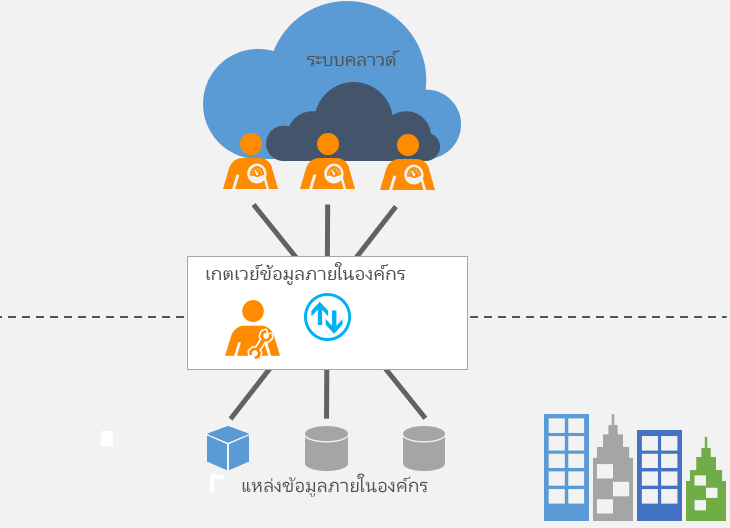

# เกตเวย์ข้อมูลในองค์กรคืออะไร?What is an on-premises data gateway?

[!INCLUDE [gateway-rewrite](../includes/gateway-rewrite.md)]

เกตเวย์ข้อมูลภายในองค์กรทำหน้าที่เป็นสะพาน โดยให้บริการการถ่ายโอนข้อมูลที่รวดเร็วและปลอดภัยระหว่างข้อมูลภายในองค์กร (ข้อมูลที่ไม่ได้อยู่ในระบบคลาวด์) และบริการคลาวด์ของ Microsoft อีกหลายบริการThe on-premises data gateway acts as a bridge to provide quick and secure data transfer between on-premises data (data that isn't in the cloud) and several Microsoft cloud services. บริการคลาวด์เหล่านี้ประกอบรวมด้วย Power BI, PowerApps, Power Automate, Azure Analysis Services และ Azure Logic AppsThese cloud services include Power BI, PowerApps, Power Automate, Azure Analysis Services, and Azure Logic Apps. โดยการใช้เกตเวย์ องค์กรสามารถเก็บฐานข้อมูลและแหล่งข้อมูลอื่น ๆ บนเครือข่ายภายในองค์กรของตนได้ และยังใช้ข้อมูลภายในองค์กรในบริการคลาวด์ได้อย่างปลอดภัยBy using a gateway, organizations can keep databases and other data sources on their on-premises networks, yet securely use that on-premises data in cloud services.

## เกตเวย์ทำงานอย่างไรHow the gateway works

สำหรับข้อมูลเพิ่มเติมเกี่ยวกับวิธีการทำงานของเกตเวย์ โปรดดูที่[สถาปัตยกรรมของเกตเวย์ข้อมูลภายในองค์กร](/data-integration/gateway/service-gateway-onprem-indepth)For more information on how the gateway works, see [On-premises data gateway architecture](/data-integration/gateway/service-gateway-onprem-indepth).

## เกตเวย์ประเภทต่าง ๆTypes of gateways

มีเกตเวย์สองชนิดที่แตกต่างกันสำหรับสถานการณ์ที่แตกต่างกัน:There are two different types of gateways, each for a different scenario:

* **เกตเวย์ข้อมูลภายในองค์กร** อนุญาตให้ผู้ใช้หลายรายเชื่อมต่อกับแหล่งข้อมูลภายในองค์กรหลายรายการได้**On-premises data gateway** allows multiple users to connect to multiple on-premises data sources. คุณสามารถใช้เกตเวย์ข้อมูลภายในองค์กรพร้อมด้วยบริการที่สนับสนุนทั้งหมดได้ด้วยการติดตั้งเกตเวย์เพียงครั้งเดียวYou can use an on-premises data gateway with all supported services, with a single gateway installation. เกตเวย์นี้เหมาะอย่างยิ่งสำหรับสถานการณ์ที่ซับซ้อน ซึ่งผู้ใช้หลายคนสามารถเข้าถึงแหล่งข้อมูลหลายรายการได้This gateway is well-suited to complex scenarios with multiple people accessing multiple data sources.

* **เกตเวย์ข้อมูลภายในองค์กร (โหมดส่วนบุคคล)** อนุญาตให้ผู้ใช้หนึ่งคนเชื่อมต่อกับแหล่งข้อมูล และไม่สามารถแชร์กับบุคคลอื่นได้**On-premises data gateway (personal mode)** allows one user to connect to sources, and can’t be shared with others. เกตเวย์ข้อมูลภายในองค์กร (โหมดส่วนบุคคล) สามารถใช้กับ Power BI ได้เท่านั้นAn on-premises data gateway (personal mode) can be used only with Power BI. เกตเวย์นี้เหมาะที่สุดกับสถานการณ์ที่คุณเป็นเพียงบุคคลเดียวที่สร้างรายงาน และคุณไม่จำเป็นต้องใช้แหล่งข้อมูลใด ๆ ร่วมกันกับผู้อื่นThis gateway is well-suited to scenarios where you’re the only person who creates reports, and you don't need to share any data sources with others.

## ใช้เกตเวย์Use a gateway

มีสี่ขั้นตอนหลักสำหรับการใช้เกตเวย์There are four main steps for using a gateway.

1. [ดาวน์โหลดและติดตั้งเกตเวย์](/data-integration/gateway/service-gateway-install)บนคอมพิวเตอร์เฉพาะที่[Download and install the gateway](/data-integration/gateway/service-gateway-install) on a local computer.
1. [กำหนดค่า](/data-integration/gateway/service-gateway-app)เกตเวย์โดยอ้างอิงจากไฟร์วอลล์ของคุณและข้อกำหนดของเครือข่ายอื่น ๆ[Configure](/data-integration/gateway/service-gateway-app) the gateway based on your firewall and other network requirements.
1. [เพิ่มผู้ดูแลระบบเกตเวย์](/data-integration/gateway/service-gateway-manage) ซึ่งสามารถจัดการและดูแลข้อกำหนดของเครือข่ายอื่น ๆ ได้ด้วย[Add gateway admins](/data-integration/gateway/service-gateway-manage) who can also manage and administer other network requirements.
1. [ใช้เกตเวย์](service-gateway-sql-tutorial.md) เพื่อรีเฟรชแหล่งข้อมูลภายในองค์กร[Use the gateway](service-gateway-sql-tutorial.md) to refresh an on-premises data source.
1. [แก้ไขปัญหา](service-gateway-onprem-tshoot.md)เกตเวย์ในกรณีที่เกิดข้อผิดพลาด[Troubleshoot](service-gateway-onprem-tshoot.md) the gateway in case of errors.

## ขั้นตอนถัดไปNext steps

* [ติดตั้งเกตเวย์ข้อมูลภายในองค์กรInstall the on-premises data gateway](/data-integration/gateway/service-gateway-install)

มีคำถามเพิ่มเติมหรือไม่More questions? [ลองไปที่ชุมชน Power BITry the Power BI Community](https://community.powerbi.com/)
