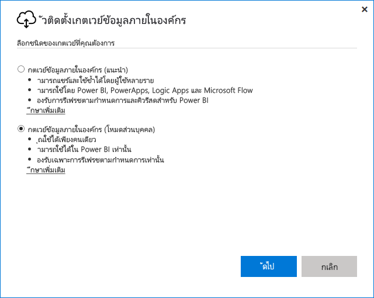

# <a name="use-personal-gateways-in-power-bi"></a><span data-ttu-id="37118-103">ใช้เกตเวย์ส่วนบุคคลใน Power BI</span><span class="sxs-lookup"><span data-stu-id="37118-103">Use personal gateways in Power BI</span></span>

[!INCLUDE [gateway-rewrite](../includes/gateway-rewrite.md)]

<span data-ttu-id="37118-104">เกตเวย์ข้อมูลภายในองค์กร (โหมดส่วนบุคคล) เป็นเวอร์ชันของเกตเวย์ข้อมูลภายในองค์กรที่ทำงานกับ Power BI เท่านั้น</span><span class="sxs-lookup"><span data-stu-id="37118-104">The on-premises data gateway (personal mode) is a version of the on-premises data gateway that works only with Power BI.</span></span> <span data-ttu-id="37118-105">คุณสามารถใช้เกตเวย์ส่วนบุคคลในการติดตั้งเกตเวย์บนคอมพิวเตอร์ของตนเอง และรับสิทธิ์การเข้าถึงข้อมูลภายในองค์กรได้</span><span class="sxs-lookup"><span data-stu-id="37118-105">You can use a personal gateway to install a gateway on your own computer and gain access to on-premises data.</span></span>

> [!NOTE]
> <span data-ttu-id="37118-106">คุณสามารถใช้ได้เพียงหนึ่งเกตเวย์โหมดส่วนบุคคลสำหรับผู้ใช้ Power BI แต่ละคน</span><span class="sxs-lookup"><span data-stu-id="37118-106">You can have only one personal mode gateway running for each Power BI user.</span></span> <span data-ttu-id="37118-107">ถ้าคุณติดตั้งเกตเวย์โหมดส่วนบุคคล อีกตัวสำหรับผู้ใช้เดียวกัน ถึงแม้ว่าจะอยู่บนคอมพิวเตอร์คนละเครื่อง การติดตั้งล่าสุดจะแทนที่การติดตั้งก่อนหน้านี้</span><span class="sxs-lookup"><span data-stu-id="37118-107">If you install another personal mode gateway for the same user, even on a different computer, the most recent installation replaces the existing previous installation.</span></span>

## <a name="on-premises-data-gateway-vs-on-premises-data-gateway-personal-mode"></a><span data-ttu-id="37118-108">เกตเวย์ข้อมูลภายในองค์กรเทียบกับเกตเวย์ข้อมูลภายในองค์กร (โหมดส่วนบุคคล)</span><span class="sxs-lookup"><span data-stu-id="37118-108">On-premises data gateway vs. on-premises data gateway (personal mode)</span></span>

<span data-ttu-id="37118-109">ตารางต่อไปนี้จะอธิบายความแตกต่างระหว่างเกตเวย์ข้อมูลภายในองค์กรและเกตเวย์ข้อมูลภายในองค์กร (โหมดส่วนบุคคล)</span><span class="sxs-lookup"><span data-stu-id="37118-109">The following table describes differences between an on-premises data gateway and an on-premises data gateway (personal mode).</span></span>

|   |<span data-ttu-id="37118-110">เกตเวย์ข้อมูลภายในองค์กร</span><span class="sxs-lookup"><span data-stu-id="37118-110">On-premises data gateway</span></span> | <span data-ttu-id="37118-111">เกตเวย์ข้อมูลภายในองค์กร (โหมดส่วนบุคคล)</span><span class="sxs-lookup"><span data-stu-id="37118-111">On-premises data gateway (personal mode)</span></span> |
| ---- | ---- | ---- |
|<span data-ttu-id="37118-112">**บริการระบบคลาวด์ที่ได้รับการสนับสนุน**</span><span class="sxs-lookup"><span data-stu-id="37118-112">**Cloud services supported**</span></span> |<span data-ttu-id="37118-113">Power BI, PowerApps, Azure Logic Apps, Power Automate, Azure Analysis Services, Data Flows</span><span class="sxs-lookup"><span data-stu-id="37118-113">Power BI, PowerApps, Azure Logic Apps, Power Automate, Azure Analysis Services, dataflows</span></span> |<span data-ttu-id="37118-114">Power BI</span><span class="sxs-lookup"><span data-stu-id="37118-114">Power BI</span></span> |
|<span data-ttu-id="37118-115">**เรียกใช้**</span><span class="sxs-lookup"><span data-stu-id="37118-115">**Runs**</span></span> |<span data-ttu-id="37118-116">ตามที่กำหนดค่าโดยผู้ใช้ที่มีสิทธิ์เข้าถึงเกตเวย์</span><span class="sxs-lookup"><span data-stu-id="37118-116">As configured by users who have access to the gateway</span></span> |<span data-ttu-id="37118-117">เช่นเดียวกับคุณสำหรับการรับรองความถูกต้องของ Windows และการกำหนดค่าโดยคุณสำหรับชนิดการรับรองความถูกต้องอื่นๆ</span><span class="sxs-lookup"><span data-stu-id="37118-117">As you for Windows authentication and as configured by you for other authentication types</span></span> |
|<span data-ttu-id="37118-118">**สามารถติดตั้งได้เฉพาะในฐานะผู้ดูแลระบบคอมพิวเตอร์เท่านั้น**</span><span class="sxs-lookup"><span data-stu-id="37118-118">**Can install only as computer admin**</span></span> |<span data-ttu-id="37118-119">ใช่</span><span class="sxs-lookup"><span data-stu-id="37118-119">Yes</span></span> |<span data-ttu-id="37118-120">ไม่ใช่</span><span class="sxs-lookup"><span data-stu-id="37118-120">No</span></span> |
|<span data-ttu-id="37118-121">**เกตเวย์ส่วนกลางและการจัดการแหล่งข้อมูล**</span><span class="sxs-lookup"><span data-stu-id="37118-121">**Centralized gateway and data source management**</span></span> |<span data-ttu-id="37118-122">ใช่</span><span class="sxs-lookup"><span data-stu-id="37118-122">Yes</span></span> |<span data-ttu-id="37118-123">ไม่ใช่</span><span class="sxs-lookup"><span data-stu-id="37118-123">No</span></span> |
|<span data-ttu-id="37118-124">**นำเข้าข้อมูลและกำหนดเวลาการรีเฟรช**</span><span class="sxs-lookup"><span data-stu-id="37118-124">**Import data and schedule refresh**</span></span> |<span data-ttu-id="37118-125">ใช่</span><span class="sxs-lookup"><span data-stu-id="37118-125">Yes</span></span> |<span data-ttu-id="37118-126">ใช่</span><span class="sxs-lookup"><span data-stu-id="37118-126">Yes</span></span> |
|<span data-ttu-id="37118-127">**การสนับสนุน DirectQuery**</span><span class="sxs-lookup"><span data-stu-id="37118-127">**DirectQuery support**</span></span> |<span data-ttu-id="37118-128">ใช่</span><span class="sxs-lookup"><span data-stu-id="37118-128">Yes</span></span> |<span data-ttu-id="37118-129">ไม่ใช่</span><span class="sxs-lookup"><span data-stu-id="37118-129">No</span></span> |
|<span data-ttu-id="37118-130">**การสนับสนุน LiveConnect สำหรับ Analysis Services**</span><span class="sxs-lookup"><span data-stu-id="37118-130">**LiveConnect support for Analysis Services**</span></span> |<span data-ttu-id="37118-131">ใช่</span><span class="sxs-lookup"><span data-stu-id="37118-131">Yes</span></span> |<span data-ttu-id="37118-132">ไม่ใช่</span><span class="sxs-lookup"><span data-stu-id="37118-132">No</span></span> |

## <a name="install-the-on-premises-data-gateway-personal-mode"></a><span data-ttu-id="37118-133">ติดตั้งเกตเวย์ข้อมูลภายในองค์กร (โหมดส่วนบุคคล)</span><span class="sxs-lookup"><span data-stu-id="37118-133">Install the on-premises data gateway (personal mode)</span></span>

<span data-ttu-id="37118-134">วิธีการติดตั้งเกตเวย์ข้อมูลภายในองค์กร (โหมดส่วนบุคคล)</span><span class="sxs-lookup"><span data-stu-id="37118-134">To install the on-premises data gateway (personal mode):</span></span>

1. <span data-ttu-id="37118-135">[ดาวน์โหลดเกตเวย์ข้อมูลภายในองค์กร](https://go.microsoft.com/fwlink/?LinkId=820925&clcid=0x409)</span><span class="sxs-lookup"><span data-stu-id="37118-135">[Download the on-premises data gateway](https://go.microsoft.com/fwlink/?LinkId=820925&clcid=0x409).</span></span>

2. <span data-ttu-id="37118-136">ในตัวติดตั้ง เลือกเกตเวย์ข้อมูลภายในองค์กร (โหมดส่วนบุคคล) แล้วเลือก **ถัดไป**</span><span class="sxs-lookup"><span data-stu-id="37118-136">In the installer, select the on-premises data gateway (personal mode), and then select **Next**.</span></span>

   

<span data-ttu-id="37118-138">ไฟล์เกตเวย์ได้รับการติดตั้งแล้วใน _"%localappdata%\microsoft\On-premises data data gateway (โหมดส่วนบุคคล)_</span><span class="sxs-lookup"><span data-stu-id="37118-138">The gateway files are installed in _"%localappdata%\Microsoft\On-premises data gateway (personal mode)_.</span></span> <span data-ttu-id="37118-139">หลังจากการติดตั้งเสร็จสิ้นแล้วและคุณได้ลงชื่อเข้าใช้แล้ว คุณจะเห็นหน้าจอต่อไปนี้</span><span class="sxs-lookup"><span data-stu-id="37118-139">After the installation finishes successfully and you sign in, you see the following screen.</span></span>


## <a name="use-fast-combine-with-the-personal-gateway"></a><span data-ttu-id="37118-141">ใช้ Fast Combine กับเกตเวย์ส่วนบุคคล</span><span class="sxs-lookup"><span data-stu-id="37118-141">Use Fast Combine with the personal gateway</span></span>

<span data-ttu-id="37118-142">การรวมอย่างรวดเร็วบนเกตเวย์ส่วนบุคคลจะช่วยให้คุณสามารถข้ามระดับความเป็นส่วนตัวที่ระบุในขณะที่ดำเนินการคิวรี</span><span class="sxs-lookup"><span data-stu-id="37118-142">Fast Combine on a personal gateway helps you ignore specified privacy levels while executing queries.</span></span> <span data-ttu-id="37118-143">เมื่อต้องการเปิดใช้งานการรวมอย่างรวดเร็วเพื่อให้สามารถดำเนินการกับเกตเวย์ข้อมูลภายในองค์กร (โหมดส่วนบุคคล) ได้:</span><span class="sxs-lookup"><span data-stu-id="37118-143">To enable Fast Combine to work with the on-premises data gateway (personal mode):</span></span>

1. <span data-ttu-id="37118-144">ใช้ File Explorer เปิดไฟล์ต่อไปนี้:</span><span class="sxs-lookup"><span data-stu-id="37118-144">Using File Explorer, open the following file:</span></span>

   `%localappdata%\Microsoft\On-premises data gateway (personal mode)\Microsoft.PowerBI.DataMovement.Pipeline.GatewayCore.dll.config`

2. <span data-ttu-id="37118-145">ที่ด้านล่างของไฟล์ ให้เพิ่มข้อความต่อไปนี้:</span><span class="sxs-lookup"><span data-stu-id="37118-145">At the bottom of the file, add the following text:</span></span>

    ```xml
    <setting name="EnableFastCombine" serializeAs="String">
       <value>true</value>
    </setting>
    ```

3. <span data-ttu-id="37118-146">เมื่อเสร็จสมบูรณ์ การตั้งค่าจะมีผลในเวลาประมาณหนึ่งนาที</span><span class="sxs-lookup"><span data-stu-id="37118-146">After it finishes, the setting takes effect in approximately one minute.</span></span> <span data-ttu-id="37118-147">หากต้องการตรวจสอบว่าสามารถทำงานได้อย่างถูกต้องหรือไม่ ลองใช้การรีเฟรชตามต้องการในบริการของ Power BI เพื่อยืนยันว่า Fast Combine กำลังทำงานอยู่</span><span class="sxs-lookup"><span data-stu-id="37118-147">To check that it's working properly, try an on-demand refresh in the Power BI service to confirm that Fast Combine is working.</span></span>

## <a name="frequently-asked-questions-faq"></a><span data-ttu-id="37118-148">คำถามที่พบบ่อย (FAQ)</span><span class="sxs-lookup"><span data-stu-id="37118-148">Frequently asked questions (FAQ)</span></span>

<span data-ttu-id="37118-149">**คำถาม:** ฉันสามารถเรียกใช้เกตเวย์ข้อมูลภายในองค์กร (โหมดส่วนบุคคล) พร้อมกันกับเกตเวย์ข้อมูลภายในองค์กร (ก่อนหน้านี้เรียกว่าเกตเวย์เวอร์ชันสำหรับองค์กร) ได้หรือไม่</span><span class="sxs-lookup"><span data-stu-id="37118-149">**Question:** Can I run the on-premises data gateway (personal mode) side by side with the on-premises data gateway (previously known as the Enterprise version of the gateway)?</span></span>
  
<span data-ttu-id="37118-150">**คำตอบ:** ได้ เกตเวย์ทั้งสองอย่างสามารถทำงานพร้อมกันได้</span><span class="sxs-lookup"><span data-stu-id="37118-150">**Answer:** Yes, both gateways can run simultaneously.</span></span>

<span data-ttu-id="37118-151">**คำถาม:** ฉันสามารถเรียกใช้เกตเวย์ข้อมูลภายในองค์กร (โหมดส่วนบุคคล) เป็นบริการได้หรือไม่</span><span class="sxs-lookup"><span data-stu-id="37118-151">**Question:** Can I run the on-premises data gateway (personal mode) as a service?</span></span>
  
<span data-ttu-id="37118-152">**คำตอบ:** หมายเลข</span><span class="sxs-lookup"><span data-stu-id="37118-152">**Answer:** No.</span></span> <span data-ttu-id="37118-153">เกตเวย์ข้อมูลภายในองค์กร (โหมดส่วนบุคคล) จะสามารถเรียกใช้เป็นแอปพลิเคชันเท่านั้น</span><span class="sxs-lookup"><span data-stu-id="37118-153">The on-premises data gateway (personal mode) can run only as an application.</span></span> <span data-ttu-id="37118-154">หากคุณต้องการใช้เกตเวย์เป็นบริการหรือในโหมดผู้ดูแลระบบ คุณอาจจะต้องใช้ [เกตเวย์ข้อมูลภายในองค์กร](/data-integration/gateway/service-gateway-onprem) (ก่อนหน้านี้เรียกว่า เกตเวย์เวอร์ชันสำหรับองค์กร)</span><span class="sxs-lookup"><span data-stu-id="37118-154">If you need to run the gateway as a service or in admin mode, you need to consider the [on-premises data gateway](/data-integration/gateway/service-gateway-onprem) (previously known as the Enterprise gateway).</span></span>

<span data-ttu-id="37118-155">**คำถาม:** มีการอัปเดตเกตเวย์ข้อมูลภายในองค์กร (โหมดส่วนบุคคล) บ่อยเพียงใด</span><span class="sxs-lookup"><span data-stu-id="37118-155">**Question:** How often is the on-premises data gateway (personal mode) updated?</span></span>
  
<span data-ttu-id="37118-156">**คำตอบ:** เราวางแผนที่จะอัปเดตเกตเวย์ส่วนบุคคลเป็นรายเดือน</span><span class="sxs-lookup"><span data-stu-id="37118-156">**Answer:** We plan to update the personal gateway monthly.</span></span>

<span data-ttu-id="37118-157">**คำถาม:** เหตุใดฉันจึงต้องอัปเดตข้อมูลประจำตัวของฉัน</span><span class="sxs-lookup"><span data-stu-id="37118-157">**Question:** Why am I asked to update my credentials?</span></span>
  
<span data-ttu-id="37118-158">**คำตอบ:** มีหลายสถานการณ์ก่อให้เกิดการร้องขอข้อมูลประจำตัวได้</span><span class="sxs-lookup"><span data-stu-id="37118-158">**Answer:** Many situations can trigger a request for credentials.</span></span> <span data-ttu-id="37118-159">โดยทั่วไปคุณจะติดตั้งเกตเวย์ข้อมูลภายในองค์กร (โหมดส่วนบุคคล) อีกครั้งไว้ในเครื่องอื่นนอกเหนือจาก Power BI - เกตเวย์ส่วนบุคคลของคุณ</span><span class="sxs-lookup"><span data-stu-id="37118-159">The most common is that you've reinstalled the on-premises data gateway (personal mode) on a different machine than your Power BI - personal gateway.</span></span> <span data-ttu-id="37118-160">นอกจากนี้อาจเป็นปัญหาจากแหล่งข้อมูลและ Power BI ที่ไม่สามารถทำการเชื่อมต่อการทดสอบ หรือหมดเวลา หรือเกิดข้อผิดพลาดของระบบได้</span><span class="sxs-lookup"><span data-stu-id="37118-160">It could also be an issue in the data source, and Power BI failed to perform a test connection, or a timeout or a system error occurred.</span></span> <span data-ttu-id="37118-161">หากต้องการอัปเดตข้อมูลประจำตัวของคุณในบริการของ Power BI ให้เลือกไอคอนรูปเฟืองและเลือก **การตั้งค่า** > **ชุดข้อมูล**</span><span class="sxs-lookup"><span data-stu-id="37118-161">To update your credentials in the Power BI service, select the gear icon and select **Settings** > **Datasets**.</span></span> <span data-ttu-id="37118-162">ค้นหาชุดข้อมูลที่ลงสัยและเลือก **ข้อมูลประจำตัวของแหล่งข้อมูล**</span><span class="sxs-lookup"><span data-stu-id="37118-162">Find the dataset in question, and select **Data source credentials**.</span></span>

<span data-ttu-id="37118-163">**คำถาม:** เกตเวย์ส่วนบุคคลของฉันรุ่นก่อนหน้านี้จะออฟไลน์นานเท่าใดระหว่างการอัปเกรด</span><span class="sxs-lookup"><span data-stu-id="37118-163">**Question:** How long will my previous personal gateway be offline during the upgrade?</span></span>
  
<span data-ttu-id="37118-164">**คำตอบ:** การอัปเกรดเกตเวย์ส่วนบุคคลไปเป็นรุ่นใหม่ควรใช้เวลาเพียงไม่กี่นาทีเท่านั้น</span><span class="sxs-lookup"><span data-stu-id="37118-164">**Answer:** Upgrading the personal gateway to the new version takes only few minutes.</span></span>

<span data-ttu-id="37118-165">**คำถาม:** ฉันกำลังใช้สคริปต์ R และสคริปต์ Python</span><span class="sxs-lookup"><span data-stu-id="37118-165">**Question:** I'm using R and Python scripts.</span></span> <span data-ttu-id="37118-166">ได้รับการสนับสนุนหรือไม่</span><span class="sxs-lookup"><span data-stu-id="37118-166">Are they supported?</span></span>
  
<span data-ttu-id="37118-167">**คำตอบ:** สคริปต์ R และสคริปต์ Python ได้รับการรองรับสำหรับโหมดส่วนบุคคล</span><span class="sxs-lookup"><span data-stu-id="37118-167">**Answer:** R and Python scripts are supported for personal mode.</span></span>

## <a name="next-steps"></a><span data-ttu-id="37118-168">ขั้นตอนถัดไป</span><span class="sxs-lookup"><span data-stu-id="37118-168">Next steps</span></span>

* [<span data-ttu-id="37118-169">เพิ่มหรือลบแหล่งข้อมูลเกตเวย์</span><span class="sxs-lookup"><span data-stu-id="37118-169">Add or remove a gateway data source</span></span>](service-gateway-data-sources.md)
* [<span data-ttu-id="37118-170">การกำหนดค่าพร็อกซีสำหรับเกตเวย์ข้อมูลภายในองค์กร</span><span class="sxs-lookup"><span data-stu-id="37118-170">Configuring proxy settings for the on-premises data gateway</span></span>](/data-integration/gateway/service-gateway-proxy)  

<span data-ttu-id="37118-171">มีคำถามเพิ่มเติมหรือไม่</span><span class="sxs-lookup"><span data-stu-id="37118-171">More questions?</span></span> <span data-ttu-id="37118-172">ลองไปที่ [ชุมชน Power BI](https://community.powerbi.com/)</span><span class="sxs-lookup"><span data-stu-id="37118-172">Try the [Power BI Community](https://community.powerbi.com/).</span></span>
