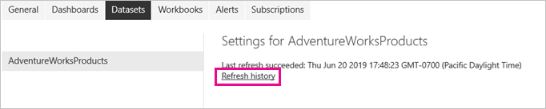

# <a name="refresh-data-from-an-on-premises-sql-server-database"></a><span data-ttu-id="8fe98-103">รีเฟรชข้อมูลจากฐานข้อมูล SQL Server ภายในองค์กร</span><span class="sxs-lookup"><span data-stu-id="8fe98-103">Refresh data from an on-premises SQL Server database</span></span>

<span data-ttu-id="8fe98-104">ในบทช่วยสอนนี้ คุณจะสำรวจวิธีการรีเฟรชชุดข้อมูล Power BI จากฐานข้อมูลเชิงสัมพันธ์ที่มีอยู่ภายในองค์กรในเครือข่ายเฉพาะที่ของคุณ</span><span class="sxs-lookup"><span data-stu-id="8fe98-104">In this tutorial, you explore how to refresh a Power BI dataset from a relational database that exists on premises in your local network.</span></span> <span data-ttu-id="8fe98-105">โดยเฉพาะ บทช่วยสอนนี้ใช้ฐานข้อมูล SQL Server ตัวอย่าง ซึ่ง Power BI ต้องเข้าถึงผ่านเกตเวย์ข้อมูลภายในองค์กร</span><span class="sxs-lookup"><span data-stu-id="8fe98-105">Specifically, this tutorial uses a sample SQL Server database, which Power BI must access through an on-premises data gateway.</span></span>

<span data-ttu-id="8fe98-106">ในบทช่วยสอนนี้ คุณจะทำขั้นตอนต่อไปนี้ให้เสร็จสมบูรณ์:</span><span class="sxs-lookup"><span data-stu-id="8fe98-106">In this tutorial, you complete the following steps:</span></span>

> [!div class="checklist"]
> * <span data-ttu-id="8fe98-107">สร้าง และเผยแพร่ไฟล์ Power BI Desktop (.pbix) ที่นำเข้าข้อมูลจากฐานข้อมูล SQL Server ภายในองค์กร</span><span class="sxs-lookup"><span data-stu-id="8fe98-107">Create and publish a Power BI Desktop (.pbix) file that imports data from an on-premises SQL Server database.</span></span>
> * <span data-ttu-id="8fe98-108">กำหนดการตั้งค่าชุดข้อมูลและแหล่งข้อมูลใน Power BI สำหรับการเชื่อมต่อ SQL Server ผ่านเกตเวย์ข้อมูล</span><span class="sxs-lookup"><span data-stu-id="8fe98-108">Configure data source and dataset settings in Power BI for SQL Server connectivity through a data gateway.</span></span>
> * <span data-ttu-id="8fe98-109">กำหนดตารางการรีเฟรชเพื่อให้แน่ใจว่าชุดข้อมูล Power BI ของคุณมีข้อมูลล่าสุด</span><span class="sxs-lookup"><span data-stu-id="8fe98-109">Configure a refresh schedule to ensure your Power BI dataset has recent data.</span></span>
> * <span data-ttu-id="8fe98-110">ดำเนินการรีเฟรชตามความต้องการของชุดข้อมูล</span><span class="sxs-lookup"><span data-stu-id="8fe98-110">Perform an on-demand refresh of your dataset.</span></span>
> * <span data-ttu-id="8fe98-111">ตรวจสอบประวัติการรีเฟรชเพื่อวิเคราะห์ผลลัพธ์ของรอบการรีเฟรชในอดีต</span><span class="sxs-lookup"><span data-stu-id="8fe98-111">Review the refresh history to analyze the outcomes of past refresh cycles.</span></span>
> * <span data-ttu-id="8fe98-112">ล้างแหล่งข้อมูล โดยการลบอาร์ทิแฟกต์ที่สร้างขึ้นในบทช่วยสอนนี้</span><span class="sxs-lookup"><span data-stu-id="8fe98-112">Clean up resources by deleting the artifacts created in this tutorial.</span></span>

## <a name="prerequisites"></a><span data-ttu-id="8fe98-113">ข้อกำหนดเบื้องต้น</span><span class="sxs-lookup"><span data-stu-id="8fe98-113">Prerequisites</span></span>

- <span data-ttu-id="8fe98-114">ถ้าคุณไม่มี ให้ลงทะเบียนสำหรับ[ทดลองใช้ Power BI ฟรี](https://app.powerbi.com/signupredirect?pbi_source=web)ก่อนที่จะเริ่ม</span><span class="sxs-lookup"><span data-stu-id="8fe98-114">If you don't already have one, sign up for a [free Power BI trial](https://app.powerbi.com/signupredirect?pbi_source=web) before you begin.</span></span>
- <span data-ttu-id="8fe98-115">[ติดตั้ง Power BI Desktop](https://powerbi.microsoft.com/desktop/) ภายในคอมพิวเตอร์</span><span class="sxs-lookup"><span data-stu-id="8fe98-115">[Install Power BI Desktop](https://powerbi.microsoft.com/desktop/) on a local computer.</span></span>
- <span data-ttu-id="8fe98-116">[ติดตั้ง SQL Server](/sql/database-engine/install-windows/install-sql-server) ภายในคอมพิวเตอร์ และคืนค่า [ฐานข้อมูลตัวอย่างจากการสำรองข้อมูล](https://github.com/Microsoft/sql-server-samples/releases/download/adventureworks/AdventureWorksDW2017.bak)</span><span class="sxs-lookup"><span data-stu-id="8fe98-116">[Install SQL Server](/sql/database-engine/install-windows/install-sql-server) on a local computer, and restore the [sample database from a backup](https://github.com/Microsoft/sql-server-samples/releases/download/adventureworks/AdventureWorksDW2017.bak).</span></span> <span data-ttu-id="8fe98-117">สำหรับข้อมูลเพิ่มเติมเกี่ยวกับ AdventureWorks ให้ดู [การติดตั้งและการกำหนดค่า AdventureWorks](/sql/samples/adventureworks-install-configure)</span><span class="sxs-lookup"><span data-stu-id="8fe98-117">For more information about AdventureWorks, see [AdventureWorks installation and configuration](/sql/samples/adventureworks-install-configure).</span></span>
- <span data-ttu-id="8fe98-118">[ติดตั้งเกตเวย์ข้อมูลภายในองค์กร](service-gateway-onprem.md) ภายในคอมพิวเตอร์เครื่องเดียวกันเป็น SQL Server (แต่ในการใช้งานจริง มักจะเป็นคอมพิวเตอร์คนละเครื่อง)</span><span class="sxs-lookup"><span data-stu-id="8fe98-118">[Install an on-premises data gateway](service-gateway-onprem.md) on the same local computer as SQL Server (in production, it would typically be a different computer).</span></span>

> [!NOTE]
> <span data-ttu-id="8fe98-119">ถ้าคุณไม่ได้เป็นผู้ดูแลระบบเกตเวย์ และไม่ต้องการติดตั้งเกตเวย์ด้วยตนเอง ติดต่อผู้ดูแลระบบเกตเวย์ในองค์กรของคุณ</span><span class="sxs-lookup"><span data-stu-id="8fe98-119">If you're not a gateway administrator and don't want to install a gateway yourself, contact a gateway administrator in your organization.</span></span> <span data-ttu-id="8fe98-120">พวกเขาสามารถสร้างข้อกำหนดแหล่งข้อมูลที่จำเป็นต้องมีการเชื่อมต่อชุดข้อมูลของคุณลงในฐานข้อมูล SQL Server</span><span class="sxs-lookup"><span data-stu-id="8fe98-120">They can create the required data source definition to connect your dataset to your SQL Server database.</span></span>

## <a name="create-and-publish-a-power-bi-desktop-file"></a><span data-ttu-id="8fe98-121">สร้าง และเผยแพร่ไฟล์ Power BI Desktop</span><span class="sxs-lookup"><span data-stu-id="8fe98-121">Create and publish a Power BI Desktop file</span></span>

<span data-ttu-id="8fe98-122">ใช้ขั้นตอนต่อไปนี้เพื่อสร้างรายงาน Power BI พื้นฐานโดยใช้ฐานข้อมูลตัวอย่าง AdventureWorksDW</span><span class="sxs-lookup"><span data-stu-id="8fe98-122">Use the following procedure to create a basic Power BI report using the AdventureWorksDW sample database.</span></span> <span data-ttu-id="8fe98-123">เผยแพร่รายงานไปยังบริการของ Power BI เพื่อให้คุณรับชุดข้อมูลใน Power BI ซึ่งคุณสามารถกำหนดค่าแล้ว และรีเฟรชในขั้นตอนต่อไป</span><span class="sxs-lookup"><span data-stu-id="8fe98-123">Publish the report to the Power BI service, so that you get a dataset in Power BI, which you can then configure and refresh in subsequent steps.</span></span>

1. <span data-ttu-id="8fe98-124">ใน Power BI Desktop บนแท็บ **หน้าแรก** ให้เลือก **รับข้อมูล** \> **SQL Server**</span><span class="sxs-lookup"><span data-stu-id="8fe98-124">In Power BI Desktop, on the **Home** tab, select **Get Data** \> **SQL Server**.</span></span>

2. <span data-ttu-id="8fe98-125">ในกล่องโต้ตอบ **ฐานข้อมูล SQL Server** ให้ใส่ชื่อ **เซิร์ฟเวอร์** และ **ฐานข้อมูล (ไม่บังคับ)** ชื่อ ให้แน่ใจว่า **โหมดการเชื่อมต่อข้อมูล** เป็น **นำเข้า** แล้ว เลือก **ตกลง**</span><span class="sxs-lookup"><span data-stu-id="8fe98-125">In the **SQL Server database** dialog box, enter the **Server** and **Database (optional)** names, make sure the **Data Connectivity mode** is **Import**, and then select **OK**.</span></span>

    

    <span data-ttu-id="8fe98-127">เราไม่ได้ใช้ **ตัวเลือกขั้นสูง**  ในบทช่วยสอนนี้แต่โปรดทราบว่าคุณสามารถระบุคำสั่ง SQL และตั้งค่าตัวเลือกอื่นๆเช่นการใช้ [SQL Server ล้มเหลว](/sql/database-engine/availability-groups/windows/failover-clustering-and-always-on-availability-groups-sql-server)</span><span class="sxs-lookup"><span data-stu-id="8fe98-127">We're not using **Advanced options** in this tutorial, but note that you can specify a SQL statement and set other options like using [SQL Server Failover](/sql/database-engine/availability-groups/windows/failover-clustering-and-always-on-availability-groups-sql-server).</span></span>

    

3. <span data-ttu-id="8fe98-129">ตรวจสอบ **ข้อมูลประจำตัว** ของคุณ จากนั้นเลือก **เชื่อมต่อ**</span><span class="sxs-lookup"><span data-stu-id="8fe98-129">Verify your **credentials**, then select **Connect**.</span></span>

    > [!NOTE]
    > <span data-ttu-id="8fe98-130">ถ้าคุณไม่สามารถรับรองความถูกต้องได้ ให้แน่ใจว่าคุณได้เลือกวิธีการรับรองความถูกต้องที่ถูกต้อง และใช้บัญชีผู้ใช้ที่มีสิทธิเข้าถึงฐานข้อมูล</span><span class="sxs-lookup"><span data-stu-id="8fe98-130">If you're unable to authenticate, make sure you select the correct authentication method and use an account with database access.</span></span> <span data-ttu-id="8fe98-131">ในสภาพแวดล้อมการทดสอบ คุณอาจใช้การรับรองความถูกต้องของฐานข้อมูลด้วยชื่อผู้ใช้และรหัสผ่านที่ชัดเจน</span><span class="sxs-lookup"><span data-stu-id="8fe98-131">In test environments, you might use Database authentication with an explicit username and password.</span></span> <span data-ttu-id="8fe98-132">ในสภาพแวดล้อมการทำงานจริง คุณมักใช้การรับรองความถูกต้องของ Windows</span><span class="sxs-lookup"><span data-stu-id="8fe98-132">In production environments, you typically use Windows authentication.</span></span> <span data-ttu-id="8fe98-133">ดูที่ [การแก้ไขปัญหาสถานการณ์การรีเฟรช](refresh-troubleshooting-refresh-scenarios.md)และติดต่อผู้ดูแลระบบฐานข้อมูลสำหรับความช่วยเหลือเพิ่มเติม</span><span class="sxs-lookup"><span data-stu-id="8fe98-133">Refer to [Troubleshooting refresh scenarios](refresh-troubleshooting-refresh-scenarios.md) and contact your database administrator for additional assistance.</span></span>

1. <span data-ttu-id="8fe98-134">ถ้ากล่องโต้ตอบ **การสนับสนุนการเข้ารหัสลับ** ปรากฏขึ้น ให้เลือก **ตกลง**</span><span class="sxs-lookup"><span data-stu-id="8fe98-134">If an **Encryption Support** dialog box appears, select **OK**.</span></span>

2. <span data-ttu-id="8fe98-135">ในกล่องโต้ตอบ **ตัวนำทาง** ให้เลือกตาราง **DimProduct** จากนั้นเลือก **โหลด**</span><span class="sxs-lookup"><span data-stu-id="8fe98-135">In the **Navigator** dialog box, select the **DimProduct** table, then select **Load**.</span></span>

    

3. <span data-ttu-id="8fe98-137">ใน Power BI Desktop มุมมอง **รายงาน** ในบานหน้าต่าง **การจัดรูปแบบการแสดงข้อมูล** เลือก **แผนภูมิคอลัมน์แบบเรียงซ้อน**</span><span class="sxs-lookup"><span data-stu-id="8fe98-137">In the Power BI Desktop **Report** view, in the **Visualizations** pane, select the **Stacked column chart**.</span></span>

    

4. <span data-ttu-id="8fe98-139">ด้วยแผนภูมิคอลัมน์ที่เลือกในพื้นที่รายงาน ในบานหน้าต่าง **เขตข้อมูล** เลือกเขตข้อมูล **EnglishProductName** และ **ListPrice**</span><span class="sxs-lookup"><span data-stu-id="8fe98-139">With the column chart selected in the report canvas, in the **Fields** pane select the **EnglishProductName** and **ListPrice** fields.</span></span>

    

5. <span data-ttu-id="8fe98-141">ลาก **วันที่สิ้นสุด** ลงบน **ตัวกรองระดับรายงาน** และภายใต้ **การกรองพื้นฐาน** เลือกเฉพาะกล่องกาเครื่องหมายสำหรับ **(ว่าง)**</span><span class="sxs-lookup"><span data-stu-id="8fe98-141">Drag the **EndDate** onto **Report level filters**, and under **Basic filtering** select only the checkbox for **(Blank)**.</span></span>

    

    <span data-ttu-id="8fe98-143">ตอนนี้แผนภูมิควรมีลักษณะดังต่อไปนี้</span><span class="sxs-lookup"><span data-stu-id="8fe98-143">The chart should now look like the following.</span></span>

    

    <span data-ttu-id="8fe98-145">โปรดทราบว่าผลิตภัณฑ์ **Road-250** 5 รายการจะแสดงพร้อมด้วยรายการราคาสูงสุด</span><span class="sxs-lookup"><span data-stu-id="8fe98-145">Notice that the five **Road-250** products are listed with the highest list price.</span></span> <span data-ttu-id="8fe98-146">ซึ่งจะเปลี่ยนแปลงเมื่อคุณอัปเดตข้อมูลและรีเฟรชรายงานในภายหลัง ในบทช่วยสอนนี้</span><span class="sxs-lookup"><span data-stu-id="8fe98-146">This will change when you update the data and refresh the report later in this tutorial.</span></span>

6. <span data-ttu-id="8fe98-147">บันทึกรายงานโดยใช้ชื่อ "AdventureWorksProducts.pbix"</span><span class="sxs-lookup"><span data-stu-id="8fe98-147">Save the report with the name "AdventureWorksProducts.pbix".</span></span>

7. <span data-ttu-id="8fe98-148">บนแท็บ **หน้าแรก** ให้เลือก **เผยแพร่** \> **พื้นที่ทำงานของฉัน** \> **เลือก**</span><span class="sxs-lookup"><span data-stu-id="8fe98-148">On the **Home** tab select **Publish** \> **My Workspace** \> **Select**.</span></span> <span data-ttu-id="8fe98-149">ลงชื่อเข้าใช้ไปยังบริการของ Power BI ถ้าคุณถูกขอให้ทำเช่นนั้น</span><span class="sxs-lookup"><span data-stu-id="8fe98-149">Sign in to the Power BI service if you're asked to do so.</span></span>

8. <span data-ttu-id="8fe98-150">บนหน้าจอ **สำเร็จ** เลือก **เปิด 'TestGatewayDocs.pbix' ใน Power BI**</span><span class="sxs-lookup"><span data-stu-id="8fe98-150">On the **Success** screen, select **Open 'AdventureWorksProducts.pbix' in Power BI**.</span></span>

    [<span data-ttu-id="8fe98-151">เผยแพร่ไปยัง Power BI</span><span class="sxs-lookup"><span data-stu-id="8fe98-151">Publish to Power BI</span></span>](./media/service-gateway-sql-tutorial/publish-to-power-bi.png)

## <a name="connect-a-dataset-to-a-sql-server-database"></a><span data-ttu-id="8fe98-152">เชื่อมต่อชุดข้อมูลกับฐานข้อมูล SQL Server</span><span class="sxs-lookup"><span data-stu-id="8fe98-152">Connect a dataset to a SQL Server database</span></span>

<span data-ttu-id="8fe98-153">ใน Power BI Desktop คุณได้เชื่อมต่อกับฐานข้อมูล SQL Server ภายในองค์กรของคุณโดยตรง แต่บริการของ Power BI ต้องใช้เกตเวย์ข้อมูลเพื่อทำหน้าที่เป็นสะพานเชื่อมระหว่างคลาวด์และเครือข่ายภายในองค์กรของคุณ</span><span class="sxs-lookup"><span data-stu-id="8fe98-153">In Power BI Desktop, you connected directly to your on-premises SQL Server database, but the Power BI service requires a data gateway to act as a bridge between the cloud and your on-premises network.</span></span> <span data-ttu-id="8fe98-154">ทำตามขั้นตอนเหล่านี้เพื่อเพิ่มฐานข้อมูล SQL Server ภายในองค์กรของคุณเป็นแหล่งข้อมูลในเกตเวย์ เชื่อมต่อชุดข้อมูลของคุณกับแหล่งข้อมูลนี้</span><span class="sxs-lookup"><span data-stu-id="8fe98-154">Follow these steps to add your on-premises SQL Server database as a data source to a gateway and then connect your dataset to this data source.</span></span>

1. <span data-ttu-id="8fe98-155">ลงชื่อเข้าใช้ไปยัง Power BI</span><span class="sxs-lookup"><span data-stu-id="8fe98-155">Sign in to Power BI.</span></span> <span data-ttu-id="8fe98-156">ในมุมขวาบน เลือกไอคอนรูปเฟืองการตั้งค่า จากนั้นเลือก **การตั้งค่า**</span><span class="sxs-lookup"><span data-stu-id="8fe98-156">In the upper-right corner, select the settings gear icon and then select **Settings**.</span></span>

    

2. <span data-ttu-id="8fe98-158">บนการ **ชุดข้อมูล** แท็บ เลือกชุดข้อมูล **AdventureWorksProducts** ดังนั้นคุณสามารถเชื่อมต่อกับฐานข้อมูล SQL Server ภายในองค์กรของคุณผ่านเกตเวย์ข้อมูล</span><span class="sxs-lookup"><span data-stu-id="8fe98-158">On the **Datasets** tab, select the dataset **AdventureWorksProducts**, so you can connect to your on-premises SQL Server database through a data gateway.</span></span>

3. <span data-ttu-id="8fe98-159">ขยาย **การเชื่อมต่อเกตเวย์** และตรวจสอบว่ามีอย่างน้อยหนึ่งเกตเวย์อยู่ในรายการ</span><span class="sxs-lookup"><span data-stu-id="8fe98-159">Expand **Gateway connection** and verify that at least one gateway is listed.</span></span> <span data-ttu-id="8fe98-160">ถ้าคุณไม่มีเกตเวย์ ดูส่วน [ข้อกำหนดเบื้องต้น](#prerequisites) ก่อนหน้าในบทช่วยสอนนี้สำหรับลิงก์ไปยังเอกสารประกอบของผลิตภัณฑ์สำหรับการติดตั้งและการกำหนดค่าเกตเวย์</span><span class="sxs-lookup"><span data-stu-id="8fe98-160">If you don't have a gateway, see the [Prerequisites](#prerequisites) section earlier in this tutorial for a link to the product documentation for installing and configuring a gateway.</span></span>

    

4. <span data-ttu-id="8fe98-162">ภายใต้ **การดำเนินการ** ขยายปุ่มสลับเพื่อดูแหล่งข้อมูล และเลือกลิงก์ **เพิ่มไปยังเกตเวย์**</span><span class="sxs-lookup"><span data-stu-id="8fe98-162">Under **Actions**, expand the toggle button to view the data sources and select the **Add to gateway** link.</span></span>

    

    > [!NOTE]
    > <span data-ttu-id="8fe98-164">ถ้าคุณไม่ได้เป็นผู้ดูแลระบบเกตเวย์ และไม่ต้องการติดตั้งเกตเวย์ด้วยตนเอง ติดต่อผู้ดูแลระบบเกตเวย์ในองค์กรของคุณ</span><span class="sxs-lookup"><span data-stu-id="8fe98-164">If you're not a gateway administrator and don't want to install a gateway yourself, contact a gateway administrator in your organization.</span></span> <span data-ttu-id="8fe98-165">พวกเขาสามารถสร้างข้อกำหนดแหล่งข้อมูลที่จำเป็นต้องมีการเชื่อมต่อชุดข้อมูลของคุณลงในฐานข้อมูล SQL Server</span><span class="sxs-lookup"><span data-stu-id="8fe98-165">They can create the required data source definition to connect your dataset to your SQL Server database.</span></span>

5. <span data-ttu-id="8fe98-166">บนหน้าการจัดการ **เกตเวย์** บนแท็บ **การตั้งค่าแหล่งข้อมูล** ใส่และตรวจสอบข้อมูลต่อไปนี้ แล้วเลือก **เพิ่ม**</span><span class="sxs-lookup"><span data-stu-id="8fe98-166">On the **Gateways** management page, on the **Data Source Settings** tab, enter and verify the following information, and select **Add**.</span></span>

    | <span data-ttu-id="8fe98-167">ตัวเลือก</span><span class="sxs-lookup"><span data-stu-id="8fe98-167">Option</span></span> | <span data-ttu-id="8fe98-168">Value</span><span class="sxs-lookup"><span data-stu-id="8fe98-168">Value</span></span> |
    | --- | --- |
    | <span data-ttu-id="8fe98-169">ชื่อแหล่งข้อมูล</span><span class="sxs-lookup"><span data-stu-id="8fe98-169">Data Source Name</span></span> | <span data-ttu-id="8fe98-170">AdventureWorksProducts</span><span class="sxs-lookup"><span data-stu-id="8fe98-170">AdventureWorksProducts</span></span> |
    | <span data-ttu-id="8fe98-171">ชนิดแหล่งข้อมูล</span><span class="sxs-lookup"><span data-stu-id="8fe98-171">Data Source Type</span></span> | <span data-ttu-id="8fe98-172">เซิร์ฟเวอร์ SQL</span><span class="sxs-lookup"><span data-stu-id="8fe98-172">SQL Server</span></span> |
    | <span data-ttu-id="8fe98-173">เซิร์ฟเวอร์</span><span class="sxs-lookup"><span data-stu-id="8fe98-173">Server</span></span> | <span data-ttu-id="8fe98-174">ชื่อของอินสแตนซ์ SQL Server ของคุณ เช่น SQLServer01 (ต้องเหมือนกับสิ่งที่คุณได้ระบุไว้ใน Power BI Desktop)</span><span class="sxs-lookup"><span data-stu-id="8fe98-174">The name of your SQL Server instance, such as SQLServer01 (must be identical to what you specified in Power BI Desktop).</span></span> |
    | <span data-ttu-id="8fe98-175">ฐานข้อมูล</span><span class="sxs-lookup"><span data-stu-id="8fe98-175">Database</span></span> | <span data-ttu-id="8fe98-176">ชื่อของฐานข้อมูล SQL Server ของคุณ เช่น AdventureWorksDW (ต้องเหมือนกับสิ่งที่คุณได้ระบุไว้ใน Power BI Desktop)</span><span class="sxs-lookup"><span data-stu-id="8fe98-176">The name of your SQL Server database, such as AdventureWorksDW (must be identical to what you specified in Power BI Desktop).</span></span> |
    | <span data-ttu-id="8fe98-177">วิธีการรับรองความถูกต้อง</span><span class="sxs-lookup"><span data-stu-id="8fe98-177">Authentication Method</span></span> | <span data-ttu-id="8fe98-178">Windows หรือพื้นฐาน (โดยทั่วไปแล้วคือ Windows)</span><span class="sxs-lookup"><span data-stu-id="8fe98-178">Windows or Basic (typically Windows).</span></span> |
    | <span data-ttu-id="8fe98-179">ชื่อผู้ใช้</span><span class="sxs-lookup"><span data-stu-id="8fe98-179">Username</span></span> | <span data-ttu-id="8fe98-180">บัญชีที่คุณใช้เพื่อเชื่อมต่อกับ SQL Server</span><span class="sxs-lookup"><span data-stu-id="8fe98-180">The user account you use to connect to SQL Server.</span></span> |
    | <span data-ttu-id="8fe98-181">รหัสผ่าน</span><span class="sxs-lookup"><span data-stu-id="8fe98-181">Password</span></span> | <span data-ttu-id="8fe98-182">รหัสผ่านสำหรับบัญชีที่คุณใช้เพื่อเชื่อมต่อกับ SQL Server</span><span class="sxs-lookup"><span data-stu-id="8fe98-182">The password for the account you use to connect to SQL Server.</span></span> |

    

6. <span data-ttu-id="8fe98-184">บนแท็บ **ชุดข้อมูล** ขยายส่วน **การเชื่อมต่อเกตเวย์** อีกครั้ง</span><span class="sxs-lookup"><span data-stu-id="8fe98-184">On the **Datasets** tab, expand the **Gateway connection** section again.</span></span> <span data-ttu-id="8fe98-185">เลือกเกตเวย์ข้อมูลที่คุณกำหนดค่า ซึ่งแสดง **สถานะ** ของการใช้งานบนเครื่องที่คุณติดตั้ง และเลือก **นำไปใช้**</span><span class="sxs-lookup"><span data-stu-id="8fe98-185">Select the data gateway you configured, which shows a **Status** of running on the machine where you installed it, and select **Apply**.</span></span>

    

## <a name="configure-a-refresh-schedule"></a><span data-ttu-id="8fe98-187">กำหนดตารางเวลาการรีเฟรช</span><span class="sxs-lookup"><span data-stu-id="8fe98-187">Configure a refresh schedule</span></span>

<span data-ttu-id="8fe98-188">ตอนนี้คุณได้เชื่อมต่อชุดข้อมูลใน Power BI กับฐานข้อมูล SQL Server ภายในองค์กรผ่านเกตเวย์ข้อมูล ทำตามขั้นตอนเหล่านี้เพื่อกำหนดตารางเวลาการรีเฟรช</span><span class="sxs-lookup"><span data-stu-id="8fe98-188">Now you've connected your dataset in Power BI to your SQL Server database on-premises through a data gateway, follow these steps to configure a refresh schedule.</span></span> <span data-ttu-id="8fe98-189">การรีเฟรชชุดข้อมูลตามกำหนดการช่วยให้แน่ใจว่ารายงานและแดชบอร์ดของคุณมีข้อมูลล่าสุด</span><span class="sxs-lookup"><span data-stu-id="8fe98-189">Refreshing your dataset on a scheduled basis helps to ensure that your reports and dashboards have the most recent data.</span></span>

1. <span data-ttu-id="8fe98-190">ในบานหน้าต่างการนำทาง ให้เลือก **พื้นที่ทำงานของฉัน** \> **ชุดข้อมูล**</span><span class="sxs-lookup"><span data-stu-id="8fe98-190">In the nav pane, open **My Workspace** \> **Datasets**.</span></span> <span data-ttu-id="8fe98-191">เลือกจุดไข่ปลา ( **...** ) สำหรับชุดข้อมูล **AdventureWorksProducts** ชุดข้อมูล แล้วเลือก **กำหนดการรีเฟรช**</span><span class="sxs-lookup"><span data-stu-id="8fe98-191">Select the ellipsis (**. . .**) for the **AdventureWorksProducts** dataset, then select **Schedule refresh**.</span></span>

    > [!NOTE]
    > <span data-ttu-id="8fe98-192">ให้แน่ใจว่าคุณเลือกจุดไข่ปลาสำหรับชุดข้อมูล **AdventureWorksProducts** และไม่ใช่จุดไข่ปลาสำหรับรายงานที่มีชื่อเดียวกัน</span><span class="sxs-lookup"><span data-stu-id="8fe98-192">Make sure you select the ellipsis for the **AdventureWorksProducts** dataset and not the ellipsis for the report with the same name.</span></span> <span data-ttu-id="8fe98-193">เมนูบริบทของรายงาน **AdventureWorksProducts** ไม่รวมตัวเลือก **กำหนดการรีเฟรช**</span><span class="sxs-lookup"><span data-stu-id="8fe98-193">The context menu of the **AdventureWorksProducts** report does not include a **Schedule refresh** option.</span></span>

2. <span data-ttu-id="8fe98-194">ในส่วน **รีเฟรชตามกำหนดเวลา** ภายใต้ **ปรับปรุงข้อมูลของคุณอยู่เสมอ** ตั้งค่ารีเฟรชเป็น **เปิด**</span><span class="sxs-lookup"><span data-stu-id="8fe98-194">In the **Scheduled refresh** section, under **Keep your data up to date**, set refresh to **On**.</span></span>

3. <span data-ttu-id="8fe98-195">เลือก **ความถี่ในการรีเฟรช** ที่เหมาะสม (**ทุกวัน** สำหรับตัวอย่างนี้), จากนั้นภายใต้ **เวลา** ให้เลือก **เพิ่มเวลาอื่น** เมื่อต้องระบุเวลาการรีเฟรชที่ต้องการ (6:30 AM และ PM ตัวอย่างนี้)</span><span class="sxs-lookup"><span data-stu-id="8fe98-195">Select an appropriate **Refresh frequency**, ( **Daily** for this example), and then under **Time**, select **Add another time** to specify the desired refresh time (6:30 AM and PM for this example).</span></span>

    

    > [!NOTE]
    > <span data-ttu-id="8fe98-197">คุณสามารถกำหนดค่าช่วงเวลาการรีเฟรชสูงสุด 8 ครั้งต่อวันหากชุดข้อมูลของคุณอยู่ในความจุที่ใช้ร่วมกันหรือ 48 ครั้งต่อวันสำหรับ Power BI Premium</span><span class="sxs-lookup"><span data-stu-id="8fe98-197">You can configure up to 8 daily time slots if your dataset is on shared capacity, or 48 time slots on Power BI Premium.</span></span>

4. <span data-ttu-id="8fe98-198">ยกเลิกการเปิดใช้งานกล่องกาเครื่องหมาย **ส่งอีเมลแจ้งเตือนความล้มเหลวในการรีเฟรชถึงฉัน** และเลือก **นำไปใช้**</span><span class="sxs-lookup"><span data-stu-id="8fe98-198">Leave the checkbox **Send refresh failure notification emails to me** enabled and select **Apply**.</span></span>

## <a name="perform-an-on-demand-refresh"></a><span data-ttu-id="8fe98-199">ดำเนินการรีเฟรชตามความต้องการ</span><span class="sxs-lookup"><span data-stu-id="8fe98-199">Perform an on-demand refresh</span></span>

<span data-ttu-id="8fe98-200">หลังจากที่คุณได้กำหนดตารางเวลาการรีเฟรชแล้ว Power BI จะรีเฟรชชุดข้อมูลของคุณในเวลาที่กำหนดไว้ถัดไปภายในช่วงระยะเวลา 15 นาที</span><span class="sxs-lookup"><span data-stu-id="8fe98-200">Now that you've configured a refresh schedule, Power BI refreshes your dataset at the next scheduled time, within a margin of 15 minutes.</span></span> <span data-ttu-id="8fe98-201">หากคุณต้องการรีเฟรชข้อมูลเร็วขึ้นเช่น เพื่อทดสอบเกตเวย์และการกำหนดค่าแหล่งข้อมูลของคุณ ให้ทำการรีเฟรชตามคำขอโดยใช้ตัวเลือก **รีเฟรชเดี๋ยวนี้** ในเมนูชุดข้อมูลในบานหน้าต่างนำทาง</span><span class="sxs-lookup"><span data-stu-id="8fe98-201">If you want to refresh the data sooner, such as to test your gateway and data source configuration, perform an on-demand refresh by using the **Refresh Now** option in the dataset menu in the nav pane.</span></span> <span data-ttu-id="8fe98-202">การรีเฟรชตามความต้องการไม่มีผลต่อเวลาการรีเฟรชตามกำหนดเวลาช่วงถัดไป แต่จะนับรวมขีดจำกัดการรีเฟรชประจำวันตามที่อธิบายไว้ในบทความก่อนหน้านี้</span><span class="sxs-lookup"><span data-stu-id="8fe98-202">On-demand refreshes don't affect the next scheduled refresh time, but they count against the daily refresh limit, mentioned in the previous section.</span></span>

<span data-ttu-id="8fe98-203">สำหรับวัตถุประสงค์ จำลองการเปลี่ยนแปลงในข้อมูลตัวอย่างโดยการอัปเดตตาราง DimProduct ในฐานข้อมูล AdventureWorksDW ที่ใช้ SQL Server Management Studio (SSMS)</span><span class="sxs-lookup"><span data-stu-id="8fe98-203">For illustration purposes, simulate a change to the sample data by updating the DimProduct table in the AdventureWorksDW database using SQL Server Management Studio (SSMS).</span></span>

```sql

UPDATE [AdventureWorksDW].[dbo].[DimProduct]
SET ListPrice = 5000
WHERE EnglishProductName ='Road-250 Red, 58'

```

<span data-ttu-id="8fe98-204">ตอนนี้ทำตามขั้นตอนเหล่านี้เพื่อให้ข้อมูลที่อัปเดตสามารถไหลผ่านการเชื่อมต่อเกตเวย์ไปยังชุดข้อมูลและเข้าไปยังรายงานใน Power BI</span><span class="sxs-lookup"><span data-stu-id="8fe98-204">Now follow these steps so the updated data can flow through the gateway connection to the dataset and into the reports in Power BI.</span></span>

1. <span data-ttu-id="8fe98-205">ในการบริการของ Power BI ในบานหน้าต่างนำทาง ให้เลือกและขยาย **พื้นที่ทำงานของฉัน**</span><span class="sxs-lookup"><span data-stu-id="8fe98-205">In the Power BI Service, in the nav pane, select and expand **My Workspace**.</span></span>

2. <span data-ttu-id="8fe98-206">ภายใต้ **ชุดข้อมูล** สำหรับชุดข้อมูล **AdventureWorksProducts** เลือกจุดไข่ปลา ( **...** ) แล้ว เลือก **รีเฟรชเดี๋ยวนี้**</span><span class="sxs-lookup"><span data-stu-id="8fe98-206">Under **Datasets**, for the **AdventureWorksProducts** dataset, select the ellipsis (**. . .**) then select **Refresh now**.</span></span>

    

    <span data-ttu-id="8fe98-208">บันทึกย่อในมุมบนขวา ว่า Power BI ่กำลังเตรียมดำเนินการรีเฟรชที่ร้องขอ</span><span class="sxs-lookup"><span data-stu-id="8fe98-208">Note in the upper right corner, that Power BI is preparing to perform the requested refresh.</span></span>

3. <span data-ttu-id="8fe98-209">เลือก **พื้นที่ทำงานของฉัน\> รายงาน\> AdventureWorksProducts**</span><span class="sxs-lookup"><span data-stu-id="8fe98-209">Select **My Workspace \> Reports \> AdventureWorksProducts**.</span></span> <span data-ttu-id="8fe98-210">ดูวิธีการที่ข้อมูลที่อัปเดตแล้วไหลผ่าน และผลิตภัณฑ์ที่มีรายการราคาสูงสุดตอนนี้คือ **Road-250 Red, 58**</span><span class="sxs-lookup"><span data-stu-id="8fe98-210">See how the updated data flowed through, and the product with the highest list price is now **Road-250 Red, 58**.</span></span>

    

## <a name="review-the-refresh-history"></a><span data-ttu-id="8fe98-212">ตรวจสอบประวัติการรีเฟรช</span><span class="sxs-lookup"><span data-stu-id="8fe98-212">Review the refresh history</span></span>

<span data-ttu-id="8fe98-213">ควรตรวจสอบผลลัพธ์ของรอบการรีเฟรชผ่านมาเป็นระยะ ๆ ในประวัติการรีเฟรช</span><span class="sxs-lookup"><span data-stu-id="8fe98-213">It is a good idea to check the outcomes of past refresh cycles periodically in the refresh history.</span></span> <span data-ttu-id="8fe98-214">ข้อมูลประจำตัวของฐานข้อมูลอาจหมดอายุแล้ว หรือเกตเวย์ที่เลือกอาจมีอยู่ในสถานะออฟไลน์เมื่อครบกำหนดการรีเฟรชตามกำหนดเวลา</span><span class="sxs-lookup"><span data-stu-id="8fe98-214">Database credentials might have expired, or the selected gateway might have been offline when a scheduled refresh was due.</span></span> <span data-ttu-id="8fe98-215">ทำตามขั้นตอนเหล่านี้เพื่อตรวจสอบประวัติการรีเฟรชและตรวจหาปัญหา</span><span class="sxs-lookup"><span data-stu-id="8fe98-215">Follow these steps to examine the refresh history and check for issues.</span></span>

1. <span data-ttu-id="8fe98-216">ในมุมขวาบนของอินเทอร์เฟสผู้ใช้ Power BI เลือกไอคอนรูปเฟืองการตั้งค่า จากนั้นเลือก **การตั้งค่า**</span><span class="sxs-lookup"><span data-stu-id="8fe98-216">In the upper-right corner of the Power BI user interface, select the settings gear icon and then select **Settings**.</span></span>

2. <span data-ttu-id="8fe98-217">สลับไปยัง **ชุดข้อมูล** และเลือกชุดข้อมูล เช่น **AdventureWorksProducts** หากคุณต้องการตรวจสอบ</span><span class="sxs-lookup"><span data-stu-id="8fe98-217">Switch to **Datasets** and select the dataset, such as **AdventureWorksProducts**, you want to examine.</span></span>

3. <span data-ttu-id="8fe98-218">เลือกลิงก์ **ประวัติการรีเฟรช** เพื่อเปิดกล่องโต้ตอบ **ประวัติการรีเฟรช**</span><span class="sxs-lookup"><span data-stu-id="8fe98-218">Select the **Refresh history** link to open the **Refresh history** dialog.</span></span>

    

4. <span data-ttu-id="8fe98-220">บนแท็บ **ตามกำหนดเวลา** สังเกตการรีเฟรชตามกำหนดเวลาและตามความต้องการด้วยเวลา **เริ่มต้น** และ **สิ้นสุด** และ **สถานะ** ที่ **เสร็จสมบูรณ์** ซึ่งระบุว่า Power BI ได้ดำเนินการรีเฟรชเรียบร้อยแล้ว</span><span class="sxs-lookup"><span data-stu-id="8fe98-220">On the **Scheduled** tab, notice the past scheduled and on-demand refreshes with their **Start** and **End** times, and a **Status** of **Completed**, which indicates that Power BI performed the refreshes successfully.</span></span> <span data-ttu-id="8fe98-221">สำหรับการรีเฟรชล้มเหลว คุณสามารถดูข้อความแสดงข้อผิดพลาด และตรวจสอบรายละเอียดข้อผิดพลาด</span><span class="sxs-lookup"><span data-stu-id="8fe98-221">For failed refreshes, you can see the error message and examine error details.</span></span>

    

    > [!NOTE]
    > <span data-ttu-id="8fe98-223">แท็บ OneDrive จะเกี่ยวข้องกับชุดข้อมูลที่เชื่อมต่อกับไฟล์ Power BI Desktop เวิร์กบุ๊ก Excel หรือไฟล์ CSV ใน OneDrive หรือ SharePoint Online ตามที่อธิบายไว้ในรายละเอียดเพิ่มเติมใน [รีเฟรชข้อมูลใน Power BI](refresh-data.md)</span><span class="sxs-lookup"><span data-stu-id="8fe98-223">The OneDrive tab is only relevant for datasets connected to Power BI Desktop files, Excel workbooks, or CSV files on OneDrive or SharePoint Online, as explained in more detail in [Data refresh in Power BI](refresh-data.md).</span></span>

## <a name="clean-up-resources"></a><span data-ttu-id="8fe98-224">เพิ่มพื้นที่ทรัพยากร</span><span class="sxs-lookup"><span data-stu-id="8fe98-224">Clean up resources</span></span>

<span data-ttu-id="8fe98-225">ถ้าคุณไม่ต้องการใช้ข้อมูลตัวอย่างอีกต่อไป วางฐานข้อมูลใน SQL Server Management Studio (SSMS)</span><span class="sxs-lookup"><span data-stu-id="8fe98-225">If you don't want to use the sample data anymore, drop the database in SQL Server Management Studio (SSMS).</span></span> <span data-ttu-id="8fe98-226">ถ้าคุณไม่ต้องการใช้แหล่งข้อมูล SQL Server ให้ลบแหล่งข้อมูลออกจากเกตเวย์ข้อมูลของคุณ</span><span class="sxs-lookup"><span data-stu-id="8fe98-226">If you don't want to use the SQL Server data source, remove the data source from your data gateway.</span></span> <span data-ttu-id="8fe98-227">นอกจากนี้ ให้พิจารณาถอนการติดตั้งเกตเวย์ข้อมูลถ้าคุณเพียงแค่ติดตั้งไว้เพื่อวัตถุประสงค์ในการทำให้บทช่วยสอนนี้สมบูรณ์</span><span class="sxs-lookup"><span data-stu-id="8fe98-227">Also consider uninstalling the data gateway if you only installed it for the purposes of completing this tutorial.</span></span> <span data-ttu-id="8fe98-228">คุณยังควรลบชุดข้อมูล AdventureWorksProducts และรายงาน AdventureWorksProducts ที่ Power BI สร้างขึ้นเมื่อคุณอัปโหลดไฟล์ AdventureWorksProducts.pbix</span><span class="sxs-lookup"><span data-stu-id="8fe98-228">You should also delete the AdventureWorksProducts dataset and AdventureWorksProducts report that Power BI created when you uploaded the AdventureWorksProducts.pbix file.</span></span>

## <a name="next-steps"></a><span data-ttu-id="8fe98-229">ขั้นตอนถัดไป</span><span class="sxs-lookup"><span data-stu-id="8fe98-229">Next steps</span></span>

<span data-ttu-id="8fe98-230">ในบทช่วยสอนนี้ คุณได้สำรวจวิธีการนำเข้าข้อมูลจากฐานข้อมูล SQL Server ภายในองค์กรไปยังชุดข้อมูล Power BI และวิธีการรีเฟรชชุดข้อมูลนี้ตามกำหนดเวลาและตามความต้องการ เพื่อเก็บรายงานและแดชบอร์ดที่ใช้ชุดข้อมูลนี้ที่อัปเดตใน Power BI</span><span class="sxs-lookup"><span data-stu-id="8fe98-230">In this tutorial, you've explored how to import data from an on-premises SQL Server database into a Power BI dataset and how to refresh this dataset on a scheduled and on-demand basis to keep the reports and dashboards that use this dataset updated in Power BI.</span></span> <span data-ttu-id="8fe98-231">ตอนนี้ คุณสามารถเรียนรู้เพิ่มเติมเกี่ยวกับการจัดการเกตเวย์ข้อมูลและแหล่งข้อมูลใน Power BI</span><span class="sxs-lookup"><span data-stu-id="8fe98-231">Now you can learn more about managing data gateways and data sources in Power BI.</span></span> <span data-ttu-id="8fe98-232">นอกจากนี้ คุณยังควรตรวจสอบการรีเฟรชข้อมูลบทความเชิงแนวคิดใน Power BI</span><span class="sxs-lookup"><span data-stu-id="8fe98-232">It might also be a good idea to review the conceptual article Data Refresh in Power BI.</span></span>

- [<span data-ttu-id="8fe98-233">จัดการเกตเวย์ข้อมูลภายในองค์กร</span><span class="sxs-lookup"><span data-stu-id="8fe98-233">Manage an on-premises data gateway</span></span>](/data-integration/gateway/service-gateway-manage)
- [<span data-ttu-id="8fe98-234">จัดการแหล่งข้อมูลของคุณ - นำเข้า/รีเฟรชตามกำหนดการ</span><span class="sxs-lookup"><span data-stu-id="8fe98-234">Manage your data source - Import/Scheduled Refresh</span></span>](service-gateway-enterprise-manage-scheduled-refresh.md)
- [<span data-ttu-id="8fe98-235">การรีเฟรชข้อมูลใน Power BI</span><span class="sxs-lookup"><span data-stu-id="8fe98-235">Data refresh in Power BI</span></span>](refresh-data.md)
