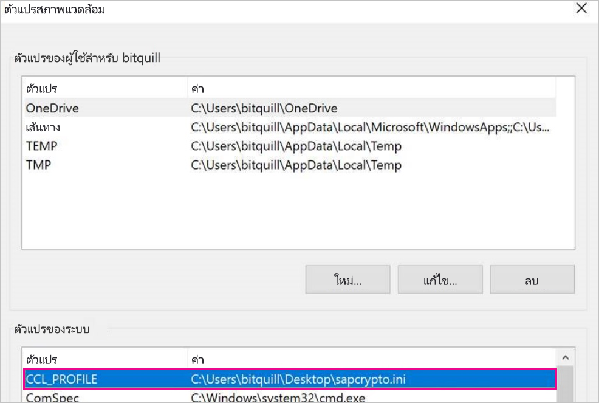

# <a name="use-kerberos-single-sign-on-for-sso-to-sap-bw-using-commoncryptolib-sapcryptodll"></a><span data-ttu-id="71779-103">ใช้การลงชื่อเข้าระบบแบบครั้งเดียวของ Kerberos สำหรับ SSO ไปยัง SAP เท่ากับการใช้ CommonCryptoLib (sapcrypto.dll)</span><span class="sxs-lookup"><span data-stu-id="71779-103">Use Kerberos single sign-on for SSO to SAP BW using CommonCryptoLib (sapcrypto.dll)</span></span>

<span data-ttu-id="71779-104">บทความนี้อธิบายวิธีกำหนดค่าแหล่งข้อมูล SAP BW ของคุณเพื่อเปิดใช้งาน SSO จากบริการของ Power BI โดยใช้ CommonCryptoLib (sapcrypto.dll)</span><span class="sxs-lookup"><span data-stu-id="71779-104">This article describes how to configure your SAP BW data source to enable SSO from the Power BI service by using CommonCryptoLib (sapcrypto.dll).</span></span>

> [!NOTE]
> <span data-ttu-id="71779-105">ก่อนที่คุณจะพยายามรีเฟรชรายงานที่ยึดกับ SAP BW ที่ใช้ Kerberos SSO ให้ทำตามทั้งขั้นตอนในบทความนี้และขั้นตอนใน [กำหนดค่า Kerberos SSO](service-gateway-sso-kerberos.md)</span><span class="sxs-lookup"><span data-stu-id="71779-105">Before you attempt to refresh a SAP BW-based report that uses Kerberos SSO, complete both the steps in this article and the steps in [Configure Kerberos SSO](service-gateway-sso-kerberos.md).</span></span> <span data-ttu-id="71779-106">การใช้CommonCryptoLib เป็นคลัง SNC สามารถทำให้การเชื่อมต่อ SSO ไปยังเซอร์เวอร์แอปพลิเคชัน SAP BW และเซอร์เวอร์ข้อความ SAP BW ได้</span><span class="sxs-lookup"><span data-stu-id="71779-106">Using CommonCryptoLib as your SNC library enables SSO connections to both SAP BW Application Servers and SAP BW Message Servers.</span></span>

## <a name="configure-sap-bw-to-enable-sso-using-commoncryptolib"></a><span data-ttu-id="71779-107">กำหนดค่า SAP BWเพื่อเปิดการใช้งาน SSO โดยใช้ CommonCryptoLib</span><span class="sxs-lookup"><span data-stu-id="71779-107">Configure SAP BW to enable SSO using CommonCryptoLib</span></span>

> [!NOTE]
> <span data-ttu-id="71779-108">เกตเวย์ข้อมูลภายในองค์กรเป็นซอฟ์ทแวร์ 64 บิท ดังนั้นจึงต้องการ CommonCryptoLib (sapcrypto.dll) เวอร์ชัน 64 บิทเพื่อดำเนินการ BW SSO</span><span class="sxs-lookup"><span data-stu-id="71779-108">The on-premises data gateway is 64-bit software and therefore requires the 64-bit version of CommonCryptoLib (sapcrypto.dll) to perform BW SSO.</span></span> <span data-ttu-id="71779-109">หากคุณวางแผนที่จะทดสอบการเชื่อมต่อ SSO เข้ากับเซิร์ฟเวอร์ SAP BW ใน SAP GUI ก่อนพยายามที่จะเชื่อมต่อ SSO ผ่านเกตเวย์ (แนะนำ) คุณจะต้องใช้ CommonCryptoLib เวอร์ชัน 32 บิทเนื่องจาก SAP GUI เป็นเวอร์ชัน 32 บิท</span><span class="sxs-lookup"><span data-stu-id="71779-109">If you plan to test the SSO connection to your SAP BW server in SAP GUI prior to attempting an SSO connection through the gateway (recommended), you'll also need the 32-bit version of CommonCryptoLib, as SAP GUI is 32-bit software.</span></span>

1. <span data-ttu-id="71779-110">ตรวจสอบให้แน่ใจว่าเซิร์ฟเวอร์ BW ได้รับการกำหนดค่าสำหรับ Kerberos SSO อย่างถูกต้องโดยใช้ CommonCryptoLib</span><span class="sxs-lookup"><span data-stu-id="71779-110">Ensure that your BW server is correctly configured for Kerberos SSO using CommonCryptoLib.</span></span> <span data-ttu-id="71779-111">ถ้าเป็นเช่นนั้น คุณสามารถใช้ SSO เพื่อเข้าถึงเซิร์ฟเวอร์ของคุณได้ (โดยตรงหรือผ่านเซิร์ฟเวอร์ข้อความของ SAP BW) ด้วยเครื่องมือ SAP เช่น SAP GUI ที่ได้รับการกำหนดค่าให้ใช้ CommonCryptoLib</span><span class="sxs-lookup"><span data-stu-id="71779-111">If it is, you can use SSO to access your BW server (either directly or through an SAP BW Message Server) with an SAP tool like SAP GUI that has been configured to use CommonCryptoLib.</span></span> 

   <span data-ttu-id="71779-112">สำหรับข้อมูลเพิ่มเติมเกี่ยวกับขั้นตอนการตั้งค่า ให้ดู[ SAP แบบลงชื่อเข้าระบบเพียงครั้งเดียว: รับรองความถูกต้องด้วย Kerberos/SPNEGO](https://blogs.sap.com/2017/07/27/sap-single-sign-on-authenticate-with-kerberosspnego/)</span><span class="sxs-lookup"><span data-stu-id="71779-112">For more information on setup steps, see [SAP Single Sign-On: Authenticate with Kerberos/SPNEGO](https://blogs.sap.com/2017/07/27/sap-single-sign-on-authenticate-with-kerberosspnego/).</span></span> <span data-ttu-id="71779-113">เซิร์ฟเวอร์ของคุณควรใช้ CommonCryptoLib เป็นไลบรารีของ SNC และมีชื่อ SNC ที่เริ่มต้นด้วย *CN =* เช่น *CN = BW1*</span><span class="sxs-lookup"><span data-stu-id="71779-113">Your BW server should use CommonCryptoLib as its SNC Library and have an SNC name that starts with *CN=*, such as *CN=BW1*.</span></span> <span data-ttu-id="71779-114">สำหรับข้อมูลเพิ่มเติมเกี่ยวกับข้อกำหนดของชื่อ SNC (โดยเฉพาะอย่างยิ่ง snc/ข้อมูลประจำตัว/เป็นพารามิเตอร์) ให้ดู[พารามิเตอร์ SNC สำหรับการกำหนดค่า Kerberos ](https://help.sap.com/viewer/df185fd53bb645b1bd99284ee4e4a750/3.0/360534094511490d91b9589d20abb49a.html)</span><span class="sxs-lookup"><span data-stu-id="71779-114">For more information on SNC name requirements (specifically, the snc/identity/as parameter), see [SNC Parameters for Kerberos Configuration](https://help.sap.com/viewer/df185fd53bb645b1bd99284ee4e4a750/3.0/360534094511490d91b9589d20abb49a.html).</span></span>

1. <span data-ttu-id="71779-115">หากคุณยังไม่ได้ดำเนินการดังกล่าว ให้ติดตั้งเวอร์ชั่น x64 ของ [SAP .NET Connector](https://support.sap.com/en/product/connectors/msnet.html) บนคอมพิวเตอร์ที่มีการติดตั้งเกตเวย์ไว้แล้ว</span><span class="sxs-lookup"><span data-stu-id="71779-115">If you haven't already done so, install the x64-version of the [SAP .NET Connector](https://support.sap.com/en/product/connectors/msnet.html) on the computer the gateway has been installed on.</span></span> 
   
   <span data-ttu-id="71779-116">คุณสามารถตรวจสอบว่ามีการติดตั้งคอมโพเนนต์โดยพยายามเชื่อมต่อกับเซิร์ฟเวอร์ BW ใน Power BI Desktop จากคอมพิวเตอร์เกตเวย์หรือไม่</span><span class="sxs-lookup"><span data-stu-id="71779-116">You can check whether the component has been installed by attempting to connect to your BW server in  Power BI Desktop from the gateway computer.</span></span> <span data-ttu-id="71779-117">ถ้าคุณไม่สามารถเชื่อมต่อโดยใช้การดำเนินการ 2.0 คุณจะไม่สามารถติดตั้ง .NET Connector หรือติดตั้งไปที่ GAC ได้</span><span class="sxs-lookup"><span data-stu-id="71779-117">If you can't connect by using the 2.0 implementation, the .NET Connector isn't installed or hasn't been installed to the GAC.</span></span>

1. <span data-ttu-id="71779-118">ตรวจสอบให้แน่ใจว่า SAP Secure Login Client (SLC) ไม่ได้ทำงานบนคอมพิวเตอร์ที่มีการติดตั้งเกตเวย์</span><span class="sxs-lookup"><span data-stu-id="71779-118">Ensure that SAP Secure Login Client (SLC) isn't running on the computer the gateway is installed on.</span></span> 

   <span data-ttu-id="71779-119">SLC จะแคชตั๋ว Kerberos ในลักษณะที่อาจรบกวนความสามารถของเกตเวย์เพื่อใช้ Kerberos สำหรับ SSO</span><span class="sxs-lookup"><span data-stu-id="71779-119">SLC caches Kerberos tickets in a way that can interfere with the gateway's ability to use Kerberos for SSO.</span></span> 

1. <span data-ttu-id="71779-120">ถ้ามีการติดตั้ง SLC ให้ถอนการติดตั้งหรือตรวจสอบให้แน่ใจว่าคุณออกจาก SAP Secure Login Client</span><span class="sxs-lookup"><span data-stu-id="71779-120">If SLC is installed, uninstall it or make sure you exit SAP Secure Login Client.</span></span> <span data-ttu-id="71779-121">คลิกขวาที่ไอคอนในถาดระบบและเลือก **ออกจากระบบ** และ **จบการทำงาน** ก่อนที่คุณจะพยายามเชื่อมต่อแบบ SSO โดยใช้เกตเวย์</span><span class="sxs-lookup"><span data-stu-id="71779-121">Right-click the icon in the system tray and select **Log Out** and **Exit** before you attempt an SSO connection by using the gateway.</span></span> 

   <span data-ttu-id="71779-122">SLC ไม่ได้รับการสนับสนุนสำหรับการใช้งานบนเครื่องเซิร์ฟเวอร์ของ Windows</span><span class="sxs-lookup"><span data-stu-id="71779-122">SLC isn't supported for use on Windows Server machines.</span></span> <span data-ttu-id="71779-123">สำหรับข้อมูลเพิ่มเติม ให้ดู [SAP Note 2780475](https://launchpad.support.sap.com/#/notes/2780475) (ต้องมีผู้ใช้ s)</span><span class="sxs-lookup"><span data-stu-id="71779-123">For more information, see [SAP Note 2780475](https://launchpad.support.sap.com/#/notes/2780475) (s-user required).</span></span>

   

1. <span data-ttu-id="71779-125">ถ้าคุณถอนการติดตั้ง SLC หรือเลือก **ออกจากระบบ** และ**จบการทำงาน** ให้เปิดหน้าต่าง cmd และใส่ `klist purge` เพื่อล้างตั๋ว Kerberos แบบ SSO ผ่านเกตเวย์</span><span class="sxs-lookup"><span data-stu-id="71779-125">If you uninstall SLC or select **Log Out** and **Exit**, open a cmd window and enter `klist purge` to clear any cached Kerberos tickets before you attempt an SSO connection through the gateway.</span></span>

1. <span data-ttu-id="71779-126">ดาวน์โหลด CommonCryptoLib 64 บิท (sapcrypto.dll) เวอร์ชั่น *8.5.25 หรือมากกว่า*จาก SAP Launchpad และคัดลอกไปยังโฟลเดอร์บนเครื่องเกตเวย์ของคุณ</span><span class="sxs-lookup"><span data-stu-id="71779-126">Download 64-bit CommonCryptoLib (sapcrypto.dll) version *8.5.25 or greater* from the SAP Launchpad, and copy it to a folder on your gateway machine.</span></span> <span data-ttu-id="71779-127">ในไดเรกทอรีเดียวกันกับที่คุณคัดลอก sapcrypto สร้างไฟล์ที่ชื่อ sapcrypto ด้วยเนื้อหาต่อไปนี้:</span><span class="sxs-lookup"><span data-stu-id="71779-127">In the same directory where you copied sapcrypto.dll, create a file named sapcrypto.ini, with the following content:</span></span>

    ```
    ccl/snc/enable_kerberos_in_client_role = 1
    ```

    <span data-ttu-id="71779-128">ไฟล์ .ini มีข้อมูลการกำหนดค่าที่จำเป็นโดย CommonCryptoLib เพื่อเปิดใช้งาน SSO ในสถานการณ์เกตเวย์</span><span class="sxs-lookup"><span data-stu-id="71779-128">The .ini file contains configuration information required by CommonCryptoLib to enable SSO in the gateway scenario.</span></span>

    > [!NOTE]
    > <span data-ttu-id="71779-129">ไฟล์เหล่านี้จะต้องถูกจัดเก็บไว้ในตำแหน่งที่ตั้งเดียวกัน อีกอย่างหนึ่ง _/path/to/sapcrypto/_ ควรมีทั้ง sapcrypto.ini และ sapcrypto.dll</span><span class="sxs-lookup"><span data-stu-id="71779-129">These files must be stored in the same location; in other words, _/path/to/sapcrypto/_ should contain both sapcrypto.ini and sapcrypto.dll.</span></span>

    <span data-ttu-id="71779-130">ทั้งผู้ใช้บริการเกตเวย์และผู้ใช้ Active Directory (AD) ที่ผู้ใช้บริการเลียนแบบจำเป็นต้องมีสิทธิ์ในการอ่านและการใช้งานสำหรับทั้งสองไฟล์</span><span class="sxs-lookup"><span data-stu-id="71779-130">Both the gateway service user and the Active Directory (AD) user that the service user impersonates need read and execute permissions for both files.</span></span> <span data-ttu-id="71779-131">เราขอแนะนำการให้สิทธิ์ทั้งไฟล์. ini และ. dll กับกลุ่มผู้ใช้ที่ได้รับการรับรองความถูกต้อง</span><span class="sxs-lookup"><span data-stu-id="71779-131">We recommend granting permissions on both the .ini and .dll files to the Authenticated Users group.</span></span> <span data-ttu-id="71779-132">สำหรับวัตถุประสงค์ในการทดสอบ คุณยังสามารถมอบสิทธิ์เหล่านี้ให้กับทั้งผู้ใช้บริการเกตเวย์และผู้ใช้ Active Directory ที่คุณจะใช้สำหรับการทดสอบ</span><span class="sxs-lookup"><span data-stu-id="71779-132">For testing purposes, you can also explicitly grant these permissions to both the gateway service user and the Active Directory user you use for testing.</span></span> <span data-ttu-id="71779-133">ในสกรีนช็อตต่อไปนี้ เราได้ให้สิทธิ์ในการ **อ่าน&amp; ใช้** กับกลุ่มผู้ใช้ที่ได้รับการรับรองความถูกต้องสำหรับ sapcrypto.dll:</span><span class="sxs-lookup"><span data-stu-id="71779-133">In the following screenshot we've granted the Authenticated Users group **Read &amp; execute** permissions for sapcrypto.dll:</span></span>

    

1. <span data-ttu-id="71779-135">หากคุณยังไม่มีแหล่งข้อมูล SAP BW ซึ่งเชื่อมโยงกับเกตเวย์ที่คุณต้องการให้การเชื่อมต่อ SSO ผ่าน ให้เพิ่มแหล่งข้อมูลหนึ่งในหน้า **จัดการเกตเวย์** ในบริการของ Power BI</span><span class="sxs-lookup"><span data-stu-id="71779-135">If you don't already have an SAP BW data source associated with the gateway you want the SSO connection to flow through, add one on the **Manage gateways** page in the Power BI service.</span></span> <span data-ttu-id="71779-136">หากคุณมีแหล่งข้อมูลดังกล่าวอยู่แล้ว ให้แก้ไข:</span><span class="sxs-lookup"><span data-stu-id="71779-136">If you already have such a data source, edit it:</span></span> 
    - <span data-ttu-id="71779-137">เลือก**SAP Business Warehouse** เป็น**ชนิดแหล่งข้อมูล**ถ้าคุณต้องการสร้างการเชื่อมต่อ SSO ไปยังเซิร์ฟเวอร์แอปพลิเคชัน BW ของคุณ</span><span class="sxs-lookup"><span data-stu-id="71779-137">Choose **SAP Business Warehouse** as the **Data Source Type** if you want to create an SSO connection to a BW Application Server.</span></span> 
    - <span data-ttu-id="71779-138">เลือก**SAP Business Warehouse Message Server** ถ้าคุณต้องการสร้างการเชื่อมต่อ SSO ไปยังเซิร์ฟเวอร์ข้อความ BW</span><span class="sxs-lookup"><span data-stu-id="71779-138">Select **Sap Business Warehouse Message Server** if you want to create an SSO connection to a BW Message Server.</span></span>

1. <span data-ttu-id="71779-139">สำหรับ **ไลบรารี SNC** เลือกตัวแปรสภาพแวดล้อม **SNC\_LIB** หรือ **SNC\_LIB\_64** หรือ **กำหนดเอง**</span><span class="sxs-lookup"><span data-stu-id="71779-139">For **SNC Library**, select either the **SNC\_LIB** or **SNC\_LIB\_64** environment variable, or **Custom**.</span></span> 

   - <span data-ttu-id="71779-140">หากคุณเลือก **SNC\_LIB** คุณต้องตั้งค่าของตัวแปรสภาพแวดล้อม **SNC\_LIB\_64** บนเครื่องเกตเวย์ไปยังเส้นทางที่แน่นอนของสำเนา 64 บิท sapcrypto.dll บนเครื่องเกตเวย์.</span><span class="sxs-lookup"><span data-stu-id="71779-140">If you select **SNC\_LIB**, you must set the value of the **SNC\_LIB\_64** environment variable on the gateway machine to the absolute path of the 64-bit copy of sapcrypto.dll on the gateway machine.</span></span> <span data-ttu-id="71779-141">ตัวอย่างเช่น *C:\Users\Test\Desktop\sapcrypto.dll*</span><span class="sxs-lookup"><span data-stu-id="71779-141">For example, *C:\Users\Test\Desktop\sapcrypto.dll*.</span></span>

   - <span data-ttu-id="71779-142">หากคุณเลือก **กำหนดเอง** ให้วางเส้นทางที่แน่นอนไปยัง *sapcrypto .dll* ไว้ในเขตข้อมูลเส้นทางไลบรารี SNC แบบกำหนดเองที่ปรากฎบนหน้า**จัดการเกตเวย์**</span><span class="sxs-lookup"><span data-stu-id="71779-142">If you choose **Custom**, paste the absolute path to *sapcrypto.dll* into the Custom SNC Library Path field that appears on the **Manage gateways** page.</span></span> 

1. <span data-ttu-id="71779-143">สำหรับ**ชื่อคู่ค้า SNC** ของบริษัทให้ใส่ชื่อ SNC ของเซิร์ฟเวอร์ BW ของคุณ</span><span class="sxs-lookup"><span data-stu-id="71779-143">For **SNC Partner Name**, enter the SNC Name of the BW server.</span></span> <span data-ttu-id="71779-144">ภายใต้ **การตั้งค่าขั้นสูง** ตรวจสอบให้แน่ใจว่ามีการเลือก**ใช้ SSO ผ่าน Kerberos สำหรับคิวรี DirectQuery**</span><span class="sxs-lookup"><span data-stu-id="71779-144">Under **Advanced settings**, ensure that **Use SSO via Kerberos for DirectQuery queries** is checked.</span></span> <span data-ttu-id="71779-145">กรอกข้อมูลในเขตข้อมูลอื่น ๆ ในขณะที่คุณกำลังสร้างการเชื่อมต่อการรับรองความถูกต้องของ Windows จาก PBI Desktop</span><span class="sxs-lookup"><span data-stu-id="71779-145">Fill in the other fields as if you were establishing a Windows Authentication connection from PBI Desktop.</span></span>

1. <span data-ttu-id="71779-146">สร้างตัวแปรสภาพแวดล้อมระบบ **CCL\_PROFILE** และตั้งค่าไปยังเส้นทางสำหรับ sapcrypto.ini</span><span class="sxs-lookup"><span data-stu-id="71779-146">Create a **CCL\_PROFILE** system environment variable and set its value to the path to sapcrypto.ini.</span></span>

    

    <span data-ttu-id="71779-148">ไฟล์ sapcrypto .dll และ .ini ต้องอยู่ในตำแหน่งเดียวกัน</span><span class="sxs-lookup"><span data-stu-id="71779-148">The sapcrypto .dll and .ini files must exist in the same location.</span></span> <span data-ttu-id="71779-149">ในตัวอย่างข้างต้น sapcrypto.ini และ sapcrypto.dll ทั้งสองอยู่บนเดสก์ท็อป</span><span class="sxs-lookup"><span data-stu-id="71779-149">In the above example, sapcrypto.ini and sapcrypto.dll are both located on the desktop.</span></span>

1. <span data-ttu-id="71779-150">รีสตาร์ทบริการเกตเวย์</span><span class="sxs-lookup"><span data-stu-id="71779-150">Restart the gateway service.</span></span>

    

1. [<span data-ttu-id="71779-152">เปิดใช้รายงาน Power BI</span><span class="sxs-lookup"><span data-stu-id="71779-152">Run a Power BI report</span></span>](service-gateway-sso-kerberos.md#run-a-power-bi-report)

## <a name="troubleshooting"></a><span data-ttu-id="71779-153">การแก้ไขปัญหา</span><span class="sxs-lookup"><span data-stu-id="71779-153">Troubleshooting</span></span>

<span data-ttu-id="71779-154">ถ้าคุณไม่สามารถรีเฟรชรายงานในบริการของ Power BI คุณสามารถใช้การติดตามเกตเวย์ การติดตาม CPIC และการติดตาม CommonCryptoLib เพื่อวินิจฉัยปัญหาได้</span><span class="sxs-lookup"><span data-stu-id="71779-154">If you're unable to refresh the report in the Power BI service, you can use gateway tracing, CPIC tracing, and CommonCryptoLib tracing to diagnose the issue.</span></span> <span data-ttu-id="71779-155">เนื่องจากการติดตาม CPIC และ CommonCryptoLib เป็นผลิตภัณฑ์ของ SAP ดังนั้น Microsoft จึงไม่สามารถให้การสนับสนุนได้</span><span class="sxs-lookup"><span data-stu-id="71779-155">Because CPIC tracing and CommonCryptoLib are SAP products, Microsoft can't provide support for them.</span></span>

### <a name="gateway-logs"></a><span data-ttu-id="71779-156">รายการบันทึกเกตเวย์</span><span class="sxs-lookup"><span data-stu-id="71779-156">Gateway logs</span></span>

1. <span data-ttu-id="71779-157">สร้างปัญหาขึ้นมาใหม่</span><span class="sxs-lookup"><span data-stu-id="71779-157">Reproduce the issue.</span></span>

2. <span data-ttu-id="71779-158">เปิด[แอปเกตเวย์](/data-integration/gateway/service-gateway-app)และเลือก**บันทึกการส่งออก**จากแท็บ **การวินิจฉัย**</span><span class="sxs-lookup"><span data-stu-id="71779-158">Open the [gateway app](/data-integration/gateway/service-gateway-app), and select **Export logs** from the **Diagnostics** tab.</span></span>

      

### <a name="cpic-tracing"></a><span data-ttu-id="71779-160">การติดตาม CPIC</span><span class="sxs-lookup"><span data-stu-id="71779-160">CPIC tracing</span></span>

1. <span data-ttu-id="71779-161">เมื่อต้องการเปิดใช้งานการติดตาม CPIC ให้ตั้งค่าตัวแปรสภาพแวดล้อมสองรายการ: **CPIC\_TRACE** และ **CPIC\_TRACE\_DIR**</span><span class="sxs-lookup"><span data-stu-id="71779-161">To enable CPIC tracing, set two environment variables: **CPIC\_TRACE** and **CPIC\_TRACE\_DIR**.</span></span> 

   <span data-ttu-id="71779-162">ตัวแปรแรกตั้งค่าระดับการติดตามและตัวแปรที่สองตั้งค่าไดเรกทอรีไฟล์การติดตาม</span><span class="sxs-lookup"><span data-stu-id="71779-162">The first variable sets the trace level and the second variable sets the trace file directory.</span></span> <span data-ttu-id="71779-163">ไดเรกทอรีต้องอยู่ในตำแหน่งที่สมาชิกของกลุ่มผู้ใช้ที่ได้รับการรับรองความถูกต้องสามารถเขียนถึงได้</span><span class="sxs-lookup"><span data-stu-id="71779-163">The directory must be a location that  members of the Authenticated Users group can write to.</span></span> 
 
2. <span data-ttu-id="71779-164">ตั้งค่า **CPIC\_TRACE** เป็น *3* และ CPICTRACE**CPIC\_TRACE\_DIR** เป็นไดเรกทอรีใดก็ได้ที่คุณต้องการติดตามไฟล์ที่เขียนถึง</span><span class="sxs-lookup"><span data-stu-id="71779-164">Set **CPIC\_TRACE** to *3* and **CPIC\_TRACE\_DIR** to whichever directory you want the trace files written to.</span></span> <span data-ttu-id="71779-165">ตัวอย่างเช่น:</span><span class="sxs-lookup"><span data-stu-id="71779-165">For example:</span></span>

   

3. <span data-ttu-id="71779-167">สร้างปัญหาขึ้นมาใหม่และตรวจสอบว่า **CPIC\_TRACE\_DIR** มีไฟล์การติดตามอยู่ด้วย</span><span class="sxs-lookup"><span data-stu-id="71779-167">Reproduce the issue and ensure that **CPIC\_TRACE\_DIR** contains trace files.</span></span>
 
    <span data-ttu-id="71779-168">การติดตาม CPIC สามารถวินิจฉันปัญหาระดับสูง อย่างเช่นการไม่สามารถโหลดไลบราลี่ sapcrypto.dll</span><span class="sxs-lookup"><span data-stu-id="71779-168">CPIC tracing can diagnose higher level issues such as a failure to load the sapcrypto.dll library.</span></span> <span data-ttu-id="71779-169">ยกตัวอย่างเช่น,ตรงนี้การติดตามไฟล์  CPIC ที่การโหลด a .dll เกิดข้อผิดพลาดขึ้น:</span><span class="sxs-lookup"><span data-stu-id="71779-169">For example, here is a snippet from a CPIC trace file where a .dll load error occured:</span></span>

    ```
    [Thr 7228] *** ERROR => DlLoadLib()==DLENOACCESS - LoadLibrary("C:\Users\test\Desktop\sapcrypto.dll")
    Error 5 = "Access is denied." [dlnt.c       255]
    ```

    <span data-ttu-id="71779-170">หากคุณเจอปัญหาเช่นนี้แต่คุณได้ตั้งค่าขออนุญาต Read & Execute บน sapcrypto.dll และ sapcrypto.ini ตามที่ได้อธิบายไว้ใน [ส่วนด้านบนนี้](#configure-sap-bw-to-enable-sso-using-commoncryptolib)ลองตั้งค่า Read & Execute permissions ในโฟลเดอร์ที่มีไฟล์อยู่</span><span class="sxs-lookup"><span data-stu-id="71779-170">If you encounter such a failure but you've set the Read & Execute permissions on sapcrypto.dll and sapcrypto.ini as described [in the section above](#configure-sap-bw-to-enable-sso-using-commoncryptolib), try setting the same Read & Execute permissions on the folder that contains the files.</span></span>

    <span data-ttu-id="71779-171">หากยังไม่สามารถโหลด .dll ได้ให้ลองเปิด[การตรวจสอบไฟล์](/windows/security/threat-protection/auditing/apply-a-basic-audit-policy-on-a-file-or-folder).</span><span class="sxs-lookup"><span data-stu-id="71779-171">If you're still unable to load the .dll, try turning on [auditing for the file](/windows/security/threat-protection/auditing/apply-a-basic-audit-policy-on-a-file-or-folder).</span></span> <span data-ttu-id="71779-172">การตรวจสอบผลของการตรวจสอบไฟล์ใน Windows Event Viewer อาจช่วยให้คุณรู้ได้ว่าทำไมไฟล์จึงไม่สามารถโหลดได้</span><span class="sxs-lookup"><span data-stu-id="71779-172">Examining the resulting audit logs in the Windows Event Viewer might help you determine why the file is failing to load.</span></span> <span data-ttu-id="71779-173">ลองมองหาเอ็นทิตี้ที่ผิดพลาดโดยผู้ใช้งาน  Active Directory</span><span class="sxs-lookup"><span data-stu-id="71779-173">Look for a failure entry initiated by the impersonated Active Directory user.</span></span> <span data-ttu-id="71779-174">ยกตัวอย่างเช่นผู้ใช้งานที่ดำเนินการ`MYDOMAIN\mytestuser` ล้มเหลวอาจมองหาข้อผิดพลาดแบบนี้:</span><span class="sxs-lookup"><span data-stu-id="71779-174">For example, for the impersonated user `MYDOMAIN\mytestuser` a failure in the audit log would look something like this:</span></span>

    ```
    A handle to an object was requested.

    Subject:
        Security ID:        MYDOMAIN\mytestuser
        Account Name:       mytestuser
        Account Domain:     MYDOMAIN
        Logon ID:       0xCF23A8

    Object:
        Object Server:      Security
        Object Type:        File
        Object Name:        <path information>\sapcrypto.dll
        Handle ID:      0x0
        Resource Attributes:    -

    Process Information:
        Process ID:     0x2b4c
        Process Name:       C:\Program Files\On-premises data gateway\Microsoft.Mashup.Container.NetFX45.exe

    Access Request Information:
        Transaction ID:     {00000000-0000-0000-0000-000000000000}
        Accesses:       ReadAttributes
                
    Access Reasons:     ReadAttributes: Not granted
                
    Access Mask:        0x80
    Privileges Used for Access Check:   -
    Restricted SID Count:   0
    ```

### <a name="commoncryptolib-tracing"></a><span data-ttu-id="71779-175">การติดตาม CommonCryptoLib</span><span class="sxs-lookup"><span data-stu-id="71779-175">CommonCryptoLib tracing</span></span> 

1. <span data-ttu-id="71779-176">เปิดการติดตาม CommonCryptoLib โดยการเพิ่มบรรทัดเหล่านี้ลงในไฟล์ sapcrypto.ini ที่คุณสร้างไว้ก่อนหน้านี้:</span><span class="sxs-lookup"><span data-stu-id="71779-176">Turn on CommonCryptoLib tracing by adding these lines to the sapcrypto.ini file you created earlier:</span></span>

    ```
    ccl/trace/level=5
    ccl/trace/directory=<drive>:\logs\sectrace
    ```

2. <span data-ttu-id="71779-177">เปลี่ยนตัวเลือก `ccl/trace/directory` ไปยังตำแหน่งที่ตั้งที่สมาชิกของกลุ่มผู้ใช้ที่ได้รับการรับรองความถูกต้องสามารถเขียนได้</span><span class="sxs-lookup"><span data-stu-id="71779-177">Change the `ccl/trace/directory` option to a location to which members of the Authenticated Users group can write.</span></span> 

3. <span data-ttu-id="71779-178">อีกวิธีหนึ่งคือสร้างไฟล์ .ini ใหม่เพื่อเปลี่ยนลักษณะการทำงานนี้</span><span class="sxs-lookup"><span data-stu-id="71779-178">Alternatively, create a new .ini file to change this behavior.</span></span> <span data-ttu-id="71779-179">ในไดเรกทอรีเดียวกันกับ sapcrypto.ini และ sapcrypto.dll ให้สร้างไฟล์ที่ชื่อ sectrace ด้วยเนื้อหาต่อไปนี้</span><span class="sxs-lookup"><span data-stu-id="71779-179">In the same directory as sapcrypto.ini and sapcrypto.dll, create a file named sectrace.ini, with the following content.</span></span> <span data-ttu-id="71779-180">แทนที่ตัวเลือก`DIRECTORY`ด้วยตำแหน่งบนเครื่องของคุณซึ่งสมาชิกของกลุ่มผู้ใช้ที่ได้รับการรับรองความถูกต้องสามารถเขียนได้:</span><span class="sxs-lookup"><span data-stu-id="71779-180">Replace the `DIRECTORY` option with a location on your machine that members of the Authenticated Users group can write to:</span></span>

    ```
    LEVEL = 5
    DIRECTORY = <drive>:\logs\sectrace
    ```

4. <span data-ttu-id="71779-181">ให้สร้างปัญหาขึ้นมาใหม่ และตรวจสอบว่าตำแหน่งที่ชี้ไปตาม**ไดเรกทอรี**ที่มีไฟล์การติดตาม</span><span class="sxs-lookup"><span data-stu-id="71779-181">Reproduce the issue and verify that the location pointed to by **DIRECTORY** contains trace files.</span></span> 

5. <span data-ttu-id="71779-182">ปิดการติดตาม CPIC และ CCL เมื่อคุณดำเนินการเสร็จแล้ว</span><span class="sxs-lookup"><span data-stu-id="71779-182">When you're finished, turn off CPIC and CCL tracing.</span></span>

    <span data-ttu-id="71779-183">สำหรับข้อมูลเพิ่มเติมเกี่ยวกับการติดตาม CommonCryptoLib ให้ดู [SAP Note 2491573](https://launchpad.support.sap.com/#/notes/2491573) (ผู้ใช้ SAP ต้องมี)</span><span class="sxs-lookup"><span data-stu-id="71779-183">For more information on CommonCryptoLib tracing, see [SAP Note 2491573](https://launchpad.support.sap.com/#/notes/2491573) (SAP s-user required).</span></span>

## <a name="next-steps"></a><span data-ttu-id="71779-184">ขั้นตอนถัดไป</span><span class="sxs-lookup"><span data-stu-id="71779-184">Next steps</span></span>

<span data-ttu-id="71779-185">สำหรับข้อมูลเพิ่มเติมเกี่ยวกับเกตเวย์ข้อมูลภายในองค์กรและ DirectQuery ให้ดูแหล่งข้อมูลต่อไปนี้:</span><span class="sxs-lookup"><span data-stu-id="71779-185">For more information about the on-premises data gateway and DirectQuery, see the following resources:</span></span>

* [<span data-ttu-id="71779-186">เกตเวย์ข้อมูลภายในองค์กรคืออะไร</span><span class="sxs-lookup"><span data-stu-id="71779-186">What is an on-premises data gateway?</span></span>](/data-integration/gateway/service-gateway-onprem)
* [<span data-ttu-id="71779-187">DirectQuery ใน Power BI</span><span class="sxs-lookup"><span data-stu-id="71779-187">DirectQuery in Power BI</span></span>](desktop-directquery-about.md)
* [<span data-ttu-id="71779-188">แหล่งข้อมูลที่สนับสนุนโดย DirectQuery</span><span class="sxs-lookup"><span data-stu-id="71779-188">Data sources supported by DirectQuery</span></span>](power-bi-data-sources.md)
* [<span data-ttu-id="71779-189">DirectQuery และ SAP BW</span><span class="sxs-lookup"><span data-stu-id="71779-189">DirectQuery and SAP BW</span></span>](desktop-directquery-sap-bw.md)
* [<span data-ttu-id="71779-190">DirectQuery และ SAP HANA</span><span class="sxs-lookup"><span data-stu-id="71779-190">DirectQuery and SAP HANA</span></span>](desktop-directquery-sap-hana.md)