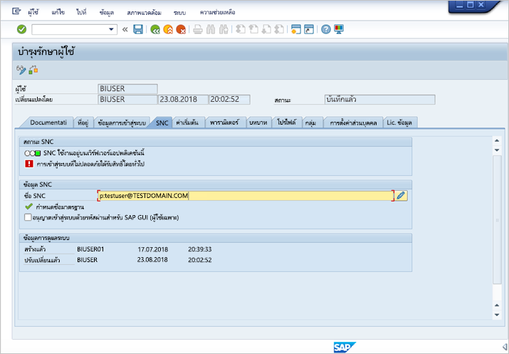

# <a name="use-kerberos-for-single-sign-on-sso-to-sap-bw-using-gx64krb5"></a><span data-ttu-id="ded1b-103">ใช้ Kerberos สำหรับลงชื่อเข้าระบบครั้งเดียว (SSO) ไปยัง SAP BW โดยใช้ gx64krb5</span><span class="sxs-lookup"><span data-stu-id="ded1b-103">Use Kerberos for single sign-on (SSO) to SAP BW using gx64krb5</span></span>

<span data-ttu-id="ded1b-104">บทความนี้อธิบายวิธีกำหนดค่าแหล่งข้อมูล SAP BW ของคุณเพื่อเปิดใช้งาน SSO จากบริการของ Power BI โดยใช้ gx64krb5</span><span class="sxs-lookup"><span data-stu-id="ded1b-104">This article describes how to configure your SAP BW data source to enable SSO from the Power BI service by using gx64krb5.</span></span>

> [!IMPORTANT]
> <span data-ttu-id="ded1b-105">SAP ไม่สนับสนุน gx64krb5 สำหรับเกตเวย์ข้อมูลภายในองค์กรใน Power BI อีกต่อไป</span><span class="sxs-lookup"><span data-stu-id="ded1b-105">SAP no longer supports the gx64krb5 for on-premises data gateways in Power BI.</span></span> <span data-ttu-id="ded1b-106">ด้วยเหตุนี้ Microsoft จึงยุติการสนับสนุนการใช้ gx64krb5 ในสถานการณ์นี้ด้วย</span><span class="sxs-lookup"><span data-stu-id="ded1b-106">As a result, Microsoft also has discontinued its support for use of gx64krb5 in this scenario.</span></span> <span data-ttu-id="ded1b-107">การเชื่อมต่อที่มีอยู่จะยังคงใช้งานได้ แต่คุณจะไม่สามารถสร้างการเชื่อมต่อใหม่สำหรับสถานการณ์นี้ได้ตั้งแต่เดือนกุมภาพันธ์ 2021 เป็นต้นไป</span><span class="sxs-lookup"><span data-stu-id="ded1b-107">Existing connections will continue to work, but you won't be able to create new connections for this scenario starting February 2021.</span></span> <span data-ttu-id="ded1b-108">ใช้ CommonCryptoLib แทน</span><span class="sxs-lookup"><span data-stu-id="ded1b-108">Use CommonCryptoLib instead.</span></span> 

> [!NOTE]
> <span data-ttu-id="ded1b-109">คุณสามารถทำตามขั้นตอนในบทความนี้นอกเหนือจากขั้นตอนใน [Configure Kerberos SSO](service-gateway-sso-kerberos.md) เพื่อเปิดใช้งานการรีเฟรช SSO สำหรับรายงานที่ยึดตามเซิร์ฟเวอร์แอปพลิเคชัน SAP BW ในบริการของ Power BI</span><span class="sxs-lookup"><span data-stu-id="ded1b-109">You can complete the steps in this article in addition to the steps in [Configure Kerberos SSO](service-gateway-sso-kerberos.md) to enable SSO-based refresh for SAP BW Application Server-based reports in Power BI service.</span></span> <span data-ttu-id="ded1b-110">อย่างไรก็ตาม Microsoft แนะนำให้ใช้งาน CommonCryptoLib เป็นไลบรารี SNC ของคุณ ไม่ใช่ gx64krb5</span><span class="sxs-lookup"><span data-stu-id="ded1b-110">However, Microsoft recommends the use of CommonCryptoLib, not gx64krb5 as your SNC library.</span></span> <span data-ttu-id="ded1b-111">SAP ไม่รองรับ gx64krb5 อีกต่อไป และขั้นตอนที่จำเป็นในการกำหนดค่าสำหรับเกตเวย์มีความซับซ้อนมากขึ้นเมื่อเทียบกับ CommonCryptoLib</span><span class="sxs-lookup"><span data-stu-id="ded1b-111">SAP no longer supports gx64krb5 and the steps required to configure it for the gateway are significantly more complex compared to CommonCryptoLib.</span></span> <span data-ttu-id="ded1b-112">สำหรับข้อมูลเกี่ยวกับวิธีกำหนดค่า SSO โดยใช้ CommonCryptoLib โปรดดูที่ [กำหนดค่า SAP BW สำหรับ SSO โดยใช้ CommonCryptoLib](service-gateway-sso-kerberos-sap-bw-commoncryptolib.md)</span><span class="sxs-lookup"><span data-stu-id="ded1b-112">For information about how to configure SSO by using CommonCryptoLib, see [Configure SAP BW for SSO using CommonCryptoLib](service-gateway-sso-kerberos-sap-bw-commoncryptolib.md).</span></span> <span data-ttu-id="ded1b-113">ใช้ CommonCryptoLib *หรือ* gx64krb5 เป็นไลบรารี SNC ของคุณ แต่ไม่ควรใช้ทั้งคู่</span><span class="sxs-lookup"><span data-stu-id="ded1b-113">Use CommonCryptoLib *or* gx64krb5 as your SNC library, but not both.</span></span> <span data-ttu-id="ded1b-114">ไม่ต้องทำขั้นตอนการกำหนดค่าสำหรับทั้งสองไลบรารี</span><span class="sxs-lookup"><span data-stu-id="ded1b-114">Do not complete the configuration steps for both libraries.</span></span>

<span data-ttu-id="ded1b-115">คู่มือนี้ครอบคลุม หากคุณทำตามขั้นตอนที่อธิบายไว้แล้วบางส่วนคุณสามารถข้ามไปได้</span><span class="sxs-lookup"><span data-stu-id="ded1b-115">This guide is comprehensive; if you've already completed some of the described steps, you can skip them.</span></span> <span data-ttu-id="ded1b-116">ตัวอย่างเช่น คุณอาจกำหนดค่าเซิร์ฟเวอร์ SAP BW ของคุณสำหรับ SSO โดยใช้ gx64krb5 เรียบร้อยแล้ว</span><span class="sxs-lookup"><span data-stu-id="ded1b-116">For example, you might have already configured your SAP BW server for SSO using gx64krb5.</span></span>

## <a name="set-up-gx64krb5-on-the-gateway-machine-and-the-sap-bw-server"></a><span data-ttu-id="ded1b-117">ตั้งค่า gx64krb5 บนเครื่องเกตเวย์และเซิร์ฟเวอร์ SAP BW</span><span class="sxs-lookup"><span data-stu-id="ded1b-117">Set up gx64krb5 on the gateway machine and the SAP BW server</span></span>

> [!NOTE]
> <span data-ttu-id="ded1b-118">SAP ไม่รองรับไลบรารี gx64krb5 อีกต่อไป</span><span class="sxs-lookup"><span data-stu-id="ded1b-118">The gx64krb5 library is no longer supported by SAP.</span></span> <span data-ttu-id="ded1b-119">สำหรับข้อมูลเพิ่มเติม ให้ดู [SAP Note 352295](https://launchpad.support.sap.com/#/notes/352295)</span><span class="sxs-lookup"><span data-stu-id="ded1b-119">For more information, see [SAP Note 352295](https://launchpad.support.sap.com/#/notes/352295).</span></span> <span data-ttu-id="ded1b-120">โปรดทราบว่า gx64krb5 ไม่อนุญาตให้มีการเชื่อมต่อ SSO จากเกตเวย์ข้อมูลไปยัง SAP BW Message Servers; ซึ่งสามารถเชื่อมต่อกับ SAP BW Application Server ได้เท่านั้น</span><span class="sxs-lookup"><span data-stu-id="ded1b-120">Note that gx64krb5 doesn't allow for SSO connections from the data gateway to SAP BW Message Servers; only connections to SAP BW Application Servers are possible.</span></span> <span data-ttu-id="ded1b-121">ข้อจำกัดนี้จะไม่มีถ้าคุณใช้ [CommonCryptoLib](service-gateway-sso-kerberos-sap-bw-commoncryptolib.md) เป็นไลบรารีของคุณ</span><span class="sxs-lookup"><span data-stu-id="ded1b-121">This restriction doesn't exist if you use [CommonCryptoLib](service-gateway-sso-kerberos-sap-bw-commoncryptolib.md) as your SNC library.</span></span> <span data-ttu-id="ded1b-122">แม้ว่าไลบรารี SNC อื่นอาจทำงานกับ BW SSO แต่ไม่ได้รับการรองรับจาก Microsoft อย่างเป็นทางการ</span><span class="sxs-lookup"><span data-stu-id="ded1b-122">Although other SNC libraries might also work for BW SSO, they aren't officially supported by Microsoft.</span></span>

<span data-ttu-id="ded1b-123">ต้องมีการใช้ไลบรารี gx64krb5 ทั้งในไคลเอ็นต์และในเซิร์ฟเวอร์เพื่อทำให้การเชื่อมต่อ SSO ผ่านเกตเวย์สมบูรณ์</span><span class="sxs-lookup"><span data-stu-id="ded1b-123">The gx64krb5 library must be used by both the client and server to complete an SSO connection through the gateway.</span></span> <span data-ttu-id="ded1b-124">นั่นคือ ทั้งไคลเอ็นต์และเซิร์ฟเวอร์ต้องใช้ไลบรารี SNC เหมือนกัน</span><span class="sxs-lookup"><span data-stu-id="ded1b-124">That is, both the client and server must be using the same SNC library.</span></span>

1. <span data-ttu-id="ded1b-125">ดาวน์โหลด gx64krb5.dll จาก [SAP Note 2115486](https://launchpad.support.sap.com/) (จำเป็นต้องมีผู้ใช้ระดับ S ของ SAP)</span><span class="sxs-lookup"><span data-stu-id="ded1b-125">Download gx64krb5.dll from [SAP Note 2115486](https://launchpad.support.sap.com/) (SAP s-user required).</span></span> <span data-ttu-id="ded1b-126">ตรวจสอบให้แน่ใจว่าคุณมีเวอร์ชัน 1.0.11.x เป็นอย่างน้อย</span><span class="sxs-lookup"><span data-stu-id="ded1b-126">Ensure you have at least version 1.0.11.x.</span></span> <span data-ttu-id="ded1b-127">นอกจากนี้ ให้ดาวน์โหลด gsskrb5.dll (ไลบรารีเวอร์ชัน 32 บิต) ด้วย ถ้าคุณต้องการทดสอบการเชื่อมต่อ SSO ใน SAP GUI ก่อนที่คุณจะพยายามเชื่อมต่อ SSO ผ่านเกตเวย์ (แนะนำ)</span><span class="sxs-lookup"><span data-stu-id="ded1b-127">Also, download gsskrb5.dll (the 32-bit version of the library) if you want to test the SSO connection in SAP GUI before you attempt the SSO connection through the gateway (recommended).</span></span> <span data-ttu-id="ded1b-128">จำเป็นต้องมีเวอร์ชัน 32 บิตในการทดสอบกับ SAP GUI เนื่องจาก SAP GUI เป็น 32 บิตเท่านั้น</span><span class="sxs-lookup"><span data-stu-id="ded1b-128">The 32-bit version is required to test with SAP GUI because SAP GUI is 32-bit only.</span></span>

1. <span data-ttu-id="ded1b-129">วาง gx64krb5.dll ในตำแหน่งที่ตั้งบนเครื่องเกตเวย์ของคุณซึ่งผู้ใช้บริการเกตเวย์สามารถเข้าถึงได้</span><span class="sxs-lookup"><span data-stu-id="ded1b-129">Put gx64krb5.dll in a location on your gateway machine that's accessible by your gateway service user.</span></span> <span data-ttu-id="ded1b-130">หากคุณต้องการทดสอบการเชื่อมต่อ SSO ด้วย SAP GUI ให้ใส่สำเนาของ gsskrb5.dll บนเครื่องของคุณ และตั้งค่าตัวแปรสภาพแวดล้อม **SNC_LIB** เพื่อชี้ไปที่ไฟล์ดังกล่าว</span><span class="sxs-lookup"><span data-stu-id="ded1b-130">If you want to test the SSO connection with SAP GUI, also put a copy of gsskrb5.dll on your machine and set the **SNC_LIB** environment variable to point to it.</span></span> <span data-ttu-id="ded1b-131">ทั้งผู้ใช้บริการเกตเวย์และผู้ใช้ Active Directory (AD) ที่ผู้ใช้บริการจะเลียนแบบจำเป็นต้องอ่านและใช้สิทธิ์สำหรับสำเนาของ gx64krb5.dll</span><span class="sxs-lookup"><span data-stu-id="ded1b-131">Both the gateway service user and the Active Directory (AD) users that the service user will impersonate need read and execute permissions for the copy of gx64krb5.dll.</span></span> <span data-ttu-id="ded1b-132">เราขอแนะนำการให้สิทธิ์ไฟล์ .dll กับกลุ่มผู้ใช้ที่ได้รับการรับรองความถูกต้อง</span><span class="sxs-lookup"><span data-stu-id="ded1b-132">We recommend granting permissions on the .dll to the Authenticated Users group.</span></span> <span data-ttu-id="ded1b-133">สำหรับวัตถุประสงค์ในการทดสอบ คุณยังสามารถมอบสิทธิ์เหล่านี้ให้กับทั้งผู้ใช้บริการเกตเวย์และผู้ใช้ Active Directory ที่คุณจะใช้สำหรับทดสอบ</span><span class="sxs-lookup"><span data-stu-id="ded1b-133">For testing purposes, you can also explicitly grant these permissions to both the gateway service user and the Active Directory user you use to test.</span></span>

1. <span data-ttu-id="ded1b-134">ถ้าเซิร์ฟเวอร์ BW ของคุณยังไม่ได้รับการกำหนดค่าสำหรับ SSO โดยใช้ gx64krb5.dll ให้ใส่สำเนาอื่นของไฟล์ .dll บนเครื่องเซิร์ฟเวอร์ SAP BW ของคุณในตำแหน่งที่ตั้งที่สามารถเข้าถึงได้โดยเซิร์ฟเวอร์ SAP BW</span><span class="sxs-lookup"><span data-stu-id="ded1b-134">If your BW server hasn't already been configured for SSO using gx64krb5.dll, put another copy of the .dll on your SAP BW server machine in a location accessible by the SAP BW server.</span></span> 

    <span data-ttu-id="ded1b-135">สำหรับข้อมูลเพิ่มเติมเกี่ยวกับการกำหนดค่า gx64krb5 เพื่อใช้งานกับเซิร์ฟเวอร์ SAP BW โปรดดู [เอกสารประกอบ SAP](https://launchpad.support.sap.com/#/notes/2115486) (จำเป็นต้องมีผู้ใช้ระดับ S ของ SAP)</span><span class="sxs-lookup"><span data-stu-id="ded1b-135">For more information on configuring gx64krb5.dll for use with an SAP BW server, see [SAP documentation](https://launchpad.support.sap.com/#/notes/2115486) (SAP s-user required).</span></span>

1. <span data-ttu-id="ded1b-136">บนเครื่องไคลเอ็นต์และเซิร์ฟเวอร์ ให้ตั้งค่าตัวแปรสภาพแวดล้อม **SNC_LIB** และ **SNC_LIB_64**</span><span class="sxs-lookup"><span data-stu-id="ded1b-136">On the client and server machines, set the **SNC_LIB** and **SNC_LIB_64** environment variables:</span></span> 
    - <span data-ttu-id="ded1b-137">ถ้าคุณใช้ gsskrb5.dll ให้ตั้งค่าตัวแปร **SNC_LIB** เป็นเส้นทางสัมบูรณ์ของไฟล์ดังกล่าว</span><span class="sxs-lookup"><span data-stu-id="ded1b-137">If you use gsskrb5.dll, set the **SNC_LIB** variable to its absolute path.</span></span> 
    - <span data-ttu-id="ded1b-138">ถ้าคุณใช้ gx64krb5.dll ให้ตั้งค่าตัวแปร **SNC_LIB_64** เป็นเส้นทางสัมบูรณ์ของไฟล์ดังกล่าว</span><span class="sxs-lookup"><span data-stu-id="ded1b-138">If you use gx64krb5.dll, set the **SNC_LIB_64** variable to its absolute path.</span></span>

## <a name="configure-an-sap-bw-service-user-and-enable-snc-communication-on-the-bw-server"></a><span data-ttu-id="ded1b-139">กำหนดค่าผู้ใช้บริการ SAP BW และเปิดใช้งานการสื่อสาร SNC บนเซิร์ฟเวอร์ BW</span><span class="sxs-lookup"><span data-stu-id="ded1b-139">Configure an SAP BW service user and enable SNC communication on the BW server</span></span>

<span data-ttu-id="ded1b-140">ดำเนินการในส่วนนี้ให้เสร็จสมบูรณ์ถ้าคุณยังไม่ได้กำหนดค่าเซิร์ฟเวอร์ SAP BW ของคุณสำหรับการสื่อสาร (ตัวอย่างเช่น SSO) โดยใช้ gx64krb5</span><span class="sxs-lookup"><span data-stu-id="ded1b-140">Complete this section if you haven't already configured your SAP BW server for SNC communication (for example, SSO) by using gx64krb5.</span></span>

> [!NOTE]
> <span data-ttu-id="ded1b-141">ส่วนนี้ถือว่าคุณได้สร้างผู้ใช้บริการสำหรับ BW และผูกโยง SPN ที่เหมาะสมเข้าด้วยแล้ว (นั่นคือชื่อที่ขึ้นต้นด้วย *SAP/* )</span><span class="sxs-lookup"><span data-stu-id="ded1b-141">This section assumes that you've already created a service user for BW and bound a suitable SPN to it (that is, a name that begins with *SAP/*).</span></span>

1. <span data-ttu-id="ded1b-142">ให้ผู้ใช้บริการเข้าถึง SAP BW Application Server ของคุณ:</span><span class="sxs-lookup"><span data-stu-id="ded1b-142">Give the service user access to your SAP BW Application Server:</span></span>

    1. <span data-ttu-id="ded1b-143">บนเครื่องเซิร์ฟเวอร์ SAP BW ให้เพิ่มผู้ใช้บริการลงในกลุ่มผู้ดูแลระบบภายใน</span><span class="sxs-lookup"><span data-stu-id="ded1b-143">On the SAP BW server machine, add the service user to the Local Admin group.</span></span> <span data-ttu-id="ded1b-144">เปิดโปรแกรม **การจัดการคอมพิวเตอร์** และระบุกลุ่มผู้ดูแลระบบภายในสำหรับเซิร์ฟเวอร์ของคุณ</span><span class="sxs-lookup"><span data-stu-id="ded1b-144">Open the **Computer Management** program and identify the Local Admin group for your server.</span></span> 

        

    1. <span data-ttu-id="ded1b-146">ดับเบิลคลิกกลุ่มผู้ดูแลระบบภายในเครื่อง แล้วเลือก **เพิ่ม** เพื่อเพิ่มผู้ใช้บริการของคุณไปยังกลุ่ม</span><span class="sxs-lookup"><span data-stu-id="ded1b-146">Double-click the Local Admin group, and select **Add** to add your service user to the group.</span></span> 

    1. <span data-ttu-id="ded1b-147">เลือก **ตรวจสอบชื่อ** เพื่อให้แน่ใจว่าคุณป้อนชื่อถูกต้องจากนั้นเลือก **ตกลง**</span><span class="sxs-lookup"><span data-stu-id="ded1b-147">Select **Check Names** to ensure you've entered the name correctly, and then select **OK**.</span></span>

1. <span data-ttu-id="ded1b-148">ตั้งค่าผู้ใช้บริการของเซิร์ฟเวอร์ SAP BW เป็นผู้ใช้ที่เริ่มต้นใช้งานบริการของเซิร์ฟเวอร์ SAP BW บนเครื่องเซิร์ฟเวอร์ SAP BW</span><span class="sxs-lookup"><span data-stu-id="ded1b-148">Set the SAP BW server's service user as the user that starts the SAP BW server service on the SAP BW server machine:</span></span>

    1. <span data-ttu-id="ded1b-149">เปิด **Run** แล้วป้อน **Services.msc**</span><span class="sxs-lookup"><span data-stu-id="ded1b-149">Open **Run**, and then enter **Services.msc**.</span></span> 

    1. <span data-ttu-id="ded1b-150">ค้นหาบริการที่สอดคล้องกับอินสแตนซ์ของ SAP BW Application Server ของคุณ คลิกขวาจากนั้นเลือก **คุณสมบัติ**</span><span class="sxs-lookup"><span data-stu-id="ded1b-150">Find the service corresponding to your SAP BW Application Server instance, right-click it, and then select **Properties**.</span></span>

        

    1. <span data-ttu-id="ded1b-152">สลับไปยังแท็บ **เข้าสู่ระบบ** และเปลี่ยนผู้ใช้เป็นผู้ใช้บริการ SAP BW ของคุณ</span><span class="sxs-lookup"><span data-stu-id="ded1b-152">Switch to the **Log on** tab, and change the user to your SAP BW service user.</span></span> 

    1. <span data-ttu-id="ded1b-153">ป้อนรหัสผ่านของผู้ใช้ แล้วเลือก **ตกลง**</span><span class="sxs-lookup"><span data-stu-id="ded1b-153">Enter the user's password, and then select **OK**.</span></span>

1. <span data-ttu-id="ded1b-154">ลงชื่อเข้าใช้เซิร์ฟเวอร์ของคุณใน SAP Logon และตั้งค่าพารามิเตอร์โปรไฟล์ต่อไปนี้โดยใช้ทรานแซคชัน RZ10:</span><span class="sxs-lookup"><span data-stu-id="ded1b-154">In SAP Logon, sign in to your server and set the following profile parameters by using the RZ10 transaction:</span></span>

    1. <span data-ttu-id="ded1b-155">ตั้งค่าพารามิเตอร์โปรไฟล์ **snc/identity/as** เป็น *p:&lt; ผู้ใช้บริการ SAP BW ที่คุณสร้าง &gt;*</span><span class="sxs-lookup"><span data-stu-id="ded1b-155">Set the **snc/identity/as** profile parameter to *p:&lt;SAP BW service user you created&gt;*.</span></span> <span data-ttu-id="ded1b-156">ตัวอย่างเช่น *p:BWServiceUser\@MYDOMAIN.COM*</span><span class="sxs-lookup"><span data-stu-id="ded1b-156">For example, *p:BWServiceUser\@MYDOMAIN.COM*.</span></span> <span data-ttu-id="ded1b-157">โปรดทราบว่า *p:* มาก่อน UPN ของผู้ใช้บริการ ซึ่งตรงข้ามกับ *p:CN=* ที่นำหน้า UPN เมื่อคุณใช้ CommonCryptoLib เป็นไลบรารี SNC</span><span class="sxs-lookup"><span data-stu-id="ded1b-157">Note that *p:* precedes the service user's UPN, as opposed to *p:CN=*, which precedes the UPN when you use CommonCryptoLib as the SNC library.</span></span>

    1. <span data-ttu-id="ded1b-158">ตั้งค่าพารามิเตอร์โปรไฟล์ **snc/gssapi\_lib** เป็น *&lt; โดยชี้เส้นทางไปยัง gx64krb5.dll บนเซิร์ฟเวอร์ BW&gt;*</span><span class="sxs-lookup"><span data-stu-id="ded1b-158">Set the **snc/gssapi\_lib** profile parameter to *&lt;path to gx64krb5.dll on the BW server&gt;*.</span></span> <span data-ttu-id="ded1b-159">วางไลบรารีในตำแหน่งที่ SAP BW Application Server สามารถเข้าถึงได้</span><span class="sxs-lookup"><span data-stu-id="ded1b-159">Place the library in a location that the SAP BW Application Server can access.</span></span>

    1. <span data-ttu-id="ded1b-160">ตั้งค่าพารามิเตอร์โปรไฟล์เพิ่มเติมต่อไปนี้ โดยเปลี่ยนค่าตามต้องการเพื่อให้เหมาะกับความต้องการของคุณ</span><span class="sxs-lookup"><span data-stu-id="ded1b-160">Set the following additional profile parameters, changing the values as required to fit your needs.</span></span> <span data-ttu-id="ded1b-161">ตัวเลือกห้าตัวท้ายช่วยให้ไคลเอ็นต์สามารถเชื่อมต่อกับเซิร์ฟเวอร์ SAP BW ได้โดยใช้ SAP Logon โดยไม่ต้องกำหนดค่า SNC</span><span class="sxs-lookup"><span data-stu-id="ded1b-161">The last five options enable clients to connect to the SAP BW server by using SAP Logon without having SNC configured.</span></span>

        | <span data-ttu-id="ded1b-162">**การตั้งค่า**</span><span class="sxs-lookup"><span data-stu-id="ded1b-162">**Setting**</span></span> | <span data-ttu-id="ded1b-163">**ค่า**</span><span class="sxs-lookup"><span data-stu-id="ded1b-163">**Value**</span></span> |
        | --- | --- |
        | <span data-ttu-id="ded1b-164">snc/data\_protection/max</span><span class="sxs-lookup"><span data-stu-id="ded1b-164">snc/data\_protection/max</span></span> | <span data-ttu-id="ded1b-165">3</span><span class="sxs-lookup"><span data-stu-id="ded1b-165">3</span></span> |
        | <span data-ttu-id="ded1b-166">snc/data\_protection/min</span><span class="sxs-lookup"><span data-stu-id="ded1b-166">snc/data\_protection/min</span></span> | <span data-ttu-id="ded1b-167">1</span><span class="sxs-lookup"><span data-stu-id="ded1b-167">1</span></span> |
        | <span data-ttu-id="ded1b-168">snc/data\_protection/use</span><span class="sxs-lookup"><span data-stu-id="ded1b-168">snc/data\_protection/use</span></span> | <span data-ttu-id="ded1b-169">9</span><span class="sxs-lookup"><span data-stu-id="ded1b-169">9</span></span> |
        | <span data-ttu-id="ded1b-170">snc/accept\_insecure\_cpic</span><span class="sxs-lookup"><span data-stu-id="ded1b-170">snc/accept\_insecure\_cpic</span></span> | <span data-ttu-id="ded1b-171">1</span><span class="sxs-lookup"><span data-stu-id="ded1b-171">1</span></span> |
        | <span data-ttu-id="ded1b-172">snc/accept\_insecure\_gui</span><span class="sxs-lookup"><span data-stu-id="ded1b-172">snc/accept\_insecure\_gui</span></span> | <span data-ttu-id="ded1b-173">1</span><span class="sxs-lookup"><span data-stu-id="ded1b-173">1</span></span> |
        | <span data-ttu-id="ded1b-174">snc/accept\_insecure\_r3int\_rfc</span><span class="sxs-lookup"><span data-stu-id="ded1b-174">snc/accept\_insecure\_r3int\_rfc</span></span> | <span data-ttu-id="ded1b-175">1</span><span class="sxs-lookup"><span data-stu-id="ded1b-175">1</span></span> |
        | <span data-ttu-id="ded1b-176">snc/accept\_insecure\_rfc</span><span class="sxs-lookup"><span data-stu-id="ded1b-176">snc/accept\_insecure\_rfc</span></span> | <span data-ttu-id="ded1b-177">1</span><span class="sxs-lookup"><span data-stu-id="ded1b-177">1</span></span> |
        | <span data-ttu-id="ded1b-178">snc/permit\_insecure\_start</span><span class="sxs-lookup"><span data-stu-id="ded1b-178">snc/permit\_insecure\_start</span></span> | <span data-ttu-id="ded1b-179">1</span><span class="sxs-lookup"><span data-stu-id="ded1b-179">1</span></span> |

    1. <span data-ttu-id="ded1b-180">ตั้งค่าคุณสมบัติ **snc/enable** เป็น 1</span><span class="sxs-lookup"><span data-stu-id="ded1b-180">Set the **snc/enable** property to 1.</span></span>

1. <span data-ttu-id="ded1b-181">หลังจากที่คุณตั้งค่าพารามิเตอร์โปรไฟล์เหล่านี้แล้ว ให้เปิด SAP Management Console บนเครื่องเซิร์ฟเวอร์และรีสตาร์ทอินสแตนซ์ SAP BW</span><span class="sxs-lookup"><span data-stu-id="ded1b-181">After you set these profile parameters, open the SAP Management Console on the server machine and restart the SAP BW instance.</span></span> 

   <span data-ttu-id="ded1b-182">ถ้าเซิร์ฟเวอร์ไม่เริ่มทำงาน ให้ยืนยันว่า คุณได้ตั้งค่าพารามิเตอร์โปร์ไฟล์อย่างถูกต้อง</span><span class="sxs-lookup"><span data-stu-id="ded1b-182">If the server won't start, confirm that you've set the profile parameters correctly.</span></span> <span data-ttu-id="ded1b-183">สำหรับข้อมูลเพิ่มเติมเกี่ยวกับการตั้งค่าพารามิเตอร์โปรไฟล์ โปรดดู [เอกสารประกอบ SAP](https://help.sap.com/saphelp_nw70ehp1/helpdata/en/e6/56f466e99a11d1a5b00000e835363f/frameset.htm)</span><span class="sxs-lookup"><span data-stu-id="ded1b-183">For more information on profile parameter settings, see the [SAP documentation](https://help.sap.com/saphelp_nw70ehp1/helpdata/en/e6/56f466e99a11d1a5b00000e835363f/frameset.htm).</span></span> <span data-ttu-id="ded1b-184">นอกจากนี้คุณยังสามารถดูส่วน [การแก้ไขปัญหา](#troubleshooting) ในบทความนี้ได้อีกด้วย</span><span class="sxs-lookup"><span data-stu-id="ded1b-184">You can also consult the [Troubleshooting](#troubleshooting) section in this article.</span></span>

## <a name="map-an-sap-bw-user-to-an-active-directory-user"></a><span data-ttu-id="ded1b-185">แมปผู้ใช้ SAP BW ไปยังผู้ใช้ Active Directory</span><span class="sxs-lookup"><span data-stu-id="ded1b-185">Map an SAP BW user to an Active Directory user</span></span>

<span data-ttu-id="ded1b-186">หากคุณยังไม่ได้ดำเนินการ ให้แมปผู้ใช้ Active Directory ไปยังผู้ใช้ SAP BW Application Server และทดสอบการเชื่อมต่อ SSO ใน SAP Logon</span><span class="sxs-lookup"><span data-stu-id="ded1b-186">If you haven't done so already, map an Active Directory user to an SAP BW Application Server user and test the SSO connection in SAP Logon.</span></span>

1. <span data-ttu-id="ded1b-187">ลงชื่อเข้าใช้เซิร์ฟเวอร์ SAP BW ของคุณด้วย SAP Logon</span><span class="sxs-lookup"><span data-stu-id="ded1b-187">Sign in to your SAP BW server with SAP Logon.</span></span> <span data-ttu-id="ded1b-188">เรียกใช้ทรานแซคชัน SU01</span><span class="sxs-lookup"><span data-stu-id="ded1b-188">Run transaction SU01.</span></span>

1. <span data-ttu-id="ded1b-189">สำหรับ **ผู้ใช้** ให้ป้อนผู้ใช้ SAP BW ที่คุณต้องการเปิดใช้งานการเชื่อมต่อ SSO</span><span class="sxs-lookup"><span data-stu-id="ded1b-189">For **User**, enter the SAP BW user for which you want to enable SSO connection.</span></span> <span data-ttu-id="ded1b-190">เลือกไอคอน **แก้ไข** (ไอคอนปากกา) ใกล้กับด้านบนซ้ายของหน้าต่าง SAP Logon</span><span class="sxs-lookup"><span data-stu-id="ded1b-190">Select the **Edit** icon (pen icon) near the top left of the SAP Logon window.</span></span>

    

1. <span data-ttu-id="ded1b-192">เลือกแท็บ **SNC** ในช่องใส่ชื่อ SNC ให้ป้อน *p:&lt;ผู้ใช้ Active Directory ของคุณ&gt;@&lt;โดเมนของคุณ&gt;*</span><span class="sxs-lookup"><span data-stu-id="ded1b-192">Select the **SNC** tab. In the SNC name input box, enter *p:&lt;your Active Directory user&gt;@&lt;your domain&gt;*.</span></span> <span data-ttu-id="ded1b-193">สำหรับชื่อ SNC *p:* จะต้องนำหน้า UPN ของผู้ใช้ Active Directory</span><span class="sxs-lookup"><span data-stu-id="ded1b-193">For the SNC name, *p:* must precede the Active Directory user's UPN.</span></span> <span data-ttu-id="ded1b-194">โปรดทราบว่า UPN จะต้องตรงตามตัวพิมพ์ใหญ่-เล็ก</span><span class="sxs-lookup"><span data-stu-id="ded1b-194">Note that the UPN is case-sensitive.</span></span>

   <span data-ttu-id="ded1b-195">ผู้ใช้ Active Directory ที่คุณระบุต้องเป็นบุคคลหรือองค์กรที่คุณต้องการเปิดใช้งาน SSO เพื่อเข้าถึง SAP BW Application Server</span><span class="sxs-lookup"><span data-stu-id="ded1b-195">The Active Directory user you specify should belong to the person or organization for whom you want to enable SSO access to the SAP BW Application Server.</span></span> <span data-ttu-id="ded1b-196">ตัวอย่างเช่น หากคุณต้องการเปิดใช้งานการเข้าถึง SSO สำหรับผู้ใช้ testuser\@TESTDOMAIN.COM ให้ป้อน *p:testuser\@TESTDOMAIN.COM*</span><span class="sxs-lookup"><span data-stu-id="ded1b-196">For example, if you want to enable SSO access for the user testuser\@TESTDOMAIN.COM, enter *p:testuser\@TESTDOMAIN.COM*.</span></span>

    

1. <span data-ttu-id="ded1b-198">เลือกไอคอน **บันทึก** (ภาพฟล็อปปี้ดิสก์) ใกล้กับมุมซ้ายบนของหน้าจอ</span><span class="sxs-lookup"><span data-stu-id="ded1b-198">Select the **Save** icon (floppy disk image) near the top left of the screen.</span></span>

## <a name="test-sign-in-via-sso"></a><span data-ttu-id="ded1b-199">ทดสอบการลงชื่อเข้าใช้ผ่านทาง SSO</span><span class="sxs-lookup"><span data-stu-id="ded1b-199">Test sign in via SSO</span></span>

<span data-ttu-id="ded1b-200">ตรวจสอบว่าคุณสามารถลงชื่อเข้าใช้เซิร์ฟเวอร์โดยใช้ SAP Logon ผ่าน SSO ในฐานะผู้ใช้ Active Directory ที่คุณเพิ่งเปิดใช้งานการเข้าถึง SSO ได้หรือไม่:</span><span class="sxs-lookup"><span data-stu-id="ded1b-200">Verify that you can sign in to the server by using SAP Logon through SSO as the Active Directory user for whom you've enabled SSO access:</span></span>

1. <span data-ttu-id="ded1b-201">ในฐานะผู้ใช้ Active Directory ที่คุณเพิ่งเปิดใช้งานการเข้าถึง SSO ให้ลงชื่อเข้าใช้เครื่องในโดเมนของคุณที่ติดตั้ง SAP Logon ไว้</span><span class="sxs-lookup"><span data-stu-id="ded1b-201">As the Active Directory user for which you've just enabled SSO access, sign in to a machine in your domain on which SAP Logon is installed.</span></span> <span data-ttu-id="ded1b-202">เปิดใช้งาน SAP Logon และสร้างการเชื่อมต่อใหม่</span><span class="sxs-lookup"><span data-stu-id="ded1b-202">Launch SAP Logon, and create a new connection.</span></span>

1. <span data-ttu-id="ded1b-203">คัดลอกไฟล์ gsskrb5.dll ที่คุณดาวน์โหลดก่อนหน้านี้ไปยังตำแหน่งที่ตั้งบนเครื่องที่คุณลงชื่อเข้าใช้</span><span class="sxs-lookup"><span data-stu-id="ded1b-203">Copy the gsskrb5.dll file you downloaded earlier to a location on the machine you signed-in to.</span></span> <span data-ttu-id="ded1b-204">ตั้งค่าตัวแปรสภาพแวดล้อม **SNC_LIB** เป็นเส้นทางสัมบูรณ์ของตำแหน่งที่ตั้งนี้</span><span class="sxs-lookup"><span data-stu-id="ded1b-204">Set the **SNC_LIB** environment variable to the absolute path of this location.</span></span>

1. <span data-ttu-id="ded1b-205">เปิดใช้งาน SAP Logon และสร้างการเชื่อมต่อใหม่</span><span class="sxs-lookup"><span data-stu-id="ded1b-205">Launch SAP Logon, and create a new connection.</span></span>

1. <span data-ttu-id="ded1b-206">ในหน้าจอ **สร้างรายการระบบใหม่** ให้เลือก **ระบบเฉพาะสำหรับผู้ใช้** จากนั้นเลือก **ถัดไป**</span><span class="sxs-lookup"><span data-stu-id="ded1b-206">In the **Create New System Entry** screen, select **User Specified System**, then select **Next**.</span></span>

    

1. <span data-ttu-id="ded1b-208">กรอกรายละเอียดที่เหมาะสมในหน้าจอถัดไป รวมทั้งเซิร์ฟเวอร์แอปพลิเคชัน หมายเลขอินสแตนซ์ และ ID ของระบบ</span><span class="sxs-lookup"><span data-stu-id="ded1b-208">Fill in the appropriate details on the next screen, including the application server, instance number, and system ID.</span></span> <span data-ttu-id="ded1b-209">จากนั้น เลือก **เสร็จสิ้น**</span><span class="sxs-lookup"><span data-stu-id="ded1b-209">Then, select **Finish**.</span></span>

1. <span data-ttu-id="ded1b-210">คลิกขวาที่การเชื่อมต่อใหม่ เลือก **คุณสมบัติ** จากนั้นเลือกแท็บ **เครือข่าย**</span><span class="sxs-lookup"><span data-stu-id="ded1b-210">Right-click the new connection, select **Properties**, and then select the **Network** tab.</span></span> 

1. <span data-ttu-id="ded1b-211">ในกล่อง **ชื่อ SNC** ให้ป้อน *p:&lt;UPN ของผู้ใช้บริการ SAP BW&gt;*</span><span class="sxs-lookup"><span data-stu-id="ded1b-211">In the **SNC Name** box, enter *p:&lt;SAP BW service user's UPN&gt;*.</span></span> <span data-ttu-id="ded1b-212">ตัวอย่างเช่น *p:BWServiceUser\@MYDOMAIN.COM*</span><span class="sxs-lookup"><span data-stu-id="ded1b-212">For example, *p:BWServiceUser\@MYDOMAIN.COM*.</span></span> <span data-ttu-id="ded1b-213">เลือก **ตกลง**</span><span class="sxs-lookup"><span data-stu-id="ded1b-213">Select **OK**.</span></span>

    

1. <span data-ttu-id="ded1b-215">ดับเบิลคลิกที่การเชื่อมต่อที่คุณเพิ่งสร้างขึ้นเพื่อลองเชื่อมต่อ SSO ไปยังเซิร์ฟเวอร์ SAP BW ของคุณ</span><span class="sxs-lookup"><span data-stu-id="ded1b-215">Double-click the connection you just created to attempt an SSO connection to your SAP BW server.</span></span> 

   <span data-ttu-id="ded1b-216">หากการเชื่อมต่อนี้ประสบความสำเร็จ ให้ดำเนินการส่วนถัดไป</span><span class="sxs-lookup"><span data-stu-id="ded1b-216">If this connection succeeds, continue to the next section.</span></span> <span data-ttu-id="ded1b-217">มิเช่นนั้น ให้ตรวจสอบขั้นตอนก่อนหน้าในเอกสารนี้เพื่อให้มั่นใจว่าได้ดำเนินการเสร็จสิ้นอย่างถูกต้องแล้ว หรือตรวจสอบส่วน[การแก้ปัญหา](#troubleshooting)</span><span class="sxs-lookup"><span data-stu-id="ded1b-217">Otherwise, review the earlier steps in this document to make sure they've been completed correctly, or review the [Troubleshooting](#troubleshooting) section.</span></span> <span data-ttu-id="ded1b-218">ถ้าคุณไม่สามารถเชื่อมต่อกับเซิร์ฟเวอร์ SAP BW ผ่าน SSO ในบริบทนี้ คุณจะไม่สามารถเชื่อมต่อกับเซิร์ฟเวอร์ SAP BW โดยใช้ SSO ในบริบทเกตเวย์ได้</span><span class="sxs-lookup"><span data-stu-id="ded1b-218">If you can't connect to the SAP BW server via SSO in this context, you won't be able to connect to the SAP BW server by using SSO in the gateway context.</span></span>

## <a name="add-registry-entries-to-the-gateway-machine"></a><span data-ttu-id="ded1b-219">เพิ่มรายการรีจิสทรีไปยังเครื่องเกตเวย์</span><span class="sxs-lookup"><span data-stu-id="ded1b-219">Add registry entries to the gateway machine</span></span>

<span data-ttu-id="ded1b-220">เพิ่มรายการรีจิสทรีที่จำเป็นลงในรีจิสทรีของเครื่องที่มีการติดตั้งเกตเวย์ และลงในเครื่องที่ต้องการเชื่อมต่อจาก Power BI Desktop</span><span class="sxs-lookup"><span data-stu-id="ded1b-220">Add required registry entries to the registry of the machine that the gateway is installed on, and to machines intended to connect from Power BI Desktop.</span></span> <span data-ttu-id="ded1b-221">เมื่อต้องการเพิ่มรายการรีจิสทรีเหล่านี้ ให้เรียกใช้คำสั่งต่อไปนี้:</span><span class="sxs-lookup"><span data-stu-id="ded1b-221">To add these registry entries, run the following commands:</span></span>

- ```REG ADD HKLM\SOFTWARE\Wow6432Node\SAP\gsskrb5 /v ForceIniCredOK /t REG_DWORD /d 1 /f```

- ```REG ADD HKLM\SOFTWARE\SAP\gsskrb5 /v ForceIniCredOK /t REG_DWORD /d 1 /f```

## <a name="add-a-new-sap-bw-application-server-data-source-to-the-power-bi-service-or-edit-an-existing-one"></a><span data-ttu-id="ded1b-222">เพิ่มแหล่งข้อมูล SAP BW Application Server ใหม่ลงในบริการ Power BI หรือแก้ไขตัวที่มีอยู่</span><span class="sxs-lookup"><span data-stu-id="ded1b-222">Add a new SAP BW Application Server data source to the Power BI service, or edit an existing one</span></span>

1. <span data-ttu-id="ded1b-223">ในหน้าต่างการกำหนดค่าแหล่งข้อมูล ให้ป้อน **ชื่อโฮสต์** **หมายเลขระบบ** และ **ID ไคลเอ็นต์** ของ SAP BW Application Server ตามที่คุณต้องการเพื่อลงชื่อเข้าใช้เซิร์ฟเวอร์ SAP BW จาก Power BI Desktop</span><span class="sxs-lookup"><span data-stu-id="ded1b-223">In the data source configuration window, enter the SAP BW Application Server's **Hostname**, **System Number**, and **client ID**, as you would to sign in to your SAP BW server from Power BI Desktop.</span></span>

1. <span data-ttu-id="ded1b-224">ในเขตข้อมูล **ชื่อหุ้นส่วน SNC** ให้ใส่ *p:&lt;SPN ที่คุณแมปไปยังผู้ใช้บริการ SAP BW ของคุณ&gt;*</span><span class="sxs-lookup"><span data-stu-id="ded1b-224">In the **SNC Partner Name** field, enter *p:&lt;SPN you mapped to your SAP BW service user&gt;*.</span></span> <span data-ttu-id="ded1b-225">ตัวอย่างเช่นถ้า SPN คือ SAP/BWServiceUser\@MYDOMAIN.COM ให้ป้อน *p:SAP/BWServiceUser\@MYDOMAIN.COM* ในเขตข้อมูล **ชื่อหุ้นส่วน SNC**</span><span class="sxs-lookup"><span data-stu-id="ded1b-225">For example, if the SPN is SAP/BWServiceUser\@MYDOMAIN.COM, enter *p:SAP/BWServiceUser\@MYDOMAIN.COM* in the **SNC Partner Name** field.</span></span>

1. <span data-ttu-id="ded1b-226">สำหรับไลบรารี SNC ให้เลือก **SNC\_LIB** หรือ **SNC\_LIB\_64**</span><span class="sxs-lookup"><span data-stu-id="ded1b-226">For the SNC Library, select **SNC\_LIB** or **SNC\_LIB\_64**.</span></span> <span data-ttu-id="ded1b-227">ตรวจสอบให้แน่ใจว่า **SNC\_LIB\_64** บนเครื่องเกตเวย์ชี้ไปยัง gx64krb5.dll</span><span class="sxs-lookup"><span data-stu-id="ded1b-227">Make sure that **SNC\_LIB\_64** on the gateway machine points to gx64krb5.dll.</span></span> <span data-ttu-id="ded1b-228">อีกวิธีหนึ่งคือคุณสามารถเลือกตัวเลือก **แบบกำหนดเอง** และใส่เส้นทางสัมบูรณ์สำหรับ gx64krb5 บนเครื่องเกตเวย์</span><span class="sxs-lookup"><span data-stu-id="ded1b-228">Alternatively, you can select the **Custom** option and provide the absolute path for gx64krb5.dll on the gateway machine.</span></span>

1. <span data-ttu-id="ded1b-229">เลือก **ใช้ SSO ผ่าน Kerberos สำหรับคิวรี DirectQuery** แล้วเลือก **ปรับใช้**</span><span class="sxs-lookup"><span data-stu-id="ded1b-229">Select **Use SSO via Kerberos for DirectQuery queries**, and then select **Apply**.</span></span> <span data-ttu-id="ded1b-230">หากการเชื่อมต่อทดสอบไม่สำเร็จ ให้ตรวจสอบว่าขั้นตอนการตั้งค่าและการกำหนดค่าก่อนหน้าเสร็จสมบูรณ์อย่างถูกต้องหรือไม่</span><span class="sxs-lookup"><span data-stu-id="ded1b-230">If the test connection is not successful, verify that the previous setup and configuration steps were completed correctly.</span></span>

1. [<span data-ttu-id="ded1b-231">เปิดใช้รายงาน Power BI</span><span class="sxs-lookup"><span data-stu-id="ded1b-231">Run a Power BI report</span></span>](service-gateway-sso-kerberos.md#run-a-power-bi-report)

## <a name="troubleshooting"></a><span data-ttu-id="ded1b-232">การแก้ไขปัญหา</span><span class="sxs-lookup"><span data-stu-id="ded1b-232">Troubleshooting</span></span>

### <a name="troubleshoot-gx64krb5-configuration"></a><span data-ttu-id="ded1b-233">แก้ไขการกำหนดค่า gx64krb5</span><span class="sxs-lookup"><span data-stu-id="ded1b-233">Troubleshoot gx64krb5 configuration</span></span>

<span data-ttu-id="ded1b-234">ถ้าคุณพบปัญหาใดก็ตามดังต่อไปนี้ ให้ทำตามขั้นตอนเหล่านี้เพื่อแก้ไขปัญหาการติดตั้ง gx64krb5 และการเชื่อมต่อ SSO</span><span class="sxs-lookup"><span data-stu-id="ded1b-234">If you encounter any of the following problems, follow these steps to troubleshoot the gx64krb5 installation and SSO connections:</span></span>

* <span data-ttu-id="ded1b-235">คุณพบข้อผิดพลาดเมื่อคุณทำตามขั้นตอนการตั้งค่า gx64krb5</span><span class="sxs-lookup"><span data-stu-id="ded1b-235">You encounter errors when you complete the gx64krb5 setup steps.</span></span> <span data-ttu-id="ded1b-236">ตัวอย่างเช่น เซิร์ฟเวอร์ SAP BW จะไม่เริ่มทำงานหลังจากคุณเปลี่ยนพารามิเตอร์โปรไฟล์แล้ว</span><span class="sxs-lookup"><span data-stu-id="ded1b-236">For example, the SAP BW server won't start after you've changed the profile parameters.</span></span> <span data-ttu-id="ded1b-237">ดูบันทึกเซิร์ฟเวอร์ (…work\dev\_w0 บนเครื่องเซิร์ฟเวอร์) เพื่อแก้ไขข้อผิดพลาดเหล่านี้</span><span class="sxs-lookup"><span data-stu-id="ded1b-237">View the server logs (…work\dev\_w0 on the server machine) to troubleshoot these errors.</span></span> 

* <span data-ttu-id="ded1b-238">คุณไม่สามารถเริ่มใช้บริการ SAP BW ได้เนื่องจากความล้มเหลวในการลงชื่อเข้าใช้</span><span class="sxs-lookup"><span data-stu-id="ded1b-238">You can't start the SAP BW service due to a sign-on failure.</span></span> <span data-ttu-id="ded1b-239">คุณอาจระบุรหัสผ่านไม่ถูกต้องเมื่อคุณตั้งค่าผู้ใช้ *เริ่มต้น* ของ SAP BW</span><span class="sxs-lookup"><span data-stu-id="ded1b-239">You might have provided the wrong password when you set the SAP BW *start-as* user.</span></span> <span data-ttu-id="ded1b-240">ตรวจสอบรหัสผ่านโดยลงชื่อเข้าใช้ในฐานะผู้ใช้บริการ SAP BW บนเครื่องในสภาพแวดล้อม Active Directory ของคุณ</span><span class="sxs-lookup"><span data-stu-id="ded1b-240">Verify the password by signing in as the SAP BW service user on a machine in your Active Directory environment.</span></span>

* <span data-ttu-id="ded1b-241">คุณได้รับข้อผิดพลาดเกี่ยวกับข้อมูลประจำตัวของแหล่งข้อมูลเบื้องต้น (ตัวอย่างเช่น SQL Server) ซึ่งป้องกันไม่ให้เซิร์ฟเวอร์เริ่มทำงาน ให้ตรวจสอบว่าคุณได้ให้สิทธิ์การเข้าถึงฐานข้อมูล SAP BW แก่ผู้ใช้บริการแล้ว</span><span class="sxs-lookup"><span data-stu-id="ded1b-241">You get errors about underlying data source credentials (for example, SQL Server), which prevent the server from starting, verify that you've granted the service user access to the SAP BW database.</span></span>

* <span data-ttu-id="ded1b-242">คุณได้รับข้อความต่อไปนี้: *(GSS-API) ไม่รู้จักหรือไม่สามารถเข้าถึงเป้าหมายที่ระบุได้*</span><span class="sxs-lookup"><span data-stu-id="ded1b-242">You get the following message: *(GSS-API) specified target is unknown or unreachable*.</span></span> <span data-ttu-id="ded1b-243">โดยทั่วไป ข้อผิดพลาดนี้มักหมายความว่าคุณระบุชื่อ SNC ไม่ถูกต้อง</span><span class="sxs-lookup"><span data-stu-id="ded1b-243">This error usually means you have the wrong SNC name specified.</span></span> <span data-ttu-id="ded1b-244">ตรวจสอบให้แน่ใจว่าใช้ *p:* เท่านั้น ไม่ใช่ *p:CN=* เพื่อนำหน้า UPN ของผู้ใช้บริการในแอปพลิเคชันฝั่งไคลเอ็นต์</span><span class="sxs-lookup"><span data-stu-id="ded1b-244">Make sure to use *p:* only, not *p:CN=*, to precede the service user's UPN in the client application.</span></span>

* <span data-ttu-id="ded1b-245">คุณได้รับข้อความต่อไปนี้: *(GSS-API) มีการระบุชื่อที่ไม่ถูกต้อง*</span><span class="sxs-lookup"><span data-stu-id="ded1b-245">You get the following message: *(GSS-API) An invalid name was supplied*.</span></span> <span data-ttu-id="ded1b-246">ตรวจสอบให้แน่ใจว่า *p:* อยู่ในค่าของพารามิเตอร์โปรไฟล์ข้อมูลประจำตัวของ SNC ของเซิร์ฟเวอร์</span><span class="sxs-lookup"><span data-stu-id="ded1b-246">Make sure *p:* is the value of the server's SNC identity profile parameter.</span></span>

* <span data-ttu-id="ded1b-247">คุณได้รับข้อความต่อไปนี้: *(ข้อผิดพลาด SNC) ไม่พบโมดูลที่ระบุ*</span><span class="sxs-lookup"><span data-stu-id="ded1b-247">You get the following message: *(SNC error) the specified module could not be found*.</span></span> <span data-ttu-id="ded1b-248">ข้อผิดพลาดนี้มักเกิดจากการวางไฟล์ gx64krb5.dll ในตำแหน่งที่ต้องใช้สิทธิ์ระดับสูง (../สิทธิ์ผู้ดูแลระบบ) ในการเข้าถึง</span><span class="sxs-lookup"><span data-stu-id="ded1b-248">This error is often caused by placing gx64krb5.dll in a location that requires elevated privileges (../administrator rights) to access.</span></span>

### <a name="troubleshoot-gateway-connectivity-issues"></a><span data-ttu-id="ded1b-249">แก้ไขปัญหาการเชื่อมต่อเกตเวย์</span><span class="sxs-lookup"><span data-stu-id="ded1b-249">Troubleshoot gateway connectivity issues</span></span>

1. <span data-ttu-id="ded1b-250">ตรวจสอบไฟล์บันทึกเกตเวย์</span><span class="sxs-lookup"><span data-stu-id="ded1b-250">Check the gateway logs.</span></span> <span data-ttu-id="ded1b-251">เปิดแอปพลิเคชันการกำหนดค่าเกตเวย์ แล้วเลือก **การวินิจฉัย** จากนั้นเลือก **ส่งออกไฟล์บันทึก**</span><span class="sxs-lookup"><span data-stu-id="ded1b-251">Open the gateway configuration application, and select **Diagnostics**, then **Export logs**.</span></span> <span data-ttu-id="ded1b-252">ข้อผิดพลาดล่าสุดจะอยู่ท้ายไฟล์บันทึกที่คุณตรวจสอบ</span><span class="sxs-lookup"><span data-stu-id="ded1b-252">The most recent errors are at the end of any log files you examine.</span></span>

    

1. <span data-ttu-id="ded1b-254">เปิดการติดตาม SAP BW และตรวจดูไฟล็บันทึกที่สร้างขึ้น</span><span class="sxs-lookup"><span data-stu-id="ded1b-254">Turn on SAP BW tracing, and review the generated log files.</span></span> <span data-ttu-id="ded1b-255">มีการติดตาม SAP BW หลายประเภทที่คุณสามารถใช้งานได้ (ตัวอย่างเช่น การติดตาม CPIC)</span><span class="sxs-lookup"><span data-stu-id="ded1b-255">There are several different types of SAP BW tracing available (for example, CPIC tracing):</span></span>

   <span data-ttu-id="ded1b-256">a.</span><span class="sxs-lookup"><span data-stu-id="ded1b-256">a.</span></span> <span data-ttu-id="ded1b-257">เมื่อต้องการเปิดใช้งานการติดตาม CPIC ให้ตั้งค่าตัวแปรสภาพแวดล้อมสองรายการ: **CPIC\_TRACE** และ **CPIC\_TRACE\_DIR**</span><span class="sxs-lookup"><span data-stu-id="ded1b-257">To enable CPIC tracing, set two environment variables: **CPIC\_TRACE** and **CPIC\_TRACE\_DIR**.</span></span>

      <span data-ttu-id="ded1b-258">ตัวแปรแรกตั้งค่าระดับการติดตามและตัวแปรที่สองตั้งค่าไดเรกทอรีไฟล์การติดตาม</span><span class="sxs-lookup"><span data-stu-id="ded1b-258">The first variable sets the trace level and the second variable sets the trace file directory.</span></span> <span data-ttu-id="ded1b-259">ไดเรกทอรีต้องอยู่ในตำแหน่งที่สมาชิกของกลุ่มผู้ใช้ที่ได้รับการรับรองความถูกต้องสามารถเขียนถึงได้</span><span class="sxs-lookup"><span data-stu-id="ded1b-259">The directory must be a location that  members of the Authenticated Users group can write to.</span></span> 
 
    <span data-ttu-id="ded1b-260">b.</span><span class="sxs-lookup"><span data-stu-id="ded1b-260">b.</span></span> <span data-ttu-id="ded1b-261">ตั้งค่า **CPIC\_TRACE** เป็น *3* และ **CPIC\_TRACE\_DIR** เป็นไดเรกทอรีใดก็ได้ที่คุณต้องการติดตามไฟล์ที่เขียนถึง</span><span class="sxs-lookup"><span data-stu-id="ded1b-261">Set **CPIC\_TRACE** to *3* and **CPIC\_TRACE\_DIR** to whichever directory you want the trace files written to.</span></span> <span data-ttu-id="ded1b-262">ตัวอย่างเช่น:</span><span class="sxs-lookup"><span data-stu-id="ded1b-262">For example:</span></span>

      

    <span data-ttu-id="ded1b-264">c.</span><span class="sxs-lookup"><span data-stu-id="ded1b-264">c.</span></span> <span data-ttu-id="ded1b-265">สร้างปัญหาขึ้นมาใหม่และตรวจสอบว่า **CPIC\_TRACE\_DIR** มีไฟล์การติดตามอยู่ด้วย</span><span class="sxs-lookup"><span data-stu-id="ded1b-265">Reproduce the issue and ensure that **CPIC\_TRACE\_DIR** contains trace files.</span></span> 
    
    <span data-ttu-id="ded1b-266">d.</span><span class="sxs-lookup"><span data-stu-id="ded1b-266">d.</span></span> <span data-ttu-id="ded1b-267">ตรวจสอบเนื้อหาของการติดตามไฟล์เพื่อกำหนดปัญหาการบล็อค</span><span class="sxs-lookup"><span data-stu-id="ded1b-267">Examine the contents of the trace files to determine the blocking issue.</span></span> <span data-ttu-id="ded1b-268">ตัวอย่างเช่นคุณอาจพบว่า gx64krb5.dll ไม่ได้โหลดอย่างถูกต้องหรือผู้ใช้ Active Directory แตกต่างจากที่คุณคาดหวังว่าจะสามารถใช้งานในการเชื่อมต่อ SSO ได้</span><span class="sxs-lookup"><span data-stu-id="ded1b-268">For example, you may find that gx64krb5.dll was not loaded properly, or that an Active Directory user different than the one you were expecting initiated the SSO connection attempt.</span></span>

## <a name="next-steps"></a><span data-ttu-id="ded1b-269">ขั้นตอนถัดไป</span><span class="sxs-lookup"><span data-stu-id="ded1b-269">Next steps</span></span>

<span data-ttu-id="ded1b-270">สำหรับข้อมูลเพิ่มเติมเกี่ยวกับเกตเวย์ข้อมูลภายในองค์กรและ DirectQuery ให้ดูแหล่งข้อมูลต่อไปนี้:</span><span class="sxs-lookup"><span data-stu-id="ded1b-270">For more information about the on-premises data gateway and DirectQuery, see the following resources:</span></span>

* [<span data-ttu-id="ded1b-271">เกตเวย์ข้อมูลภายในองค์กรคืออะไร</span><span class="sxs-lookup"><span data-stu-id="ded1b-271">What is an on-premises data gateway?</span></span>](/data-integration/gateway/service-gateway-onprem)
* [<span data-ttu-id="ded1b-272">DirectQuery ใน Power BI</span><span class="sxs-lookup"><span data-stu-id="ded1b-272">DirectQuery in Power BI</span></span>](desktop-directquery-about.md)
* [<span data-ttu-id="ded1b-273">แหล่งข้อมูลที่สนับสนุนโดย DirectQuery</span><span class="sxs-lookup"><span data-stu-id="ded1b-273">Data sources supported by DirectQuery</span></span>](power-bi-data-sources.md)
* [<span data-ttu-id="ded1b-274">DirectQuery และ SAP BW</span><span class="sxs-lookup"><span data-stu-id="ded1b-274">DirectQuery and SAP BW</span></span>](desktop-directquery-sap-bw.md)
* [<span data-ttu-id="ded1b-275">DirectQuery และ SAP HANA</span><span class="sxs-lookup"><span data-stu-id="ded1b-275">DirectQuery and SAP HANA</span></span>](desktop-directquery-sap-hana.md)
