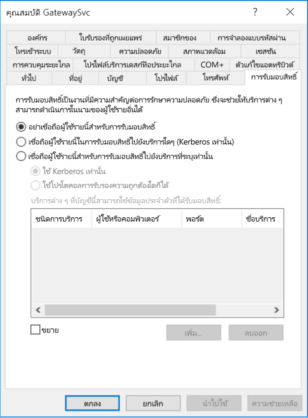
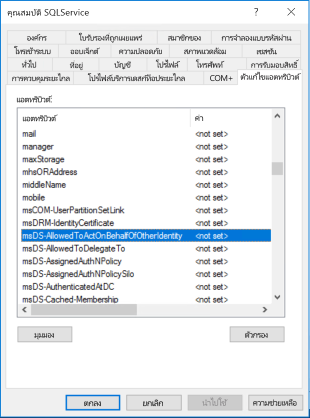

# <a name="configure-kerberos-based-sso-from-power-bi-service-to-on-premises-data-sources"></a><span data-ttu-id="4f11b-103">ใช้ Kerberosสำหรับ SSO จากPower BI ไปยังแหล่งข้อมูลภายในองค์กร</span><span class="sxs-lookup"><span data-stu-id="4f11b-103">Configure Kerberos-based SSO from Power BI service to on-premises data sources</span></span>

<span data-ttu-id="4f11b-104">การเปิดใช้งาน SSO ทำให้รายงาน Power BI และแดชบอร์ดสามารถรีเฟรชข้อมูลจากแหล่งข้อมูลภายในองค์กรได้อย่างง่ายดาย ในขณะที่ยังเป็นไปตามสิทธิ์ระดับผู้ใช้ที่กำหนดค่าไว้บนแหล่งข้อมูลเหล่านั้น</span><span class="sxs-lookup"><span data-stu-id="4f11b-104">Enabling SSO makes it easy for Power BI reports and dashboards to refresh data from on-premises sources while respecting user-level permissions configured on those sources.</span></span> <span data-ttu-id="4f11b-105">ใช้ [การมอบสิทธิ์แบบจำกัดของ Kerberos](/windows-server/security/kerberos/kerberos-constrained-delegation-overview) เพื่อเปิดใช้งานการเชื่อมต่อการลงชื่อเข้าใช้ครั้งเดียว (SSO) แบบไร้รอยต่อ</span><span class="sxs-lookup"><span data-stu-id="4f11b-105">Use [Kerberos constrained delegation](/windows-server/security/kerberos/kerberos-constrained-delegation-overview) to enable seamless SSO connectivity.</span></span> 

## <a name="prerequisites"></a><span data-ttu-id="4f11b-106">ข้อกำหนดเบื้องต้น</span><span class="sxs-lookup"><span data-stu-id="4f11b-106">Prerequisites</span></span>

<span data-ttu-id="4f11b-107">คุณจะต้องกำหนดค่าหลายรายการเพื่อให้การมอบสิทธิ์แบบจำกัดของ Kerberos ทำงานได้อย่างถูกต้อง ซึ่งรวมถึง_ชื่อบริการหลัก (SPN)_ และการตั้งค่าการมอบสิทธิ์บนบัญชีบริการ</span><span class="sxs-lookup"><span data-stu-id="4f11b-107">Several items must be configured for Kerberos constrained delegation to work properly, including _Service Principal Names (SPN)_ and delegation settings on service accounts.</span></span>

### <a name="install-and-configure-the-microsoft-on-premises-data-gateway"></a><span data-ttu-id="4f11b-108">ติดตั้งและกำหนดค่าเกตเวย์ข้อมูลภายในองค์กร Microsoft</span><span class="sxs-lookup"><span data-stu-id="4f11b-108">Install and configure the Microsoft on-premises data gateway</span></span>

<span data-ttu-id="4f11b-109">เกตเวย์ข้อมูลภายในองค์กรรองรับการอัปเกรดแบบแทนที่ และ_การแทนที่การตั้งค่า_ของเกตเวย์เดิม</span><span class="sxs-lookup"><span data-stu-id="4f11b-109">The on-premises data gateway supports an in-place upgrade, and _settings takeover_ of existing gateways.</span></span>

### <a name="run-the-gateway-windows-service-as-a-domain-account"></a><span data-ttu-id="4f11b-110">เรียกใช้บริการ Windows ของเกตเวย์ด้วยบัญชีโดเมน</span><span class="sxs-lookup"><span data-stu-id="4f11b-110">Run the gateway Windows service as a domain account</span></span>

<span data-ttu-id="4f11b-111">ในการติดตั้งแบบมาตรฐาน เกตเวย์จะทำงานเป็นบัญชีบริการภายในเครื่อง **NT Service\PBIEgwService**</span><span class="sxs-lookup"><span data-stu-id="4f11b-111">In a standard installation, the gateway runs as the machine-local service account, **NT Service\PBIEgwService**.</span></span>


<span data-ttu-id="4f11b-113">เมื่อต้องการเปิดใช้งานการมอบสิทธิ์แบบจำกัดของ Kerberos เกตเวย์ต้องทำงานเป็นบัญชีโดเมน เว้นแต่ว่าอินสแตนซ์ Azure Active Directory (Azure AD) ของคุณได้ซิงโครไนซ์กับอินสแตนซ์ Active Directory ภายในเครื่องของคุณแล้ว (โดยใช้ Azure AD DirSync/Connect)</span><span class="sxs-lookup"><span data-stu-id="4f11b-113">To enable Kerberos constrained delegation, the gateway must run as a domain account, unless your Azure Active Directory (Azure AD) instance is already synchronized with your local Active Directory instance (by using Azure AD DirSync/Connect).</span></span> <span data-ttu-id="4f11b-114">เมื่อต้องการสลับไปยังบัญชีโดเมน ให้ดู [เปลี่ยนบัญชีบริการเกตเวย์](/data-integration/gateway/service-gateway-service-account)</span><span class="sxs-lookup"><span data-stu-id="4f11b-114">To switch to a domain account, see [change the gateway service account](/data-integration/gateway/service-gateway-service-account).</span></span>

> [!NOTE]
> <span data-ttu-id="4f11b-115">ถ้ามีการกำหนดค่า Azure AD Connect และบัญชีผู้ใช้ซิงโครไนซ์ บริการเกตเวย์ไม่จำเป็นต้องดำเนินการภายใน Azure AD ค้นหาในขณะทำงาน</span><span class="sxs-lookup"><span data-stu-id="4f11b-115">If Azure AD Connect is configured and user accounts are synchronized, the gateway service doesn't need to perform local Azure AD lookups at runtime.</span></span> <span data-ttu-id="4f11b-116">แต่คุณสามารถใช้ SID ของบริการภายในเครื่องสำหรับบริการเกตเวย์เพื่อทำการกำหนดค่าที่จำเป็นทั้งหมดใน Azure AD ให้เสร็จสมบูรณ์</span><span class="sxs-lookup"><span data-stu-id="4f11b-116">Instead, you can simply use the local service SID for the gateway service to complete all required configuration in Azure AD.</span></span> <span data-ttu-id="4f11b-117">ขั้นตอนการกำหนดค่าการมอบสิทธิ์แบบจำกัดของ Kerberos ที่ระบุไว้ในบทความนี้เหมือนกับการกำหนดค่าที่จำเป็นในบริบท Azure AD</span><span class="sxs-lookup"><span data-stu-id="4f11b-117">The Kerberos constrained delegation configuration steps outlined in this article are the same as the configuration steps required in the Azure AD context.</span></span> <span data-ttu-id="4f11b-118">โดยแค่นำไปใช้กับออบเจ็กต์คอมพิวเตอร์ของเกตเวย์ (ตามที่ได้ระบุโดย SID ของบริการภายในเครื่อง) ใน Azure AD แทนบัญชีโดเมน</span><span class="sxs-lookup"><span data-stu-id="4f11b-118">They are applied to the gateway's computer object (as identified by the local service SID) in Azure AD instead of the domain account.</span></span>

## <a name="obtain-domain-admin-rights-to-configure-spns-setspn-and-kerberos-constrained-delegation-settings"></a><span data-ttu-id="4f11b-119">รับสิทธิ์ผู้ดูแลระบบโดเมนเพื่อกำหนดค่า SPN (SetSPN) และการตั้งค่าการมอบสิทธิ์แบบจำกัดของ Kerberos</span><span class="sxs-lookup"><span data-stu-id="4f11b-119">Obtain domain admin rights to configure SPNs (SetSPN) and Kerberos constrained delegation settings</span></span>

<span data-ttu-id="4f11b-120">เมื่อต้องการกำหนดค่าการตั้งค่าการมอบสิทธิ์ SPN และ Kerberos ผู้ดูแลระบบโดเมนควรหลีกเลี่ยงการให้สิทธิ์กับบุคคลที่ไม่มีสิทธิ์ผู้ดูแลระบบโดเมน</span><span class="sxs-lookup"><span data-stu-id="4f11b-120">To configure SPNs and Kerberos delegation settings, a domain administrator should avoid granting rights to someone that doesn't have domain admin rights.</span></span> <span data-ttu-id="4f11b-121">ในส่วนต่อไปนี้ มีรายละเอียดเพิ่มเติมเกี่ยวกับขั้นตอนการกำหนดค่าที่แนะนำ</span><span class="sxs-lookup"><span data-stu-id="4f11b-121">In the following section, we cover the recommended configuration steps in more detail.</span></span>

## <a name="configure-kerberos-constrained-delegation-for-the-gateway-and-data-source"></a><span data-ttu-id="4f11b-122">กำหนดค่าการมอบสิทธิ์แบบจำกัดของ Kerberos สำหรับเกตเวย์และแหล่งข้อมูล</span><span class="sxs-lookup"><span data-stu-id="4f11b-122">Configure Kerberos constrained delegation for the gateway and data source</span></span>

<span data-ttu-id="4f11b-123">ในกรณีที่จำเป็น ให้กำหนดค่า SPN สำหรับบัญชีโดเมนของบริการเกตเวย์ในฐานะผู้ดูแลระบบโดเมนและกำหนดค่าการตั้งค่าการมอบสิทธิ์บนบัญชีโดเมนของบริการเกตเวย์</span><span class="sxs-lookup"><span data-stu-id="4f11b-123">If necessary, configure an SPN for the gateway service domain account as a domain administrator and configure delegation settings on the gateway service domain account.</span></span>

### <a name="configure-an-spn-for-the-gateway-service-account"></a><span data-ttu-id="4f11b-124">กำหนดค่า SPN สำหรับบัญชีของบริการเกตเวย์</span><span class="sxs-lookup"><span data-stu-id="4f11b-124">Configure an SPN for the gateway service account</span></span>

<span data-ttu-id="4f11b-125">ขั้นแรก ตรวจสอบว่ามีการสร้าง SPN สำหรับบัญชีโดเมน ที่จะใช้เป็นบัญชีของบริการเกตเวย์ ไว้แล้วหรือไม่:</span><span class="sxs-lookup"><span data-stu-id="4f11b-125">First, determine whether an SPN was already created for the domain account used as the gateway service account:</span></span>

1. <span data-ttu-id="4f11b-126">ในฐานะผู้ดูแลระบบโดเมน ให้เรียกใช้สแน็ปอิน **Active Directory Users and Computers** Microsoft Management Console (MMC)</span><span class="sxs-lookup"><span data-stu-id="4f11b-126">As a domain administrator, launch the **Active Directory Users and Computers** Microsoft Management Console (MMC) snap-in.</span></span>

2. <span data-ttu-id="4f11b-127">ในบานหน้าต่างด้านซ้าย ให้คลิกขวาที่ชื่อโดเมน เลือก **ค้นหา** จากนั้นป้อนชื่อบัญชีของบัญชีบริการเกตเวย์</span><span class="sxs-lookup"><span data-stu-id="4f11b-127">In the left pane, right-click the domain name, select **Find**, and then enter the account name of the gateway service account.</span></span>

3. <span data-ttu-id="4f11b-128">ในผลลัพธ์การค้นหา คลิกขวาบนบัญชีของบริการเกตเวย์ แล้วเลือก **คุณสมบัติ**</span><span class="sxs-lookup"><span data-stu-id="4f11b-128">In the search result, right-click the gateway service account and select **Properties**.</span></span>

4. <span data-ttu-id="4f11b-129">ถ้าเห็นแท็บ**การมอบสิทธิ์** ในกล่องโต้ตอบ**คุณสมบัติ** แสดงว่า SPN ได้ถูกสร้างขึ้นเรียบร้อยแล้ว และคุณสามารถข้ามไปยัง [ตัดสินใจเลือกประเภทของการมอบสิทธิ์แบบจำกัดของ Kerberos ที่จะใช้](#decide-on-the-type-of-kerberos-constrained-delegation-to-use)</span><span class="sxs-lookup"><span data-stu-id="4f11b-129">If the **Delegation** tab is visible on the **Properties** dialog, then an SPN was already created and you can skip to [Decide on the type of Kerberos constrained delegation to use](#decide-on-the-type-of-kerberos-constrained-delegation-to-use).</span></span>

5. <span data-ttu-id="4f11b-130">ถ้าไม่มีแท็บ**การมอบสิทธิ์**บนกล่องโต้ตอบ**คุณสมบัติ** คุณสามารถสร้าง SPN บนบัญชีผู้ใช้นั้นด้วยตนเองเพื่อเปิดการใช้งาน</span><span class="sxs-lookup"><span data-stu-id="4f11b-130">If there isn't a **Delegation** tab on the **Properties** dialog box, you can manually create an SPN on the account to enable it.</span></span> <span data-ttu-id="4f11b-131">ใช้ [เครื่องมือ setspn](/previous-versions/windows/it-pro/windows-server-2012-R2-and-2012/cc731241(v=ws.11)) ที่มาพร้อมกับ Windows (คุณจำเป็นต้องมีสิทธิ์ผู้ดูแลระบบโดเมนเพื่อสร้าง SPN)</span><span class="sxs-lookup"><span data-stu-id="4f11b-131">Use the [setspn tool](/previous-versions/windows/it-pro/windows-server-2012-R2-and-2012/cc731241(v=ws.11)) that comes with Windows (you need domain admin rights to create the SPN).</span></span>

   <span data-ttu-id="4f11b-132">ยกตัวอย่าง สมมติว่าบัญชีผู้ใช้บริการเกตเวย์คือ **Contoso\GatewaySvc** และบริการเกตเวย์กำลังทำงานบนเครื่องชื่อว่า **MyGatewayMachine**</span><span class="sxs-lookup"><span data-stu-id="4f11b-132">For example, suppose the gateway service account is **Contoso\GatewaySvc** and the gateway service is running on the machine named **MyGatewayMachine**.</span></span> <span data-ttu-id="4f11b-133">เมื่อต้องการตั้งค่า SPN สำหรับบัญชีบริการเกตเวย์ ให้เรียกใช้คำสั่งต่อไปนี้:</span><span class="sxs-lookup"><span data-stu-id="4f11b-133">To set the SPN for the gateway service account, run the following command:</span></span>

   ```setspn -a gateway/MyGatewayMachine Contoso\GatewaySvc```

   <span data-ttu-id="4f11b-134">คุณสามารถตั้งค่า SPN ได้โดยใช้สแนปอิน **Active Directory Users and Computers** MMC</span><span class="sxs-lookup"><span data-stu-id="4f11b-134">You can also set the SPN by using the **Active Directory Users and Computers** MMC snap-in.</span></span>
   
### <a name="add-gateway-service-account-to-windows-authorization-and-access-group-if-required"></a><span data-ttu-id="4f11b-135">เพิ่มบัญชีผู้ใช้บริการเกตเวย์ไปยัง Windows Authorization และ Access Group ถ้าจำเป็น</span><span class="sxs-lookup"><span data-stu-id="4f11b-135">Add gateway service account to Windows Authorization and Access Group if required</span></span>

<span data-ttu-id="4f11b-136">ในบางกรณีบัญชีผู้ใช้บริการเกตเวย์จะต้องถูกเพิ่มเข้าไปใน Windows Authorization และ Access Group</span><span class="sxs-lookup"><span data-stu-id="4f11b-136">In certain scenarios the gateway service account must be added to the Windows Authorization and Access Group.</span></span> <span data-ttu-id="4f11b-137">ซึ่งกรณีนี้รวมถึงการรักษาความปลอดภัยของ Active Directory environment และเมื่อบัญชีผู้ใช้บริการเกตเวย์และผู้ใช้เกตเวย์นั้นต้องเลียนแบบโดเมนหรือฟอเรสต์ที่แยกกัน</span><span class="sxs-lookup"><span data-stu-id="4f11b-137">These scenarios include security hardening of the Active Directory environment, and when the gateway service account and the user accounts that the gateway will impersonate are in separate domains or forests.</span></span> <span data-ttu-id="4f11b-138">คุณยังสามารถเพิ่มบัญชีผู้ใช้บริการเกตเวย์ไปยัง Windows Authorization และ Access Group ในสถานการณ์ที่โดเมนและฟอเรสต์ไม่ได้ทำงานหนักมาก (ไม่บังคับ)</span><span class="sxs-lookup"><span data-stu-id="4f11b-138">You can also add the gateway service account to Windows Authorization and Access Group in situations where the domain / forest has not been hardened, but it isn't required.</span></span>

<span data-ttu-id="4f11b-139">สำหรับข้อมูลเพิ่มเติมให้ดู [การอนุมัติของ Windows และกลุ่มการเข้าถึง](/windows/security/identity-protection/access-control/active-directory-security-groups#bkmk-winauthaccess)</span><span class="sxs-lookup"><span data-stu-id="4f11b-139">For more information, see [Windows Authorization and Access Group](/windows/security/identity-protection/access-control/active-directory-security-groups#bkmk-winauthaccess).</span></span>

<span data-ttu-id="4f11b-140">ในการดำเนินการขั้นตอนการกำหนดค่านี้ให้เสร็จสมบูรณ์สำหรับแต่ละโดเมนที่มีผู้ใช้ Active Directory ที่คุณต้องการให้บัญชีบริการเกตเวย์สามารถเลียนแบบได้:</span><span class="sxs-lookup"><span data-stu-id="4f11b-140">To complete this configuration step, for each domain that contains Active Directory users you want the gateway service account to be able to impersonate:</span></span>
1. <span data-ttu-id="4f11b-141">ลงชื่อเข้าใช้คอมพิวเตอร์ในโดเมนและเปิดใช้งาน Active Directory และคอมพิวเตอร์ MMC snap-in</span><span class="sxs-lookup"><span data-stu-id="4f11b-141">Sign in to a computer in the domain, and launch the Active Directory Users and Computers MMC snap-in.</span></span>
2. <span data-ttu-id="4f11b-142">ค้นหากลุ่ม **การอนุญาตของ Windows และการเข้าถึงกลุ่ม**ซึ่งโดยทั่วไปแล้วจะพบได้ในคอนเทนเนอร์ **บิวท์อิน**</span><span class="sxs-lookup"><span data-stu-id="4f11b-142">Locate the group **Windows Authorization and Access Group**, which is typically found in the **Builtin** container.</span></span>
3. <span data-ttu-id="4f11b-143">ดับเบิลคลิกที่กลุ่มและคลิกที่แท็บ **สมาชิก**</span><span class="sxs-lookup"><span data-stu-id="4f11b-143">Double click on the group, and click on the **Members** tab.</span></span>
4. <span data-ttu-id="4f11b-144">คลิก **เพิ่ม**และเปลี่ยนตำแหน่งที่ตั้งโดเมนไปยังโดเมนที่บัญชีผู้ใช้บริการเกตเวย์อาศัยอยู่ใน</span><span class="sxs-lookup"><span data-stu-id="4f11b-144">Click **Add**, and change the domain location to the domain that the gateway service account resides in.</span></span>
5. <span data-ttu-id="4f11b-145">พิมพ์ชื่อบัญชีผู้ใช้บริการเกตเวย์และคลิก **ตรวจสอบชื่อ** เพื่อตรวจสอบว่าบัญชีบริการเกตเวย์สามารถเข้าถึงได้</span><span class="sxs-lookup"><span data-stu-id="4f11b-145">Type in the gateway service account name and click **Check Names** to verify that the gateway service account is accessible.</span></span>
6. <span data-ttu-id="4f11b-146">คลิก **ตกลง**</span><span class="sxs-lookup"><span data-stu-id="4f11b-146">Click **OK**.</span></span>
7. <span data-ttu-id="4f11b-147">คลิก**ใช้**</span><span class="sxs-lookup"><span data-stu-id="4f11b-147">Click **Apply**.</span></span>
8. <span data-ttu-id="4f11b-148">รีสตาร์ทบริการเกตเวย์</span><span class="sxs-lookup"><span data-stu-id="4f11b-148">Restart the gateway service.</span></span>

### <a name="decide-on-the-type-of-kerberos-constrained-delegation-to-use"></a><span data-ttu-id="4f11b-149">ตัดสินใจเลือกประเภทของการมอบสิทธิ์แบบจำกัดของ Kerberos ที่จะใช้</span><span class="sxs-lookup"><span data-stu-id="4f11b-149">Decide on the type of Kerberos constrained delegation to use</span></span>

<span data-ttu-id="4f11b-150">คุณสามารถกำหนดค่าการตั้งค่าการมอบสิทธิ์สำหรับทั้งการมอบสิทธิ์แบบจำกัดของ Kerberos ตามมาตรฐาน หรือการมอบสิทธิ์แบบจำกัดของ Kerberos ตามทรัพยากร</span><span class="sxs-lookup"><span data-stu-id="4f11b-150">You can configure delegation settings for either standard Kerberos constrained delegation or resource-based Kerberos constrained delegation.</span></span> <span data-ttu-id="4f11b-151">ใช้การมอบสิทธิ์ตามทรัพยากร (ต้องใช้ Windows Server 2012 หรือใหม่กว่า) ถ้าแหล่งข้อมูลของคุณเป็นของโดเมนอื่นนอกเหนือจากเกตเวย์ของคุณ</span><span class="sxs-lookup"><span data-stu-id="4f11b-151">Use resource-based delegation (requires Windows Server 2012 or later) if your data source belongs to a different domain than your gateway.</span></span> <span data-ttu-id="4f11b-152">สำหรับข้อมูลเพิ่มเติมเกี่ยวกับความแตกต่างระหว่างสองวิธีในการมอบสิทธิ์ โปรดดู[ภาพรวมของการมอบสิทธิ์แบบจำกัดของ Kerberos](/windows-server/security/kerberos/kerberos-constrained-delegation-overview)</span><span class="sxs-lookup"><span data-stu-id="4f11b-152">For more information on the differences between the two approaches to delegation, see [Kerberos constrained delegation overview](/windows-server/security/kerberos/kerberos-constrained-delegation-overview).</span></span>

 <span data-ttu-id="4f11b-153">ให้ดำเนินการในส่วนใดส่วนหนึ่งต่อไปนี้ โดยขึ้นอยู่กับวิธีการที่คุณต้องการใช้</span><span class="sxs-lookup"><span data-stu-id="4f11b-153">Depending on which approach you want to use, proceed to one of the following sections.</span></span> <span data-ttu-id="4f11b-154">ไม่จำเป็นต้องทำให้เสร็จทั้งสองส่วน:</span><span class="sxs-lookup"><span data-stu-id="4f11b-154">Don't complete both sections:</span></span>
 - [<span data-ttu-id="4f11b-155">กำหนดค่าบัญชีผู้ใช้บริการเกตเวย์สำหรับการมอบสิทธิ์แบบจำกัดของ Kerberos ตามมาตรฐาน</span><span class="sxs-lookup"><span data-stu-id="4f11b-155">Configure the gateway service account for standard Kerberos constrained delegation</span></span>](#configure-the-gateway-service-account-for-standard-kerberos-constrained-delegation)
- <span data-ttu-id="4f11b-156">[กำหนดค่าบัญชีผู้ใช้บริการเกตเวย์สำหรับการมอบสิทธิ์แบบจำกัดของ Kerberos ตามทรัพยากร](#configure-the-gateway-service-account-for-resource-based-kerberos-constrained-delegation)</span><span class="sxs-lookup"><span data-stu-id="4f11b-156">[Configure the gateway service account for resource-based Kerberos constrained delegation](#configure-the-gateway-service-account-for-resource-based-kerberos-constrained-delegation).</span></span> 

## <a name="configure-the-gateway-service-account-for-standard-kerberos-constrained-delegation"></a><span data-ttu-id="4f11b-157">กำหนดค่าบัญชีผู้ใช้บริการเกตเวย์สำหรับการมอบหมายที่มีข้อจำกัดของ Kerberos มาตรฐาน</span><span class="sxs-lookup"><span data-stu-id="4f11b-157">Configure the gateway service account for standard Kerberos constrained delegation</span></span>

> [!NOTE]
> <span data-ttu-id="4f11b-158">ทำตามขั้นตอนในส่วนนี้ให้เสร็จสมบูรณ์ถ้าคุณต้องการเปิดใช้งาน[การมอบสิทธิ์แบบจำกัดของ Kerberos ตามมาตรฐาน](/windows-server/security/kerberos/kerberos-constrained-delegation-overview)</span><span class="sxs-lookup"><span data-stu-id="4f11b-158">Complete the steps in this section if you want to enable [standard Kerberos constrained delegation](/windows-server/security/kerberos/kerberos-constrained-delegation-overview).</span></span> <span data-ttu-id="4f11b-159">มิฉะนั้น ถ้าคุณต้องการเปิดใช้งานการมอบสิทธิ์แบบจำกัดของ Kerberos ตามทรัพยากร ให้ทำตามขั้นตอนใน [กำหนดค่าบัญชีบริการเกตเวย์สำหรับการมอบสิทธิ์แบบจำกัดของ Kerberos ตามทรัพยากร](#configure-the-gateway-service-account-for-resource-based-kerberos-constrained-delegation)</span><span class="sxs-lookup"><span data-stu-id="4f11b-159">Otherwise, if you want to enable resource-based Kerberos constrained delegation, complete the steps in [Configure the gateway service account for resource-based Kerberos constrained delegation](#configure-the-gateway-service-account-for-resource-based-kerberos-constrained-delegation).</span></span>

<span data-ttu-id="4f11b-160">ตอนนี้เราจะตั้งค่าการมอบสิทธิ์สำหรับบัญชีบริการเกตเวย์</span><span class="sxs-lookup"><span data-stu-id="4f11b-160">We'll now set the delegation settings for the gateway service account.</span></span> <span data-ttu-id="4f11b-161">มีเครื่องมือหลายตัวที่คุณสามารถใช้เพื่อดำเนินการขั้นตอนเหล่านี้</span><span class="sxs-lookup"><span data-stu-id="4f11b-161">There are multiple tools you can use to perform these steps.</span></span> <span data-ttu-id="4f11b-162">ในที่นี้ เราจะใช้สแนปอิน **Active Directory Users and Computers** MMC เพื่อจัดการและเผยแพร่ข้อมูลในไดเรกทอรี</span><span class="sxs-lookup"><span data-stu-id="4f11b-162">Here, we'll use the **Active Directory Users and Computers** MMC snap-in to administer and publish information in the directory.</span></span> <span data-ttu-id="4f11b-163">ซึ่งพร้อมใช้งานบนตัวควบคุมโดเมนตามค่าเริ่มต้น; บนเครื่องอื่น คุณสามารถเปิดใช้งานผ่านทางการกำหนดค่าคุณลักษณะของ Windows</span><span class="sxs-lookup"><span data-stu-id="4f11b-163">It's available on domain controllers by default; on other machines, you can enable it through Windows feature configuration.</span></span>

<span data-ttu-id="4f11b-164">เราจำเป็นต้องกำหนดค่าการมอบสิทธิ์แบบจำกัดของ Kerberos ด้วยเปลี่ยนโพรโทคอล</span><span class="sxs-lookup"><span data-stu-id="4f11b-164">We need to configure Kerberos constrained delegation with protocol transiting.</span></span> <span data-ttu-id="4f11b-165">สำหรับการมอบสิทธิ์แบบจำกัด คุณต้องมีความชัดเจนว่าบริการใดที่คุณต้องการอนุญาตให้เกตเวย์นำเสนอข้อมูลประจำตัวที่ได้รับมอบสิทธิ์</span><span class="sxs-lookup"><span data-stu-id="4f11b-165">With constrained delegation, you must be explicit about which services you allow the gateway to present delegated credentials to.</span></span> <span data-ttu-id="4f11b-166">ตัวอย่างเช่น เฉพาะ SQL Server หรือเซิร์ฟเวอร์ SAP HANA ของคุณเท่านั้นที่ยอมรับการเรียกรับสิทธิ์จากบัญชีบริการเกตเวย์</span><span class="sxs-lookup"><span data-stu-id="4f11b-166">For example, only SQL Server or your SAP HANA server accepts delegation calls from the gateway service account.</span></span>

<span data-ttu-id="4f11b-167">ส่วนนี้ถือว่า คุณได้กำหนดค่า SPN สำหรับแหล่งข้อมูลพื้นฐานของคุณ (เช่น SQL Server, SAP HANA,SAP BW Teradata และ Spark)</span><span class="sxs-lookup"><span data-stu-id="4f11b-167">This section assumes you have already configured SPNs for your underlying data sources (such as SQL Server, SAP HANA, SAP BW, Teradata, or Spark).</span></span> <span data-ttu-id="4f11b-168">หากต้องการเรียนรู้วิธีกำหนดค่า SPN ของเซิร์ฟเวอร์แหล่งข้อมูล โปรดอ้างอิงเอกสารทางเทคนิคสำหรับเซิร์ฟเวอร์ฐานข้อมูลที่เกี่ยวข้องและดูส่วน *SPN ใดที่แอปของคุณจำเป็นต้องมี* ในบล็อกโพสต์ [รายการตรวจสอบ Kerberos ของฉัน](https://techcommunity.microsoft.com/t5/SQL-Server-Support/My-Kerberos-Checklist-8230/ba-p/316160)</span><span class="sxs-lookup"><span data-stu-id="4f11b-168">To learn how to configure those data source server SPNs, refer to the technical documentation for the respective database server and see the section *What SPN does your app require?* in the [My Kerberos Checklist](https://techcommunity.microsoft.com/t5/SQL-Server-Support/My-Kerberos-Checklist-8230/ba-p/316160) blog post.</span></span>

<span data-ttu-id="4f11b-169">ในขั้นตอนต่อไปนี้ เราสมมติว่าสภาพแวดล้อมในองค์กรที่มีสองเครื่องในโดเมนที่เหมือนกัน: เครื่องเกตเวย์และเซิร์ฟเวอร์ฐานข้อมูลที่เรียกใช้ SQL Server ที่ได้รับการกำหนดค่าสำหรับ SSO ที่ใช้ Kerberos อยู่แล้ว</span><span class="sxs-lookup"><span data-stu-id="4f11b-169">In the following steps, we assume an on-premises environment with two machines in the same domain: a gateway machine and a database server running SQL Server that has already been configured for Kerberos-based SSO.</span></span> <span data-ttu-id="4f11b-170">ขั้นตอนนี้สามารถนำมาใช้ได้กับแหล่งข้อมูลที่ได้รับการสนับสนุนอีกหนึ่งรายการดังนั้นตราบใดที่แหล่งข้อมูลได้รับการกำหนดค่าไว้สำหรับการลงชื่อเข้าใช้แบบครั้งเดียวที่ใช้ Kerberos</span><span class="sxs-lookup"><span data-stu-id="4f11b-170">The steps can be adopted for one of the other supported data sources, so long as the data source has already been configured for Kerberos-based single sign-on.</span></span> <span data-ttu-id="4f11b-171">สำหรับตัวอย่างนี้ เราจะใช้การตั้งค่าต่อไปนี้:</span><span class="sxs-lookup"><span data-stu-id="4f11b-171">For this example, we'll use the following settings:</span></span>

* <span data-ttu-id="4f11b-172">Active Directory Domain (Netbios): **Contoso**</span><span class="sxs-lookup"><span data-stu-id="4f11b-172">Active Directory Domain (Netbios): **Contoso**</span></span>
* <span data-ttu-id="4f11b-173">ชื่อเครื่องเกตเวย์: **MyGatewayMachine**</span><span class="sxs-lookup"><span data-stu-id="4f11b-173">Gateway machine name: **MyGatewayMachine**</span></span>
* <span data-ttu-id="4f11b-174">บัญชีบริการเกตเวย์: **Contoso\GatewaySvc**</span><span class="sxs-lookup"><span data-stu-id="4f11b-174">Gateway service account: **Contoso\GatewaySvc**</span></span>
* <span data-ttu-id="4f11b-175">ชื่อเครื่องแหล่งข้อมูล SQL Server: **TestSQLServer**</span><span class="sxs-lookup"><span data-stu-id="4f11b-175">SQL Server data source machine name: **TestSQLServer**</span></span>
* <span data-ttu-id="4f11b-176">บัญชีบริการแหล่งข้อมูล SQL Server: **Contoso\SQLService**</span><span class="sxs-lookup"><span data-stu-id="4f11b-176">SQL Server data source service account: **Contoso\SQLService**</span></span>

<span data-ttu-id="4f11b-177">นี่คือวิธีการกำหนดค่าการตั้งค่าการมอบสิทธิ์:</span><span class="sxs-lookup"><span data-stu-id="4f11b-177">Here's how to configure the delegation settings:</span></span>

1. <span data-ttu-id="4f11b-178">ให้เปิดสแนปอิน **Active Directory Users and Computers** MMC ด้วยสิทธิ์ผู้ดูแลระบบโดเมน</span><span class="sxs-lookup"><span data-stu-id="4f11b-178">With domain administrator rights, open the **Active Directory Users and Computers** MMC snap-in.</span></span>

2. <span data-ttu-id="4f11b-179">คลิกขวาบนบัญชีบริการเกตเวย์ (**Contoso\GatewaySvc**) แล้วเลือก **คุณสมบัติ**</span><span class="sxs-lookup"><span data-stu-id="4f11b-179">Right-click the gateway service account (**Contoso\GatewaySvc**), and select **Properties**.</span></span>

3. <span data-ttu-id="4f11b-180">เลือกแถบ **การมอบหมาย**</span><span class="sxs-lookup"><span data-stu-id="4f11b-180">Select the **Delegation** tab.</span></span>

4. <span data-ttu-id="4f11b-181">เลือก **เชื่อถือคอมพิวเตอร์เครื่องนี้สำหรับการมอบหมายบริการที่ระบุเท่านั้น** > **ใช้โพรโทคอลการรับรองความถูกต้องใด ๆ**</span><span class="sxs-lookup"><span data-stu-id="4f11b-181">Select **Trust this computer for delegation to specified services only** > **Use any authentication protocol**.</span></span>

5. <span data-ttu-id="4f11b-182">ภายใต้ **บริการที่บัญชีผู้ใช้นี้สามารถใช้ข้อมูลประจำตัวที่ได้รับมอบหมาย:** เลือก **เพิ่ม**</span><span class="sxs-lookup"><span data-stu-id="4f11b-182">Under **Services to which this account can present delegated credentials**, select **Add**.</span></span>

6. <span data-ttu-id="4f11b-183">ในกล่องโต้ตอบใหม่ เลือก **ผู้ใช้หรือคอมพิวเตอร์**</span><span class="sxs-lookup"><span data-stu-id="4f11b-183">In the new dialog box, select **Users or Computers**.</span></span>

7. <span data-ttu-id="4f11b-184">ป้อนบัญชีบริการสำหรับแหล่งข้อมูล จากนั้นเลือก **ตกลง**</span><span class="sxs-lookup"><span data-stu-id="4f11b-184">Enter the service account for the data source, and then select **OK**.</span></span>

   <span data-ttu-id="4f11b-185">ตัวอย่างเช่น แหล่งข้อมูล SQL Server สามารถมีบัญชีบริการเช่น *Contoso\SQLService*</span><span class="sxs-lookup"><span data-stu-id="4f11b-185">For example, a SQL Server data source can have a service account like  *Contoso\SQLService*.</span></span> <span data-ttu-id="4f11b-186">ควรตั้งค่า SPN ที่เหมาะสมสำหรับแหล่งข้อมูลในบัญชีนี้แล้ว</span><span class="sxs-lookup"><span data-stu-id="4f11b-186">An appropriate SPN for the data source should have already been set on this account.</span></span> 

8. <span data-ttu-id="4f11b-187">เลือก SPN ที่คุณสร้างขึ้นสำหรับเซิร์ฟเวอร์ฐานข้อมูล</span><span class="sxs-lookup"><span data-stu-id="4f11b-187">Select the SPN that you created for the database server.</span></span> 

   <span data-ttu-id="4f11b-188">ในตัวอย่างของเรา SPN จะเริ่มต้นด้วย *MSSQLSvc*</span><span class="sxs-lookup"><span data-stu-id="4f11b-188">In our example, the SPN begins with *MSSQLSvc*.</span></span> <span data-ttu-id="4f11b-189">ถ้าคุณเพิ่มทั้ง FQDN และ NetBIOS SPN สำหรับบริการฐานข้อมูลของคุณ ให้เลือกทั้งสองอย่าง</span><span class="sxs-lookup"><span data-stu-id="4f11b-189">If you added both the FQDN and the NetBIOS SPN for your database service, select both.</span></span> <span data-ttu-id="4f11b-190">คุณอาจเห็นได้เพียงหนึ่งรายการเท่านั้น</span><span class="sxs-lookup"><span data-stu-id="4f11b-190">You might see only one.</span></span>

9. <span data-ttu-id="4f11b-191">เลือก**ตกลง**</span><span class="sxs-lookup"><span data-stu-id="4f11b-191">Select **OK**.</span></span> 

   <span data-ttu-id="4f11b-192">ขณะนี้คุณควรเห็น SPN ในรายการของบริการ ซึ่งบัญชีบริการเกตเวย์สามารถแสดงข้อมูลประจำตัวที่ได้รับมอบหมายได้</span><span class="sxs-lookup"><span data-stu-id="4f11b-192">You should now see the SPN in the list of services to which the gateway service account can present delegated credentials.</span></span>

    

10. <span data-ttu-id="4f11b-194">หากต้องการดำเนินกระบวนการตั้งค่าต่อไป ดำเนินการต่อเพื่อ[อนุญาตให้ใช้สิทธิ์ของนโยบายภายในของบัญชีบริการเกตเวย์บนเครื่องเกตเวย์](#grant-the-gateway-service-account-local-policy-rights-on-the-gateway-machine)</span><span class="sxs-lookup"><span data-stu-id="4f11b-194">To continue the setup process, proceed to [Grant the gateway service account local policy rights on the gateway machine](#grant-the-gateway-service-account-local-policy-rights-on-the-gateway-machine).</span></span>

## <a name="configure-the-gateway-service-account-for-resource-based-kerberos-constrained-delegation"></a><span data-ttu-id="4f11b-195">กำหนดค่าบัญชีผู้ใช้บริการเกตเวย์สำหรับการมอบหมายที่มีข้อจำกัดของ Kerberos ที่ใช้ทรัพยากร</span><span class="sxs-lookup"><span data-stu-id="4f11b-195">Configure the gateway service account for resource-based Kerberos constrained delegation</span></span>

> [!NOTE]
> <span data-ttu-id="4f11b-196">ทำตามขั้นตอนในส่วนนี้ให้เสร็จสมบูรณ์ถ้าคุณต้องการเปิดใช้งาน[การมอบสิทธิ์แบบจำกัดของ Kerberos ตามทรัพยากร](/windows-server/security/kerberos/kerberos-constrained-delegation-overview#resource-based-constrained-delegation-across-domains)</span><span class="sxs-lookup"><span data-stu-id="4f11b-196">Complete the steps in this section if you want to enable [resource-based Kerberos constrained delegation](/windows-server/security/kerberos/kerberos-constrained-delegation-overview#resource-based-constrained-delegation-across-domains).</span></span> <span data-ttu-id="4f11b-197">มิฉะนั้น ถ้าคุณต้องการเปิดใช้งานการมอบสิทธิ์แบบจำกัดของ Kerberos ตามมาตรฐาน ให้ทำตามขั้นตอนใน [กำหนดค่าบัญชีบริการเกตเวย์สำหรับการมอบสิทธิ์แบบจำกัดของ Kerberos ตามมาตรฐาน](#configure-the-gateway-service-account-for-standard-kerberos-constrained-delegation)</span><span class="sxs-lookup"><span data-stu-id="4f11b-197">Otherwise, if you want to enable standard Kerberos constrained delegation, complete the steps in [Configure the gateway service account for standard Kerberos constrained delegation](#configure-the-gateway-service-account-for-standard-kerberos-constrained-delegation).</span></span>

<span data-ttu-id="4f11b-198">คุณใช้[การมอบสิทธิ์แบบจำกัดของ Kerberos ตามทรัพยากร](/windows-server/security/kerberos/kerberos-constrained-delegation-overview#resource-based-constrained-delegation-across-domains)เพื่อเปิดใช้งานการเชื่อมต่อการลงชื่อเข้าใช้แบบครั้งเดียวสำหรับ Windows Server 2012 และเวอร์ชันที่ใหม่กว่า</span><span class="sxs-lookup"><span data-stu-id="4f11b-198">You use [resource-based Kerberos constrained delegation](/windows-server/security/kerberos/kerberos-constrained-delegation-overview#resource-based-constrained-delegation-across-domains) to enable single sign-on connectivity for Windows Server 2012 and later versions.</span></span> <span data-ttu-id="4f11b-199">การมอบสิทธิ์ประเภทนี้จะอนุญาตให้บริการส่วนหน้าและส่วนหลังอยู่ในโดเมนที่ต่างกัน</span><span class="sxs-lookup"><span data-stu-id="4f11b-199">This type of delegation permits front-end and back-end services to be in different domains.</span></span> <span data-ttu-id="4f11b-200">เพื่อให้สามารถใช้งานได้ โดเมนบริการส่วนหลังจำเป็นต้องเชื่อถือโดเมนบริการส่วนหน้า</span><span class="sxs-lookup"><span data-stu-id="4f11b-200">For it to work, the back-end service domain needs to trust the front-end service domain.</span></span>

<span data-ttu-id="4f11b-201">ในขั้นตอนต่อไปนี้เราสมมติว่าสภาพแวดล้อมในองค์กรที่มีสองเครื่องในโดเมนที่ต่างกัน: เครื่องเกตเวย์และเซิร์ฟเวอร์ฐานข้อมูลที่เรียกใช้ SQL Server ที่ได้รับการกำหนดค่าสำหรับ SSO ที่ใช้ Kerberos อยู่แล้ว</span><span class="sxs-lookup"><span data-stu-id="4f11b-201">In the following steps, we assume an on-premises environment with two machines in different domains: a gateway machine and a database server running SQL Server that has already been configured for Kerberos-based SSO.</span></span> <span data-ttu-id="4f11b-202">ขั้นตอนเหล่านี้สามารถนำมาใช้ได้กับแหล่งข้อมูลใดแหล่งข้อมูลหนึ่งในแหล่งข้อมูลที่ได้รับการสนับสนุนอื่น ๆ ตราบใดที่มีการกำหนดค่าแหล่งข้อมูลสำหรับการลงชื่อเข้าใช้แบบครั้งเดียวที่ใช้ Kerberos</span><span class="sxs-lookup"><span data-stu-id="4f11b-202">These steps can be adopted for one of the other supported data sources, so long as the data source has already been configured for Kerberos-based single sign-on.</span></span> <span data-ttu-id="4f11b-203">สำหรับตัวอย่างนี้ เราจะใช้การตั้งค่าต่อไปนี้:</span><span class="sxs-lookup"><span data-stu-id="4f11b-203">For this example, we'll use the following settings:</span></span>

* <span data-ttu-id="4f11b-204">ระบบโดเมนส่วนหน้าของ Active Directory (Netbios): **ContosoFrontEnd**</span><span class="sxs-lookup"><span data-stu-id="4f11b-204">Active Directory frontend Domain (Netbios): **ContosoFrontEnd**</span></span>
* <span data-ttu-id="4f11b-205">ระบบโดเมนส่วนหลังของ Active Directory (Netbios): **ContosoBackEnd**</span><span class="sxs-lookup"><span data-stu-id="4f11b-205">Active Directory backend Domain (Netbios): **ContosoBackEnd**</span></span>
* <span data-ttu-id="4f11b-206">ชื่อเครื่องเกตเวย์: **MyGatewayMachine**</span><span class="sxs-lookup"><span data-stu-id="4f11b-206">Gateway machine name: **MyGatewayMachine**</span></span>
* <span data-ttu-id="4f11b-207">บัญชีบริการเกตเวย์: **ContosoFrontEnd\GatewaySvc**</span><span class="sxs-lookup"><span data-stu-id="4f11b-207">Gateway service account: **ContosoFrontEnd\GatewaySvc**</span></span>
* <span data-ttu-id="4f11b-208">ชื่อเครื่องแหล่งข้อมูล SQL Server: **TestSQLServer**</span><span class="sxs-lookup"><span data-stu-id="4f11b-208">SQL Server data source machine name: **TestSQLServer**</span></span>
* <span data-ttu-id="4f11b-209">บัญชีบริการแหล่งข้อมูล SQL Server: **ContosoBackEnd\SQLService**</span><span class="sxs-lookup"><span data-stu-id="4f11b-209">SQL Server data source service account: **ContosoBackEnd\SQLService**</span></span>

<span data-ttu-id="4f11b-210">ทำตามขั้นตอนการกำหนดค่าต่อไปนี้ให้เสร็จสิ้น:</span><span class="sxs-lookup"><span data-stu-id="4f11b-210">Complete the following configuration steps:</span></span>

1. <span data-ttu-id="4f11b-211">ใช้สแนปอิน **Active Directory Users and Computers** MMC บนตัวควบคุมโดเมนสำหรับโดเมน **ContosoFrontEnd** และตรวจสอบว่าไม่มีการตั้งค่าการมอบสิทธิ์สำหรับบัญชีบริการเกตเวย์</span><span class="sxs-lookup"><span data-stu-id="4f11b-211">Use the **Active Directory Users and Computers** MMC snap-in on the domain controller for the **ContosoFrontEnd** domain and verify no delegation settings are applied for the gateway service account.</span></span>

    

2. <span data-ttu-id="4f11b-213">ใช้ **Active Directory Users and Computers** บนตัวควบคุมโดเมนสำหรับโดเมน **ContosoBack-end** และตรวจสอบว่าไม่มีการปรับใช้การตั้งค่าการมอบสิทธิ์สำหรับบัญชีบริการส่วนหลัง</span><span class="sxs-lookup"><span data-stu-id="4f11b-213">Use **Active Directory Users and Computers** on the domain controller for the **ContosoBackEnd** domain and verify no delegation settings are applied for the back-end service account.</span></span>

    

3. <span data-ttu-id="4f11b-215">ในแท็บ **ตัวแก้ไขแอตทริบิวต์** ของคุณสมบัติบัญชี ให้ตรวจสอบว่าไม่มีการตั้งค่าแอตทริบิวต์ **msDS-AllowedToActOnBehalfOfOtherIdentity**</span><span class="sxs-lookup"><span data-stu-id="4f11b-215">In the **Attribute Editor** tab of the account properties, verify that the **msDS-AllowedToActOnBehalfOfOtherIdentity** attribute isn't set.</span></span>

    

4. <span data-ttu-id="4f11b-217">ใน **Active Directory Users and Computers** ให้สร้างกลุ่มบนตัวควบคุมโดเมนสำหรับโดเมน **ContosoBackEnd**</span><span class="sxs-lookup"><span data-stu-id="4f11b-217">In **Active Directory Users and Computers**, create a group on the domain controller for the **ContosoBackEnd** domain.</span></span> <span data-ttu-id="4f11b-218">เพิ่มบัญชีบริการเกตเวย์ **GatewaySvc** ไปยังกลุ่ม **ResourceDelGroup**</span><span class="sxs-lookup"><span data-stu-id="4f11b-218">Add the **GatewaySvc** gateway service account to the **ResourceDelGroup** group.</span></span> 

    

5. <span data-ttu-id="4f11b-220">เปิดพร้อมท์คำสั่งและเรียกใช้คำสั่งต่อไปนี้ในตัวควบคุมโดเมนสำหรับโดเมน **ContosoBackEnd** เพื่ออัปเดตแอตทริบิวต์ **msDS-AllowedToActOnBehalfOfOtherIdentity** ของบัญชีบริการส่วนหลัง:</span><span class="sxs-lookup"><span data-stu-id="4f11b-220">Open a command prompt and run the following commands in the domain controller for the **ContosoBackEnd** domain to update the **msDS-AllowedToActOnBehalfOfOtherIdentity** attribute of the back-end service account:</span></span>

    ```powershell
    $c = Get-ADGroup ResourceDelGroup
    Set-ADUser SQLService -PrincipalsAllowedToDelegateToAccount $c
    ```

6. <span data-ttu-id="4f11b-221">ใน **Active Directory Users and Computers** ให้ตรวจสอบว่าการอัปเดตจะแสดงอยู่ในแท็บ **ตัวแก้ไขแอตทริบิวต์** ในคุณสมบัติสำหรับบัญชีบริการส่วนหลังหรือไม่</span><span class="sxs-lookup"><span data-stu-id="4f11b-221">In **Active Directory Users and Computers**, verify that the update is reflected in the **Attribute Editor** tab in the properties for the back-end service account.</span></span> 

## <a name="grant-the-gateway-service-account-local-policy-rights-on-the-gateway-machine"></a><span data-ttu-id="4f11b-222">การอนุญาต สิทธิ์ของนโยบายภายในของบัญชีบริการเกตเวย์บนเครื่องเกตเวย์</span><span class="sxs-lookup"><span data-stu-id="4f11b-222">Grant the gateway service account local policy rights on the gateway machine</span></span>

<span data-ttu-id="4f11b-223">สุดท้าย บนเครื่องที่ใช้บริการเกตเวย์ (**MyGatewayMachine** ในตัวอย่างของเรา) ให้สิทธิ์ในการ**เลียนแบบไคลเอ็นต์หลังจากการรับรองความถูกต้อง** และ**การทำหน้าที่เป็นส่วนหนึ่งของระบบปฏิบัติการ (SeTcbPrivilege)** ของนโยบายภายในเครื่องแก่บัญชีบริการเกตเวย์</span><span class="sxs-lookup"><span data-stu-id="4f11b-223">Finally, on the machine running the gateway service (**MyGatewayMachine** in our example), grant the gateway service account the local policies **Impersonate a client after authentication** and **Act as part of the operating system (SeTcbPrivilege)**.</span></span> <span data-ttu-id="4f11b-224">ดำเนินการกำหนดค่านี้ด้วยตัวแก้ไขนโยบายกลุ่มภายใน (**gpedit.msc**)</span><span class="sxs-lookup"><span data-stu-id="4f11b-224">Perform this configuration with the Local Group Policy Editor (**gpedit.msc**).</span></span>

1. <span data-ttu-id="4f11b-225">บนเครื่องเกตเวย์ ให้เรียกใช้ **gpedit.msc**</span><span class="sxs-lookup"><span data-stu-id="4f11b-225">On the gateway machine, run **gpedit.msc**.</span></span>

2. <span data-ttu-id="4f11b-226">ฟหกดไปยัง **นโยบายคอมพิวเตอร์** &gt;  **การกำหนดค่าคอมพิวเตอร์** &gt; **การตั้งค่า Windows** &gt; **การตั้งค่าความปลอดภัย** &gt; **นโยบายภายในเครื่อง** &gt;  **การกำหนดสิทธิ์ของผู้ใช้**</span><span class="sxs-lookup"><span data-stu-id="4f11b-226">Go to **Local Computer Policy** &gt; **Computer Configuration** &gt; **Windows Settings** &gt; **Security Settings** &gt; **Local Policies** &gt; **User Rights Assignment**.</span></span>

    

3. <span data-ttu-id="4f11b-228">ภายใต้ **การกำหนดสิทธิ์ของผู้ใช้** จากรายการนโยบาย ให้เลือก **เลียนแบบไคลเอ็นต์หลังจากการรับรองความถูกต้อง**</span><span class="sxs-lookup"><span data-stu-id="4f11b-228">Under **User Rights Assignment**, from the list of policies, select **Impersonate a client after authentication**.</span></span>

    
    
4. <span data-ttu-id="4f11b-230">คลิกขวาที่นโยบาย เปิด**คุณสมบัติ** จากนั้นดูรายการบัญชี</span><span class="sxs-lookup"><span data-stu-id="4f11b-230">Right-click the policy, open **Properties**, and then view the list of accounts.</span></span> 

    <span data-ttu-id="4f11b-231">รายการจะต้องมีบัญชีบริการเกตเวย์ (**Contoso\GatewaySvc** หรือ **ContosoFrontEnd\GatewaySvc** ทั้งนี้ขึ้นอยู่กับประเภทของการมอบสิทธิ์แบบจำกัด)</span><span class="sxs-lookup"><span data-stu-id="4f11b-231">The list must include the gateway service account (**Contoso\GatewaySvc** or **ContosoFrontEnd\GatewaySvc** depending on the type of constrained delegation).</span></span>

5. <span data-ttu-id="4f11b-232">ภายใต้**การกำหนดสิทธิ์ของผู้ใช้** ให้เลือก**ทำหน้าที่เป็นส่วนหนึ่งของระบบปฏิบัติการ (SeTcbPrivilege)** จากรายการนโยบาย</span><span class="sxs-lookup"><span data-stu-id="4f11b-232">Under **User Rights Assignment**, select **Act as part of the operating system (SeTcbPrivilege)** from the list of policies.</span></span> <span data-ttu-id="4f11b-233">ตรวจสอบให้แน่ใจว่าบัญชีบริการเกตเวย์รวมอยู่ในรายการบัญชีหรือไม่</span><span class="sxs-lookup"><span data-stu-id="4f11b-233">Ensure that the gateway service account is included in the list of accounts.</span></span>

6. <span data-ttu-id="4f11b-234">รีสตาร์ต **เกตเวย์ข้อมูลในองค์กร**</span><span class="sxs-lookup"><span data-stu-id="4f11b-234">Restart the **On-premises data gateway** service process.</span></span>

### <a name="set-user-mapping-configuration-parameters-on-the-gateway-machine-if-necessary"></a><span data-ttu-id="4f11b-235">ตั้งพารามิเตอร์การกำหนดค่าการแมปผู้ใช้บนเครื่องเกตเวย์ (ถ้าจำเป็น)</span><span class="sxs-lookup"><span data-stu-id="4f11b-235">Set user-mapping configuration parameters on the gateway machine (if necessary)</span></span>

<span data-ttu-id="4f11b-236">ถ้าคุณไม่ได้กำหนดค่า Azure AD Connect ไว้ ให้ทำตามขั้นตอนเหล่านี้เพื่อแมปผู้ใช้ของบริการ Power BI ทุกรายเข้ากับผู้ใช้ Azure AD</span><span class="sxs-lookup"><span data-stu-id="4f11b-236">If you don't have Azure AD Connect configured, follow these steps to map a Power BI service user to a local Active Directory user.</span></span> <span data-ttu-id="4f11b-237">ผู้ใช้ Active Directory แต่ละคนที่ถูกแมปด้วยวิธีนี้จะต้องมีสิทธิ์ SSO สำหรับแหล่งข้อมูลของคุณ</span><span class="sxs-lookup"><span data-stu-id="4f11b-237">Each Active Directory user mapped in this way needs to have SSO permissions for your data source.</span></span> <span data-ttu-id="4f11b-238">สำหรับข้อมูลเพิ่มเติม โปรดดูที่ [วิดีโอ Guy in a Cube](https://www.youtube.com/watch?v=NG05PG9aiRw)</span><span class="sxs-lookup"><span data-stu-id="4f11b-238">For more information, see [Guy in a Cube video](https://www.youtube.com/watch?v=NG05PG9aiRw).</span></span>

1. <span data-ttu-id="4f11b-239">เปิดไฟล์การกำหนดค่าเกตเวย์หลัก Microsoft.PowerBI.DataMovement.Pipeline.GatewayCore.dll</span><span class="sxs-lookup"><span data-stu-id="4f11b-239">Open the main gateway configuration file, Microsoft.PowerBI.DataMovement.Pipeline.GatewayCore.dll.</span></span> <span data-ttu-id="4f11b-240">ตามค่าเริ่มต้น ไฟล์นี้จะถูกเก็บไว้ที่ C:\Program Files\On-premises data gateway</span><span class="sxs-lookup"><span data-stu-id="4f11b-240">By default, this file is stored at C:\Program Files\On-premises data gateway.</span></span>

1. <span data-ttu-id="4f11b-241">ตั้งค่า **ADUserNameLookupProperty** เป็นแอตทริบิวต์ Active Directory ที่ยังไม่ได้ใช้งาน</span><span class="sxs-lookup"><span data-stu-id="4f11b-241">Set **ADUserNameLookupProperty** to an unused Active Directory attribute.</span></span> <span data-ttu-id="4f11b-242">เราจะใช้ `msDS-cloudExtensionAttribute1` ในขั้นตอนต่อไปนี้</span><span class="sxs-lookup"><span data-stu-id="4f11b-242">We'll use `msDS-cloudExtensionAttribute1` in the steps that follow.</span></span> <span data-ttu-id="4f11b-243">แอตทริบิวต์นี้จะพร้อมใช้งานใน Windows Server 2012 และรุ่นที่ใหม่กว่าเท่านั้น</span><span class="sxs-lookup"><span data-stu-id="4f11b-243">This attribute is available only in Windows Server 2012 and later.</span></span> 

1. <span data-ttu-id="4f11b-244">ตั้งค่า **ADUserNameReplacementProperty** เป็น `SAMAccountName` จากนั้นบันทึกไฟล์การกำหนดค่า</span><span class="sxs-lookup"><span data-stu-id="4f11b-244">Set **ADUserNameReplacementProperty** to `SAMAccountName` and then save the configuration file.</span></span>

1. <span data-ttu-id="4f11b-245">จากแท็บ **บริการ** ของตัวจัดการงาน ให้คลิกขวาบริการเกตเวย์ แล้วเลือก **รีสตาร์ท**</span><span class="sxs-lookup"><span data-stu-id="4f11b-245">From the **Services** tab of Task Manager, right-click the gateway service and select **Restart**.</span></span>

    

1. <span data-ttu-id="4f11b-247">สำหรับผู้ใช้บริการของ Power BI แต่ละคนที่คุณต้องการเปิดใช้งาน Kerberos SSO ให้ตั้งค่าคุณสมบัติ `msDS-cloudExtensionAttribute1` ของผู้ใช้ Active Directory ภายในเครื่อง (ด้วยสิทธิ์ SSO กับแหล่งข้อมูลของคุณ) เป็นชื่อผู้ใช้แบบเต็ม (UPN) ของผู้ใช้บริการ Power BI</span><span class="sxs-lookup"><span data-stu-id="4f11b-247">For each Power BI service user you want to enable Kerberos SSO for, set the `msDS-cloudExtensionAttribute1` property of a local Active Directory user (with SSO permission to your data source) to the full username (UPN) of the Power BI service user.</span></span> <span data-ttu-id="4f11b-248">ตัวอย่างเช่น ถ้าคุณเข้าสู่ระบบบริการ Power BI ในฐานะ test@contoso.com และคุณต้องการแมปผู้ใช้รายนี้ไปยังผู้ใช้ Active Directory ภายในเครื่องที่มีสิทธิ์ SSO ให้พูดว่า test@LOCALDOMAIN.COM ตั้งค่าแอตทริบิวต์`msDS-cloudExtensionAttribute1` ของผู้ใช้เป็น test@contoso.com</span><span class="sxs-lookup"><span data-stu-id="4f11b-248">For example, if you sign in to Power BI service as test@contoso.com and you want to map this user to a local Active Directory user with SSO permissions, say, test@LOCALDOMAIN.COM, set this user's `msDS-cloudExtensionAttribute1` attribute to test@contoso.com.</span></span>

    <span data-ttu-id="4f11b-249">คุณสามารถตั้งค่าคุณสมบัติ `msDS-cloudExtensionAttribute1` ด้วยสแนปอิน Active Directory Users and Computers MMC:</span><span class="sxs-lookup"><span data-stu-id="4f11b-249">You can set the `msDS-cloudExtensionAttribute1` property with the Active Directory Users and Computers MMC snap-in:</span></span>
    
    1. <span data-ttu-id="4f11b-250">ในฐานะผู้ดูแลโดเมน ให้เรียกใช้งาน **Active Directory Users and Computers**</span><span class="sxs-lookup"><span data-stu-id="4f11b-250">As a domain administrator, launch **Active Directory Users and Computers**.</span></span>
    
    1. <span data-ttu-id="4f11b-251">คลิกขวาบนชื่อโดเมน เลือก **ค้นหา** และพิมพ์ชื่อบัญชีของผู้ใช้ Active Directory ภายในเครื่องที่คุณต้องการแมป</span><span class="sxs-lookup"><span data-stu-id="4f11b-251">Right-click the domain name, select **Find**, and then enter the account name of the local Active Directory user to map.</span></span>
    
    1. <span data-ttu-id="4f11b-252">เลือกแท็บ **ตัวแก้ไขแอตทริบิวต์**</span><span class="sxs-lookup"><span data-stu-id="4f11b-252">Select the **Attribute Editor** tab.</span></span>
    
        <span data-ttu-id="4f11b-253">วางตำแหน่งคุณสมบัติ `msDS-cloudExtensionAttribute1` แล้วดับเบิลคลิก</span><span class="sxs-lookup"><span data-stu-id="4f11b-253">Locate the `msDS-cloudExtensionAttribute1` property, and double-click it.</span></span> <span data-ttu-id="4f11b-254">ตั้งค่าให้กับชื่อผู้ใช้แบบเต็ม (UPN) ของผู้ใช้ที่คุณใช้ในการลงชื่อเข้าใช้บริการของ Power BI</span><span class="sxs-lookup"><span data-stu-id="4f11b-254">Set the value to the full username (UPN) of the user you use to sign in to the Power BI service.</span></span>
    
    1. <span data-ttu-id="4f11b-255">เลือก**ตกลง**</span><span class="sxs-lookup"><span data-stu-id="4f11b-255">Select **OK**.</span></span>
    
        
    
    1. <span data-ttu-id="4f11b-257">เลือก**นำไปใช้**</span><span class="sxs-lookup"><span data-stu-id="4f11b-257">Select **Apply**.</span></span> <span data-ttu-id="4f11b-258">ตรวจสอบว่ามีการตั้งค่าที่ถูกต้องในคอลัมน์ **Value** หรือไม่</span><span class="sxs-lookup"><span data-stu-id="4f11b-258">Verify that the correct value has been set in the **Value** column.</span></span>

## <a name="complete-data-source-specific-configuration-steps"></a><span data-ttu-id="4f11b-259">ทำตามขั้นตอนการกำหนดค่าเฉพาะแหล่งข้อมูล</span><span class="sxs-lookup"><span data-stu-id="4f11b-259">Complete data source-specific configuration steps</span></span>

<span data-ttu-id="4f11b-260">SAP HANA และ SAP BW มีข้อกำหนดการกำหนดค่าเฉพาะแหล่งข้อมูลเพิ่มเติมและข้อกำหนดเบื้องต้นที่จำเป็นต้องได้รับการตอบสนองก่อนที่คุณสามารถสร้างการเชื่อมต่อ SSO ผ่านเกตเวย์ไปยังแหล่งข้อมูลเหล่านี้ได้</span><span class="sxs-lookup"><span data-stu-id="4f11b-260">SAP HANA and SAP BW have additional data-source specific configuration requirements and prerequisites that you need to meet before you can establish an SSO connection through the gateway to these data sources.</span></span> <span data-ttu-id="4f11b-261">สำหรับข้อมูลเพิ่มเติม โปรดดูหน้า [การกำหนดค่า SAP HANA](service-gateway-sso-kerberos-sap-hana.md) และ [SAP BW-CommonCryptoLib (sapcrypto.dll)](service-gateway-sso-kerberos-sap-bw-commoncryptolib.md)</span><span class="sxs-lookup"><span data-stu-id="4f11b-261">For more information, see [SAP HANA configuration](service-gateway-sso-kerberos-sap-hana.md) and [the SAP BW - CommonCryptoLib (sapcrypto.dll) configuration page](service-gateway-sso-kerberos-sap-bw-commoncryptolib.md).</span></span> <span data-ttu-id="4f11b-262">แม้ว่าเป็นไปได้ที่จะ [กำหนดค่า SAP BW สำหรับใช้กับไลบรารี gx64krb5 SNC](service-gateway-sso-kerberos-sap-bw-gx64krb.md) แต่ไม่แนะนำให้ใช้ไลบรารีนี้เนื่องจากไม่มีการสนับสนุนจาก SAP อีกต่อไป</span><span class="sxs-lookup"><span data-stu-id="4f11b-262">Although it's possible to [configure SAP BW for use with the gx64krb5 SNC library](service-gateway-sso-kerberos-sap-bw-gx64krb.md), this library isn't recommended because it's no longer supported by SAP.</span></span> <span data-ttu-id="4f11b-263">คุณควรใช้ CommonCryptoLib _หรือ_ gx64krb5 เป็นไลบรารีของคุณ</span><span class="sxs-lookup"><span data-stu-id="4f11b-263">You should use CommonCryptoLib _or_ gx64krb5 as your SNC library.</span></span> <span data-ttu-id="4f11b-264">ไม่ต้องทำขั้นตอนการกำหนดค่าสำหรับทั้งสองไลบรารีให้เสร็จสมบูรณ์</span><span class="sxs-lookup"><span data-stu-id="4f11b-264">Don't complete the configuration steps for both libraries.</span></span>

> [!NOTE]
> <span data-ttu-id="4f11b-265">แม้ว่าไลบรารี SNC อื่นอาจใช้งานได้กับ BW SSO แต่ก็ไม่ได้รับการสนับสนุนอย่างเป็นทางการจาก Microsoft</span><span class="sxs-lookup"><span data-stu-id="4f11b-265">Although other SNC libraries might also work for BW SSO, they aren't officially supported by Microsoft.</span></span>

## <a name="run-a-power-bi-report"></a><span data-ttu-id="4f11b-266">เปิดใช้รายงาน Power BI</span><span class="sxs-lookup"><span data-stu-id="4f11b-266">Run a Power BI report</span></span>

<span data-ttu-id="4f11b-267">หลังจากคุณดำเนินการขั้นตอนการกำหนดค่าทั้งหมดเสร็จสิ้นแล้ว ให้ใช้หน้า **จัดการเกตเวย์** ใน Power BI เพื่อกำหนดค่าแหล่งข้อมูลที่จะใช้สำหรับ SSO</span><span class="sxs-lookup"><span data-stu-id="4f11b-267">After you complete all the configuration steps, use the **Manage Gateway** page in Power BI to configure the data source to use for SSO.</span></span> <span data-ttu-id="4f11b-268">ถ้าคุณมีเกตเวย์หลายแห่งให้ตรวจสอบให้แน่ใจว่าคุณเลือกเกตเวย์ที่กำหนดค่าไว้สำหรับ Kerberos SSO</span><span class="sxs-lookup"><span data-stu-id="4f11b-268">If you have multiple gateways, ensure that you select the gateway you've configured for Kerberos SSO.</span></span> <span data-ttu-id="4f11b-269">จากนั้นภายใต้ **การตั้งค่าขั้นสูง** สำหรับแหล่งข้อมูล คุณควรตรวจสอบให้แน่ใจว่า **ใช้ SSO ผ่านทาง Kerberos สำหรับคิวรี DirectQuery** หรือ **ใช้ SSO ผ่าน Kerberos สำหรับคิวรี DirectQuery และ Import** ได้รับการตรวจสอบสำหรับรายงานที่ยึดตาม DirectQuery และ **ใช้ SSO ผ่าน Kerberos สำหรับคิวรี DirectQuery และ Import** ได้รับการตรวจสอบสำหรับการรีเฟรชตามรายงาน</span><span class="sxs-lookup"><span data-stu-id="4f11b-269">Then, under **Advanced Settings** for the data source, ensure **Use SSO via Kerberos for DirectQuery queries** or **Use SSO via Kerberos for DirectQuery And Import queries** is checked for DirectQuery based Reports and **Use SSO via Kerberos for DirectQuery And Import queries** is checked for Refresh based Reports.</span></span>


<span data-ttu-id="4f11b-271">ถ้าคุณเผยแพร่รายงานที่ยึดตาม DirectQuery จาก Power BI Desktop และแมปรายงานดังกล่าวไปยังแหล่งข้อมูลที่มี **ใช้ SSO ผ่าน Kerberos สำหรับคิวรี DirectQuery** หรือ **ใช้ SSO ผ่าน Kerberos สำหรับคิวรี DirectQuery และ Import** ที่ตรวจสอบแล้ว รายงานนี้จะใช้ข้อมูลที่สามารถเข้าถึงผู้ใช้ที่มีการแมปกับผู้ใช้ (Azure) Active Directory ที่ลงทะเบียนไว้ในบริการ Power BI</span><span class="sxs-lookup"><span data-stu-id="4f11b-271">If you publish a DirectQuery-based report from Power BI Desktop and map it to a data source having the **Use SSO via Kerberos for DirectQuery queries** or the **Use SSO via Kerberos for DirectQuery And Import queries** checked, this report would use data that is accessible to the user that's mapped to the (Azure) Active Directory user that signs in to the Power BI service.</span></span>

<span data-ttu-id="4f11b-272">ในทำนองเดียวกันถ้าคุณเผยแพร่รายงานที่ยึดตามการรีเฟรชจาก Power BI desktop และแมปรายงานดังกล่าวไปยังแหล่งข้อมูลที่มี **ใช้ SSO ผ่าน Kerberos สำหรับคิวรี DirectQuery และ Import** ที่ตรวจสอบแล้ว คุณไม่จำเป็นต้องระบุข้อมูลประจำตัวใดๆ</span><span class="sxs-lookup"><span data-stu-id="4f11b-272">Similarly if you publish a Refresh-based report from Power BI desktop and map it to a data source having the **Use SSO via Kerberos for DirectQuery And Import queries** checked, you do not need to provide any credentials.</span></span> <span data-ttu-id="4f11b-273">การรีเฟรชจะดำเนินการภายใต้บริบทไดเรกทอรีที่ใช้งานของเจ้าของชุดข้อมูล</span><span class="sxs-lookup"><span data-stu-id="4f11b-273">The refresh is executed under the the dataset owner's active directory context.</span></span>

<span data-ttu-id="4f11b-274">อย่างไรก็ตาม หากคุณแมปรายงานกับแหล่งข้อมูลที่ไม่ได้มีการตรวจสอบ **ใช้ SSO ผ่าน Kerberos สำหรับคิวรี DirectQuery และ Import** การรีเฟรชจะใช้ข้อมูลประจำตัวที่คุณป้อนในเขตข้อมูล **ชื่อผู้ใช้** และ **รหัสผ่าน** เมื่อคุณสร้างแหล่งข้อมูล</span><span class="sxs-lookup"><span data-stu-id="4f11b-274">If however, you map it to a data source where **Use SSO via Kerberos for DirectQuery And Import queries** isn't checked, the refresh uses the credentials that you entered in the **Username** and **Password** fields when you created the data source.</span></span> <span data-ttu-id="4f11b-275">อีกอย่างหนึ่ง Kerberos SSO *ไม่ได้*ถูกนำมาใช้งาน</span><span class="sxs-lookup"><span data-stu-id="4f11b-275">In other words, Kerberos SSO is *not* used.</span></span> 

 <span data-ttu-id="4f11b-276">เมื่อคุณเผยแพร่ ให้เลือกเกตเวย์ที่กำหนดค่าไว้สำหรับ SSO ถ้าคุณมีหลายเกตเวย์</span><span class="sxs-lookup"><span data-stu-id="4f11b-276">When you publish, select the gateway you've configured for SSO if you have multiple gateways.</span></span> 

<span data-ttu-id="4f11b-277">กำหนดค่านี้ทำงานในกรณีส่วนใหญ่</span><span class="sxs-lookup"><span data-stu-id="4f11b-277">This configuration works in most cases.</span></span> <span data-ttu-id="4f11b-278">อย่างไรก็ตาม การใช้งานกับ Kerberos อาจต้องมีการตั้งค่าที่แตกต่างกันออกไป ขึ้นอยู่กับสภาพแวดล้อมของคุณ</span><span class="sxs-lookup"><span data-stu-id="4f11b-278">However, with Kerberos there can be different configurations depending on your environment.</span></span> <span data-ttu-id="4f11b-279">ถ้าไม่สามารถโหลดรายงานได้ ให้ติดต่อผู้ดูแลระบบโดเมนของคุณเพื่อตรวจสอบเพิ่มเติม</span><span class="sxs-lookup"><span data-stu-id="4f11b-279">If the report won't load, contact your domain administrator to investigate further.</span></span> <span data-ttu-id="4f11b-280">ถ้าแหล่งข้อมูลของคุณคือ SAP BW ให้ดูส่วนการแก้ไขปัญหาของหน้าการกำหนดค่าเฉพาะแหล่งข้อมูลสำหรับ [CommonCryptoLib](service-gateway-sso-kerberos-sap-bw-commoncryptolib.md#troubleshooting) และ [gx64krb5/gsskrb5 ](service-gateway-sso-kerberos-sap-bw-gx64krb.md#troubleshooting) ทั้งนี้ขึ้นอยู่กับไลบรารี SNC ที่คุณเลือกไว้แล้ว</span><span class="sxs-lookup"><span data-stu-id="4f11b-280">If your data source is SAP BW, refer to the troubleshooting sections of the data source-specific configuration pages for [CommonCryptoLib](service-gateway-sso-kerberos-sap-bw-commoncryptolib.md#troubleshooting) and [gx64krb5/gsskrb5](service-gateway-sso-kerberos-sap-bw-gx64krb.md#troubleshooting), depending on which SNC library you've chosen.</span></span>

## <a name="next-steps"></a><span data-ttu-id="4f11b-281">ขั้นตอนถัดไป</span><span class="sxs-lookup"><span data-stu-id="4f11b-281">Next steps</span></span>

<span data-ttu-id="4f11b-282">สำหรับข้อมูลเพิ่มเติมเกี่ยวกับเกตเวย์ข้อมูลภายในองค์กรและ DirectQuery ให้ดูแหล่งข้อมูลต่อไปนี้:</span><span class="sxs-lookup"><span data-stu-id="4f11b-282">For more information about the on-premises data gateway and DirectQuery, see the following resources:</span></span>

* [<span data-ttu-id="4f11b-283">เกตเวย์ข้อมูลภายในองค์กรคืออะไร</span><span class="sxs-lookup"><span data-stu-id="4f11b-283">What is an on-premises data gateway?</span></span>](/data-integration/gateway/service-gateway-onprem)
* [<span data-ttu-id="4f11b-284">DirectQuery ใน Power BI</span><span class="sxs-lookup"><span data-stu-id="4f11b-284">DirectQuery in Power BI</span></span>](desktop-directquery-about.md)
* [<span data-ttu-id="4f11b-285">แหล่งข้อมูลที่สนับสนุนโดย DirectQuery</span><span class="sxs-lookup"><span data-stu-id="4f11b-285">Data sources supported by DirectQuery</span></span>](power-bi-data-sources.md)
* [<span data-ttu-id="4f11b-286">DirectQuery และ SAP BW</span><span class="sxs-lookup"><span data-stu-id="4f11b-286">DirectQuery and SAP BW</span></span>](desktop-directquery-sap-bw.md)
* [<span data-ttu-id="4f11b-287">DirectQuery และ SAP HANA</span><span class="sxs-lookup"><span data-stu-id="4f11b-287">DirectQuery and SAP HANA</span></span>](desktop-directquery-sap-hana.md)