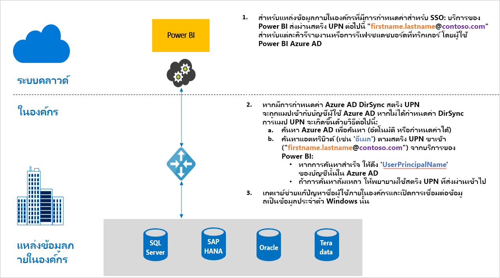

# ภาพรวมของการลงชื่อเข้าใช้ครั้งเดียว (SSO) สำหรับเกตเวย์ใน Power BIOverview of single sign-on (SSO) for gateways in Power BI

คุณสามารถเชื่อมต่อด้วยการลงชื่อเข้าใช้ครั้งเดียว ซึ่งเปิดใช้งานรายงานและแดชบอร์ดของ Power BI เพื่อปรับปรุงจากข้อมูลในองค์กรแบบเรียลไทม์ โดยการกำหนดค่าในเกตเวย์ข้อมูลในองค์กรของคุณYou can get seamless single sign-on connectivity, enabling Power BI reports and dashboards to update in real time from on-premises data, by configuring your on-premises data gateway. คุณมีตัวเลือกในการกำหนดค่าเกตเวย์ของคุณด้วยการมอบสิทธิ์แบบจำกัดของ [Kerberos](service-gateway-sso-kerberos.md) หรือ Security Assertion Markup Language ([SAML](service-gateway-sso-saml.md))You have the option of configuring your gateway with either [Kerberos](service-gateway-sso-kerberos.md) constrained delegation or Security Assertion Markup Language ([SAML](service-gateway-sso-saml.md)). เกตเวย์ข้อมูลภายในองค์กรสนับสนุน SSO โดยใช้ [DirectQuery](desktop-directquery-about.md) หรือสำหรับการรีเฟรช ซึ่งเชื่อมต่อกับแหล่งข้อมูลในองค์กรThe on-premises data gateway supports SSO by using [DirectQuery](desktop-directquery-about.md) or for Refresh, which connects to on-premises data sources. 

Power BI รองรับแหล่งข้อมูลต่อไปนี้:Power BI supports the following data sources:

* SQL Server (Kerberos)SQL Server (Kerberos)
* SAP HANA (Kerberos และ SAML)SAP HANA (Kerberos and SAML)
* SAP BW Application Server (Kerberos)SAP BW Application Server (Kerberos)
*  เซิร์ฟเวอร์ข้อความของ SAP BW (Kerberos)SAP BW Message Server (Kerberos) 
* Oracle (Kerberos)Oracle (Kerberos) 
* Teradata (Kerberos)Teradata (Kerberos)
* Spark (Kerberos)Spark (Kerberos)
* Impala (Kerberos)Impala (Kerberos)

ขณะนี้เราไม่สนับสนุน SSO สำหรับ[ไฟล์นามสกุล M](https://github.com/microsoft/DataConnectors/blob/master/docs/m-extensions.md)We don't currently support SSO for [M-extensions](https://github.com/microsoft/DataConnectors/blob/master/docs/m-extensions.md).

เมื่อผู้ใช้โต้ตอบกับรายงาน DirectQuery ในบริการของ Power BI การดำเนินการแก้ไขตัวกรองข้าม แบ่งส่วน เรียงลำดับ และรายงานแต่ละครั้งอาจส่งผลต่อคิวรีต่าง ๆ ที่ดำเนินการสดกับแหล่งข้อมูลพื้นฐานภายในองค์กรWhen a user interacts with a DirectQuery report in the Power BI Service, each cross-filter, slice, sort, and report editing operation can result in queries that execute live against the underlying on-premises data source. เมื่อคุณกำหนดค่า SSO สำหรับแหล่งข้อมูล คิวรีจะดำเนินการภายใต้ ข้อมูลประจำตัวของผู้ใช้ที่โต้ตอบกับ Power BI (นั่นคือเมื่อทำผ่านเว็บหรือแอปสำหรับอุปกรณ์เคลื่อนที่ของ Power BI)When you configure SSO for the data source, queries execute under the identity of the user that interacts with Power BI (that is, through the web experience or Power BI mobile apps). ดังนั้น ผู้ใช้แต่ละคนจะเห็นข้อมูลที่พวกเขามีสิทธิ์ในแหล่งข้อมูลพื้นฐานอย่างแม่นยำTherefore, each user sees precisely the data for which they have permissions in the underlying data source. 

คุณยังสามารถกำหนดค่ารายงานที่ตั้งค่าสำหรับการรีเฟรชในบริการ Power BI เพื่อใช้ SSO ได้You can also configure a report which is set up for refresh in the Power BI Service to use SSO. เมื่อคุณกำหนดค่า SSO สำหรับแหล่งข้อมูลนี้แล้ว คิวรีจะดำเนินการภายใต้ข้อมูลประจำตัวของเจ้าของชุดข้อมูลภายใน Power BIWhen you configure SSO for this data source, queries execute under the identity of the dataset owner within Power BI. ดังนั้น การรีเฟรชจะเกิดขึ้นตามสิทธิ์ของเจ้าของชุดข้อมูลในแหล่งข้อมูลพื้นฐานTherefore, the refresh happens based on the dataset owner's permissions on the underlying data source. ในขณะนี้การรีเฟรชโดยใช้ SSO เปิดใช้งานเฉพาะสำหรับแหล่งข้อมูลที่ใช้การมอบสิทธิ์แบบจำกัดของ [Kerberos](service-gateway-sso-kerberos.md)Refresh using SSO is currently enabled only for data sources using [Kerberos](service-gateway-sso-kerberos.md) constrained delegation 

## ขั้นตอนการคิวรีเมื่อเรียกใช้ SSOQuery steps when running SSO

คิวรีที่ทำงานโดยใช้ SSO ประกอบด้วยสามขั้นตอน ดังที่แสดงในไดอะแกรมต่อไปนี้A query that runs with SSO consists of three steps, as shown in the following diagram.

นี่เป็นรายละเอียดเพิ่มเติมเกี่ยวกับแต่ละขั้นตอน:Here are additional details about each step:

1. สำหรับการคิวรีแต่ละครั้ง บริการของ Power BI ประกอบด้วย*ชื่อผู้ใช้หลัก (UPN)* ซึ่งเป็นชื่อผู้ใช้แบบเต็มที่ผ่านการรับรองของผู้ใช้ที่ลงชื่อเข้าใช้บริการของ Power BI ในปัจจุบัน เมื่อส่งการร้องขอคิวรีไปยังเกตเวย์ที่กำหนดค่าไว้For each query, the Power BI service includes the *user principal name (UPN)*, which is the fully qualified username of the user currently signed in to the Power BI service, when it sends a query request to the configured gateway.

2. เกตเวย์ต้องแมปค่า UPN ของ Azure Active Directory ไปยังข้อมูลประจำตัวของ Active Directory ในเครื่อง:The gateway must map the Azure Active Directory UPN to a local Active Directory identity:

   a.a. ถ้า Azure AD DirSync (หรือที่เรียกว่า*Azure AD Connect*) มีการกำหนดค่าแล้ว การแมปจะทำงานโดยอัตโนมัติในเกตเวย์If Azure AD DirSync (also known as *Azure AD Connect*) is configured, then the mapping works automatically in the gateway.

   b.b.  มิฉะนั้น เกตเวย์สามารถค้นหาและแมป Azure AD UPN ไปยังผู้ใช้ AD ภายในเครื่อง โดยการค้นหากับโดเมน Active Directory ในเครื่องOtherwise, the gateway can look up and map the Azure AD UPN to a local AD user by performing a lookup against the local Active Directory domain.

3. กระบวนการบริการเกตเวย์จะเลียนแบบเป็นผู้ใช้ภายในเครื่องที่ถูกแมป เปิดการเชื่อมต่อกับฐานข้อมูลเบื้องต้น แล้วส่งคิวรีThe gateway service process impersonates the mapped local user, opens the connection to the underlying database, and then sends the query. คุณไม่จำเป็นต้องติดตั้งเกตเวย์บนคอมพิวเตอร์เครื่องเดียวกับฐานข้อมูลYou don't need to install the gateway on the same machine as the database.

## ขั้นตอนถัดไปNext steps

ตอนนี้คุณเข้าใจพื้นฐานของการเปิดใช้งาน SSO ผ่านเกตเวย์แล้ว โปรดอ่านข้อมูลโดยละเอียดเกี่ยวกับ Kerberos และ SAML:Now that you understand the basics of enabling SSO through the gateway, read more detailed information about Kerberos and SAML:

* [การลงชื่อเข้าใช้ครั้งเดียว (SSO) - KerberosSingle sign-on (SSO) - Kerberos](service-gateway-sso-kerberos.md)
* [การลงชื่อเข้าใช้ครั้งเดียว (SSO) - SAMLSingle sign-on (SSO) - SAML](service-gateway-sso-saml.md)
