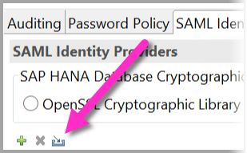
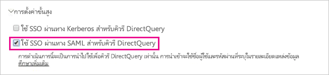

# <a name="use-security-assertion-markup-language-saml-for-sso-from-power-bi-to-on-premises-data-sources"></a><span data-ttu-id="34fc0-103">ใช้ Assertion Markup Language (SAML) สำหรับการลงชื่อเข้าระบบครั้งเดียว (SSO) จาก Power BI กับแหล่งข้อมูลภายในองค์กร</span><span class="sxs-lookup"><span data-stu-id="34fc0-103">Use Security Assertion Markup Language (SAML) for SSO from Power BI to on-premises data sources</span></span>

<span data-ttu-id="34fc0-104">การเปิดใช้งาน SSO ทำให้รายงาน Power BI และแดชบอร์ดสามารถรีเฟรชข้อมูลจากแหล่งข้อมูลภายในองค์กรได้อย่างง่ายดาย ในขณะที่ยังเป็นไปตามสิทธิ์ระดับผู้ใช้ที่กำหนดค่าไว้บนแหล่งข้อมูลเหล่านั้น</span><span class="sxs-lookup"><span data-stu-id="34fc0-104">Enabling SSO makes it easy for Power BI reports and dashboards to refresh data from on-premises sources while respecting user-level permissions configured on those sources.</span></span> <span data-ttu-id="34fc0-105">ใช้ [Security Assertion Markup Language (SAML)](https://www.onelogin.com/pages/saml) เพื่อเปิดใช้งานการเชื่อมต่อการลงชื่อเข้าใช้ครั้งเดียวแบบไร้ร้อยต่อ</span><span class="sxs-lookup"><span data-stu-id="34fc0-105">Use [Security Assertion Markup Language (SAML)](https://www.onelogin.com/pages/saml) to enable seamless single sign-on connectivity.</span></span> 

## <a name="supported-data-sources"></a><span data-ttu-id="34fc0-106">แหล่งข้อมูลที่ได้รับการสนับสนุน</span><span class="sxs-lookup"><span data-stu-id="34fc0-106">Supported data sources</span></span>

<span data-ttu-id="34fc0-107">ขณะนี้เราสนับสนุน SAP HANA ที่มี SAML</span><span class="sxs-lookup"><span data-stu-id="34fc0-107">We currently support SAP HANA with SAML.</span></span> <span data-ttu-id="34fc0-108">สำหรับข้อมูลเพิ่มเติมเกี่ยวกับการตั้งค่าและกำหนดค่าการลงชื่อเข้าใช้ครั้งเดียวสำหรับ SAP HANA โดยใช้ SAML ดู [SAML SSO for BI Platform to HANA](https://blogs.sap.com/2020/03/22/sap-bi-platform-saml-sso-to-hana-database/).</span><span class="sxs-lookup"><span data-stu-id="34fc0-108">For more information about setting up and configuring single sign-on for SAP HANA by using SAML, see [SAML SSO for BI Platform to HANA](https://blogs.sap.com/2020/03/22/sap-bi-platform-saml-sso-to-hana-database/).</span></span>

<span data-ttu-id="34fc0-109">เราสนับสนุนแหล่งข้อมูลเพิ่มเติมด้วย [Kerberos](service-gateway-sso-kerberos.md) (รวมถึง SAP HANA)</span><span class="sxs-lookup"><span data-stu-id="34fc0-109">We support additional data sources with [Kerberos](service-gateway-sso-kerberos.md) (including SAP HANA).</span></span>

<span data-ttu-id="34fc0-110">สำหรับ SAP HANA ขอแนะนำให้คุณเปิดใช้งานการเข้ารหัสก่อนที่คุณจะสร้างการเชื่อมต่อ SAML SSO</span><span class="sxs-lookup"><span data-stu-id="34fc0-110">For SAP HANA, it's recommended you enable encryption before you establish a SAML SSO connection.</span></span> <span data-ttu-id="34fc0-111">หากต้องการเปิดใช้งานการเข้ารหัส กำหนดค่าเซิร์ฟเวอร์ HANA ให้ยอมรับการเชื่อมต่อที่เข้ารหัสลับ และกำหนดค่าเกตเวย์เพื่อใช้การเข้ารหัสเพื่อสื่อสารกับเซิร์ฟเวอร์ HANA ของคุณ</span><span class="sxs-lookup"><span data-stu-id="34fc0-111">To enable encryption, configure the HANA server to accept encrypted connections and configure the gateway to use encryption to communicate with your HANA server.</span></span> <span data-ttu-id="34fc0-112">เนื่องจาก HANA ODBC ไม่เข้ารหัสการยืนยัน SAML โดยค่าเริ่มต้น การยืนยัน SAML ที่ลงชื่อแล้วจะถูกส่งจากเกตเวย์ไปยังเซิร์ฟเวอร์ HANA ในลักษณะที่ *ชัดเจน* และเสี่ยงต่อการถูกสกัดกั้นและใช้ซ้ำโดยบุคคลที่สาม</span><span class="sxs-lookup"><span data-stu-id="34fc0-112">Because the HANA ODBC driver doesn't encrypt SAML assertions by default, the signed SAML assertion is sent from the gateway to the HANA server *in the clear* and is vulnerable to interception and reuse by third parties.</span></span>

> [!IMPORTANT]
> <span data-ttu-id="34fc0-113">เนื่องจาก [SAP ไม่รองรับ OpenSSL อีกต่อไป](https://help.sap.com/viewer/b3ee5778bc2e4a089d3299b82ec762a7/2.0.05/en-US/de15ffb1bb5710148386ffdfd857482a.html) Microsoft จึงได้ยุติการสนับสนุนด้วยเช่นกัน</span><span class="sxs-lookup"><span data-stu-id="34fc0-113">As [SAP no longer supports the OpenSSL](https://help.sap.com/viewer/b3ee5778bc2e4a089d3299b82ec762a7/2.0.05/en-US/de15ffb1bb5710148386ffdfd857482a.html), Microsoft also has discontinued its support.</span></span> <span data-ttu-id="34fc0-114">การเชื่อมต่อที่มีอยู่จะยังคงใช้งานได้ แต่คุณจะไม่สามารถสร้างการเชื่อมต่อใหม่ได้ตั้งแต่เดือนกุมภาพันธ์ 2021</span><span class="sxs-lookup"><span data-stu-id="34fc0-114">Existing connections will continue to work, but you won't be able to create new connections starting February 2021.</span></span> <span data-ttu-id="34fc0-115">หากต้องการใช้งานในอนาคต โปรดใช้ CommonCryptoLib แทน</span><span class="sxs-lookup"><span data-stu-id="34fc0-115">Going forward, please use CommonCryptoLib instead.</span></span>

## <a name="configuring-the-gateway-and-data-source"></a><span data-ttu-id="34fc0-116">กำหนดค่าแหล่งข้อมูลและเกตเวย์</span><span class="sxs-lookup"><span data-stu-id="34fc0-116">Configuring the gateway and data source</span></span>

<span data-ttu-id="34fc0-117">หากต้องการใช้ SAML คุณต้องสร้างความสัมพันธ์ที่เชื่อถือได้ระหว่างเซิร์ฟเวอร์ HANA ที่คุณต้องการเปิดใช้งาน SSO และเกตเวย์</span><span class="sxs-lookup"><span data-stu-id="34fc0-117">To use SAML, you must establish a trust relationship between the HANA servers for which you want to enable SSO and the gateway.</span></span> <span data-ttu-id="34fc0-118">ซึ่งทำหน้าที่เป็น SAML Identity Provider (IdP) ในสถานการณ์สมมตินี้</span><span class="sxs-lookup"><span data-stu-id="34fc0-118">In this scenario, the gateway serves as the SAML Identity Provider (IdP).</span></span> <span data-ttu-id="34fc0-119">มีหลายวิธีในการสร้างความสัมพันธ์นี้</span><span class="sxs-lookup"><span data-stu-id="34fc0-119">There are various ways to establish this relationship.</span></span> <span data-ttu-id="34fc0-120">SAP ขอแนะนำให้คุณใช้ SAP Cryptographic Library (หรือที่เรียกว่า CommonCryptoLib หรือ sapcrypto) เพื่อทำตามขั้นตอนการตั้งค่าที่เราสามารถสร้างความสัมพันธ์ที่เชื่อถือได้</span><span class="sxs-lookup"><span data-stu-id="34fc0-120">SAP recommends you use the SAP Cryptographic Library (also known as CommonCryptoLib or sapcrypto) to complete the setup steps in which we establish the trust relationship.</span></span> <span data-ttu-id="34fc0-121">สำหรับข้อมูลเพิ่มเติม โปรดดูเอกสารประกอบ SAP อย่างเป็นทางการ</span><span class="sxs-lookup"><span data-stu-id="34fc0-121">For more information, see the official SAP documentation.</span></span>

<span data-ttu-id="34fc0-122">ขั้นตอนต่อไปนี้อธิบายวิธีการสร้างความสัมพันธ์ที่เชื่อถือได้ระหว่างเซิร์ฟเวอร์ HANA และ Gateway IdP โดยการลงนามใบรับรอง X509 ของ Gateway IdP ด้วย CA ระดับสูงที่เซิร์ฟเวอร์ HANA เชื่อถือ</span><span class="sxs-lookup"><span data-stu-id="34fc0-122">The following steps describe how to establish a trust relationship between a HANA server and the gateway IdP by signing the gateway IdP's X509 certificate with a Root CA trusted by the HANA server.</span></span> 

### <a name="create-the-certificates"></a><span data-ttu-id="34fc0-123">สร้างใบรับรอง</span><span class="sxs-lookup"><span data-stu-id="34fc0-123">Create the certificates</span></span>

<span data-ttu-id="34fc0-124">ทำตามขั้นตอนต่อไปนี้เพื่อสร้างใบรับรอง:</span><span class="sxs-lookup"><span data-stu-id="34fc0-124">Take the following steps to create the certificates:</span></span>

1. <span data-ttu-id="34fc0-125">บนอุปกรณ์ที่กำลังเรียกใช้ SAP Hana สร้างโฟลเดอร์เปล่าเพื่อจัดเก็บใบรับรองของคุณ จากนั้นนำทางไปยังโฟลเดอร์นั้น</span><span class="sxs-lookup"><span data-stu-id="34fc0-125">On the device that is running SAP HANA, create an empty folder to store your certificates, then navigate to that folder.</span></span>
2. <span data-ttu-id="34fc0-126">สร้างใบรับรองหลัก โดยการเรียกใช้คำสั่งต่อไปนี้:</span><span class="sxs-lookup"><span data-stu-id="34fc0-126">Create the root certificates by running the following command:</span></span>

   ```
   openssl req -new -x509 -newkey rsa:2048 -days 3650 -sha256 -keyout CA_Key.pem -out CA_Cert.pem -extensions v3_ca'''
   ```

    <span data-ttu-id="34fc0-127">คุณต้องจำวลีรหัสผ่านเพื่อใช้ใบรับรองนี้ในการลงชื่อในใบรับรองอื่น ๆ</span><span class="sxs-lookup"><span data-stu-id="34fc0-127">You must remember the passphrase to use this certificate to sign other certificates.</span></span>
    <span data-ttu-id="34fc0-128">คุณควรเห็น *CA_Cert.pem* และ *CA_Key.pem* ที่สร้างขึ้น</span><span class="sxs-lookup"><span data-stu-id="34fc0-128">You should see *CA_Cert.pem* and *CA_Key.pem* being created.</span></span>

   
3. <span data-ttu-id="34fc0-129">สร้างใบรับรอง IdP โดยการเรียกใช้คำสั่งต่อไปนี้:</span><span class="sxs-lookup"><span data-stu-id="34fc0-129">Create the IdP certificates by running the following command:</span></span>
 
    ```
    openssl req -newkey rsa:2048 -days 365 -sha256 -keyout IdP_Key.pem -out IdP_Req.pem -nodes
    ```
    <span data-ttu-id="34fc0-130">คุณควรเห็น *IdP_Key.pem* และ *IdP_Req.pem* ที่สร้างขึ้น</span><span class="sxs-lookup"><span data-stu-id="34fc0-130">You should see *IdP_Key.pem* and *IdP_Req.pem* being created.</span></span>

4. <span data-ttu-id="34fc0-131">ลงชื่อในใบรับรองของ IdP ด้วยใบรับรองหลัก:</span><span class="sxs-lookup"><span data-stu-id="34fc0-131">Sign the IdP Certificates with the root certificates:</span></span>

    ```
    openssl x509 -req -days 365 -in IdP_Req.pem -sha256 -extensions usr_cert -CA CA_Cert.pem -CAkey CA_Key.pem -CAcreateserial -out IdP_Cert.pem
    ```
    <span data-ttu-id="34fc0-132">คุณควรเห็น *CA_Cert.srl* และ *IdP_Cert.pem* ที่สร้างขึ้น</span><span class="sxs-lookup"><span data-stu-id="34fc0-132">You should see *CA_Cert.srl* and *IdP_Cert.pem* being created.</span></span>
    <span data-ttu-id="34fc0-133">เรากังวลเกี่ยวกับ *IdP_Cert.pem* เท่านั้น</span><span class="sxs-lookup"><span data-stu-id="34fc0-133">We are only concerned about the *IdP_Cert.pem*.</span></span>    

### <a name="create-saml-identity-provider-certificate-mapping"></a><span data-ttu-id="34fc0-134">สร้างการแมปใบรับรองของ idP ของ SAML</span><span class="sxs-lookup"><span data-stu-id="34fc0-134">Create SAML identity provider certificate mapping</span></span>

<span data-ttu-id="34fc0-135">สร้างการแมปใบรับรองของ idP ของ SAML ด้วยขั้นตอนต่อไปนี้</span><span class="sxs-lookup"><span data-stu-id="34fc0-135">Create the SAML Identity Provider certificate mapping with the following steps.</span></span>

1. <span data-ttu-id="34fc0-136">ใน **SAP Hana Studio** คลิกขวาที่ชื่อเซิร์ฟเวอร์ SAP Hana ของคุณ จากนั้น นำทางไปยัง **ความปลอดภัย > เปิดคอนโซลการรักษาความปลอดภัย > SAML Identity Provider**</span><span class="sxs-lookup"><span data-stu-id="34fc0-136">In **SAP HANA Studio**, right-click your SAP HANA server name then navigate to **Security > Open Security Console > SAML Identity Provider**.</span></span>
2. <span data-ttu-id="34fc0-137">ถ้าไม่ได้เลือกไลบรารี SAP Cryptographic ให้เลือก</span><span class="sxs-lookup"><span data-stu-id="34fc0-137">If the SAP Cryptographic Library is not selected, select it.</span></span> <span data-ttu-id="34fc0-138">*อย่า* ใช้ไลบรารี OpenSSL Cryptographic (ตัวเลือกทางซ้ายในรูปภาพต่อไปนี้) เนื่องจากเป็นตัวเลือกที่ SAP ไม่สนับสนุน</span><span class="sxs-lookup"><span data-stu-id="34fc0-138">Do *not* use the OpenSSL Cryptographic Library (the selection on the left, in the following image), it is deprecated by SAP.</span></span>

    

3. <span data-ttu-id="34fc0-140">นำเข้าใบรับรองที่ลงชื่อ *IdP_Cert.pem* โดยการคลิกปุ่มนำเข้าสีน้ำเงินที่แสดงในรูปต่อไปนี้</span><span class="sxs-lookup"><span data-stu-id="34fc0-140">Import the signed certificate *IdP_Cert.pem* by clicking the blue import button, shown in the following image.</span></span>

    

<span data-ttu-id="34fc0-142">อย่าลืมกำหนดชื่อให้กับ *idP* ของคุณ</span><span class="sxs-lookup"><span data-stu-id="34fc0-142">Remember to assign a name to your *Identity Provider Name*.</span></span>

### <a name="import-and-create-the-signed-certificates-in-hana"></a><span data-ttu-id="34fc0-143">นำเข้าและสร้างใบรับรองทีมีการลงชื่อใน HANA</span><span class="sxs-lookup"><span data-stu-id="34fc0-143">Import and create the signed certificates in HANA</span></span>

<span data-ttu-id="34fc0-144">จากนั้น คุณจะสามารถนำเข้าและสร้างใบรับรองทีมีการลงชื่อใน HANA ได้</span><span class="sxs-lookup"><span data-stu-id="34fc0-144">Next, you'll import and create the signed certificates in HANA.</span></span> <span data-ttu-id="34fc0-145">ทำตามขั้นตอนเหล่านี้:</span><span class="sxs-lookup"><span data-stu-id="34fc0-145">Follow these steps:</span></span>

1. <span data-ttu-id="34fc0-146">ใน **HANA Studio** เรียกใช้คิวรีต่อไปนี้:</span><span class="sxs-lookup"><span data-stu-id="34fc0-146">In **HANA Studio**, run the following query:</span></span>

    ```
    CREATE CERTIFICATE FROM '<idp_cert_pem_certificate_content>'
    ```
    
    <span data-ttu-id="34fc0-147">ตัวอย่างมีดังนี้:</span><span class="sxs-lookup"><span data-stu-id="34fc0-147">Here's an example:</span></span>

    ```
    CREATE CERTIFICATE FROM
    '-----BEGIN CERTIFICATE-----
    MIIDyDCCArCgA...veryLongString...0WkC5deeawTyMje6
    -----END CERTIFICATE-----
    '
    ```

2. <span data-ttu-id="34fc0-148">ถ้าไม่มีวัตถุประสงค์ PSEwith SAML ให้สร้างหนึ่งรายการโดยการเรียกใช้คิวรีต่อไปนี้ใน **HANA Studio**:</span><span class="sxs-lookup"><span data-stu-id="34fc0-148">If there is no PSEwith SAML Purpose, create one by running the following query in **HANA Studio**:</span></span>
    
    ```
    CREATE PSE SAMLCOLLECTION;<br>set pse SAMLCOLLECTION purpose SAML;<br>
    ```

3. <span data-ttu-id="34fc0-149">เพิ่มใบรับรองที่มีการลงชื่อที่สร้างขึ้นใหม่ไปยัง PSE ด้วยคำสั่งต่อไปนี้:</span><span class="sxs-lookup"><span data-stu-id="34fc0-149">Add the newly created signed certificate to the PSE with the following command:</span></span>

    ```
    alter pse SAMLCOLLECTION add CERTIFICATE <certificate_id>;
    ```

    <span data-ttu-id="34fc0-150">ตัวอย่างเช่น:</span><span class="sxs-lookup"><span data-stu-id="34fc0-150">For example:</span></span>
    ```
    alter pse SAMLCOLLECTION add CERTIFICATE 1978320;
    ```

    <span data-ttu-id="34fc0-151">คุณสามารถตรวจสอบรายการที่สร้างและผ่านการรับรองแล้ว โดยใช้คิวรีต่อไปนี้:</span><span class="sxs-lookup"><span data-stu-id="34fc0-151">You can check the list of certificated created with the following query:</span></span>
    ```
    select * from PUBLIC"."CERTIFICATES"
    ```

    <span data-ttu-id="34fc0-152">ขณะนี้ ใบรับรองได้รับการติดตั้งอย่างถูกต้องแล้ว</span><span class="sxs-lookup"><span data-stu-id="34fc0-152">The certificate is now properly installed.</span></span> <span data-ttu-id="34fc0-153">คุณสามารถเรียกใช้คิวรีต่อไปนี้เพื่อยืนยัน:</span><span class="sxs-lookup"><span data-stu-id="34fc0-153">You can run the following query to confirm:</span></span>
    ```
    select * from "PUBLIC"."PSE_CERTIFICATES"
    ```

### <a name="map-the-user"></a><span data-ttu-id="34fc0-154">แมปผู้ใช้</span><span class="sxs-lookup"><span data-stu-id="34fc0-154">Map the user</span></span>

<span data-ttu-id="34fc0-155">ทำตามขั้นตอนเหล่านี้เพื่อแมปผู้ใช้:</span><span class="sxs-lookup"><span data-stu-id="34fc0-155">Follow these steps to map the user:</span></span>

1. <span data-ttu-id="34fc0-156">ใน **SAP Hana Studio** เลือกโฟลเดอร์ **ความปลอดภัย**:</span><span class="sxs-lookup"><span data-stu-id="34fc0-156">In **SAP HANA Studio**, select the **Security** folder:</span></span>

    

2. <span data-ttu-id="34fc0-158">ขยาย **ผู้ใช้** แล้วเลือกผู้ใช้ที่คุณต้องการแมปไปยังผู้ใช้ Power BI</span><span class="sxs-lookup"><span data-stu-id="34fc0-158">Expand **Users**, and then select the user to whom you want to map your Power BI user.</span></span>

3. <span data-ttu-id="34fc0-159">เลือกกล่องกาเครื่องหมาย **SAML** จากนั้นเลือก **กำหนดค่า** ทีมีการไฮไลต์ไว้ในรูปต่อไปนี้</span><span class="sxs-lookup"><span data-stu-id="34fc0-159">Select the **SAML** checkbox, and then select **Configure**, shown highlighted in the following image.</span></span>

    

4. <span data-ttu-id="34fc0-161">เลือก idP ที่คุณสร้างขึ้นในส่วน [สร้างการแมปใบรับรอง idP ของ SAML](#create-saml-identity-provider-certificate-mapping) ที่มีอยู่ก่อนหน้าบทความนี้</span><span class="sxs-lookup"><span data-stu-id="34fc0-161">Select the identity provider you created in the [create SAML identity provider certificate mapping](#create-saml-identity-provider-certificate-mapping) section, earlier in this article.</span></span> <span data-ttu-id="34fc0-162">สำหรับข้อมูลประจำตัวภายนอก ให้ใส่ UPN ของผู้ใช้ Power BI (โดยทั่วไปคือ อีเมลแอดเดรสที่ผู้ใช้ใช้ในการลงชื่อเข้าใช้ Power BI) จากนั้นเลือก **เพิ่ม**</span><span class="sxs-lookup"><span data-stu-id="34fc0-162">For External Identity, enter the Power BI user's UPN (typically the email address the user uses to sign in to Power BI), and then select **Add**.</span></span>  <span data-ttu-id="34fc0-163">รูปภาพต่อไปนี้แสดงตัวเลือกและรายการที่ถูกเลือก</span><span class="sxs-lookup"><span data-stu-id="34fc0-163">The following image shows the options and selections.</span></span>

    

    <span data-ttu-id="34fc0-165">ถ้าคุณได้กำหนดค่าเกตเวย์ของคุณให้ใช้ตัวเลือกการกำหนดค่า *ADUserNameReplacementProperty* ป้อนค่าที่จะแทนที่ UPN เดิมของผู้ใช้ Power BI</span><span class="sxs-lookup"><span data-stu-id="34fc0-165">If you've configured your gateway to use the *ADUserNameReplacementProperty* configuration option, enter the value that will replace the Power BI user's original UPN.</span></span> <span data-ttu-id="34fc0-166">ตัวอย่างเช่น ถ้าคุณตั้งค่า *ADUserNameReplacementProperty* เป็น *SAMAccountName* ให้ป้อน *SAMAccountName* ของผู้ใช้</span><span class="sxs-lookup"><span data-stu-id="34fc0-166">For example, if you set *ADUserNameReplacementProperty* to *SAMAccountName* enter the user's *SAMAccountName*.</span></span>

### <a name="configure-the-gateway"></a><span data-ttu-id="34fc0-167">กำหนดค่าเกตเวย์</span><span class="sxs-lookup"><span data-stu-id="34fc0-167">Configure the gateway</span></span>

<span data-ttu-id="34fc0-168">เมื่อคุณมีใบรับรองและข้อมูลประจำตัวของเกตเวย์ที่กำหนดค่าแล้ว ให้แปลงใบรับรองเป็นรูปแบบ pfx และกำหนดค่าเกตเวย์เพื่อใช้ใบรับรองตามขั้นตอนต่อไปนี้</span><span class="sxs-lookup"><span data-stu-id="34fc0-168">Now that you have the gateway's certificate and identity configured, convert the certificate to a pfx format and configure the gateway to use the certificate with the following steps.</span></span>

1. <span data-ttu-id="34fc0-169">แปลงใบรับรองเป็นรูปแบบ pfx โดยเรียกใช้คำสั่งต่อไปนี้</span><span class="sxs-lookup"><span data-stu-id="34fc0-169">Convert the certificate to pfx format by running the following command.</span></span> <span data-ttu-id="34fc0-170">คำสั่งนี้ตั้งชื่อไฟล์ผลลัพธ์ .pfx file samlcert.pfx และกำหนดให้ *root* เป็นรหัสผ่าน</span><span class="sxs-lookup"><span data-stu-id="34fc0-170">This command names the resulting .pfx file samlcert.pfx and sets *root* as its password:</span></span>

    ```
    openssl pkcs12 -export -out samltest.pfx -in IdP_Cert.pem -inkey IdP_Key.pem -passin pass:root -passout pass:root
    ```

2. <span data-ttu-id="34fc0-171">คัดลอกไฟล์ pfx ไปยังเครื่องเกตเวย์:</span><span class="sxs-lookup"><span data-stu-id="34fc0-171">Copy the pfx file to the gateway machine:</span></span>

    1. <span data-ttu-id="34fc0-172">ดับเบิลคลิกที่ *samltest.pfx* แล้วเลือก **Local Machine** > **ถัดไป**</span><span class="sxs-lookup"><span data-stu-id="34fc0-172">Double-click *samltest.pfx*, then select **Local Machine** > **Next**.</span></span>

    2. <span data-ttu-id="34fc0-173">ป้อนรหัสผ่าน จาก นั้นเลือก **ถัดไป**</span><span class="sxs-lookup"><span data-stu-id="34fc0-173">Enter the password, then select **Next**.</span></span>

    3. <span data-ttu-id="34fc0-174">เลือก **วางใบรับรองทั้งหมดในที่เก็บต่อไปนี้** จากนั้นเลือก **เรียกดู** > **ส่วนบุคคล** > **ตกลง**</span><span class="sxs-lookup"><span data-stu-id="34fc0-174">Select **Place all certificates in the following store,** then select **Browse** > **Personal** > **OK**.</span></span>

    4. <span data-ttu-id="34fc0-175">เลือก **ถัดไป** แล้วเลือก **เสร็จสิ้น**</span><span class="sxs-lookup"><span data-stu-id="34fc0-175">Select **Next**, and then **Finish**.</span></span>

       

3. <span data-ttu-id="34fc0-177">ให้สิทธิ์การเข้าถึงบัญชีบริการเกตเวย์ให้กับคีย์ส่วนตัวของใบรับรอง โดยใช้ขั้นตอนต่อไปนี้:</span><span class="sxs-lookup"><span data-stu-id="34fc0-177">Grant the gateway service account access to the private key of the certificate, with the following steps:</span></span>

    1. <span data-ttu-id="34fc0-178">ในเครื่องเกตเวย์ ให้เรียกใช้งาน Microsoft Management Console (MMC)</span><span class="sxs-lookup"><span data-stu-id="34fc0-178">On the gateway machine, run the Microsoft Management Console (MMC).</span></span>

        

    2. <span data-ttu-id="34fc0-180">ภายใต้ **ไฟล์** เลือก **เพิ่ม/ลบสแน็ปอิน**</span><span class="sxs-lookup"><span data-stu-id="34fc0-180">Under **File**, select **Add/Remove Snap-in**.</span></span>

        

    3. <span data-ttu-id="34fc0-182">เลือก **ใบรับรอง** > **เพิ่ม** จากนั้นจึงเลือก **บัญชีตัวคำนวณ** > **ถัดไป**</span><span class="sxs-lookup"><span data-stu-id="34fc0-182">Select **Certificates** > **Add**, then select **Computer account** > **Next**.</span></span>

    4. <span data-ttu-id="34fc0-183">เลือก **คอมพิวเตอร์เฉพาะที่** > **เสร็จสิ้น** > **ตกลง**</span><span class="sxs-lookup"><span data-stu-id="34fc0-183">Select **Local Computer** > **Finish** > **OK**.</span></span>

    5. <span data-ttu-id="34fc0-184">ขยาย **ใบรับรอง** > **ส่วนบุคคล** > **ใบรับรอง** และค้นหาใบรับรอง</span><span class="sxs-lookup"><span data-stu-id="34fc0-184">Expand **Certificates** > **Personal** > **Certificates**, and find the certificate.</span></span>

    6. <span data-ttu-id="34fc0-185">คลิกขวาที่ใบรับรอง และไปยัง **งานทั้งหมด** &gt; **จัดการกุญแจส่วนตัว**</span><span class="sxs-lookup"><span data-stu-id="34fc0-185">Right-click the certificate and navigate to **All Tasks** &gt; **Manage Private Keys**.</span></span>

        

    1. <span data-ttu-id="34fc0-187">เพิ่มบัญชีบริการเกตเวย์ลงในรายการ</span><span class="sxs-lookup"><span data-stu-id="34fc0-187">Add the gateway service account to the list.</span></span> <span data-ttu-id="34fc0-188">ตามค่าเริ่มต้น บัญชีคือ **NT SERVICE\PBIEgwService**</span><span class="sxs-lookup"><span data-stu-id="34fc0-188">By default, the account is **NT SERVICE\PBIEgwService**.</span></span> <span data-ttu-id="34fc0-189">คุณสามารถดูว่าบัญชีใดที่ใช้งานบริการเกตเวย์โดยใช้ **services.msc** และค้นหา **บริการเกตเวย์ข้อมูลภายในองค์กร**</span><span class="sxs-lookup"><span data-stu-id="34fc0-189">You can find out which account is running the Gateway service by running **services.msc** and locating **On-premises data gateway service**.</span></span>

        

<span data-ttu-id="34fc0-191">ขั้นสุดท้าย ให้ทำตามขั้นตอนต่อไปนี้เพื่อเพิ่มรหัสประจำตัวใบรับรองลงในการกำหนดค่าเกตเวย์</span><span class="sxs-lookup"><span data-stu-id="34fc0-191">Finally, follow these steps to add the certificate thumbprint to the gateway configuration:</span></span>

1. <span data-ttu-id="34fc0-192">เรียกใช้คำสั่ง PowerShell ต่อไปนี้เพื่อแสดงรายการใบรับรองบนเครื่องของคุณ</span><span class="sxs-lookup"><span data-stu-id="34fc0-192">Run the following PowerShell command to list the certificates on your machine:</span></span>

    ```powershell
    Get-ChildItem -path cert:\LocalMachine\My
    ```

2. <span data-ttu-id="34fc0-193">คัดลอกรหัสประจำตัวสำหรับใบรับรองที่คุณสร้างขึ้น</span><span class="sxs-lookup"><span data-stu-id="34fc0-193">Copy the thumbprint for the certificate you created.</span></span>

3. <span data-ttu-id="34fc0-194">ไปที่ไดเรกทอรีของเกตเวย์ ซึ่งตามค่าเริ่มต้นจะเป็น *C:\Program Files\On-premises data gateway*</span><span class="sxs-lookup"><span data-stu-id="34fc0-194">Navigate to the gateway directory, which by default is *C:\Program Files\On-premises data gateway*.</span></span>

4. <span data-ttu-id="34fc0-195">เปิด *PowerBI.DataMovement.Pipeline.GatewayCore.dll.config* และค้นหาส่วน *SapHanaSAMLCertThumbprint*</span><span class="sxs-lookup"><span data-stu-id="34fc0-195">Open *PowerBI.DataMovement.Pipeline.GatewayCore.dll.config*, and find the *SapHanaSAMLCertThumbprint* section.</span></span> <span data-ttu-id="34fc0-196">วางรหัสประจำตัวที่คุณคัดลอกมา</span><span class="sxs-lookup"><span data-stu-id="34fc0-196">Paste the thumbprint you copied.</span></span>

5. <span data-ttu-id="34fc0-197">รีสตาร์ทบริการเกตเวย์</span><span class="sxs-lookup"><span data-stu-id="34fc0-197">Restart the gateway service.</span></span>

## <a name="running-a-power-bi-report"></a><span data-ttu-id="34fc0-198">การเรียกใช้รายงาน Power BI</span><span class="sxs-lookup"><span data-stu-id="34fc0-198">Running a Power BI report</span></span>

<span data-ttu-id="34fc0-199">ตอนนี้คุณสามารถใช้หน้า **จัดการเกตเวย์** ใน Power BI เพื่อกำหนดค่าแหล่งข้อมูล SAP HANA </span><span class="sxs-lookup"><span data-stu-id="34fc0-199">Now you can use the **Manage Gateway** page in Power BI to configure the SAP HANA data source.</span></span> <span data-ttu-id="34fc0-200">ภายใต้ **การตั้งค่าขั้นสูง** ให้เปิดใช้งาน SSO ผ่านทาง SAML</span><span class="sxs-lookup"><span data-stu-id="34fc0-200">Under **Advanced Settings**, enable SSO via SAML.</span></span> <span data-ttu-id="34fc0-201">การทำเช่นนั้นจะช่วยให้คุณสามารถเผยแพร่รายงานและชุดข้อมูลที่เชื่อมโยงกับแหล่งข้อมูลดังกล่าวได้</span><span class="sxs-lookup"><span data-stu-id="34fc0-201">Doing so allows you to publish reports and datasets binding to that data source.</span></span>

   

## <a name="troubleshooting"></a><span data-ttu-id="34fc0-203">การแก้ไขปัญหา</span><span class="sxs-lookup"><span data-stu-id="34fc0-203">Troubleshooting</span></span>

<span data-ttu-id="34fc0-204">หลังจากกำหนดค่า SSO โดยยึดตาม SAML คุณอาจเห็นข้อผิดพลาดต่อไปนี้ในพอร์ทัล Power BI: *ไม่สามารถใช้ข้อมูลประจำตัวที่แสดงไว้สำหรับแหล่งข้อมูล SapHana*</span><span class="sxs-lookup"><span data-stu-id="34fc0-204">After you configure SAML-based SSO, you might see the following error in the Power BI portal: *The credentials provided cannot be used for the SapHana source.*</span></span> <span data-ttu-id="34fc0-205">ข้อผิดพลาดนี้ระบุว่าข้อมูลประจำตัว SAML ถูกปฏิเสธ โดย SAP HANA</span><span class="sxs-lookup"><span data-stu-id="34fc0-205">This error indicates that the SAML credential was rejected by SAP HANA.</span></span>

<span data-ttu-id="34fc0-206">การติดตามการรับรองความถูกต้องฝั่งเซิร์ฟเวอร์มีข้อมูลโดยละเอียดสำหรับการแก้ไขปัญหาข้อมูลประจำตัวบน SAP HANA</span><span class="sxs-lookup"><span data-stu-id="34fc0-206">Server-side authentication traces provide detailed information for troubleshooting credential issues on SAP HANA.</span></span> <span data-ttu-id="34fc0-207">ทำตามขั้นตอนเหล่านี้เพื่อกำหนดค่าการติดตามสำหรับเซิร์ฟเวอร์ SAP HANA ของคุณ</span><span class="sxs-lookup"><span data-stu-id="34fc0-207">Follow these steps to configure tracing for your SAP HANA server:</span></span>

1. <span data-ttu-id="34fc0-208">บนเซิร์ฟเวอร์ SAP HANA เปิดใช้งานการติดตามการรับรองความถูกต้องโดยการเรียกใช้คิวรีต่อไปนี้:</span><span class="sxs-lookup"><span data-stu-id="34fc0-208">On the SAP HANA server, turn on the authentication trace by running the following query:</span></span>

    ```
    ALTER SYSTEM ALTER CONFIGURATION ('indexserver.ini', 'SYSTEM') set ('trace', 'authentication') = 'debug' with reconfigure 
    ```

1. <span data-ttu-id="34fc0-209">สร้างปัญหาขึ้นมาใหม่</span><span class="sxs-lookup"><span data-stu-id="34fc0-209">Reproduce the issue.</span></span>

1. <span data-ttu-id="34fc0-210">ใน HANA Studio เปิดคอนโซลดูแลระบบและเลือกแท็บ **ไฟล์การวินิจฉัย**</span><span class="sxs-lookup"><span data-stu-id="34fc0-210">In HANA Studio, open the administration console, and select the **Diagnosis Files** tab.</span></span>

1. <span data-ttu-id="34fc0-211">เปิดการติดตามเซิร์ฟเวอร์ดัชนีล่าสุดและค้นหา *SAMLAuthenticator.cpp*</span><span class="sxs-lookup"><span data-stu-id="34fc0-211">Open the latest index server trace and search for *SAMLAuthenticator.cpp*.</span></span>

    <span data-ttu-id="34fc0-212">คุณควรค้นหาข้อความแสดงข้อผิดพลาดโดยละเอียดที่ระบุสาเหตุหลัก ตัวอย่างเช่น:</span><span class="sxs-lookup"><span data-stu-id="34fc0-212">You should find a detailed error message that indicates the root cause, for example:</span></span>

    ```
    [3957]{-1}[-1/-1] 2018-09-11 21:40:23.815797 d Authentication   SAMLAuthenticator.cpp(00091) : Element '{urn:oasis:names:tc:SAML:2.0:assertion}Assertion', attribute 'ID': '123123123123123' is not a valid value of the atomic type 'xs:ID'.
    [3957]{-1}[-1/-1] 2018-09-11 21:40:23.815914 i Authentication   SAMLAuthenticator.cpp(00403) : No valid SAML Assertion or SAML Protocol detected
    ```

1. <span data-ttu-id="34fc0-213">หลังจากการแก้ไขปัญหาเสร็จสมบูรณ์ ปิดใช้งานการติดตามการรับรองความถูกต้องโดยการเรียกใช้คิวรีต่อไปนี้:</span><span class="sxs-lookup"><span data-stu-id="34fc0-213">After the troubleshooting is complete, turn off the authentication trace by running the following query:</span></span>

    ```
    ALTER SYSTEM ALTER CONFIGURATION ('indexserver.ini', 'SYSTEM') UNSET ('trace', 'authentication');
    ```

## <a name="next-steps"></a><span data-ttu-id="34fc0-214">ขั้นตอนถัดไป</span><span class="sxs-lookup"><span data-stu-id="34fc0-214">Next steps</span></span>

<span data-ttu-id="34fc0-215">สำหรับข้อมูลเพิ่มเติมเกี่ยวกับเกตเวย์ข้อมูลภายในองค์กรและ DirectQuery ให้ดูแหล่งข้อมูลต่อไปนี้:</span><span class="sxs-lookup"><span data-stu-id="34fc0-215">For more information about the on-premises data gateway and DirectQuery, see the following resources:</span></span>

* [<span data-ttu-id="34fc0-216">เกตเวย์ข้อมูลภายในองค์กรคืออะไร</span><span class="sxs-lookup"><span data-stu-id="34fc0-216">What is an on-premises data gateway?</span></span>](/data-integration/gateway/service-gateway-onprem)
* [<span data-ttu-id="34fc0-217">DirectQuery ใน Power BI</span><span class="sxs-lookup"><span data-stu-id="34fc0-217">DirectQuery in Power BI</span></span>](desktop-directquery-about.md)
* [<span data-ttu-id="34fc0-218">แหล่งข้อมูลที่สนับสนุนโดย DirectQuery</span><span class="sxs-lookup"><span data-stu-id="34fc0-218">Data sources supported by DirectQuery</span></span>](power-bi-data-sources.md)
* [<span data-ttu-id="34fc0-219">DirectQuery และ SAP BW</span><span class="sxs-lookup"><span data-stu-id="34fc0-219">DirectQuery and SAP BW</span></span>](desktop-directquery-sap-bw.md)
* [<span data-ttu-id="34fc0-220">DirectQuery และ SAP HANA</span><span class="sxs-lookup"><span data-stu-id="34fc0-220">DirectQuery and SAP HANA</span></span>](desktop-directquery-sap-hana.md)
