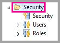
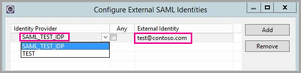

# <a name="use-security-assertion-markup-language-saml-for-sso-from-power-bi-to-on-premises-data-sources"></a>ใช้ Assertion Markup Language (SAML) สำหรับการลงชื่อเข้าระบบครั้งเดียว (SSO) จาก Power BI กับแหล่งข้อมูลภายในองค์กร

การเปิดใช้งาน SSO ทำให้รายงาน Power BI และแดชบอร์ดสามารถรีเฟรชข้อมูลจากแหล่งข้อมูลภายในองค์กรได้อย่างง่ายดาย ในขณะที่ยังเป็นไปตามสิทธิ์ระดับผู้ใช้ที่กำหนดค่าไว้บนแหล่งข้อมูลเหล่านั้น ใช้ [Security Assertion Markup Language (SAML)](https://www.onelogin.com/pages/saml) เพื่อเปิดใช้งานการเชื่อมต่อการลงชื่อเข้าใช้ครั้งเดียวแบบไร้ร้อยต่อ 

## <a name="supported-data-sources"></a>แหล่งข้อมูลที่ได้รับการสนับสนุน

ขณะนี้เราสนับสนุน SAP HANA ที่มี SAML สำหรับข้อมูลเพิ่มเติมเกี่ยวกับการตั้งค่าและกำหนดค่าการลงชื่อเข้าใช้ครั้งเดียวสำหรับ SAP HANA โดยใช้ SAML ดู [SAML SSO for BI Platform to HANA](https://blogs.sap.com/2020/03/22/sap-bi-platform-saml-sso-to-hana-database/).

เราสนับสนุนแหล่งข้อมูลเพิ่มเติมด้วย [Kerberos](service-gateway-sso-kerberos.md) (รวมถึง SAP HANA)

สำหรับ SAP HANA ขอแนะนำให้คุณเปิดใช้งานการเข้ารหัสก่อนที่คุณจะสร้างการเชื่อมต่อ SAML SSO หากต้องการเปิดใช้งานการเข้ารหัส กำหนดค่าเซิร์ฟเวอร์ HANA ให้ยอมรับการเชื่อมต่อที่เข้ารหัสลับ และกำหนดค่าเกตเวย์เพื่อใช้การเข้ารหัสเพื่อสื่อสารกับเซิร์ฟเวอร์ HANA ของคุณ เนื่องจาก HANA ODBC ไม่เข้ารหัสการยืนยัน SAML โดยค่าเริ่มต้น การยืนยัน SAML ที่ลงชื่อแล้วจะถูกส่งจากเกตเวย์ไปยังเซิร์ฟเวอร์ HANA ในลักษณะที่ *ชัดเจน* และเสี่ยงต่อการถูกสกัดกั้นและใช้ซ้ำโดยบุคคลที่สาม

> [!IMPORTANT]
> เนื่องจาก [SAP ไม่รองรับ OpenSSL อีกต่อไป](https://help.sap.com/viewer/b3ee5778bc2e4a089d3299b82ec762a7/2.0.05/en-US/de15ffb1bb5710148386ffdfd857482a.html) Microsoft จึงได้ยุติการสนับสนุนด้วยเช่นกัน การเชื่อมต่อที่มีอยู่จะยังคงใช้งานได้ แต่คุณจะไม่สามารถสร้างการเชื่อมต่อใหม่ได้ตั้งแต่เดือนกุมภาพันธ์ 2021 หากต้องการใช้งานในอนาคต โปรดใช้ CommonCryptoLib แทน

## <a name="configuring-the-gateway-and-data-source"></a>กำหนดค่าแหล่งข้อมูลและเกตเวย์

หากต้องการใช้ SAML คุณต้องสร้างความสัมพันธ์ที่เชื่อถือได้ระหว่างเซิร์ฟเวอร์ HANA ที่คุณต้องการเปิดใช้งาน SSO และเกตเวย์ ซึ่งทำหน้าที่เป็น SAML Identity Provider (IdP) ในสถานการณ์สมมตินี้ มีหลายวิธีในการสร้างความสัมพันธ์นี้ SAP ขอแนะนำให้คุณใช้ SAP Cryptographic Library (หรือที่เรียกว่า CommonCryptoLib หรือ sapcrypto) เพื่อทำตามขั้นตอนการตั้งค่าที่เราสามารถสร้างความสัมพันธ์ที่เชื่อถือได้ สำหรับข้อมูลเพิ่มเติม โปรดดูเอกสารประกอบ SAP อย่างเป็นทางการ

ขั้นตอนต่อไปนี้อธิบายวิธีการสร้างความสัมพันธ์ที่เชื่อถือได้ระหว่างเซิร์ฟเวอร์ HANA และ Gateway IdP โดยการลงนามใบรับรอง X509 ของ Gateway IdP ด้วย CA ระดับสูงที่เซิร์ฟเวอร์ HANA เชื่อถือ 

### <a name="create-the-certificates"></a>สร้างใบรับรอง

ทำตามขั้นตอนต่อไปนี้เพื่อสร้างใบรับรอง:

1. บนอุปกรณ์ที่กำลังเรียกใช้ SAP Hana สร้างโฟลเดอร์เปล่าเพื่อจัดเก็บใบรับรองของคุณ จากนั้นนำทางไปยังโฟลเดอร์นั้น
2. สร้างใบรับรองหลัก โดยการเรียกใช้คำสั่งต่อไปนี้:

   ```
   openssl req -new -x509 -newkey rsa:2048 -days 3650 -sha256 -keyout CA_Key.pem -out CA_Cert.pem -extensions v3_ca'''
   ```

    คุณต้องจำวลีรหัสผ่านเพื่อใช้ใบรับรองนี้ในการลงชื่อในใบรับรองอื่น ๆ
    คุณควรเห็น *CA_Cert.pem* และ *CA_Key.pem* ที่สร้างขึ้น

   
3. สร้างใบรับรอง IdP โดยการเรียกใช้คำสั่งต่อไปนี้:
 
    ```
    openssl req -newkey rsa:2048 -days 365 -sha256 -keyout IdP_Key.pem -out IdP_Req.pem -nodes
    ```
    คุณควรเห็น *IdP_Key.pem* และ *IdP_Req.pem* ที่สร้างขึ้น

4. ลงชื่อในใบรับรองของ IdP ด้วยใบรับรองหลัก:

    ```
    openssl x509 -req -days 365 -in IdP_Req.pem -sha256 -extensions usr_cert -CA CA_Cert.pem -CAkey CA_Key.pem -CAcreateserial -out IdP_Cert.pem
    ```
    คุณควรเห็น *CA_Cert.srl* และ *IdP_Cert.pem* ที่สร้างขึ้น
    เรากังวลเกี่ยวกับ *IdP_Cert.pem* เท่านั้น    

### <a name="create-saml-identity-provider-certificate-mapping"></a>สร้างการแมปใบรับรองของ idP ของ SAML

สร้างการแมปใบรับรองของ idP ของ SAML ด้วยขั้นตอนต่อไปนี้

1. ใน **SAP Hana Studio** คลิกขวาที่ชื่อเซิร์ฟเวอร์ SAP Hana ของคุณ จากนั้น นำทางไปยัง **ความปลอดภัย > เปิดคอนโซลการรักษาความปลอดภัย > SAML Identity Provider**
2. ถ้าไม่ได้เลือกไลบรารี SAP Cryptographic ให้เลือก *อย่า* ใช้ไลบรารี OpenSSL Cryptographic (ตัวเลือกทางซ้ายในรูปภาพต่อไปนี้) เนื่องจากเป็นตัวเลือกที่ SAP ไม่สนับสนุน

    

3. นำเข้าใบรับรองที่ลงชื่อ *IdP_Cert.pem* โดยการคลิกปุ่มนำเข้าสีน้ำเงินที่แสดงในรูปต่อไปนี้

    

อย่าลืมกำหนดชื่อให้กับ *idP* ของคุณ

### <a name="import-and-create-the-signed-certificates-in-hana"></a>นำเข้าและสร้างใบรับรองทีมีการลงชื่อใน HANA

จากนั้น คุณจะสามารถนำเข้าและสร้างใบรับรองทีมีการลงชื่อใน HANA ได้ ทำตามขั้นตอนเหล่านี้:

1. ใน **HANA Studio** เรียกใช้คิวรีต่อไปนี้:

    ```
    CREATE CERTIFICATE FROM '<idp_cert_pem_certificate_content>'
    ```
    
    ตัวอย่างมีดังนี้:

    ```
    CREATE CERTIFICATE FROM
    '-----BEGIN CERTIFICATE-----
    MIIDyDCCArCgA...veryLongString...0WkC5deeawTyMje6
    -----END CERTIFICATE-----
    '
    ```

2. ถ้าไม่มีวัตถุประสงค์ PSEwith SAML ให้สร้างหนึ่งรายการโดยการเรียกใช้คิวรีต่อไปนี้ใน **HANA Studio**:
    
    ```
    CREATE PSE SAMLCOLLECTION;<br>set pse SAMLCOLLECTION purpose SAML;<br>
    ```

3. เพิ่มใบรับรองที่มีการลงชื่อที่สร้างขึ้นใหม่ไปยัง PSE ด้วยคำสั่งต่อไปนี้:

    ```
    alter pse SAMLCOLLECTION add CERTIFICATE <certificate_id>;
    ```

    ตัวอย่างเช่น:
    ```
    alter pse SAMLCOLLECTION add CERTIFICATE 1978320;
    ```

    คุณสามารถตรวจสอบรายการที่สร้างและผ่านการรับรองแล้ว โดยใช้คิวรีต่อไปนี้:
    ```
    select * from PUBLIC"."CERTIFICATES"
    ```

    ขณะนี้ ใบรับรองได้รับการติดตั้งอย่างถูกต้องแล้ว คุณสามารถเรียกใช้คิวรีต่อไปนี้เพื่อยืนยัน:
    ```
    select * from "PUBLIC"."PSE_CERTIFICATES"
    ```

### <a name="map-the-user"></a>แมปผู้ใช้

ทำตามขั้นตอนเหล่านี้เพื่อแมปผู้ใช้:

1. ใน **SAP Hana Studio** เลือกโฟลเดอร์ **ความปลอดภัย**:

    

2. ขยาย **ผู้ใช้** แล้วเลือกผู้ใช้ที่คุณต้องการแมปไปยังผู้ใช้ Power BI

3. เลือกกล่องกาเครื่องหมาย **SAML** จากนั้นเลือก **กำหนดค่า** ทีมีการไฮไลต์ไว้ในรูปต่อไปนี้

    

4. เลือก idP ที่คุณสร้างขึ้นในส่วน [สร้างการแมปใบรับรอง idP ของ SAML](#create-saml-identity-provider-certificate-mapping) ที่มีอยู่ก่อนหน้าบทความนี้ สำหรับข้อมูลประจำตัวภายนอก ให้ใส่ UPN ของผู้ใช้ Power BI (โดยทั่วไปคือ อีเมลแอดเดรสที่ผู้ใช้ใช้ในการลงชื่อเข้าใช้ Power BI) จากนั้นเลือก **เพิ่ม**  รูปภาพต่อไปนี้แสดงตัวเลือกและรายการที่ถูกเลือก

    

    ถ้าคุณได้กำหนดค่าเกตเวย์ของคุณให้ใช้ตัวเลือกการกำหนดค่า *ADUserNameReplacementProperty* ป้อนค่าที่จะแทนที่ UPN เดิมของผู้ใช้ Power BI ตัวอย่างเช่น ถ้าคุณตั้งค่า *ADUserNameReplacementProperty* เป็น *SAMAccountName* ให้ป้อน *SAMAccountName* ของผู้ใช้

### <a name="configure-the-gateway"></a>กำหนดค่าเกตเวย์

เมื่อคุณมีใบรับรองและข้อมูลประจำตัวของเกตเวย์ที่กำหนดค่าแล้ว ให้แปลงใบรับรองเป็นรูปแบบ pfx และกำหนดค่าเกตเวย์เพื่อใช้ใบรับรองตามขั้นตอนต่อไปนี้

1. แปลงใบรับรองเป็นรูปแบบ pfx โดยเรียกใช้คำสั่งต่อไปนี้ คำสั่งนี้ตั้งชื่อไฟล์ผลลัพธ์ .pfx file samlcert.pfx และกำหนดให้ *root* เป็นรหัสผ่าน

    ```
    openssl pkcs12 -export -out samltest.pfx -in IdP_Cert.pem -inkey IdP_Key.pem -passin pass:root -passout pass:root
    ```

2. คัดลอกไฟล์ pfx ไปยังเครื่องเกตเวย์:

    1. ดับเบิลคลิกที่ *samltest.pfx* แล้วเลือก **Local Machine** > **ถัดไป**

    2. ป้อนรหัสผ่าน จาก นั้นเลือก **ถัดไป**

    3. เลือก **วางใบรับรองทั้งหมดในที่เก็บต่อไปนี้** จากนั้นเลือก **เรียกดู** > **ส่วนบุคคล** > **ตกลง**

    4. เลือก **ถัดไป** แล้วเลือก **เสร็จสิ้น**

       

3. ให้สิทธิ์การเข้าถึงบัญชีบริการเกตเวย์ให้กับคีย์ส่วนตัวของใบรับรอง โดยใช้ขั้นตอนต่อไปนี้:

    1. ในเครื่องเกตเวย์ ให้เรียกใช้งาน Microsoft Management Console (MMC)

        

    2. ภายใต้ **ไฟล์** เลือก **เพิ่ม/ลบสแน็ปอิน**

        

    3. เลือก **ใบรับรอง** > **เพิ่ม** จากนั้นจึงเลือก **บัญชีตัวคำนวณ** > **ถัดไป**

    4. เลือก **คอมพิวเตอร์เฉพาะที่** > **เสร็จสิ้น** > **ตกลง**

    5. ขยาย **ใบรับรอง** > **ส่วนบุคคล** > **ใบรับรอง** และค้นหาใบรับรอง

    6. คลิกขวาที่ใบรับรอง และไปยัง **งานทั้งหมด** &gt; **จัดการกุญแจส่วนตัว**

        

    1. เพิ่มบัญชีบริการเกตเวย์ลงในรายการ ตามค่าเริ่มต้น บัญชีคือ **NT SERVICE\PBIEgwService** คุณสามารถดูว่าบัญชีใดที่ใช้งานบริการเกตเวย์โดยใช้ **services.msc** และค้นหา **บริการเกตเวย์ข้อมูลภายในองค์กร**

        

ขั้นสุดท้าย ให้ทำตามขั้นตอนต่อไปนี้เพื่อเพิ่มรหัสประจำตัวใบรับรองลงในการกำหนดค่าเกตเวย์

1. เรียกใช้คำสั่ง PowerShell ต่อไปนี้เพื่อแสดงรายการใบรับรองบนเครื่องของคุณ

    ```powershell
    Get-ChildItem -path cert:\LocalMachine\My
    ```

2. คัดลอกรหัสประจำตัวสำหรับใบรับรองที่คุณสร้างขึ้น

3. ไปที่ไดเรกทอรีของเกตเวย์ ซึ่งตามค่าเริ่มต้นจะเป็น *C:\Program Files\On-premises data gateway*

4. เปิด *PowerBI.DataMovement.Pipeline.GatewayCore.dll.config* และค้นหาส่วน *SapHanaSAMLCertThumbprint* วางรหัสประจำตัวที่คุณคัดลอกมา

5. รีสตาร์ทบริการเกตเวย์

## <a name="running-a-power-bi-report"></a>การเรียกใช้รายงาน Power BI

ตอนนี้คุณสามารถใช้หน้า **จัดการเกตเวย์** ใน Power BI เพื่อกำหนดค่าแหล่งข้อมูล SAP HANA  ภายใต้ **การตั้งค่าขั้นสูง** ให้เปิดใช้งาน SSO ผ่านทาง SAML การทำเช่นนั้นจะช่วยให้คุณสามารถเผยแพร่รายงานและชุดข้อมูลที่เชื่อมโยงกับแหล่งข้อมูลดังกล่าวได้

   

## <a name="troubleshooting"></a>การแก้ไขปัญหา

หลังจากกำหนดค่า SSO โดยยึดตาม SAML คุณอาจเห็นข้อผิดพลาดต่อไปนี้ในพอร์ทัล Power BI: *ไม่สามารถใช้ข้อมูลประจำตัวที่แสดงไว้สำหรับแหล่งข้อมูล SapHana* ข้อผิดพลาดนี้ระบุว่าข้อมูลประจำตัว SAML ถูกปฏิเสธ โดย SAP HANA

การติดตามการรับรองความถูกต้องฝั่งเซิร์ฟเวอร์มีข้อมูลโดยละเอียดสำหรับการแก้ไขปัญหาข้อมูลประจำตัวบน SAP HANA ทำตามขั้นตอนเหล่านี้เพื่อกำหนดค่าการติดตามสำหรับเซิร์ฟเวอร์ SAP HANA ของคุณ

1. บนเซิร์ฟเวอร์ SAP HANA เปิดใช้งานการติดตามการรับรองความถูกต้องโดยการเรียกใช้คิวรีต่อไปนี้:

    ```
    ALTER SYSTEM ALTER CONFIGURATION ('indexserver.ini', 'SYSTEM') set ('trace', 'authentication') = 'debug' with reconfigure 
    ```

1. สร้างปัญหาขึ้นมาใหม่

1. ใน HANA Studio เปิดคอนโซลดูแลระบบและเลือกแท็บ **ไฟล์การวินิจฉัย**

1. เปิดการติดตามเซิร์ฟเวอร์ดัชนีล่าสุดและค้นหา *SAMLAuthenticator.cpp*

    คุณควรค้นหาข้อความแสดงข้อผิดพลาดโดยละเอียดที่ระบุสาเหตุหลัก ตัวอย่างเช่น:

    ```
    [3957]{-1}[-1/-1] 2018-09-11 21:40:23.815797 d Authentication   SAMLAuthenticator.cpp(00091) : Element '{urn:oasis:names:tc:SAML:2.0:assertion}Assertion', attribute 'ID': '123123123123123' is not a valid value of the atomic type 'xs:ID'.
    [3957]{-1}[-1/-1] 2018-09-11 21:40:23.815914 i Authentication   SAMLAuthenticator.cpp(00403) : No valid SAML Assertion or SAML Protocol detected
    ```

1. หลังจากการแก้ไขปัญหาเสร็จสมบูรณ์ ปิดใช้งานการติดตามการรับรองความถูกต้องโดยการเรียกใช้คิวรีต่อไปนี้:

    ```
    ALTER SYSTEM ALTER CONFIGURATION ('indexserver.ini', 'SYSTEM') UNSET ('trace', 'authentication');
    ```

## <a name="next-steps"></a>ขั้นตอนถัดไป

สำหรับข้อมูลเพิ่มเติมเกี่ยวกับเกตเวย์ข้อมูลภายในองค์กรและ DirectQuery ให้ดูแหล่งข้อมูลต่อไปนี้:

* [เกตเวย์ข้อมูลภายในองค์กรคืออะไร](/data-integration/gateway/service-gateway-onprem)
* [DirectQuery ใน Power BI](desktop-directquery-about.md)
* [แหล่งข้อมูลที่สนับสนุนโดย DirectQuery](power-bi-data-sources.md)
* [DirectQuery และ SAP BW](desktop-directquery-sap-bw.md)
* [DirectQuery และ SAP HANA](desktop-directquery-sap-hana.md)
