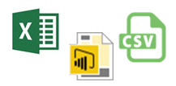

# รับข้อมูลจากไฟล์ Power BIGet data from files for Power BI

ใน Power BI คุณสามารถเชื่อมต่อ หรือนำเข้าข้อมูลและรายงาน จากไฟล์สามชนิดIn Power BI, you can connect to or import data and reports from three types of files.

* Microsoft Excel (.xlsx หรือ .xlsm)Microsoft Excel (.xlsx or .xlsm)
* Power BI Desktop (.pbix)Power BI Desktop (.pbix)
* แฟ้มที่ใช้จุลภาคเป็นตัวคั่น (.csv)Comma Separated Value (.csv)

## การรับข้อมูลจากไฟล์ จริง ๆ แล้วหมายความว่าอย่างไร?What does get data from a file really mean?
ใน Power BI ข้อมูลที่คุณสำรวจมาจากชุดข้อมูลIn Power BI the data you explore comes from a dataset. แต่ก่อนที่จะมีชุดข้อมูล คุณต้องได้รับข้อมูลบางอย่างBut in order to have a dataset, you first need to get some data. สำหรับบทความนี้ เรากำลังจะไปเน้นที่การรับข้อมูลจากไฟล์For this article, we're going to focus on getting data from files.

เพื่อทำความเข้าใจความสำคัญของชุดข้อมูล และวิธีที่เรารับข้อมูล เรามาดูรถยนต์เป็นตัวอย่างกันTo better understand the importance of datasets, and how we get data for them, let’s look at an automobile. ลองนั่งในรถยนต์ของคุณ และดูแดชบอร์ดTake a seat in your car and look at the dashboard. ซึ่งเหมือนกับการนั่งอยู่หน้าคอมพิวเตอร์ และดูแดชบอร์ดใน Power BIThat’s a lot like sitting in front of your computer looking at a dashboard in Power BI. แดชบอร์ดแสดงทุกอย่างที่รถยนต์ของคุณกำลังทำ เครื่องยนต์หมุนเร็วแค่ไหน อุณหภูมิ คุณใช้เกียร์อะไรอยู่ ความเร็วของคุณ ฯลฯThe dashboard shows you all the things your car is doing; how fast the engine is revving, temperature, what gear you’re in, your speed, etc.

ใน Power BI ชุดข้อมูลก็เหมือนกับเครื่องยนต์ในรถยนต์ของคุณIn Power BI, a dataset is like the engine in your car. ชุดข้อมูลมีข้อมูล เมตริก และข้อมูลที่จะแสดงในแดชบอร์ด Power BI ของคุณThe dataset provides the data, metrics, and information that’s displayed in your Power BI dashboard. แน่นอนว่าเครื่องยนต์ หรือชุดข้อมูลของคุณ ต้องการเชื่อเพลิง และใน Power BI เชื้อเพลิงนั้นคือข้อมูลOf course your engine, or dataset, needs fuel, and in Power BI, that fuel is data. รถยนต์ของคุณมีถังเติมน้ำมันให้กับเครื่องยนต์Your car has a fuel tank that provides gas to the engine. เหมือนกับใน Power BI คุณจำเป็นต้องมีถังนำ้มัน ที่คุณสามารถเติมข้อมูลให้กับชุดข้อมูลของคุณMuch the same in Power BI, you need a fuel tank that has data you can feed to your dataset. ในกรณีของเรา ถังน้ำมันนั้นเป็นไฟล์ Power BI Desktop, เวิร์กบุ๊ก Excel หรือไฟล์ .CSVIn our case, that fuel tank is a Power BI Desktop file, an Excel workbook file, or a .CSV file.

เราสามารถลงไปลึกขึ้นอีกขั้นWe can even take it one step further. ถังน้ำมันในรถต้องเติมด้วยน้ำมันA fuel tank in a car has to be filled with gas. น้ำมันสำหรับ Power BI Desktop, Excel หรือ ไฟล์ .CSV ของเรา เป็นข้อมูลจากแหล่งข้อมูลอื่นThe gas for our Power BI Desktop, Excel, or .CSV file is data from another data source. เราได้รับข้อมูลจากแหล่งข้อมูลอื่น และวางลงใน Excel, Power BI Desktop หรือ ไฟล์ .CSVWe get data from another data source and put it into an Excel, Power BI Desktop, or .CSV file. ถ้าเป็นเวิร์กบุ๊ก Excel หรือ ไฟล์ .CSV เราสามารถใส่แถวของข้อมูลด้วยตนเองIf it's an Excel workbook or .CSV file, we can manually enter rows of data. หรือ เราสามารถเชื่อมต่อกับแหล่งข้อมูลภายนอกเพื่อคิวรี และโหลดข้อมูลลงในไฟล์ของเราOr, we can connect to an external data source to query and load data into our file. เมื่อเรามีไฟล์ที่มีข้อมูลบางอย่าง เราสามารถนำลงใน Power BI เป็นชุดข้อมูลOnce we have a file with some data, we can get it into Power BI as a dataset.

> [!NOTE]
> ข้อมูลในเวิร์กบุ๊ก Excel ต้องอยู่ในรูปตาราง หรือในรูปแบบข้อมูล ที่จะนำเข้าโดย Power BIData in Excel workbooks must be in a table, or in the data model, to be imported by Power BI.
> 
> 

## ตำแหน่งที่คุณบันทึกไฟล์มีความแตกต่างกันWhere your file is saved makes a difference
**ภายในเครื่อง** - ถ้าคุณบันทึกไฟล์ของคุณลงในไดรฟ์ภายในเครื่องบนคอมพิวเตอร์ของคุณ หรือตำแหน่งอื่นในองค์กรของคุณ จาก Power BI คุณสามารถ *นำเข้า* ไฟล์ของคุณลงใน Power BI ได้**Local** - If you save your file to a local drive on your computer or another location in your organization, from Power BI, you can *import* your file into Power BI. ไฟล์ของคุณจะยังคงอยู่บนไดรฟ์ในเครื่อง ดังนั้นจึงไม่มีการนำเข้าไฟล์ลงใน Power BI จริง ๆYour file will actually remain on your local drive, so the whole file isn’t really imported into Power BI. สิ่งที่ขึ้นจริงคือ มีชุดข้อมูลใหม่ถูกสร้างขึ้นในไซต์ Power BI และโหลดข้อมูล บางกรณีเป็นรูปแบบข้อมูล ลงในชุดข้อมูลนั้นWhat really happens is a new dataset is created in your Power BI site and data, and in some cases the data model, are loaded into the dataset. ถ้าไฟล์ของคุณมีรายงานใด ๆ รายงานเหล่านั้นจะปรากฏในไซต์ Power BI ของคุณภายใต้รายงานIf your file has any reports, those will appear in your Power BI site under Reports.

**OneDrive - ธุรกิจ** – ถ้าคุณมี OneDrive for Business และคุณลงชื่อเข้าใช้ได้ด้วยบัญชีเดียวกันกับที่คุณลงชื่อเข้าใช้ Power BI นี่คือวิธีที่มีประสิทธิภาพที่สุด ที่จะทำให้งานของคุณใน Excel Power BI Desktop หรือการ ไฟล์ .CSV มีข้อมูลตรงกันกับ ชุดข้อมูล รายงาน และแดชบอร์ดใน Power BI เนื่องจากทั้ง Power BI และ OneDrive อยู่ในระบบคลาวด์ Power BI จะเชื่อมต่อกับไฟล์ของคุณบน OneDrive ประมาณทุกชั่วโมง**OneDrive - Business** – If you have OneDrive for Business and you sign into it with the same account you sign into Power BI with, this is by-far the most effective way to keep your work in Excel Power BI Desktop, or a .CSV file and your dataset, reports, and dashboards in Power BI in-sync. Because both Power BI and OneDrive are in the cloud, Power BI connects to your file on OneDrive about every hour. ถ้าพบการเปลี่ยนแปลงใด ๆ ก็ตาม Power BI จะอัปเดต ชุดข้อมูล รายงาน และแดชบอร์ดให้โดยอัตโนมัติIf any changes are found, your dataset, reports, and dashboards are automatically updated in Power BI.

**OneDrive - ส่วนบุคคล** – ถ้าคุณบันทึกไฟล์ของคุณไปยังบัญชี OneDrive ของคุณเอง คุณจะยังได้รับประโยชน์หลายอย่างแบบเดียวกับที่คุณได้จาก OneDrive for Business**OneDrive - Personal** – If you save your files to your own OneDrive account, you’ll get many of the same benefits as you would with OneDrive for Business. ความแตกต่างที่สำคัญที่สุด คือเมื่อคุณเชื่อมต่อกับไฟล์ของคุณ (โดยใช้ รับข้อมูล > ไฟล์ > OneDrive – ส่วนบุคคล) คุณจำเป็นต้องลงชื่อเข้าใช้ OneDrive ของคุณด้วยบัญชี Microsoft ของคุณ ซึ่งโดยปกติแล้วจะแตกต่างจากที่คุณใช้ลงชื่อเข้าใช้ Power BIThe biggest difference is when you first connect to your file (using Get Data > Files > OneDrive – Personal) you’ll need to sign in to your OneDrive with your Microsoft account, which is usually different from what you use to sign in to Power BI. เมื่อลงชื่อเข้าใช้ OneDrive ของคุณด้วยบัญชี Microsoft ให้แน่ใจว่าได้เลือกตัวเลือก คงการลงชื่อเข้าใช้ของฉันไว้เสมอWhen signing in with your OneDrive with your Microsoft account, be sure to select the Keep me signed in option. ด้วยวิธีนี้ Power BI จะสามารถเชื่อมต่อกับไฟล์ของคุณประมาณทุกชั่วโมง และทำให้คุณแน่ใจว่า ชุดข้อมูลของคุณใน Power BI มีข้อมูลที่ตรงกันThis way, Power BI will be able to connect to your file about every hour and make sure your dataset in Power BI is in-sync.

**SharePoint - ของไซต์ของทีม** การบันทึกไฟล์ Power BI Desktop ของคุณไปยัง SharePoint ไซต์ของทีมจะเหมือนกับการบันทึกไปยัง OneDrive for Business มาก**SharePoint Team-Sites** – Saving your Power BI Desktop files to SharePoint – Team Sites is much the same as saving to OneDrive for Business. ความแตกต่างที่สำคัญที่สุดคือ วิธีที่คุณเชื่อมต่อไปยังไฟล์จาก Power BIThe biggest difference is how you connect to the file from Power BI. คุณสามารถระบุ URL หรือเชื่อมต่อไปยังโฟลเดอร์รากYou can specify a URL or connect to the root folder.

## พร้อมที่จะเริ่มต้นแล้วหรือยัง?Ready to get started?
ดูบทความต่อไปนี้ เพื่อเรียนรู้เพิ่มเติมเกี่ยวกับการรับไฟล์ของคุณลงใน Power BISee the following articles to learn more about getting your file into Power BI.

* [รับข้อมูลจากไฟล์เวิร์กบุ๊ก ExcelGet data from Excel workbook files](service-excel-workbook-files.md)
* [รับข้อมูลจากไฟล์ Power BI DesktopGet data from Power BI Desktop files](service-desktop-files.md)
* [รับข้อมูลจากแฟ้มที่ใช้จุลภาคเป็นตัวคั่นGet data from Comma Separated Value files](service-comma-separated-value-files.md)

