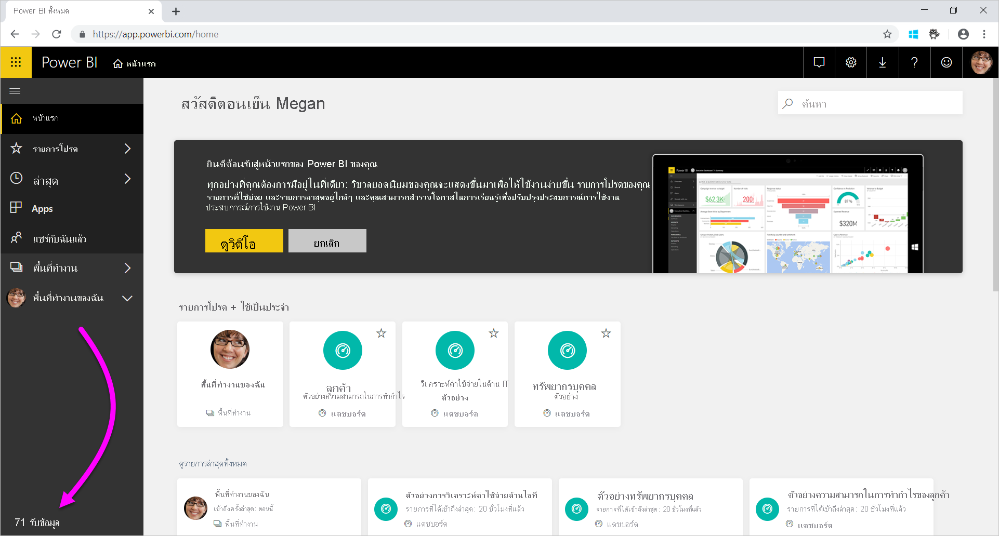
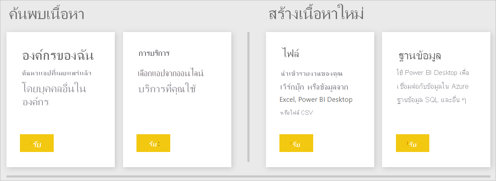
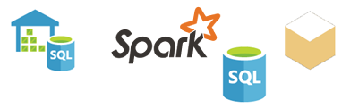

# แหล่งข้อมูลสำหรับบริการ Power BIData sources for the Power BI service
ข้อมูลเป็นหัวใจสำคัญของ Power BIData is at the heart of Power BI. หากคุณกำลังสำรวจข้อมูลLet's say you're exploring data. คุณอาจทำได้โดยการสร้างแผนภูมิและแดชบอร์ด หรือการถามคำถามด้วย **ถามตอบ** ได้You may do that by creating charts and dashboards, or asking questions with **Q&A**. การจัดรูปแบบการแสดงข้อมูลและคำตอบที่คุณเห็นจะได้รับข้อมูลเบื้องต้นจากชุดข้อมูลThe visualizations and answers you see are getting their underlying data from a dataset. แตชุดข้อมูลนั้นมาจากไหนBut where does that dataset come from? ใช่แล้ว ชุดข้อมูลมาจากแหล่งข้อมูลWell, it comes from a data source.

ในบทความนี้ เรากำลังจะพูดถึงประเภทของแหล่งข้อมูลที่คุณสามารถเชื่อมต่อกับจากบริการของ Power BI ได้In this article, we're going to cover the data source types you can connect to from the Power BI service. โปรดทราบว่ายังมีแหล่งข้อมูลชนิดอื่น ๆ อีกมากมายที่คุณสามารถรับข้อมูลมาได้ด้วยเช่นกันKeep in mind that there are many other types of data sources you can get data from, too. ถ้าคุณเลือกแหล่งข้อมูลเหล่านี้ คุณอาจจำเป็นต้องใช้ Power BI Desktop หรือคิวรีข้อมูลขั้นสูงของ Excel และคุณลักษณะแบบจำลองก่อนIf you choose these data sources, you may need to use Power BI Desktop or Excel's advanced data query and modeling features first. เราจะอธิบายเรื่องเหล่านั้นในภายหลังWe'll go into more about those options later. ในตอนนี้ มาดูประเภทของแหล่งข้อมูลที่ใช้ได้จากไซต์ Power BI ของคุณFor now, let's look at the different types of data sources available right from your Power BI service site.

คุณสามารถรับข้อมูลจากแหล่งข้อมูลใดก็ได้ใน Power BI โดยการเลือก **รับข้อมูล** ที่มุมล่างซ้ายของหน้าได้You can get data from any of the data sources in Power BI by selecting **Get Data** in the bottom-left corner of the page.

 

หลังจากที่คุณเลือก **รับข้อมูล** คุณสามารถเลือกข้อมูลที่ต้องการเข้าถึงAfter you select **Get Data**, you can choose the data you want to access

## ค้นพบเนื้อหาDiscover content

ส่วน **ชุดเนื้อหา** ประกอบด้วยข้อมูลและรายงานทั้งหมดที่คุณต้องการแล้วเตรียมพร้อมสำหรับคุณThe **Discover content** section contains all the data and reports you need already prepared for you. ใน Power BI มีชุดเนื้อหาสองชนิด: องค์กรและบริการIn Power BI, there are two types of content packs: Organizational and Services. 

**องค์กร**: ถ้าคุณและผู้ใช้อื่นในองค์กรของคุณมีบัญชี Power BI Pro คุณสามารถสร้าง แชร์ และใช้ชุดเนื้อหาได้**Organizational**: If you and other users in your organization have a Power BI Pro account, you can create, share, and use content packs. เมื่อต้องการเรียนรู้เพิ่มเติม ดู [บทนำเกี่ยวกับชุดเนื้อหาระดับองค์กร](../collaborate-share/service-organizational-content-pack-introduction.md)To learn more, see [Intro to organizational content packs](../collaborate-share/service-organizational-content-pack-introduction.md).

**บริการ**: มีบริการพร้อมด้วยชุดเนื้อหาเยอะแยะมากมายสำหรับ Power BI และรายละเอียดเพิ่มเติมจะถูกเพิ่มในทุกครั้ง**Services**: There are literally dozens of services with content packs for Power BI, and more are being added all the time. บริการส่วนใหญ่จำเป็นต้องใช้บัญชีผู้ใช้Most services require you to have an account. เมื่อต้องการเรียนรู้เพิ่มเติม ดู[เชื่อมต่อกับบริการที่คุณใช้กับ Power BI](service-connect-to-services.md)To learn more, see [Connect to services you use with Power BI](service-connect-to-services.md).

## สร้างเนื้อหาใหม่Create new content

ส่วน **สร้างเนื้อหาใหม่** ประกอบด้วยตัวเลือกสำหรับการสร้าง และการนำเข้าเนื้อหาด้วยตนเองThe **Create new content** section contains options for creating and importing content yourself. ใน Power BI มีสองวิธีในการสร้างหรือนำเข้าเนื้อหาของคุณเอง: ไฟล์และฐานข้อมูลIn Power BI, there are two ways to create or import your own content: Files and Databases. 

### ไฟล์Files

**Excel** ( *.xlsx*, *.xlsm*) - ใน Excel เวิร์กบุ๊กอาจมีชนิดข้อมูลต่างกัน**Excel** (*.xlsx*, *.xlsm*) - In Excel, a workbook may include different data types. ตัวอย่างเช่น สามารถรวมข้อมูลที่คุณใส่ลงในแผ่นงานด้วยตนเองFor example, it can include data you've entered into worksheets yourself. ซึ่งอาจมีข้อมูลที่คุณทำการคิวรีและโหลดจากแหล่งข้อมูลภายนอก โดยใช้ Power QueryIt can also include data that you've queried and loaded from external data sources by using Power Query. Power Query จะพร้อมใช้งานผ่านฟังก์ชัน **รับและแปลง** ใน Excel 2016 หรือ Power PivotPower Query is available through **Get & Transform** in Excel 2016 or Power Pivot. คุณอาจนำเข้าข้อมูลจากตารางในแผ่นงาน หรือนำเข้าข้อมูลจากแบบจำลองข้อมูลYou may import data from tables in worksheets, or import data from a data model. เมื่อต้องการเรียนรู้เพิ่มเติม ดู [รับข้อมูลจากไฟล์สำหรับ Power BI](service-get-data-from-files.md)To learn more, see [Get data from files for Power BI](service-get-data-from-files.md).

**Power BI Desktop** ( *.pbix*) - คุณสามารถใช้ Power BI Desktop เพื่อทำการคิวรี และโหลดข้อมูลจากแหล่งข้อมูลภายนอก และสร้างรายงานได้**Power BI Desktop** (*.pbix*) - You can use Power BI Desktop to query and load data from external data sources and create reports. นอกจากนี้ คุณยังสามารถขยายแบบจำลองข้อมูลของคุณด้วยหน่วยวัดและความสัมพันธ์ หรือนำเข้าไฟล์ Power BI Desktop ลงในไซต์ Power BI ของคุณYou can also extend your data model with measures and relationships, or import your Power BI Desktop file into your Power BI site. Power BI Desktop จะเหมาะสมสำหรับผู้ใช้ขั้นสูงมากขึ้นPower BI Desktop is best for more advanced users. โดยทั่วไปแล้ว ผู้ใช้เหล่านี้เป็นบุคคลที่มีความเข้าใจที่ดีเกี่ยวกับแหล่งข้อมูลของตนTypically these users are ones who have a good understanding of their data sources. นอกจากนี้ พวกเขายังมีความเข้าใจการคิวรีข้อมูล และการแปลงข้อมูล รวมถึงแนวคิดการจำลองข้อมูลThey also understand data query and transformation, and data modeling concepts. เมื่อต้องการเรียนรู้เพิ่มเติม ดู[มุมมองความสัมพันธ์ใน Power BI Desktop](desktop-connect-to-data.md)To learn more, see [Connect to data in Power BI Desktop](desktop-connect-to-data.md).

**ค่าที่คั่นด้วยเครื่องหมายจุลภาค**( *.csv*) - ไฟล์เป็นไฟล์ข้อความอย่างง่ายพร้อมด้วยแถวของข้อมูล**Comma-Separated Value** (*.csv*) - Files are simple text files with rows of data. แถวแต่ละรายการอาจประกอบด้วยค่าอย่างน้อยหนึ่งค่าหรือมากกว่า แต่ละรายการโดยคั่นด้วยเครื่องหมายจุลภาคEach row may contain one or more values, each separated by a comma. ตัวอย่างเช่น *.csv* ที่มีข้อมูลชื่อและที่อยู่อาจมีแถวจำนวนมากได้For example, a *.csv* containing name and address data might have many rows. แต่ละแถวอาจมีค่าสำหรับชื่อ นามสกุล อยู่ เมือง สถานะ และอื่น ๆEach row may have values for first name, last name, street address, city, state, and so on. คุณไม่สามารถนำเข้าข้อมูลลงในไฟล์ *.csv* ได้ แต่หลายแอปพลิเคชัน เช่น Excel สามารถบันทึกข้อมูลในตารางอย่างง่ายเป็นไฟล์ *.csv*You can't import data into a *.csv* file, but many applications, like Excel, can save simple table data as a *.csv* file.

สำหรับไฟล์ชนิดอื่น ๆ เช่นตาราง XML ( *.xml*) หรือไฟล์ข้อความ ( *.txt*) คุณสามารถใช ้ **รับและแปลง** เพื่อคิวรี แปลง และโหลดข้อมูลนั้นลงในไฟล์ Excel หรือ Power BI Desktop ก่อนได้For other file types, like XML Table (*.xml*) or text (*.txt*) files, you can use **Get & Transform** to query, transform, and load that data into an Excel or Power BI Desktop file first. จากนั้นคุณสามารถนำเข้าไฟล์ Excel หรือ Power BI Desktop ลงใน Power BIYou can then import the Excel or Power BI Desktop file into Power BI.

ตำแหน่งที่คุณจัดเก็บไฟล์ของคุณทำให้มีความแตกต่างมากเกินไปWhere you store your files makes a significant difference, too. OneDrive for Business มีจำนวนยืดหยุ่นและรวมกับ Power BIOneDrive for Business provides the greatest amount of flexibility and integration with Power BI. การเก็บไฟล์บนไดรฟ์ภายในเครื่องสามารถทำได้It's OK to keep your files on your local drive. แต่ถ้าคุณต้องการรีเฟรชข้อมูลของคุณ มีขั้นตอนเพิ่มเติมThough if you need to refresh your data, there are a few extra steps. สำหรับข้อมูลเพิ่มเติม โปรดดูลิงก์บทความด้านล่าง:For more information, see the article links below.

### ฐานข้อมูลDatabases

**ฐานข้อมูลในระบบคลาวด์**-จากบริการของ Power BI คุณสามารถเชื่อมต่อสด:**Databases in the Cloud** - From the Power BI service, you can connect live to:

* ฐานข้อมูล Azure SQLAzure SQL Database
* คลังข้อมูล Azure SQLAzure SQL Data Warehouse
* Spark บน Azure HDInsightSpark on Azure HDInsight

การเชื่อมต่อจาก Power BI กับฐานข้อมูลเหล่านี้เป็นการเชื่อมต่อสดConnections from Power BI to these databases are live. หากคุณเชื่อมต่อกับฐานข้อมูล SQL AzureLet's say you connect to an Azure SQL Database. แล้วคุณเริ่มการสำรวจข้อมูลโดยการสร้างรายงานใน Power BIYou then begin exploring its data by creating reports in Power BI. เมื่อใดก็ตามที่คุณแบ่งส่วนข้อมูลของคุณหรือเพิ่มเขตข้อมูลอื่นลงในการจัดรูปแบบการแสดงข้อมูล Power BI จะสร้างคิวรีที่เหมาะสมสำหรับฐานข้อมูลWhenever you slice your data or add another field to a visualization, Power BI makes a query right to the database. เมื่อต้องการเรียนรู้เพิ่มเติม ดู [Azure และ Power BI](service-azure-and-power-bi.md)To learn more, see [Azure and Power BI](service-azure-and-power-bi.md).

**ฐานข้อมูลภายในองค์กร** - จากบริการของ Power BI คุณสามารถเชื่อมต่อโดยตรงกับแบบจำลองฐานข้อมูลแบบตารางของ SQL Server Analysis Services ได้**Databases on-premises** -  From the Power BI service, you can connect directly to SQL Server Analysis Services Tabular model databases. เมื่อต้องการทำเช่นนั้น คุณจะต้องใช้เกตเวย์ Power BI EnterpriseTo do so, you'll need a Power BI Enterprise gateway. ถ้าคุณไม่แน่ใจเกี่ยวกับวิธีการเชื่อมต่อกับฐานข้อมูลแบบจำลองแบบตารางขององค์กร ให้ตรวจสอบกับผู้ดูแลระบบหรือแผนก IT ของคุณIf you're not clear on how to connect to your organization's tabular model database, check with your administrator or IT department. เมื่อต้องการเรียนรู้เพิ่มเติม ดู [ข้อมูลสดของ SQL Server Analysis Services ใน Power BI](sql-server-analysis-services-tabular-data.md)To learn more, see [SQL Server Analysis Services live data in Power BI](sql-server-analysis-services-tabular-data.md).

สำหรับฐานข้อมูลชนิดอื่น ๆ ในองค์กร คุณจะต้องใช้ Power BI Desktop หรือ Excel เพื่อเชื่อมต่อ คิวรี และโหลดข้อมูลลงในแบบจำลองข้อมูลFor other database types in your organization, you'll need to use Power BI Desktop or Excel to connect to, query, and load data into a data model. จากนั้นคุณสามารถนำเข้าไฟล์ของคุณลงใน Power BI ที่สร้างชุดข้อมูลYou can then import your file into Power BI where a dataset exists. ถ้าคุณกำหนดค่ารีเฟรชตามกำหนดการ Power BI จะใช้ข้อมูลการกำหนดค่าและการเชื่อมต่อจากไฟล์เพื่อเชื่อมต่อโดยตรงไปยังแหล่งข้อมูลและคิวรีสำหรับการอัปเดตIf you configure a scheduled refresh, Power BI will use that configuration and connection information from the file to connect directly to the datasource and query for updates. จากนั้น Power BI โหลดอัปเดตเหล่านั้นลงในชุดข้อมูลPower BI then loads those updates into the dataset. เมื่อต้องการเรียนรู้เพิ่มเติม ดู[มุมมองความสัมพันธ์ใน Power BI Desktop](desktop-connect-to-data.md)To learn more, see [Connect to data in Power BI Desktop](desktop-connect-to-data.md).

## เกิดอะไรขึ้นถ้าข้อมูลมาจากแหล่งข้อมูลที่แตกต่างกันWhat if my data comes from a different source?
มีแหล่งข้อมูลอยู่เป็นหลายร้อยแหล่งที่คุณสามารถนำมาใช้กับ Power BIThere are hundreds of different data sources you can use with Power BI. ไม่ว่าคุณจะได้รับข้อมูลจากที่ใด ข้อมูลนั้นจะต้องอยู่ในรูปแบบที่บริการของ Power BI สามารถใช้ได้Wherever you get your data from, that data has to be in a format consumable by the Power BI service. ด้วยข้อมูลที่สามารถใช้ได้ บริการของ Power BI สามารถสร้างรายงานและแดชบอร์ด ตอบคำถามด้วย **ถามตอบ** ฯลฯ ได้With consumable data, the Power BI service can create reports and dashboards, answer questions with **Q&A**, and so on.

บางแหล่งข้อมูลมีข้อมูลที่จัดรูปแบบไว้แล้วสำหรับบริการของ Power BISome data sources already have data formatted for the Power BI service. แหล่งข้อมูลเหล่านี้จะเหมือนกับชุดเนื้อหาจากผู้ให้บริการเช่น Google Analytics และ TwilioThese sources are like content packs from service providers like Google Analytics and Twilio. แบบจำลองฐานข้อมูลแบบตารางของ SQL Server Analysis Services ก็พร้อมใช้งานเช่นกันSQL Server Analysis Services Tabular model databases are ready for use, too. นอกจากนี้ คุณยังสามารถเชื่อมต่อแบบสดกับฐานข้อมูลในระบบคลาวด์เช่น ฐานข้อมูล SQL Azure และ Spark บน HDInsightYou can also connect live to databases in the cloud like Azure SQL Database and Spark on HDInsight.

ในกรณีอื่น ๆ คุณอาจจำเป็นเพื่อสอบถาม และโหลดข้อมูลคุณต้องลงในไฟล์In other cases, it might be necessary to query and load the data you want into a file. ตัวอย่างเช่น หากคุณมีข้อมูลลอจิสติกส์ในองค์กรของคุณFor example, let's say you have logistics data in your organization. คุณสามารถเก็บข้อมูลดังกล่าวในฐานข้อมูลคลังข้อมูลบนเซิร์ฟเวอร์ได้You store that data in a data warehouse database on a server. ในบริการของ Power BI คุณไม่สามารถเชื่อมต่อกับฐานข้อมูลนั้นโดยตรง และเริ่มการสำรวจข้อมูล (ยกเว้นว่าเป็นฐานข้อมูลแบบจำลองแบบตาราง)In the Power BI service, you can't connect to that database and begin exploring its data unless it's a tabular model database. แต่คุณสามารถใช้ Power BI Desktop หรือ Excel เพื่อคิวรีและโหลดข้อมูลลอจิสติกส์นั้นลงในแบบจำลองข้อมูลแล้วบันทึกเป็นไฟล์But, you can use Power BI Desktop or Excel to query and load that logistics data into a data model you then save as a file. จากนั้นคุณสามารถนำเข้าไฟล์ของคุณลงใน Power BI ที่มีชุดข้อมูลYou can then import that file into Power BI where a dataset exists.

คุณอาจกำลังคิด - “แต่ว่าข้อมูลลอจิสติกส์นั้นบนฐานข้อมูลนั้นเปลี่ยนแปลงทุกวันYou're probably thinking, "But the logistics data on that database changes every day. ฉันจะรีเฟรชชุดข้อมูล Power BI ได้อย่างไร"How do I refresh my Power BI dataset?" เมื่อคุณนำเข้าข้อมูลลงในชุดข้อมูล คุณจะนำเข้าข้อมูลการเชื่อมต่อจาก Power BI Desktop หรือไฟล์ ExcelWhen you import the data into the dataset, you also import the connection information from either the Power BI Desktop or the Excel file.

หากคุณกำหนดค่าการรีเฟรชตามกำหนดการ หรือทำการรีเฟรชชุดข้อมูลด้วยตนเองLet's say you configure a scheduled refresh or do a manual refresh on the dataset. Power BI ใช้ข้อมูลการเชื่อมต่อจากชุดข้อมูล พร้อมกับการตั้งค่าอื่น ๆ สองรายการเพื่อเชื่อมต่อโดยตรงไปยังฐานข้อมูลPower BI uses the connection information from the dataset, along with a couple of other settings, to connect directly to the database. จากนั้นจะทำการคิวรีสำหรับการอัปเดต และโหลดการอัปเดตเหล่านั้นลงในชุดข้อมูลIt then queries for updates and loads those updates into the dataset. ตามแนวโน้ม คุณอาจต้องใช้เกตเวย์ Power BI เพื่อรักษาความปลอดภัยการถ่ายโอนข้อมูลระหว่างเซิร์ฟเวอร์ภายในองค์กรกับ Power BIAs a side note, you likely will need a Power BI gateway to secure any data transfer between your on-premises server and Power BI. เมื่อการถ่ายโอนเสร็จสมบูรณ์ การจัดรูปแบบการแสดงข้อมูลใด ๆ ในรายงานและแดชบอร์ดจะรีเฟรชโดยอัตโนมัติWhen the transfer is complete, any visualizations in reports and dashboards refresh automatically.

คุณเห็นแม้ว่าคุณไม่สามารถเชื่อมต่อกับแหล่งข้อมูลโดยตรงจากบริการของ Power BI แต่คุณยังคงสามารถรับข้อมูลนั้นลงใน Power BIYou see, even though you can't connect to your data source directly from the Power BI service you can still get that data into Power BI. เพียงแค่อาจใช้เวลาขั้นตอนเพิ่มเติม และอาจบางความช่วยเหลือจากแผนก IT ของคุณIt just might take a few more steps and maybe some help from your IT department. ดู[แหล่งข้อมูลใน Power BI Desktop](desktop-data-sources.md)เมื่อต้องการเรียนรู้เพิ่มเติมSee [Data sources in Power BI Desktop](desktop-data-sources.md) to learn more.

## ดูรายละเอียดเพิ่มเติมSome more details
คุณจะเห็นชุดข้อมูลเงื่อนไข และแหล่งข้อมูลที่ถูกนำมาใช้มากใน Power BIYou'll see the terms dataset and data source used a lot in Power BI. แหล่งข้อมูลนั้นมักจะถูกนำมาใช้เหมือน ๆ กันThey're often used synonymously. แต่จริง ๆ แล้วเป็นสองแหล่งข้อมูลที่แตกต่างกัน แม้จะมีความข้องเกี่ยวกันก็ตามBut they really are two different things, although they're related.

คุณสามารถสร้าง **ชุดข้อมูล** โดยอัตโนมัติใน Power BI เมื่อคุณใช้ **รับข้อมูล**You create a **dataset** automatically in Power BI when you use **Get Data**. ด้วย **รับข้อมูล** คุณสามารถเชื่อมต่อและนำเข้าข้อมูลจากชุดเนื้อหา ไฟล์ หรือคุณเชื่อมต่อกับแหล่งข้อมูลสดWith **Get Data**, you connect to and import data from a content pack, file, or you connect to a live data source. ชุดข้อมูลประกอบด้วยข้อมูลเกี่ยวกับข้อมูลประจำตัวของแหล่งข้อมูลและแหล่งข้อมูลA dataset contains information about the data source and data-source credentials. ในหลายกรณี ยังมีชุดย่อยของข้อมูลที่คัดลอกจากแหล่งข้อมูลIn many cases, it also includes a subset of data copied from the data source. เมื่อคุณสร้างการจัดรูปแบบการแสดงข้อมูลในรายงานและแดชบอร์ด คุณมักจะดูข้อมูลในชุดข้อมูลWhen you create visualizations in reports and dashboards, you're often looking at data in the dataset.

**แหล่งข้อมูล** คือที่มาของข้อมูลที่คุณอัปโหลดลงในชุดข้อมูลA **data source** is where the data in a dataset comes from. ตัวอย่างเช่น ข้อมูลอาจมาจาก:For example, the data could come from:

* บริการแบบออนไลน์เช่น Google Analytics หรือ QuickBooksAn online service like Google Analytics or QuickBooks
* ฐานข้อมูลในระบบคลาวด์เช่น ฐานข้อมูล Azure SQLA database in the cloud like Azure SQL Database
* ฐานข้อมูลหรือไฟล์บนคอมพิวเตอร์หรือเซิร์ฟเวอร์ในองค์กรของคุณเองA database or file on a local computer or server in your own organization

## การรีเฟรชข้อมูลData refresh
บางทีคุณอาจบันทึกไฟล์ไดรฟ์ภายในเครื่องหรือไดรฟ์ที่ใดที่หนึ่งในองค์กรของคุณMaybe you save your files on your local drive or a drive somewhere in your organization. คุณอาจต้องการเกตเวย์ Power BI เพื่อให้คุณสามารถรีเฟรชชุดข้อมูลใน Power BIYou may need a Power BI gateway so that you can refresh the dataset in Power BI. คอมพิวเตอร์ที่จัดเก็บไฟล์จำเป็นต้องเปิดไว้เมื่อมีการรีเฟรชเกิดขึ้นThe computer that stores the file needs to be on when a refresh happens. คุณสามารถนำเข้าไฟล์หรือเผยแพร่จาก Excel หรือ Power BI Desktop แต่ตัวเลือกเหล่านั้นไม่ใช่กระบวนการอัตโนมัติYou can reimport your file or use Publish from Excel or Power BI Desktop, but those options aren't automated processes.

ถ้าคุณบันทึกไฟล์บน OneDrive for Business หรือไซต์ทีม SharePoint คุณสามารถเชื่อมต่อหรือนำเข้าไฟล์เหล่านั้นไปยัง Power BI ได้If you save your files on OneDrive for Business or SharePoint - Team Sites, you can then connect to or import them into Power BI. แล้ว ชุดข้อมูล รายงาน และแดชบอร์ดอัปเดตอยู่เสมอThen, your dataset, reports, and dashboard will always be up-to-date. เนื่องจากทั้ง OneDrive และ Power BI อยู่ในระบบคลาวด์ Power BI สามารถเชื่อมต่อโดยตรงไปยังไฟล์ที่บันทึกไว้Because both OneDrive and Power BI are in the cloud, Power BI can connect directly to your saved file. ซึ่งเชื่อมต่อประมาณหนึ่งครั้งในทุกชั่วโมงและตรวจหาการอัปเดตIt connects about once every hour and checks for updates. ชุดข้อมูลและการจัดรูปแบบการแสดงข้อมูลจะรีเฟรชโดยอัตโนมัติถ้ามีการอัปเดตใด ๆThe dataset and any visualizations refresh automatically if there are any updates.

ชุดเนื้อหาจากบริการอัปเดตโดยอัตโนมัติContent packs from services are automatically updated. ในกรณีส่วนใหญ่ ชุดข้อมูลเหล่านั้นจะอัปเดตวันละครั้งIn most cases, they're updated once a day. คุณสามารถรีเฟรชด้วยตนเองได้ แต่ถ้าคุณจะเห็นข้อมูลใด ๆ ที่อัปเดตแล้วจะขึ้นอยู่กับผู้ให้บริการYou can manually refresh, but if you see any updated data will depend on the service provider. การอัปเดตชุดเนื้อหาจากบุคคลในองค์กรของคุณจะขึ้นอยู่กับแหล่งข้อมูลที่ใช้Updates to content packs from people in your organization will depend on the data sources used. นอกจากนี้ยังขึ้นอยู่กับวิธีการที่บุคคลที่สร้างชุดเนื้อหาได้กำหนดค่าการรีเฟรชThey'll also depend on how the person who created the content pack configured the refresh.

Azure SQL Database, Azure SQL Data Warehouse และ Spark บน Azure HDInsight คือแหล่งข้อมูลในระบบคลาวด์Azure SQL Database, Azure SQL Data Warehouse, and Spark on Azure HDInsight are data sources in the Cloud. นอกจากนี้ บริการของ Power BI ยังอยู่ในระบบคลาวด์ ดังนั้น Power BI สามารถเชื่อมต่อสดโดยใช้ **DirectQuery**The Power BI service is also in the cloud so Power BI can connect to those data sources live, using **DirectQuery**. สิ่งที่คุณเห็นใน Power BI จะได้รับการซิงค์อยู่เสมอ และไม่จำเป็นเมื่อต้องการตั้งค่าการรีเฟรชตามกำหนดการWhat you see in Power BI is always in sync and there's no need to set up a scheduled refresh.

เมื่อคุณเชื่อมต่อกับ SQL Server Analysis Services จาก Power BI การเชื่อมต่อนี้เป็นการเชื่อมต่อแบบสดเช่นเดียวกับฐานข้อมูล Azure ในคลาวด์When you connect to SQL Server Analysis Services from Power BI, it's a live connection just like an Azure database in the cloud. ความแตกต่างคือฐานข้อมูลนั้นอยู่บนเซิร์ฟเวอร์ในองค์กรของคุณThe difference is the database itself is on a server in your organization. การเชื่อมต่อประเภทนี้จำเป็นต้องใช้เกตเวย์ Power BI ซึ่งแผนก IT กำหนดค่าThis type of connection requires a Power BI gateway, which an IT department configures.

การรีเฟรชข้อมูลสำคัญมากคือเป็นส่วนหนึ่งของ Power BI และมากเกินไปความลึกเพื่อให้ครอบคลุมที่นี่Data refresh is a super important part of Power BI, and much too deep to cover here. ถ้าคุณต้องการทำความเข้าใจอย่างละเอียด โปรดแน่ใจว่าการเช็คเอาท์[รีเฟรชข้อมูลใน Power BI](refresh-data.md)If you want to get a thorough understanding, be sure to check out [Data Refresh in Power BI](refresh-data.md).

## ข้อควรพิจารณาและข้อจำกัดConsiderations and limitations
สำหรับแหล่งข้อมูลทั้งหมดที่ใช้ในบริการของ Power BI ควรพิจารณาข้อจำกัดดังต่อไปนี้For all data sources used in the Power BI service, consider the following limitations. มีข้อจำกัดอื่น ๆ ที่นำไปใช้กับคุณลักษณะเฉพาะ แต่รายการต่อไปนี้นำไปใช้กับบริการเต็มรูปแบบของ Power BI :There are other limitations that apply to specific features, but the following list applies to the full Power BI service:

* **ขีดจำกัดขนาดของชุดข้อมูล**- มีขีดจำกัด 1 GB สำหรับแต่ละชุดข้อมูลที่เก็บไว้ในความจุที่สามารถแชร์ได้ในบริการของ Power BI**Dataset size limit** - There's a 1-GB limit for datasets stored in Shared capacities in the Power BI service. ถ้าคุณต้องการชุดข้อมูลขนาดใหญ่ขึ้น คุณสามารถใช้  [Power BI Premium](../admin/service-premium-what-is.md) ได้If you need larger datasets, you can use [Power BI Premium](../admin/service-premium-what-is.md).

* **ค่าที่แตกต่างกันในคอลัมน์** -เมื่อแคชข้อมูลในชุดข้อมูล Power BI (บางครั้งเรียกว่า ' อิมพอร์ต ' โหมด), มีขีดจำกัด1,999,999,997 บนจำนวนของค่าที่แตกต่างกันที่สามารถจัดเก็บไว้ในคอลัมน์**Distinct values in a column** - When caching data in a Power BI dataset (sometimes called 'Import' mode), there is a 1,999,999,997  limit on the number of distinct values that can be stored in a column.

* **การจำกัดแถว** -เมื่อใช้ **DirectQuery**  Power BI จะกำหนดการจำกัดของผลลัพธ์คิวรีที่ส่งไปยังแหล่งข้อมูลพื้นฐานของคุณ**Row limit** - When using **DirectQuery**, Power BI imposes a limit on the query results that are sent to your underlying data source. ถ้าคิวรีที่ส่งไปยังแหล่งข้อมูลถูกส่งกลับมากกว่า 1 ล้านแถวคุณจะเห็นข้อผิดพลาดและคิวรีล้มเหลวIf the query sent to the data source returns more than one million rows, you see an error and the query fails. ข้อมูลเบื้องต้นของคุณยังคงสามารถมีได้มากกว่า 1 ล้านแถวYour underlying data can still contain more than one million rows. คุณไม่จำเป็นต้องให้ระบบทำงานจนถึงขีดสุดนี้เพราะรายงานส่วนใหญ่จะรวมข้อมูลลงในชุดผลลัพธ์ที่มีขนาดเล็กลงYou're unlikely to run into this limit as most reports aggregate the data into smaller sets of results.

* **ขีดจำกัดของคอลัมน์**- จำนวนคอลัมน์สูงสุดที่ได้รับอนุญาตในชุดข้อมูล ระหว่างตารางทั้งหมดในชุดข้อมูล 16,000 คอลัมน์**Column limit** - The maximum number of columns allowed in a dataset, across all tables in the dataset, is 16,000 columns. ข้อจำกัดนี้นำไปใช้กับบริการของ Power BI และชุดข้อมูลที่ใช้ใน Power BI DesktopThis limit applies to the Power BI service and to datasets used in Power BI Desktop. Power BI จะติดตามจำนวนแถวภายในและตารางในชุดข้อมูล ซึ่งหมายความว่า จำนวนคอลัมน์สูงสุดคือ 16,000 ลบหนึ่งสำหรับแต่ละตารางในชุดข้อมูลPower BI tracks the number of columns and tables in the dataset in this way, which means the maximum number of columns is 16,000 minus one for each table in the dataset.
