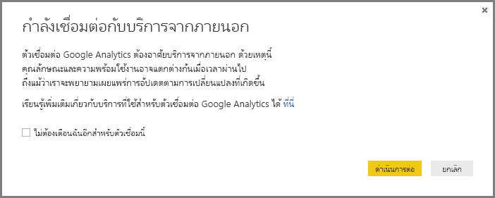

# ใช้ตัวเชื่อมต่อ Google Analytics สำหรับ Power BI DesktopUse the Google Analytics connector for Power BI Desktop
> [!NOTE]
> ชุดเนื้อหา Google Analytics และตัวเชื่อมต่อใน Power BI Desktop พึ่งพา Google Analytics Core Reporting APIThe Google Analytics content pack and the connector in Power BI Desktop rely on the Google Analytics Core Reporting API. ด้วยเหตุนี้ คุณลักษณะและความพร้อมใช้งาน อาจแตกต่างกันไปตามเวลาAs such, features and availability may vary over time.

คุณสามารถเชื่อมต่อกับข้อมูล Google Analytics โดยใช้ตัวเชื่อมต่อ **Google Analytics** ได้You can connect to Google Analytics data using the **Google Analytics** connector. เพื่อเชื่อมต่อ ทำตามขั้นตอนต่อไปนี้:To connect, follow these steps:

1. ใน **Power BI Desktop** เลือก **รับข้อมูล** จากการแท็บ ribbon **หน้าแรก**In **Power BI Desktop**, select **Get Data** from the **Home** ribbon tab.
2. ในหน้าต่าง **รับข้อมูล** เลือก **บริการออนไลน์** จากประเภทในบานหน้าต่างด้านซ้ายIn the **Get Data** window, select **Online Services** from the categories in the left pane.
3. เลือก **Google Analytics** จากตัวเลือกในบานหน้าต่างด้านขวาSelect **Google Analytics** from the selections in the right pane.
4. ที่ด้านล่างของหน้าต่าง เลือก **เชื่อมต่อ**At the bottom of the window, select **Connect**.  
   

คุณได้รับพร้อมท์กล่องโต้ตอบที่อธิบายว่า ตัวเชื่อมต่อเป็นบริการจากบุคคลที่สาม และเตือนเกี่ยวกับคุณลักษณะและความพร้อมใช้งาน ที่อาจเปลี่ยนไปตามช่วงเวลา และคำอธิบายอื่น ๆYou're prompted with a dialog that explains that the connector is a Third-Party Service, and warns about how features and availability may change over time, and other clarifications.  

เมื่อคุณเลือก **ดำเนินการต่อ** คุณจะได้รับพร้อมท์ให้ลงชื่อเข้าใช้ Google AnalyticsWhen you select **Continue**, you're prompted to sign in to Google Analytics.  

เมื่อคุณใส่ข้อมูลประจำตัวของคุณ คุณได้รับพร้อมท์ว่า Power BI ต้องสามารถเข้าถึงแบบออฟไลน์When you enter your credentials, you're prompted that Power BI would like to have offline access. นี่คือวิธีที่คุณใช้ **Power BI Desktop** เพื่อเข้าถึงข้อมูล Google Analytics ของคุณThis is how you use **Power BI Desktop** to access your Google Analytics data.  

เมื่อคุณยอมรับ **Power BI Desktop** แสดงให้เห็นว่าคุณลงชื่อเข้าใช้แล้วOnce you accept, **Power BI Desktop** shows that you're currently signed in.  

เลือก **เชื่อมต่อ** และข้อมูล Google Analytics ของคุณ จะถูกเชื่อมต่อกับ **Power BI Desktop** และโหลดข้อมูลSelect **Connect**, and your Google Analytics data is connected to **Power BI Desktop**, and loads the data.  

## การเปลี่ยนแปลงของ APIChanges to the API
แม้ว่าเราพยายามเผยแพร่อัปเดตที่สอดคล้องกับการเปลี่ยนแปลงใด ๆ API อาจเปลี่ยนแปลงในลักษณะที่ส่งผลกระทบต่อผลลัพธ์ของคิวรีที่เราสร้างขึ้นAlthough we attempt to release updates in accordance with any changes, the API may change in a way that affects the results of the queries we generate. ในบางกรณี บางแบบสอบถามอาจไม่สนับสนุนอีกต่อไปIn some cases, certain queries may no longer be supported. เนื่องจากการต้องพึ่งพาจากบุคคลที่สามนี้ เราไม่สามารถรับประกันผลลัพธ์ของคิวรีคุณเมื่อใช้ตัวเชื่อมต่อนี้Due to this dependency we cannot guarantee the results of your queries when using this connector.

รายละเอียดเพิ่มเติมเกี่ยวกับ การเปลี่ยนแปลง Google Analytics API สามารถอ่านใน[บันทึกการเปลี่ยนแปลง](https://developers.google.com/analytics/devguides/changelog)ของพวกเขาได้More details on changes to the Google Analytics API can be found in their [changelog](https://developers.google.com/analytics/devguides/changelog).

