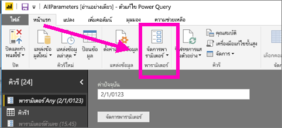
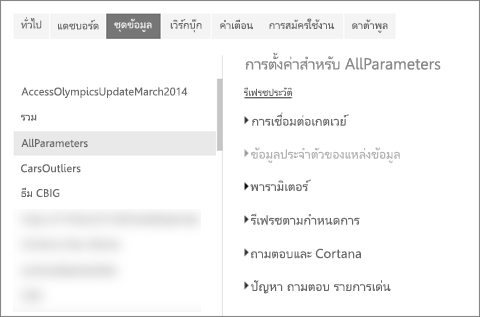
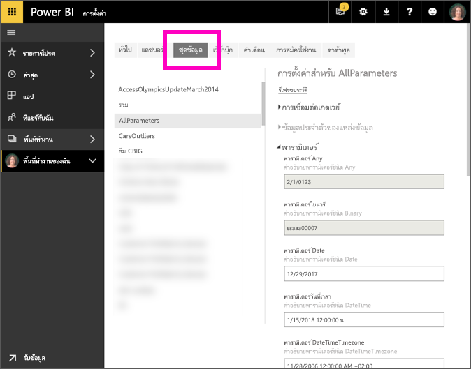

# แก้ไขการตั้งค่าพารามิเตอร์ในบริการ Power BIEdit parameter settings in the Power BI service
ผู้สร้างรายงานเพิ่มพารามิเตอร์คิวรีลงในรายงานใน Power BI DesktopReport creators add query parameters to reports in Power BI Desktop. พารามิเตอร์อนุญาตให้ผู้สร้างสามารถรายงานสร้างส่วนต่าง ๆ ของรายงาน ที่ขึ้นอยู่กับพารามิเตอร์อย่างน้อยหนึ่ง *ค่า*Parameters allow them to make parts of reports depend on one or more parameter *values*. ตัวอย่างเช่น ผู้สร้างรายงานอาจสร้างพารามิเตอร์ที่จำกัดข้อมูลไว้ที่ประเทศ/ภูมิภาคหนึ่ง ๆ หรือพารามิเตอร์ที่กำหนดรูปแบบที่ยอมรับได้สำหรับเขตข้อมูลเช่น วัน เวลา และข้อความFor example, a report creator may create a parameter that restricts the data to a single country/region, or a parameter that defines acceptable formats for fields like dates, time, and text.

## ตรวจสอบ และแก้ไขพารามิเตอร์ในบริการ Power BIReview and edit parameters in Power BI service

ในฐานะผู้สร้างรายงาน คุณสามารถกำหนดพารามิเตอร์ใน Power BI Desktop ได้As a report creator, you define parameters in Power BI Desktop. เมื่อคุณ [เผยแพร่รายงานนั้นไปยังบริการ Power BI](../create-reports/desktop-upload-desktop-files.md) การตั้งค่าและการเลือกพารามิเตอร์จะเดินทางไปด้วยWhen you [publish that report to Power BI service](../create-reports/desktop-upload-desktop-files.md), the parameter settings and selections travel with it. คุณสามารถตรวจทานและแก้ไขการตั้งค่าพารามิเตอร์ในบริการของ Power BI แต่ไม่สามารถสร้างได้You can review and edit parameter settings in the Power BI service, but not create them.

1. ในบริการ Power BI เลือกไอคอน cog เพื่อเปิด **การตั้งค่า**In the Power BI service, select the cog icon  to open **Settings**.

2. เลือกแท็บสำหรับ **ชุดข้อมูล** และไฮไลต์ชุดข้อมูลในรายการSelect the tab for **Datasets** and highlight a dataset in the list. 
    
    

3. ขยาย **พารามิเตอร์**Expand **Parameters**.  ถ้าชุดข้อมูลที่เลือกไม่มีพารามิเตอร์ คุณจะเห็นข้อความที่มีลิงก์เพื่อเรียนรู้เพิ่มเติมเกี่ยวกับพารามิเตอรคิวรีIf the selected dataset has no parameters, you see a message with a link to Learn more about query parameters. แต่ถ้าชุดข้อมูลมีพารามิเตอร์ ให้ขยายหัวข้อ **พารามิเตอร์** จะแสดงพารามิเตอร์เหล่านั้นIf the dataset does have parameters, expand the **Parameters** heading to reveal those parameters. 

    

    ตรวจสอบการตั้งค่าพารามิเตอร์ และทำการเปลี่ยนแปลงถ้าจำเป็นReview the parameter settings and make changes if needed. เขตข้อมูลสีเทาไม่สามารถแก้ไขได้Grayed-out fields aren't editable. 

## ขั้นตอนถัดไปNext steps
วิธีเพิ่มพารามิเตอร์แบบง่ายคือ[ปรับเปลี่ยน URL](../collaborate-share/service-url-filters.md)An ad-hoc way to add simple parameters is by [modifying the URL](../collaborate-share/service-url-filters.md).
