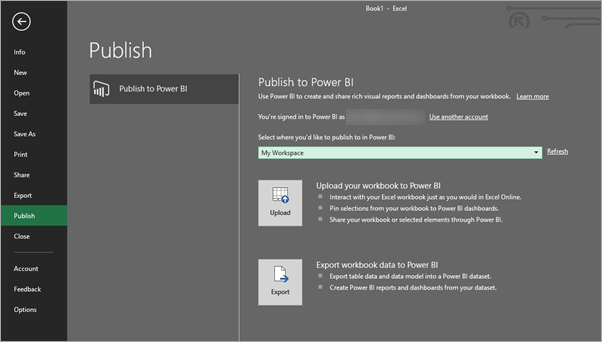

# เผยแพร่ไปยัง Power BI จาก Microsoft ExcelPublish to Power BI from Microsoft Excel
ด้วย Microsoft Excel 2016 และรุ่นใหม่กว่า คุณสามารถเผยแพร่สมุดงาน Excel ของคุณไปยังพื้นที่ทำงาน [Power BI](https://powerbi.microsoft.com) ได้โดยตรง ซึ่งเป็นที่ที่คุณสามารถสร้างรายงานและแดชบอร์ดแบบโต้ตอบสูงตามข้อมูลของสมุดงานของคุณได้With Microsoft Excel 2016 and later, you can publish your Excel workbooks directly to your [Power BI](https://powerbi.microsoft.com) workspace, where you can create highly interactive reports and dashboards based on your workbook’s data. จากนั้นคุณสามารถแชร์ข้อมูลเชิงลึกของคุณกับผู้อื่นในองค์กรของคุณได้You can then share your insights with others in your organization.

เมื่อเผยแพร่เวิร์กบุ๊กไปยัง Power BI มีบางสิ่งที่ควรพิจารณา:When publishing a workbook to Power BI, there are few things to consider:

* บัญชีที่คุณใช้เพื่อลงชื่อเข้าใช้ Office, OneDrive for Business และ Power BI ต้องเป็นบัญชีเดียวกันThe account you use to sign in to Office, OneDrive for Business (if using workbooks saved there), and Power BI must be the same account.
* คุณไม่สามารถเผยแพร่สมุดงานเปล่าหรือสมุดงานที่มีเนื้อหาที่ไม่สนับสนุนใน Power BI ได้You cannot publish an empty workbook, or a workbook that doesn’t have any Power BI supported content.
* คุณไม่สามารถเผยแพร่สมุดงานที่มีการเข้ารหัสลับ หรือป้องกันด้วยรหัสผ่าน หรือสมุดงานที่มีการจัดการการปกป้องข้อมูล ( Information Protection Management) ได้You cannot publish encrypted or password protected workbooks, or workbooks with Information Protection Management.
* การเผยแพร่ไปยัง Power BI จำเป็นต้องเปิดใช้งานการรับรองความถูกต้องสมัยใหม่ (ค่าเริ่มต้น)Publishing to Power BI requires modern authentication be enabled (default). หากปิดใช้งานอยู่ ตัวเลือกเผยแพร่จะไม่พร้อมใช้งานจากเมนูไฟล์If disabled, the Publish option is not available from the File menu.

## เผยแพร่เวิร์กบุ๊ก Excel ของคุณPublish your Excel workbook
ในการเผยแพร่สมุดงาน Excel ของคุณ ใน Excel ให้เลือก **ไฟล์** > **เผย่แพร่** และเลือก **อัปโหลด** หรือ **ส่งออก**To publish your Excel workbook, in Excel, select **File** > **Publish** and select either **Upload** or **Export**.

ถ้าคุณ **อัปโหลด** สมุดงานของคุณไปยัง Power BI คุณสามารถโต้ตอบกับเวิร์กบุ๊กได้เช่นเดียวกับที่คุณจะโต้ตอบโดยใช้ Excel OnlineIf you **Upload** your workbook to Power BI, you can interact with the workbook just as you would interact using Excel Online. คุณยังสามารถปักหมุดสิ่งที่เลือกจากสมุดงานของคุณไปยังแดชบอร์ด Power BI และแชร์สมุดงานของคุณ หรือองค์ประกอบที่เลือกผ่าน Power BIYou can also pin selections from your workbook onto Power BI dashboards, and share your workbook, or selected elements, through Power BI.

หากคุณเลือก **ส่งออก** คุณสามารถส่งออกข้อมูลตารางและรูปแบบข้อมูลไปยังชุดข้อมูล Power BI ซึ่งคุณสามารถใช้เพื่อสร้างรายงาน Power Dash และแดชบอร์ดได้If you select **Export**, you can export table data and its data model into a Power BI dataset, which you can then use to create Power BI reports and dashboards.

### เผยแพร่ไฟล์ภายในเครื่องLocal file publishing
Excel รองรับการเผยแพร่ไฟล์ Excel ในเครื่องExcel supports publishing of local Excel files. ไฟล์เหล่านี้ไม่จำเป็นต้องถูกบันทึกไปยัง OneDrive for Business หรือ SharePoint OnlineThey do not need to be saved to OneDrive for Business or SharePoint Online.

> [!IMPORTANT]
> คุณสามารถเผยแพร่ไฟล์ภายในเครื่องได้เฉพาะในกรณีที่คุณใช้ Excel 2016 (หรือใหม่กว่า) ด้วยการสมัครใช้งาน Microsoft 365You can only publish local files if you're using Excel 2016 (or later) with a Microsoft 365 subscription. การติดตั้งแบบสแตนด์อโลนของ Excel 2016 สามารถเผยแพร่ไปยัง Power BI ได้เฉพาะเมื่อบันทึกสมุดงานไปยัง OneDrive for Business หรือ SharePoint OnlineExcel 2016 standalone installations can Publish to Power BI, but only when the workbook is saved to OneDrive for Business or SharePoint Online.
> 

เมื่อคุณเลือก **เผยแพร่** คุณสามารถเลือกพื้นที่ทำงานที่คุณต้องการเผยแพร่ได้When you select **Publish**, you can select the workspace to which you want to publish. หากไฟล์ Excel ของคุณจัดเก็บอยู่ใน OneDrive for Business คุณสามารถเผยแพร่ไปยัง *พื้นที่ทำงานของฉัน* ได้เท่านั้นIf your Excel file resides on OneDrive for Business, you can only publish to your *My Workspace*. หากไฟล์ Excel ของคุณจัดเก็บอยู่บนไดรฟ์ภายในเครื่อง คุณสามารถเผยแพร่ไปยัง *พื้นที่ทำงานของฉัน* หรือพื้นที่ทำงานที่ใช้ร่วมกันซึ่งคุณสามารถเข้าถึงได้If your Excel file resides on a local drive, you can publish to *My Workspace* or a shared workspace to which you have access.

สองตัวเลือกในการรับสมุดงานของคุณเข้าสู่ Power BITwo options on how to get your workbook into Power BI.

เมื่อเผยแพร่แล้วเนื้อหาเวิร์กบุ๊กที่คุณเผยแพร่จะถูกนำเข้าไปยัง Power BI โดยแยกจากไฟล์ภายในเครื่องOnce published, the workbook content you publish is imported into Power BI, separate from the local file. หากคุณต้องการอัปเดตไฟล์ใน Power BI คุณต้องเผยแพร่เวอร์ชันที่อัปเดตอีกครั้งหรือคุณสามารถรีเฟรชข้อมูลโดยกำหนดค่าการรีเฟรชตามกำหนดเวลาในสมุดงานหรือบนชุดข้อมูลใน Power BIIf you want to update the file in Power BI, you must publish the updated version again, or you can refresh the data by configuring a scheduled refresh, on the workbook, or on the dataset in Power BI.

### การเผยแพร่จากการติดตั้ง Excel แบบสแตนด์อโลนPublishing from a standalone Excel installation
เมื่อเผยแพร่จากการติดตั้ง Excel แบบสแตนด์อโลน จะต้องบันทึกสมุดงานลงใน OneDrive for BusinessWhen publishing from a standalone Excel installation, the workbook must be saved to OneDrive for Business. เลือก **บันทึกไปยังคลาวด์** และเลือกตำแหน่งใน OneDrive for BusinessSelect **Save to Cloud** and choose a location in OneDrive for Business.

เมื่อบันทึกสมุดงานของคุณไปยัง OneDrive for Business แล้ว เมื่อคุณเลือก **เผยแพร่** คุณมีสองตัวเลือกในการรับสมุดงานของคุณลงใน Power BI **อัปโหลด** หรือ **ส่งออก**:Once your workbook is saved to OneDrive for Business, when you select **Publish**, you have two options to get your workbook into Power BI, **Upload** or **Export**:

#### อัปโหลดสมุดงานของคุณไปยัง Power BIUpload your workbook to Power BI
เมื่อคุณเลือกตัวเลือก **อัปโหลด** สมุดงานของคุณจะปรากฏใน Power BI ในลักษณะเดียวกับใน Excel OnlineWhen you choose the **Upload** option, your workbook will appear in Power BI just like it would in Excel Online. แต่จะต่างจาก Excel Online คือ คุณจะมีตัวเลือกบางอย่างที่ช่วยให้คุณสามารถปักหมุดองค์ประกอบจากแผ่นงานของคุณไปยังแดชบอร์ดBut, unlike Excel Online, you’ll have some options that enable you to help you pin elements from your worksheets to dashboards.

คุณไม่สามารถแก้ไขสมุดงานของคุณใน Power BI ได้You can’t edit your workbook in Power BI. หากคุณต้องการเปลี่ยนแปลงข้อมูล คุณสามารถเลือก **แก้ไข** จากนั้นเลือกแก้ไขสมุดงานของคุณใน Excel Online หรือเปิดใน Excel บนคอมพิวเตอร์ของคุณIf you need to make some changes to the data, you can select **Edit** then choose to edit your workbook in Excel Online or open it in Excel on your computer. การเปลี่ยนแปลงใดๆ ที่คุณทำจะถูกบันทึกไว้ในสมุดงานบน OneDrive for BusinessAny changes you make are saved to the workbook on OneDrive for Business.

เมื่อคุณ **อัปโหลด** จะไม่มีการสร้างชุดข้อมูลใน Power BIWhen you **Upload**, no dataset is created in Power BI. สมุดงานของคุณจะปรากฏในรายงาน ในบานหน้าต่างนำทางของพื้นที่ทำงานของคุณYour workbook will appear in Reports, in your workspace nav pane. สมุดงานที่อัปโหลดไปยัง Power BI มี Excel ไอคอนพิเศษ ระบุสมุดงานเหล่านั้นเป็นสมุดงาน Excel ที่มีการอัปโหลดWorkbooks uploaded to Power BI have a special Excel icon, identifying them as Excel workbooks that have been uploaded.

เลือกตัวเลือก **อัปโหลด** หากคุณมีข้อมูลในแผ่นงานเท่านั้น หรือคุณมี PivotTables และแผนภูมิที่คุณต้องการเห็นใน Power BIChoose the **Upload** option if you only have data in worksheets, or you have PivotTables and Charts you want to see in Power BI.

การใช้การอัปโหลดจากการเผยแพร่สู่ Power BI ใน Excel เป็นประสบการณ์ที่คล้ายคลึงกับ **รับข้อมูล > ไฟล์ > OneDrive for Business > เชื่อมต่อ จัดการ และดู Excel ใน Power BI** จาก Power BI ในเบราว์เซอร์ของคุณUsing Upload from Publish to Power BI in Excel is a similar experience to **Get Data > File > OneDrive for Business > Connect, Manage and View Excel in Power BI** from Power BI in your browser.

#### ส่งออกข้อมูลในสมุดงานไปยัง Power BIExport workbook data to Power BI
เมื่อคุณเลือกตัวเลือก **ส่งออก** ข้อมูลใดๆ ที่รองรับในตาราง และ/หรือ รูปแบบข้อมูลจะถูกส่งออกไปยังชุดข้อมูลใหม่ใน Power BIWhen you choose the **Export** option, any supported data in tables and/or a data model are exported into a new dataset in Power BI. แผ่นงาน PowerView ใดๆ ในสมุดงานจะถูกสร้างขึ้นใหม่ใน Power BI เป็นรายงานAny Power View sheets in the workbook are re-created in Power BI as reports.

คุณสามารถทำการแก้ไขสมุดงานของคุณต่อได้You can continue editing your workbook. เมื่อบันทึกการเปลี่ยนแปลงของคุณแล้ว การเปลี่ยนแปลงเหล่านั้นจะถูกซิงโครไนซ์กับชุดข้อมูลใน Power BI ซึ่งโดยปกติจะใช้เวลาประมาณหนึ่งชั่วโมงWhen your changes are saved, they are synchronized with the dataset in Power BI, usually within about an hour. หากคุณต้องการการอัพเดตเพิ่มเติมทันที คุณสามารถเลือก **เผยแพร่** อีกครั้งจาก Excel และการเปลี่ยนแปลงของคุณจะถูกส่งออกทันทีIf you need more immediate updates, you can select **Publish** again from Excel, and your changes are exported immediately. การแสดงภาพข้อมูลในรายงานและแดชบอร์ดนั้นจะได้รับการอัปเดตด้วยเช่นกันAny visualizations in reports and dashboards are updated, too.

เลือกตัวเลือก **เผยแพร่** หากคุณใช้คุณลักษณะรับและ แปลงข้อมูลหรือคุณลักษณะของ Power Pivot เพื่อโหลดข้อมูลลงในรูปแบบข้อมูล หรือหากสมุดงานของคุณมีแผ่นงาน Power View ที่มีการแสดงภาพที่คุณต้องการเห็นใน Power BIChoose the **Publish** option if you’ve used the Get & Transform data or Power Pivot features to load data into a data model, or if your workbook has Power View sheets with visualizations that you want to see in Power BI.

การใช้ การ **ส่งออก** จะคล้ายกันมากกับการใช้ **รับไฟล์ > ข้อมูล > OneDrive for Business > ส่งออกข้อมูล Excel ลงใน Power BI** จาก Power BI ในเบราว์เซอร์ของคุณUsing **Export** is very similar to using **Get Data > File > OneDrive for Business > Export Excel data into Power BI** from Power BI in your browser.

## กำลังเผยแพร่Publishing
เมื่อคุณเลือกตัวเลือกใดตัวเลือกหนึ่ง Excel จะลงชื่อเข้าใช้ไปยัง Power BI ด้วยบัญชีปัจจุบันของคุณ จากนั้นจะเผยแพร่สมุดงานของคุณไปยังพื้นที่ทำงาน Power BI ของคุณWhen you choose either option, Excel signs in to Power BI with your current account, then publishes your workbook to your Power BI workspace. คุณสามารถตรวจสอบแถบสถานะใน Excel เพื่อดูว่ากระบวนการเผยแพร่กำลังดำเนินไปอย่างไรYou can monitor the status bar in Excel to see how the publish process is progressing.

เมื่อเสร็จแล้ว คุณสามารถไปที่ Power BI ได้โดยตรงจาก ExcelWhen complete, you can go to Power BI directly from Excel.

## ขั้นตอนถัดไปNext steps
[ข้อมูล Excel ใน Power BIExcel data in Power BI](service-excel-workbook-files.md)  
มีคำถามเพิ่มเติมหรือไม่More questions? [ลองไปที่ชุมชน Power BITry the Power BI Community](https://community.powerbi.com/)

