# การสตรีมในเวลาจริงใน Power BIReal-time streaming in Power BI
Power BI with real-time streaming lets you stream data and update dashboards in real time.Power BI with real-time streaming lets you stream data and update dashboards in real time. Any visual or dashboard created in Power BI can display and update real-time data and visuals.Any visual or dashboard created in Power BI can display and update real-time data and visuals. The devices and sources of streaming data can be factory sensors, social media sources, service usage metrics, or many other time-sensitive data collectors or transmitters.The devices and sources of streaming data can be factory sensors, social media sources, service usage metrics, or many other time-sensitive data collectors or transmitters.

บทความนี้แสดงให้เห็นว่า การตั้งค่าการสตรีมข้อมูลในเวลาจริงทำได้อย่างไรใน Power BIThis article shows you how to set up real-time streaming dataset in Power BI. First, it's important to understand the types of real-time datasets that are designed to display in tiles (and dashboards), and how those datasets differ.First, it's important to understand the types of real-time datasets that are designed to display in tiles (and dashboards), and how those datasets differ.

## ชนิดของชุดข้อมูลในเวลาจริงTypes of real-time datasets
There are three types of real-time datasets, which are designed for display on real-time dashboards:There are three types of real-time datasets, which are designed for display on real-time dashboards:

* ชุดข้อมูลการพุชPush dataset
* ชุดข้อมูลการสตรีมStreaming dataset
* ชุดข้อมูลการสตรีม PubNubPubNub streaming dataset

เริ่มแรก เรามาทำความเข้าใจว่าชุดข้อมูลเหล่านี้ต่างกันอย่างไร (ในส่วนนี้) จากนั้นเราจะกล่าวถึงวิธีการพุชข้อมูลลงชุดข้อมูลเหล่านี้First let's understand how these datasets differ from one another (this section), then we discuss how to push data into those each of these datasets.

### ชุดข้อมูลการพุชPush dataset
ด้วย **ชุดข้อมูลการพุช** ข้อมูลจะถูกผลักไปยังบริการ Power BIWith a **push dataset**, data is pushed into the Power BI service. เมื่อชุดข้อมูลถูกสร้างขึ้น บริการของ Power BI จะสร้างฐานข้อมูลใหม่ในบริการเพื่อจัดเก็บข้อมูลโดยอัตโนมัติWhen the dataset is created, the Power BI service automatically creates a new database in the service to store the data. เนื่องจากมีฐานข้อมูลเบื้องต้นที่จัดเก็บข้อมูลที่เข้ามาต่อเนื่อง คุณสามารถสร้างรายงานด้วยข้อมูลนั้นSince there is an underlying database that continues to store the data as it comes in, reports can be created with the data. รายงานเหล่านี้และวิชวลในรายงาน จะเหมือนกับวิชวลในรายงานอื่น ซึ่งหมายถึงคุณสามารถใช้คุณลักษณะการสร้างรายงานทั้งหมดของ Power BI เพื่อสร้างวิชวล รวมไปถึงวิชวล Power BI การแจ้งเตือนข้อมูล ไทล์แดชบอร์ดที่ปักหมุดไว้ และอื่น ๆThese reports and their visuals are just like any other report visuals, which means you can use all of Power BI's report building features to create visuals, including Power BI visuals, data alerts, pinned dashboard tiles, and more.

หลังจากสร้างรายงานโดยใช้ชุดข้อมูลแบบพุชแล้ว จะสามารถปักหมุดวิชวลไปยังแดชบอร์ดได้Once a report is created using the push dataset, any of its visuals can be pinned to a dashboard. บนแดชบอร์ด วิชวลจะปรับปรุงในเวลาจริง เมื่อใดก็ตามที่มีการปรับปรุงข้อมูลOn that dashboard,  visuals update in real-time whenever the data is updated. ภายในบริการ แดชบอร์ดจะทริกเกอร์การรีเฟรชไทล์ทุกครั้งที่ได้รับข้อมูลใหม่Within the service, the dashboard is triggering a tile refresh every time new data is received.

มีข้อควรพิจารณาสองข้อ เกี่ยวกับไทล์ที่ปักหมุดจากชุดข้อมูลการพุช:There are two considerations to note about pinned tiles from a push dataset:

* การปักหมุดทั้งรายงานโดยใช้ตัวเลือก *ปักหมุดหน้านี้* จะส่งผลให้ข้อมูล **ไม่** ถูกปรับปรุงโดยอัตโนมัติPinning an entire report using the *pin live page* option will **not** result in the data automatically being updated.
* เมื่อวิชวลถูกปักหมุดไปยังแดชบอร์ด คุณสามารถใช้ **ถามตอบ** เพื่อถามคำถามของชุดข้อมูลการพุชด้วยภาษาธรรมชาติได้Once a visual is pinned to a dashboard, you can use **Q&A** to ask questions of the push dataset in natural language. เมื่อคุณทำการ **ถามตอบ** คิวรี คุณสามารถปักหมุดวิชวลที่เป็นผลลัพธ์กลับไปยังแดชบอร์ด และแดชบอร์ดจะ *ยังคง* ปรับปรุงในเวลาจริงได้Once you make a **Q&A** query, you can pin the resulting visual back to the dashboard, and that dashboard will *also* update in real-time.

### ชุดข้อมูลการสตรีมStreaming dataset
ด้วย **ชุดข้อมูลการสตรีม** ข้อมูลยังถูกส่งไปยังบริการ Power BI ด้วยความแตกต่างที่มีนัยสำคัญ: Power BI จะเก็บข้อมูลลงไว้ในแคชเพียงชั่วคราวเท่านั้นซึ่งมีสิทธิ์ที่ข้อมูลเหล่านั้นจะหมดอายุลงได้With a **streaming dataset**, data is also pushed into the Power BI service, with an important difference: Power BI only stores the data into a temporary cache, which quickly expires. The temporary cache is only used to display visuals, which have some transient sense of history, such as a line chart that has a time window of one hour.The temporary cache is only used to display visuals, which have some transient sense of history, such as a line chart that has a time window of one hour.

ด้วย **ชุดข้อมูลการสตรีม** จะ *ไม่มี* ฐานข้อมูลเบื้องต้น ดังนั้นคุณ *ไม่* สามารถสร้างวิชวลรายงานโดยใช้ข้อมูลที่เข้ามาจากสตรีมได้With a **streaming dataset**, there is *no* underlying database, so you *cannot* build report visuals using the data that flows in from the stream. ด้วยเหตุนี้ คุณไม่สามารถใช้ฟังก์ชันของรายงาน เช่น การกรอง วิชวล Power BI และฟังก์ชันรายงานอื่น ๆAs such, you cannot make use of report functionality such as filtering, Power BI visuals, and other report functions.

The only way to visualize a streaming dataset is to add a tile and use the streaming dataset as a **custom streaming data** source.The only way to visualize a streaming dataset is to add a tile and use the streaming dataset as a **custom streaming data** source. ไทล์สตรีมแบบกำหนดเองที่มาจาก **ชุดข้อมูลการสตรีม** ถูกปรับให้เหมาะสำหรับการแสดงข้อมูลในเวลาจริงได้อย่างรวดเร็วThe custom streaming tiles that are based on a **streaming dataset** are optimized for quickly displaying real-time data. There is little latency between when the data is pushed into the Power BI service and when the visual is updated, since there's no need for the data to be entered into or read from a database.There is little latency between when the data is pushed into the Power BI service and when the visual is updated, since there's no need for the data to be entered into or read from a database.

ในทางปฏิบัติ ชุดข้อมูลสตรีมและวิชวลที่เกี่ยวข้องกับสตรีม เหมาะที่สุดสำหรับสถานการณ์ที่ต้องการลดเวลาแฝงให้เหลือน้อยที่สุด ระหว่างเวลาที่ข้อมูลถูกพุช และเวลาที่แสดงในวิชวลIn practice, streaming datasets and their accompanying streaming visuals are best used in situations when it is critical to minimize the latency between when data is pushed and when it is visualized. นอกจากนี้ จะเป็นการดีที่สุด ถ้าข้อมูลถูกผลักในรูปที่สามารถนำมาแสดงผลได้ทันที โดยไม่มีการรวมใด ๆ เพิ่มเติมIn addition, it's best practice to have the data pushed in a format that can be visualized as-is, without any additional aggregations. ตัวอย่างของข้อมูลที่พร้อมใช้งานทันที่ เช่น อุณหภูมิ และค่าเฉลี่ยที่คำนวนไว้ล่วงหน้าแล้วExamples of data that's ready as-is include temperatures, and pre-calculated averages.

### ชุดข้อมูลการสตรีม PubNubPubNub streaming dataset
With a **PubNub** streaming dataset, the Power BI web client uses the PubNub SDK to read an existing PubNub data stream.With a **PubNub** streaming dataset, the Power BI web client uses the PubNub SDK to read an existing PubNub data stream. No data is stored by the Power BI service.No data is stored by the Power BI service. เนื่องจากการเรียกใช้นี้มากจากไคลเอ็นต์เว็บโดยตรง คุณจะต้องแสดงรายการปริมาณข้อมูลไปยัง PubNub ตามที่ได้รับอนุญาต หากคุณอนุญาตการรับส่งข้อมูลขาออกที่ได้รับอนุมัติจากเครือข่ายของคุณBecause this call is made from the web client directly, you would have to list traffic to PubNub as allowed, if you only allowed approved outbound traffic from your network. โปรดดูคำแนะนำในบทความการสนับสนุนเกี่ยวกับ [การอนุมัติการรับส่งข้อมูลขาออกสำหรับ PubNub](https://support.pubnub.com/hc/en-us/articles/360051496672-Can-I-whitelist-IPs-for-PubNub-traffic-)Refer to the instructions in the support article about [approving outbound traffic for PubNub](https://support.pubnub.com/hc/en-us/articles/360051496672-Can-I-whitelist-IPs-for-PubNub-traffic-).

เช่นเดียวกับ **ชุดข้อมูลการสตรีม** จะไม่มีฐานข้อมูลพื้นฐานใน Power BI สำหรับเก็บ **ชุดข้อมูลการสตรีม PubNub** ดังนั้นคุณไม่สามารถสร้างวิชวลรายงานกับข้อมูลที่เข้ามา และไม่สามารถใช้ประโยชน์จากความสามารถด้านรายงาน เช่น การกรอง วิชวล Power BI และอื่น ๆAs with the **streaming dataset**, with the **PubNub streaming dataset** there is no underlying database in Power BI, so you cannot build report visuals against the data that flows in, and cannot take advantage of report functionality such as filtering, Power BI visuals, and so on. ด้วยเหตุนี้ **ชุดข้อมูลการสตรีม PubNub** สามารถแสดงได้โดยการเพิ่มไทล์ไปยังแดชบอร์ด และกำหนดค่าข้อมูลสตรีม PubNub เป็นแหล่งข้อมูลเท่านั้นAs such, the **PubNub streaming dataset** can also only be visualized by adding a tile to the dashboard, and configuring a PubNub data stream as the source.

ไทล์จาก **ชุดข้อมูลการสตรีม PubNub** ถูกปรับให้เหมาะสำหรับการแสดงข้อมูลในเวลาจริงได้อย่างรวดเร็วTiles based on a **PubNub streaming dataset** are optimized for quickly displaying real-time data. Since Power BI is directly connected to the PubNub data stream, there is little latency between when the data is pushed into the Power BI service and when the visual is updated.Since Power BI is directly connected to the PubNub data stream, there is little latency between when the data is pushed into the Power BI service and when the visual is updated.

### เมทริกซ์ชุดข้อมูลการสตรีมStreaming dataset matrix
ตาราง (หรือเมทริกซ์) ต่อไปนี้ อธิบายชุดข้อมูลสำหรับสตรีมในเวลาจริงสามชนิด และรายการความสามารถและขีดจำกัดของแต่ละชุดข้อมูลThe following table (or matrix, if you like) describes the three types of datasets for real-time streaming, and lists capabilities and limitations of each.

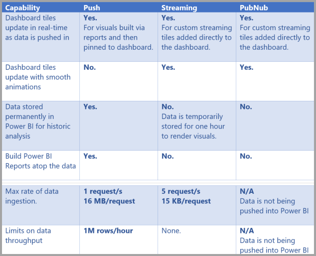

> [!NOTE]
> ดู [บทความนี้](../developer/automation/api-rest-api-limitations.md) สำหรับข้อมูลขีดจำกัดของ **พุช** ว่าสามารถผลักข้อมูลได้มากเท่าใดSee [this article](../developer/automation/api-rest-api-limitations.md) for information on **Push** limits on how much data can be pushed in.

## การพุชข้อมูลไปยังชุดข้อมูลPushing data to datasets
ส่วนก่อนหน้านี้ อธิบายชุดข้อมูลในเวลาจริงสามชนิดหลัก ที่คุณสามารถใช้ในการสตรีมในเวลาจริง และความแตกต่างกันของแต่ละชนิดThe previous section described the three primary types of real-time datasets you can use in real-time streaming, and how they differ. ในส่วนนี้ จะอธิบายวิธีการสร้างและพุชข้อมูลลงในชุดข้อมูลเหล่านั้นThis section describes how to create and push data into those datasets.

คุณสามารถพุชข้อมูลลงในชุดข้อมูลได้สามวิธีหลัก ๆ ได้แก่:There are three primary ways you can push data into a dataset:

* การใช้ Power BI REST APIUsing the Power BI REST APIs
* การใช้ส่วนติดต่อผู้ใช้ ชุดข้อมูลสตรีมมิ่งUsing the Streaming Dataset UI
* การใช้ Azure Stream AnalyticsUsing Azure Stream Analytics

เรามาดูวิธีเหล่านั้นทีละวิธีLet's take a look at each of those approaches in turn.

### การใช้ Power BI REST API เพื่อพุชข้อมูลUsing Power BI REST APIs to push data
**Power BI REST API** สามารถใช้สร้างและส่งข้อมูลไปยังชุดข้อมูลการ **พุช** และชุดข้อมูลการ **สตรีม** ได้**Power BI REST APIs** can be used to create and send data to **push** datasets and to **streaming** datasets. เมื่อคุณสร้างชุดข้อมูลด้วย Power BI REST API ค่าสถานะ *defaultMode* ระบุว่าเป็นชุดข้อมูลการพุช หรือการสตรีมWhen you create a dataset using Power BI REST APIs, the *defaultMode* flag specifies whether the dataset is push or streaming. ถ้าไม่มีมีค่าสถานะ *defaultMode* ค่าเริ่มต้นของชุดข้อมูลเป็นชุดข้อมูลการ **พุช**If no *defaultMode* flag is set, the dataset defaults to a **push** dataset.

ถ้า *defaultMode* ตั้งค่าเป็น *pushStreaming* ชุดข้อมูลจะเป็นทั้งการ **พุช** *และการ* **สตรีม** ทำให้ได้ประโยชน์ของทั้งสองชนิดIf the *defaultMode* value is set to *pushStreaming*, the dataset is both a **push** *and* **streaming** dataset, providing the benefits of both dataset types. 

> [!NOTE]
> เมื่อใช้ชุดข้อมูลที่มีค่าสถานะ *defaultMode* เป็น *pushStreaming* ถ้าคำขอมีขนาดเกินขีดจำกัด 15Kb สำหรับชุดข้อมูลการ **สตรีม** แต่จะน้อยกว่าขีดจำกัด 16MB ของชุดข้อมูลการ **พุช** คำขอจะประสบผลสำเร็จ และข้อมูลจะถูกปรับปรุงในชุดข้อมูลการพุชWhen using datasets with the *defaultMode* flag set to *pushStreaming*, if a request exceeds the 15Kb size restriction for a **streaming** dataset, but is less than the 16MB size restriction of a **push** dataset, the request will succeed and the data will be updated in the push dataset. อย่างไรก็ตาม ไทล์การสตรีมใด ๆ จะล้มเหลวชั่วคราวHowever, any streaming tiles will temporarily fail.

เมื่อสร้างชุดข้อมูลแล้ว ใช้ REST API เพื่อผลักข้อมูลโดยใช้ [**PostRows** API](/rest/api/power-bi/pushdatasets/datasets_postrows)Once a dataset is created, use the REST APIs to push data using the [**PostRows** API](/rest/api/power-bi/pushdatasets/datasets_postrows).

คำร้องขอทั้งหมดที่ไปยัง REST API ถูกรักษาความปลอดภัยด้วย **Azure AD OAuth**All requests to REST APIs are secured using **Azure AD OAuth**.

### การใช้ส่วนติดต่อผู้ใช้ ชุดข้อมูลการสตรีม เพื่อพุชข้อมูลUsing the Streaming Dataset UI to push data
ในบริการของ Power BI คุณสามารถสร้างชุดข้อมูล โดยการเลือก **API** ดังแสดงในรูปต่อไปนี้In the Power BI service, you can create a dataset by selecting the **API** approach as shown in the following image.

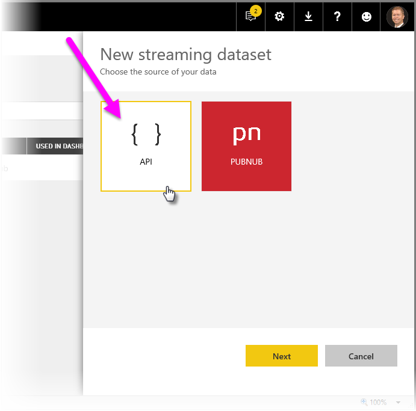

เมื่อสร้างชุดข้อมูลการสตรีมใหม่ คุณสามารถเลือกเปิดใช้งาน **การวิเคราะห์ข้อมูลในอดีต** ตามที่แสดงด้านล่าง ซึ่งมีผลที่สำคัญWhen creating the new streaming dataset, you can select to enable **Historic data analysis** as shown below, which has a significant impact.

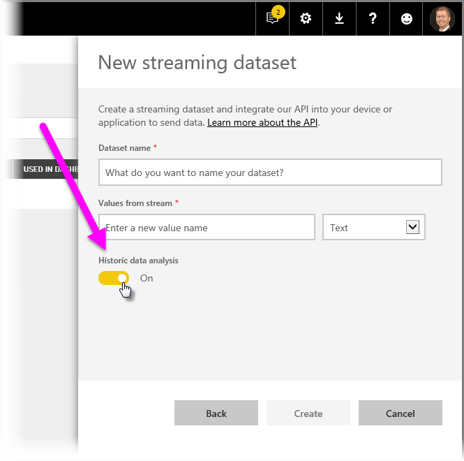

เมื่อ **การวิเคราะห์ข้อมูลในอดีต** ถูกปิดใช้งานซึ่งเป็นค่าเริ่มต้น คุณสามารถสร้าง **ชุดข้อมูลการสตรีม** ตามที่อธิบายไว้ก่อนหน้าในบทความนี้When **Historic data analysis** is disabled, and it is by default, you create a **streaming dataset** as described earlier in this article. เมื่อ **การวิเคราะห์ข้อมูลในอดีต** ถูก *เปิดใช้งาน* ชุดข้อมูลที่สร้างขึ้นเป็นทั้ง **ชุดข้อมูลการสตรีม** และ **ชุดข้อมูลการพุช**When **Historic data analysis** is *enabled*, the dataset created becomes both a **streaming dataset** and a **push dataset**. นี่คือเทียบเท่ากับการใช้ Power BI REST API สร้างชุดข้อมูลที่มีค่าของ *defaultMode* เป็น *pushStreaming* ตามที่อธิบายไว้ก่อนหน้าในบทความนี้This is equivalent to using the Power BI REST APIs to create a dataset with its *defaultMode* set to *pushStreaming*, as described earlier in this article.

> [!NOTE]
> สำหรับชุดข้อมูลการสตรีม ที่สร้างขึ้นด้วยส่วนติดต่อผู้ใช้ในบริการของ Power BI UI ตามที่อธิบายไว้ในย่อหน้าที่แล้ว การรับรองความถูกต้องของ Azure AD เป็นเรื่องไม่จำเป็นFor streaming datasets created using the Power BI service UI, as described in the previous paragraph, Azure AD authentication is not required. ในชุดข้อมูลดังกล่าว เจ้าของชุดข้อมูลจะได้รับ URL ที่มี rowkey ซึ่งอนุญาตให้ผู้ร้องขอ พุชข้อมูลลงในชุดข้อมูลโดยไม่ต้องมีโทเค็น Azure AD OAuth ของแบเรอร์In such datasets, the dataset owner receives a URL with a rowkey, which authorizes the requestor to push data into the dataset with out using an Azure AD OAuth bearer token. อย่างไรก็ตามโปรดทราบว่าวิธี Azure AD (AAD) ยังคงใช้งานเพื่อพุชข้อมูลลงในชุดข้อมูลได้Take note, however, that the Azure AD (AAD) approach still works to push data into the dataset.
> 
> 

### การใช้ Azure Stream Analytics เพื่อพุชข้อมูลUsing Azure Stream Analytics to push data
คุณสามารถเพิ่ม Power BI เป็นเอาท์พุทภายใน **Azure Stream Analytics** (ASA) จากนั้น แสดงผลสตรีมข้อมูลเหล่านั้นในบริการของ Power BI ในเวลาจริงได้You can add Power BI as an output within **Azure Stream Analytics** (ASA), and then visualize those data streams in the Power BI service in real time. ส่วนนี้อธิบายจะรายละเอียดทางเทคนิคเกี่ยวกับวิธีดำเนินการนั้นThis section describes technical details about how that process occurs.

Azure Stream Analytics ใช้ Power BI REST Api ในการสร้างสตรีมข้อมูลของผลลัพธ์ไปยัง Power BI เมื่อ *defaultMode* ตั้งค่าเป็น *pushStreaming* ซึ่งทำให้ชุดข้อมูลสามารถใช้ประโยชน์จากทั้งการ **พุช** และการ **สตรีม**Azure Stream Analytics uses the Power BI REST APIs to create its output data stream to Power BI, with *defaultMode* set to *pushStreaming*, resulting in a dataset that can take advantage of both **push** and **streaming**. เมื่อมีการสร้างชุดข้อมูล Azure Stream Analytics จะตั้งค่าสถานะ **retentionPolicy** เป็น *basicFIFO*When the dataset is created, Azure Stream Analytics sets the **retentionPolicy** flag to *basicFIFO*. ด้วยการตั้งค่าดังกล่าว ฐานข้อมูลที่สนับสนุนชุดข้อมูลแบบพุชจะจัดเก็บแถว 200,000 แถวและแถวใดจะถูกวางในแบบเข้าก่อนออกก่อน (FIFO)With that setting, the database supporting its push dataset stores 200,000 rows, and which rows are dropped in a first-in first-out (FIFO) fashion.

> [!CAUTION]
> ถ้าคิวรี Azure Stream Analytics ของคุณ ให้มีผลลัพธ์ที่ถี่มากไปยัง Power BI (เช่น หนึ่งหรือสองครั้งต่อวินาที) Azure Stream Analytics จะเริ่มรวมผลลัพธ์เหล่านั้นลงในคำร้องขอเดียวIf your Azure Stream Analytics query results in very rapid output to Power BI (for example, once or twice per second), Azure Stream Analytics will begin batching those outputs into a single request. ซึ่งอาจทำให้ขนาดของคำขอ เกินขีดจำกัดของไทล์การสตรีมThis may cause the request size to exceed the streaming tile limit. ตามที่ได้กล่าวถึงในส่วนก่อนหน้า ในกรณีนี้ ไทล์การสตรีมจะไม่แสดงผลIn that case, as mentioned in previous sections, streaming tiles will fail to render. แนวทางปฏิบัติที่ดีที่สุดคือ การลดอัตราการส่งผลลัพธ์ข้อมูลไปยัง Power BI เช่น แทนที่จะส่งค่าทุก ๆ วินาที ตั้งค่าเป็นสูงสุดหนึ่งค่าทุก ๆ 10 วินาทีIn such cases, the best practice is to slow the rate of data output to Power BI; for example, instead of a maximum value every second, set it to a maximum over 10 seconds.
> 
> 

## ตั้งค่าชุดข้อมูลการสตรีมในเวลาจริง ใน Power BISet up your real-time streaming dataset in Power BI
ตอนนี้เราได้ครอบคลุมเนื้อหาชุดข้อมูลสตรีมในเวลาจริงสามชนิดหลัก และอีกสามวิธีหลักที่คุณสามารถพุชลงในชุดข้อมูล เรามาทำให้ชุดข้อมูลการสตรีมในเวลาจริงของคุณ ทำงานใน Power BINow that we've covered the three primary types of datasets for real-time streaming, and the three primary ways you can push data into a dataset, let's get your real-time streaming dataset working in Power BI.

เพื่อเริ่มต้นใช้งานสตรีมในเวลาจริง คุณจำเป็นต้องเลือกหนึ่งในสองวิธีที่จะใช้ข้อมูลการสตรีมใน Power BI:To get started with real-time streaming, you need to choose one of the two ways that streaming data can be consumed in Power BI:

* **ไทล์** ด้วยวิชวลจากข้อมูลการสตรีม**tiles** with visuals from streaming data
* **ชุดข้อมูล** สร้างขึ้นจากข้อมูลการสตรีมที่บันทึกใน Power BI**datasets** created from streaming data that persist in Power BI

ไม่ว่าคุณจะเลือกวิธีใด คุณต้องตั้งค่า **ข้อมูลการสตรีม** ใน Power BI ไว้ก่อนแล้วWith either option, you'll need to set up **Streaming data** in Power BI. เพื่อการตั้งค่านี้ ในแดชบอร์ดของคุณ (แดชบอร์ดเดิมที่มีอยู่ หรือแดชบอร์ดใหม่) เลือก **เพิ่มไทล์** แล้วเลือก **ข้อมูลการสตรีมแบบกำหนดเอง**To do this, in your dashboard (either an existing dashboard, or a new one) select **Add a tile** and then select **Custom streaming data**.

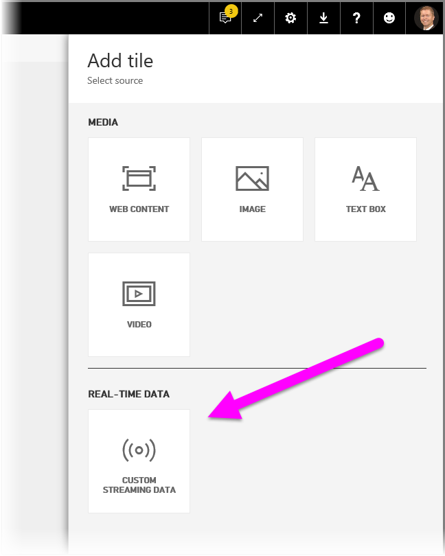

ถ้าคุณยังไม่มีการตั้งค่าข้อมูลการสตรีม ไม่ต้องกังวล - คุณสามารถเลือก **จัดการข้อมูล** เพื่อเริ่มต้นIf you don't have streaming data set up yet, don't worry - you can select **manage data** to get started.

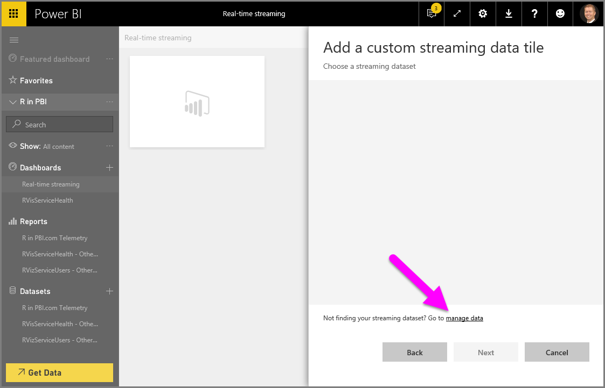

บนหน้านี้ คุณสามารถป้อนค่าจุดสิ้นสุดของข้อมูลการสตรีมของคุณ ถ้าคุณได้สร้างไว้ก่อนแล้ว (ลงในกล่องข้อความ)On this page, you can input the endpoint of your streaming dataset if you already have one created (into the text box). ถ้าคุณยังไม่มีชุดข้อมูลการสตรีม เลือกไอคอนเครื่องหมายบวก ( **+** ) ที่มุมบนขวา เพื่อดูตัวเลือกที่มีสำหรับสร้างชุดข้อมูลการสตรีมIf you don't have a streaming dataset yet, select the plus icon ( **+** ) in the upper right corner to see the available options to create a streaming dataset.

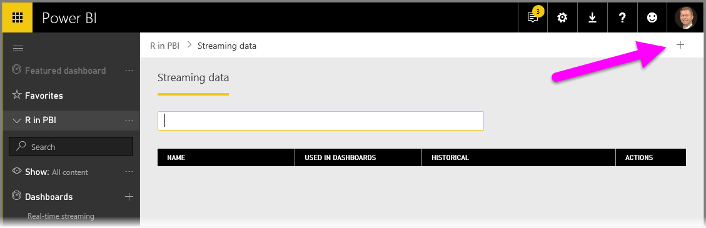

เมื่อคุณคลิกบนไอคอน **+** คุณเห็นตัวเลือกสองตัว:When you click on the **+** icon, you see two options:

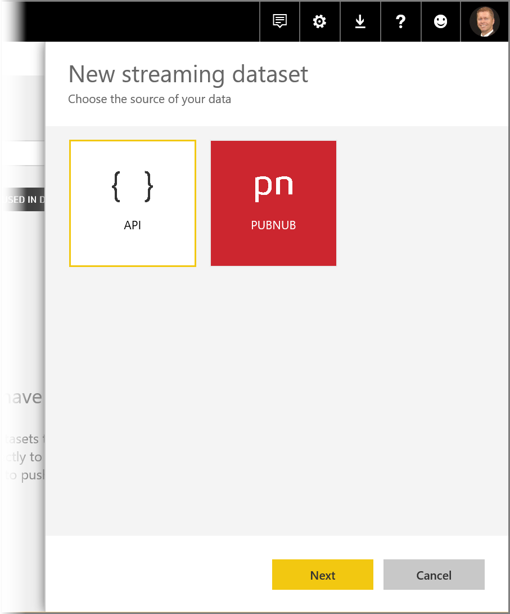

ในส่วนถัดไปจะอธิบายเกี่ยวกับตัวเลือกเหล่านี้ และการเข้าไปในรายละเอียดเพิ่มเติมเกี่ยวกับ วิธีการสร้าง **ไทล์** การสตรีม หรือวิธีการสร้างการ **ชุดข้อมูล** จากแหล่งข้อมูลการสตรีม ซึ่งคุณสามารถใช้ในภายหลังเพื่อสร้างรายงานThe next section describes these options, and goes into more detail about how to create a streaming **tile** or how to create a **dataset** from the streaming data source, which you can then use later to build reports.

## สร้างข้อมูลการสตรีมของคุณ ด้วยตัวเลือกที่คุณชอบที่สุดCreate your streaming dataset with the option you like best
การสร้างสตรีมข้อมูลในเวลาจริง ที่สามารถใช้และดูได้จาก Power BI มีอยู่ด้วยกันสองวิธี:There are two ways to create a real-time streaming data feed that can be consumed and visualized by Power BI:

* **Power BI REST API** โดยใช้จุดสิ้นสุดการสตรีมในเวลาจริง**Power BI REST API** using a real-time streaming endpoint
* **PubNub****PubNub**

ส่วนถัดไปจะดูทีละตัวเลือกThe next sections look at each option in turn.

### การใช้ POWER BI REST APIUsing the POWER BI REST API
**Power BI REST API** - การปรับปรุงล่าสุดของ Power BI REST API ออกแบบให้การสตรีมในเวลาจริงทำได้ง่ายขึ้นสำหรับนักพัฒนา**Power BI REST API** - Recent improvements to the Power BI REST API are designed to make real-time streaming easier for developers. เมื่อคุณเลือก **API** จากหน้าต่าง **สร้างชุดข้อมูลการสตรีมใหม่** คุณจะเห็นรายการการตั้งค่าเพื่อให้ Power BI เชื่อมต่อ และใช้จุดสิ้นสุดของคุณ:When you select **API** from the **New streaming dataset** window, you're presented with entries to provide that enable Power BI to connect to and use your endpoint:

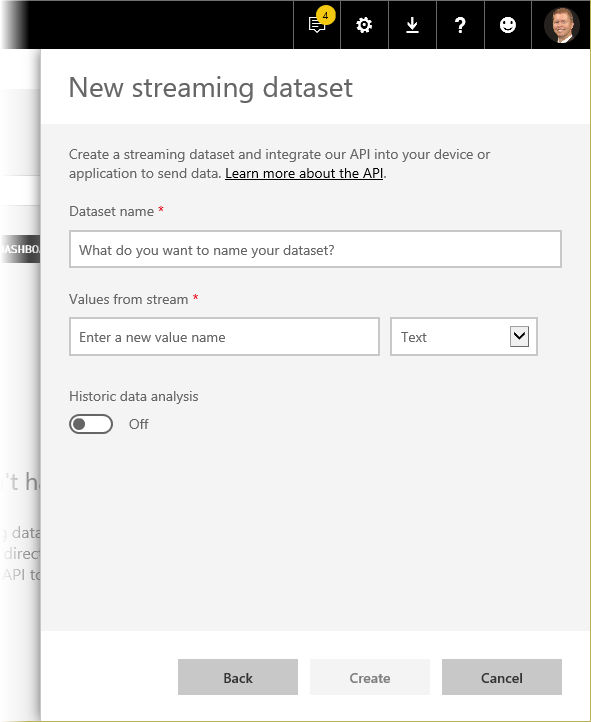

ถ้าคุณต้องการให้ Power BI จัดเก็บข้อมูลที่ส่งผ่านสตรีมข้อมูลนี้ เปิดใช้งาน *การวิเคราะห์ข้อมูลในอดีต* แล้วคุณจะสามารถสร้างรายงานและวิเคราะห์ข้อมูลที่รวบรวมจากสตรีมIf you want Power BI to store the data that's sent through this data stream, enable *Historic data analysis* and you'll be able to do reporting and analysis on the collected data stream. คุณยังสามารถ[เรียนรู้เพิ่มเติมเกี่ยวกับ API](/rest/api/power-bi/) ได้You can also [learn more about the API](/rest/api/power-bi/).

เมื่อคุณสร้างสตรีมของข้อมูลคุณเรียบร้อยแล้ว คุณจะได้จุดสิ้นสุด REST API URL ซึ่งแอปพลิเคชันของคุณสามารถใช้การร้องขอ *POST* เพื่อผลักข้อมูลของคุณไปยัง Power BI ชุดข้อมูล **การสตรีมข้อมูล** ที่คุณสร้างไว้Once you successfully create your data stream, you're provided with a REST API URL endpoint, which your application can call using *POST* requests to push your data to Power BI **streaming data** dataset you created.

เมื่อทำการร้องขอ *POST* คุณควรตรวจสอบว่า เนื้อหาของคำขอตรงกับตัวอย่าง JSON ที่ให้มาโดยส่วนติดต่อผู้ใช้ Power BIWhen making *POST* requests, you should ensure the request body matches the sample JSON provided by the Power BI user interface. ตัวอย่างเช่น ใส่วัตถุ JSON ของคุณไว้ในอาร์เรย์For example, wrap your JSON objects in an array.

> [!WARNING]
> สำหรับการสตรีมชุดข้อมูลที่สร้างโดยใช้ UI ของบริการ Power BI เจ้าของชุดข้อมูลจะได้รับ URL ซึ่งมี **คีย์ทรัพยากร**For streaming datasets created using the Power BI service UI, the dataset owner receives a URL which includes a **resource key**. คีย์นี้อนุญาตให้ผู้ร้องขอพุชข้อมูลลงในชุดข้อมูลโดยไม่ต้องใช้โทเค็นผู้ถือ Azure AD OAuth ดังนั้นโปรดคำนึงถึงผลกระทบของการมี **คีย์ลับ** ใน URL เมื่อทำงานกับชุดข้อมูลและวิธีการประเภทนี้This key authorizes the requestor to push data into the dataset without using an Azure AD OAuth bearer token, so please keep in mind the implications of having a **secret key** in the URL when working with this type of dataset and method.

### การใช้ PubNubUsing PubNub
ด้วยการรวมเอาการสตรีม **PubNub** มาไว้ใน Power BI คุณสามารถใช้สตรีมของข้อมูล **PubNub** (หรือสร้างสตรีมใหม่) ที่มีเวลาแฝงต่ำ และใช้งานใน Power BI ได้With the integration of **PubNub** streaming with Power BI, you can use your low-latency **PubNub** data streams (or create new ones) and use them in Power BI. เมื่อคุณเลือก **PubNub** แล้วเลือก **ถัดไป** คุณจะเห็นหน้าต่างต่อไปนี้:When you select **PubNub** and then select **Next**, you see the following window:

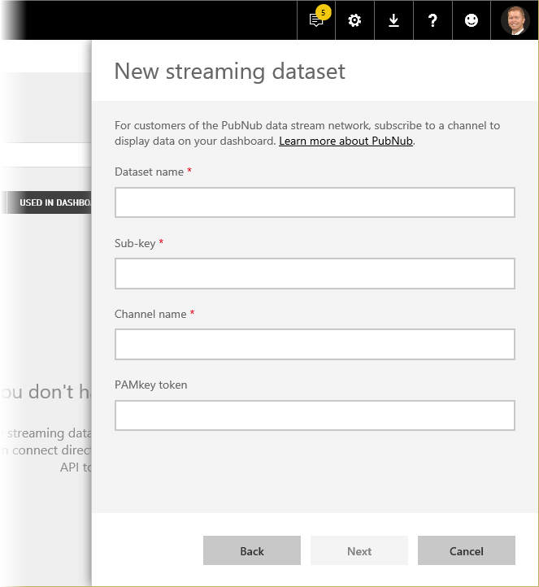

> [!WARNING]
> แชนเนล PubNub สามารถทำให้ปลอดภัย ด้วยคีย์การรับรองความถูกต้อง PubNub Access Manager (PAM)PubNub channels can be secured by using a PubNub Access Manager (PAM) authentication key. คีย์นี้จะแชร์กับผู้ใช้ทั้งหมดที่มีสิทธิ์เข้าถึงแดชบอร์ดThis key will be shared with all users who have access to the dashboard. คุณสามารถ[เรียนรู้เพิ่มเติมเกี่ยวกับการควบคุมการเข้าถึง PubNub](https://www.pubnub.com/docs/web-javascript/pam-security) ได้You can [learn more about PubNub access control](https://www.pubnub.com/docs/web-javascript/pam-security).
> 
> 

สตรีมข้อมูล **PubNub** มักมีปริมาณมาก และมักไม่เหมาะสมที่จะจัดเก็บและวิเคราะห์อดีต ด้วยข้อมูลต้นฉบับ**PubNub** data streams are often high volume, and are not always suitable in their original form for storage and historical analysis. เพื่อใช้ Power BI สำหรับการวิเคราะห์ในอดีต ด้วยข้อมูล PubNub คุณจะต้องรวมสตรีม PubNub ดิบ แล้วส่งไปยัง Power BITo use Power BI for historical analysis of PubNub data, you'll have to aggregate the raw PubNub stream and send it to Power BI. วิธีหนึ่งในการดำเนินดังกล่าวคือ [Azure Stream Analytics](https://azure.microsoft.com/services/stream-analytics/)One way to do that is with [Azure Stream Analytics](https://azure.microsoft.com/services/stream-analytics/).

## ตัวอย่างการใช้การสตรีมในเวลาจริงใน Power BIExample of using real time streaming in Power BI
นี่คือตัวอย่างเร็ว ๆ ที่แสดงให้เห็นว่าการสตรีมในเวลาจริงใน Power BI ทำงานอย่างไรHere's a quick example of how real time streaming in Power BI works. คุณสามารถทำตามตัวอย่างนี้ เพื่อเห็นคุณค่าของการสตรีมในเวลาจริงด้วยตัวคุณเองYou can follow along with this sample to see for yourself the value of real time streaming.

ในตัวอย่างนี้ เราจะใช้สตรีมสาธารณชนจาก **PubNub**In this sample, we use a publicly available stream from **PubNub**. ต่อไปนี้คือขั้นตอน:Here are the steps:

1. ใน **บริการของ Power BI** เลือกแดชบอร์ด (หรือสร้างขึ้นใหม่) และเลือก **เพิ่มไทล์** > **ข้อมูลการสตรีมแบบกำหนดเอง** แล้วเลือกปุ่ม **ถัดไป**In the **Power BI service**, select a dashboard (or create a new one) and select **Add tile** > **Custom Streaming Data** and then select the **Next** button.
   
   
2. ถ้าคุณยังไม่มีแหล่งข้อมูลการสตรีมได้ เลือกลิงก์ **จัดการข้อมูล** (เหนือปุ่ม **ถัดไป**) จากนั้นเลือก **+ เพิ่มข้อมูลการสตรีม** จากลิงก์ในมุมบนขวาของหน้าต่างIf you don't have and streaming data sources yet, select the **manage data** link (just above the **Next** button), then select **+ Add streaming data** from the link in the upper right of the window. เลือก **PubNub** แล้วเลือก **ถัดไป**Select **PubNub** and then select **Next**.
3. ใส่ชื่อสำหรับชุดข้อมูลของคุณ จากนั้นวางค่าต่อไปนี้ลงในหน้าต่างที่ปรากฏขึ้น แล้วเลือก **ถัดไป**:Create a name for your dataset, then paste in the following values into the window that appears, then select **Next**:
   
   **คีย์สมัครใช้งาน:** *sub-c-5f1b7c8e-fbee-11e3-aa40-02ee2ddab7fe***Subscribe key:** *sub-c-5f1b7c8e-fbee-11e3-aa40-02ee2ddab7fe*

   **แชนแนล:** *pubnub-sensor-network***Channel:** *pubnub-sensor-network*
   
   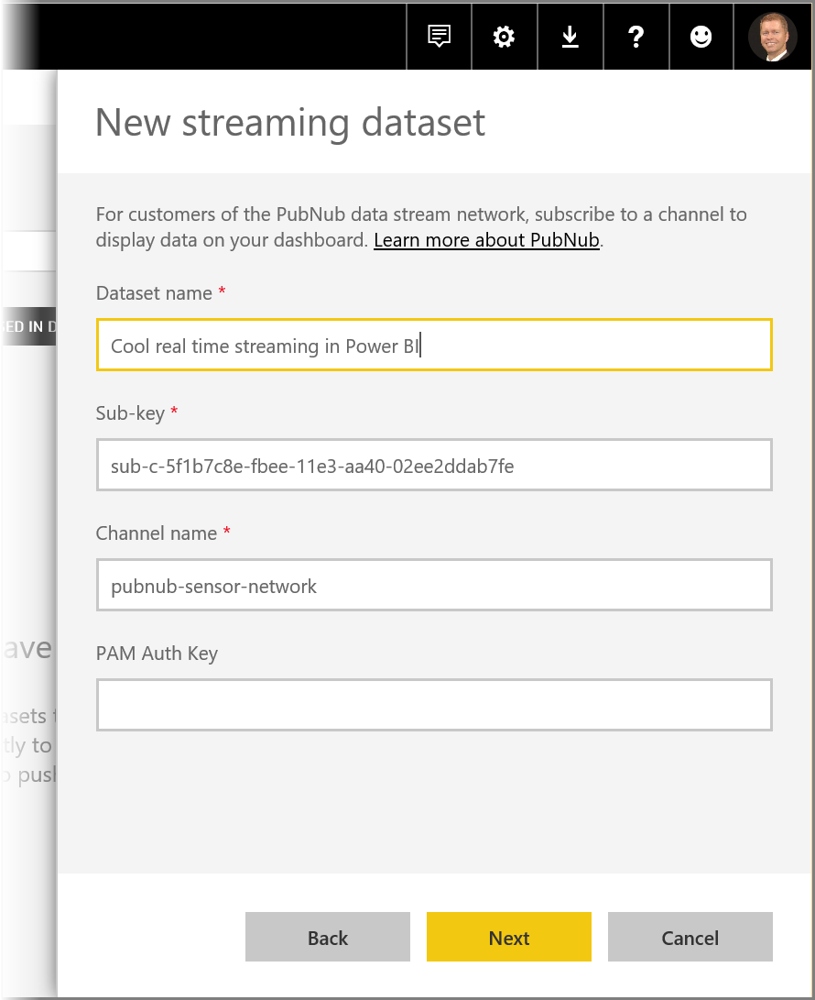
4. ในหน้าต่างต่อไปนี้ เพียงเลือกค่าเริ่มต้น (ซึ่งมีข้อมูลให้โดยอัตโนมัติ) แล้วเลือก **สร้าง**In the following window, just select the defaults (which are automatically populated), then select **Create**.
   
   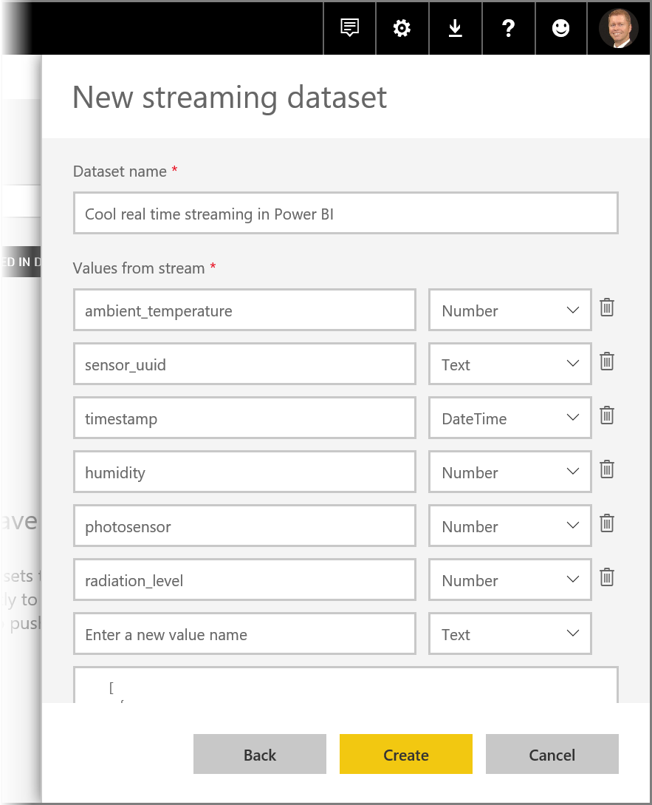
5. กลับไปในพื้นที่ทำงานของ Power BI สร้างแดชบอร์ดใหม่ จากนั้นเพิ่มไทล์ (ดูด้านบนสำหรับขั้นตอน ถ้าคุณต้องการ)Back in your Power BI workspace, create a new dashboard and then add a tile (see above for steps, if you need them). คราวนี้ เมื่อคุณสร้างไทล์และเลือก **ข้อมูลการสตรีมแบบกำหนดเอง** คุณมีชุดข้อมูลการสตรีมที่ทำงานด้วยแล้วThis time when you create a tile and select **Custom Streaming Data**, you have a streaming data set to work with. ลองทำและเล่นกับมันดูGo ahead and play around with it. เพิ่มเขตข้อมูล *ตัวเลข* ลงในแผนภูมิเส้น จากนั้นเพิ่มไทล์อื่น ๆ คุณสามารถแดชบอร์ดเวลาจริงที่ดูเหมือนต่อไปนี้ได้:Adding the *number* fields to line charts, and then adding other tiles, you can get a real time dashboard that looks like the following:
   
   

ลองทำดู และเล่นกับชุดข้อมูลตัวอย่างGive it a try, and play around with the sample dataset. จากนั้น ไปสร้างชุดข้อมูลของคุณเอง และสตรีมข้อมูลสดไปยัง Power BIThen go create your own datasets, and stream live data to Power BI.

## คำถามและคำตอบQuestions and answers
ต่อไปนี้เป็นคำถามทั่วไปเกี่ยวกับการสตรีมในเวลาจริงใน Power BI และคำตอบHere are some common questions about real-time streaming in Power BI, and answers.

#### ฉันสามารถใช้ตัวกรองบนชุดข้อมูลการพุชได้หรือไม่?Can I use filters on push dataset? แล้วทำได้กับชุดข้อมูลการสตรีมหรือไม่?How about streaming dataset?
โชคร้ายที่ ชุดข้อมูลการสตรีมไม่สนับสนุนการกรองUnfortunately, streaming datasets do not support filtering. สำหรับชุดข้อมูลการพุช คุณสามารถสร้างรายงาน กรองรายงาน แล้วปักหมุดวิชวลที่ถูกกรองไปยังแดชบอร์ดได้For push datasets, you can create a report, filter the report, and then pin the filtered visuals to a dashboard. อย่างไรก็ตาม ไม่มีวิธีแก้ไขตัวกรองบนวิชวลหลังจากอยู่บนแดชบอร์ดแล้วHowever, there is no way to change the filter on the visual once it's on the dashboard.

อีกทางหนึ่ง คุณสามารถปักหมุดไทล์รายงานสดไปยังแดชบอร์ด ในกรณีนี้ คุณสามารถแก้ไขตัวกรองSeparately, you can pin the live report tile to the dashboard, in which case you can change the filters. อย่างไรก็ตาม ไทล์รายงานสดจะไม่ปรับปรุงในเวลาจริง เมื่อมีข้อมูลใหม่ผลักเข้ามา – คุณจะต้องอัปเดตวิชวลด้วยตนเอง โดยใช้ตัวเลือก *รีเฟรชแดชบอร์ด* ในเมนู **เพิ่มเติม**However, live report tiles will not update in real-time as data is pushed in – you'll have to manually update the visual by using the *refresh dashboard tiles* option in the **More** menu.

เมื่อใช้ตัวกรองเพื่อพุชชุดข้อมูลที่มีเขตข้อมูล *วันที่และเวลา* ที่มีความแม่นยำระดับมิลลิวินาที ตัวดำเนินการ *เทียบเท่า* จะไม่ได้รับการสนับสนุนWhen applying filters to push datasets with *DateTime* fields with millisecond precision, *equivalence* operators are not supported. อย่างไรก็ตาม ตัวดำเนินการเช่นมากกว่า (>) หรือน้อยกว่า (<) ทำงานอย่างถูกต้องHowever, operators such as greater than (>) or less than (<) do operate properly.

#### ฉันสามารถดูค่าล่าสุดในชุดข้อมูลที่พุชได้อย่างไร?How do I see the latest value on a push dataset? แล้วทำได้กับชุดข้อมูลการสตรีมหรือไม่?How about streaming dataset?
ชุดข้อมูลการสตรีมถูกออกแบบมาสำหรับแสดงข้อมูลล่าสุดStreaming datasets are designed for displaying the latest data. คุณสามารถใช้ **การ์ด** วิชวลการสตรีม เพื่อดูค่าล่าสุดได้อย่างง่ายดายYou can use the **Card** streaming visual to easily see latest numeric values. ขออภัยที่ การ์ดไม่สนับสนุนข้อมูลชนิด *วันที่และเวลา* หรือ *ข้อความ*Unfortunately, the card does not support data of type *DateTime* or *Text*.

สำหรับชุดข้อมูลแบบพุช เมื่อคุณมีการประทับเวลาใน schema คุณสามารถลองสร้างวิชวลรายงานด้วยตัวกรอง N ล่าสุดFor push datasets, when you have a timestamp in the schema you can try creating a report visual with the last N filter.

#### ฉันสามารถเชื่อมต่อเพื่อพุชหรือสตรีมชุดข้อมูลใน Power BI Desktop หรือไม่?Can I connect to push or streaming datasets in Power BI Desktop?
ชุดข้อมูลแบบพุลและแบบไฮบริดสามารถเชื่อมต่อใน Power BI Desktop ได้Push and hybrid datasets can be live connected in Power BI Desktop. ชุดข้อมูลการสตรีมอื่นๆ ไม่สามารถเชื่อมต่อใน Power BI Desktop ได้Other streaming datasets cannot be connected in Power BI Desktop.

#### จากคำถามก่อนหน้า ฉันสามารถสร้างรูปแบบใด ๆ บนชุดข้อมูลในเวลาจริงได้อย่างไร?Given the previous question, how can I do any modeling on real-time datasets?
การสร้างรูปแบบทำไม่ได้ในชุดข้อมูลการสตรีม เนื่องจากข้อมูลไม่ได้ถูกเก็บถาวรModeling is not possible on a streaming dataset, since the data is not stored permanently. สำหรับชุดข้อมูลแบบพุช คุณสามารถใช้การสร้างชุดข้อมูล REST API เพื่อสร้างชุดข้อมูลที่มีความสัมพันธ์และหน่วยวัดและ/หรือใช้ REST Api ของตารางอัปเดตเพื่อเพิ่มหน่วยวัดไปยังตารางที่มีอยู่For a push dataset, you can use create dataset REST API to create a dataset with relationship and measures and/or use the update table REST APIs to add measures to an existing table. 

#### ฉันจะล้างค่าทั้งหมดในชุดข้อมูลการพุชได้อย่างไร?How can I clear all the values on a push dataset? แล้วทำได้กับชุดข้อมูลการสตรีมหรือไม่?How about streaming dataset?
บนชุดข้อมูลการพุช คุณสามารถลบแถวโดยการเรียก REST APIOn a push dataset, you can use the delete rows REST API call. ขณะนี้ยังไม่มีวิธีล้างข้อมูลจากชุดข้อมูลการสตรีม แม้ว่าข้อมูลจะล้างตัวเองหลังจากผ่านไปหนึ่งชั่วโมงThere is currently no way to clear data from a streaming dataset, though the data will clear itself after an hour.

#### ฉันตั้งค่าเอาท์พุทจาก Azure Stream Analytics ไปยัง Power BI แต่ฉันไม่เห็นใน Power BI – มีอะไรผิดพลาด?I set up an Azure Stream Analytics output to Power BI, but I don't see it appearing in Power BI – what's wrong?
นี่คือรายการตรวจสอบที่คุณสามารถใช้เพื่อแก้ไขปัญหา:Here's a checklist you can use to troubleshoot the issue:

1. รีสตาร์ตงาน Azure Stream Analytics (งานที่สร้างขึ้นก่อนการเผยแพร่ทั่วไปสำหรับการสตรีม จำเป็นต้องรีสตาร์ต)Restart the Azure Stream Analytics job (jobs created before the streaming GA release will require a restart)
2. ลองอนุมัติการเชื่อมต่อ Power BI ใน Azure Stream Analytics อีกครั้งTry reauthorizing your Power BI connection in Azure Stream Analytics
3. พื้นที่ทำงานไหนที่คุณระบุในเอาท์พุทของ Azure Stream AnalyticsWhich workspace did you specify in the Azure Stream Analytics output? ในบริการของ Power BI คุณได้ตรวจสอบว่าเป็นพื้นที่ทำงานนั้น (เดียวกัน) หรือไม่?In the Power BI service, are you checking in that (same) workspace?
4. คิวรี Azure Stream Analytics ระบุไว้ชัดเจนว่าส่งผลลัพธ์ไปยัง Power BI หรือไม่?Does the Azure Stream Analytics query explicitly output to the Power BI output? (โดยใช้คำสำคัญ INTO)(using the INTO keyword)
5. งาน Azure Stream Analytics มีข้อมูลไหลผ่านหรือไม่?Does the Azure Stream Analytics job have data flowing through it? ชุดข้อมูลจะถูกสร้างขึ้นเมื่อมีการส่งข้อมูลเท่านั้นThe dataset is only created when data is being transmitted.
6. คุณสามารถดูบันทึกของ Azure Stream Analytics ว่ามีคำเตือนหรือข้อผิดพลาดใด ๆ หรือไม่?Can you look into the Azure Stream Analytics logs to see if there are any warnings or errors?

## การรีเฟรชเพจอัตโนมัติAutomatic page refresh

การรีเฟรชหน้าอัตโนมัติทำงานอยู่ในระดับหน้ารายงานและอนุญาตให้คุณตั้งค่าช่วงเวลาการรีเฟรชสำหรับวิชวลในหน้าซึ่งจะใช้งานได้เฉพาะเมื่อมีการใช้งานเพจAutomatic page refresh works at a report page level, and allows you to set a refresh interval for visuals that's only active when the page is being consumed. การรีเฟรชหน้าอัตโนมัติสามารถใช้ได้เฉพาะแหล่งข้อมูล DirectQuery เท่านั้นAutomatic page refresh is only available for DirectQuery data sources. ช่วงการรีเฟรชต่ำสุดขึ้นอยู่กับชนิดของพื้นที่ทำงานที่มีการเผยแพร่รายงานและการตั้งค่าผู้ดูแลระบบความจุสำหรับพื้นที่ทำงานแบบพรีเมียมThe minimum refresh interval depends on which type of workspace where the report is published, and capacity admin settings for Premium workspaces.

เรียนรู้เพิ่มเติมเกี่ยวกับการรีเฟรชหน้าอัตโนมัติในบทความ [การรีเฟรชเพจอัตโนมัติ ](../create-reports/desktop-automatic-page-refresh.md)Learn more about automatic page refresh in the [automatic page refresh](../create-reports/desktop-automatic-page-refresh.md) article.

## ขั้นตอนถัดไปNext steps
นี่คือบางลิงก์อาจเป็นประโยชน์กับคุณ เมื่อทำงานกับการสตรีมในเวลาจริงใน Power BI:Here are a few links you might find useful when working with real-time streaming in Power BI:

* [ภาพรวมของ Power BI REST API กับข้อมูลในเวลาจริงOverview of the Power BI REST API with real-time data](/rest/api/power-bi/)
* [Azure Stream AnalyticsAzure Stream Analytics](https://azure.microsoft.com/services/stream-analytics/)
