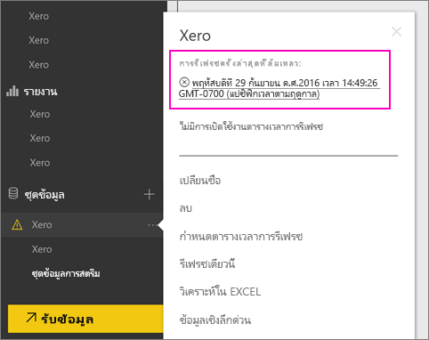
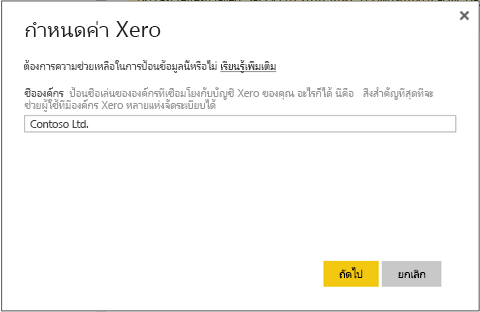
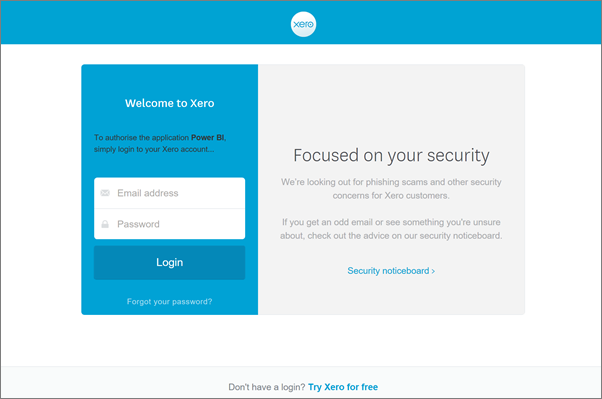

# วิธีรีเฟรชข้อมูลประจำตัวของชุดเนื้อหา Xero ถ้าการรีเฟรชล้มเหลวHow to refresh your Xero content pack credentials if refresh failed
ถ้าคุณใช้ชุดเนื้อหา Xero Power BI คุณอาจพบปัญหาบางอย่าง กับการรีเฟรชชุดเนื้อหาประจำวัน เนื่องจากปัญหาบริการของ Power BI เมื่อไม่นานมานี้If you use the Xero Power BI content pack, you may have experienced some problems with the content pack’s daily refresh due to a recent Power BI service incident.

คุณสามารถดูว่าชุดเนื้อหาของคุณรีเฟรชสำเร็จหรือไม่ โดยการตรวจสอบสถานะการรีเฟรชล่าสุด สำหรับชุดข้อมูล Xero ของคุณ ดังแสดงในภาพหน้าจอด้านล่างYou can see if your content pack refreshed successfully by checking the last refresh status for your Xero dataset as shown in the screenshot below.

ถ้าคุณเห็นการรีเฟรชที่ล้มเหลวตามที่แสดงด้านบน โปรดทำตามขั้นตอนเหล่านี้ เพื่อต่ออายุข้อมูลประจำตัวชุดเนื้อหาของคุณIf you do see that refresh failed as shown above, please follow these steps to renew your content pack credentials.

1. คลิกที่ **ตัวเลือกเพิ่มเติม** (...) ซึ่งอยู่ถัดจากชุดข้อมูล Xero ของคุณ แล้วคลิก **กำหนดตารางเวลาการรีเฟรช**Click **More options** (...) next to your Xero dataset, then click **Schedule refresh**. ซึ่งจะเปิดหน้าการตั้งค่า สำหรับชุดเนื้อหา XeroThis opens the settings page for the Xero content pack.
   
    
2. ในหน้า **ตั้งค่าสำหรับ Xero** เลือก **ข้อมูลประจำตัวแหล่งข้อมูล** > **แก้ไขข้อมูลประจำตัว**In the **Settings for Xero** page, select **Data source credentials** > **Edit credentials**.
   
    
3. ใส่ชื่อองค์กรของคุณ > **ถัดไป**Enter your organization’s name > **Next**.
   
    
4. ลงชื่อเข้าใช้ ด้วยบัญชี Xero ของคุณSign in with your Xero account.
   
    
5. ตอนนี้ข้อมูลประจำตัวของคุณได้รับการปรับปรุงแล้ว ลองตรวจสอบว่า กำหนดเวลารีเฟรช ถูกตั้งค่าให้ทำงานทุกวันNow that your credentials are updated, let’s make sure the refresh schedule is set to run daily. ตรวจสอบโดยคลิกที่ **ตัวเลือกเพิ่มเติม** (...) ซึ่งอยู่ถัดจากชุดข้อมูล Xero ของคุณ จาก นั้นคลิก **กำหนดตารางเวลาการรีเฟรช** อีกครั้งCheck that by clicking **More options** (...) next to your Xero dataset, then clicking **Schedule refresh** again.
   
    
6. คุณยังสามารถเลือกรีเฟรชชุดข้อมูลทันทีYou can also choose to refresh the dataset immediately. คลิกที่ **ตัวเลือกเพิ่มเติม** (...) ซึ่งอยู่ถัดจากชุดข้อมูล Xero ของคุณ แล้วคลิก **รีเฟรชทันที**Click **More options** (...) next to your Xero dataset, then click **Refresh now**.
   
    

ถ้าคุณยังคงมีปัญหาการรีเฟรช โปรดอย่าลังเลที่จะติดต่อเราที่ [https://support.powerbi.com](https://support.powerbi.com)If you are still having refresh issues, please don’t hesitate to reach out to us at [https://support.powerbi.com](https://support.powerbi.com) 

เมื่อต้องการเรียนรู้เพิ่มเติมเกี่ยวกับชุดเนื้อหา Xero สำหรับ Power BI โปรดไป[หน้าความช่วยเหลือของชุดเนื้อหา Xero](service-connect-to-xero.md)To learn more about the Xero content pack for Power BI, please visit the [Xero content pack help page](service-connect-to-xero.md).

### ขั้นตอนถัดไปNext steps
* มีคำถามเพิ่มเติมหรือไม่More questions? [ลองไปที่ชุมชน Power BITry the Power BI Community](https://community.powerbi.com/)

