# สร้างแอปแม่แบบใน Power BI

*แอปเทมเพลต Power BI* เปิดให้คู่ค้า Power BI สร้างแอป Power BI ด้วยโค้ดเพียงเล็กน้อยหรือไม่มีเลย แล้วนำไปปรับใช้กับลูกค้า Power BI ทุกท่าน  บทความนี้ประกอบด้วยคำแนะนำทีละขั้นตอนเพื่อสร้างแอปเทมเพลต Power BI

หากคุณสามารถสร้างรายงาน Power BI และแดชบอร์ดได้ คุณย่อมสามารถเป็น *ผู้สร้างแอปเทมเพลต* แล้วทำการสร้างรวมถึงทำแพคเกจเนื้อหาเชิงวิเคราะห์ลงใน *แอป* ได้ จากนั้นคุณสามารถปรับใช้แอปของคุณกับผู้เช่า Power BI รายอื่นผ่านแพลตฟอร์มที่พร้อมใช้งาน เช่น AppSource หรือบริการเว็บของคุณเอง ถ้าหากคุณกําลังกระจายแอปเทมเพลตของคุณผ่านบริการเว็บของคุณเอง คุณสามารถ[ทําให้ส่วนหนึ่งของกระบวนการติดตั้งเป็นไปโดยอัตโนมัติ](../developer/template-apps/template-apps-auto-install.md)เพื่อให้สิ่งต่าง ๆ ง่ายขึ้นสําหรับลูกค้าของคุณ

ผู้ดูแลระบบ Power BI กำกับและควบคุมว่าใครในองค์กรของพวกเขาสามารถสร้างแอปแม่แบบ และใครสามารถติดตั้งแอปดังกล่าวได้บ้าง ผู้ใช้เหล่านั้นที่ได้รับอนุญาตสามารถติดตั้งแอปแม่แบบ จาก นั้นปรับเปลี่ยน และแจกจ่ายให้กับผู้ใช้ Power BI ในองค์กรของพวกเขา

## ข้อกำหนดเบื้องต้น

นี่คือข้อกำหนดสำหรับการสร้างแอปแม่แบบ:  

- [ใบอนุญาต Power BI pro ](../fundamentals/service-self-service-signup-for-power-bi.md)
- แอ[ติดตั้ง Power BI Desktop](../fundamentals/desktop-get-the-desktop.md) (ไม่บังคับ)
- ความชำนาญกับ[แนวคิดพื้นฐานของ Power BI](../fundamentals/service-basic-concepts.md)
- สิทธิ์ในการแชร์แอปแม่แบบ (สำหรับข้อมูลเพิ่มเติม ให้ดทีู่พอร์ทัลผู้ดูแลระบบ [Power BI, การตั้งค่าแอปแม่แบบ](../admin/service-admin-portal.md#template-apps-settings)

## สร้างพื้นที่ทำงานของแม่แบบ

เมื่อต้องสร้างแอปแม่แบบที่คุณสามารถแจกจ่ายให้กับผู้เช่า Power BI อื่น ๆ คุณต้องสร้างแอปในพื้นที่ใดพื้นที่หนึ่งของพื้นที่ทำงานใหม่

1. ในการบริการของ Power BI ให้เลือก **พื้นที่ทำงาน** > **สร้างพื้นที่ทำงาน**

    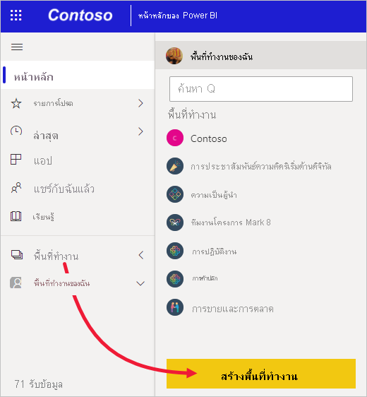

2. ใน **สร้างพื้นที่ทำงาน** ให้ป้อนชื่อ คำอธิบาย (ไม่บังคับ), และภาพโลโก้ (ไม่บังคับ) สำหรับพื้นที่ทำงานของคุณ

    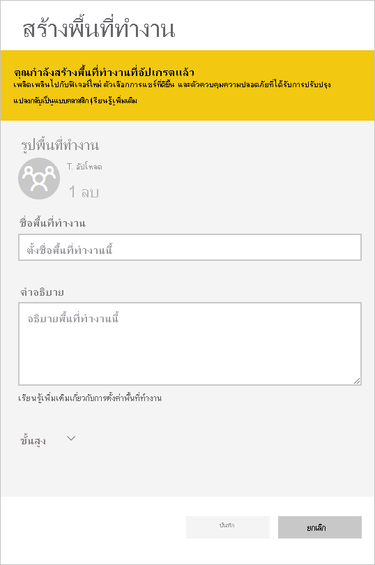

4. ขยายหัวข้อ **ขั้นสูง** แล้วเลือก **พัฒนาแอปเทมเพลต**

    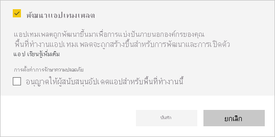

5. เลือก **บันทึก**
>[!NOTE]
>คุณต้องมีสิทธิ์จากผู้ดูแลระบบ Power BI เพื่อเลื่อนระดับแอปเทมเพลต

## เพิ่มเนื้อหาลงในพื้นที่ทำงานของแอปเทมเพลต

ขั้นตอนต่อไปของคุณคือการเพิ่มเนื้อหาลงในพื้นที่ทำงาน เช่นเดียวกับพื้นที่ทำงานของ Power BI ทั่วไป  

- [สร้างเนื้อหา Power BI ](index.yml)ในพื้นที่ทำงาน

ถ้าคุณกำลังใช้พารามิเตอร์ใน Power Query ให้ตรวจสอบให้มั่นใจว่าได้กำหนดชนิดของ้พารามิเตอร์ไว้ดีแล้ว (เช่น ข้อความ) ชนิดใด ๆ และไบนารีไม่รองรับ

[เคล็ดลับสำหรับการเขียนแอปแม่แบบใน Power BI](service-template-apps-tips.md) มีคำแนะนำเพื่อพิจารณาเมื่อสร้างรายงานและแดชบอร์ดสำหรับแอปแม่แบบของคุณ

## กำหนดคุณสมบัติของแอปเทมเพลต

หลังจากที่คุณมีเนื้อหาในพื้นที่ทำงานของคุณ คุณก็พร้อมที่จะจัดแพคเกจในแอปแม่แบบ ขั้นตอนแรกคือการ สร้างแอแม่แบบทดสอบ เข้าถึงได้เท่านั้นจากภายในองค์กรของคุณในผู้เช่าของคุณ

1. ในพื้นที่ทำงานแอปแม่แบบ เลือก **สร้างแอป**

    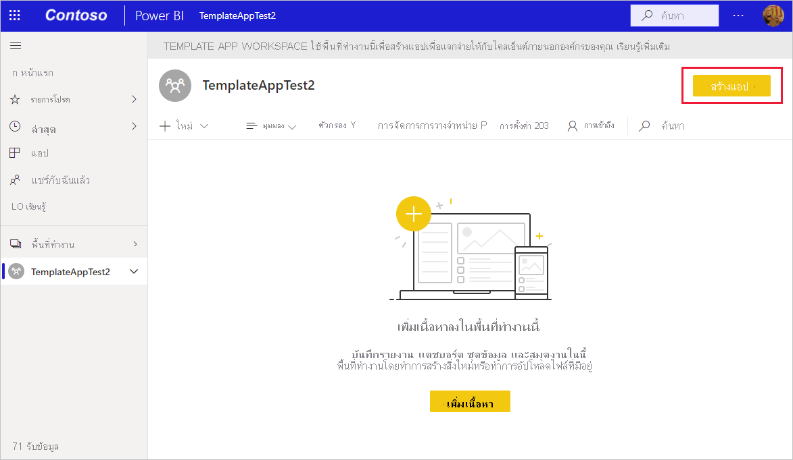

    คุณกรอกตัวเลือกการสร้างเพิ่มเติมสำหรับแอปเทมเพลตในแท็บหกแท็บที่จุดนี้:

    **การกำหนดตราสินค้า**

    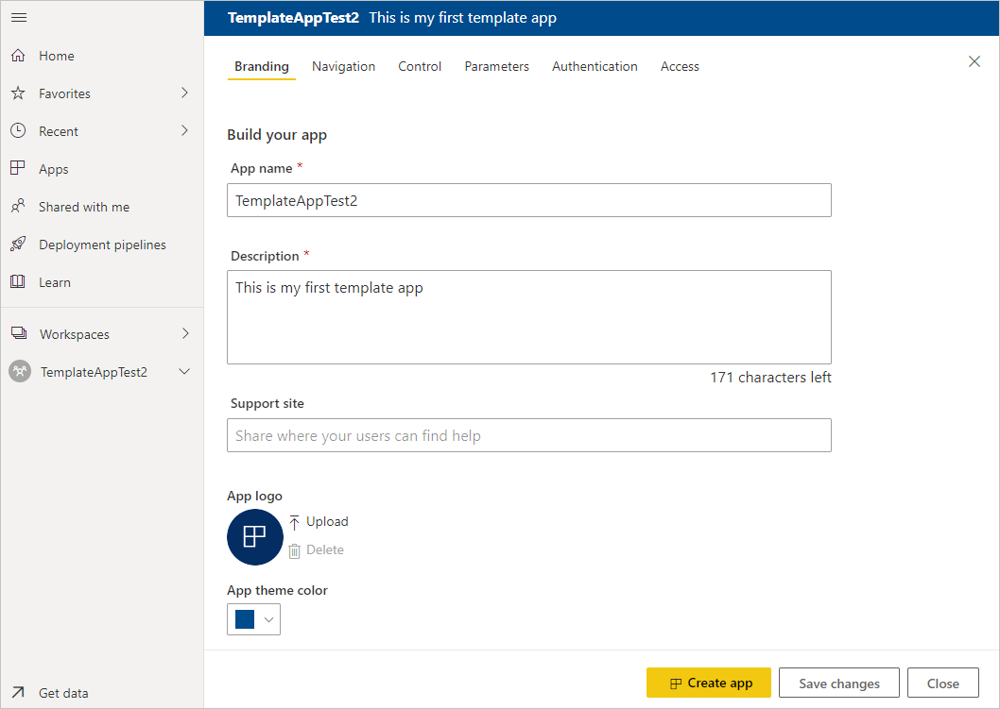
    - ชื่อแอป
    - คำอธิบาย
    - เว็บไซต์การสนับสนุน (ลิงก์จะแสดงใต้ข้อมูลแอปหลังจากแจกจ่ายแอปเทมเพลตเป็นแอปองค์กรซ้ำ)
    - โลโก้แอป (ขีดจำกัดขนาดไฟล์ 45K อัตราส่วนกว้างยาว 1:1, รูปแบบ .png .jpg .jpeg)
    - สีธีมของแอป

    **การสืบค้นเนื้อหา**

    เปิดใช้งาน **ระบบจัดทำส่วนการสืบค้นใหม่** โดยคุณสามารถกำหนดรายละเอียดหน้าต่างนำทางของแอป (ดูรายละเอียดในหัวข้อ [ออกแบบรูปแบบการสืบค้น](../collaborate-share/service-create-distribute-apps.md#design-the-navigation-experience) ในบทความนี้)

   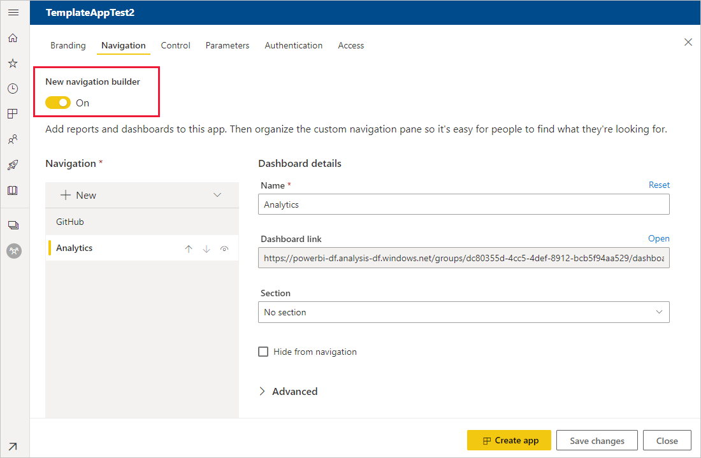
    
    **หน้าเริ่มต้นของแอป:** หากคุณตัดสินใจที่จะไม่ใช้ตัวสร้างการนำทาง คุณสามารถเลือกหน้าเชื่อมโยงของแอปดังกล่าวได้ กำหนดรายงานหรือแดชบอร์ดเป็น เพจเริ่มต้นของแอปของคุณ ใช้หน้าเชื่อมโยงเพื่อจะทำให้เกิดความน่าสนใจมากที่สุด

    **ตัวควบคุม**

    กำหนดขีดจำกัดและข้อจำกัดที่ผู้ใช้แอปของคุณจะต้องใช้กับเนื้อหาของแอปของคุณ คุณสามารถใช้ตัวควบคุมนี้เพื่อปกป้องทรัพย์สินทางปัญญาในแอปของคุณ

    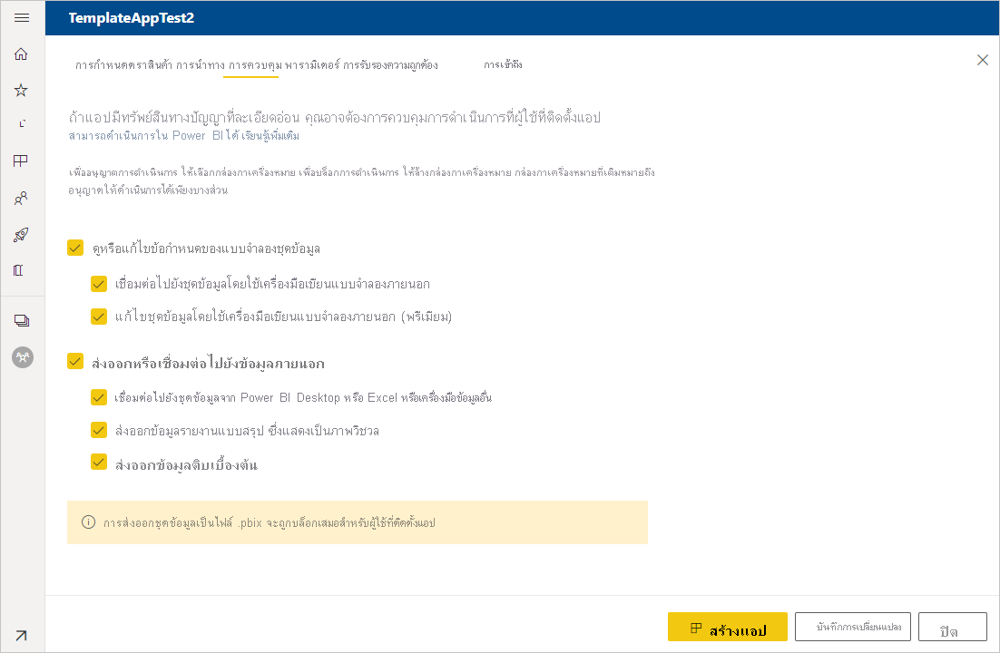

    >[!NOTE]
    >การส่งออกเป็นรูปแบบ .pbix จะถูกบล็อกเสมอสำหรับผู้ใช้ที่ติดตั้งแอป

    **พารามิเตอร์**

    พารามิเตอร์จะถูกสร้างขึ้นในไฟล์ .pbix เดิม (เรียนรู้เพิ่มเติมเกี่ยวกับ [การสร้างพารามิเตอร์คำถาม](https://powerbi.microsoft.com/blog/deep-dive-into-query-parameters-and-power-bi-templates/)) คุณใช้ความสามารถบนแท็บนี้เพื่อช่วยตัวติดตั้งแอปกำหนดค่าต่าง ๆ ของแอปหลังจากการติดตั้ง เมื่อแอปเชื่อมต่อกับข้อมูลของตัวแอปแล้ว

    ในแท็บนี้ คุณยังสามารถรับลิงก์ไปที่คู่มือของแอปได้ด้วย

    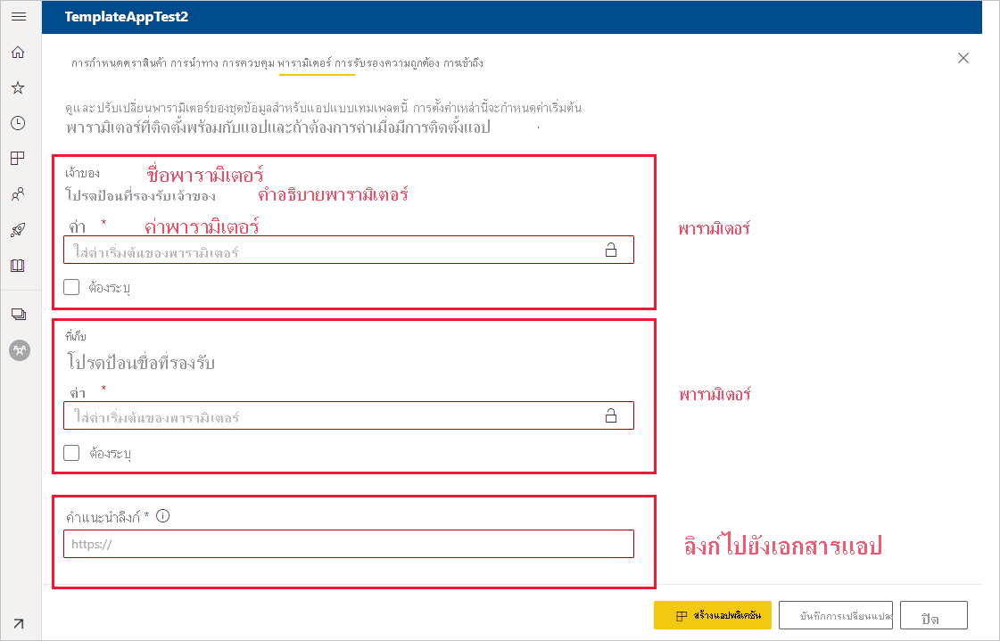

    พารามิเตอร์แต่ละพารามิเตอร์จะมีชื่อและคำอธิบาย ซึ่งมาจากการสอบถามและช่องข้อมูลค่า คุณมีตัวเลือกสามตัวเลือกในการรับค่าสำหรับพารามิเตอร์นั้นในระหว่างการติดตั้ง

    * คุณสามารถกำหนดให้ตัวติดตั้งต้องป้อนค่าได้ ในกรณีนี้ คุณต้องให้ตัวอย่างค่าที่จะนำมาป้อนแทน ในการกำหนดค่าพารามิเตอร์ด้วยวิธีนี้ ให้ตรวจสอบกล่องทำเครื่องหมายที่ **กำหนดไว้** จากนั้นให้แจ้งตัวอย่างในกล่องข้อความที่แสดงให้ผู้ใช้ทราบว่าควรป้อนค่าชนิดใด ตัวอย่างเช่น:

       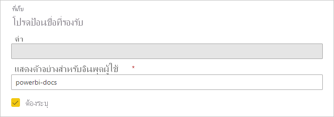

    * คุณสามารถให้ค่าที่กรอกไว้ล่วงหน้า ซึ่งผู้ใช้ที่ติดตั้งแอปจะไม่สามารถเปลี่ยนแปลงได้ ระบบจะซ่อนพารามิเตอร์ที่กำหนดค่าด้วยวิธีนีไว้จากบุคคลที่ติดตั้งแอป คุณควรใช้วิธีนี้เฉพาะเมื่อคุณมั่นใจว่าค่าที่กรอกไว้ล่วงหน้านั้นเหมาะสมสำหรับผู้ใช้ทุกคน มิเช่นนั้น ควรใช้วิธีการแรกที่กล่าวถึงข้างต้นที่กำหนดให้ต้องป้อนข้อมูลของผู้ใช้

       ในการกำหนดค่าพารามิเตอร์ด้วยวิธีนี้ ให้ป้อนค่าลงในกล่องข้อความ **ค่า** จากนั้นคลิกไอคอนล็อก ซึ่งจะทำให้ไม่สามารถเปลี่ยนแปลงค่าดังกล่าวได้ ตัวอย่างเช่น:

       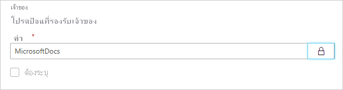

    * คุณสามารถกำหนดค่าเริ่มต้นที่ผู้ใช้สามารถเปลี่ยนแปลงระหว่างการติดตั้งได้ ในการกำหนดค่าพารามิเตอร์ด้วยวิธีนี้ ให้ป้อนค่าเริ่มต้นลงในกล่องข้อความ **ค่า** จากนั้นปล่อยให้ไอคอนล็อกอยู่ในสภาพปลดล็อกเอาไว้ ตัวอย่างเช่น:

      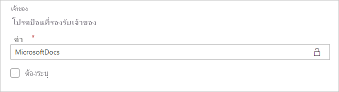

    **การรับรองความถูกต้อง**
    
    ในแท็บนี้ คุณเลือกวิธีการตรวจสอบสิทธิ์ที่ต้องการใช้ ตัวเลือกที่พร้อมใช้งานจะขึ้นอยู่กับชนิดแหล่งข้อมูลที่ใช้

    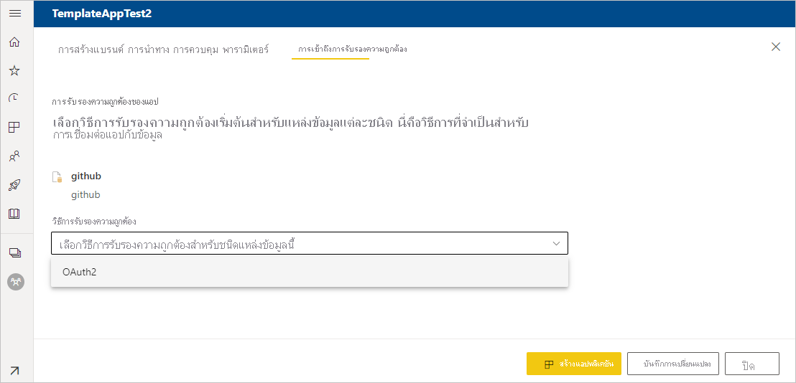

    โดยระบบจะกำหนดระดับความเป็นส่วนตัวให้โดยอัตโนมัติ:
   * แหล่งข้อมูลเดี่ยว: กำหนดค่าให้เป็นส่วนตัวโดยอัตโนมัติ
   * แหล่งข้อมูลแบบไม่ระบุชื่อหลายรายการ: กำหนดค่าให้เป็นสาธารณะโดยอัตโนมัติ

    **เข้าถึง**
    
    ในขั้นตอนการทดสอบ ให้ตัดสินใจว่าผู้ใดในองค์กรของคุณที่จะสามารถติดตั้งและทดสอบแอปของคุณได้ ไม่ต้องกังวล คุณสามารถกลับมา และเปลี่ยนการตั้งค่าเหล่านี้ในภายหลัง การตั้งค่าไม่มีผลต่อการเข้าถึงแอปเทมเพลตที่แจกจ่ายออกไปแล้ว

    

2. เลือก **สร้างแอป**

    คุณเห็นข้อความทดสอบแอปพร้อม มีลิงก์เพื่อคัดลอก และแชร์กับแอปทดสอบของคุณ

    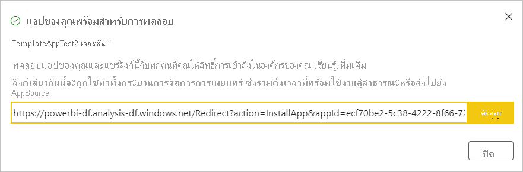

    นอกจากนี้คุณได้ทำขั้นตอนแรกของกระบวนการจัดการวางจำหน่าย ซึ่งตามหลัง

## จัดการการเผยแพร่แอปแม่แบบ

ก่อนที่คุณเผยแพร่แอปนี้แม่แบบสาธารณะ คุณต้องการให้แน่ใจว่า จะพร้อมใช้งาน Power BI ได้สร้างบานหน้าต่างการจัดการวางจำหน่าย ที่คุณสามารถติดตาม และตรวจสอบเส้นทางการเผยแพร่แอปเต็มรูปแบบ คุณยังสามารถจุดชนวนการเปลี่ยนจากขั้นตอนหนึ่งไปอีกขั้น ขั้นตอนทั่วไปคือ:

- สร้างแอปทดสอบ: สำหรับการทดสอบภายในองค์กรของคุณเท่านั้น
- เลื่อนระดับแพคเกจทดสอบถึงขั้นตอนก่อนการผลิต: ทดสอบภายนอกองค์กรของคุณ
- เลื่อนระดับแพคเกจก่อนการผลิตไปยังการผลิต: เวอร์ชันการผลิต
- ลบแพคเกจใด หรือเริ่มต้นจากขั้นตอนก่อนหน้า

URL ไม่เปลี่ยนแปลงเมื่อคุณย้ายระหว่างขั้นตอนการเผยแพร่ การเพิ่มระดับไม่มีผลต่อ URL เอง

ลองดูขั้นตอนต่าง ๆ:

1. ในพื้นที่ทำงานแม่แบบ เลือก **การจัดการวางจำหน่าย**

    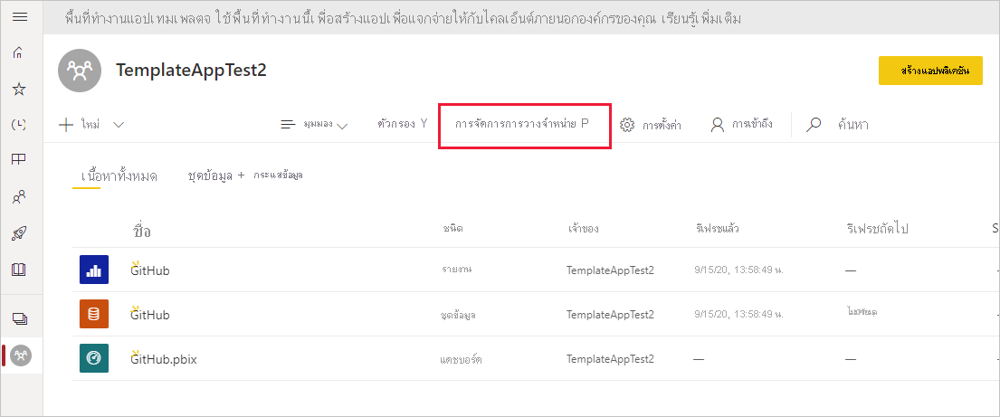

2. เลือก **รับลิงก์** หากคุณสร้างแอปทดสอบในส่วน **กำหนดคุณสมบัติของแอปแม่แบบ** ด้านบน (ซึ่งจะทำให้ระบบทำการกรอกจุดสีเหลืองที่อยู่ถัดจาก **การทดสอบ** เอาไว้ให้แล้ว)

    หากคุณยังไม่ได้สร้างแอป ให้เลือก **สร้างแอป** ซึ่งจะนำคุณกลับไปในกระบวนการสร้างแอปเทมเพลต

    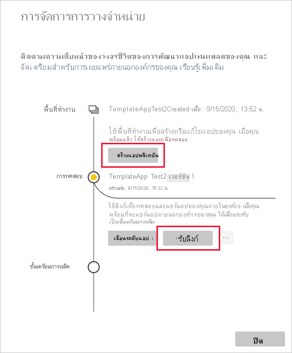

4. เมื่อต้องทดสอบประสบการณ์การใช้งานการติดตั้งแอป ให้คัดลอกลิงก์ในหน้าต่างการแจ้งเตือน แล้ววางลงในหน้าต่างเบราว์เซอร์ใหม่

    จากที่นี่ คุณกำลังติดตามลูกค้าของคุณจะทำตามขั้นตอนเดียว ดู[ติดตั้งและแจกจ่ายแอปเทมเพลตในองค์กรของคุณ](service-template-apps-install-distribute.md)

5. ในกล่องโต้ตอบ ให้เลือก **ติดตั้ง**

    เมื่อการติดตั้งสำเร็จ คุณจะเห็นการแจ้งเตือนว่าแอปใหม่ของคุณพร้อมแล้ว

6. เลือก **ไปยังแอป**

    ตรวจสอบว่าแอปทดสอบมีข้อมูลตัวอย่าง เมื่อต้องทำการเปลี่ยนแปลง ย้อนกลับไปยังแอปในพื้นที่ทำงานเดิม ปรับปรุงแอปทดสอบจนกว่าคุณจะพอใจ

1. เมื่อคุณพร้อมที่จะเลื่อนระดับแอปของคุณไปยังการผลิตล่วงหน้าสำหรับการทดสอบภายนอกผู้เช่าของคุณเพิ่มเติม ย้อนกลับไป **การจัดการวางจำหน่าย** บานหน้าต่างและเลือก **เลื่อนแอป**

    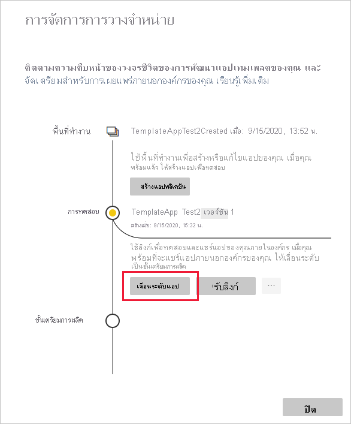
    >[!NOTE]
    > เมื่อเลื่อนระดับแอปแล้ว แอปจะอยู่ในรูปแบบสาธารณะที่พร้อมใช้งานภายนอกองค์กรของคุณ

    ถ้าคุณไม่เห็นตัวเลือกนั้น ติดต่อผู้ดูแลระบบ Power BI ของคุณเพื่อให้สิทธิ์แก่[สิทธิ์สำหรับการพัฒนาแอปแม่แบบ](../admin/service-admin-portal.md#template-apps-settings)ในพอร์ทัลผู้ดูแล
11. เลือก **เลื่อน** เพื่อยืนยันตัวเลือกของคุณ
12. คัดลอก URL นี้ใหม่เมื่อต้องแชร์ภายนอกผู้เช่าของคุณสำหรับการทดสอบ ลิงก์นี้ยังเป็นลิงก์ที่คุณส่งเพื่อเริ่มกระบวนการแจกจ่ายแอปของคุณบน AppSource โดยการสร้าง[ข้อเสนอสำหรับ Partner Center ใหม่](/azure/marketplace/partner-center-portal/create-power-bi-app-offer) ส่งลิงก์ก่อนการผลิตไปที่ Partner Center เท่านั้น หลังจากที่แอปผ่านการอนุมัติและคุณได้รับการแจ้งเตือนว่าแอปนั้นเผยแพร่ใน AppSource แล้วเท่านั้น คุณจึงจะสามารถเลื่อนระดับแพ็กเกจนี้ไปเป็นการผลิตใน Power BI
13. เมื่อแอปของคุณพร้อมสำหรับการผลิตหรือการแชร์ผ่าน AppSource ย้อนกลับไป **การจัดการวางจำหน่าย** บานหน้าต่างและเลือก **เลื่อนแอป** ถัดจาก **ก่อนการผลิต**
14. เลือก **เลื่อน** เพื่อยืนยันตัวเลือกของคุณ

    ตอนนี้ แอปของคุณอยู่ ในการ ผลิต และพร้อมสำหรับการแจกแจง

    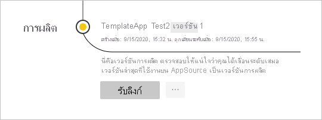

เพื่อให้แอปของคุณพร้อมใช้งานทั่วไปหลายพันของผู้ใช้ Power BI ในโลก เราขอแนะนำให้คุณส่งไปยัง AppSource ดู[ข้อเสนอแอปพลิเคชันPower BI](/azure/marketplace/partner-center-portal/create-power-bi-app-offer)สำหรับรายละเอียด

## การกําหนดค่าพารามิเตอร์โดยอัตโนมัติระหว่างการติดตั้ง

หากคุณเป็น ISV และกําลังแจกจ่ายแอปเทมเพลตของคุณผ่านบริการเว็บของคุณ คุณสามารถสร้างการทํางานอัตโนมัติที่กําหนดค่าพารามิเตอร์แอปเทมเพลตโดยอัตโนมัติเมื่อลูกค้าของคุณติดตั้งแอปในบัญชี Power BI ของพวกเขา ซึ่งจะช่วยให้ลูกค้าของคุณดำเนินการได้ง่ายขึ้นและเพิ่มความเป็นไปได้ในการติดตั้งสำเร็จ เนื่องจากพวกเขาไม่จำเป็นต้องให้รายละเอียดที่พวกเขาอาจไม่ทราบ ดูรายละเอียดที่[การกำหนดค่าอัตโนมัติของการติดตั้งแอปเทมเพลต](../developer/template-apps/template-apps-auto-install.md)

## ขั้นตอนถัดไป

ดูวิธีการที่ลูกค้าของคุณโต้ตอบกับแอปแม่แบบของคุณใน[ติดตั้ง กำหนดเอง และเผยแพรแอปแม่แบบในองค์กรของคุณ](service-template-apps-install-distribute.md)

ดู[ข้อเสนอแอปพลิเคชัน BI Power](/azure/marketplace/partner-center-portal/create-power-bi-app-offer)สำหรับรายละเอียดเกี่ยวกับการแจกจ่ายแอปของคุณ