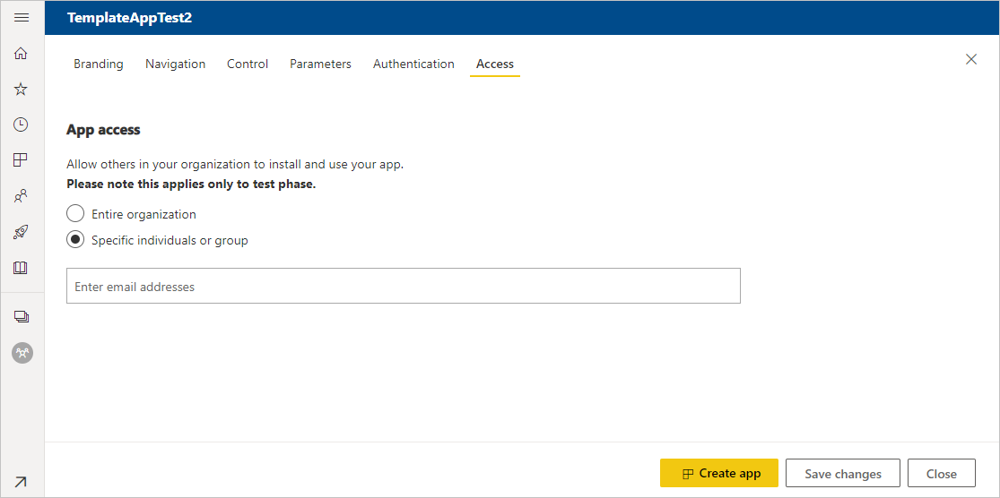

# สร้างแอปแม่แบบใน Power BICreate a template app in Power BI

*แอปเทมเพลต Power BI* เปิดให้คู่ค้า Power BI สร้างแอป Power BI ด้วยโค้ดเพียงเล็กน้อยหรือไม่มีเลย แล้วนำไปปรับใช้กับลูกค้า Power BI ทุกท่านPower BI *template apps* enable Power BI partners to build Power BI apps with little or no coding, and deploy them to any Power BI customer.  บทความนี้ประกอบด้วยคำแนะนำทีละขั้นตอนเพื่อสร้างแอปเทมเพลต Power BIThis article contains step-by-step instructions for creating a Power BI template app.

หากคุณสามารถสร้างรายงาน Power BI และแดชบอร์ดได้ คุณย่อมสามารถเป็น *ผู้สร้างแอปเทมเพลต* แล้วทำการสร้างรวมถึงทำแพคเกจเนื้อหาเชิงวิเคราะห์ลงใน *แอป* ได้If you can create Power BI reports and dashboards, you can become a *template app builder* and build and package analytical content into an *app*. จากนั้นคุณสามารถปรับใช้แอปของคุณกับผู้เช่า Power BI รายอื่นผ่านแพลตฟอร์มที่พร้อมใช้งาน เช่น AppSource หรือบริการเว็บของคุณเองYou can then deploy your app to other Power BI tenants through any available platform, such as AppSource or your own web service. ถ้าหากคุณกําลังกระจายแอปเทมเพลตของคุณผ่านบริการเว็บของคุณเอง คุณสามารถ[ทําให้ส่วนหนึ่งของกระบวนการติดตั้งเป็นไปโดยอัตโนมัติ](../developer/template-apps/template-apps-auto-install.md)เพื่อให้สิ่งต่าง ๆ ง่ายขึ้นสําหรับลูกค้าของคุณIf you're distributing your template app through your own web service, you can even [automate part of the installation process](../developer/template-apps/template-apps-auto-install.md) to make things easier for your customers.

ผู้ดูแลระบบ Power BI กำกับและควบคุมว่าใครในองค์กรของพวกเขาสามารถสร้างแอปแม่แบบ และใครสามารถติดตั้งแอปดังกล่าวได้บ้างPower BI admins govern and control who in their organization can create template apps, and who can install them. ผู้ใช้เหล่านั้นที่ได้รับอนุญาตสามารถติดตั้งแอปแม่แบบ จาก นั้นปรับเปลี่ยน และแจกจ่ายให้กับผู้ใช้ Power BI ในองค์กรของพวกเขาThose users who are authorized can install your template app, then modify it and distribute it to the Power BI consumers in their organization.

## ข้อกำหนดเบื้องต้นPrerequisites

นี่คือข้อกำหนดสำหรับการสร้างแอปแม่แบบ:Here are the requirements for building a template app:  

- [ใบอนุญาต Power BI pro ](../fundamentals/service-self-service-signup-for-power-bi.md)A [Power BI pro license](../fundamentals/service-self-service-signup-for-power-bi.md)
- แอ[ติดตั้ง Power BI Desktop](../fundamentals/desktop-get-the-desktop.md) (ไม่บังคับ)An [installation of Power BI Desktop](../fundamentals/desktop-get-the-desktop.md) (optional)
- ความชำนาญกับ[แนวคิดพื้นฐานของ Power BI](../fundamentals/service-basic-concepts.md)Familiarity with the [basic concepts of Power BI](../fundamentals/service-basic-concepts.md)
- สิทธิ์ในการแชร์แอปแม่แบบ (สำหรับข้อมูลเพิ่มเติม ให้ดทีู่พอร์ทัลผู้ดูแลระบบ [Power BI, การตั้งค่าแอปแม่แบบ](../admin/service-admin-portal.md#template-apps-settings)Permissions to share a template app publicly (for more information, see Power BI [admin portal, Template app settings](../admin/service-admin-portal.md#template-apps-settings)

## สร้างพื้นที่ทำงานของแม่แบบCreate the template workspace

เมื่อต้องสร้างแอปแม่แบบที่คุณสามารถแจกจ่ายให้กับผู้เช่า Power BI อื่น ๆ คุณต้องสร้างแอปในพื้นที่ใดพื้นที่หนึ่งของพื้นที่ทำงานใหม่To create a template app you can distribute to other Power BI tenants, you need to create it in one of the new workspaces.

1. ในการบริการของ Power BI ให้เลือก **พื้นที่ทำงาน** > **สร้างพื้นที่ทำงาน**In the Power BI service, select **Workspaces** > **Create a workspace**.

    

2. ใน **สร้างพื้นที่ทำงาน** ให้ป้อนชื่อ คำอธิบาย (ไม่บังคับ), และภาพโลโก้ (ไม่บังคับ) สำหรับพื้นที่ทำงานของคุณIn **Create a workspace**, enter a name, description (optional), and logo image (optional) for your workspace.

    

4. ขยายหัวข้อ **ขั้นสูง** แล้วเลือก **พัฒนาแอปเทมเพลต**Expand the **Advanced** section and select **Develop a template app**.

    

5. เลือก **บันทึก**Select **Save**.
>[!NOTE]
>คุณต้องมีสิทธิ์จากผู้ดูแลระบบ Power BI เพื่อเลื่อนระดับแอปเทมเพลตYou need permissions from your Power BI admin to promote template apps.

## เพิ่มเนื้อหาลงในพื้นที่ทำงานของแอปเทมเพลตAdd content to the template app workspace

ขั้นตอนต่อไปของคุณคือการเพิ่มเนื้อหาลงในพื้นที่ทำงาน เช่นเดียวกับพื้นที่ทำงานของ Power BI ทั่วไปAs with a regular Power BI workspace, your next step is add content to the workspace.  

- [สร้างเนื้อหา Power BI ](index.yml)ในพื้นที่ทำงาน[Create your Power BI content](index.yml) in your workspace.

ถ้าคุณกำลังใช้พารามิเตอร์ใน Power Query ให้ตรวจสอบให้มั่นใจว่าได้กำหนดชนิดของ้พารามิเตอร์ไว้ดีแล้ว (เช่น ข้อความ)If you're using parameters in Power Query, make sure they have well-defined types (for example, Text). ชนิดใด ๆ และไบนารีไม่รองรับThe types Any and Binary aren't supported.

[เคล็ดลับสำหรับการเขียนแอปแม่แบบใน Power BI](service-template-apps-tips.md) มีคำแนะนำเพื่อพิจารณาเมื่อสร้างรายงานและแดชบอร์ดสำหรับแอปแม่แบบของคุณ[Tips for authoring template apps in Power BI](service-template-apps-tips.md) has suggestions to consider when creating reports and dashboards for your template app.

## กำหนดคุณสมบัติของแอปเทมเพลตDefine the properties of the template app

หลังจากที่คุณมีเนื้อหาในพื้นที่ทำงานของคุณ คุณก็พร้อมที่จะจัดแพคเกจในแอปแม่แบบNow that you have content in your workspace, you're ready to package it in a template app. ขั้นตอนแรกคือการ สร้างแอแม่แบบทดสอบ เข้าถึงได้เท่านั้นจากภายในองค์กรของคุณในผู้เช่าของคุณThe first step is to create a test template app, accessible only from within your organization on your tenant.

1. ในพื้นที่ทำงานแอปแม่แบบ เลือก **สร้างแอป**In the template app workspace, select **Create app**.

    

    คุณกรอกตัวเลือกการสร้างเพิ่มเติมสำหรับแอปเทมเพลตในแท็บหกแท็บที่จุดนี้:Here, you fill in additional building options for your template app, in six tabs:

    **การกำหนดตราสินค้า****Branding**

    
    - ชื่อแอปApp name
    - คำอธิบายDescription
    - เว็บไซต์การสนับสนุน (ลิงก์จะแสดงใต้ข้อมูลแอปหลังจากแจกจ่ายแอปเทมเพลตเป็นแอปองค์กรซ้ำ)Support site (link is presented under app info after redistributing template app as org app)
    - โลโก้แอป (ขีดจำกัดขนาดไฟล์ 45K อัตราส่วนกว้างยาว 1:1, รูปแบบ .png .jpg .jpeg)App logo (45K file size limit, 1:1 aspect ratio, .png .jpg .jpeg formats)
    - สีธีมของแอปApp theme color

    **การสืบค้นเนื้อหา****Navigation**

    เปิดใช้งาน **ระบบจัดทำส่วนการสืบค้นใหม่** โดยคุณสามารถกำหนดรายละเอียดหน้าต่างนำทางของแอป (ดูรายละเอียดในหัวข้อ [ออกแบบรูปแบบการสืบค้น](../collaborate-share/service-create-distribute-apps.md#design-the-navigation-experience) ในบทความนี้)Activate the **New navigation builder**, where you can define the nav pane of the app (See [Design the navigation experience](../collaborate-share/service-create-distribute-apps.md#design-the-navigation-experience) in this article for details).

   
    
    **หน้าเริ่มต้นของแอป:** หากคุณตัดสินใจที่จะไม่ใช้ตัวสร้างการนำทาง คุณสามารถเลือกหน้าเชื่อมโยงของแอปดังกล่าวได้**App landing page:** If you decide to opt out of the navigation builder, you have the option to select the app landing page. กำหนดรายงานหรือแดชบอร์ดเป็น เพจเริ่มต้นของแอปของคุณDefine a report or dashboard to be the landing page of your app. ใช้หน้าเชื่อมโยงเพื่อจะทำให้เกิดความน่าสนใจมากที่สุดUse a landing page that gives the right impression.

    **ตัวควบคุม****Control**

    กำหนดขีดจำกัดและข้อจำกัดที่ผู้ใช้แอปของคุณจะต้องใช้กับเนื้อหาของแอปของคุณSet limits and restrictions that your app's users will have with the content of your app. คุณสามารถใช้ตัวควบคุมนี้เพื่อปกป้องทรัพย์สินทางปัญญาในแอปของคุณYou can use this control to protect intellectual property in your app.

    

    >[!NOTE]
    >การส่งออกเป็นรูปแบบ .pbix จะถูกบล็อกเสมอสำหรับผู้ใช้ที่ติดตั้งแอปExporting to .pbix format is always blocked for users installing the app.

    **พารามิเตอร์****Parameters**

    พารามิเตอร์จะถูกสร้างขึ้นในไฟล์ .pbix เดิม (เรียนรู้เพิ่มเติมเกี่ยวกับ [การสร้างพารามิเตอร์คำถาม](https://powerbi.microsoft.com/blog/deep-dive-into-query-parameters-and-power-bi-templates/))Parameters are created in the original pbix file (learn more about [creating query parameters](https://powerbi.microsoft.com/blog/deep-dive-into-query-parameters-and-power-bi-templates/)). คุณใช้ความสามารถบนแท็บนี้เพื่อช่วยตัวติดตั้งแอปกำหนดค่าต่าง ๆ ของแอปหลังจากการติดตั้ง เมื่อแอปเชื่อมต่อกับข้อมูลของตัวแอปแล้วYou use the capabilities on this tab to help the app installer configure the app after installation when they connect to their data.

    ในแท็บนี้ คุณยังสามารถรับลิงก์ไปที่คู่มือของแอปได้ด้วยIn this tab you also provide a link to the app documentation.

    

    พารามิเตอร์แต่ละพารามิเตอร์จะมีชื่อและคำอธิบาย ซึ่งมาจากการสอบถามและช่องข้อมูลค่าEach parameter has a name and a description, which come from the query, and a value field. คุณมีตัวเลือกสามตัวเลือกในการรับค่าสำหรับพารามิเตอร์นั้นในระหว่างการติดตั้งYou have three options for getting a value for the parameter during installation.

    * คุณสามารถกำหนดให้ตัวติดตั้งต้องป้อนค่าได้You can require the installer to enter a value. ในกรณีนี้ คุณต้องให้ตัวอย่างค่าที่จะนำมาป้อนแทนIn this case, you provide an example that they will replace. ในการกำหนดค่าพารามิเตอร์ด้วยวิธีนี้ ให้ตรวจสอบกล่องทำเครื่องหมายที่ **กำหนดไว้** จากนั้นให้แจ้งตัวอย่างในกล่องข้อความที่แสดงให้ผู้ใช้ทราบว่าควรป้อนค่าชนิดใดTo configure a parameter in this way, check the **Required** checkbox, and then give an example in the textbox that shows the user what kind of value is expected. ตัวอย่างเช่น:For example:

       

    * คุณสามารถให้ค่าที่กรอกไว้ล่วงหน้า ซึ่งผู้ใช้ที่ติดตั้งแอปจะไม่สามารถเปลี่ยนแปลงได้You can provide a pre-populated value that the user who installs the app can’t change. ระบบจะซ่อนพารามิเตอร์ที่กำหนดค่าด้วยวิธีนีไว้จากบุคคลที่ติดตั้งแอปA parameter configured in this way is hidden from the person installing the app. คุณควรใช้วิธีนี้เฉพาะเมื่อคุณมั่นใจว่าค่าที่กรอกไว้ล่วงหน้านั้นเหมาะสมสำหรับผู้ใช้ทุกคน มิเช่นนั้น ควรใช้วิธีการแรกที่กล่าวถึงข้างต้นที่กำหนดให้ต้องป้อนข้อมูลของผู้ใช้You should use this method only if you are sure that the pre-populated value is valid for all users; otherwise use the first method mentioned above that requires user input.

       ในการกำหนดค่าพารามิเตอร์ด้วยวิธีนี้ ให้ป้อนค่าลงในกล่องข้อความ **ค่า** จากนั้นคลิกไอคอนล็อกTo configure a parameter in this way, enter the value in the **Value** textbox and then click the lock icon. ซึ่งจะทำให้ไม่สามารถเปลี่ยนแปลงค่าดังกล่าวได้This makes it so the value can't be changed. ตัวอย่างเช่น:For example:

       

    * คุณสามารถกำหนดค่าเริ่มต้นที่ผู้ใช้สามารถเปลี่ยนแปลงระหว่างการติดตั้งได้You can provide a default value that the user can change during installation. ในการกำหนดค่าพารามิเตอร์ด้วยวิธีนี้ ให้ป้อนค่าเริ่มต้นลงในกล่องข้อความ **ค่า** จากนั้นปล่อยให้ไอคอนล็อกอยู่ในสภาพปลดล็อกเอาไว้To configure a parameter in this way, enter the desired default value in the **Value** textbox, and leave the lock icon unlocked. ตัวอย่างเช่น:For example:

      

    **การรับรองความถูกต้อง****Authentication**
    
    ในแท็บนี้ คุณเลือกวิธีการตรวจสอบสิทธิ์ที่ต้องการใช้In this tab you select the authentication method that will be used. ตัวเลือกที่พร้อมใช้งานจะขึ้นอยู่กับชนิดแหล่งข้อมูลที่ใช้The options that are available depend on the data source types being used.

    

    โดยระบบจะกำหนดระดับความเป็นส่วนตัวให้โดยอัตโนมัติ:Privacy level is configured automatically:
   * แหล่งข้อมูลเดี่ยว: กำหนดค่าให้เป็นส่วนตัวโดยอัตโนมัติSingle datasource: Automatically configured as private.
   * แหล่งข้อมูลแบบไม่ระบุชื่อหลายรายการ: กำหนดค่าให้เป็นสาธารณะโดยอัตโนมัติMulti anonymous datasource: Automatically configured as public.

    **เข้าถึง****Access**
    
    ในขั้นตอนการทดสอบ ให้ตัดสินใจว่าผู้ใดในองค์กรของคุณที่จะสามารถติดตั้งและทดสอบแอปของคุณได้In the test phase, decide who else in your organization can install and test your app. ไม่ต้องกังวล คุณสามารถกลับมา และเปลี่ยนการตั้งค่าเหล่านี้ในภายหลังDon't worry, you can always come back and change these settings later. การตั้งค่าไม่มีผลต่อการเข้าถึงแอปเทมเพลตที่แจกจ่ายออกไปแล้วThe setting doesn't affect access of the distributed template app.

    

2. เลือก **สร้างแอป**Select **Create app**.

    คุณเห็นข้อความทดสอบแอปพร้อม มีลิงก์เพื่อคัดลอก และแชร์กับแอปทดสอบของคุณYou see a message that the test app is ready, with a link to copy and share with your app testers.

    

    นอกจากนี้คุณได้ทำขั้นตอนแรกของกระบวนการจัดการวางจำหน่าย ซึ่งตามหลังYou've also done the first step of the release management process, which follows.

## จัดการการเผยแพร่แอปแม่แบบManage the template app release

ก่อนที่คุณเผยแพร่แอปนี้แม่แบบสาธารณะ คุณต้องการให้แน่ใจว่า จะพร้อมใช้งานBefore you release this template app publicly, you want to make sure it's ready to go. Power BI ได้สร้างบานหน้าต่างการจัดการวางจำหน่าย ที่คุณสามารถติดตาม และตรวจสอบเส้นทางการเผยแพร่แอปเต็มรูปแบบPower BI has created the release management pane, where you can follow and inspect the full app release path. คุณยังสามารถจุดชนวนการเปลี่ยนจากขั้นตอนหนึ่งไปอีกขั้นYou can also trigger the transition from stage to stage. ขั้นตอนทั่วไปคือ:The common stages are:

- สร้างแอปทดสอบ: สำหรับการทดสอบภายในองค์กรของคุณเท่านั้นGenerate test app: for testing within your organization only.
- เลื่อนระดับแพคเกจทดสอบถึงขั้นตอนก่อนการผลิต: ทดสอบภายนอกองค์กรของคุณPromote the test package to pre-production stage: test outside of your organization.
- เลื่อนระดับแพคเกจก่อนการผลิตไปยังการผลิต: เวอร์ชันการผลิตPromote pre-production package to Production: production version.
- ลบแพคเกจใด หรือเริ่มต้นจากขั้นตอนก่อนหน้าDelete any package or start over from previous stage.

URL ไม่เปลี่ยนแปลงเมื่อคุณย้ายระหว่างขั้นตอนการเผยแพร่The URL doesn't change as you move between release stages. การเพิ่มระดับไม่มีผลต่อ URL เองPromotion doesn't affect the URL itself.

ลองดูขั้นตอนต่าง ๆ:Let's go through the stages:

1. ในพื้นที่ทำงานแม่แบบ เลือก **การจัดการวางจำหน่าย**In the template workspace, select **Release Management**.

    

2. เลือก **รับลิงก์** หากคุณสร้างแอปทดสอบในส่วน **กำหนดคุณสมบัติของแอปแม่แบบ** ด้านบน (ซึ่งจะทำให้ระบบทำการกรอกจุดสีเหลืองที่อยู่ถัดจาก **การทดสอบ** เอาไว้ให้แล้ว)Select **Get link** if you created the test app in the **Define the properties of the template app** section above (as a result the yellow dot next to **Testing** is already filled in).

    หากคุณยังไม่ได้สร้างแอป ให้เลือก **สร้างแอป**If you didn't yet create the app, select **Create app**. ซึ่งจะนำคุณกลับไปในกระบวนการสร้างแอปเทมเพลตThis brings you back into the template app creation process.

    

4. เมื่อต้องทดสอบประสบการณ์การใช้งานการติดตั้งแอป ให้คัดลอกลิงก์ในหน้าต่างการแจ้งเตือน แล้ววางลงในหน้าต่างเบราว์เซอร์ใหม่To test the app installation experience, copy the link in the notification window and paste it into a new browser window.

    จากที่นี่ คุณกำลังติดตามลูกค้าของคุณจะทำตามขั้นตอนเดียวFrom here, you're following the same procedure your customers will follow. ดู[ติดตั้งและแจกจ่ายแอปเทมเพลตในองค์กรของคุณ](service-template-apps-install-distribute.md)See [Install and distribute template apps in your organization](service-template-apps-install-distribute.md).

5. ในกล่องโต้ตอบ ให้เลือก **ติดตั้ง**In the dialog box, select **Install**.

    เมื่อการติดตั้งสำเร็จ คุณจะเห็นการแจ้งเตือนว่าแอปใหม่ของคุณพร้อมแล้วWhen installation succeeds, you see a notification that the new app is ready.

6. เลือก **ไปยังแอป**Select **Go to app**.

    ตรวจสอบว่าแอปทดสอบมีข้อมูลตัวอย่างVerify that the test app has the sample data. เมื่อต้องทำการเปลี่ยนแปลง ย้อนกลับไปยังแอปในพื้นที่ทำงานเดิมTo make any changes, go back to the app in the original workspace. ปรับปรุงแอปทดสอบจนกว่าคุณจะพอใจUpdate the test app until you're satisfied.

1. เมื่อคุณพร้อมที่จะเลื่อนระดับแอปของคุณไปยังการผลิตล่วงหน้าสำหรับการทดสอบภายนอกผู้เช่าของคุณเพิ่มเติม ย้อนกลับไป **การจัดการวางจำหน่าย** บานหน้าต่างและเลือก **เลื่อนแอป**When you're ready to promote your app to pre-production for further testing outside your tenant, go back to the **Release Management** pane and select **Promote app**.

    
    >[!NOTE]
    > เมื่อเลื่อนระดับแอปแล้ว แอปจะอยู่ในรูปแบบสาธารณะที่พร้อมใช้งานภายนอกองค์กรของคุณWhen the app is promoted it becomes publicly available outside your organization.

    ถ้าคุณไม่เห็นตัวเลือกนั้น ติดต่อผู้ดูแลระบบ Power BI ของคุณเพื่อให้สิทธิ์แก่[สิทธิ์สำหรับการพัฒนาแอปแม่แบบ](../admin/service-admin-portal.md#template-apps-settings)ในพอร์ทัลผู้ดูแลIf you don't see that option, contact your Power BI admin to grant you [permissions for template app development](../admin/service-admin-portal.md#template-apps-settings) in the admin portal.
11. เลือก **เลื่อน** เพื่อยืนยันตัวเลือกของคุณSelect **Promote** to confirm your choice.
12. คัดลอก URL นี้ใหม่เมื่อต้องแชร์ภายนอกผู้เช่าของคุณสำหรับการทดสอบCopy this new URL to share outside your tenant for testing. ลิงก์นี้ยังเป็นลิงก์ที่คุณส่งเพื่อเริ่มกระบวนการแจกจ่ายแอปของคุณบน AppSource โดยการสร้าง[ข้อเสนอสำหรับ Partner Center ใหม่](/azure/marketplace/partner-center-portal/create-power-bi-app-offer)This link is also the one you submit to begin the process of distributing your app on AppSource by creating a [new Partner center offer](/azure/marketplace/partner-center-portal/create-power-bi-app-offer). ส่งลิงก์ก่อนการผลิตไปที่ Partner Center เท่านั้นSubmit only pre-production links to the Partner center. หลังจากที่แอปผ่านการอนุมัติและคุณได้รับการแจ้งเตือนว่าแอปนั้นเผยแพร่ใน AppSource แล้วเท่านั้น คุณจึงจะสามารถเลื่อนระดับแพ็กเกจนี้ไปเป็นการผลิตใน Power BIOnly after the app is approved and you get notification that it is published in AppSource, can you promote this package to production in Power BI.
13. เมื่อแอปของคุณพร้อมสำหรับการผลิตหรือการแชร์ผ่าน AppSource ย้อนกลับไป **การจัดการวางจำหน่าย** บานหน้าต่างและเลือก **เลื่อนแอป** ถัดจาก **ก่อนการผลิต**When your app is ready for production or sharing via AppSource, go back to the **Release Management** pane and select **Promote app** next to **Pre-production**.
14. เลือก **เลื่อน** เพื่อยืนยันตัวเลือกของคุณSelect **Promote** to confirm your choice.

    ตอนนี้ แอปของคุณอยู่ ในการ ผลิต และพร้อมสำหรับการแจกแจงNow your app is in production, and ready for distribution.

    

เพื่อให้แอปของคุณพร้อมใช้งานทั่วไปหลายพันของผู้ใช้ Power BI ในโลก เราขอแนะนำให้คุณส่งไปยัง AppSourceTo make your app widely available to thousands of Power BI users in the world, we encourage you to submit it to AppSource. ดู[ข้อเสนอแอปพลิเคชันPower BI](/azure/marketplace/partner-center-portal/create-power-bi-app-offer)สำหรับรายละเอียดSee the [Power BI Application offer](/azure/marketplace/partner-center-portal/create-power-bi-app-offer) for details.

## การกําหนดค่าพารามิเตอร์โดยอัตโนมัติระหว่างการติดตั้งAutomate parameter configuration during installation

หากคุณเป็น ISV และกําลังแจกจ่ายแอปเทมเพลตของคุณผ่านบริการเว็บของคุณ คุณสามารถสร้างการทํางานอัตโนมัติที่กําหนดค่าพารามิเตอร์แอปเทมเพลตโดยอัตโนมัติเมื่อลูกค้าของคุณติดตั้งแอปในบัญชี Power BI ของพวกเขาIf you are an ISV and are distributing your template app via your web service, you can create automation that configures template app parameters automatically when your customers install the app in their Power BI account. ซึ่งจะช่วยให้ลูกค้าของคุณดำเนินการได้ง่ายขึ้นและเพิ่มความเป็นไปได้ในการติดตั้งสำเร็จ เนื่องจากพวกเขาไม่จำเป็นต้องให้รายละเอียดที่พวกเขาอาจไม่ทราบThis makes things easier for your customers and increases the likelihood of a successful installation because they don't have to supply details that they might not know. ดูรายละเอียดที่[การกำหนดค่าอัตโนมัติของการติดตั้งแอปเทมเพลต](../developer/template-apps/template-apps-auto-install.md)See [Automated configuration of a template app installation](../developer/template-apps/template-apps-auto-install.md) for details.

## ขั้นตอนถัดไปNext steps

ดูวิธีการที่ลูกค้าของคุณโต้ตอบกับแอปแม่แบบของคุณใน[ติดตั้ง กำหนดเอง และเผยแพรแอปแม่แบบในองค์กรของคุณ](service-template-apps-install-distribute.md)See how your customers interact with your template app in [Install, customize, and distribute template apps in your organization](service-template-apps-install-distribute.md).

ดู[ข้อเสนอแอปพลิเคชัน BI Power](/azure/marketplace/partner-center-portal/create-power-bi-app-offer)สำหรับรายละเอียดเกี่ยวกับการแจกจ่ายแอปของคุณSee the [Power BI Application offer](/azure/marketplace/partner-center-portal/create-power-bi-app-offer) for details on distributing your app.