# ติดตั้งและแจกจ่ายแอปเทมเพลตในองค์กรของคุณ

คุณเป็นนักวิเคราะห์ Power BI หรือไม่ ถ้าใช่ บทความนี้จะอธิบายวิธีการติดตั้ง[แอปเทมเพลต](service-template-apps-overview.md)เพื่อเชื่อมต่อกับบริการมากมายที่คุณใช้เพื่อดำเนินธุรกิจ เช่น Salesforce, Microsoft Dynamics และ Google Analytics จากนั้นคุณสามารถแก้ไขแดชบอร์ดและรายงานที่สร้างไว้ล่วงหน้าของแอปเทมเพลตเพื่อให้เหมาะกับความต้องการขององค์กรของคุณ และแจกจ่ายให้เพื่อนร่วมงานของคุณเป็น[แอป](../consumer/end-user-apps.md)ได้ 

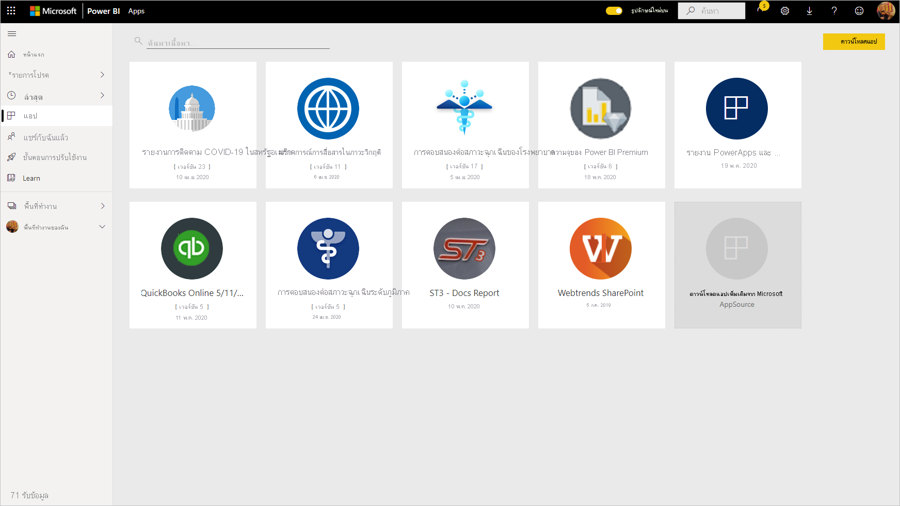

ถ้าคุณสนใจที่จะสร้างแอปเทมเพลตเพื่อกระจายด้วยตนเองเพื่อแจกจ่ายนอกองค์กร ให้ดู[สร้างแอปเทมเพลตใน Power BI](service-template-apps-create.md) คู่ค้า Power BI สามารถสร้างแอป Power BI และทำให้แอปดังกล่าวพร้อมใช้งานสำหรับลูกค้า Power BI ได้ด้วยการเขียนโค้ดเพียงเล็กน้อยหรือไม่ต้องเขียนโค้ดเลย 

## ข้อกำหนดเบื้องต้น  

หากต้องการติดตั้ง ปรับแต่ง และเผยแพร่แอปเทมเพลต คุณจำเป็นต้องมี: 

* [สิทธิการใช้งาน Power BI Pro](../fundamentals/service-self-service-signup-for-power-bi.md)
* สิทธิ์ในการติดตั้งแอปเทมเพลตบนผู้เช่าของคุณ
* ลิงก์การติดตั้งแอปที่ถูกต้อง ซึ่งคุณจะได้รับจาก AppSource หรือจากผู้สร้างแอป
* ความคุ้นเคยที่ดีกับ[แนวคิดพื้นฐานของ Power BI](../fundamentals/service-basic-concepts.md)

## สร้างแอปแม่แบบ

1. ในบานหน้าต่างนำทางของบริการ Power BI เลือก **แอป** > **รับแอป**

    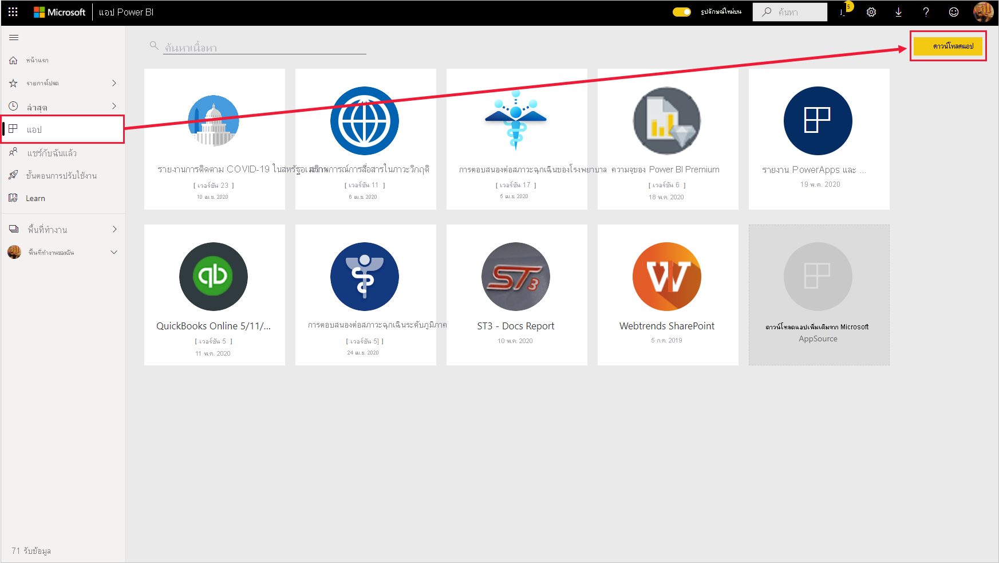

1. ใน Power BI apps marketplace ที่ปรากฏขึ้น ให้เลือก **แอปแม่แบบ** แอปแบบแม่แบบทั้งหมดที่พร้อมใช้งานใน AppSource จะแสดงขึ้น เรียกดูเพื่อค้นหาแอปแบบแม่แบบที่คุณกำลังค้นหา หรือรับการเลือกการกรองโดยใช้กล่องค้นหา การพิมพ์ส่วนหนึ่งของชื่อแอปแม่แบบ หรือประเภทเช่น การเงิน การวิเคราะห์ การตลาด และอื่นๆ จะช่วยให้ง่ายต่อการค้นหารายการที่คุณกำลังมองหา

    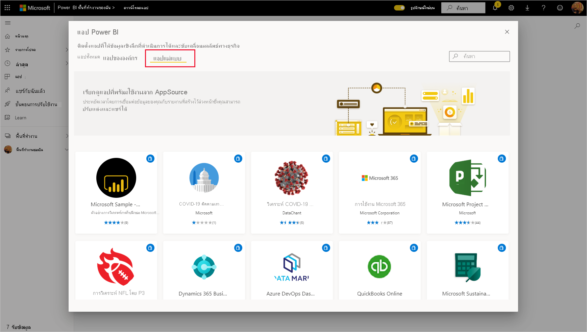

1. เมื่อคุณพบแอปแม่แบบที่คุณกำลังค้นหา ให้คลิกที่แอปนั้นๆ ข้อเสนอแอปแม่แบบจะแสดงขึ้น คลิก **รับทันที**

   

1. ในกล่องโต้ตอบที่ปรากฏขึ้น ให้เลือก **ติดตั้ง**

    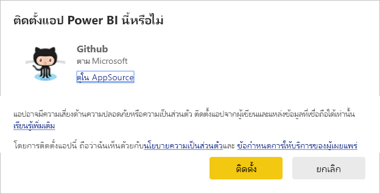
    
    แอปจะได้รับการติดตั้งพร้อมกับพื้นที่ทำงานชื่อเดียวกันกับที่มีความจำเป็นสำหรับ[การแก้ไข](#customize-and-share-the-app)เพิ่มเติม

    > [!NOTE]
    > หากคุณใช้ลิงก์การติดตั้งสำหรับแอปที่ไม่ระบุอยู่ใน AppSource กล่องโต้ตอบสำหรับการตรวจสอบความถูกต้องจะขอให้คุณยืนยันตัวเลือกของคุณ
    >
    >เพื่อให้สามารถติดตั้งแอปเทมเพลตที่ไม่ได้อยู่ใน AppSource คุณจำเป็นต้องร้องขอสิทธิ์ที่เกี่ยวข้องจากผู้ดูแลระบบของคุณ ดูรายละเอียดที่ [การตั้งค่าแอปเทมเพลต](../admin/service-admin-portal.md#template-apps-settings) ในพอร์ทัลผู้ดูแลระบบ Power BI

    เมื่อการติดตั้งสำเร็จแล้ว การแจ้งเตือนจะแจ้งให้คุณทราบว่าแอปใหม่ของคุณพร้อมใช้งานแล้ว

    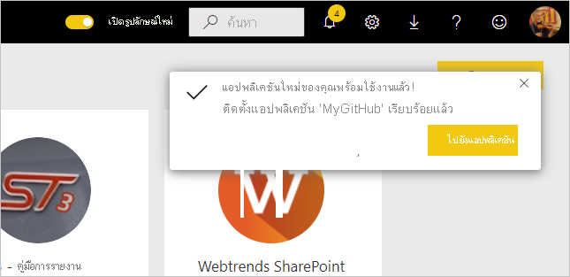

## เชื่อมต่อกับข้อมูล

1. เลือก **ไปยังแอป**

   แอปจะเปิดขึ้นและแสดงข้อมูลตัวอย่าง

1. เลือกลิงก์ **เชื่อมต่อข้อมูลของคุณ** บนแบนเนอร์ที่ด้านบนของหน้า

   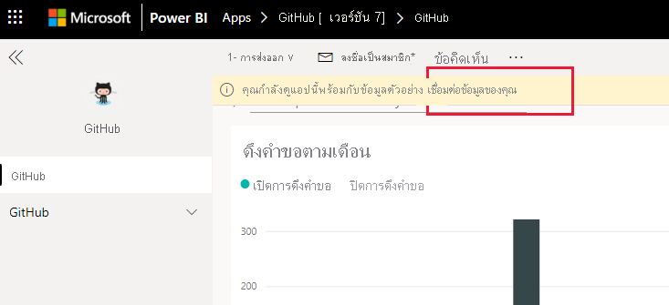

    ซึ่งจะเปิดกล่องโต้ตอบพารามิเตอร์ ที่คุณสามารถเปลี่ยนแหล่งข้อมูลจากข้อมูลตัวอย่างเป็นแหล่งข้อมูลของคุณเอง (ดู[ข้อจำกัดที่รู้จัก](service-template-apps-overview.md#known-limitations)) ตามด้วยกล่องโต้ตอบวิธีการรับรองความถูกต้อง คุณอาจต้องกำหนดค่าใหม่ในกล่องโต้ตอบเหล่านี้ ดูเอกสารประกอบของแอปเทมเพลตที่คุณกำลังติดตั้งอยู่เพื่อดูรายละเอียด

   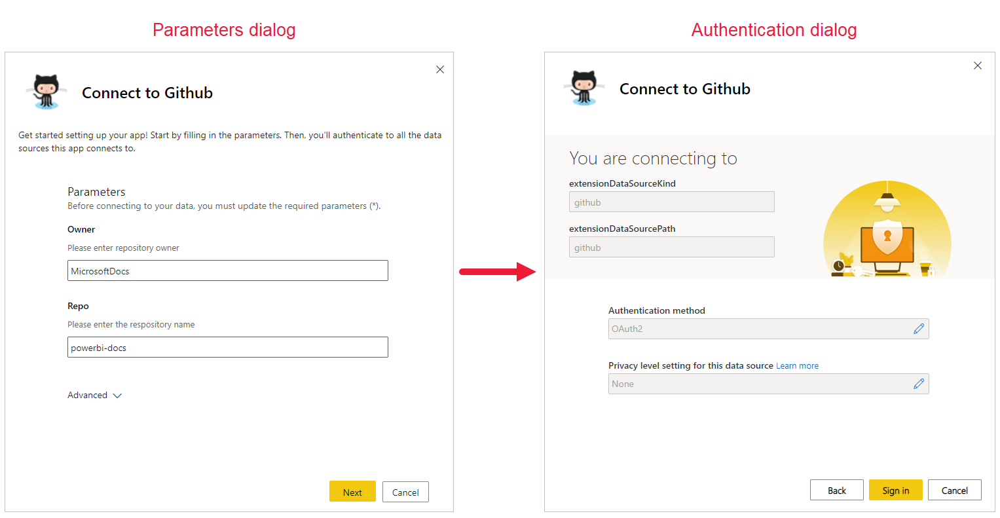

    หลังจากที่คุณกรอกข้อความโต้ตอบสำหรับการเชื่อมต่อแล้ว กระบวนการเชื่อมต่อจะเริ่มขึ้น แบนเนอร์จะแจ้งให้คุณทราบว่าข้อมูลกำลังถูกรีเฟรช และในระหว่างนี้คุณกำลังดูข้อมูลตัวอย่าง

    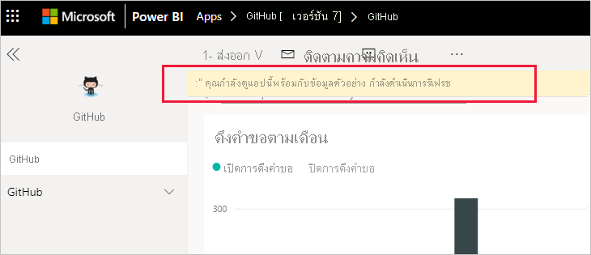

   ข้อมูลรายงานของคุณจะรีเฟรชโดยอัตโนมัติหนึ่งครั้งต่อวัน เว้นแต่ว่าคุณจะปิดใช้งานการดำเนินการนี้ในระหว่างกระบวนการลงชื่อเข้าใช้ นอกจากนี้ คุณยังสามารถ [ตั้งค่าตารางเวลาการรีเฟรชของคุณเอง](./refresh-scheduled-refresh.md) เพื่อรักษาข้อมูลรายงานให้เป็นปัจจุบันหากคุณต้องการ

## ปรับแต่งและแชร์แอป

หลังจากที่คุณเชื่อมต่อกับข้อมูลและการรีเฟรชข้อมูลของคุณเสร็จสมบูรณ์แล้ว คุณสามารถปรับแต่งรายงานและแดชบอร์ดของแอปรวมถึงการแชร์แอปให้กับเพื่อนร่วมงานของคุณได้อีกด้วย อย่างไรก็ตาม โปรดจำไว้ว่าการเปลี่ยนแปลงใดก็ตามที่คุณทำจะถูกเขียนทับเมื่อคุณอัปเดตแอปด้วยเวอร์ชันใหม่ เว้นแต่ว่าคุณจะบันทึกรายการที่คุณเปลี่ยนแปลงภายใต้ชื่อที่แตกต่างกัน [ดูรายละเอียดเกี่ยวกับการเขียนทับ](#overwrite-behavior)

เมื่อต้องการกำหนดค่าและแชร์แอปของคุณ ให้เลือกไอคอนรูปดินสอที่มุมบนขวาของหน้า

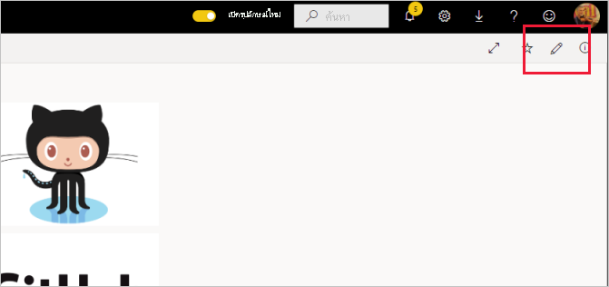

สำหรับข้อมูลเกี่ยวกับการแก้ไขอาร์ทิแฟกต์ในพื้นที่ทำงาน โปรดดู
* [แนะนำตัวแก้ไขรายงานใน Power BI](../create-reports/service-the-report-editor-take-a-tour.md)
* [แนวคิดพื้นฐานสำหรับนักออกแบบในบริการ Power BI](../fundamentals/service-basic-concepts.md)

หลังจากที่คุณทำการเปลี่ยนแปลงใดก็ตามที่คุณต้องการทำกับอาร์ทิแฟกต์ในพื้นที่ทำงาน คุณก็พร้อมที่จะเผยแพร่และแชร์แอป ดู [เผยแพร่แอปของคุณ](../collaborate-share/service-create-distribute-apps.md#publish-your-app) เพื่อเรียนรู้วิธีการทำเช่นนี้

## อัปเดตแอปเทมเพลต

ในบางครั้ง ผู้สร้างแอปเทมเพลตจะปล่อยแอปเทมเพลตรุ่นใหม่ที่มีการปรับปรุง ผ่าน AppSource ลิงก์โดยตรง หรือทั้งสองทางอย่างใดอย่างหนึ่ง

หากคุณดาวน์โหลดแอปจาก AppSource ในครั้งแรก เมื่อเวอร์ชันใหม่ของแอปเทมเพลตพร้อมใช้งาน คุณจะได้รับการแจ้งเตือนสองวิธี:
* แบนเนอร์การอัปเดตที่ปรากฏในบริการของ Power BI แจ้งให้คุณทราบว่ามีแอปเวอร์ชันใหม่ที่พร้อมใช้งาน
  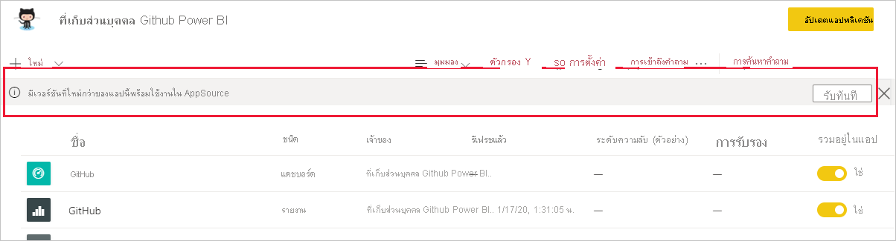
* คุณได้รับการแจ้งเตือนในบานหน้าต่างการแจ้งเตือนของ Power BI

  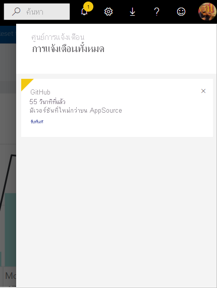

>[!NOTE]
>ถ้าแรกเริ่มคุณได้รับแอปผ่านลิงก์โดยตรงแทนที่จะผ่าน AppSource วิธีเดียวที่จะทราบว่าเมื่อไรที่มีเวอร์ชันใหม่พร้อมใช้งานคือการติดต่อผู้สร้างแอปเทมเพลต

  หากต้องการติดตั้งการอัปเดต ให้คลิก **รับ** บนแบนเนอร์การแจ้งเตือนหรือในศูนย์การแจ้งเตือน หรือค้นหาแอปอีกครั้งใน AppSource และเลือก **รับทันที** ถ้าคุณมีลิงก์โดยตรงสำหรับการอัปเดตจากผู้สร้างแอปเทมเพลต เพียงคลิกที่ลิงก์
  
  ระบบจะถามว่าคุณต้องการเขียนทับเวอร์ชันปัจจุบัน หรือติดตั้งเวอร์ชันใหม่ในพื้นที่ทำงานใหม่หรือไม่ ตามค่าเริ่มต้น "เขียนทับ" จะถูกเลือก

  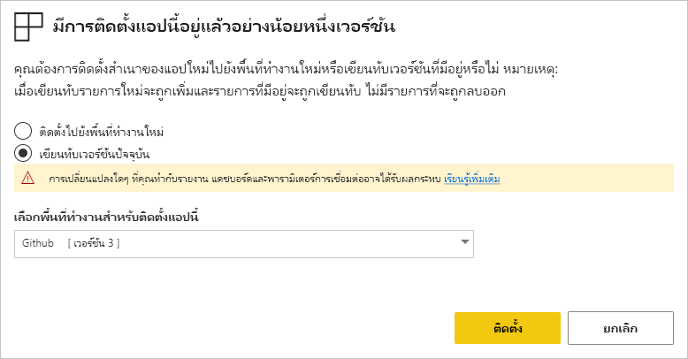

- **เขียนทับเวอร์ชั่นปัจจุบัน:** เขียนทับพื้นที่ทำงานเป็นเวอร์ชั่นอัปเดตของแอปเทมเพลต [ดูรายละเอียดเกี่ยวกับการเขียนทับ](#overwrite-behavior)

- **ติดตั้งไปยังพื้นที่ทำงานใหม่:** ติดตั้งพื้นที่ทำงานและแอปเวอร์ชันใหม่ล่าสุดที่คุณต้องการกำหนดค่าอีกครั้ง (นั่นคือ เชื่อมต่อกับข้อมูล กำหนดการนำทางและสิทธิ์อนุญาต)

### รูปแบบการเขียนทับ

* เขียนทับข้อมูลอัปเดตรายงาน แดชบอร์ด และชุดข้อมูบภายในพื้นที่ทำงาน ไม่ใช่แอป การเขียนทับไม่ได้เป็นการเปลี่ยนการนำทางของแอป การตั้งค่าและสิทธิ์อนุญาต
* หลังจากอัปเดตพื้นที่ทำงาน **คุณจะต้องอัปเดตแอปเพื่อปรับใช้การเปลี่ยนแปลงจากพื้นที่ทำงานดังกล่าวไปยังแอป**
* การเขียนทับจะยังคงเก็บค่าพารามิเตอร์และการตรวจรับรองที่กำหนดค่าไว้ หลังการอัปเดต การรีเฟรชชุดข้อมูลอัตโนมัติจะเริ่มต้นขึ้น **ในระหว่างการรีเฟรชนี้ แอป รายงาน และแดชบอร์ดแสดงข้อมูลตัวอย่าง**

  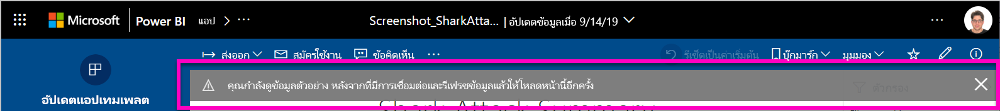

* การเขียนทับจะเป็นการนำเสนอข้อมูลตัวอย่างจนกว่าการรีเฟรชจะเสร็จสิ้น หากผู้สร้างแอปเทมเพลตทำการแก้ไขชุดข้อมูลหรือพารามิเตอร์ ผู้ใช้พื้นที่ทำงานและแอปจะมองไม่เห็นข้อมูลใหม่จนกว่าการรีเฟรชจะเสร็จสมบูรณ์ แต่พวกเขาจะยังคงเห็นข้อมูลตัวอย่างในช่วงเวลานี้
* การเขียนทับไม่ได้เป็นการลบรายงานหรือแดชบอร์ดใหม่ที่คุณเพิ่งเพิ่มไปยังพื้นที่ทำงาน โดยจะเป็นการเขียนทับรายงานและแดชบอร์ดเดิมที่มีการเปลี่ยนแปลงจากผู้สร้างเดิมเท่านั้น

>[!IMPORTANT]
>อย่าลืม[อัปเดตแอป](#customize-and-share-the-app)หลังจากเขียนทับเพื่อปรับใช้การเปลี่ยนแปลงกับรายงานและแดชบอร์ดสำหรับผู้ใช้แอพหน่วยงานของคุณ

## ลบแอปเทมเพลต

แอปเทมเพลตที่ติดตั้งแล้วประกอบด้วยแอปและพื้นที่ทํางานที่เกี่ยวข้อง หากคุณต้องการลบแอปเทมเพลต คุณมีสองตัวเลือก:
* **ลบแอปและพื้นที่ทํางานที่เกี่ยวข้องออกโดยสมบูรณ์**: หากต้องการลบแอปเทมเพลตและพื้นที่ทำงานที่เกี่ยวข้อง ให้ไปที่ไทล์แอปบนหน้าแอป เลือกไอคอนถังขยะ จากนั้นจึงคลิก **ลบ** ในกล่องโต้ตอบที่ปรากฏขึ้น
* **ยกเลิกการเผยแพร่แอป**: ตัวเลือกนี้จะลบแอป แต่เก็บพื้นที่ทํางานที่เกี่ยวข้องไว้ ตัวเลือกนี้มีประโยชน์ เช่น หากมีการปรับแต่งที่คุณต้องการเก็บไว้

    วิธียกเลิกการเผยแพร่แอป:
    1. เปิดแอป
    1. คลิกที่ไอคอนดินสอแก้ไขแอป เพื่อเปิดพื้นที่ทํางานของแอปเทมเพลต
    1. ในพื้นที่ทํางานของแอปเทมเพลต ให้เลือก **ตัวเลือกเพิ่มเติม (...)** จากนั้นเลือก **ยกเลิกการเผยแพร่แอป**

        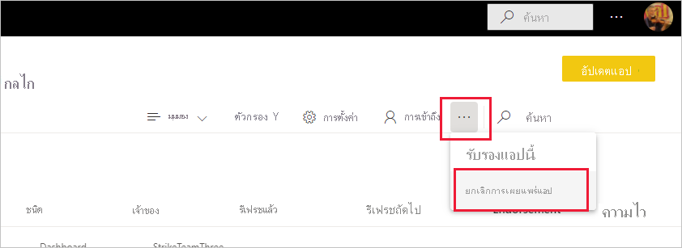

## ขั้นตอนถัดไป

[สร้างพื้นที่ทำงานกับเพื่อนร่วมงานของคุณใน Power BI](../collaborate-share/service-create-the-new-workspaces.md)
