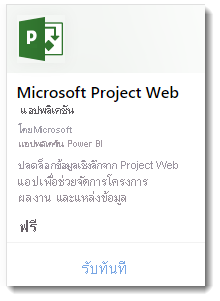
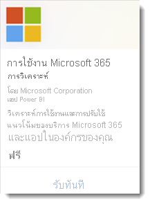
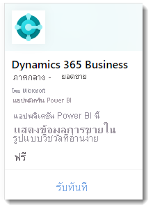
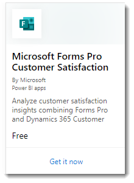

# แอปแม่แบบ Power BI คืออะไรWhat are Power BI template apps?

แอป *แม่แบบ Power BI* ใหม่เปิดให้คู่ค้า Power BI สร้างแอป Power BI ด้วยโค๊ดเพียงเล็กน้อยหรือไม่มีเลย และปรับใช้กับลูกค้า Power BI ทุกท่านThe new Power BI *template apps* enable Power BI partners to build Power BI apps with little or no coding, and deploy them to any Power BI customer.  บทความนี้คือภาพรวมของโปรแกรมแอปแม่แบบ Power BIThis article is an overview of the Power BI template app program.

ในสถานะคู่ค้าของ Power BI คุณสร้างชุดเนื้อหานอกกรอบของลูกค้าของคุณและเผยแพร่ด้วยตัวของคุณเองAs a Power BI partner, you create a set of out-of-the-box content for your customers and publish it yourself.  

คุณสร้างแอปแม่แบบที่ช่วยให้ลูกค้าของคุณสามารถเชื่อมต่อและสร้างอินสแตนซ์ภายในบัญชีของตนเองYou build template apps that allow your customers to connect and instantiate within their own accounts. ในฐานะเป็นผู้เชี่ยวชาญด้านโดเมน พวกเขาสามารถปลดล็อกข้อมูลในลักษณะที่ผู้ใช้งานทางธุรกิจสามารถใช้งานได้อย่างง่ายดายAs domain experts, they can unlock the data in a way that's easy for their business users to consume.  

คุณส่งแอปเทมเพลตไปยัง Partner CenterYou submit a template apps to the Partner center. แอปจะสามารถใช้งานได้อย่างสาธารณะใน [Power BI Apps marketplace](https://app.powerbi.com/getdata/services) และ [Microsoft AppSource](https://appsource.microsoft.com/?product=power-bi).The apps then become publicly available in the [Power BI Apps marketplace](https://app.powerbi.com/getdata/services) and on [Microsoft AppSource](https://appsource.microsoft.com/?product=power-bi). นี่คือภาพรวมระดับสูงที่ประสบการณ์การสร้างแอปเทมเพลตสาธารณะHere's a high-level look at the public template app creation experience.

## Power BI Apps marketplacePower BI Apps marketplace

Power BI Template Apps อนุญาตให้ Power BI Pro หรือผู้ใช้ Power BI Premium สามารถเข้าถึงรายงานและแดชบอร์ดเชิงลึกที่สามารถเชื่อมต่อกับแหล่งข้อมูลแบบสดๆ ได้Power BI Template Apps allow Power BI Pro or Power BI Premium users to gain immediate insights through prepackaged dashboards and reports that can be connected to live data sources. Power BI Apps หลายๆ ตัวพร้อมใช้แล้วใน [Power BI Apps marketplace](https://app.powerbi.com/getdata/services).Many Power BI Apps are already available in the [Power BI Apps marketplace](https://app.powerbi.com/getdata/services).

:::row:::
    :::column:::
        
    :::column-end:::
    :::column:::
        
    :::column-end:::
    :::column:::
        
    :::column-end:::
    :::column:::
        
    :::column-end:::
:::row-end:::

## กระบวนการProcess
ขั้นตอนทั่วไปในการพัฒนาและการส่งแอปเทมเพลตที่มีหลายขั้นตอนThe general process to develop and submit a template app involves several stages. ขั้นตอนบางอย่างสามารถรวมกิจกรรมมากกว่าหนึ่งรายการในเวลาเดียวกันSome stages can include more than one activity at the same time.

| ขั้นStage | Power BI DesktopPower BI Desktop |  |บริการ power BIPower BI service  |  |ศูนย์คู่ค้าPartner Center  |
|---|--------|--|---------|---------|---------|
| **หนึ่ง****One** | สร้างแบบจำลองข้อมูลและรายงานในไฟล์ .pbixBuild a data model and report in a .pbix file |  | สร้างพื้นที่ทำงานCreate a workspace. นำเข้าไฟล์ .pbixImport .pbix file. สร้างแดชบอร์ดเพิ่มเติมCreate a complementary dashboard  |  | ลงทะเบียนเป็นคู่ค้าRegister as a partner |
| **สอง****Two** |  |  | สร้างแพคเกจทดสอบและเรียกใช้การตรวจสอบภายในCreate a test package and run internal validation        |  | |
| **สาม****Three** | |  | เลื่อนระดับแพคเกจทดสอบเป็นเตรียมการผลิตสำหรับการตรวจสอบนอกผู้เช่า Power BI ของคุณและส่งไปที่ AppSourcePromote the test package to preproduction for validation outside your Power BI tenant, and submit it to AppSource  |  | แพคเกจเตรียมการผลิตของคุณ สร้างแอปแม่แบบ Power BI และเริ่มกระบวนการตรวจสอบWith your preproduction package, create a Power BI template app offer and start the validation process |
| **สี่****Four** | |  | เลื่อนระดับแพคเกจเตรียมการผลิตไปเป็นการผลิตPromote the preproduction package to production |  | ถ่ายทอดสดGo live |

## ก่อนที่คุณเริ่มต้นBefore you begin

สร้างแอปแม่แบบ คุณต้องมีสิทธิ์เข้าถึงเพื่อสร้างแอปแม่แบบTo create the template app, you need permissions to create one. ดูพอร์ทัลของผู้ดูแลระบบ Power BI การตั้งค่าแอปแม่แบบสำหรับรายละเอียดSee the Power BI admin portal, Template app settings for details. 

การเผยแพร่เป็นแอปเทมเพลตไปยังบริการ Power BI และ AppSource คุณต้องมีคุณสมบัติตามข้อกำหนดสำหรับ[กลายเป็นผู้เผยแพร่ใน Partner Center](/azure/marketplace/become-publisher)To publish a template app to the Power BI service and AppSource, you must meet the requirements for [becoming a Partner Center publisher](/azure/marketplace/become-publisher).
 
## ขั้นตอนระดับสูงHigh-level steps

นี่คือขั้นตอนระดับสูงHere are the high-level steps. 

1. [ตรวจสอบข้อกำหนดต่างๆ](#requirements) เพื่อให้แน่ใจว่าคุณได้ปฎิบัติตามข้อกำหนดเหล่านั้น[Review the requirements](#requirements) to make sure you meet them. 

2. สร้างรายงานใน Power BI DesktopBuild a report in Power BI Desktop. ใช้พารามิเตอร์เพื่อให้คุณสามารถบันทึกเป็นไฟล์ที่บุคคลอื่นสามารถใช้ได้Use parameters so you can save it as a file other people can use. 

3. สร้างพื้นที่ทำงานสำหรับแอปแม่แบบของคุณในผู้เช่าของคุณบนบริการ Power BI (app.powerbi.com)Create a workspace for your template app in your tenant on the Power BI service (app.powerbi.com). 

4. นำเข้าไฟล์.pbix และเพิ่มเนื้อหาเช่นแดชบอร์ดลงในแอปของคุณImport your .pbix file and add content such as a dashboard to your app. 

5. สร้างแพคเกจทดสอบเพื่อทดสอบแอปแม่แบบด้วยตนเองภายในองค์กรของคุณCreate a test package to test the template app yourself within your organization. 

6. เลื่อนระดับแอปทดสอบเป็นก่อนเตรียมการผลิตเพื่อส่งแอปสำหรับการตรวจสอบความถูกต้องใน AppSource และเพื่อทำการทดสอบภายนอกผู้เช่าของคุณเองPromote the test app to pre-production to submit the app for validation in AppSource, and to test outside your own tenant. 

7. ส่งเนื้อหาไปที่ [Partner Center](/azure/marketplace/partner-center-portal/create-power-bi-app-offer) เพื่อทำการเผยแพร่Submit the content to [Partner center](/azure/marketplace/partner-center-portal/create-power-bi-app-offer) for publishing. 

8. ทำให้ข้อเสนอของคุณไปยัง 'ถ่ายทอดสด' ใน AppSource และย้ายแอปของคุณไปยังการผลิตใน Power BIMake your offer go 'Live' in AppSource, and move your app to production in Power BI.

9. ตอนนี้ คุณสามารถเริ่มพัฒนาเวอร์ชันถัดไปในพื้นที่ทำงานที่มีอยู่ของคุณ ในการเตรียมการผลิตNow you can start developing the next version in the same workspace, in preproduction. 

## ข้อกำหนดRequirements

สร้างแอปแม่แบบ คุณต้องมีสิทธิ์เข้าถึงเพื่อสร้างแอปแม่แบบTo create the template app, you need permissions to create one. ดู[พอร์ทัลของผู้ดูแลระบบ Power BI การตั้งค่าแอปแม่แบบ](../admin/service-admin-portal.md#template-apps-settings)สำหรับรายละเอียดSee the Power BI [admin portal, Template app settings](../admin/service-admin-portal.md#template-apps-settings) for details.

การเผยแพร่เป็นแอปเทมเพลตไปยังบริการ Power BI และ AppSource คุณต้องมีคุณสมบัติตามข้อกำหนดสำหรับ[กลายเป็นผู้เผยแพร่ใน Partner Center](/azure/marketplace/become-publisher)To publish a template app to the Power BI service and AppSource, you must meet the requirements for [becoming a Partner Center publisher](/azure/marketplace/become-publisher).
 > [!NOTE] 
 > การส่งแอปแม่แบบจะได้รับการจัดการใน [Partner Center](/azure/marketplace/partner-center-portal/create-power-bi-app-offer)Template apps submissions are managed in [Partner Center](/azure/marketplace/partner-center-portal/create-power-bi-app-offer). ใช้บัญชีที่ลงทะเบียนเดียวกันในศูนย์นักพัฒนา Microsoft เพื่อลงชื่อเข้าใช้Use the same Microsoft Developer Center registration account to sign in. คุณควรมีบัญชี Microsoft บัญชีเดียวเท่านั้นสำหรับข้อเสนอ AppSource ของคุณYou should have only one Microsoft account for your AppSource offerings. ไม่ควรมีบัญชีเฉพาะกับแต่ละบริการหรือข้อเสนอAccounts shouldn't be specific to individual services or offers.

## เคล็ดลับTips 

- ตรวจสอบให้แน่ใจว่า แอปของคุณรวมถึงข้อมูลตัวอย่างสามารถเริ่มต้นใช้งานในการคลิกเดียวMake sure your app includes sample data to get everyone started in a click. 
- ตรวจสอบแอปพลิเคชันของคุณอย่างรอบครอบโดยการติดตั้งในผู้เช่าของคุณและผู้เช่าสำรองCarefully examine your application by installing it in your tenant and in a secondary tenant. ตรวจสอบให้แน่ใจว่าลูกค้าได้ดูสิ่งที่คุณต้องการดูเท่านั้นMake sure customers only see what you want them to see. 
- ใช้ AppSource เป็นร้านค้าออนไลน์ของคุณในการโฮสต์แอปพลิเคชันของคุณUse AppSource as your online store to host your application. ด้วยวิธีนี้ทุกคนสามารถใช้ Power BI ค้นหาแอปของคุณได้This way everyone using Power BI can find your app. 
- พิจารณาเสนอชุดเนื้อหามากกว่าหนึ่งชุด สำหรับสถานการณ์ที่แตกต่างกันConsider offering more than one template app for separate unique scenarios. 
- เปิดใช้งานการกำหนดค่าข้อมูล ตัวอย่าง สนับสนุนการเชื่อมต่อแบบกำหนดเองและการกำหนดค่าพารามิเตอร์ ด้วยตัวติดตั้งEnable data customization; for example, support custom connection and parameters configuration by the installer.
- หากคุณเป็น ISV และกําลังกระจายแอปของคุณผ่านบริการเว็บของคุณ ให้พิจารณาการกําหนดค่าพารามิเตอร์อัตโนมัติระหว่างการติดตั้ง เพื่อทําให้สิ่งต่าง ๆ ง่ายขึ้นสําหรับลูกค้าของคุณและเพิ่มโอกาสในการติดตั้งที่ประสบความสําเร็จIf you are an ISV and are distributing your app through your web service, consider automating parameter configuration during installation to make things easier for your customers and to increase the likelihood of a successful installation. ดูรายละเอียดที่[การกำหนดค่าอัตโนมัติของการติดตั้งแอปเทมเพลต](../developer/template-apps/template-apps-auto-install.md)See [Automated configuration of a template app installation](../developer/template-apps/template-apps-auto-install.md) for details.

ดู[เคล็ดลับสำหรับการเขียนแอปแม่แบบใน Power BI](service-template-apps-tips.md) สำหรับคำแนะนำเพิ่มเติมSee [Tips for authoring template apps in Power BI](service-template-apps-tips.md) for more suggestions.

## ข้อจำกัดที่ทราบKnown limitations

| ลักษณะการทำงานFeature | ข้อจำกัดที่ทราบKnown Limitation |
|---------|---------|
|เนื้อหา:  ชุดข้อมูลContents:  Datasets   | ควรมีชุดข้อมูลหนึ่งชุดExactly one dataset should be present. อนุญาตเฉพาะชุดข้อมูลที่สร้างขึ้นใน Power BI Desktop (ไฟล์.pbix)Only datasets built in Power BI Desktop (.pbix files) are allowed.  ไม่ได้รับการสนับสนุน ชุดข้อมูลจากอื่น ๆ แอปแม่แบบ ชุดข้อมูลพื้นที่ทำงานข้าม รายงานแบบแบ่งหน้า (ไฟล์.rdl) เวิร์กบุ๊ก ExcelNot supported: Datasets from other template apps, cross-workspace datasets, paginated reports (.rdl files), Excel workbooks |
|เนื้อหา: แดชบอร์ดContents: Dashboards | ไม่อนุญาตให้ใช้ไทล์แบบเรียลไทม์ (หรืออีกนัยหนึ่งก็คือ ไม่มีการสนับสนุนสำหรับพุชหรือชุดข้อมูลการสตรีม)Real-time tiles aren't allowed (in other words, no support for push or streaming datasets) |
|เนื้อหา: กระแสข้อมูลContents: Dataflows | ไม่ได้รับการสนับสนุน กระแสข้อมูลNot supported: Dataflows |
|เนื้อหาจากไฟล์Contents from files | สนับสนุนเฉพาะไฟล์ .pbixOnly PBIX files are allowed.  ไม่ได้รับการสนับสนุน: แฟ้ม.rdl (รายงานแบบแบ่งหน้า) เวิร์กบุ๊ก ExcelNot supported: .rdl files (paginated reports), Excel workbooks   |
| แหล่งข้อมูลData sources | แหล่งข้อมูลที่สนับสนุนสำหรับระบบคลาวด์ที่ทำกำหนดการรีเฟรชข้อมูลแล้วData sources supported for cloud Scheduled Data refresh are allowed.  ไม่ได้รับการสนับสนุนNot supported: <li>เชื่อมต่อแบบสด (AS Azure ไม่มี)Live connections (no Azure AS)</li> <li>แหล่งข้อมูล (เกตเวย์ส่วนบุคคลและองค์กรไม่ได้รับการสนับสนุน) ในองค์กรOn-premises data sources (personal and enterprise gateways aren't supported)</li> <li>แบบเรียลไทม์ (ไม่มีการสนับสนุนสำหรับชุดข้อมูลแบบพุช)Real time (no support for push dataset)</li> <li>โมเดลแบบรวมComposite models</li></ul> |
| ชุดข้อมูล: พื้นที่ทำงานข้ามDataset: cross-workspace | ชุดข้อมูลพื้นที่ทำงานข้ามไม่ได้รับอนุญาตNo cross-workspace datasets are allowed  |
| พารามิเตอร์คำถามQuery parameters | ไม่ได้รับการสนับสนุน พารามิเตอร์ประเภท "Any" "Date" หรือ "Binary" บล็อกการดำเนินการรีเฟรชสำหรับชุดข้อมูลNot supported: Parameters of type "Any", "Date" or "Binary" type block refresh operation for dataset |
| วิชวล Power BIPower BI visuals | สนับสนุนเฉพาะวิชวล Power BI ที่พร้อมใช้งานแบบสาธารณะOnly publicly available Power BI visuals are supported. ไม่สนับสนุน[วิชวล Power BI ขององค์กร](../developer/visuals/power-bi-custom-visuals-organization.md)[Organizational Power BI visuals](../developer/visuals/power-bi-custom-visuals-organization.md) not supported |
| บริการคลาวด์สาธารณะSovereign clouds | แอปเทมเพลตไม่สามารถใช้งานได้ในบริการคลาวด์สาธารณะTemplate apps are not available in sovereign clouds |

## การสนับสนุนSupport
สำหรับการสนับสนุนในระหว่างการพัฒนา กรุณาใช้ [https://powerbi.microsoft.com/support](https://powerbi.microsoft.com/support)For support during development, use [https://powerbi.microsoft.com/support](https://powerbi.microsoft.com/support). เรากำลังตรวจสอบและจัดการไซต์นี้We actively monitor and manage this site. ปัญหาของลูกค้าจะไปถึงทีมงานที่เกี่ยวข้องได้อย่างรวดเร็วCustomer incidents quickly find their way to the appropriate team.

## ขั้นตอนถัดไปNext steps

[สร้างแอปแม่แบบCreate a template app](service-template-apps-create.md)