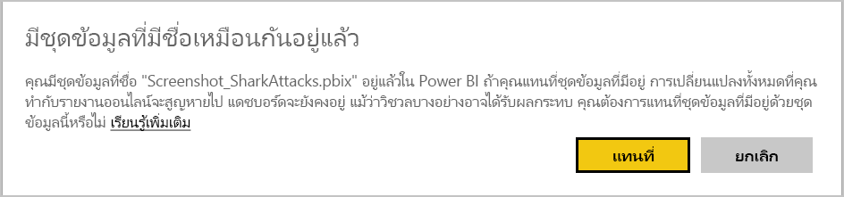
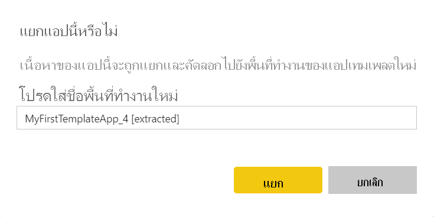

# อัปเดต ลบ และแยกแอปแม่แบบUpdate, delete, and extract template app

หลังจากที่แอปของคุณอยู่ในผลิต คุณสามารถเริ่มต้นในขั้นตอนการทดสอบโดยไม่รบกวนแอปในการผลิตNow that your app is in production, you can start over in the test phase, without disrupting the app in production.
## อัปเดตแอปของคุณUpdate your app

หากคุณทำการแก้ไขเดสก์ทอป Power BI ให้เริ่มจากขั้นตอนที่ (1)If you made the changes in Power BI Desktop, start at step (1). หากคุณไม่ได้ทำการเปลี่ยนแปลงใด ๆ ในเดสก์ทอป Power BI ให้เริ่มขั้นตอนที่ (4)If you did not make the changes in Power BI Desktop, start at step (4).

1. อัปโหลดชุดข้อมูลที่อัปเดตแล้วและเขียนทับชุดข้อมูลที่มีอยู่Upload the updated dataset and overwrite the existing dataset. **อย่าลืมใช้ชื่อชุดข้อมูลให้เหมือนกัน****Make sure to use the exact same dataset name**. การใช้ชื่ออื่นจะทำให้เกิดชุดข้อมูลใหม่สำหรับผู้ใช้ที่กำลังอัปเดตแอพUsing a different name will create a new dataset for users that are updating the app.

1. นำเข้าไฟล์ pbix จากคอมพิวเตอร์ของคุณImport the pbix file from your computer.

1. ยืนยันการเขียนทับConfirm the overwrite.

1. ในบานหน้าต่าง **การจัดการวางจำหน่าย** เลือก **สร้างแอป**In the **Release management** pane, select **Create app**.
1. ย้อนกลับผ่านขั้นตอนการสร้างแอปGo back through the app creation process.
1. หลังจากที่คุณได้ตั้งค่า **Branding**, **เนื้อหา**, **ควบคุม** และ **Access** คุณเลือก **สร้างแอป** อีกครั้งAfter you've set **Branding**, **Content**, **Control**, and **Access**, select **Create app** again.
1. เลือก **ปิด** และกลับไปยัง **การจัดการวางจำหน่าย**Select **Close** and go back to **Release management**.

   คุณเห็นว่าคุณมีสองเวอร์ชันในขณะนี้: เวอร์ชันในผลิต รวมถึงเวอร์ชันใหม่ในการทดสอบYou see you have two versions now: The version in production, plus a new version in testing.

    

1. เมื่อคุณพร้อมที่จะเลื่อนระดับแอปของคุณไปยังการผลิตล่วงหน้าสำหรับการทดสอบภายนอกผู้เช่าของคุณเพิ่มเติม **ย้อนกลับไปที่บานหน้าต่างการจัดการวางจำหน่าย** **และเลือก เลื่อนแอป ถัดจากการทดสอบ**When you're ready to promote your app to pre-production for further testing outside your tenant, go back to the Release Management pane and select **Promote app** next to **Testing**.

   ขณะนี้คุณมีเวอร์ชันในการผลิตและเวอร์ชันในการผลิตล่วงหน้าYou now have a version in production and a version in pre-production.

   

   ขณะนี้ลิงก์ของคุณได้ออนไลน์แล้วYour link is now live. **โปรดทราบว่าปุ่มเลื่อนระดับแอปในระยะก่อนการผลิตจะเป็นสีเทา** นี่คือเพื่อป้องกันการเขียนทับลิงก์การผลิตแบบสดไปยังเวอร์ชันแอปปัจจุบันโดยไม่ตั้งใจก่อนที่ Cloud Partner Portal จะตรวจสอบและอนุมัติเวอร์ชันแอปใหม่**Note that the Promote app button at the pre-production stage is greyed out**. This is to prevent accidentally overwriting the live production link to the current app version before the Cloud Partner Portal has validated and approved the new app version.

1. ส่งลิงก์ของคุณไปยังพอร์ทัล Cloud Partner (CPP) อีกครั้งโดยทำตามขั้นตอนที่ [การอัปเดตข้อเสนอของแอป Power BI](/azure/marketplace/cloud-partner-portal/power-bi/cpp-update-existing-offer)Submit your link again to the Cloud Partner Portal (CPP) by following the steps at [Power BI App offer update](/azure/marketplace/cloud-partner-portal/power-bi/cpp-update-existing-offer). จากพอร์ทัล Cloud Parnter คุณจะต้อง **เผยแพร่** ข้อเสนอของคุณอีกครั้ง และผ่านการตรวจสอบและอนุมัติแล้วIn the Cloud Partner Portal, you must **publish** your offer again and have it validated and approved.

   เมื่อข้อเสนอของคุณได้รับอนุมัติแล้ว ปุ่มเลื่อนระดับแอปจะเปิดใช้งานอีกครั้งWhen your offer is approved, the Promote app button will become active again. 
1. เลื่อนระดับแอปของคุณไปยังขั้นตอนการผลิตPromote your app to the production stage.
   
### อัปเดตพฤติกรรมUpdate behavior

1. การอัปเดตแอปจะช่วยให้ผู้ติดตั้งแอปเทมเพลตสามารถ[อัปเดตแอปเทมเพลต](service-template-apps-install-distribute.md#update-a-template-app)ในพื้นที่ทำงานที่ติดตั้งไว้แล้วโดยที่การกำหนดค่าการเชื่อมต่อไม่หายไปUpdating the app will allow the installer of the template app to [Update a template app](service-template-apps-install-distribute.md#update-a-template-app) in the already installed workspace without losing the connection configuration.
1. ดูใน[รูปแบบการเขียนทับ](service-template-apps-install-distribute.md#overwrite-behavior)ของตัวติดตั้งเพื่อเรียนรู้เกี่ยวกับการปรับเปลี่ยนในชุดข้อมูลที่จะมีผลต่อแอปเทมเพลตที่ติดตั้งSee installer [overwrite behavior](service-template-apps-install-distribute.md#overwrite-behavior) to learn how changes in the dataset affect the installed template app.
1. ขณะอัปเดต (เขียนทับ) แอปเทเพลต จะมีการย้อนกลับไปที่ข้อมูลตัวอย่างและทำการเชื่อมต่อใหม่อัตโนมัติกับการกำหนดค่าของผู้ใช้ (พารามิเตอร์และการรับรองความถูกต้อง)When updating (overwriting) a template app, it first reverts back to sample data and will automatically reconnect with user's configuration (parameters & authentication). จนกว่าการรีเฟรชจะเสร็จสิ้น รายงาน แดชบอร์ดและแอปของหน่วยงานจะมีมีอยู่ในแบนเนอร์ข้อมูลตัวอย่างUntil refresh is complete, the reports, dashboards, and org app will present the sample data banner.
1. หากคุณเพิ่มพารามิเตอร์การสืบค้นไปยังชุดข้อมูลที่อัพปเดตที่ต้องการข้อมูลจากผู้ใช้ - คุณจะต้องทำเครื่องหมายในช่อง *จำเป็น*If you added a new query parameter to the updated dataset that requires users input - you must check the *required* check box. ซึ่งจะเป็นการแจ้งตัวติดตั้งในสตริงการเชื่อมต่อหลังจากทำการอัปเดตแอพThis will prompt the installer with the connection string after updating the app.
 

## แยกพื้นที่ทำงานExtract workspace
ด้วยความสามารถในการแยกการย้อนกลับเป็นเวอร์ชันก่อนหน้าของแอปเทมเพลตสามารถทำได้ง่ายขึ้น Rolling back to the previous version of a template app is now easier than ever with the extract capability. ขั้นตอนต่อไปนี้จะแยกเวอร์ชันแอปเฉพาะจากขั้นตอนต่าง ๆ ที่เผยแพร่ลงในพื้นที่ทำงานใหม่:The following steps will extract a specific app version from various release stages into a new workspace:

1. ในบานหน้าต่างการจัดการแผยแพร่ กด **(...)** เพิ่มจากนั้น **แยก**In the release management pane, press more **(...)** and then **Extract**.

    
    
2. ในกล่องโต้ตอบ ใส่ชื่อสำหรับพื้นที่ทำงานที่จะแยกออกมาIn dialog box, enter the name for extracted workspace. พื้นที่ทำงานใหม่จะถูกเพิ่มa new workspace will be added.

รีเซ็ตการกำหนดรุ่นของพื้นที่ทำงานใหม่ของคุณ คุณสามารถพัฒนาและกระจายแอปเทมเพลตจากพื้นที่ทำงานใหม่แยกออกมาYour new workspace versioning resets and you can continue to develop and distribute the template app from the newly extracted workspace.

## ลบเวอรชันแอปเทมเพลตDelete template app version
เทมแพลตพื้นที่ทำงานเป็นแหล่งข้อมูลของแอปเทมเพลตแบบกระจายที่ใช้งานอยู่A template workspace is the source of an active distributed template app. เพื่อปกป้องผู้ใช้แอปเทมเพลต ผู้ใช้จะไม่สามารถลบพื้นที่ทำงานโดยไม่ต้องลบเวอร์ชันแอปที่สร้างขึ้นทั้งหมดในพื้นที่ทำงานก่อนหน้านี้ได้To protect the template app users, it's not possible to delete a workspace without first removing all the created app versions in the workspace.
การลบเวอร์ชันแอปยังเป็นการลบลบ URL ของแอปที่ไม่ทำงานอีกแล้วไปด้วยDeleting an app version also deletes the app url that will no longer work.

1. ในบานหน้าต่างการจัดการเผยแพร่ กดเลือกจุดไข่ปลา **(...)** จากนั้น **ลบ**In the release management pane, press select the ellipsis **(...)** and then **Delete**.
 
  

>[!NOTE]
>ต้องแน่ใจว่าจะไม่ลบเวอร์ชันแอปหรือ **AppSource** ที่ลูกค้ากำลังใช้งานอยู่หรือแอปเหล่านั้นไม่สามารถใช้งานได้อีกต่อไปMake sure not to delete app version which are being used by customers or **AppSource** or they will no longer work.

## ขั้นตอนถัดไปNext steps

ดูวิธีการที่ลูกค้าของคุณโต้ตอบกับแอปแม่แบบของคุณใน[ติดตั้ง กำหนดเอง และเผยแพรแอปแม่แบบในองค์กรของคุณ](service-template-apps-install-distribute.md)See how your customers interact with your template app in [Install, customize, and distribute template apps in your organization](service-template-apps-install-distribute.md).

ดู[ข้อเสนอแอปพลิเคชัน BI Power](/azure/marketplace/cloud-partner-portal/power-bi/cpp-power-bi-offer)สำหรับรายละเอียดเกี่ยวกับการแจกจ่ายแอปของคุณSee the [Power BI Application offer](/azure/marketplace/cloud-partner-portal/power-bi/cpp-power-bi-offer) for details on distributing your app.