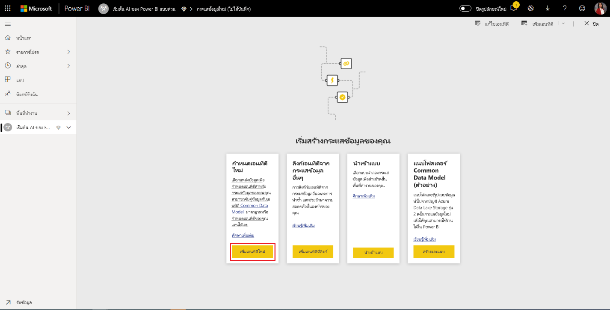
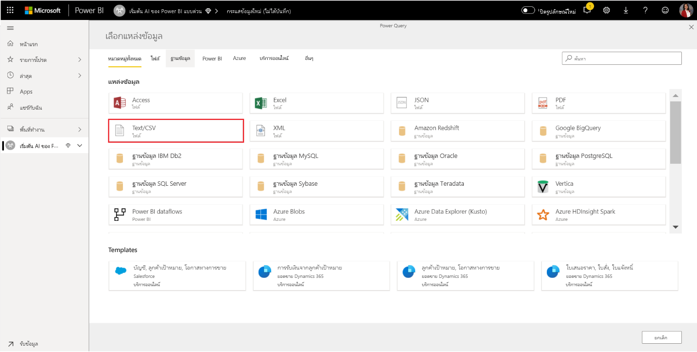
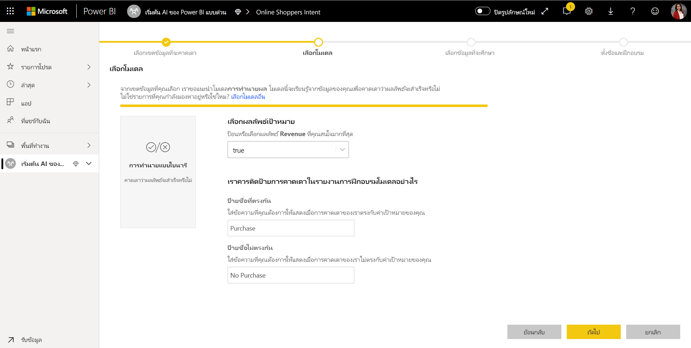
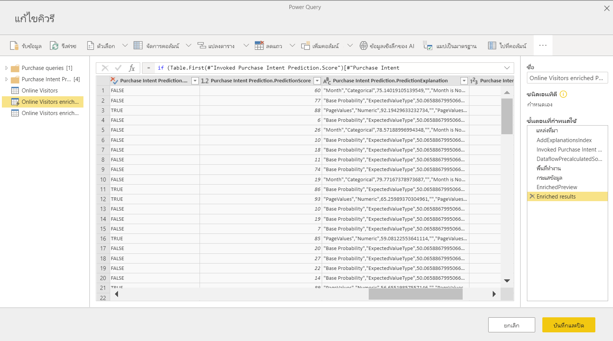

# บทช่วยสอน: สร้างแบบจำลอง Machine Learning ใน Power BITutorial: Build a Machine Learning model in Power BI

ในบทความการบทช่วยสอนนี้คุณใช้ **Machine Learning อัตโนมัติ** เพื่อสร้างและใช้แบบจำลองการคาดการณ์ไบนารีใน Power BIIn this tutorial article, you use **Automated Machine Learning** to create and apply a binary prediction model in Power BI. บทช่วยสอนประกอบด้วยคำแนะนำสำหรับการสร้าง Power BI dataflow และการใช้เอนทิตีที่กำหนดไว้ใน dataflow เพื่อฝึกและตรวจสอบแบบจำลองการเรียนรู้ของเครื่องได้โดยตรงใน Power BIThe tutorial includes guidance for creating a Power BI dataflow, and using the entities defined in the dataflow to train and validate a machine learning model directly in Power BI. จากนั้นเราใช้แบบจำลองดังกล่าวสำหรับการให้คะแนนข้อมูลใหม่เพื่อสร้างการคาดการณ์We then use that model for scoring new data to generate predictions.

ก่อนอื่นคุณจะสร้างเครื่องแบบจำลองการเรียนรู้ไบนารีเพื่อคาดการณ์การซื้อของนักช็อปออนไลน์ที่ยึดตามชุดของแอตทริบิวต์เซสชันออนไลน์ของพวกเขาFirst, you'll create a Binary Prediction machine learning model, to predict the purchase intent of online shoppers based on a set of their online session attributes. ชุดข้อมูลการเรียนรู้ของเครื่อง benchmark ที่ใช้สำหรับการดำเนินการนี้A benchmark machine learning dataset is used for this exercise. เมื่อแบบจำลองได้รับการฝึกใช้งานแล้ว Power BI จะสร้างรายงานการตรวจสอบความถูกต้องโดยอัตโนมัติเพื่ออธิบายผลลัพธ์แบบจำลองOnce a model is trained, Power BI will automatically generate a validation report explaining the model results. จากนั้นคุณสามารถตรวจสอบรายงานการตรวจสอบความถูกต้องและนำรูปแบบไปใช้กับข้อมูลของคุณสำหรับการให้คะแนนได้You can then review the validation report and apply the model to your data for scoring.

บทช่วยสอนนี้ประกอบด้วยขั้นตอนต่อไปนี้:This tutorial consists of following steps:
> [!div class="checklist"]

> * สร้างกระแสข้อมูลด้วยข้อมูลป้อนเข้าCreate a dataflow with the input data
> * สร้างและฝึกอบรมโมเดลการเรียนรู้ของเครื่องCreate and train a machine learning model
> * ตรวจทานรายงานการตรวจสอบความถูกต้องของแบบจำลองReview the model validation report
> * นำแบบจำลองไปใช้กับเอนทิตีกระแสข้อมูลApply the model to a dataflow entity
> * การใช้ผลลัพธ์ที่ได้จากแบบจำลองในรายงาน Power BIUsing the scored output from the model in a Power BI report

## สร้างกระแสข้อมูลด้วยข้อมูลป้อนเข้าCreate a dataflow with the input data

ส่วนแรกของบทช่วยสอนนี้สร้างกระแสข้อมูลด้วยข้อมูลนำเข้าThe first part of this tutorial is to create a dataflow with input data. กระบวนการดังกล่าวใช้เวลาสองถึงสามขั้นตอนดังที่แสดงในส่วนต่อไปนี้โดยเริ่มต้นด้วยการรับข้อมูลThat process takes a few steps, as shown in the following sections, beginning with getting data.

### รับข้อมูลGet data

ขั้นตอนแรกในการสร้างกระแสข้อมูล คือการให้แหล่งข้อมูลของคุณให้พร้อมใช้งานThe first step in creating a dataflow is to have your data sources ready. ในกรณีของเราเราใช้ชุดข้อมูลการเรียนรู้ของเครื่องจากชุดของเซสชันออนไลน์ซึ่งบางส่วนถึงขั้นตอนสุดท้ายของการซื้อIn our case, we use a machine learning dataset from a set of online sessions, some of which culminated in a purchase. ชุดข้อมูลประกอบด้วยชุดของแอตทริบิวต์เกี่ยวกับเซสชันเหล่านี้ซึ่งเราจะใช้สำหรับการฝึกแบบจำลองของเราThe dataset contains a set of attributes about these sessions, which we'll use for training our model.

คุณสามารถดาวน์โหลดชุดข้อมูลจากเว็บไซต์ UC เออร์ไวน์ได้You can download the dataset from the UC Irvine website. นอกจากนี้เรายังมีการใช้งาน UC เออร์ไวน์เพื่อเป็นวัตถุประสงค์ของบทช่วยสอนนี้จากการเชื่อมโยงต่อไปนี้:[ online_shoppers_intention.csv](https://raw.githubusercontent.com/santoshc1/PowerBI-AI-samples/master/Tutorial_AutomatedML/online_shoppers_intention.csv)We also have this available, for the purpose of this tutorial, from the following link: [online_shoppers_intention.csv](https://raw.githubusercontent.com/santoshc1/PowerBI-AI-samples/master/Tutorial_AutomatedML/online_shoppers_intention.csv).

### สร้างเอนทิตีCreate the entities

หากต้องสร้างเอนทิตีในกระแสข้อมูลของคุณ ให้ลงชื่อเข้าใช้บริการของ Power BI และนำทางไปยังพื้นที่ทำงานบนความจุของคุณที่มี AI เปิดการใช้งานอยู่To create the entities in your dataflow, sign into the Power BI service and navigate to a workspace on your capacity that has AI enabled.

หากคุณยังไม่มีพื้นที่ทำงาน คุณสามารถสร้างได้โดยเลือก **พื้นที่ทำงาน** ในหน้าต่างนำทางในบริการ Power BI แล้วเลือก **สร้างพื้นที่ทำงาน** ในบานหน้าต่างด้านล่างที่ปรากฏIf you don't already have a workspace, you can create one by selecting **Workspaces** in the nav pane menu in the Power BI service, and select **Create workspace** at the bottom of the panel that appears. ซึ่งจะเปิดแผงทางด้านขวาเพื่อป้อนรายละเอียดพื้นที่ทำงานThis opens a panel on the right to enter the workspace details. ป้อนชื่อพื้นที่ทำงาน และเลือก **ขั้นสูง**Enter a workspace name and select **Advanced**. ยืนยันว่าพื้นที่ทำงานใช้ความจุเฉพาะโดยใช้ปุ่มเรดิโอและกำหนดให้กับอินสแตนซ์ความจุที่มีการเปิดใช้งานการแสดงตัวอย่าง AIConfirm that the workspace uses Dedicated Capacity using the radio button, and that it's assigned to a capacity instance that has the AI preview turned on. จากนั้นเลือก **บันทึก**Then select **Save**.

เมื่อสร้างพื้นที่ทำงานแล้ว คุณสามารถเลือก **ข้าม** ที่ด้านขวาล่างของหน้าจอต้อนรับตามที่แสดงในภาพต่อไปนี้Once the workspace is created, you can select **Skip** in the bottom right of the Welcome screen, as shown in the following image.

 เลือกปุ่ม **สร้าง** ที่ด้านขวาบนของพื้นที่ทำงาน และเลือก **กระแสข้อมูล**Select the **Create** button at the top right of the workspace, and then select **Dataflow**.

เลือก **เอนทิตีใหม่**Select **Add new entities**. การดำเนินการนี้จะเป็นการเปิดใช้งานตัวแก้ไข **Power Query** ในเบราว์เซอร์This launches a **Power Query** editor in the browser.

เลือกไฟล์ **ข้อความ/CSV** เป็นแหล่งข้อมูลที่แสดงในรูปต่อไปนี้Select **Text/CSV File** as a data source, shown in the following image.

ในหน้า **เชื่อมต่อกับแหล่งข้อมูล** ที่ปรากฏถัดไป วางลิงก์ต่อไปนี้ไปยัง _online_shoppers_intention.csv_ ลงในกล่องของ **ไฟล์พาธหรือ URL** แล้วเลือก **ถัดไป**In the **Connect to a data source** page that appears next, paste the following link to the _online_shoppers_intention.csv_ into the **File path or URL** box, and then select **Next**.

`https://raw.githubusercontent.com/santoshc1/PowerBI-AI-samples/master/Tutorial_AutomatedML/online_shoppers_intention.csv`

ตัวแก้ไข Power Query จะแสดงตัวอย่างของข้อมูลจากไฟล์ CSVThe Power Query Editor shows a preview of the data from the CSV file. คุณสามารถเปลี่ยนชื่อคิวรีให้เป็นชื่อเรียกง่ายขึ้นได้โดยการเปลี่ยนแปลงค่าในกล่องชื่อที่พบในบานหน้าต่างด้านขวาYou can rename the query to a friendlier name by changing the value in the Name box found in the right pane. ตัวอย่างเช่น คุณสามารถเปลี่ยนชื่อคิวรีเป็น _ผู้เยี่ยมชมออนไลน์_For example, you could change the Query name to _Online Visitors_.

Power Query อ้างถึงชนิดของคอลัมน์โดยอัตโนมัติPower Query automatically infers the type of columns. คุณสามารถเปลี่ยนชนิดคอลัมน์ได้โดยการคลิกที่ไอคอนชนิดแอตทริบิวต์ที่ด้านบนของส่วนหัวของคอลัมน์You can change the column type by clicking on the attribute type icon at the top of the column header. ในตัวอย่างนี้ เราจะเปลี่ยนชนิดของคอลัมน์รายได้เป็น True/FalseIn this example, we change the type of the Revenue column to True/False.

เลือกปุ่ม **บันทึกและปิด** เพื่อปิดตัวแก้ไข Power QuerySelect the **Save & close** button to close Power Query Editor. ตั้งชื่อกระแสข้อมูล จากนั้นเลือก **บันทึก** ในกล่องตอบโต้ดังที่แสดงในรูปต่อไปนี้Provide a name for the dataflow, and then select **Save** on the dialog, as shown in the following image.

## สร้างและฝึกอบรมโมเดลการเรียนรู้ของเครื่องCreate and train a machine learning model

หากต้องการเพิ่มแบบจำลองการเรียนรู้ของเครื่องให้เลือกปุ่ม **ใช้แบบจำลอง ML** ในรายการการ **ดำเนินการ** สำหรับเอนทิตีพื้นฐานที่ประกอบด้วยข้อมูลการฝึกอบรมและข้อมูลป้ายชื่อของคุณจากนั้นเลือก **เพิ่ม แบบจำลองการเรียนรู้ของเครื่อง**To add a machine learning model, Select the **Apply ML model** button in the **Actions** list for the base entity that contains your training data and label information, and then select **Add a machine learning model**.

ขั้นตอนแรกในการสร้างแบบจำลองการเรียนรู้ของเครื่องของเราคือการระบุข้อมูลในอดีตซึ่งรวมถึงเขตข้อมูลผลลัพธ์ที่คุณต้องการคาดการณ์The first step for creating our machine learning model is to identify the historical data including the outcome field that you want to predict. แบบจำลองจะถูกสร้างขึ้นโดยการเรียนรู้จากข้อมูลนี้The model will be created by learning from this data.

ในกรณีของชุดข้อมูลที่เรากำลังใช้นี่คือเขตข้อมูล **รายได้**In the case of the dataset we're using, this is the **Revenue** field. เลือก **รายได้** เป็นค่า ' เขตข้อมูลผลลัพธ์' จากนั้นเลือก **ถัดไป**Select **Revenue** as the 'Outcome field' value and then select **Next**.

จากนั้น เราจะต้องเลือกชนิดของแบบจำลองการเรียนรู้ของเครื่องที่จะสร้างNext, we must select the type of machine learning model to create. Power BI วิเคราะห์ค่าในเขตข้อมูลผลลัพธ์ที่คุณระบุและแนะนำชนิดของแบบจำลองการเรียนรู้ของเครื่องที่สามารถสร้างขึ้นเพื่อคาดการณ์เขตข้อมูลนั้นได้Power BI analyzes the values in the outcome field that you've identified and suggests the types of machine learning models that can be created to predict that field.

ในกรณีนี้เนื่องจากเรากำลังคาดคะเนผลลัพธ์ไบนารีว่าผู้ใช้จะทำการซื้อหรือไม่ ขอแนะนำให้ใช้การคาดการณ์ไบนารีIn this case since we're predicting a binary outcome of whether a user will make a purchase or not, Binary Prediction is recommended. เนื่องจากเรามีความสนใจในการคาดการณ์ผู้ใช้ที่จะทำการซื้อ ให้เลือก True เป็นผลลัพธ์ด้านรายได้ที่คุณสนใจมากที่สุดSince we are interested in predicting users who will make a purchase, select True as the Revenue outcome that you're most interested in. นอกจากนี้ คุณสามารถกำหนดป้ายชื่อที่เรียกง่ายสำหรับผลลัพธ์ที่จะใช้ในรายงานที่สร้างขึ้นโดยอัตโนมัติ ซึ่งจะสรุปผลลัพธ์ของการตรวจสอบแบบจำลองAdditionally, you can provide friendly labels for the outcomes to be used in the automatically generated report that will summarize the results of the model validation. จากนั้นเลือกถัดไปThen select Next.

ถัดไป Power BI จะทำการสแกนตัวอย่างข้อมูลเบื้องต้น และแนะนำการป้อนค่าที่อาจสร้างการคาดการณ์ที่ถูกต้องมากขึ้นNext, Power BI does a preliminary scan of a sample of your data and suggests the inputs that may produce more accurate predictions. ถ้า Power BI ไม่แนะนำเขตข้อมูล จะมีการกำหนดคำอธิบายไว้ข้าง ๆIf Power BI doesn't recommend a field, an explanation would be provided next to it. คุณมีตัวเลือกในการเปลี่ยนการเลือกเพื่อรวมเฉพาะเขตข้อมูลที่คุณต้องการให้แบบจำลองศึกษา หรือคุณสามารถเลือกเขตข้อมูลทั้งหมดโดยเลือกกล่องกาเครื่องหมายถัดจากชื่อเอนทิตีYou have the option to change the selections to include only the fields you want the model to study, or you can select all the fields by selecting the checkbox next to the entity name. เลือก **ถัดไป** เพื่อยอมรับข้อมูลป้อนเข้าSelect **Next** to accept the inputs.

ในขั้นตอนสุดท้าย เราต้องใส่ชื่อสำหรับแบบจำลองของเราIn the final step, we must provide a name for our model. ตั้งชื่อแบบจำลอง _การคาดการณ์จุดประสงค์ในการซื้อไปใช้_Name the model _Purchase Intent Prediction_. คุณสามารถเลือกที่จะลดเวลาการฝึกเพื่อดูผลลัพธ์อย่างรวดเร็วหรือเพิ่มระยะเวลาที่ใช้ในการฝึกเพื่อให้ได้แบบจำลองที่ดีที่สุดYou can choose to reduce the training time to see quick results or increase the amount of time spent in training to get the best model. จากนั้นเลือก **บันทึกและฝึก** เพื่อเริ่มต้นการฝึกแบบจำลองThen select **Save and train** to start training the model.

กระบวนการฝึกอบรมจะเริ่มต้นด้วยการสุ่มตัวอย่างและ normalizing ข้อมูลในอดีตของคุณและแยกชุดข้อมูลของคุณลงในสองเอนทิตีใหม่ _การซื้อการคาดการณ์การดำเนินการ_ และ _การทดสอบการคาดการณ์เจตนาการซื้อข้อมูล_ ได้The training process will begin by sampling and normalizing your historical data and splitting your dataset into two new entities _Purchase Intent Prediction Training Data_ and _Purchase Intent Prediction Testing Data_.

ทั้งขึ้นอยู่กับขนาดของชุดข้อมูล กระบวนการฝึกอบรมสามารถใช้ที่ใดก็ได้จากไม่กี่นาทีจนถึงเวลาการฝึกอบรมที่เลือกในหน้าจอก่อนหน้าDepending on the size of the dataset, the training process can take anywhere from a few minutes to the training time selected at the previous screen. ในขั้นตอนนี้คุณสามารถดูแบบจำลองในแท็บ **แบบจำลองการเรียนรู้ของเครื่อง** ของกระแสข้อมูลAt this point, you can see the model in the **Machine learning models** tab of the dataflow. สถานะพร้อมแล้วแสดงว่าแบบจำลองได้รับการจัดคิวสำหรับการฝึกหรืออยู่ระหว่างการฝึกThe Ready status indicates that the model has been queued for training or is under training.

คุณสามารถยืนยันว่าแบบจำลองกำลังได้รับการฝึกและผ่านการตรวจสอบความถูกต้องผ่านสถานะของกระแสข้อมูลYou can confirm that the model is being trained and validated through the status of the dataflow. การดำเนินการนี้จะปรากฏขึ้นเป็นการรีเฟรชข้อมูลในแท็บ **กระแสข้อมูล** ของพื้นที่ทำงานThis appears as a data refresh in progress in the **Dataflows** tab of the workspace.

เมื่อการฝึกแบบจำลองเสร็จสมบูรณ์กระแสข้อมูล จะแสดงเวลาการรีเฟรชที่อัปเดตแล้วOnce the model training is completed, the dataflow displays an updated refresh time. คุณสามารถยืนยันว่าแบบจำลองได้รับการฝึกแล้วโดยการนำทางไปยังแท็บ **แบบจำลองการเรียนรู้ของเครื่อง** ในกระแสข้อมูลYou can confirm that the model is trained, by navigating to the **Machine learning models** tab in the dataflow. แบบจำลองที่คุณสร้างขึ้นควรแสดงสถานะเป็น **ฝึกแล้ว** และ **เวลาที่ฝึกครั้งล่าสุด** ควรได้รับการอัปเดตThe model you created should show status as **Trained** and the **Last Trained time** should now be updated.

## ตรวจทานรายงานการตรวจสอบความถูกต้องของแบบจำลองReview the model validation report
หากต้องการตรวจสอบรายงานการตรวจสอบความถูกต้องของแบบจำลองในแท็บแบบจำลองการเรียนรู้ของเครื่อง ให้เลือกปุ่มรายงานการฝึกในคอลัมน์การดำเนินการสำหรับแบบจำลองTo review the model validation report, in the Machine learning models tab, select the View training report button in the Actions column for the model. รายงานนี้จะอธิบายวิธีการแบบจำลองการเรียนรู้ของเครื่องของคุณมีแนวโน้มที่จะดำเนินการThis report describes how your machine learning model is likely to perform.

ในหน้า **ประสิทธิภาพของแบบจำลอง** ของรายงาน ให้เลือก **ตัวคาดการณ์ยอดนิยม** เพื่อดูตัวคาดการณ์ยอดนิยมสำหรับแบบจำลองของคุณIn the **Model Performance** page of the report, select See **top predictors** to view the top predictors for your model. คุณสามารถเลือกหนึ่งในตัวคาดการณ์เพื่อดูว่าการกระจายผลลัพธ์เกี่ยวข้องกับตัวคาดการณ์นั้นได้อย่างไรYou can select one of the predictors to see how the outcome distribution is associated with that predictor.

คุณสามารถใช้ตัวแบ่งส่วน **ขีดจำกัดความน่าจะเป็น** บนหน้าประสิทธิภาพของแบบจำลองเพื่อตรวจสอบอิทธิพลของความแม่นยำและการเรียกคืนสำหรับแบบจำลองYou can use the **Probability Threshold** slicer on the Model Performance page to examine its influence on the Precision and Recall for the model.

หน้าอื่นๆของรายงานอธิบายเมตริกประสิทธิภาพเชิงสถิติสำหรับแบบจำลองThe other pages of the report describe the statistical performance metrics for the model.

รายงานยังรวมถึงหน้ารายละเอียดการฝึกอบรมที่อธิบายการเกิดซ้ำต่างๆที่มีการเรียกใช้วิธีการแยกลักษณะการทำงานออกจากอินพุทและ hyperparameters สำหรับแบบจำลองขั้นสุดท้ายที่ใช้The report also includes a Training Details page that describes the different iterations that were run, how features were extracted from the inputs, and the hyperparameters for the final model used.

## นำแบบจำลองไปใช้กับเอนทิตีกระแสข้อมูลApply the model to a dataflow entity

เลือกปุ่ม **ใช้แบบจำลอง** ที่ด้านบนของรายงานเพื่อเรียกแบบจำลองนี้Select the **Apply model** button at the top of the report to invoke this model. ในกล่องโต้ตอบ **นำไปใช้** คุณสามารถระบุเอนทิตีเป้าหมายที่มีข้อมูลต้นทางที่ควรใช้แบบจำลองIn the **Apply** dialog, you can specify the target entity that has the source data to which the model should be applied.

เมื่อได้รับพร้อมท์คุณจะต้อง **รีเฟรช** กระแสข้อมูล เพื่อแสดงตัวอย่างผลลัพธ์ของแบบจำลองของคุณWhen prompted, you must **Refresh** the dataflow to preview the results of your model.

การใช้แบบจำลองจะสร้างเอนทิตีใหม่สองตัวที่มีส่วนต่อท้าย  **<model_name> ที่สมบูรณ์** และ **คำอธิบาย <model_name> ที่สมบูรณ์**.Applying the model will create two new entities, with the suffix **enriched <model_name>** and **enriched <model_name> explanations**. ในกรณีของเรา การนำแบบจำลองไปใช้กับเอนทิตีของ **ผู้เยี่ยมชม ออนไลน์** จะสร้าง **การคาดการณ์จุดประสงค์ในการซื้อที่สมบูรณ์ของผู้เยี่ยมชมออนไลน์** ซึ่งรวมถึงผลลัพธ์ที่คาดการณ์จากแบบจำลอง และ **คำอธิบายการคาดการณ์จุดประสงค์ในการซื้อที่สมบูรณ์ของผู้เยี่ยมชมออนไลผู้เยี่ยมชมออนไลน์** ซึ่งประกอบด้วยอิทธิพลที่เฉพาะเจาะจงของไฟล์ข้อมูลสำหรับการคาดการณ์.In our case, applying the model to the **Online Visitors** entity will create **Online Visitors enriched Purchase Intent Prediction** which includes the predicted output from the model, and **Online Visitors enriched Purchase Intent Prediction explanations** which contains top record-specific influencers for the prediction. 

การใช้แบบจำลองการคาดการณ์ไบนารีจะเพิ่มคอลัมน์ที่สี่ที่มีผลลัพธ์ที่คาดการณ์ คะแนนความน่าจะเป็น อิทธิพลที่เฉพาะเจาะจงของไฟล์ข้อมูล และดัชนีคำอธิบายสำหรับการคาดการณ์ ซึ่งแต่ละคอลัมน์จะขึ้นต้นด้วยชื่อคอลัมน์ที่ระบุApplying a Binary Prediction model adds four columns with predicted outcome, probability score, the top record-specific influencers for the prediction, and explanation index each prefixed with the column name specified.  

เมื่อรีเฟรชกระแสข้อมูลเสร็จสมบูรณ์ คุณสามารถเลือกเอนทิตี **การคาดการณ์จุดประสงค์ในการสั่งซื้อที่สมบูรณ์ของผู้เยี่ยมชมออนไลน์** เพื่อดูผลลัพธ์ได้Once the dataflow refresh is completed, you can select the **Online Visitors enriched Purchase Intent Prediction** entity to view the results.

คุณยังสามารถเรียกใช้แบบจำลอง AutoML ในพื้นที่ทำงานได้โดยตรงจากตัวแก้ไข Power Query ในกระแสข้อมูลของคุณYou can also invoke any AutoML model in the workspace, directly from the Power Query Editor in your dataflow. ในการเข้าถึงแบบจำลอง AutoML ให้เลือกปุ่มแก้ไขสำหรับเอนทิตีที่คุณต้องการเสริมด้วยข้อมูลเชิงลึกจากโมเดล AutoML ของคุณ ตามที่แสดงในภาพต่อไปนี้To access the AutoML models, select the Edit button for the entity that you want to enrich with insights from your AutoML model, as shown in the following image.

การเลือกปุ่ม แก้ไข เพื่อเปิดตัวแก้ไข Power Query สำหรับเอนทิตีในกระแสข้อมูลของคุณSelecting the Edit button opens the Power Query Editor for the entities in your dataflow. เลือกปุ่ม AI Insights ใน RibbonSelect the AI Insights button in the ribbon.

 เลือกโฟลเดอร์แบบจำลองการเรียนรู้ของเครื่อง Power BI จากเมนูบานหน้าต่างนำทางSelect the Power BI Machine Learning Models folder from the nav pane menu. แบบจำลอง AutoML ทั้งหมดที่คุณสามารถเข้าถึงจะแสดงรายการที่นี่โดยเป็นฟังก์ชัน Power QueryAll the AutoML models to which you have access are listed here as Power Query functions. นอกจากนี้พารามิเตอร์อินพุตสำหรับโมเดล AutoML จะถูกแมปโดยอัตโนมัติเป็นพารามิเตอร์ของฟังก์ชัน Power Query ที่เกี่ยวข้องAlso, the input parameters for the AutoML model are automatically mapped as parameters of the corresponding Power Query function. โปรดทราบว่าการแมปพารามิเตอร์อัตโนมัติจะเกิดขึ้นก็ต่อเมื่อชื่อและชนิดข้อมูลของพารามิเตอร์ที่เหมือนกันNote that automatic mapping of parameters happens only if the name and data type of the parameter is the same.
 
ในการเรียกใช้แบบจำลอง AutoML คุณสามารถระบุคอลัมน์ของเอนทิตีที่เลือกมาเป็นข้อมูลเข้าจากเมนูแบบเลื่อนลงTo invoke an AutoML model, you can specify any of the selected entity's columns as an input from the drop-down. นอกจากนี้คุณยังสามารถระบุค่าคงที่เพื่อใช้เป็นข้อมูลป้อนเข้าได้ โดยสลับไอคอนคอลัมน์ไปทางซ้ายของกล่องโต้ตอบที่ป้อนเข้าYou can also specify a constant value to be used as an input by toggling the column icon to the left of the input dialog.

เลือกนำไปใช้ เพื่อดูตัวอย่างผลลัพธ์ของแบบจำลอง AutoML ตามคอลัมน์ใหม่ในตารางเอนทิตีSelect Apply to view the preview of the AutoML model's output as a new columns in the entity table. นอกจากนี้คุณจะเห็นการเรียกแบบจำลองเป็นขั้นตอนที่นำไปใช้สำหรับคิวรีYou will also see the model invocation as an applied step for the query.

เมื่อบันทึกกระแสข้อมูลของคุณแล้ว ระบบจะเรียกแบบจำลองโดยอัตโนมัติเมื่อมีการรีเฟรชกระแสข้อมูล สำหรับแถวใหม่หรือแถวที่ได้รับการอัปเดตใดๆ ในตารางเอนทิตีOnce you save your dataflow, the model is automatically invoked when the dataflow is refreshed, for any new or updated rows in the entity table.

## การใช้ผลลัพธ์ที่ได้จากแบบจำลองในรายงาน Power BIUsing the scored output from the model in a Power BI report

ในการใช้ผลลัพธ์ที่ได้จากการเรียนรู้ของเครื่อง คุณสามารถเชื่อมต่อกับกระแสข้อมูลของคุณจาก Power BI desktop โดยใช้ตัวเชื่อมต่อกระแสข้อมูลได้To use the scored output from your machine learning model you can connect to your dataflow from the Power BI desktop, using the Dataflows connector. เอนทิตี **การคาดการณ์จุดประสงค์ในการซื้อของผู้เยี่ยมชมออนไลน์** สามารถใช้เพื่อรวมการคาดการณ์จากแบบจำลองของคุณในรายงาน Power BI ได้ในขณะนี้The **Online Visitors enriched Purchase Intent Prediction** entity can now be used to incorporate the predictions from your model in Power BI reports.

## ขั้นตอนถัดไปNext steps

ในบทช่วยสอนนี้คุณสร้างและนำไปใช้แบบจำลองการคาดการณ์ไบนารีใน Power BI โดยใช้ขั้นตอนเหล่านี้:In this tutorial, you created and applied a binary prediction model in Power BI using these steps:

* สร้างกระแสข้อมูลด้วยข้อมูลป้อนเข้าCreate a dataflow with the input data
* สร้างและฝึกอบรมโมเดลการเรียนรู้ของเครื่องCreate and train a machine learning model
* ตรวจทานรายงานการตรวจสอบความถูกต้องของแบบจำลองReview the model validation report
* นำแบบจำลองไปใช้กับเอนทิตีกระแสข้อมูลApply the model to a dataflow entity
* การใช้ผลลัพธ์ที่ได้จากแบบจำลองในรายงาน Power BIUsing the scored output from the model in a Power BI report

สำหรับข้อมูลเพิ่มเติมเกี่ยวกับ Machine Learning อัตโนมัติใน Power BI โปรดดูข้อมูลเกี่ยวกับ [ Machine Learning อัตโนมัติใน Power BI](../transform-model/dataflows/dataflows-machine-learning-integration.md)For more information about Machine Learning automation in Power BI, see [Automated Machine Learning in Power BI](../transform-model/dataflows/dataflows-machine-learning-integration.md).