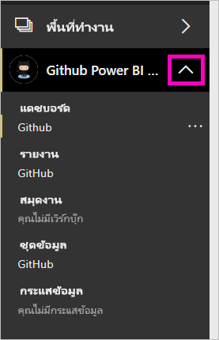
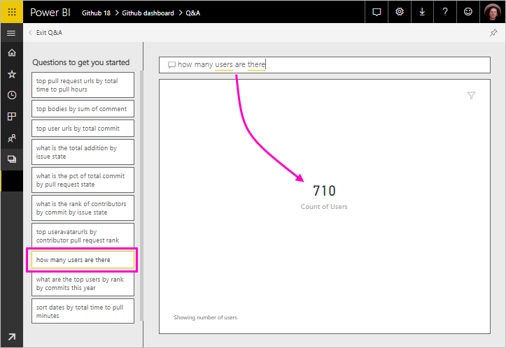
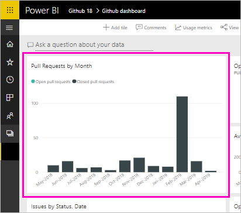

# บทช่วยสอน: เชื่อมต่อกับพื้นที่เก็บของ GitHub ด้วย Power BITutorial: Connect to a GitHub repo with Power BI
ในบทช่วยสอนนี้ คุณเชื่อมต่อกับข้อมูลจริง: ที่เก็บข้อมูลสาธารณะของเนื้อหา Power BI (หรือที่เรียกว่า *ที่เก็บ*) ในบริการ GitHubIn this tutorial, you connect to real data: the Power BI content public repository (also known as a *repo*) in the GitHub service. Power BI จะสร้างแดชบอร์ดและรายงานด้วยข้อมูลโดยอัตโนมัติPower BI automatically creates a dashboard and report with the data. คุณจะเห็นคำตอบสำหรับคำถามเช่น: มีบุคคลกี่คนให้การสนับสนุนที่เก็บสาธารณะของ Power BIYou see answers to questions like: How many people contribute to the Power BI public repo? ใครให้การสนับสนุนมากที่สุดWho contributes the most? วันใดในสัปดาห์ที่มีการสนับสนุนมากที่สุดWhich day of the week has the most contributions? และคำถามอื่นๆAnd other questions. 

คุณสามารถเชื่อมต่อกับที่เก็บ GitHub แบบส่วนตัวหรือสาธารณะของคุณเองได้เช่นกันYou can connect to your own private or public GitHub repos, too. บทความ [เชื่อมต่อกับ GitHub ด้วย Power BI](service-connect-to-github.md) อธิบายวิธีใช้ *แอปเทมเพลต* Power BI เพื่อเชื่อมต่อกับที่เก็บของคุณThe article [Connect to GitHub with Power BI](service-connect-to-github.md) explains how to use a Power BI *template app* to connect to your repos.

ในบทช่วยสอนนี้ คุณจะทำขั้นตอนต่อไปนี้ให้เสร็จสมบูรณ์:In this tutorial, you complete the following steps:

> [!div class="checklist"]
> * ลงทะเบียนบัญชี GitHub ถ้าคุณยังไม่มีบัญชีSign up for a GitHub account, if you don't have one yet 
> * ลงชื่อเข้าใช้บัญชี Power BI ของคุณ หรือลงทะเบียน ถ้าคุณยังไม่มีบัญชีSign in to your Power BI account, or sign up, if you don't have one yet
> * เปิดบริการ Power BIOpen the Power BI service
> * ค้นหาแอป GitHubFind the GitHub app
> * ใส่ข้อมูลสำหรับ Repo GitHub สาธารณะของ Power BIEnter the information for the Power BI public GitHub repo
> * ดูแดชบอร์ดและรายงานด้วยข้อมูล GitHubView the dashboard and report with GitHub data
> * เพิ่มพื้นที่ทรัพยากรโดยการลบแอปClean up resources by deleting the app

ถ้าคุณไม่ได้ลงทะเบียน Power BI ให้[ลงทะเบียนรุ่นทดลองใช้ฟรี](https://app.powerbi.com/signupredirect?pbi_source=web)ก่อนที่คุณจะเริ่มต้นใช้งานIf you're not signed up for Power BI, [sign up for a free trial](https://app.powerbi.com/signupredirect?pbi_source=web) before you begin.

## ข้อกำหนดเบื้องต้นPrerequisites

เมื่อต้องการเรียนรู้บทช่วยสอนนี้ให้เสร็จสมบูรณ์ คุณต้องมีบัญชี GitHub ถ้าคุณยังไม่มีบัญชีTo complete this tutorial, you need a GitHub account, if you don't already have one. 

- ลงทะเบียน [บัญชี GitHub](/contribute/get-started-setup-github)Sign up for a [GitHub account](/contribute/get-started-setup-github).

## วิธีการเชื่อมต่อHow to connect
1. ลงชื่อเข้าใช้บริการ Power BI (`https://app.powerbi.com`)Sign in to the Power BI service (`https://app.powerbi.com`). 
2. ในบานหน้าต่างนำทาง > เลือก **แอป** จากนั้นเลือก **รับแอป**In the nav pane, select **Apps**, then **Get apps**.
   
    

3. เลือก **แอป** พิมพ์ **GitHub** ในกล่องค้นหา > **รับทันที**Select **Apps**, type **GitHub** in the search box > **Get it now**.
   
    

4. ใน **ติดตั้งแอป Power BI นี้หรือไม่** เลือก **ติดตั้ง**In **Install this Power BI App?** select **Install**.
5. ในส่วน **แอปใหม่ของคุณพร้อมแล้ว** เลือก **ไปที่แอป**In **Your new app is ready**, select **Go to app**.
6. ในส่วน **เริ่มต้นใช้งานแอปใหม่ของคุณ** ให้เลือก **เชื่อมต่อ**In **Get started with your new app**, select **Connect**.

    

7. ป้อนชื่อที่เก็บและเจ้าของที่เก็บ RepoEnter the repository name and repository owner of the repo. URL สำหรับ Repo นี้คือ https://github.com/MicrosoftDocs/powerbi-docs ดังนั้น **เจ้าของที่เก็บ** จะเป็น **MicrosoftDocs** และ **ที่เก็บ** จะเป็น **powerbi-docs**The URL for this repo is https://github.com/MicrosoftDocs/powerbi-docs, so **Repository Owner** is **MicrosoftDocs**, and **Repository** is **powerbi-docs**. 
   
    

5. ป้อนข้อมูลประจำตัว GitHub ที่คุณสร้างขึ้นEnter the GitHub credentials you created. Power BI อาจข้ามขั้นตอนนี้ ถ้าคุรลงชื่อเข้าใช้ GitHub ในเบราว์เซอร์ของคุณPower BI might skip this step if you're already signed in to GitHub in your browser. 

6. สำหรับ **วิธีการรับรองความถูกต้อง** ให้เลือก **oAuth2**\> **ลงชื่อเข้าใช้**For **Authentication Method**, keep **oAuth2** selected \> **Sign In**.

7. ทำตามหน้าจอการรับรองความถูกต้องของ GitHubFollow the GitHub authentication screens. มอบสิทธิ์ Power BI ให้กับข้อมูล GitHubGrant Power BI permission to the GitHub data.
   
   ในตอนนี้ Power BI สามารถเชื่อมต่อกับ GitHub และเชื่อมต่อกับข้อมูลNow Power BI can connect with GitHub and connect to the data.  ข้อมูลจะถูกรีเฟรชวันละหนึ่งครั้งThe data is refreshed once a day.

8. หลังจากที่ Power BI นำเข้าข้อมูลแล้ว คุณจะเห็นเนื้อหาของพื้นที่ทำงาน GitHub ใหม่ของคุณAfter Power BI imports the data, you see the contents of your new GitHub workspace. 
9. เลือกลูกศรที่อยู่ถัดจากชื่อพื้นที่ทำงานในหน้าต่างนำทางSelect the arrow next to the workspace name in the nav pane. คุณเห็นพื้นที่ทำงานประกอบด้วยแดชบอร์ดและรายงานYou see the workspace contains a dashboard and a report. 

    

10. เลือก **ตัวเลือกเพิ่มเติม** (...) ที่อยู่ถัดจากชื่อแดชบอร์ด > **เปลี่ยนชื่อ** > พิมพ์ **แดชบอร์ด GitHub**Select **More options** (...) next to the dashboard name > **Rename** > type **GitHub dashboard**.
 
     

8. เลือกไอคอนนำทางส่วนกลางเพื่อลดหน้าต่างนำทาง เพื่อให้มีพื้นที่ว่างเพิ่มเติมSelect the global navigation icon to minimize the nav pane, so you have more room.

    

10. เลือกแดชบอร์ด GitHubSelect your GitHub dashboard.
    
    แดชบอร์ด GitHub ประกอบด้วยข้อมูลสด ดังนั้นค่าที่คุณเห็นอาจแตกต่างกันThe GitHub dashboard contains live data, so the values you see may be different.

    

    

## ถามคำถามAsk a question

1. วางเคอร์เซอร์ของคุณใน **ถามคำถามเกี่ยวกับข้อมูลของคุณ**Put your cursor in **Ask a question about your data**. Power BI มี **คำถามเพื่อให้คุณเริ่มต้นใช้งาน**Power BI offers **Questions to get your started**. 

1. เลือก **จำนวนผู้ใช้ที่มีอยู่**Select **how many users are there**.
 
    

13. ในระหว่าง **จำนวน** และ **ผู้ใช้ที่มีอยู่** ให้พิมพ์ **คำขอดึงข้อมูลต่อ**In between **how many** and **users are there**, type **pull requests per**. 

     Power BI จะสร้างแผนภูมิแท่งที่แสดงจำนวนคำขอดึงข้อมูลต่อบุคคลPower BI creates a bar chart showing the number of pull requests per person.

    

13. เลือกปักหมุดเพื่อปักหมุดไปยังแดชบอร์ดของคุณจากนั้น **ออกจาก Q&A**Select the pin to pin it to your dashboard, then **Exit Q&A**.

## ดูรายงาน GitHubView the GitHub report 

1. ในแดชบอร์ด GitHub ให้เลือกแผนภูมิคอลัมน์ **ดึงข้อมูลคำขอตามเดือน** เพื่อเปิดรายงานที่เกี่ยวข้องIn the GitHub dashboard, select the column chart **Pull Requests by Month** to open the related report.

    

2. เลือกชื่อผู้ใช้ในแผนภูมิ **คำขอดึงข้อมูลทั้งหมดตามผู้ใช้**Select a user name in the **Total pull requests by user** chart. ในตัวอย่างนี้ เราเห็นว่าเวลาส่วนใหญ่ของพวกเขาอยู่ในเดือนกุมภาพันธ์In this example, we see most of their hours were in February.

    

3. เลือกแท็บ **บัตรเจาะรู** เพื่อดูหน้าถัดไปในรายงานSelect the **Punch Card** tab to view the next page in the report. 
 
    

    คุณจะเห็นว่าวันอังคารเวลาบ่าย 3 คือเวลาและวันในสัปดาห์ที่มีการ *ยอมรับ* มากที่สุด เมื่อผู้ใช้เช็คอินงานของพวกเขาApparently Tuesday at 3 pm is the most common time and day of the week for *commits*, when people check in their work.

## เพิ่มพื้นที่ทรัพยากรClean up resources

ในตอนนี้ คุณสำเร็จบทช่วยสอนแล้ว คุณสามารถลบแอป GitHub ได้Now that you've finished the tutorial, you can delete the GitHub app. 

1. ในบานหน้าต่างนำทาง ให้เลือก **Apps**In the nav pane, select **Apps**.
2. วางเมาส์เหนือไทล์ GitHub และเลือกถังขยะ **ลบ**Hover over the GitHub tile and select the **Delete** garbage can.

    

## ขั้นตอนถัดไปNext steps

ในบทช่วยสอนนี้ คุณได้เชื่อมต่อกับ Repo สาธารณะของ GitHub และข้อมูลที่ได้รับ ซึ่ง Power BI ได้จัดรูปแบบในแดชบอร์ดและรายงานIn this tutorial, you've connected to a GitHub public repo and gotten data, which Power BI has formatted in a dashboard and report. คุณได้ตอบคำถามบางอย่างเกี่ยวกับข้อมูลโดยการสำรวจแดชบอร์ดและรายงานYou've answered some questions about the data by exploring the dashboard and report. ในตอนนี้ คุณสามารถเรียนรู้เพิ่มเติมเกี่ยวกับการเชื่อมต่อกับบริการอื่นๆ เช่น Salesforce, Microsoft Dynamics และ Google AnalyticsNow you can learn more about connecting to other services, such as Salesforce, Microsoft Dynamics, and Google Analytics. 
 
> [!div class="nextstepaction"]
> [เชื่อมต่อกับ GitHub ด้วยแอปเทมเพลต Power BIConnect to GitHub with a Power BI template app](service-connect-to-github.md)
