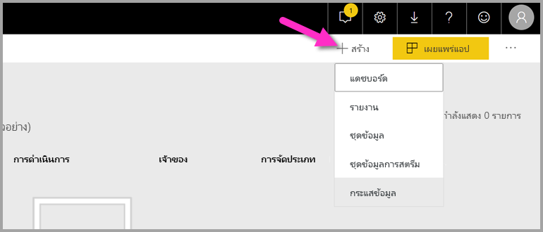
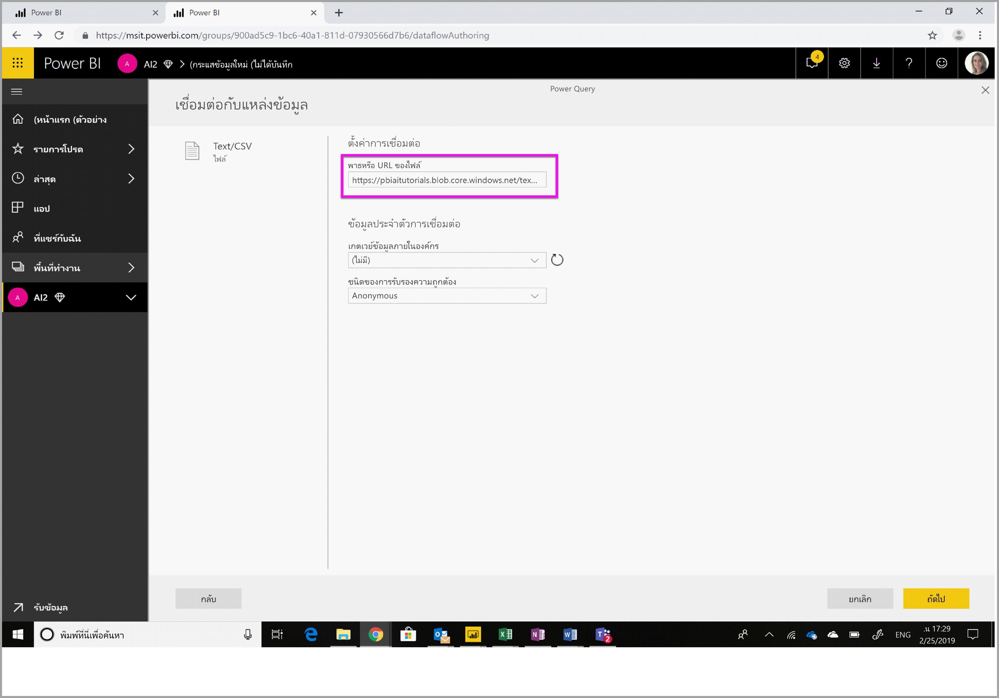
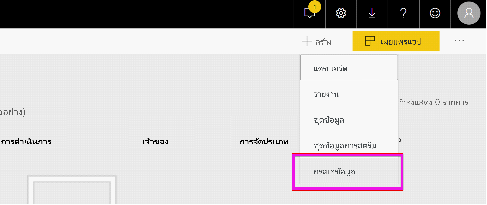
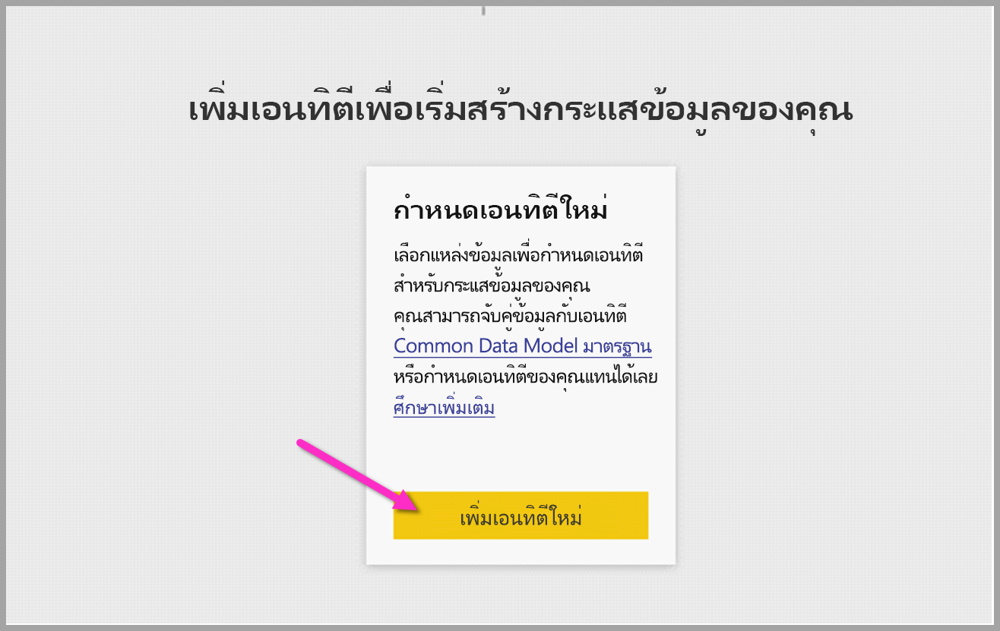
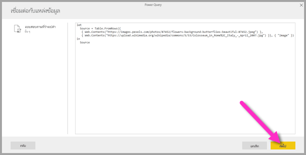
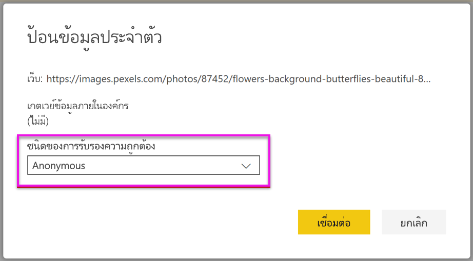
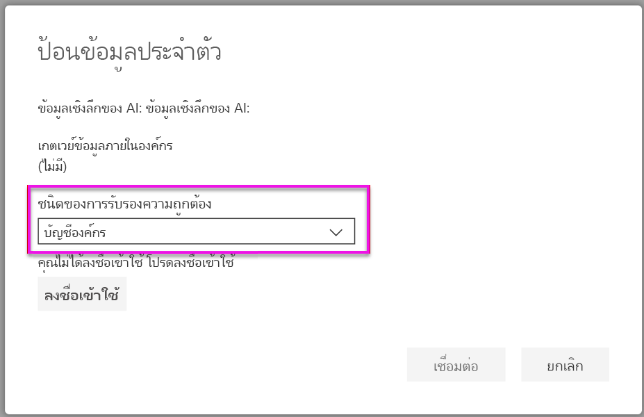
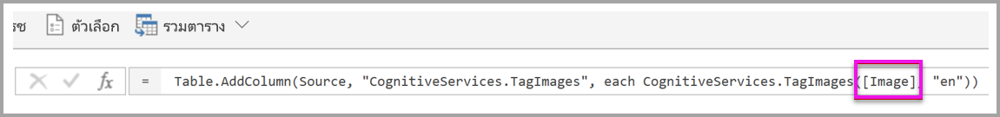
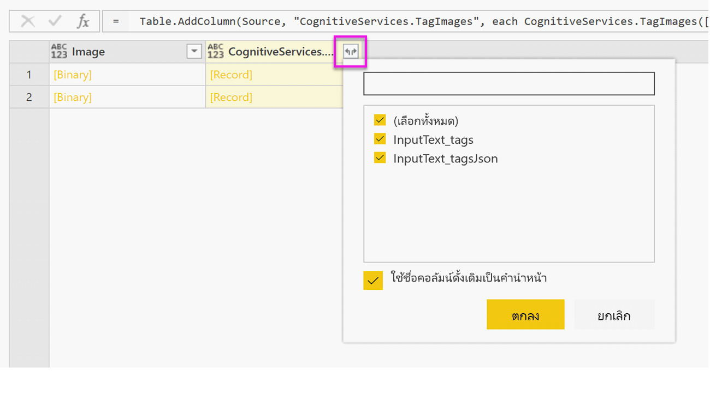

# <a name="tutorial-use-cognitive-services-in-power-bi"></a><span data-ttu-id="c291c-103">บทช่วยสอน: ใช้ Cognitive Services ใน Power BI</span><span class="sxs-lookup"><span data-stu-id="c291c-103">Tutorial: Use Cognitive Services in Power BI</span></span>

<span data-ttu-id="c291c-104">Power BI ให้สิทธิ์เข้าถึงชุดของฟังก์ชันจาก Azure Cognitive Services เพื่อเติมแต่งข้อมูลของคุณในการเตรียมข้อมูลด้วยตนเองสำหรับกระแสข้อมูล</span><span class="sxs-lookup"><span data-stu-id="c291c-104">Power BI provides access to a set of functions from Azure Cognitive Services to enrich your data in the self-service data prep for Dataflows.</span></span> <span data-ttu-id="c291c-105">บริการที่ได้รับการรองรับประจำวันนี้ ได้แก่ [การวิเคราะห์ความคิดเห็น](/azure/cognitive-services/text-analytics/how-tos/text-analytics-how-to-sentiment-analysis)[การแยกวลีหลัก](/azure/cognitive-services/text-analytics/how-tos/text-analytics-how-to-keyword-extraction)[การตรวจหาภาษา](/azure/cognitive-services/text-analytics/how-tos/text-analytics-how-to-language-detection) และ [การแท็กรูปภาพ](/azure/cognitive-services/computer-vision/concept-tagging-images)</span><span class="sxs-lookup"><span data-stu-id="c291c-105">The services that are supported today are [Sentiment Analysis](/azure/cognitive-services/text-analytics/how-tos/text-analytics-how-to-sentiment-analysis), [Key Phrase Extraction](/azure/cognitive-services/text-analytics/how-tos/text-analytics-how-to-keyword-extraction), [Language Detection](/azure/cognitive-services/text-analytics/how-tos/text-analytics-how-to-language-detection), and [Image Tagging](/azure/cognitive-services/computer-vision/concept-tagging-images).</span></span> <span data-ttu-id="c291c-106">การแปลงข้อมูลจะดำเนินการบนบริการของ Power BI และไม่จำเป็นต้องมีการสมัครใช้งาน Azure Cognitive Services</span><span class="sxs-lookup"><span data-stu-id="c291c-106">The transformations are executed on the Power BI service and do not require an Azure Cognitive Services subscription.</span></span> <span data-ttu-id="c291c-107">คุณลักษณะนี้ต้องใช้ Power BI Premium</span><span class="sxs-lookup"><span data-stu-id="c291c-107">This feature requires Power BI Premium.</span></span>

<span data-ttu-id="c291c-108">การแปลงข้อมูล Cognitive Services ได้รับการรองรับใน [การเตรียมข้อมูลด้วยตนเองสำหรับกระแสข้อมูล](https://powerbi.microsoft.com/blog/introducing-power-bi-data-prep-wtih-dataflows/)</span><span class="sxs-lookup"><span data-stu-id="c291c-108">Cognitive Services transforms are supported in the [Self-Service Data Prep for Dataflows](https://powerbi.microsoft.com/blog/introducing-power-bi-data-prep-wtih-dataflows/).</span></span> <span data-ttu-id="c291c-109">ใช้ตัวอย่างทีละขั้นตอนสำหรับการวิเคราะห์ข้อความและรูปภาพที่แท็กด้านล่างเพื่อเริ่มต้นใช้งาน</span><span class="sxs-lookup"><span data-stu-id="c291c-109">Use the step-by-step examples for text analytics and image tagging below to get started.</span></span>

<span data-ttu-id="c291c-110">ในบทช่วยสอนนี้ คุณจะเรียนรู้วิธีการ:</span><span class="sxs-lookup"><span data-stu-id="c291c-110">In this tutorial, you learn how to:</span></span>

> [!div class="checklist"]
> * <span data-ttu-id="c291c-111">นำเข้าข้อมูลลงในกระสข้อมูล</span><span class="sxs-lookup"><span data-stu-id="c291c-111">Import data into a dataflow</span></span>
> * <span data-ttu-id="c291c-112">ให้คะแนนความคิดเห็นและแยกวลีหลักของคอลัมน์ข้อความในกระแสข้อมูล</span><span class="sxs-lookup"><span data-stu-id="c291c-112">Score sentiment and extract key phrases of a text column in a dataflow</span></span>
> * <span data-ttu-id="c291c-113">เชื่อมต่อกับผลลัพธ์จาก Power BI Desktop</span><span class="sxs-lookup"><span data-stu-id="c291c-113">Connect to the results from Power BI Desktop</span></span>


## <a name="prerequisites"></a><span data-ttu-id="c291c-114">ข้อกำหนดเบื้องต้น</span><span class="sxs-lookup"><span data-stu-id="c291c-114">Prerequisites</span></span>

<span data-ttu-id="c291c-115">คุณต้องทำขั้นตอนต่อไปนี้เพื่อดำเนินบทช่วยสอนให้เสร็จสิ้น:</span><span class="sxs-lookup"><span data-stu-id="c291c-115">To complete this tutorial, you need the following:</span></span> 

- <span data-ttu-id="c291c-116">บัญชี Power BI</span><span class="sxs-lookup"><span data-stu-id="c291c-116">A Power BI account.</span></span> <span data-ttu-id="c291c-117">ถ้าคุณไม่ได้ลงทะเบียน Power BI ให้[ลงทะเบียนรุ่นทดลองใช้ฟรี](https://app.powerbi.com/signupredirect?pbi_source=web)ก่อนที่คุณจะเริ่มต้นใช้งาน</span><span class="sxs-lookup"><span data-stu-id="c291c-117">If you're not signed up for Power BI, [sign up for a free trial](https://app.powerbi.com/signupredirect?pbi_source=web) before you begin.</span></span>
- <span data-ttu-id="c291c-118">เข้าถึงความจุ Power BI Premium ด้วยปริมาณงาน AI ที่เปิดการใช้งาน</span><span class="sxs-lookup"><span data-stu-id="c291c-118">Access to a Power BI Premium capacity with the AI workload enabled.</span></span> <span data-ttu-id="c291c-119">ปริมาณงานนี้จะถูกปิดโดยค่าเริ่มต้นระหว่างการแสดงตัวอย่าง</span><span class="sxs-lookup"><span data-stu-id="c291c-119">This workload will be turned off by default during preview.</span></span> <span data-ttu-id="c291c-120">หากคุณอยู่ในความจุพรีเมียมและข้อมูลเชิงลึก AI ไม่แสดงขึ้น โปรดติดต่อผู้ดูแลความจุพรีเมียมของคุณเพื่อเปิดการใช้งานปริมาณงาน AI ในพอร์ทัลผู้ดูแลระบบ</span><span class="sxs-lookup"><span data-stu-id="c291c-120">If you are in on a Premium capacity and AI Insights are not showing up, contact your Premium capacity admin to enable the AI workload in the admin portal.</span></span>

## <a name="text-analytics"></a><span data-ttu-id="c291c-121">การวิเคราะห์ข้อความ</span><span class="sxs-lookup"><span data-stu-id="c291c-121">Text analytics</span></span>

<span data-ttu-id="c291c-122">ทำตามขั้นตอนในส่วนนี้เพื่อเสร็จสิ้นส่วนการวิเคราะห์ข้อความของบทช่วยสอน</span><span class="sxs-lookup"><span data-stu-id="c291c-122">Follow the steps in this section to complete the text analytics portion of the tutorial.</span></span>

### <a name="step-1-apply-sentiment-scoring-in-power-bi-service"></a><span data-ttu-id="c291c-123">ขั้นตอนที่ 1: ใช้การให้คะแนนความคิดเห็นในบริการของ Power BI</span><span class="sxs-lookup"><span data-stu-id="c291c-123">Step 1: Apply sentiment scoring in Power BI Service</span></span>

<span data-ttu-id="c291c-124">หากต้องการเริ่มต้นใช้งาน ให้นำทางไปยังพื้นที่ทำงาน Power BI ด้วยความจุพรีเมียม และสร้างกระแสข้อมูลใหม่โดยใช้ปุ่ม **สร้าง** มุมขวาบนของหน้าจอ</span><span class="sxs-lookup"><span data-stu-id="c291c-124">To get started, navigate to a Power BI workspace with Premium capacity and create a new dataflow using the **Create** button in the upper right of the screen.</span></span>



<span data-ttu-id="c291c-126">กล่องโต้ตอบกระแสข้อมูลจะแสดงตัวเลือกสำหรับการสร้างกระแสข้อมูลใหม่ ให้เลือก **เพิ่มเอนทิตีใหม่**</span><span class="sxs-lookup"><span data-stu-id="c291c-126">The dataflow dialog shows you the options for creating a new dataflow, select **Add new entities.**</span></span> <span data-ttu-id="c291c-127">จากนั้นเลือก **ข้อความ/CSV** จากเมนูของแหล่งข้อมูล</span><span class="sxs-lookup"><span data-stu-id="c291c-127">Next, choose **Text/CSV** from the menu of data sources.</span></span>


<span data-ttu-id="c291c-129">วาง URL นี้ลงในเขตข้อมูล URL: [https://pbiaitutorials.blob.core.windows.net/textanalytics/FabrikamComments.csv](https://pbiaitutorials.blob.core.windows.net/textanalytics/FabrikamComments.csv) และคลิก **ถัดไป**</span><span class="sxs-lookup"><span data-stu-id="c291c-129">Paste this URL into the URL field: [https://pbiaitutorials.blob.core.windows.net/textanalytics/FabrikamComments.csv](https://pbiaitutorials.blob.core.windows.net/textanalytics/FabrikamComments.csv) and click **Next.**</span></span>



<span data-ttu-id="c291c-131">ขณะนี้ข้อมูลพร้อมใช้งานสำหรับการวิเคราะห์ข้อความแล้ว และสามารถใช้การให้คะแนนความคิดเห็นและการแยกวลีหลักกับคอลัมน์ความคิดเห็นของลูกค้าได้</span><span class="sxs-lookup"><span data-stu-id="c291c-131">The data is now ready to use for text analytics, and we can use Sentiment Scoring and Key Phrase Extraction on the customer comments column.</span></span>

<span data-ttu-id="c291c-132">ในตัวแก้ไข Power Query ให้เลือก **ข้อมูลเชิงลึก AI**</span><span class="sxs-lookup"><span data-stu-id="c291c-132">In Power Query Editor, select **AI Insights**</span></span>


<span data-ttu-id="c291c-134">ขยายโฟลเดอร์ **Cognitive Services** และเลือกฟังก์ชันที่คุณต้องการใช้</span><span class="sxs-lookup"><span data-stu-id="c291c-134">Expand the **Cognitive Services** folder and select the function you would like to use.</span></span> <span data-ttu-id="c291c-135">ตัวอย่างนี้กำลังให้คะแนนความคิดเห็นของคอลัมน์ข้อคิดเห็น แต่คุณสามารถทำตามขั้นตอนเดียวกันนี้เพื่อลองใช้การตรวจหาภาษาและการแยกวลีหลักได้</span><span class="sxs-lookup"><span data-stu-id="c291c-135">This example is scoring the sentiment of the comment column, but you can follow the same steps to try out Language Detection and Key Phrase Extraction.</span></span>


<span data-ttu-id="c291c-137">เมื่อเลือกฟังก์ชันแล้ว เขตข้อมูลที่จำเป็นและไม่จำเป็นจะแสดงขึ้น</span><span class="sxs-lookup"><span data-stu-id="c291c-137">Once a function is selected, the required and optional fields will show.</span></span> <span data-ttu-id="c291c-138">หากต้องการให้คะแนนความคิดเห็นรีวิวตัวอย่าง ให้เลือกคอลัมน์รีวิวเป็นข้อมูลป้อนเข้าที่เป็นข้อความ</span><span class="sxs-lookup"><span data-stu-id="c291c-138">To score the sentiment of the example reviews, select the reviews column as text input.</span></span> <span data-ttu-id="c291c-139">ข้อมูลวัฒนธรรมคือข้อมูลป้อนเข้าเพิ่มเติมและจำเป็นต้องใช้รูปแบบ ISO</span><span class="sxs-lookup"><span data-stu-id="c291c-139">Culture info is an optional input and requires an ISO format.</span></span> <span data-ttu-id="c291c-140">ยกตัวอย่างเช่น ป้อน 'en' หากต้องการดำเนินการข้อความเป็นภาษาอังกฤษ</span><span class="sxs-lookup"><span data-stu-id="c291c-140">For example, enter 'en' if you want the text to be treated as English.</span></span> <span data-ttu-id="c291c-141">สำหรับเขตข้อมูลที่ปล่อยว่าง Power BI จะตรวจหาภาษาของค่าที่ป้อนเข้าเป็นอันดับแรกก่อนที่จะให้คะแนนความคิดเห็น</span><span class="sxs-lookup"><span data-stu-id="c291c-141">When the field is left blank, Power BI will first detect the language of the input value before scoring the sentiment.</span></span>


<span data-ttu-id="c291c-143">จากนั้นเลือก **การเรียก** เพื่อเรียกใช้ฟังก์ชัน</span><span class="sxs-lookup"><span data-stu-id="c291c-143">Now select **Invoke** to run the function.</span></span> <span data-ttu-id="c291c-144">คอลัมน์ใหม่ที่มีคะแนนความคิดเห็นสำหรับแต่ละแถวจะถูกเพิ่มลงในตาราง</span><span class="sxs-lookup"><span data-stu-id="c291c-144">A new column with the sentiment score for each row is added to the table.</span></span> <span data-ttu-id="c291c-145">คุณสามารถย้อนกลับไปที่ **ข้อมูลเชิงลึก AI** เพื่อแยกวลีหลักของข้อความรีวิวด้วยวิธีเดียวกันนี้ได้</span><span class="sxs-lookup"><span data-stu-id="c291c-145">You can go back to **AI insights** to extract key phrases of the review text in the same way.</span></span>

<span data-ttu-id="c291c-146">เมื่อเสร็จสิ้นการแปลงข้อมูลแล้ว ให้เปลี่ยนชื่อคิวรีเป็น 'ข้อคิดเห็นของลูกค้า' และเลือก **เสร็จสิ้น**</span><span class="sxs-lookup"><span data-stu-id="c291c-146">Once you are finished with the transformations, change the query name to 'Customer comments' and select **Done.**</span></span>


<span data-ttu-id="c291c-148">จากนั้น **บันทึก** กระแสข้อมูลและตั้งชื่อว่า Fabrikam</span><span class="sxs-lookup"><span data-stu-id="c291c-148">Next, **Save** the dataflow and name it Fabrikam.</span></span> <span data-ttu-id="c291c-149">เลือกปุ่ม **รีเฟรชตอนนี้** ที่ปรากฏขึ้นมาหลังจากการบันทึกกระแสข้อมูล</span><span class="sxs-lookup"><span data-stu-id="c291c-149">Select the **Refresh Now** button that pops up after saving the dataflow.</span></span>


<span data-ttu-id="c291c-151">เมื่อบันทึกและรีเฟรชกระแสข้อมูลแล้ว คุณจะสามารถนำไปใช้ในรายงาน Power BI ได้</span><span class="sxs-lookup"><span data-stu-id="c291c-151">Once the dataflow is saved and refreshed, you can use it in a Power BI report.</span></span>

### <a name="step-2-connect-from-power-bi-desktop"></a><span data-ttu-id="c291c-152">ขั้นตอนที่ 2: เชื่อมต่อจาก Power BI Desktop</span><span class="sxs-lookup"><span data-stu-id="c291c-152">Step 2: Connect from Power BI Desktop</span></span>

<span data-ttu-id="c291c-153">เปิด Power BI Desktop</span><span class="sxs-lookup"><span data-stu-id="c291c-153">Open Power BI Desktop.</span></span> <span data-ttu-id="c291c-154">ใน Ribbon หน้าแรก ให้เลือก **รับข้อมูล**</span><span class="sxs-lookup"><span data-stu-id="c291c-154">In the Home ribbon, select **Get Data.**</span></span>

<span data-ttu-id="c291c-155">นำทางไปยัง **กระแสข้อมูล Power BI (เบต้า**) ในส่วน Power BI และเลือก **เชื่อมต่อ**</span><span class="sxs-lookup"><span data-stu-id="c291c-155">Navigate to the **Power BI dataflows (Beta**) in the Power BI section and select **Connect.**</span></span>


<span data-ttu-id="c291c-157">เนื่องจากนี่เป็นคุณลักษณะตัวอย่าง ตัวเชื่อมต่อจะสอบถามเพื่อให้คุณยอมรับเงื่อนไขการแสดงตัวอย่าง</span><span class="sxs-lookup"><span data-stu-id="c291c-157">As this is a preview feature, the connector will ask you to accept the preview conditions.</span></span> <span data-ttu-id="c291c-158">หลังจากยอมรับแล้ว ให้ลงชื่อเข้าใช้ด้วยบัญชีองค์กรของคุณ</span><span class="sxs-lookup"><span data-stu-id="c291c-158">After accepting these, sign in with your organization account.</span></span>


<span data-ttu-id="c291c-160">เลือกกระแสข้อมูลที่คุณเพิ่งสร้าง</span><span class="sxs-lookup"><span data-stu-id="c291c-160">Select the dataflow you have just created.</span></span> <span data-ttu-id="c291c-161">นำทางไปยังตารางข้อคิดเห็นของลูกค้า และคลิก **โหลด**</span><span class="sxs-lookup"><span data-stu-id="c291c-161">Navigate to the Customer comments table and click **Load.**</span></span>


<span data-ttu-id="c291c-163">เมื่อโหลดข้อมูลแล้ว คุณสามารถเริ่มต้นการสร้างรายงานได้</span><span class="sxs-lookup"><span data-stu-id="c291c-163">Now the data is loaded you can start building a report.</span></span>

## <a name="image-tagging"></a><span data-ttu-id="c291c-164">การแท็กรูปภาพ</span><span class="sxs-lookup"><span data-stu-id="c291c-164">Image tagging</span></span>

<span data-ttu-id="c291c-165">นำทางไปยังพื้นที่ทำงาน Power BI ที่มีความจุพรีเมียม</span><span class="sxs-lookup"><span data-stu-id="c291c-165">Navigate to a Power BI workspace with Premium capacity.</span></span> <span data-ttu-id="c291c-166">สร้างกระแสข้อมูลใหม่โดยใช้ปุ่ม **สร้าง** ที่มุมขวาบนของหน้าจอ</span><span class="sxs-lookup"><span data-stu-id="c291c-166">Create a new dataflow using the **Create** button in the upper right of the screen.</span></span>



<span data-ttu-id="c291c-168">เลือก **เอนทิตีใหม่**</span><span class="sxs-lookup"><span data-stu-id="c291c-168">Select **Add new entities**.</span></span>



<span data-ttu-id="c291c-170">เมื่อปรากฏข้อความให้เลือกแหล่งข้อมูล ให้เลือก **คิวรีเปล่า**</span><span class="sxs-lookup"><span data-stu-id="c291c-170">Once you are asked to choose a data source, select **Blank query.**</span></span>


<span data-ttu-id="c291c-172">คัดลอกคิวรีด้านล่างในตัวแก้ไขคิวรีและคลิกถัดไป</span><span class="sxs-lookup"><span data-stu-id="c291c-172">Copy the query below in the query editor and click next.</span></span> <span data-ttu-id="c291c-173">คุณสามารถแทนที่เส้นทาง URL ด้านล่างด้วยรูปภาพอื่นๆ หรือเพิ่มแถวได้</span><span class="sxs-lookup"><span data-stu-id="c291c-173">You can replace the URL paths below with other images or add more rows.</span></span> <span data-ttu-id="c291c-174">ฟังก์ชัน *Web.Contents* จะนำเข้า URL รูปภาพเป็นไบนารี</span><span class="sxs-lookup"><span data-stu-id="c291c-174">The *Web.Contents* function imports the image URL as binary.</span></span> <span data-ttu-id="c291c-175">นอกจากนี้หากคุณมีแหล่งข้อมูลที่มีรูปภาพจัดเก็บเป็นไบนารี คุณสามารถใช้ได้โดยตรง</span><span class="sxs-lookup"><span data-stu-id="c291c-175">If you have a data source with images stored as binary, you can also use that directly.</span></span>


```python
let
  Source = Table.FromRows({
  { Web.Contents("https://images.pexels.com/photos/87452/flowers-background-butterflies-beautiful-87452.jpeg") },
  { Web.Contents("https://upload.wikimedia.org/wikipedia/commons/5/53/Colosseum_in_Rome%2C_Italy_-_April_2007.jpg") }}, { "Image" })
in
  Source
```



<span data-ttu-id="c291c-177">เมื่อได้รับพร้อมท์สำหรับข้อมูลประจำตัว ให้เลือก *ไม่ระบุชื่อ*</span><span class="sxs-lookup"><span data-stu-id="c291c-177">When prompted for credentials, select *anonymous*.</span></span>


<span data-ttu-id="c291c-179">คุณจะเห็นรูปภาพดังต่อไปนี้</span><span class="sxs-lookup"><span data-stu-id="c291c-179">You see the following image.</span></span>



<span data-ttu-id="c291c-181">คุณจะได้รับพร้อมท์สำหรับข้อมูลประจำตัวของแต่ละหน้าเว็บ</span><span class="sxs-lookup"><span data-stu-id="c291c-181">You're prompted for credentials for each individual web page.</span></span>

<span data-ttu-id="c291c-182">เลือก **ข้อมูลเชิงลึก AI** ในตัวแก้ไขคิวรี</span><span class="sxs-lookup"><span data-stu-id="c291c-182">Select **AI Insights** in the query editor.</span></span>


<span data-ttu-id="c291c-184">จากนั้น ลงชื่อเข้าใช้ด้วย **บัญชีองค์กร**</span><span class="sxs-lookup"><span data-stu-id="c291c-184">Next, sign in with your **organizational account**.</span></span>



<span data-ttu-id="c291c-186">เลือกฟังก์ชันแท็กรูปภาพ และป้อน _[ไบนารี]_ ในเขตเขตข้อมูลคอลัมน์ และ _en_ ในเขตข้อมูลวัฒนธรรม</span><span class="sxs-lookup"><span data-stu-id="c291c-186">Select the Tag Images function, enter _[Binary]_ in the column field and _en_ in the culture info field.</span></span> 

> [!NOTE]
> <span data-ttu-id="c291c-187">ขณะนี้คุณจะไม่สามารถเลือกคอลัมน์โดยใช้ดรอปดาวน์ได้ ทั้งนี้ปัญหาดังกล่าวจะได้รับการแก้ไขโดยเร็วที่สุดระหว่างการแสดงตัวอย่างส่วนบุคคล</span><span class="sxs-lookup"><span data-stu-id="c291c-187">You currently cannot pick a column using a dropdown, which will be resolved as soon as possible during the private preview.</span></span>


<span data-ttu-id="c291c-189">ในตัวแก้ไขฟังก์ชัน ให้ลบเครื่องหมายอัญประกาศรอบๆ ชื่อคอลัมน์</span><span class="sxs-lookup"><span data-stu-id="c291c-189">In the function editor, remove the quotation marks around the column name.</span></span> 

> [!NOTE]
> <span data-ttu-id="c291c-190">การลบเครื่องหมายอัญประกาศจะเป็นการแก้ไขปัญหาชั่วคราว ทั้งนี้ปัญหาดังกล่าวจะได้รับการแก้ไขโดยเร็วที่สุดระหว่างการแสดงตัวอย่างส่วนบุคคล</span><span class="sxs-lookup"><span data-stu-id="c291c-190">Removing the quotation marks is a temporary workaround, which will be resolved as soon as possible during preview.</span></span>



<span data-ttu-id="c291c-192">ฟังก์ชันจะส่งกลับทั้งระเบียนที่มีแท็กในรูปแบบที่ใช้จุลภาคเป็นตัวคั่น และระเบียน json</span><span class="sxs-lookup"><span data-stu-id="c291c-192">The function returns a record with both the tags in comma-separated format and as a json record.</span></span> <span data-ttu-id="c291c-193">เลือกปุ่มขยายเพื่อเพิ่มอย่างน้อยหนึ่งระเบียนเป็นคอลัมน์ในตาราง</span><span class="sxs-lookup"><span data-stu-id="c291c-193">Select the expand-button to add one or both as columns to the table.</span></span>



<span data-ttu-id="c291c-195">เลือก **เสร็จสิ้น** และบันทึกกระแสข้อมูล</span><span class="sxs-lookup"><span data-stu-id="c291c-195">Select **Done** and save the dataflow.</span></span> <span data-ttu-id="c291c-196">เมื่อรีเฟรชกระแสข้อมูลแล้ว คุณสามารถเชื่อมต่อกระแสข้อมูลจาก Power BI Desktop ได้โดยใช้ตัวเชื่อมต่อกระแสข้อมูล</span><span class="sxs-lookup"><span data-stu-id="c291c-196">Once you have refreshed the dataflow one, you can connect to it from Power BI Desktop using the Dataflows connectors.</span></span> <span data-ttu-id="c291c-197">(ดูขั้นตอนในหน้าที่ 5 ของเอกสารนี้)</span><span class="sxs-lookup"><span data-stu-id="c291c-197">(See steps on page 5 of this document).</span></span>

## <a name="clean-up-resources"></a><span data-ttu-id="c291c-198">ล้างแหล่งข้อมูล</span><span class="sxs-lookup"><span data-stu-id="c291c-198">Clean up resources</span></span>

<span data-ttu-id="c291c-199">หากไม่ต้องการใช้แล้ว ให้ลบคิวรีโดยคลิกขวาที่ชื่อคิวรีในตัวแก้ไข Power Query และเลือก **ลบ**</span><span class="sxs-lookup"><span data-stu-id="c291c-199">When no longer needed, delete the query by right-clicking the query name in the Power Query editor and selecting **Delete**.</span></span>

## <a name="next-steps"></a><span data-ttu-id="c291c-200">ขั้นตอนถัดไป</span><span class="sxs-lookup"><span data-stu-id="c291c-200">Next steps</span></span>

<span data-ttu-id="c291c-201">ในบทช่วยสอนนี้คุณได้ใช้ฟังก์ชันการให้คะแนนความคิดเห็นและการแท็กรูปภาพบนกระแสข้อมูล Power BI</span><span class="sxs-lookup"><span data-stu-id="c291c-201">In this tutorial, you applied sentiment scoring and image tagging functions on a Power BI dataflow.</span></span> <span data-ttu-id="c291c-202">หากต้องการเรียนรู้เพิ่มเติมเกี่ยวกับ Cognitive Services ใน Power BI โปรดอ่านบทความต่อไปนี้</span><span class="sxs-lookup"><span data-stu-id="c291c-202">To learn more about Cognitive Services in Power BI, read the following articles.</span></span>

* [<span data-ttu-id="c291c-203">Cognitive Services ใน Azure</span><span class="sxs-lookup"><span data-stu-id="c291c-203">Cognitive Services in Azure</span></span>](/azure/cognitive-services/)
* <span data-ttu-id="c291c-204">เริ่มต้นใช้งาน [ด้วยการเตรียมข้อมูลด้วยตนเองบนกระแสข้อมูล](../transform-model/dataflows/dataflows-introduction-self-service.md)</span><span class="sxs-lookup"><span data-stu-id="c291c-204">Get started [with self-service data prep on dataflows](../transform-model/dataflows/dataflows-introduction-self-service.md)</span></span>
* <span data-ttu-id="c291c-205">เรียนรู้เพิ่มเติมเกี่ยวกับ [Power BI Premium](https://powerbi.microsoft.com/power-bi-premium/)</span><span class="sxs-lookup"><span data-stu-id="c291c-205">Learn more about [Power BI Premium](https://powerbi.microsoft.com/power-bi-premium/)</span></span>

<span data-ttu-id="c291c-206">คุณอาจสนใจบทความต่อไปนี้</span><span class="sxs-lookup"><span data-stu-id="c291c-206">You might also be interested in the following articles.</span></span>

* [<span data-ttu-id="c291c-207">บทช่วยสอน: ใช้แบบจำลองการเรียนรู้ของเครื่อง Azure ใน Power BI</span><span class="sxs-lookup"><span data-stu-id="c291c-207">Tutorial: Consume Azure Machine Learning models in Power BI</span></span>](service-aml-integrate.md)
* [<span data-ttu-id="c291c-208">การรวม Azure Machine Learning ใน Power BI (ตัวอย่าง)</span><span class="sxs-lookup"><span data-stu-id="c291c-208">Azure Machine Learning integration in Power BI (Preview)</span></span>](../transform-model/dataflows/dataflows-machine-learning-integration.md)
* [<span data-ttu-id="c291c-209">Cognitive Services ใน Power BI (ตัวอย่าง)</span><span class="sxs-lookup"><span data-stu-id="c291c-209">Cognitive Services in Power BI (Preview)</span></span>](../transform-model/dataflows/dataflows-machine-learning-integration.md)