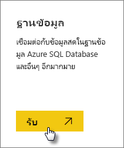

# ข้อมูลสดของ SQL Server Analysis Services ใน Power BISQL Server Analysis Services live data in Power BI

ใน Power BI มีสองวิธีที่คุณสามารถเชื่อมต่อสดกับเซิร์ฟเวอร์ SQL Server Analysis ServicesIn Power BI, there are two ways you can connect to a live SQL Server Analysis Services server. ใน **รับข้อมูล** คุณสามารถเชื่อมต่อกับเซิร์ฟเวอร์ SQL Server Analysis Services หรือคุณสามารถเชื่อมต่อกับ [ไฟล์ Power BI Desktop](service-desktop-files.md) หรือ [สมุดงาน Excel](service-excel-workbook-files.md) ที่เชื่อมต่อกับเซิร์ฟเวอร์ Analysis Services อยู่แล้วIn **Get data**, you can connect to a SQL Server Analysis Services server, or you can connect to a [Power BI Desktop file](service-desktop-files.md), or [Excel workbook](service-excel-workbook-files.md), that already connects to an Analysis Services server. แนวทางปฏิบัติที่ดีที่สุด Microsoft ขอแนะนำให้ใช้ Power BI Desktop เนื่องจากความสมบูรณ์ของชุดเครื่องมือตัวและความสามารถในการรักษาสำเนาสำรองของไฟล์ Power BI Desktop ภายในเครื่องAs a best practice, Microsoft strongly recommends using Power BI Desktop because of the richness of the toolset and the ability to maintain a backup copy of the Power BI Desktop file locally.

>[!IMPORTANT]
> * เพื่อเชื่อมต่อสดไปยังเซิร์ฟเวอร์ Analysis Services เกตเวย์ข้อมูลภายในองค์กร ต้องถูกติดตั้งและกำหนดค่าโดยผู้ดูแลระบบIn order to connect to a live Analysis Services server, an On-premises data gateway must be installed and configured by an administrator. สำหรับข้อมูลเพิ่มเติม ดู[เกตเวย์ข้อมูลภายในองค์กร](service-gateway-onprem.md)For more information, see [On-premises data gateway](service-gateway-onprem.md).
> * เมื่อคุณใช้เกตเวย์ ข้อมูลของคุณยังคงอยู่ภายในองค์กรWhen you use the gateway, your data remains on-premises.  รายงานที่คุณสร้างขึ้นจากข้อมูลนั้น จะถูกบันทึกในบริการของ Power BIThe reports you create based on that data are saved in the Power BI service. 
> * [ถามตอบ คิวรีด้วยภาษาธรรมชาติ](../create-reports/service-q-and-a-direct-query.md) ยังเป็นคุณลักษณะตัวอย่าง สำหรับการเชื่อมต่อ Analysis Services แบบสด[Q&A natural language querying](../create-reports/service-q-and-a-direct-query.md) is in preview for Analysis Services live connections.

## เชื่อมต่อกับรูปแบบข้อมูลจาก รับข้อมูลTo connect to a model from Get data

1. ใน **พื้นที่ทำงานของฉัน** เลือก **รับข้อมูล**In **My Workspace**, select **Get data**. คุณยังสามารถเปลี่ยนไปยังพื้นที่ทำงานกลุ่ม ถ้ามีYou can also change to a group workspace, if one is available.

   

2. เลือก **ฐานข้อมูลและอื่นๆ อีกมากมาย**Select **Databases & More**.

   

3. เลือก **SQL Server Analysis Services** > **เชื่อมต่อ**Select **SQL Server Analysis Services** > **Connect**.

   

4. เลือกเซิร์ฟเวอร์Select a server. ถ้าคุณไม่เห็นเซิร์ฟเวอร์ใดเลยในนี้ แสดงว่ายังไม่ได้กำหนดเกตเวย์และแหล่งข้อมูล หรือบัญชีของคุณไม่ได้อยู่ในรายการในแท็บ **ผู้ใช้** ของแหล่งข้อมูลในเกตเวย์If you don't see any servers listed here, it means either a gateway, and data source, are not configured, or your account is not listed in the **Users** tab of the data source, in the gateway. ตรวจสอบกับผู้ดูแลของคุณCheck with your administrator.

5. เลือกรูปแบบที่คุณต้องการเชื่อมต่อSelect the model you want to connect to. ซึ่งอาจเป็นแบบตาราง หรือแบบหลายมิติThis could be either Tabular or Multidimensional.

หลังจากคุณเชื่อมต่อกับรูปแบบแล้ว จะปรากฏในไซต์ Power BI ของคุณใน **พื้นที่ทำงาน/ชุดข้อมูลของฉัน**After you connect to the model, it will appear in your Power BI site in **My Workspace/Datasets**. ถ้าคุณสลับไปยังพื้นที่ทำงานกลุ่ม ชุดข้อมูลจะปรากฏขึ้นภายในกลุ่มIf you were switched to a group workspace, then the dataset will appear within the group.

## ไทล์แดชบอร์ดDashboard tiles

ถ้าคุณปักหมุดวิชวลจากรายงานไปยังแดชบอร์ด ไทล์ที่ปักหมุดไว้จะรีเฟรชทุก 10 นาทีโดยอัตโนมัติIf you pin visuals from a report to the dashboard, the pinned tiles are automatically refreshed every 10 minutes. ถ้ามีการอัปเดตข้อมูลในเซิร์ฟเวอร์ Analysis Services ภายในองค์กรของคุณ ไทล์จะได้รับการปรับปรุงอัตโนมัติหลังผ่านไป 10 นาทีIf the data in your on-premises Analysis Services server is updated, the tiles will get auto-updated after 10 minutes.

## ปัญหาที่พบบ่อยCommon Issues

* ข้อผิดพลาด ไม่สามารถโหลดเค้าร่างแบบจำลอง - ข้อผิดพลาดนี้เกิดขึ้นเมื่อผู้ใช้เชื่อมต่อกับ SSAS ไม่ได้รับอนุญาตให้เข้าถึงฐานข้อมูล SSAS, คิวบ์ และแบบจำลองCannot load the model schema error - This error occurs when the user connecting to SSAS does not have access to the SSAS database, cube and model.

## ขั้นตอนถัดไปNext steps

* [เกตเวย์ข้อมูลภายในองค์กรOn-premises data gateway](service-gateway-onprem.md)  
* [จัดการแหล่งข้อมูล Analysis ServicesManage Analysis Services data sources](service-gateway-enterprise-manage-ssas.md)  
* [การแก้ไขปัญหา เกตเวย์ข้อมูลในองค์กรTroubleshooting the On-premises data gateway](service-gateway-onprem-tshoot.md)  

มีคำถามเพิ่มเติมหรือไม่More questions? [ลองไปที่ชุมชน Power BITry the Power BI Community](https://community.powerbi.com/)
