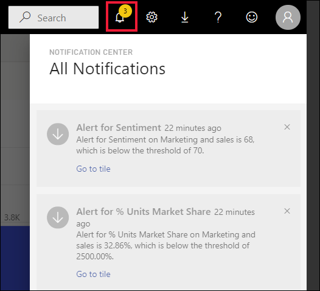

# บทช่วยสอน: ตั้งค่าการแจ้งเตือนบนแดชบอร์ด Power BITutorial: Set alerts on Power BI dashboards

[!INCLUDE[consumer-appliesto-yynn](../includes/consumer-appliesto-yynn.md)]

ตั้งค่าการแจ้งเตือนในบริการ Power BI เพื่อแจ้งให้คุณทราบเมื่อข้อมูลบนแดชบอร์ดเปลี่ยนแปลงเหนือหรือต่ำกว่าขีดจำกัดที่คุณตั้งไว้Set alerts in the Power BI service to notify you when data on a dashboard changes above or below limits you set. การแจ้งเตือนสามารถตั้งค่าบนหมุดไทล์ที่ปักหมุดจากวิชวลรายงานเท่านั้น และบนหน้าปัดวัด Kpi และการ์ดเท่านั้นAlerts can only be set on tiles pinned from report visuals, and only on gauges, KPIs, and cards. 

สามารถสร้างการแจ้งเตือนบนแดชบอร์ด:Alerts can be created on dashboards:
- ที่คุณสร้างและบันทึกไว้ใน **พื้นที่ทำงานของฉัน**that you have created and saved in **My workspace**
- ที่แบ่งปันกับคุณใน [ความจุแบบพรีเมียม](end-user-license.md)that have been shared with you in a [Premium capacity](end-user-license.md). 
- ในพื้นที่ทำงานใด ๆ คุณก็สามารถเข้าถึงได้ ถ้าคุณมีสิทธิ์การใช้งาน Power BI Proin any workspace you can access, if you have a Power BI Pro license.    

ข้อความแจ้งเตือนทำงานกับข้อมูลที่ได้รับการรีเฟรชเท่านั้นAlerts only work on data that is refreshed. เมื่อมีการรีเฟรชข้อมูล Power BI จะค้นหาเพื่อดูว่าข้อความแจ้งเตือนถูกตั้งค่าสำหรับข้อมูลนั้นหรือไม่When data refreshes, Power BI looks to see if an alert is set for that data. ถ้าข้อมูลได้ถึงค่าเกณฑ์การแจ้งเตือน ข้อความแจ้งเตือนจะถูกเริ่มIf the data has reached an alert threshold, an alert is triggered. 

คุณลักษณะนี้ยังคงได้รับการพัฒนา ดังนั้นโปรดดู[คำแนะนำและหัวข้อการแก้ไขปัญหาด้านล่าง](#tips-and-troubleshooting)This feature is still evolving, so refer to the [Tips and troubleshooting section below](#tips-and-troubleshooting).

มีเพียงคุณที่สามารถดูการแจ้งเตือนที่คุณตั้งไว้ แม้ว่าคุณได้แชร์แดชบอร์ดของคุณOnly you can see the alerts you set, even if you share your dashboard. การแจ้งเตือนข้อมูลจะถูกซิงโครไนซ์เต็มรูปแบบข้ามแพลตฟอร์ม ตั้งค่าและดูการแจ้งเตือนข้อมูลได้[ในแอป mobile Power BI](mobile/mobile-set-data-alerts-in-the-mobile-apps.md)และใน Power BI serviceData alerts are fully synchronized across platforms; set and view data alerts [in the Power BI mobile apps](mobile/mobile-set-data-alerts-in-the-mobile-apps.md) and in the Power BI service. 

> [!WARNING]
> การแจ้งเตือนเหล่านี้จะให้ข้อมูลเกี่ยวกับข้อมูลของคุณThese alerts provide information about your data. ถ้าคุณดูข้อมูล Power BI ของคุณบนอุปกรณ์เคลื่อนที่ และอุปกรณ์ที่ถูกขโมย เราขอแนะนำให้ใช้บริการของ Power BI เพื่อปิดการแจ้งเตือนทั้งหมดIf you view your Power BI data on a mobile device and that device gets stolen, we recommend using the Power BI service to turn off all alerts.
> 

บทช่วยสอนนี้ครอบคลุมเรื่องต่อไปนี้This tutorial covers the following.
> [!div class="checklist"]
> * ใครสามารถตั้งค่าการแจ้งเตือนWho can set alerts
> * ภาพที่รองรับการแจ้งเตือนWhich visuals support alerts
> * ผู้ที่สามารถดูการแจ้งเตือนของฉันWho can see my alerts
> * การแจ้งเตือนการทำงาน บน Power BI Desktop และอุปกรณ์เคลื่อนที่Do alerts work on Power BI Desktop and mobile
> * วิธีการสร้างการแจ้งเตือนHow to create an alert
> * รับการแจ้งเตือนของฉันที่ไหนWhere will I receive my alerts

## ข้อกำหนดเบื้องต้นPrerequisites

ถ้าคุณไม่ได้ลงทะเบียน Power BI ให้[ลงทะเบียนรุ่นทดลองใช้ฟรี](https://app.powerbi.com/signupredirect?pbi_source=web)ก่อนที่คุณจะเริ่มต้นใช้งานIf you're not signed up for Power BI, [sign up for a free trial](https://app.powerbi.com/signupredirect?pbi_source=web) before you begin.

1. ตัวอย่างนี้ใช้ไทล์การ์ดแดชบอร์ดจากตัวอย่างการขายและการตลาดThis example uses a dashboard card tile from the Sales & Marketing sample. เปิดบริการ Power BI (app.powerbi.com) ลงชื่อเข้าใช้และเปิด **พื้นที่ทำงานของฉัน** ของคุณOpen the Power BI service (app.powerbi.com), sign in, and open your **My Workspace**.    
    

2. ในมุมด้านล่างซ้าย เลือก **รับข้อมูล**In the bottom-left corner, select **Get data**.

    

3. ในหน้ารับข้อมูลที่ปรากฏขึ้น ให้เลือก **ตัวอย่าง**On the Get data page that appears, select **Samples**.

4. เลือกตัวอย่างการขายและการตลาด จากนั้นเลือก **เชื่อมต่อ**Select the Sales and Marketing Sample, then choose **Connect**.

    

5. หลังจาก Power BI เชื่อมต่อกับตัวอย่างแล้ว ให้เลือก **ไปที่แดชบอร์ด** จากกล่องโต้ตอบที่ปรากฏขึ้นAfter Power BI has connected to the sample, select **Go to dashboard** from the dialog that appears.     
    

## เพิ่มการแจ้งเตือนไปยังไทล์แดชบอร์ดAdd an alert to a dashboard tile

1. จากแป้นวัดแดชบอร์ด KPI หรือการ์ดไทล์ เลือกจุดไข่ปลาFrom a dashboard gauge, KPI, or card tile, select the ellipsis.
   
   

2. เลือกไอคอนการแจ้งเตือน  หรือ **จัดการการแจ้งเตือน** เพื่อเพิ่มการแจ้งเตือนอย่างน้อยหนึ่งรายการสำหรับการ์ด **ส่วนแบ่งทางการตลาด**Select the alert icon , or **Manage alerts**, to add one or more alerts for the **Market share** card.

   

   
1. บนบานหน้าต่าง **จัดการการแจ้งเตือน** เลือก **+ เพิ่มกฎการแจ้งเตือน**On the **Manage alerts** pane, select **+ Add alert rule**.  ตรวจสอบให้แน่ใจว่า แถบเลื่อนถูกตั้งค่าเป็น **เปิด** และตั้งชื่อให้การแจ้งเตือนของคุณEnsure the slider is set to **On**, and give your alert a title. ชื่อช่วยให้คุณสามารถจดจำข้อความการแจ้งเตือนของคุณได้Titles help you easily recognize your alerts.
   
   
4. เลื่อนลง แล้วใส่รายละเอียดการแจ้งเตือนScroll down and enter the alert details.  ในตัวอย่างนี้เราจะสร้างการแจ้งเตือนที่แจ้งให้เราทราบวันละครั้งหากส่วนแบ่งทางการตลาดของเราเพิ่มขึ้นเป็น 40 หรือสูงกว่าIn this example we'll create an alert that notifies us once a day if our market share increases to 40 or higher. การแจ้งเตือนจะปรากฏใน [ศูนย์การแจ้งเตือน](end-user-notification-center.md) ของเราAlerts will appear in our [Notification center](end-user-notification-center.md). และเราจะให้ Power BI ส่งอีเมลเช่นกันAnd we'll have Power BI send us an email as well.
   
   

5. เลือก **บันทึกและปิด**Select **Save and close**.
 

   > 

## การรับการแจ้งเตือนReceiving alerts
เมื่อติดตามข้อมูลถึงค่าเกณฑ์หนึ่งที่คุณตั้งไว้ เกิดหลายสิ่งขึ้นWhen the data being tracked reaches one of the thresholds you've set, several things happen. ประการแรก Power BI จะตรวจสอบเพื่อดูว่าเกินหนึ่งชั่วโมงหรือ 24 ชั่วโมงแล้วหรือไม่ (ขึ้นอยู่กับตัวเลือกที่คุณเลือก) นับตั้งแต่มีการส่งการแจ้งเตือนล่าสุดFirst, Power BI checks to see if it has been more than an hour, or more than 24 hours (depending on the option you selected), since the last alert was sent. ตราบใดที่ข้อมูลเกินค่าเกณฑ์ คุณจะได้รับการแจ้งเตือนทุกชั่วโมงหรือทุกๆ 24 ชั่วโมงAs long as the data is past the threshold, you'll get an alert.

ถัดไป Power BI ส่งข้อความแจ้งเตือนไปยังศูนย์การแจ้งเตือนของคุณ และหรือในอีเมลNext, Power BI sends an alert to your Notification center and, optionally, in email. แต่ละข้อความแจ้งเตือนประกอบด้วยการเชื่อมโยงโดยตรงกับข้อมูลของคุณEach alert contains a direct link to your data. เลือกลิงก์เพื่อดูไทล์ที่เกี่ยวข้องSelect the link to see the relevant tile.  

1. ถ้าคุณได้ตั้งค่าการแจ้งเตือนให้ส่งอีเมล์ คุณจะพบสิ่งที่เหมือนสิ่งนี้้ในกล่องอีเมลเข้าของคุณIf you've set the alert to send you an email, you'll find something like this in your Inbox. นี่คือการแจ้งเตือนที่เราตั้งไว้สำหรับการ์ด **ความคิดเห็น**This is an alert we set for the **Sentiment** card.
   
   
2. Power BI ยังเพิ่มข้อความใน **ศูนย์การแจ้งเตือน** ของคุณPower BI also adds a message to your **Notification center**.
   
   
3. เปิดศูนย์การแจ้งเตือนของคุณเพื่อดูรายละเอียดการแจ้งเตือนOpen your Notification center to see the alert details.
   
    
   
  

## การจัดการการแจ้งเตือนManaging alerts

มีหลายวิธีในการจัดการการแจ้งเตือนของคุณ: จากไทล์แดชบอร์ดเอง จากเมนูการตั้งค่า Power BI บนไทล์แต่ละรายการใน [แอปมือถือ Power BI บน iPhone](mobile/mobile-set-data-alerts-in-the-mobile-apps.md) หรือใน [แอปมือถือ Power BI สำหรับ Windows 10](mobile/mobile-set-data-alerts-in-the-mobile-apps.md)There are many ways to manage your alerts: from the dashboard tile itself, from the Power BI Settings menu, on an individual tile in the [Power BI mobile app on the iPhone](mobile/mobile-set-data-alerts-in-the-mobile-apps.md), or in the [Power BI mobile app for Windows 10](mobile/mobile-set-data-alerts-in-the-mobile-apps.md).

### จากตัวไทล์เองFrom the tile itself

1. หากคุณต้องการเปลี่ยนหรือลบการแจ้งเตือนสำหรับไทล์ ให้เปิดหน้าต่าง **จัดการการแจ้งเตือน** อีกครั้งโดยเลือกไอคอนการแจ้งเตือน If you need to change or remove an alert for a tile, re-open the **Manage alerts** window by selecting the alert icon . แจ้งเตือนทั้งหมดที่คุณได้ตั้งค่าสำหรับไทล์ได้แสดงขึ้นAll the alerts that you've set for that tile are displayed.
   
    ..
2. เพื่อเปลี่ยนข้อความแจ้งเตือน ให้เลือกลูกศรทางด้านซ้ายของชื่อการแจ้งเตือนTo modify an alert, select the arrow to the left of the alert name.
   
    ..
3. เพื่อลบการแจ้งเตือน ให้เลือกถังขยะทางด้านขวาของชื่อการแจ้งเตือนTo delete an alert, select the trashcan to the right of the alert name.
   
      

### จากเมนูการตั้งค่า Power BIFrom the Power BI settings menu

1. เลือกไอคอนรูปเฟืองจากแถบเมนู Power BISelect the gear icon from the Power BI menubar.
   
    ..
2. ภายใต้ **ตั้งค่า** ให้เลือก **การแจ้งเตือน**Under **Settings** select **Alerts**.
   
    
3. จากที่นี่ คุณสามารถเปิดหรือปิดข้อความแจ้งเตือน เปิดตัว **จัดการการแจ้งเตือน** เพื่อทำการเปลี่ยนแปลง หรือลบการแจ้งเตือนได้From here you can turn alerts on and off, open the **Manage alerts** window to make changes, or delete the alert.

## เคล็ดลับและการแก้ไขปัญหาTips and troubleshooting 

* หากคุณไม่สามารถตั้งค่าการแจ้งเตือนสำหรับมาตรวัด KPI หรือการ์ดได้ โปรดติดต่อผู้ดูแลระบบ Powe BI หรือฝ่ายช่วยเหลือด้านไอทีเพื่อขอความช่วยเหลือIf you are unable to set an alert for a gauge, KPI, or card, contact your Power BI admin or IT help desk for help. บางครั้งการแจ้งเตือนจะถูกปิดหรือไม่พร้อมใช้งานสำหรับแดชบอร์ดของคุณหรือสำหรับไทล์แดชบอร์ดบางชนิดSometimes alerts are turned off or unavailable for your dashboard or for specific types of dashboard tiles.
* ข้อความแจ้งเตือนทำงานกับข้อมูลที่ได้รับการรีเฟรชเท่านั้นAlerts only work on data that is refreshed. การแจ้งเตือนจะไม่ทำงานกับข้อมูลแบบคงที่They do not work on static data. ส่วนใหญ่ของตัวอย่างที่ Microsoft กำหนดเป็นค่าคงที่Most of the samples supplied by Microsoft are static. 
* ความสามารถในการรับและดูเนื้อหาที่แชร์ต้องใช้สิทธิการใช้งาน Power BI Pro หรือ PremiumThe ability to receive and view shared content requires a Power BI Pro or Premium license. สำหรับข้อมูลเพิ่มเติม ให้อ่าน [ฉันมีสิทธิการใช้งานใดอยู่บ้าง](end-user-license.md)For more information, read [Which license do I have?](end-user-license.md).
* คุณสามารถตั้งค่าการแจ้งเตือนบนวิชวลที่สร้างขึ้นจากชุดข้อมูลการสตรีมที่คุณถูกปักหมุดจากรายงานไปยังแดชบอร์ดได้Alerts can be set on visuals created from streaming datasets that are pinned from a report to a dashboard. ไม่สามารถตั้งค่าการแจ้งเตือนบนไทล์การสตรีมที่สร้างขึ้นโดยตรงบนแดชบอร์ดโดยใช้ **เพิ่มไทล์** > **ข้อมูลการสตรีมแบบกำหนเอง**Alerts can't be set on streaming tiles created directly on the dashboard using **Add tile** > **Custom streaming data**.

## ล้างแหล่งข้อมูลClean up resources
คำแนะนำสำหรับการลบการแจ้งเตือนจะอธิบายไว้ข้างต้นInstructions for deleting alerts are explained above. โดยย่อคือเลือกไอคอนรูปเฟืองจากแถบเมนู Power BIIn brief, select the gear icon from the Power BI menubar. ภายใต้ **การตั้งค่า** เลือก **แจ้งเตือน** และลบการแจ้งเตือนUnder **Settings** select **Alerts** and delete the alert.

> [!div class="nextstepaction"]
> [ตั้งค่าการแจ้งเตือนข้อมูลบนอุปกรณ์เคลื่อนที่ของคุณSet data alerts on your mobile device](mobile/mobile-set-data-alerts-in-the-mobile-apps.md)

