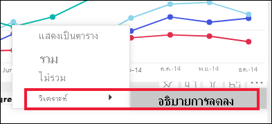

# ใช้ฟีเจอร์วิเคราะห์เพื่ออธิบายการผันผวนในภาพรายงานUse the Analyze feature to explain fluctuations in report visuals

[!INCLUDE[consumer-appliesto-yynn](../includes/consumer-appliesto-yynn.md)]

บ่อยครั้งในการแสดงผลด้วยภาพของรายงาน คุณจะเห็นการเพิ่มขึ้นอย่างมากจากนั้นลดความคมชัดในค่า และสงสัยเกี่ยวกับสาเหตุของความผันผวนดังกล่าวOften in report visuals, you see a large increase and then a sharp drop in values, and wonder about the cause of such fluctuations. คุณสามารถเรียนรู้สาเหตุด้วยการคลิกเพียงไม่กี่ครั้งด้วยการ **วิเคราะห์** ใน **บริการ Power BI**With **Analyze** in **the Power BI service**, you can learn the cause with just a few clicks.

ตัวอย่างเช่น พิจารณาภาพต่อไปนี้ที่แสดง *หน่วยทั้งหมด* ตาม *เดือน* และ *ผู้ผลิต*For example, consider the following visual that shows *Total units* by *Month* and *Manufacturer*. VanArsdel มีประสิทธิภาพเหนือกว่าคู่แข่ง แต่มีการลงลึกในเดือนมิถุนายน 2014VanArsdel is outperforming its competitors but has a deep dip in June 2014. ในกรณีดังกล่าว คุณสามารถสำรวจข้อมูล เพื่อช่วยอธิบายการเปลี่ยนแปลงที่เกิดขึ้นได้In such cases you can explore the data, to help explain the change that occurred. 

คุณสามารถขอให้บริการของ Power BI อธิบายการเพิ่มขึ้น ลดลง หรือตวามผิดปกติในภาพ และได้รับการวิเคราะห์ที่รวดเร็ว อัตโนมัติ และการวิเคราะห์มีข้อมูลเชิงลึกเกี่ยวกับข้อมูลของคุณYou can ask the Power BI service to explain increases, decreases, or unusual distributions in visuals, and get fast, automated, insightful analysis about your data. คลิกขวาที่จุดข้อมูล และเลือก **วิเคราะห์ > อธิบายการลดลง** (หรือเพิ่มขึ้น หากเส้นก่อนหน้านี้ต่ำกว่า) หรือ **วิเคราะห์ > หาว่าการกระจายนี้ต่างกันตรงไหน** และข้อมูลเชิงลึกจะถูกส่งไปให้คุณในหน้าต่างที่ใช้งานง่ายRight-click on a data point, and select **Analyze > Explain the decrease** (or increase, if the previous bar was lower), or **Analyze > Find where this distribution is different** and the insight is delivered to you in an easy-to-use window.

ฟีเจอร์วิเคราะห์ข้อมูลเชิงลึกมีบริบท และขึ้นอยู่กับจุดข้อมูลก่อนหน้า - เช่นแถบก่อนหน้า  หรือคอลัมน์ก่อนหน้าThe Analyze feature is contextual, and is based on the immediately previous data point - such as the previous bar, or column.

> [!NOTE]
> คุณลักษณะนี้ยังเป็นแค่ตัวอย่าง และอาจเปลี่ยนแปลงได้This feature is in preview, and is subject to change. เปิดใช้งานฟีเจอร์ข้อมูลเชิงลึกแล้วตามค่าเริ่มต้น (คุณไม่จำเป็นต้องตรวจสอบกล่องตัวอย่างเพื่อเปิดใช้งาน)The insight feature is enabled and on by default (you don't need to check a Preview box to enable it).

### มีการเลือกปัจจัยและหมวดหมู่ใดWhich factors and categories are chosen

หลังจากตรวจสอบคอลัมน์ที่แตกต่างกัน Power BI จะเลือกและแสดงปัจจัยข้อมูลที่แสดงการเปลี่ยนแปลงที่ใหญ่ที่สุดกับการสนับสนุนที่สัมพันธ์กันAfter examining different columns, Power BI selects and displays those factors that show the biggest change to relative contribution. สำหรับแต่ละหมวดหมู่ ค่าที่มีการเปลี่ยนแปลงของส่วนสนับสนุนอย่างมีนัยสำคัญที่สุดจะถูกนำไปใช้ในการอธิบายFor each, the values which had the most significant change to contribution are called out in the description. นอกจากนี้ ค่าที่มีการเพิ่มขึ้นและลดลงมากที่สุดตามที่เกิดขึ้นจริงจะถูกนำไปใช้ด้วยIn addition, the values that had the largest actual increases and decreases are also called out.

หากต้องการดูข้อมูลเชิงลึกทั้งหมดที่สร้างขึ้นโดย Power BI ให้ใช้แถบเลื่อนTo see all of the insights generated by Power BI, use the scrollbar. ลำดับคือการจัดอันดับด้วยผู้สนับสนุนที่สำคัญที่สุดจะแสดงก่อนThe order is ranked with the most significant contributor displayed first. 

## การใช้ข้อมูลเชิงลึกUsing insights
หากต้องการใช้ข้อมูลเชิงลึกเพื่ออธิบายแนวโน้มที่เห็นในภาพ ให้คลิกขวาบนจุดข้อมูลใดๆ ก็ตามในแผนภูมิแท่งหรือเส้น และเลือก **วิเคราะห์**To use insights to explain trends seen on visuals, right-click on any data point in a bar or line chart, and select **Analyze**. จากนั้นเลือกตัวเลือกที่ปรากฏขึ้น: **อธิบายการเพิ่มขึ้น** **อธิบายการลดลง** หรือ **อธิบายส่วนต่าง**Then choose the option that appears: **explain the increase**, **explain the decrease**, or **explain the difference**.

Power BI Desktop จะเรียกใช้อัลกอริทึมการเรียนรู้ กับข้อมูล และเพิ่มวิชวลและคำอธิบายลงในหน้าต่าง ที่ใช้อธิบายว่าข้อมูลประเภทไหนส่งผลต่อการเพิ่มขึ้นหรือลดลงมากที่สุดPower BI then runs its machine learning algorithms over the data, and populates a window with a visual and a description that describes which categories most influenced the increase or decrease or difference.  สำหรับตัวอย่างนี้ ข้อมูลเชิงลึกแรกคือแผนภูมิแบบน้ำตกFor this example, the first insight is a waterfall chart.

โดยการเลือกไอคอนขนาดเล็กที่ด้านล่างของแผนแบบภูมิน้ำตก คุณสามารถเลือกให้แสดงข้อมูลเชิงลึก เป็น แผนภูมิกระจาย แผนภูมิคอลัมน์แบบเรียงซ้อน หรือแผนภูมิ ribbonBy selecting the small icons at the bottom of the waterfall visual, you can choose to have insights display a scatter chart, stacked column chart, or a ribbon chart.

ใช้ไอคอน *ยกนิ้วโป้งขึ้น* และ *คว่ำนิ้วโป้งลง* ที่ด้านบนของหน้า เพื่อเสนอแนะคำติชมภาพและฟีเจอร์นี้Use the *thumbs up* and *thumbs down* icons at the top of the page to provide feedback about the visual and the feature.  

คุณสามารถใช้ข้อมูลเชิงลึกเมื่อรายงานของคุณอยู่ในโหมดอ่านหรือแก้ไข ซึ่งทำให้มีความยืดหยุ่นในการวิเคราะห์ข้อมูล และสร้างภาพที่คุณสามารถเพิ่มในรายงานของคุณได้อย่างง่ายดายYou can use insights when your report is in Reading or Editing view, making it versatile for both analyzing data, and for creating visuals you can easily add to your reports. ถ้าคุณมีรายงานที่เปิดอยู่ในมุมมองการแก้ไข คุณจะเห็นไอคอนเครื่องหมายบวกถัดจากไอคอนรูปนิ้วโป้งIf you have the report open in Editing view, you'll see a plus icon next to the thumb icons. เลือกไอคอนเครื่องหมายบวกเพื่อเพิ่มข้อมูลเชิงลึกลงในรายงานของคุณเป็นภาพใหม่Select the plus icon to add the insight to your report as a new visual. 

## รายละเอียดของผลลัพธ์ที่ส่งกลับDetails of the results returned

รายละเอียดที่ส่งกลับโดยข้อมูลเชิงลึกมีจุดมุ่งหมายเพื่อเน้นสิ่งที่แตกต่างกันระหว่างสองช่วงเวลา เพื่อช่วยให้คุณเข้าใจการเปลี่ยนแปลงระหว่างกันThe details returned by insights are intended to highlight what was different between the two time periods, to help you understand the change between them.  

อัลกอริธึมสามารถคิดได้ว่าจะใช้คอลัมน์อื่นๆ ทั้งหมดในโมเดลและคำนวณรายละเอียดตามคอลัมน์นั้น *ก่อน* และ *หลัง* ช่วงเวลาโดยพิจารณาว่ามีการเปลี่ยนแปลงเกิดขึ้นในรายละเอียดนั้น และจากนั้นส่งคืนคอลัมน์เหล่านั้นที่มีขนาดการเปลี่ยนแปลงมากที่สุดThe algorithm can be thought of as taking all the other columns in the model, and calculating the breakdown by that column for the *before* and *after* time periods, determining how much change occurred in that breakdown, and then returning those columns with the biggest change. ตัวอย่างเช่น *รัฐ* ถูกเลือกในข้อมูลเชิงลึกแบบน้ำตกด้านบน เนื่องจากการสนับสนุนที่โดยรัฐหลุยเซียนา เท็กซัส และโคโลราโดลดลง 13% ถึง 19% จากเดือนมิถุนายนถึงเดือนกรกฎาคม และให้ประโยชน์สูงสุดในการลดลงของ *หน่วยรวม*For example, *State* was selected in the waterfall insight above, as the contribution made by Louisiana, Texas, and Colorado fell 13% to 19% from June to July, and contributed the most to the decrease in *Total units*.  

สำหรับข้อมูลเชิงลึกแต่ละรายการที่ถูกส่งกลับ มีสี่ภาพที่สามารถแสดงได้For each insight returned, there are four visuals that can be displayed. ภาพสามภาพเหล่านี้มีจุดมุ่งหมายเพื่อเน้นการเปลี่ยนแปลงของส่วนสนับสนุนระหว่างสองช่วงเวลาThree of those visuals are intended to highlight the change in contribution between the two periods. ตัวอย่าง เช่นสำหรับคำอธิบายการเพิ่มขึ้นจาก *ไตรมาส 2* ถึง *ไตรมาส 3*For example, for the explanation of the increase from *Qtr 2* to *Qtr 3*. แผนภูมิ ribbon แสดงการเปลี่ยนแปลงทั้งก่อนและหลังจุดข้อมูลที่ถูกเลือกThe ribbon chart shows change both  before and after the selected data point.

### แผนภูมกระจายThe scatter plot

ภาพแผนภูมิกระจายจะแสดงค่าของการวัดในช่วงแรก (บนแกน x) เทียบกับค่าของการวัดในช่วงที่สอง (บนแกน y) สำหรับแต่ละค่าของคอลัมน์ (ในกรณีนี้คือ *รัฐ* ู่)The scatter plot visual shows the value of the measure in the first period (on the x-axis) against the value of the measure in the second period (on the y-axis), for each value of the column (*State* in this case). จุดข้อมูลอยู่ในภูมิภาคสีเขียวหากเพิ่มขึ้น และในภูมิภาคสีแดงหากลดลงData points are in the green region if they have increased, and in the red region if they have decreased. 

เส้นประแสดงให้เห็นถึงจุดที่พอเหมาะที่สุด  จุดข้อมูลเหนือเส้นนี้เพิ่มขึ้นมากกว่าแนวโน้มโดยรวมและจุดข้อมูลต่ำกว่าเส้นลดน้อยลงThe dotted line shows the best fit, and data points above this line increased by more than the overall trend, and those below it by less.  

รายการข้อมูลที่มีค่าว่างในช่วงเวลาหนึ่งๆ จะไม่ปรากฏในแผนภูมิกระจายData items whose value was blank in either period will not appear on the scatter plot.

### แผนภูมิคอลัมน์แบบเรียงซ้อน 100%The 100% stacked column chart

ภาพแผนภูมิคอลัมน์แบบเรียงซ้อน 100% แสดงค่าของการสนับสนุนสำหรับผลรวม (100%) สำหรับจุดข้อมูลที่เลือกและก่อนหน้านี้The 100% stacked column chart visual shows the value of the contribution to the total (100%), for the selected data point and the previous. ซึ่งจะช่วยให้เปรียบเทียบการสนับสนุนสำหรับแต่ละจุดข้อมูลได้แบบแบบเคียงข้างกันThis allows side-by-side comparison of the contribution for each data point. ในตัวอย่างนี้ คำแนะนำเครื่องมือแสดงการสนับสนุนจริงสำหรับค่าที่เลือกของรัฐเท็กซัสIn this example, the tooltips show the actual contribution for the selected value of Texas. เนื่องจากรายการของรัฐมีความยาว คำแนะนำเครื่องมือจะช่วยให้คุณเห็นรายละเอียดBecause the list of states is long, tooltips help you see the details. โดยใช้คำแนะนำเครื่องมือ เราเห็นว่ารัฐเท็กซัสมีส่วนเกี่ยวเนื่องกับจำนวนหน่วยรวม (31% และ 32%) แต่จำนวนของหน่วยทั้งหมดที่ลดลงจาก 89 เป็น 71By using the tooltips, we see that Texas contributed about the same percent to the total units (31% and 32%), but the actual number of total units decreased from 89 to 71. โปโปรดจำไว้ว่าแกน Y เป็นเปอร์เซ็นต์ ไม่ใช่ผลรวมและแต่ละแถบคอลัมน์เป็นเปอร์เซ็นต์ไม่ใช่ค่าRemember, the Y axis is a percentage, not a total, and each column band is a percentage, not a value. 

### แผนภูมิริบบอนThe ribbon chart

ภาพแผนภูมิ ribbon แสดงค่าของหน่วยวัดก่อนและหลังThe ribbon chart visual shows the value of the measure before and after. ซึ่งมีประโยชน์โดยเฉพาะอย่างยิ่งในการแสดงการเปลี่ยนแปลงของส่วนสนับสนุนเมื่อ *การเรียงลำดับ* ของผู้สนับสนุนมีการเปลี่ยนแปลง (ตัวอย่างเช่น *LA* ลดลงจากจำนวนผู้สนับสนุนอันดับสองไปเป็นอันดับสิบเอ็ด)It's particularly useful in showing the changes in contributions when the *ordering* of contributors changed (for example, *LA* dropped from number two contributor to number eleven).  และแม้ว่า *TX* ถูกแสดงด้วยริบบอนแบบกว้างที่ด้านบนซึ่งบ่งบอกว่าเป็นผู้สนับสนุนที่สำคัญที่สุดก่อนและหลัง ค่าที่ลดลงแสดงให้เห็นว่าค่าของการสนับสนุนลดลงทั้งในช่วงระยะเวลาที่เลือกไว้และหลังจากนั้นAnd, though *TX* is represented by a wide ribbon at the top signifying that it is the most significant contributor before and after, the drop shows that the value of the contribution dropped both during the selected period and after.

### แผนภูมิน้ำตกThe waterfall chart

ภาพที่สี่คือแผนภูมิน้ำตก ซึ่งแสดงการเพิ่มขึ้นหรือลดลงระหว่างช่วงเวลาตามจริงThe fourth visual is a waterfall chart, showing actual increases or decreases between the periods. ภาพนี้แสดงให้เห็นมีผู้มีสนับสนุนอย่างมีนัยสำคัญต่อการลดลงของเดือนมิถุนายน 2014 -- ในกรณีนี้คือ **รัฐ**This visual clearly shows one significant contributor to the decrease for June 2014 -- in this case, **State**. และผลกระทบของ **รัฐ** ในหน่วยรวมคือการปฏิเสธในรัฐหลุยเซียนา เท็กซัส และโคโลราโดที่มีบทบาทที่สำคัญที่สุดAnd the particulars of **State**'s influence on total units are that declines in Louisiana, Texas, and Colorado played the most significant role.      

 

## ข้อควรพิจารณาและข้อจำกัดConsiderations and limitations
เนื่องจากข้อมูลเชิงลึกเหล่านี้ขึ้นอยู่กับการเปลี่ยนแปลงจากจุดข้อมูลก่อนหน้า ดังนั้นจึงไม่สามารถใช้งานได้เมื่อคุณเลือกจุดข้อมูลแรกในภาพSince these insights are based on the change from the previous data point, they aren't available when you select the first data point in a visual. 

การ **วิเคราะห์** ไม่พร้อมใช้งานสำหรับชนิดภาพทั้งหมด**Analyze** is not available for all visual types. 

รายการต่อไปนี้คือคอลเลกชันของสถานการณ์ที่ไม่ได้รับการสนับสนุนในขณะนี้สำหรับ **วิเคราะห์ - อธิบายการเพิ่ม/ลด/ส่วนต่าง**:The following list is the collection of currently unsupported scenarios for **Analyze - explain the increase/decrease/difference**:

* ตัวกรอง TopNTopN filters
* ตัวกรอง รวม/ไม่รวมInclude/exclude filters
* ตัวกรองหน่วยวัดMeasure filters
* หน่วยวัดที่ไม่ใช่ตัวเลขNon-numeric measures
* ใช้ "แสดงค่าเป็น"Use of "Show value as"
* การวัดที่กรองแล้ว - การวัดที่กรองแล้วคือการคำนวณระดับชั้นด้วยสายตาโดยใช้ตัวกรองเฉพาะ (ตัวอย่างเช่น *ยอดขายรวมสำหรับประเทศฝรั่งเศส*) และใช้กับภาพจริงบางส่วนที่สร้างโดยคุณลักษณะข้อมูลเชิงลึกFiltered measures - filtered measures are visual level calculations with a specific filter applied (for example, *Total Sales for France*), and are used on some of the visuals created by the insights feature
* คอลัมน์ประเภทที่ใช้เป็นแกน X เว้นแต่ว่าจะกำหนดการเรียงลำดับตามคอลัมน์ที่เป็นสเกลาCategorical columns on X-axis unless it defines a sort by column that is scalar. ถ้ามีการใช้ลำดับชั้น ทุกคอลัมน์ในลำดับชั้นที่ใช้งานจะต้องตรงกับเงื่อนไขนี้If using a hierarchy, then every column in the active hierarchy has to match this condition

## ขั้นตอนถัดไปNext steps
[แผนภูมิน้ำตก](../visuals/power-bi-visualization-waterfall-charts.md)  [Waterfall charts](../visuals/power-bi-visualization-waterfall-charts.md)    
[แผนภูมิกระจาย](../visuals/power-bi-visualization-scatter.md)  [Scatter charts](../visuals/power-bi-visualization-scatter.md)    
[แผนภูมิคอลัมน์](../visuals/power-bi-report-visualizations.md)  [Column charts](../visuals/power-bi-report-visualizations.md)    
[แผนภูมิ RibbonRibbon charts](../visuals/desktop-ribbon-charts.md)
