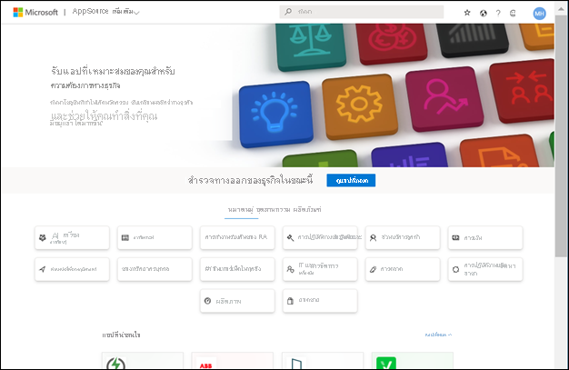
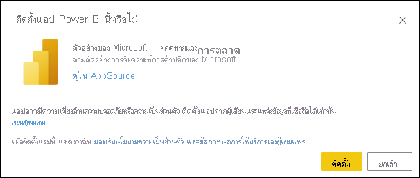

# ติดตั้งและใช้แอปตัวอย่างการขายและการตลาดในบริการของ Power BI

[!INCLUDE[consumer-appliesto-yyny](../includes/consumer-appliesto-yyny.md)]

ในตอนนี้คุณมี[ความเข้าใจพื้นฐานเกี่ยวกับวิธีการรับเนื้อหา Power BI](end-user-app-view.md) แล้ว เรามาลองใช้ Microsoft AppSource เพื่อรับแอปทางการตลาดและการขายกันดู แอปทางการตลาดและเทมเพลตการขายประกอบด้วยข้อมูลตัวอย่างที่คุณสามารถใช้เพื่อสำรวจบริการของ Power BI ได้ แอปโดยเฉพาะนี้มีแดชบอร์ดหนึ่งรายการและหลายหน้ารายงาน 

> [!IMPORTANT]
> การติดตั้งแอปนี้จาก Microsoft AppSource คุณต้องมีสิทธิ์การใช้งาน **Power BI Pro**  สำหรับข้อมูลเพิ่มเติม โปรดดู[สิทธิ์การใช้งาน](end-user-license.md)

## ดาวน์โหลดแอปจาก Microsoft AppSource

1. เปิด [https://appsource.microsoft.com](https://appsource.microsoft.com)

   

1. ในกล่องค้นหา ให้ป้อน **ตัวอย่างของ Microsoft** และเลือก **Microsoft ตัวอย่าง-ยอดขาย และการตลาด** 

    

1. หรือ อ่านภาพรวมและบทวิจารณ์ และดูภาพ  แล้วเลือก **รับทันที**

   

1. ยืนยันว่าคุณต้องการติดตั้งแอปนี้

   

5. บริการของ Power BI จะแสดงข้อความยืนยันเมื่อมีการติดตั้งแอปแล้ว เลือก **ไปยังแอป** หรือเลือกแอปจาก **แอป** canvas ของคุณ แดชบอร์ดของแอปหรือรายงานแอปจะแสดงขึ้นตามวิธีการที่นักออกแบบสร้างแอป

    

7.  แอปเทมเพลตนี้ได้รับการตั้งค่าให้เปิดแดชบอร์ด *นักออกแบบ* แอปสามารถตั้งค่าแอปเพื่อเปิดไปยังหน้ารายงานหนึ่งแทนได้  

    

## โต้ตอบกับแดชบอร์ดและรายงานในแอป
ใช้เวลาสักครู่เพื่อสำรวจข้อมูลในแดชบอร์ดและรายงานที่สร้างแอป คุณสามารถเข้าถึงการโต้ตอบของ Power BI แบบมาตรฐานทั้งหมดเช่น การกรอง การเน้น การเรียงลำดับ และการดูรายละเอียดแนวลึก  ยังสับสนเล็กน้อยจากความแตกต่างระหว่างแดชบอร์ดและรายงานหรือไม่  อ่าน[บทความเกี่ยวกับแดชบอร์ด](end-user-dashboards.md)และ[บทความเกี่ยวกับรายงาน](end-user-reports.md)  

## ขั้นตอนถัดไป
* [กลับไปยังภาพรวมของแอป](end-user-apps.md)    
* [ดูรายงาน Power BI](end-user-report-open.md)    
* [มีการแชร์เนื้อหาด้วยวิธีอื่นกับคุณ](end-user-shared-with-me.md)
