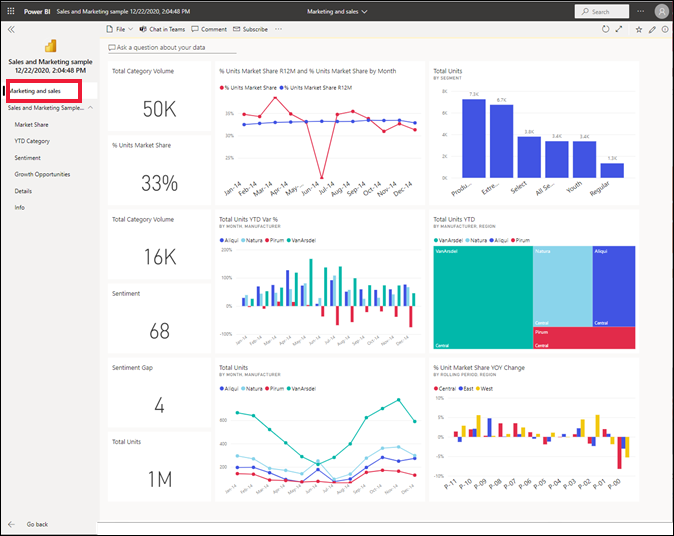

# ติดตั้งและใช้แอปตัวอย่างการขายและการตลาดในบริการของ Power BIInstall and use the sample Sales and Marketing app in the Power BI service

[!INCLUDE[consumer-appliesto-yyny](../includes/consumer-appliesto-yyny.md)]

ในตอนนี้คุณมี[ความเข้าใจพื้นฐานเกี่ยวกับวิธีการรับเนื้อหา Power BI](end-user-app-view.md) แล้ว เรามาลองใช้ Microsoft AppSource เพื่อรับแอปทางการตลาดและการขายกันดูNow that you have a [basic understanding of how to get Power BI content](end-user-app-view.md), let's use Microsoft AppSource to get the Marketing and Sales template app. แอปทางการตลาดและเทมเพลตการขายประกอบด้วยข้อมูลตัวอย่างที่คุณสามารถใช้เพื่อสำรวจบริการของ Power BI ได้The Marketing and Sales template app contains sample data that you can use to explore the Power BI service. แอปโดยเฉพาะนี้มีแดชบอร์ดหนึ่งรายการและหลายหน้ารายงานThis particular app has one dashboard and several report pages. 

> [!IMPORTANT]
> การติดตั้งแอปนี้จาก Microsoft AppSource คุณต้องมีสิทธิ์การใช้งาน **Power BI Pro**Installing this app from Microsoft AppSource requires that you have a **Power BI Pro** license.  สำหรับข้อมูลเพิ่มเติม โปรดดู[สิทธิ์การใช้งาน](end-user-license.md)For more information, see [licenses](end-user-license.md).

## ดาวน์โหลดแอปจาก Microsoft AppSourceGet the app from Microsoft AppSource

1. เปิด [https://appsource.microsoft.com](https://appsource.microsoft.com)Open [https://appsource.microsoft.com](https://appsource.microsoft.com).

   

1. ในกล่องค้นหา ให้ป้อน **ตัวอย่างของ Microsoft** และเลือก **Microsoft ตัวอย่าง-ยอดขาย และการตลาด**In the search box, enter **Microsoft sample** and select **Microsoft sample - Sales & Marketing**. 

    

1. หรือ อ่านภาพรวมและบทวิจารณ์ และดูภาพOptionally, read through the overview and reviews and take a look at the images.  แล้วเลือก **รับทันที**Then, select **Get it now**.

   

1. ยืนยันว่าคุณต้องการติดตั้งแอปนี้Confirm that you want to install this app.

   

5. บริการของ Power BI จะแสดงข้อความยืนยันเมื่อมีการติดตั้งแอปแล้วThe Power BI service displays a success message once the app is installed. เลือก **ไปยังแอป**Select **Go to app**. หรือเลือกแอปจาก **แอป** canvas ของคุณOr select the app itself from your **Apps** canvas. แดชบอร์ดของแอปหรือรายงานแอปจะแสดงขึ้นตามวิธีการที่นักออกแบบสร้างแอปDepending on how the designer created the app, either the app dashboard or app report will display.

    

7.  แอปเทมเพลตนี้ได้รับการตั้งค่าให้เปิดแดชบอร์ดThis template app is set to open to the dashboard. *นักออกแบบ* แอปสามารถตั้งค่าแอปเพื่อเปิดไปยังหน้ารายงานหนึ่งแทนได้The app *designer* could have set the app to open to one of the report pages instead.  

    

## โต้ตอบกับแดชบอร์ดและรายงานในแอปInteract with the dashboards and reports in the app
ใช้เวลาสักครู่เพื่อสำรวจข้อมูลในแดชบอร์ดและรายงานที่สร้างแอปTake some time to explore the data in the dashboards and reports that make up the app. คุณสามารถเข้าถึงการโต้ตอบของ Power BI แบบมาตรฐานทั้งหมดเช่น การกรอง การเน้น การเรียงลำดับ และการดูรายละเอียดแนวลึกYou have access to all of the standard Power BI interactions such as filtering, highlighting, sorting, and drilling down.  ยังสับสนเล็กน้อยจากความแตกต่างระหว่างแดชบอร์ดและรายงานหรือไม่Still a little confused by the difference between dashboards and reports?  อ่าน[บทความเกี่ยวกับแดชบอร์ด](end-user-dashboards.md)และ[บทความเกี่ยวกับรายงาน](end-user-reports.md)Read the [article about dashboards](end-user-dashboards.md) and the [article about reports](end-user-reports.md).  

## ขั้นตอนถัดไปNext steps
* [กลับไปยังภาพรวมของแอปBack to the apps overview](end-user-apps.md)    
* [ดูรายงาน Power BIView a Power BI report](end-user-report-open.md)    
* [มีการแชร์เนื้อหาด้วยวิธีอื่นกับคุณOther ways content is shared with you](end-user-shared-with-me.md)
