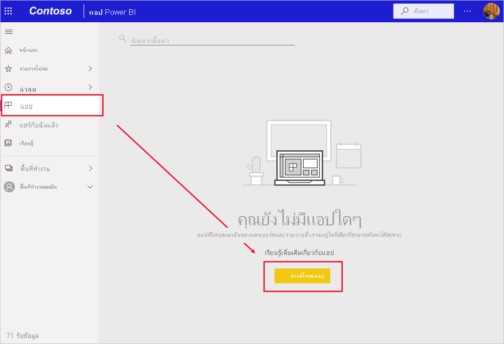
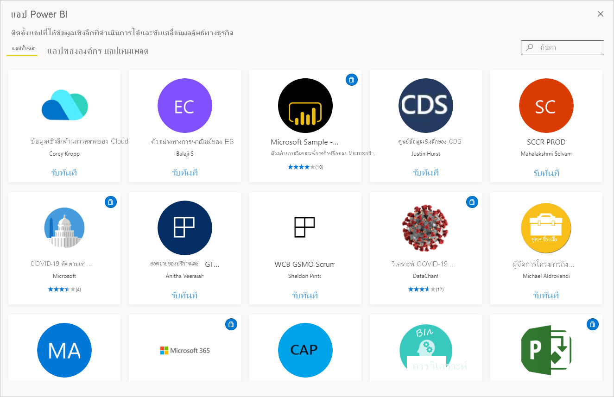
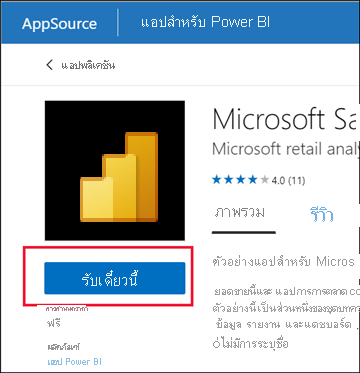
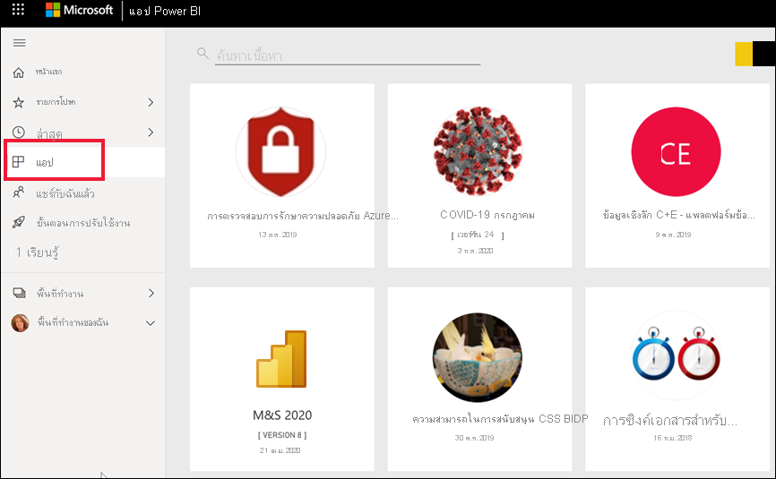
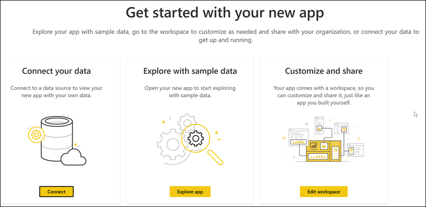
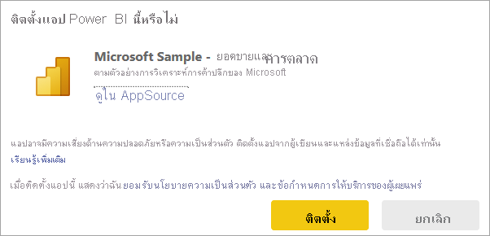
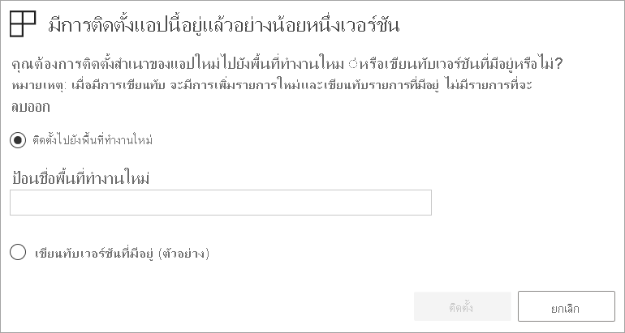

# ติดตั้งและใช้แอปกับแดชบอร์ดและรายงานInstall and use apps with dashboards and reports in Power BI

[!INCLUDE[consumer-appliesto-ynny](../includes/consumer-appliesto-ynny.md)]

ตอนนี้คุณมี [ความเข้าใจพื้นฐานของแอป](end-user-apps.md) มาเรียนรู้วิธีเปิดและโต้ตอบกับแอปNow that you have a [basic understanding of apps](end-user-apps.md), let's learn how to open and interact with apps. 

## วิธีรับแอปใหม่Ways to get a new app
มีหลายวิธีในการรับแอปใหม่:There are several ways to get a new app:
* คุณสามารถรับได้จาก marketplace ของแอป Power BI ในบริการ Power BIYou can get it from the Power BI app marketplace in the Power BI service.
* คุณสามารถใช้ลิงก์โดยตรงไปยังแอปที่คุณได้รับจากนักออกแบบแอปYou can use a direct link to an app that you have received from the app designer. 
* นักออกแบบแอปในองค์กรของคุณสามารถติดตั้งแอปโดยอัตโนมัติในบัญชี Power BI ของคุณได้An app designer in your organization can install the app automatically in your Power BI account.

คุณสามารถติดตั้งแอป Power BI สำหรับอุปกรณ์เคลื่อนที่ได้จากลิงก์โดยตรงเท่านั้นWith Power BI mobile, you can only install an app from a direct link. ถ้าผู้ออกแบบแอปติดตั้งแอปโดยอัตโนมัติ คุณจะเห็นได้ในรายการของแอปIf the app designer installs the app automatically, you'll see it in your list of apps.

## แอปและสิทธิ์การใช้งานApps and licenses
ไม่ใช่ว่าผู้ใช้ Power BI ทั้งหมดจะสามารถดูและโต้ตอบกับแอปได้Not all Power BI users can view and interact with apps. 
- หากคุณมีสิทธิ์การใช้งานฟรี คุณจะสามารถเปิดแอปที่จัดเก็บไว้ในความจุระดับพรีเมียมที่แบ่งปันกับคุณได้If you have a free license, you can open apps that are stored in Premium capacity and have then been shared with you.  
- หากคุณมีสิทธิ์การใช้งาน Pro คุณสามารถเปิดแอปที่แชร์กับคุณได้If you have a Pro license, you can open apps that have been shared with you.

ดังนั้นหากคุณไม่สามารถเปิดแอปได้ให้ติดต่อผู้ดูแลระบบหรือฝ่ายช่วยเหลือของคุณSo, if you cannot open an app, contact your administrator or help desk. สำหรับข้อมูลเกี่ยวกับการให้สิทธิ์การใช้งาน โปรดดู [การให้สิทธิ์การใช้งาน Power BI](end-user-license.md)For information about licensing, see [Power BI licensing](end-user-license.md).

## รับแอปจาก marketplace ของแอป Power BIGet the app from the Power BI apps marketplace

คุณสามารถค้นหาและติดตั้งแอปจาก marketplace ของแอป Power BI ได้You can find and install apps from the Power BI apps marketplace. ในแอป marketplace คุณสามารถรับทั้งแอปเทมเพลตและแอปแบบองค์กรได้In the apps marketplace you can get both organizational apps and template apps.

- แอปสำหรับ *องค์กร* พร้อมใช้งานสำหรับผู้ใช้ Power BI ในองค์กรของคุณAn *organizational app* is available to Power BI users in your organization. แอปเหล่านี้ยังมีแดชบอร์ดและรายงานที่สร้างไว้ล่วงหน้า ซึ่งคุณสามารถใช้งานตามรูปแบบที่เป็นอยู่หรือปรับแต่งตามความต้องการและแชร์ได้These apps also include pre-built dashboards and reports that you can use as-is or customize and share. องค์กรของคุณอาจมีแอปสำหรับการติดตามยอดขาย การวัดประสิทธิภาพ หรือการวิเคราะห์การจ้างงานที่ประสบความสำเร็จYour organization may have apps for tracking sales, measuring performance, or analyzing hiring success.
- *แอปเทมเพลต* มีแดชบอร์ดและรายงานที่สร้างไว้ล่วงหน้า ซึ่งคุณสามารถใช้เพื่อเชื่อมต่อกับบริการมากมายที่คุณใช้เพื่อดำเนินธุรกิจ เช่น Salesforce, Microsoft Dynamics และ Google AnalyticsA *template app* comes with pre-built dashboards and reports that you can use to connect to many of the services you use to run your business, such as SalesForce, Microsoft Dynamics, and Google Analytics.

1. [ลงชื่อเข้าใช้บริการของ Power BI](./end-user-sign-in.md) หากคุณยังไม่ได้ลงชื่อเข้าใช้[Sign in to the Power BI service](./end-user-sign-in.md) if you aren't already signed in. 

1. เมื่อเปิดบริการ Power BI แล้ว ให้เลือก **แอป > รับแอป**Once the Power BI service is open, select **Apps > Get apps**. 

    

1. Power BI apps marketplace จะเปิดขึ้นThe Power BI apps marketplace opens.

   

   มีสามแท็บที่พร้อมให้คุณได้ใช้:Three tabs are available for you to use:
   * **แอปทั้งหมด** - เรียกดูทั้งแอปแบบเทมเพลตและแอปแบบองค์กรทั้งหมดที่พร้อมใช้งานสำหรับคุณ**All apps** - Browse both template apps and all the organizational apps that are available to you. แอปเทมเพลตนั้นโดดเด่นด้วยไอคอนถุงช็อปปิ้งที่มุมขวาบนของไทล์Template apps are distinguished by the shopping bag icon in the upper right corner of their tiles.
   * **แอปขององค์กร** - เรียกดูแอปขององค์กรที่มีการแชร์กับคุณ**Organizational apps** - Browse organizational apps that have been shared with you. 
   * **แอปแบบเทมเพลต** - เรียกดูแอปแบบเทมเพลตที่โฮสต์บน AppSource**Template apps** - Browse template apps that are hosted on AppSource.

   อีกวิธีหนึ่งคือ คุณสามารถใช้กล่องค้นหาเพื่อรับการเลือกแอปพลิเคชันที่กรองแล้วAlternatively, you can use the search box to get a filtered selection of apps. การพิมพ์ส่วนหนึ่งของชื่อแอป หรือประเภทเช่น การเงิน การวิเคราะห์ การตลาด และอื่นๆ จะช่วยให้ง่ายต่อการค้นหารายการที่คุณกำลังมองหาTyping part of the name of an app, or of a category such as finance, analytics, marketing, etc., will make it easier to find the item you're looking for. 

   กล่องค้นหามีความสำคัญกับแท็บที่คุณมีแอปที่เปิดอย่างเดียวของชนิดที่เลือกเท่านั้นที่จะถูกส่งกลับThe search box is sensitive to the tab you have open - only apps of the selected type will be returned. ถ้าแท็บ **แอปทั้งหมด** เปิดอยู่ทั้งแอปองค์กรและแบบเทมเพลตจะถูกส่งกลับIf the **All apps** tab is open, both organizational and template apps are returned. ซึ่งสามารถทำให้เกิดความสับสนได้เมื่อแอปองค์กรและแอปแบบเทมเพลตมีชื่อเดียวกันThis can be confusing when an organizational app and a template app have the same name. โปรดจำไว้ว่าไทล์แอปแบบเทมเพลตจะมีไอคอนถุงช้อปปิ้งในมุมบนขวาJust remember that the template app tiles have a a shopping bag icon in the top right corner.

4. เมื่อคุณพบแอปที่คุณต้องการ ให้เลือก **รับทันที** เพื่อติดตั้งWhen you find the app you want, select **Get it now** to install it.

   

* หากคุณกำลังติดตั้งแอปองค์กร มันจะถูกเพิ่มลงในรายการแอปของคุณทันทีIf you're installing an organizational app, it will immediately be added to your list of apps.
* ถ้าคุณกำลังติดตั้งแอปแบบเทมเพลต คุณจะถูกนำไปยังแอปแบบเทมเพลตที่เสนอใน AppSourceIf you're installing a template app, you will be taken to the template app offering in AppSource. ดู [ตัวอย่าง](end-user-app-marketing.md) ของวิธีการดาวน์โหลดและติดตั้งแอปแบบเทมเพลตตัวอย่างจาก Power BI apps marketplaceSee [an example](end-user-app-marketing.md) of how to download and install a sample template app from the Power BI apps marketplace. แอปถูกติดตั้งพร้อมกับพื้นที่ทำงานในชื่อเดียวกันThe app is installed, along with a workspace of the same name.

   > [!NOTE]
   > หากคุณกำลังใช้สิทธิ์การใช้งานฟรี คุณจะสามารถดาวน์โหลดแอปได้ แต่จะไม่สามารถดูไฟล์เหล่านั้นได้ เว้นแต่ว่าคุณอัปเกรดเป็นบัญชี Power BI Pro หรือเว้นแต่ว่าแอปจะถูกจัดเก็บไว้ในความจุระดับพรีเมียมที่ใช้งานร่วมกันIf you are using a free user license, you'll be able to download apps but won't be able to view them unless you upgrade to a Power BI Pro account or unless the app is stored in a Premium shared capacity. สำหรับข้อมูลเพิ่มเติม โปรดดูที่ [สิทธิ์การใช้งานสำหรับผู้ใช้ธุรกิจ](end-user-license.md)For more information, see [licenses for business users](end-user-license.md).

## ติดตั้งแอปจากลิงก์โดยตรงInstall an app from a direct link
คุณยังสามารถติดตั้งแอปขององค์กรได้จากลิงก์โดยตรงYou can also install an organizational app from a direct link.    

**บนคอมพิวเตอร์ของคุณ****On your computer** 

เมื่อคุณเลือกที่ลิงก์ในอีเมล บริการของ Power BI ([https://app.powerbi.com](https://app.powerbi.com)) จะเปิดแอปในเบราว์เซอร์ของคุณWhen you select the link in email, the Power BI service ([https://app.powerbi.com](https://app.powerbi.com)) opens the app in your browser. 

**บน iOS หรืออุปกรณ์เคลื่อนที่ Android ของคุณ****On your iOS or Android mobile device** 

เมื่อคุณเลือกลิงก์ในอีเมลบนอุปกรณ์เคลื่อนที่ของคุณ แอปจะติดตั้งโดยอัตโนมัติและเปิดในแอปสำหรับอุปกรณ์เคลื่อนที่When you select the link in email on your mobile device, the app installs automatically and opens in the mobile app. คุณอาจต้องลงชื่อเข้าใช้ก่อนYou may have to sign in first. 

## โต้ตอบกับแดชบอร์ดและรายงานในแอปInteract with the dashboards and reports in the app
ใช้เวลาสักครู่เพื่อสำรวจข้อมูลในแดชบอร์ดและรายงานที่สร้างแอปTake some time to explore the data in the dashboards and reports that make up the app. คุณสามารถเข้าถึงการโต้ตอบของ Power BI แบบมาตรฐานทั้งหมดเช่น การกรอง การเน้น การเรียงลำดับ และการดูรายละเอียดแนวลึกYou have access to all of the standard Power BI interactions such as filtering, highlighting, sorting, and drilling down.  ขอบเขตของสิ่งที่คุณสามารถทำได้กับแอปจะถูกควบคุมโดยการอนุญาตที่ *ผู้ออกแบบ* กำหนดให้กับคุณThe extent of what you can do with an app is controlled by the permissions that the *designer* assigned to you.  วิธีที่คุณสามารถโต้ตอบกับแดชบอร์ดและรายงานของแอปนั้นควบคุมโดยการเข้าถึงและบทบาทที่ *ผู้ออกแบบ* กำหนดให้กับคุณHow you can interact with the app's dashboards and reports is controlled by the access and roles that the *designer* assigned to you. 

ยังสับสนเล็กน้อยจากความแตกต่างระหว่างแดชบอร์ดและรายงานหรือไม่Still a little confused by the difference between dashboards and reports?  อ่าน[บทความเกี่ยวกับแดชบอร์ด](end-user-dashboards.md)และ[บทความเกี่ยวกับรายงาน](end-user-reports.md)Read the [article about dashboards](end-user-dashboards.md) and the [article about reports](end-user-reports.md).  

### เปิดแอปOpen an app

คุณได้ติดตั้งแอปหรือได้รับแอปจากเพื่อนร่วมงานแล้วYou've installed an app, or have received an app from a colleague. หากต้องการดูแอปดังกล่าว ให้เปิดรายการเนื้อหาแอปของคุณโดยการเลือก **แอป** จากบานหน้าต่างการนำทางTo view that app, open your Apps content list by selecting **Apps** from the navigation pane.

เลื่อนเมาส์ไปที่แอปและเลือกเพื่อเปิดHover and select the app to open. คุณอาจได้รับข้อความแจ้งเตือนที่มีลักษณะคล้ายกับข้อความต่อไปนี้ ทั้งนี้ขึ้นอยู่กับแอป:Depending on the app, you may receive a prompt that looks similar to this:

สำหรับคำแนะนำเกี่ยวกับตัวเลือกที่ควรเลือก โปรดดูที่[ติดตั้งแอปเทมเพลต](../connect-data/service-template-apps-install-distribute.md)For guidance on which option to select, see [Install template apps](../connect-data/service-template-apps-install-distribute.md).

วางเมาส์เหนือแอปเพื่อดูรายละเอียด และเลือกการ์ดแอปเพื่อเปิดแอปHover over the app to see details, and select the app card to open the app.

แอปจะเปิดขึ้นThe app opens. ทุกแอปมีลักษณะที่แตกต่างกัน - โครงสร้าง วิชวล สี และตัวเลือกแตกต่างกันEvery app will look different - different layout, visuals, colors, options. แต่แอปทั้งหมดมีคุณลักษณะบางอย่างที่เหมือนกันBut all apps do have some common features.

1. ชื่อของแอปและเวลาที่อัปเดตครั้งล่าสุดName of the app and last updated time. เลือกลูกศรแบบหล่นลงเพื่อดูข้อมูลเกี่ยวกับเจ้าของและการติดต่อเพื่อขอความช่วยเหลือSelect the dropdown arrow to look up the owner and Help contact.
1. เลือก **Power BI** เพื่อกลับไปยัง [หน้าแรก](end-user-home.md)Select **Power BI** to return to [Home](end-user-home.md).
1. แถบการดำเนินการของคุณYour action bar. 
1. พื้นที่ทำงานของหน้ารายงานThe report page canvas.
1. บานหน้าต่างการนำทางของแอปThe app navigation pane.  ด้านล่างชื่อแอปคือรายชื่อเนื้อหาBelow the name of the app is the list of content. แอปนี้มีรายงานหนึ่งฉบับที่มีหกหน้าThis app has one report with six pages. ให้เลือกชื่อของหน้ารายงานเพื่อเปิดหน้าดังกล่าวSelect a report page name to open it. ในขณะนี้เรามีหน้า *อัตราการส่งกลับ* ที่เปิดอยู่We currently have the *Return rate* page open. 
1. เลือกลูกศรเพื่อขยายบานหน้าต่าง **ตัวกรอง**Select the arrow to expand the **Filters** pane.

คุณยังสามารถสำรวจพื้นที่ทำงานที่เชื่อมโยงแล้วหากคุณได้รับสิทธิ์เข้าถึงYou can also explore the associated workspace if you've been given access.  เมื่อคุณติดตั้งหรือดาวน์โหลดแอปเทมเพลตบริการ Power BI จะสร้างพื้นที่ทำงานให้คุณWhen you install or download a template app, the Power BI service creates a workspace for you. เมื่อคุณติดตั้งแอปขององค์กร แอปนั้นอาจไม่รวมถึงการเข้าถึงพื้นที่ทำงานWhen you install an organizational app, it may not include access to the workspace. [เรียนรู้เกี่ยวกับพื้นที่ทำงาน](end-user-workspaces.md)[Learn about workspaces](end-user-workspaces.md). เลือก **Power BI** (หมายเลข 2) เพื่อกลับไปที่ **หน้าหลัก** และเลือก **พื้นที่ทำงาน**Select **Power BI** (number 2) to return to **Home** and choose **Workspaces**. 

## อัปเดตแอปUpdate an app 

นักออกแบบแอปอาจเผยแพร่แอปเวอร์ชันใหม่ของตนเองบ้างเป็นครั้งคราวFrom time to time, app designers may release new versions of their apps. การค้นหาเวอร์ชันใหม่จะขึ้นอยู่กับวิธีการที่คุณได้รับเวอร์ชันเดิมHow you get the new version depends on how you received the original. 

* หากคุณได้รับแอปมาจากองค์กรของคุ การอัปเดตเป็นเวอร์ชันใหม่จะเป็นไปอย่างโปร่งใสอย่างยิ่ง และคุณไม่จำเป็นต้องทำอะไรเลยIf you got the app from your organization, the update to the new version is entirely transparent - you don't have to do anything. 

* ถ้าคุณมีแอปจาก AppSource ในครั้งถัดไปที่คุณเปิดแอปคุณจะเห็นแบนเนอร์การแจ้งเตือนIf you got a template app from AppSource, the next time you open the app you'll see a notification banner. การแจ้งเตือนช่วยให้คุณทราบว่าเวอร์ชันใหม่พร้อมใช้งานแล้วThe notification lets you know that a new version is available. 

    1. เลือก **รับทันที** เพื่ออัปเดตSelect **Get it** to update.  

        <!-- -->

    2. เมื่อได้รับพร้อมท์ ให้ติดตั้งแอปที่อัปเดตแล้วเลือก **ติดตั้ง**When prompted to install the updated app, select **Install**. 

         

    3. เนื่องจากคุณมีเวอร์ชันของแอปนี้อยู่แล้ว ให้ตัดสินใจว่าจะแทนที่เวอร์ชันที่มีอยู่หรือจะติดตั้งแอปที่อัปเดตแล้วในพื้นที่ทำงานใหม่Since you already have a version of this app, decide whether to replace the existing version or whether to install the updated app in a new workspace.   

         

     > [!NOTE] 
     > การติดตั้งเวอร์ชันใหม่นั้นจะเขียนทับการเปลี่ยนแปลงใด ๆ ที่คุณอาจทำในรายงานและแดชบอร์ดของแอปInstalling a new version overwrites any changes you may have made to the app's reports and dashboards. เพื่อให้คุณได้เก็บรายงานและแดชบอร์ดล่าสุด คุณจะสามารถบันทึกไว้ในชื่อหรือตำแหน่งอื่นก่อนทำการติดตั้งTo keep your updated reports and dashboards, you can save them under a different name or in a different location before installing. 

    4. เมื่อคุณติดตั้งเวอร์ชันอัปเดตแล้ว ให้เลือก **อัปเดตแอป** เพื่อดำเนินกระบวนการอัปเดตให้เสร็จสมบูรณ์Once you've installed the updated version, select **Update app** to complete the update process. 

## ข้อควรพิจารณาและการแก้ไขปัญหาConsiderations and troubleshooting

- ผู้ดูแลระบบ Power BI ของคุณสามารถเปิดและปิดความสามารถในการติดตั้งแอปได้The ability to install apps can be turned on and off by your Power BI administrator. ติดต่อแผนกไอทีหรือฝ่ายช่วยเหลือของคุณ หากคุณต้องการเปิดใช้งานคุณลักษณะนี้Contact your IT department or help desk if you need this feature enabled.    
- การใช้แอปจำเป็นต้องมีสิทธิ์การใช้งาน Pro หรือเพื่อให้แอปถูกจัดเก็บไว้ในพื้นที่ทำงานในความจุที่แชร์ระดับพรีเมียมThe use of apps requires either a Pro license or for the app to be stored in a workspace in Premium shared capacity. [เรียนรู้เกี่ยวกับสิทธิ์การใช้งาน](end-user-license.md)[Learn about licenses](end-user-license.md).

## ขั้นตอนถัดไปNext steps
* [กลับไปยังภาพรวมของแอปBack to the apps overview](end-user-apps.md)
* [ดูรายงาน Power BIView a Power BI report](end-user-report-open.md)
* [มีการแชร์เนื้อหาด้วยวิธีอื่นกับคุณOther ways content is shared with you](end-user-shared-with-me.md)

