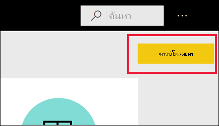

# แอปใน Power BIApps in Power BI

[!INCLUDE[consumer-appliesto-ynny](../includes/consumer-appliesto-ynny.md)]

## แอป Power BI คืออะไร?What is a Power BI app?
*แอป* เป็นประเภทเนื้อหา Power BI ที่รวมแดชบอร์ดและรายงานที่เกี่ยวข้องทั้งหมดไว้ในที่เดียวกันAn *app* is a Power BI content type that combines related dashboards and reports, all in one place. แอปสามารถมีแดชบอร์ดอย่างน้อยหนึ่งรายการและรายงานอย่างน้อยหนึ่งรายงานทั้งหมดรวมเข้าด้วยกันAn app can have one or more dashboards and one or more reports, all bundled together. แอปถูกสร้างโดย *นักออกแบบ* ของ Power BI ซึ่งเป็นผู้แจกจ่ายและแบ่งปันแอปกับเพื่อนร่วมงานของตนApps are created by Power BI *designers* who distribute and share the apps with their colleagues. มีหลายวิธีที่ *นักออกแบบ* สามารถแบ่งปันแอปได้There are many different ways a *designer* can share an app. หากต้องการเรียนรู้เพิ่มเติม ดโปรดูส่วน **รับแอปใหม่** ที่ด้านล่างTo learn more, see the **Get a new app** section, below. 

## *นักออกแบบ* แอปและ *ผู้ใช้* แอปApp *designers* and app *users*
คุณอาจเป็นผู้ที่สร้างแอป (*นักออกแบบ*) เพื่อใช้งานด้วยตนเอง หรือเพื่อแชร์กับเพื่อนร่วมงาน ทั้งนี้ขึ้นอยู่กับบทบาทของคุณDepending on your role, you may be someone who creates apps (*designer*) for your own use or to share with colleagues. หรือคุณอาจเป็นคนที่รับและดาวน์โหลดแอปที่สร้างโดยผู้อื่น (*ผู้บริโภคเชิงธุรกิจ*)Or, you may be someone who receives and downloads apps (*business user*) created by others. บทความนี้มีไว้สำหรับ *ผู้ใช้ธุรกิจ*This article is for *business users*.

การดูและการเปิดแอปจะต้องมีสิทธิ์บางประการSeeing and opening an app require certain permissions. ผู้รับต้องมีสิทธิ์การใช้งาน Power BI Pro หรือต้องมีการแชร์แอปให้กับผู้รับในที่เก็บข้อมูลระบบคลาวด์ชนิดพิเศษที่เรียกว่า **ความจุพรีเมียม**The recipient must either have a Power BI Pro license or the app must be shared with the recipient in a special type of cloud storage called **Premium capacity**. สามารถเรียนรู้เพิ่มเติมเกี่ยวกับสิทธิ์การใช้งานและความจุระดับพรีเมียม ได้ที่[สิทธิ์การใช้งานสำหรับบริการ Power BI](end-user-license.md)To learn more about licenses and Premium capacity, see [Licensing for the Power BI service](end-user-license.md).

## ข้อดีของแอปAdvantages of apps
แอปเป็นวิธีง่าย ๆ สำหรับ *นักออกแบบ* ในการแชร์เนื้อหาชนิดต่าง ๆ ในครั้งเดียวApps are an easy way for *designers* to share different types of content at one time. *นักออกแบบ* แอปจะสร้างแดชบอร์ดและรายงานและรวมเข้าด้วยกันในแอปApp *designers* create the dashboards and reports and bundle them together into an app. *นักออกแบบ* จะแบ่งปันหรือเผยแพร่แอปไปยังตำแหน่งที่ตั้งที่คุณซึ่งเป็น *ผู้บริโภค* สามารถเข้าถึงได้The *designers* then share or publish the app to a location where you, the *business user*, can access it. เนื่องจากแดชบอร์ดและรายงานที่เกี่ยวข้องจะรวมกัน ซึ่งเป็นเรื่องง่ายสำหรับคุณในการค้นหาและติดตั้งทั้งในบริการของ Power BI ([https://powerbi.com](https://powerbi.com)) และบนอุปกรณ์เคลื่อนที่ของคุณBecause related dashboards and reports are bundled together, it's easier for you to find and install in both the Power BI service ([https://powerbi.com](https://powerbi.com)) and on your mobile device. หลังจากที่คุณติดตั้งแอป คุณไม่จำเป็นต้องจำชื่อของรายงานหรือแดชบอร์ดต่าง ๆ มากมายเนื่องจากแดชบอร์ดมารวมกันในหนึ่งแอป ในเบราว์เซอร์ของคุณ หรือบนอุปกรณ์เคลื่อนที่ของคุณAfter you install an app, you don't have to remember the names of a lot of different dashboards or reports because they're all together in one app, in your browser or on your mobile device.

ด้วยแอป เมื่อใดก็ตามที่ผู้สร้างแอปออกการอัปเดต คุณจะได้รับการแจ้งเตือนหรือเห็นการเปลี่ยนแปลงโดยอัตโนมัติWith apps, whenever the app author releases updates, you either get a notification or you automatically see the changes. ผู้เขียนยังควบคุมความถของการรีเฟรชข้อมูล ดังนั้นคุณไม่จำเป็นต้องกังวลเกี่ยวกับการทำให้ล่าสุดThe author also controls how often the data is scheduled to refresh, so you don't need to worry about keeping it up to date. 

<!-- add conceptual art -->
## รับแอปใหม่Get a new app
มีแนวทางหลายวิธีในการรับแอปใหม่:There are several different ways to get a new app. คุณสามารถค้นหาและติดตั้งแอปได้ และผู้สร้างแอปสามารถแบ่งปันแอปกับคุณได้You can search, find, and install apps and app designers can share apps with you. 

### ค้นหาและติดตั้งแอปจาก marketplace ของแอป Power BI ได้Find and install apps from the Power BI apps marketplace
วิธีหนึ่งในการค้นหาแอปคือเลือก **รับแอป** จากหน้าจอ **แอป** Power BIOne way to find apps is to select **Get app** from the Power BI **Apps** screen. 

เรียกดูรายการของแอปใน marketplace ของแอป Power BI จนกว่าคุณจะพบการติดตั้งBrowse through the list of apps in the Power BI apps marketplace until you find one to install. เลือกจาก **แอปองค์กร** ซึ่งมีให้เฉพาะบุคคลในบริษัทของคุณ หรือ **แอปเทมเพลต** ซึ่งเผยแพร่โดย Microsoft และชุมชนเพื่อให้ผู้ใช้ Power BI สามารถติดตั้งได้Choose from **Organizational apps**, which are only available to people in your company, or **Template apps**, which are published by Microsoft and the community for any Power BI user to install. 

มีวิธีอีกสองสามวิธีในการรับแอปThere are a few other ways to get apps. วิธีการดังกล่าวจะแสดงอยู่ด้านล่างSome of these ways are listed below. แต่สำหรับคำแนะนำทีละขั้นตอนโดยละเอียดสำหรับการรับและสำรวจแอป ให้ดู [เปิดและโต้ตอบกับแอป](end-user-app-view.md)But for detailed step-by-step instructions for getting and exploring an app, see [Open and interact with an app](end-user-app-view.md).

* นักออกแบบแอปสามารถติดตั้งแอปโดยอัตโนมัติในบัญชี Power BI ของคุณ และในครั้งต่อไปที่คุณเปิดบริการของ Power BI คุณจะเห็นแอปใหม่ในรายการเนื้อหาของ **แอป**The app designer can install the app automatically in your Power BI account, and the next time you open the Power BI service, you'll see the new app in your **Apps** content list. 
* ผู้ออกแบบแอปสามารถส่งอีเมลลิงก์โดยตรงไปยังแอปให้กับคุณได้The app designer can email you a direct link to an app. การเลือกลิงก์จะเปิดแอปในบริการของ Power BISelecting the link opens the app in the Power BI service.
* ใน Power BI บนอุปกรณ์เคลื่อนที่ของคุณ คุณสามารถเติดตั้งแอปได้ จากลิงก์โดยตรงเท่านั้น และไม่สามารถตัดตั้งจาก marketplace ของแอปIn Power BI on your mobile device, you can only install an app from a direct link, and not from the apps marketplace. ถ้าผู้สร้างแอปติดตั้งแอปโดยอัตโนมัติ คุณจะเห็นได้ในรายการของแอปIf the app author installs the app automatically, you'll see it in your list of apps. 

แอปของคุณจัดอยู่ในรายการเนื้อหา **แอป**Your apps are organized in the **Apps** content list. เพียงแค่เลือก **แอป** เพื่อแสดงแอปของคุณJust select **Apps** to display your apps. วางเมาส์เหนือแอปเพื่อดูวันที่อัปเดตล่าสุดและเจ้าของHover over an app to see the last updated date and the owner. 

## ขั้นตอนถัดไปNext steps
* [เปิดและโต้ตอบกับแอปOpen and interact with an app](end-user-app-view.md)
* [วิธีอื่น ๆ ในการแชร์เนื้อหาOther ways to share content](end-user-shared-with-me.md)

