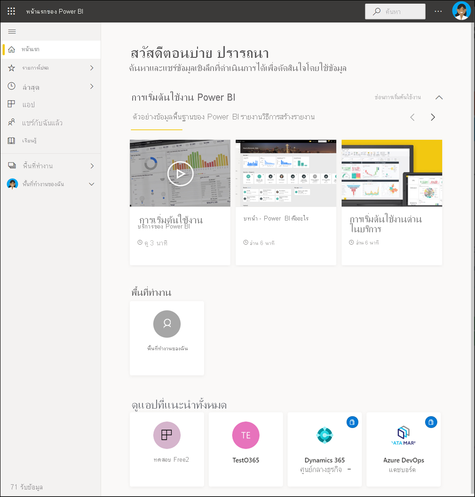
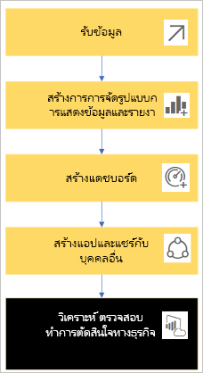
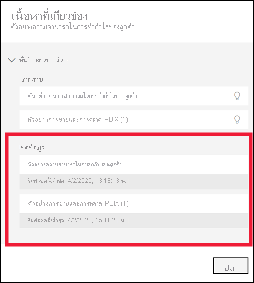
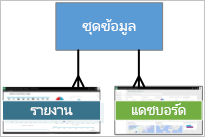
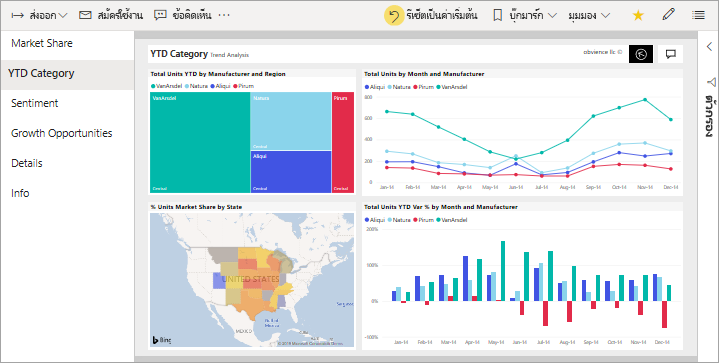
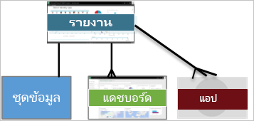
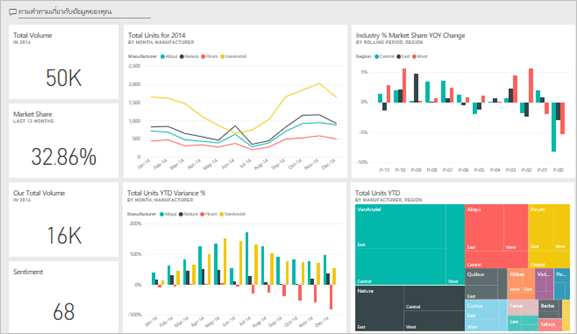
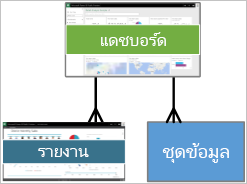
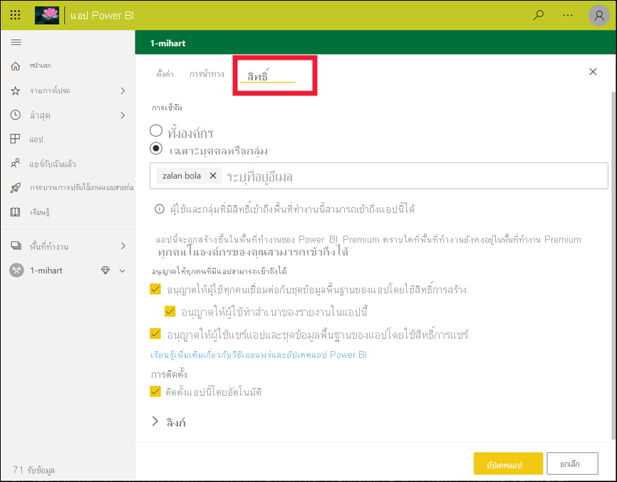
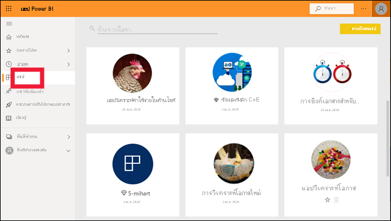

# แนวคิดพื้นฐานสำหรับลูกค้าที่ใช้บริการ Power BIBasic concepts for the Power BI service consumers

[!INCLUDE[consumer-appliesto-ynnm](../includes/consumer-appliesto-ynnm.md)]

[!INCLUDE [power-bi-service-new-look-include](../includes/power-bi-service-new-look-include.md)]

บทความนี้อนุมานว่าคุณได้อ่าน [ภาพรวม Power BI](../fundamentals/power-bi-overview.md) และได้ระบุว่าตัวเองเป็น[ผู้ใช้ทางธุรกิจของ Power BI](end-user-consumer.md)This article assumes that you've already read the [Power BI overview](../fundamentals/power-bi-overview.md) and have identified yourself as a [Power BI business user](end-user-consumer.md). *ผู้ใช้ทางธุรกิจ* ได้รับเนื้อหา Power BI เช่น แดชบอร์ด รายงาน และแอปจากเพื่อนร่วมงาน*Business users* receive Power BI content, like dashboards, reports, and apps, from colleagues. *ผู้ใช้ทางธุรกิจ* ทำงานกับบริการของ Power BI (app.powerbi.com) ซึ่งเป็นเวอร์ชันที่ใช้ในเว็บไซต์ของ Power BI*Business users* work with the Power BI service (app.powerbi.com), which is the website-based version of Power BI.

การรับเนื้อหาจากผู้อื่นต้องใช้หนึ่งในรายการต่อไปนี้:Receiving content from others requires one of the following:
- สิทธิการใช้งานผู้ใช้ Power BI ProA Power BI Pro user license
- องค์กรของคุณมีการสมัครใช้งานสำหรับ Power BI Premium และเนื้อหาที่จะใช้ร่วมกันกับคุณจากความจุ Power BI PremiumYour organization to have a subscription for Power BI Premium, and for the content to be shared with you from a Power BI Premium capacity. [ค้นหาสิทธิการใช้งานและชนิดการสมัครใช้งานของคุณ](end-user-license.md)[Look up your license and subscription types](end-user-license.md).

คุณจะได้ยินคำว่า "Power BI Desktop" หรือแค่ "Desktop"You'll undoubtedly hear the term "Power BI Desktop" or just "Desktop." เป็นเครื่องมือแบบสแตนด์อโลนใช้งานโดย *นักออกแบบ* ที่สร้างและแชร์แดชบอร์ดและรายงานกับคุณIt is the stand-alone tool used by *designers* who build and share dashboards and reports with you. สิ่งสำคัญคือต้องทราบว่ายังมีเครื่องมือ Power BI อื่นๆ อีกIt's important to know that there are other Power BI tools out there. ตราบใดที่คุณเป็นผู้ใช้ทางธุรกิจ\*\* คุณจะทำงานกับเฉพาะบริการ Power BI เท่านั้นAs long as you're a business user\*\*, you'll only work with the Power BI service. บทความนี้นำไปใช้กับบริการ Power BI เท่านั้นThis article applies only to the Power BI service.

## คำศัพท์และแนวคิดTerminology and concepts

บทความนี้ไม่ได้นำเสนอภาพของ Power BI หรือมีบทช่วยสอนแบบลงมือทำThis article isn't a visual tour of Power BI, nor is it a hands-on tutorial. แต่เรานำเสนอเป็นบทความภาพรวมซึ่งจะทำให้คุณเข้าใจคำศัพท์และแนวคิดเกี่ยวกับ Power BIInstead, it's an overview article that will get you comfortable with Power BI terminology and concepts. การนำเสนอจะสอนคุณเกี่ยวกับคำศัพท์และลักษณะทั่วไปIt will teach you the lingo and the lay of the land. สำหรับการแนะนำของบริการ Power BI และการนำทาง ให้ไปที่[เริ่มต้นใช้งานด่วน - ทัวร์ในบริการ Power BI](end-user-experience.md)For a tour of the Power BI service and its navigation, go to [Quickstart - Getting around in the Power BI service](end-user-experience.md).

## เปิดบริการ Power BI เป็นครั้งแรกOpen the Power BI service for the first time

*ผู้ใช้ทางธุรกิจ* Power BI ส่วนใหญ่จะได้รับบริการ Power BI เนื่องจาก 1)บริษัทซื้อใบอนุญาตและ 2)ผู้ดูแลระบบมอบหมายใบอนุญาตแก่พนักงานMost Power BI *business users* get the Power BI service because 1) their company buys licenses and 2) an admin assigns the licenses to employees.

เมื่อต้องเริ่มต้นใช้งาน เปิดเบราว์เซอร์และพิมพ์ **app.powerbi.com**To get started, open a browser and enter **app.powerbi.com** . ในครั้งแรกที่คุณเปิดบริการ Power BI คุณจะเห็นสิ่งนี้:The first time you open the Power BI service, you'll see something like the following:

เมื่อคุณใช้บริการ Power BI คุณจะต้องปรับเปลี่ยนสิ่งที่คุณเห็นเมื่อเปิดเว็บไซต์ในแต่ละครั้งAs you use the Power BI service, you'll personalize what you see when you open the website each time. ตัวอย่างเช่น บางคนชอบ Power BI เพื่อเปิดไปยัง **หน้าแรก** ในขณะที่คนอื่นมีแดชบอร์ดที่ชื่นชอบที่พวกเขาต้องการเห็นเป็นอันดับแรกFor example, some people like Power BI to open to  **Home** , while others have a favorite dashboard they want to see first. ไม่ต้องกังวล สองบทความนี้จะสอนวิธีการปรับแต่งประสบการณ์การใช้งานของคุณDon't worry, these two article will teach you how to personalize your experience.

- [ขอแนะนำหน้าแรกของ Power BI และการค้นหาในส่วนกลางIntroducing Power BI Home & Global Search](https://powerbi.microsoft.com/blog/introducing-power-bi-home-and-global-search)

- [แดชบอร์ดแนะนำใน Power BI serviceFeatured dashboards in the Power BI service](end-user-featured.md)

แต่ก่อนที่เราจะได้รับประโยชน์มากขึ้น ลองกลับมาพูดคุยเกี่ยวกับบล็อกการสร้างที่ประกอบเป็นบริการ Power BIBut before we get much further, let's back up and talk about the building blocks that make up the Power BI service.

_______________________________________________________

## เนื้อหา Power BIPower BI content

### ความรู้เบื้องต้นเกี่ยวกับบล็อกการสร้างIntroduction to building blocks

สำหรับ *ผู้ใช้ทางธุรกิจ* ของ Power BI บล็อกการสร้าง 5 กลุ่มคือ: **_การแสดงภาพข้อมูล_** , **_แดชบอร์ด_** , **_รายงาน_** , **_แอป_** และ **_ชุดข้อมูล_**For a Power BI *business user* , the five building blocks are: **_visualizations_** , **_dashboards_** , **_reports_** , **_apps_** , and **_datasets_** . สิ่งเหล่านี้บางครั้งเรียกว่าเนื้อหา *Power BI* **_content_**These are sometimes referred to as *Power BI* **_content_** . *เนื้อหา* มีอยู่ใน **_พื้นที่ทำงาน_***Content* exists in **_workspaces_** . เวิร์กโฟลว์ทั่วไปที่เกี่ยวข้องกับบล็อกการสร้างทั้งหมด: *ผู้ออกแบบ* Power BI (สีเหลืองในแผนภาพด้านล่าง) จะรวบรวมข้อมูลจาก *ชุดข้อมูล* นำมาสู่ Power BI เพื่อการวิเคราะห์ สร้าง *รายงาน* ที่เต็มไปด้วย *การแสดงภาพข้อมูล* ที่เน้นข้อเท็จจริงและข้อมูลเชิงลึกที่น่าสนใจ ปักหมุดการแสดงภาพข้อมูลจากรายงานไปยัง *แดชบอร์ด* และแชร์รายงานและแดชบอร์ดกับ *ผู้ใช้ทางธุรกิจ* เช่นคุณ (สีดำในแผนภาพด้านล่าง)A typical workflow involves all of the building blocks: A Power BI *designer* (yellow in diagram below) collects data from *datasets* , brings it into Power BI for analysis, creates *reports* full of *visualizations* that highlight interesting facts and insights, pins visualizations from reports to *dashboards* , and shares the reports and dashboards with *business users* like you (black in diagram below). *นักออกแบบ* แชร์ในรูปแบบของแดชบอร์ด รายงาน หรือแอปThe *designer* shares them in the form of dashboards, reports, or apps.

สำหรับคุณสมบัติพื้นฐานที่สุด:At its most basic:

-  **_การแสดงผลด้วยภาพ_** (หรือ *วิชวล* ) คือแผนภูมิประเภทหนึ่งที่สร้างด้วย *ตัวออกแบบ* Power BIa **_visualization_** (or *visual* ), is a type of chart built by Power BI *designers* . ภาพแสดงข้อมูลจาก *รายงาน* และ *ชุดข้อมูล*The visuals display the data from *reports* and *datasets* . โดยทั่วไปแล้ว *ผู้ออกแบบ* จะสร้างวิชวลใน Power BI DesktopTypically, *designers* build the visuals in Power BI Desktop.

    สำหรับรายละเอียดเพิ่มเติม ให้ดูที่ [โต้ตอบกับการแสดงภาพในรายงาน แดชบอร์ด และแอป](end-user-visualizations.md)For more info, see [Interact with Visuals in reports, dashboards, and apps](end-user-visualizations.md).

-  *ชุดข้อมูล* คือที่เก็บข้อมูลA *dataset* is a container of data. ตัวอย่างเช่น อาจเป็นไฟล์ Excel จากองค์กรอนามัยโลกFor example, it might be an Excel file from the World Health Organization. อาจเป็นฐานข้อมูลของบริษัทของลูกค้า หรืออาจเป็นไฟล์ SalesforceIt could also be a company-owned database of customers or it might be a Salesforce file. ชุดข้อมูลได้รับการจัดการโดย *นักออกแบบ*Datasets are managed by *designers* .

-  *แดชบอร์ด* เป็นหน้าจอเดียวที่มีภาพ ข้อความ และกราฟฟิคแบบโต้ตอบA *dashboard* is a single screen with interactive visuals, text, and graphics. หน้าแดชบอร์ดจะเก็บรวบรวมเมตริกที่สำคัญที่สุดของคุณในหนึ่งหน้าจอเพื่อบอกเล่าเรื่องราวหรือตอบคำถามA dashboard collects your most important metrics, on one screen, to tell a story or answer a question. เนื้อหาในหน้าแดชบอร์ดมาจากรายงานอย่างน้อยหนึ่งรายการและชุดข้อมูลอย่างน้อยหนึ่งชุดThe dashboard content comes from one or more reports and one or more datasets.

    สำหรับข้อมูลเพิ่มเติม ให้ดูที่[แดชบอร์ดสำหรับ Power BI บริการผู้ใช้ทางธุรกิจ](end-user-dashboards.md)For more info, see [Dashboards for the Power BI service business users](end-user-dashboards.md).

-  *รายงาน* คือหน้าของภาพ ข้อความ และกราฟฟิคแบบโต้ตอบอย่างน้อยหนึ่งหน้าซึ่งรวมกันเป็นรายงานเดียวA *report* is one or more pages of interactive visuals, text, and graphics that together make up a single report. Power BI สร้างรายงานโดยอ้างอิงจากชุดข้อมูลเดียวPower BI bases a report on a single dataset. บ่อยครั้งที่ *นักออกแบบ* จัดระเบียบหน้ารายงานให้อยู่ในพื้นที่ส่วนกลางของความสนใจหรือตอบคำถามเดียวOften, the *designer* organizes report pages to address a central area of interest or answer a single question.

    สำหรับข้อมูลเพิ่มเติม ให้ดูที่[รายงานใน Power BI](end-user-reports.md)For more info, see [Reports in Power BI](end-user-reports.md).

-  *แอป* เป็นอีกวิธีหนึ่งสำหรับ *ผู้ออกแบบ* ในการจัดกลุ่มและแบ่งปันหน้าแดชบอร์ดและรายงานที่เกี่ยวข้องกันAn *app* is a way for *designers* to bundle and share related dashboards and reports together. *ผู้ใช้ทางธุรกิจ* ได้รับแอปบางอย่างโดยอัตโนมัติ แต่สามารถไปหาแอปอื่น ๆ ที่เพื่อนร่วมงานหรือชุมชนสร้างขึ้นได้*Business users* receive some apps automatically but can go search for other apps created by colleagues or by the community. ตัวอย่างเช่นแอปพลิเคชันที่ใช้งานไม่ได้สำหรับบริการภายนอกที่คุณอาจใช้อยู่แล้วเช่น Google Analytics และ Microsoft Dynamics CRMFor example,out-of-the-box apps are available for external services you may already use, like Google Analytics and Microsoft Dynamics CRM.

เพื่อความชัดเจน หากคุณเป็นผู้ใช้ใหม่ และคุณลงชื่อเข้าใช้บริการ Power BI เป็นครั้งแรก คุณอาจจะยังไม่เห็นแดชบอร์ด แอปพลิเคชัน หรือรายงานที่ถูกแชร์To be clear, if you're a new user and you've logged in to the Power BI service for the first time, probably won't see any shared dashboards, apps, or reports yet.

_______________________________________________________

## ชุดข้อมูลDatasets

*ชุดข้อมูล* คือคอลเลกชันข้อมูลที่ *ผู้ออกแบบ* นำเข้าหรือเชื่อมต่อและใช้เพื่อสร้างรายงานและแดชบอร์ดA *dataset* is a collection of data that *designers* import or connect to and then use to build reports and dashboards. ในฐานะ *ผู้ใช้ทางธุรกิจ* คุณจะไม่โต้ตอบกับชุดข้อมูลโดยตรง แต่ก็ยังดีที่จะเรียนรู้ว่าชุดข้อมูลพอดีกับภาพที่ใหญ่ขึ้นอย่างไรAs a *business user* , you won't interact directly with datasets, but it's still nice to learn how they fit into the bigger picture.  

ชุดข้อมูลแต่ละชุดแสดงมาจากแหล่งข้อมูลเดียวEach dataset represents a single source of data. ตัวอย่างเช่น แหล่งข้อมูลอาจเป็นสมุดงาน Excel บน OneDrive, ชุดข้อมูลแบบตาราง SQL Server Analysis Services ภายในองค์กร หรือชุดข้อมูล SalesforceFor example, the source could be an Excel workbook on OneDrive, an on-premises SQL Server Analysis Services tabular dataset, or a Salesforce dataset. Power BI สนับสนุนแหล่งข้อมูลต่าง ๆ มากมายPower BI supports many different data sources.

เมื่อนักออกแบบแชร์แอปกับคุณ คุณสามารถค้นหาชุดข้อมูลที่กำลังใช้งานได้โดยการเปิด **เนื้อหาที่เกี่ยวข้อง**When a designer shares an app with you, you can look up which datasets are being used, by opening **Related content** .  คุณจะไม่สามารถเพิ่มหรือเปลี่ยนแปลงสิ่งใดในชุดข้อมูลYou won't be able to add or change anything in the dataset. แต่ถ้านักออกแบบให้สิทธิ์คุณ คุณจะสามารถดาวน์โหลดรายงานให้ค้นหา [ข้อมูลเชิงลึก ในข้อมูล](end-user-insights.md)หรือแม้กระทั่ง [สร้างรายงานของคุณเอง](../create-reports/service-report-create-new.md) โดยยึดตามชุดข้อมูลBut, if the designer gives you permissions, you'll be able to download the the report, look for [insights in the data](end-user-insights.md), or even [create your own report](../create-reports/service-report-create-new.md) based on the dataset.  

หนึ่งชุดข้อมูล...One dataset...

- ตัวออกแบบรายงานเพื่อสร้างแดชบอร์ดและรายงานสามารถใช้ซ้ำได้เรื่อยๆCan be used over and over by a report designer to create dashboards and reports

- สามารถใช้ในการสร้างรายงานต่าง ๆ ได้มากมายCan be used to create many different reports

- การแสดงภาพจากชุดข้อมูลเดียวสามารถแสดงในหลายๆ แดชบอร์ดได้Visuals from that one dataset can appear on many different dashboards

  

ไปที่บล็อกการสร้างถัดไป - การแสดงภาพข้อมูลOn to the next building block -- visualizations.

_______________________________________________________

## การแสดงผลข้อมูลด้วยภาพVisualizations

การแสดงภาพ (หรือที่รู้จักกันในนามวิชวล) แสดงข้อมูลเชิงลึกที่ Power BI ค้นพบในข้อมูลVisualizations (also known as visuals) display insights that Power BI discovers in the data. การแสดงภาพข้อมูลทำให้เข้าใจได้ง่ายขึ้นเนื่องจากสมองของคุณสามารถเข้าใจภาพได้เร็วกว่ากระดาษคำนวณตัวเลขVisualizations make it easier to interpret the insight, because your brain can comprehend a picture quicker than a spreadsheet of numbers.

เพียงบางส่วนของการแสดงภาพข้อมูลที่คุณพบใน Power BI ได้แก่ น้ำตก ริบบิ้น แผนที่ต้นไม้ พาย กรวย การ์ด กระจาย และเกจวัดJust some of the visualizations you'll come across in Power BI are: waterfall, ribbon, treemap, pie, funnel, card, scatter, and gauge.

   

ดู [รายการทั้งหมดของการแสดงภาพที่มาพร้อมกับ Power BI](end-user-visual-type.md)See the [full list of visualizations included with Power BI](end-user-visual-type.md).

การแสดงภาพข้อมูลพิเศษที่เรียกว่า *ภาพแบบกำหนดเอง* สามารถเรียกใช้งานได้จากชุมชนSpecial visualizations called *custom visuals* are available from the community. หากคุณได้รับรายงานด้วยภาพที่คุณไม่รู้จัก เป็นไปได้ว่าอาจเป็นภาพแบบกำหนดเองIf you receive a report with a visual you don't recognize, likely it's a custom visual. หากคุณต้องการความช่วยเหลือในการแปลภาพแบบกำหนดเองค้นหาชื่อ *ผู้ออกแบบ* ของรายงานหรือแดชบอร์ด และติดต่อเขาIf you need help with interpreting the custom visual, look up the name of the report or dashboard *designer* and contact them. ข้อมูลที่ติดต่อพร้อมใช้งานโดยการเลือกชื่อเรื่องจากแถบเมนูด้านบนContact information is available by selecting the title from the top menu bar.

หนึ่งจากการแสดงภาพในรายงาน...One visualization in a report...

- สามารถปรากฏหลายครั้งในรายงานเดียวกันได้Can appear multiple times in the same report

- สามารถปรากฏบนแดชบอร์ดที่แตกต่างกันได้Can appear on many different dashboards

_______________________________________________________

## รายงานReports

รายงาน Power BI คือหน้าเพจที่แสดงภาพ กราฟิก และข้อความอย่างน้อยหนึ่งหน้าA Power BI report is one or more pages of visualizations, graphics, and text. การแสดงภาพทั้งหมดในรายงานมาจากชุดข้อมูลเดียวAll of the visualizations in a report come from a single dataset. *ผู้ออกแบบ* สร้างหน้ารายงานและแชร์ให้กับผู้อื่น; เป็นรายบุคคลหรือเป็นส่วนหนึ่งของแอปพลิเคชัน*Designers* build reports and share them with others; either individually or as part of an app.  โดยทั่วไปแล้ว *ผู้ใช้ทางธุรกิจ* [โต้ตอบกับรายงานใน *มุมมองการอ่าน*](end-user-reading-view.md)Typically, *Business users* [interact with reports in *Reading view*](end-user-reading-view.md).

หนึ่งรายงาน...One report...

- สามารถเชื่อมโยงกับหลายแดชบอร์ดได้ (ไทล์ที่ปักหมุดจากรายงานนั้นอาจปรากฏบนหลายแดชบอร์ด)Can be associated with multiple dashboards (tiles pinned from that one report can appear on multiple dashboards).

- สามารถสร้างได้โดยใช้ข้อมูลจากชุดเดียวเท่านั้นCan be created using data from only one dataset.  

- สามารถเป็นส่วนหนึ่งของแอปได้หลายแอปCan be part of multiple apps.

  

_______________________________________________________

## แดชบอร์ดDashboards

แดชบอร์ดรายการแสดงมุมมองแบบกราฟิกที่กำหนดเองของชุดย่อยบางรายการของชุดข้อมูลเบื้องต้นA dashboard represents a customized graphical view of some subset of the underlying dataset(s). *ผู้ออกแบบ* สร้างหน้าแดชบอร์ดและแชร์ให้กับ *ผู้ใช้ทางธุรกิจ* ; เป็นรายบุคคลหรือเป็นส่วนหนึ่งของแอปพลิเคชัน*Designers* build dashboards and share them with *business users* ; either individually or as part of an app. แดชบอร์ดเป็นพื้นที่ทำงานเดี่ยวที่มี *ไทล์* กราฟิก และข้อความA dashboard is a single canvas that has *tiles* , graphics, and text.

  

ไทล์เป็นการแสดงผลภาพที่ *ผู้ออกแบบ* *ปัดหมุด* ตัวอย่างเช่น จากรายงานไปยังแดชบอร์ดA tile is a rendering of a visual that a *designer* *pins* , for example, from a report to a dashboard. แต่ละไทล์ที่ปักหมุดจะแสดง [การแสดงภาพ](end-user-visualizations.md) ที่ผู้ออกแบบ สร้างขึ้นจากชุดข้อมูลและปักหมุดลงบนแดชบอร์ดEach pinned tile shows a [visualization](end-user-visualizations.md) that a designer created from a dataset and pinned to that dashboard. ไทล์อาจประกอบด้วยทั้งหน้ารายงาน และสามารถประกอบด้วยข้อมูลการสตรีมแบบสดหรือวิดีโอA tile can also contain an entire report page and can contain live streaming data or a video. มีหลายวิธีที่ *ผู้ออกแบบ* เพิ่มไทล์ลงในแดชบอร์ด แต่มีจำนวนมากที่ครอบคลุมบทความภาพรวมนี้There are many ways that *designers* add tiles to dashboards, too many to cover in this overview article. เมื่อต้องการเรียนรู้เพิ่มเติม ดู[ไทล์แดชบอร์ดใน Power BI](end-user-tiles.md)To learn more, see [Dashboard tiles in Power BI](end-user-tiles.md).

*ผู้ใช้ทางธุรกิจ* ไม่สามารถแก้ไขแดชบอร์ด*Business users* can't edit dashboards. อย่างไรก็ตามคุณสามารถเพิ่มความคิดเห็น ดูข้อมูลที่เกี่ยวข้อง ตั้งค่าเป็นรายการโปรด สมัครรับข้อมูล และอื่น ๆ ได้You can however add comments, view related data, set it as favorite, subscribe, and more.

จุดประสงค์บางส่วนสำหรับแดชบอร์ดคืออะไรWhat are some purposes for dashboards?  ต่อไปนี้เป็นเพียงตัวอย่างเล็กน้อย:Here are just a few:

- เพื่อดูข้อมูลทั้งหมดที่จำเป็นสำหรับการตัดสินใจอย่างรวดเร็วto see, in one glance, all the information needed to make decisions

- เพื่อตรวจสอบข้อมูลที่สำคัญมากที่สุดเกี่ยวกับธุรกิจของคุณto monitor the most-important information about your business

- เพื่อให้แน่ใจว่าเพื่อนร่วมงานทั้งหมดเข้าใจตรงกัน ดู และใช้ข้อมูลเดียวกันto ensure all colleagues are on the same page; viewing and using the same information

- เพื่อการตรวจสอบสถานภาพของธุรกิจ หรือผลิตภัณฑ์ หรือหน่วยธุรกิจ หรือแคมเปญการตลาด และอื่น ๆto monitor the health of a business or product or business unit or marketing campaign, and so on

- เพื่อสร้างมุมมองส่วนบุคคลของแดชบอร์ดที่ใหญ่กว่า เมตริกทั้งหมดที่เกี่ยวข้องกับคุณto create a personalized view of a larger dashboard -- all the metrics that matter to you

**หนึ่ง** แดชบอร์ด...**ONE** dashboard...

- สามารถแสดงภาพจากหลายชุดข้อมูลที่แตกต่างกันได้can display visualizations from many different datasets

- สามารถแสดงภาพจากหลายรายงานที่แตกต่างกันได้can display visualizations from many different reports

- สามารถแสดงภาพที่ปักหมุดจากเครื่องมืออื่น ๆ ได้ (ตัวอย่างเช่น Excel)can display visualizations pinned from other tools (for example, Excel)

  

_______________________________________________________

## แอปApps

คอลเลกชันเหล่านี้ของแดชบอร์ดและรายงานจัดระเบียบเนื้อหาที่เกี่ยวข้องเข้าด้วยกันเป็นแพคเกจเดียวThese collections of dashboards and reports organize related content together into a single package. *ผู้ออกแบบ* Power BI สร้างในพื้นที่ทำงานและแชร์แอปให้กับบุคคล กลุ่ม บริษัททั้งองค์กร หรือประชาชนPower BI *designers* build them in workspaces and share apps with individuals, groups, entire organizations, or the public. ในฐานะ *ผู้ใช้ทางธุรกิจ* คุณสามารถมั่นใจได้ว่าคุณและเพื่อนร่วมงานของคุณกำลังทำงานกับข้อมูลเดียวกัน เวอร์ชันของความจริงที่เชื่อถือได้เพียงเวอร์ชันเดียวAs a *business user* , you can be confident that you and your colleagues are working with the same information; a single trusted version of the truth.

ในบางครั้งพื้นที่ทำงานของแอปจะถูกแชร์และสามารถทำให้มีผู้ใช้จำนวนมากและทำงานร่วมกันและอัปเดตได้ทั้งพื้นที่ทำงานและแอปSometimes, the app's workspace itself is shared, and there can be many people collaborating and updating both the workspace and the app. ขอบเขตของสิ่งที่คุณสามารถทำได้ด้วยแอปจะถูกกำหนดโดยสิทธิ์และการเข้าถึงที่คุณได้รับThe extent of what you can do with an app will be determined by the permissions and access you are given.

> [!NOTE]
> การใช้งานแอปจะต้องมีสิทธิ์ใช้งาน Power BI Pro หรือสำหรับพื้นที่ทำงานแอปที่จะจัดเก็บไว้ในความจุระดับพรีเมียมThe use of apps requires a Power BI Pro license, or for the app workspace to be stored in Premium capacity. [เรียนรู้เกี่ยวกับสิทธิ์การใช้งาน](end-user-license.md)[Learn about licenses](end-user-license.md).

สามารถหาแอปจากใน[บริการของ Power BI](https://powerbi.com) และจากอุปกรณ์มือถือของคุณและติดตั้งได้ง่ายๆApps are easy to find and install in the [Power BI service](https://powerbi.com) and on your mobile device. หลังจากที่คุณติดตั้งแอป คุณไม่จำเป็นต้องจำชื่อของแดชบอร์ดและรายงานต่าง ๆ มากมายAfter you install an app, you don't have to remember the names of a lot of different dashboards and reports. ทุกอย่างรวมกันอยู่ในแอปเดียว ในเบราว์เซอร์ของคุณ หรือ บนอุปกรณ์เคลื่อนที่ของคุณThey're all together in one app, in your browser, or on your mobile device.

แอปนี้มีแดชบอร์ดสองรายการและรายงานสองชุดซึ่งประกอบกันเป็นแอปเดียวThis app has two dashboards and two reports that make up a single app. หากคุณต้องการเลือกลูกศรทางด้านขวาของชื่อรายงานคุณจะเห็นรายการของเพจที่สร้างรายงานนั้นIf you were to select the arrow to the right of a report name, you'd see a list of pages that make up that report.

เมื่อใดก็ตามที่มีการอัปเดตแอป คุณจะเห็นการเปลี่ยนแปลงโดยอัตโนมัติWhenever the app is updated, you automatically see the changes. ผู้ออกแบบยังสามารถควบคุมกำหนดการสำหรับจำนวนครั้งที่ Power BI รีเฟรชข้อมูลAlso, the designer controls the schedule for how often Power BI refreshes the data. คุณไม่ต้องกังวลเกี่ยวกับการอัปเดตYou don't need to worry about keeping it up-to-date.

คุณสามารถรับแอปในสองสามวิธีที่แตกต่างกันYou can get apps in a few different ways:

- ตัวออกแบบแอปสามารถติดตั้งแอปโดยอัตโนมัติในบัญชี Power BI ของคุณThe app designer can install the app automatically in your Power BI account.

- ผู้ออกแบบแอปสามารถส่งลิงก์โดยตรงไปยังแอปฯได้ให้กับคุณได้The app designer can send you a direct link to an app.

- คุณสามารถค้นหาจากภายในบริการของ Power BI สำหรับแอปที่พร้อมใช้งานสำหรับคุณจากองค์กรของคุณหรือจากชุมชนYou can search from within the Power BI service for apps available to you from your organization or from the community. คุณสามารถเข้าชมใน [Microsoft AppSource](https://appsource.microsoft.com/marketplace/apps?product=power-bi) ที่ซึ่งคุณจะเห็นแอปทั้งหมดที่คุณสามารถใช้งานได้You can also visit [Microsoft AppSource](https://appsource.microsoft.com/marketplace/apps?product=power-bi), where you will see all the apps that you can use.

ใน Power BI บนอุปกรณ์เคลื่อนที่ของคุณ คุณสามารถเติดตั้งแอปได้ จากลิงก์โดยตรงเท่านั้น และไม่สามารถตัดตั้งจาก AppSourceIn Power BI on your mobile device, you can only install apps from a direct link, and not from AppSource. ถ้าผู้ออกแบบแอปติดตั้งแอปโดยอัตโนมัติ คุณจะเห็นได้ในรายการของแอปIf the app designer installs the app automatically, you'll see it in your list of apps.

เมื่อติดตั้งแอปแล้ว เพียงเลือกแอปจากรายการแอปของคุณ และเลือกหน้าแดชบอร์ดหรือรายงานที่จะเปิดและสำรวจก่อนOnce you've installed the app, just select it from your Apps list and select which dashboard or report to open and explore first.

ฉันหวังว่าบทความนี้จะทำให้คุณเข้าใจเกี่ยวกับบล็อกการสร้างที่ประกอบกันเป็นบริการ Power BI สำหรับผู้ใช้ทางธุรกิจI hope this article gave you an understanding of the building blocks that make up the Power BI service for business users.

## ขั้นตอนถัดไปNext steps

- ตรวจทานและบุ๊กมาร์ก[อภิธานศัพท์](end-user-glossary.md)Review and bookmark the [Glossary](end-user-glossary.md)

- ชม[การแนะนำบริการของ Power BI](end-user-experience.md)Take a [tour of the Power BI service](end-user-experience.md)

- อ่าน [ภาพรวมของ Power BI ที่เขียนขึ้นโดยเฉพาะสำหรับผู้ใช้ทางธุรกิจ](end-user-consumer.md)Read the [overview of Power BI written especially for business users](end-user-consumer.md)

- ดูวิดีโอที่จะตรวจทานแนวคิดพื้นฐานและให้คำแนะนำของบริการ Power BIWatch a video in which Will reviews the basic concepts and gives a tour of the Power BI service.

    <iframe width="560" height="315" src="https://www.youtube.com/embed/B2vd4MQrz4M" frameborder="0" allowfullscreen></iframe>
