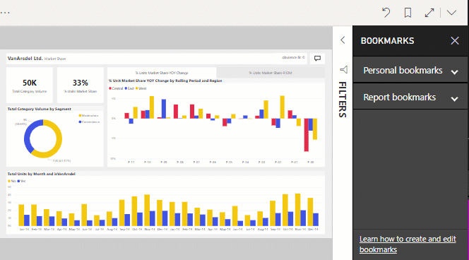

# บุ๊กมาร์กคืออะไรWhat are bookmarks?

[!INCLUDE[consumer-appliesto-ynnm](../includes/consumer-appliesto-ynnm.md)]

บุ๊กมาร์กจะจดจำมุมมองของหน้ารายงานที่กำหนดค่าไว้ในปัจจุบันเอาไว้ ซึ่งประกอบด้วยตัวกรอง ตัวแบ่งส่วนข้อมูล และสถานะของการแสดงผลด้วยภาพBookmarks capture the currently configured view of a report page, including filters, slicers, and the state of visuals. เมื่อคุณเลือกบุ๊กมาร์ก Power BI จะนำคุณกลับไปยังมุมมองนั้นWhen you select a bookmark, Power BI takes you back to that view. มีบุ๊กมาร์กอยู่สองแบบ คือแบบที่คุณสร้างขึ้นด้วยตัวคุณเองกับแบบที่ *ผู้ออกแบบ* รายงานเป็นผู้สร้างขึ้นThere are two types of bookmarks - those you create yourself and those created by report *designers*. ผู้ใช้ Power BI ใดก็ตามสามารถสร้างบุ๊กมาร์กส่วนบุคคลได้Any Power BI user can create personal bookmarks. อย่างไรก็ตาม ความสามารถในการใช้บุ๊กมาร์กที่สร้างโดยผู้อื่นต้องมีสิทธิการใช้งาน Power BI Pro หรือ PremiumHowever, the ability to use bookmarks created by others requires a Power BI Pro or Premium license. [ฉันมีสิทธิการใช้งานใดอยู่บ้างWhich license do I have?](end-user-license.md)

## ใช้บุ๊กมาร์กเพื่อแชร์ข้อมูลเชิงลึก และสร้างเรื่องราวใน Power BIUse bookmarks to share insights and build stories in Power BI 
บุ๊กมาร์กสามารถใช้งานได้หลากหลายอย่างThere are many uses for bookmarks. หากว่าคุณพบข้อมูลเชิงลึกที่น่าสนใจและต้องการเก็บไว้ ให้สร้างบุ๊กมาร์กไว้เพื่อให้คุณสามารถกลับมาดูได้ในภายหลังSay you discover an interesting insight and want to preserve it -- create a bookmark so you can return later. ให้สร้างบุ๊กมาร์กหากคุณต้องการออกจากงานและรักษางานปัจจุบันของคุณไว้Need to leave and want to preserve your current work, create a bookmark. และคุณยังสามารถสร้างบุ๊กมาร์กมุมมองเริ่มต้นของรายงานของคุณได้ด้วย ดังนั้น ทุกครั้งที่คุณกลับมามุมมองของหน้ารายงานนี้จะเปิดขึ้นมาก่อนYou can even make a bookmark your default view of the report, so each time you return, that view of the report page opens first. 

คุณยังสามารถสร้างคอลเลกชันของบุ๊กมาร์ก จัดเรียงรายการต่าง ๆ ในลำดับที่คุณต้องการ เพื่อในภายหลัง คุณสามารถไปยังทีละบุ๊กมาร์ค เพื่อนำเสนอชุดข้อมูลเชิงลึกที่ช่วยเล่าเรื่องราวได้You can also create a collection of bookmarks, arrange them in the order you want, and subsequently step through each bookmark in a presentation to highlight a series of insights that tell a story.  

แบ่งปันรายงานที่ทำบุ๊กมาร์กของคุณกับเพื่อนร่วมงานที่มีสิทธิ์การเข้าถึงแบบอ่านรายงานShare your bookmarked report with colleagues who also have read access to the report. มุมมองของรายงานที่ทำบุ๊กมาร์กจะไม่แทนที่รายงานต้นฉบับของผู้ออกแบบThe bookmarked view of the report does not override the designer's original report.  การแบ่งปันกับเพื่อนร่วมงานที่ยังไม่มีสิทธิ์การเข้าถึงแบบจำเป็นต้องมีสิทธิ์การแชร์ต่อSharing with colleagues who don't already have read access requires reshare permissions. หากคุณไม่สามารถแบ่งปันมุมมองของรายงานได้ โปรดติดต่อเจ้าของรายงานเพื่อร้องขอสิทธิ์การแชร์ต่อIf you are unable to share your view of the report, contact the report owner to request reshare permission.  

### แชร์การเปลี่ยนแปลงShare changes 
หากคุณมีสิทธิ์ในการอ่านและแชร์ต่อ คุณสามารถเลือกเพื่อรวมการเปลี่ยนแปลงของคุณได้เมื่อคุณแชร์รายงานIf you have read and reshare permissions, when you share the report you can choose to include your changes.

:::image type="content" source="media/end-user-bookmarks/power-bi-personalize-share-changes.png" alt-text="แชร์การเปลี่ยนแปลง":::
 

## เปิดบุ๊กมาร์กOpen bookmarks
เปิดแถบคำสั่งบุ๊กมาร์กโดยเลือก **บุ๊กมาร์ก** > **แสดงบุ๊กมาร์กเพิ่มเติม** จากแถบเมนูTo open the Bookmarks pane, select **Bookmarks** > **Show more bookmarks** from the menu bar. 

ในการแปลงกลับไปยังมุมมองเริ่มต้นของรายงาน ให้เลือกไอคอน **ตั้งค่าใหม่**To return to the original published view of the report, select the **reset** icon.

### บุ๊กมาร์กของรายงานReport bookmarks
หาก *ผู้ออกแบบ* รายงานมีบุ๊กมาร์กของรายงานให้ คุณจะพบบุ๊กมาร์กเหล่านั้นภายใต้หัวเรื่อง **บุ๊กมาร์กของรายงาน**If the report *designer* included report bookmarks, you'll find them under the **Report bookmarks** heading. หน้ารายงานนี้มีบุ๊กมาร์กสี่รายการ: B1, B2, VanArsdel YTD และ YTD ทั้งหมดThis report page has four bookmarks: B1, B2, VanArsdel YTD, and All YTD. **YTD ทั้งหมด** ถูกเลือกอยู่ในขณะนี้**All YTD** is currently selected.

> [!NOTE]
> คุณจะต้องใช้ Power BI Pro หรือ Premium เพื่อดูรายงานที่แชร์You will need Power BI Pro or Premium to view shared reports. 

เลือกบุ๊กมาร์กเพื่อเปลี่ยนไปยังมุมมองรายงานนั้นSelect a bookmark to change to that report view. 

### บุ๊กมาร์กส่วนบุคคลPersonal bookmarks

หากคุณสามารถดูรายงานได้ คุณยังสามารถเพิ่มบุ๊กมาร์กส่วนบุคคลได้อีกด้วยIf you can view a report, then you can also add personal bookmarks.  เมื่อคุณสร้างบุ๊กมาร์ก องค์ประกอบต่อไปนี้จะถูกบันทึกพร้อมบุ๊กมาร์ก:When you create a bookmark, the following elements are saved with the bookmark:

* หน้าปัจจุบันThe current page
* ตัวกรองFilters
* ตัวแบ่งส่วนข้อมูล รวมถึงชนิดตัวแบ่งส่วนข้อมูล (เช่น รายการดรอปดาวน์หรือรายการ) และสถานะของตัวแบ่งส่วนข้อมูลSlicers, including slicer type (for example, dropdown or list) and slicer state
* สถานะการเลือกการแสดงผลด้วยภาพ (เช่น ตัวกรองการไฮไลต์เชื่อมโยง)Visual selection state (such as cross-highlight filters)
* ลำดับการจัดเรียงSort order
* ตำแหน่งที่ดูรายละเอียดDrill location
* การมองเห็น (ของวัตถุ โดยใช้บานหน้าต่าง **เลือก**)Visibility (of an object, using the **Selection** pane)
* โหมดโฟกัส หรือ **สปอตไลต์** ของวัตถุใด ๆ ที่มองเห็นได้The focus or **Spotlight** modes of any visible object

กำหนดค่าหน้ารายงานตามที่คุณต้องการให้ปรากฏในบุ๊กมาร์กConfigure a report page the way you want it to appear in the bookmark. ในตัวอย่างนี้:In this example:

1. เราได้เปลี่ยนตัวกรองวันที่บนบานหน้าต่าง **ตัวกรอง**We've changed the existing Date filter on the **Filters** pane,
1. เปลี่ยนตัวกรองภูมิภาคบนบานหน้าต่าง **ตัวกรอง** และchanged the existing Regions filter on the **Filters** pane, and
1.  และเลือกจุดข้อมูลบนวิชวลแผนภูมิโดนัทเพื่อกรองข้ามและไฮไลต์ข้ามพื้นที่รายงานand selected a data points on the doughnut chart visual to cross-filter and cross-highlight the report canvas. 

เมื่อหน้ารายงานของคุณและวิชวล ถูกจัดเรียงในแบบที่คุณต้องการแล้ว เลือก **เพิ่ม** จากบานหน้าต่าง **บุ๊กมาร์ก** เพื่อเพิ่มบุ๊กมาร์กOnce your report page and visuals are arranged how you want them, select **Add** from the **Bookmarks** pane to add a bookmark. 

**Power BI** จะจัดทำบุ๊กมาร์กส่วนตัวและกำหนดชื่อแบบทั่วไปหรือชื่อให้คุณเลือกกรอก**Power BI** creates a personal bookmark and gives it a generic name or a name you enter. คุณสามารถ *เปลี่ยนชื่อ*, *ลบ* หรือ *อัปเดด* บุ๊กมาร์กได้โดยการเลือกจุดไข่ปลาที่อยู่ถัดจากชื่อบุ๊กมาร์ก จากนั้นเลือกการดำเนินการจากเมนูที่ปรากฏขึ้นYou can *rename*, *delete*, or *update* your bookmark by selecting the ellipses next to the bookmark's name, then selecting an action from the menu that appears.

เมื่อคุณมีบุ๊กมาร์กแล้ว แสดงบุ๊กมาร์กได้โดยการเลือกบนบุ๊กมาร์กในหน้าต่าง **บุ๊กมาร์ก**Once you have a bookmark, display it by selecting the bookmark in the **Bookmarks** pane. 

<!--
## Arranging bookmarks
As you create bookmarks, you might find that the order in which you create them isn't necessarily the same order you'd like to present them to your audience. No problem, you can easily rearrange the order of bookmarks.

In the **Bookmarks** pane, simply drag-and-drop bookmarks to change their order, as shown in the following image. The yellow bar between bookmarks designates where the dragged bookmark will be placed.

The order of your bookmarks can become important when you use the **View** feature of bookmarks, as described in the next section. 

-->

## ใช้บุ๊กมาร์กนำเสนอภาพนิ่งBookmarks as a slide show
หากต้องการแสดงหรือดูบุ๊กมาร์กตามลำดับ ให้เลือก **มุมมอง** จาก **หน้าต่างบุ๊กมาร์ก** เพื่อเริ่มต้นการนำเสนอสไลด์To present or view bookmarks, in order, select **View** from the **Bookmarks** pane to begin a slideshow.

เมื่ออยู่ในโหมด **มุมมอง** มีบางคุณสมบัติที่สังเกตได้:When in **View** mode, there are a few features to notice:

- ชื่อบุ๊กมาร์กปรากฏในแถบชื่อเรื่องบุ๊กมาร์ก ซึ่งอยู่ด้านล่างของพื้นที่ทำงานThe name of the bookmark appears in the bookmark title bar, which appears at the bottom of the canvas.
- แถบชื่อเรื่องบุ๊กมาร์ก มีลูกศรที่ช่วยให้คุณสามารถไปยังบุ๊กมาร์กถัดไป หรือก่อนหน้าได้The bookmark title bar has arrows that let you move to the next or previous bookmark.
- คุณสามารถออกจากโหมด **มุมมอง** โดยการเลือก **ออกจาก** จากบานหน้าต่าง **บุ๊กมาร์ก** หรือโดยการเลือก **X** ในแถบชื่อเรื่องบุ๊กมาร์กได้You can exit **View** mode by selecting **Exit** from the **Bookmarks** pane or by selecting the **X** found in the bookmark title bar.

เมื่อคุณอยู่ในโหมด **มุมมอง** คุณสามารถปิดบานหน้าต่าง **บุ๊กมาร์ก** (โดยการคลิก X บนบานหน้าต่างนั้น) เพื่อให้มีพื้นที่เพิ่มเติมสำหรับงานนำเสนอของคุณได้When you're in **View** mode, you can close the **Bookmarks** pane (by clicking the X on that pane) to provide more space for your presentation. และ ขณะที่อยู่ในโหมด **มุมมอง** วิชวลทั้งหมดเป็นแบบโต้ตอบ และพร้อมสำหรับการไฮไลต์แบบเชื่อมโยง เหมือนกับทีโต้ตอบกับวิชวลเหล่านั้นตามปกติAnd, while in **View** mode, all visuals are interactive and available for cross-highlighting, just as they would otherwise be when interacting with them. 

<!--
## Visibility - using the Selection pane
With the release of bookmarks, the new **Selection** pane is also introduced. The **Selection** pane provides a list of all objects on the current page and allows you to select the object and specify whether a given object is visible. 

You can select an object using the **Selection** pane. Also, you can toggle whether the object is currently visible by clicking the eye icon to the right of the visual. 

When a bookmark is added, the visible status of each object is also saved based on its setting in the **Selection** pane. 

It's important to note that **slicers** continue to filter a report page, regardless of whether they are visible. As such, you can create many different bookmarks, with different slicer settings, and make a single report page appear very different (and highlight different insights) in various bookmarks.

## Bookmarks for shapes and images
You can also link shapes and images to bookmarks. With this feature, when you click on an object, it will show the bookmark associated with that object. This can be especially useful when working with buttons; you can learn more by reading the article about [using buttons in Power BI](../create-reports/desktop-buttons.md). 

To assign a bookmark to an object, select the object, then expand the **Action** section from the **Format Shape** pane, as shown in the following image.

Once you turn the **Action** slider to **On** you can select whether the object is a back button, a bookmark, or a Q&A command. If you select bookmark, you can then select which of your bookmarks the object is linked to.

There are all sorts of interesting things you can do with object-linked bookmarking. You can create a visual table of contents on your report page, or you can provide different views (such as visual types) of the same information, just by clicking on an object.

When you are in editing mode you can use ctrl+click to follow the link, and when not in edit mode, simply click the object to follow the link. 

## Bookmark groups

Beginning with the August 2018 release of **Power BI Desktop**, you can create and use bookmark groups. A bookmark group is a collection of bookmarks that you specify, which can be shown and organized as a group. 

To create a bookmark group, hold down the CTRL key and select the bookmarks you want to include in the group, then click the ellipses beside any of the selected bookmarks, and select **Group** from the menu that appears.

**Power BI Desktop** automatically names the group *Group 1*. Fortunately, you can just double-click on the name and rename it to whatever you want.

With any bookmark group, clicking on the bookmark group's name only expands or collapses the group of bookmarks, and does not represent a bookmark by itself. 

When using the **View** feature of bookmarks, the following applies:

* If the selected bookmark is in a group when you select **View** from bookmarks, only the bookmarks *in that group* are shown in the viewing session. 

* If the selected bookmark is not in a group, or is on the top level (such as the name of a bookmark group), then all bookmarks for the entire report are played, including bookmarks in any group. 

To ungroup bookmarks, just select any bookmark in a group, click the ellipses, and then select **Ungroup** from the menu that appears. 

Note that selecting **Ungroup** for any bookmark from a group takes all bookmarks out of the group (it deletes the group, but not the bookmarks themselves). So to remove a single bookmark from a group, you need to **Ungroup** any member from that group, which deletes the grouping, then select the members you want in the new group (using CTRL and clicking each bookmark), and select **Group** again. 
-->

### รีเซ็ตการเปลี่ยนแปลงทั้งหมดของคุณในรายงานReset all your changes to a report

จากมุมบนขวาของพื้นที่รายงานของคุณให้เลือก **รีเซ็ตเป็นค่าเริ่มต้น**From the upper-right corner of your report canvas, select **Reset to default**. ซึ่งจะลบการเปลี่ยนแปลงทั้งหมดของคุณในรายงานออก และตั้งค่ากลับไปเป็นมุมมองที่บันทึกไว้ล่าสุดของผู้เขียนของรายงานThis removes all your changes in the report and sets it back to the author's last saved view of the report.

:::image type="content" source="media/end-user-bookmarks/power-bi-personalize-reset-all.png" alt-text="รีเซ็ตการเปลี่ยนแปลงทั้งหมด":::

## ข้อจำกัดและข้อควรพิจารณาLimitations and considerations
ในการเผยแพร่นี้ **บุ๊กมาร์ก** มีข้อจำกัดและข้อควรพิจารณาบางอย่างIn this release of **bookmarks**, there are a few limitations and considerations to keep in mind.

* วิชวลแบบกำหนดเองของ Power BI ส่วนใหญ่ควรทำงานได้ดีกับการบุ๊กมาร์กMost Power BI custom visuals should work well with bookmarking. ถ้าคุณพบปัญหากับการบุ๊กมาร์กและวิชวลแบบกำหนดเองของ Power BI ให้ติดต่อผู้สร้างวิชวลนั้น และขอให้พวกเขาจะเพิ่มการสนับสนุนบุ๊กมาร์กIf you run into trouble with bookmarking and a Power BI custom visual, contact the creator of that visual and ask them to add support for bookmarks.    
* ถ้าคุณเพิ่มวิชวลบนหน้ารายงานหลังจากการสร้างบุ๊กมาร์ก วิชวลจะแสดงในสถานะเริ่มต้นIf you add a visual on a report page after creating a bookmark, the visual will be displayed in its default state. ซึ่งหมายความว่า ถ้าคุณเพิ่มตัวแบ่งส่วนข้อมูลลงในหน้าที่คุณเคยสร้างบุ๊กมาร์กไว้ก่อน ตัวแบ่งส่วนข้อมูลจะทำงานในสถานะเริ่มต้นThis also means that if you introduce a slicer into a page where you previously created bookmarks, the slicer will behave in its default state.
* โดยทั่วไปแล้ว บุ๊กมาร์กของคุณจะไม่ได้รับผลกระทบในกรณีที่ *ผู้ออกแบบ* รายงานอัปเดตหรือพิมพ์รายงานใหม่Generally, your bookmarks will not be affected if the report *designer* updates or republishes the report. แต่หากผู้ออกแบบทำการเปลี่ยนแปลงสำคัญใด ๆ กับรายงาน เช่น การลบเขตข้อมูลทีบุ๊กมาร์กนั้นใช้งานออกไป คุณจะได้รับข้อความแสดงข้อผิดพลาดเมื่อคุณพยายามเปิดบุ๊กมาร์กนั้นในครั้งถัดไปHowever, if the designer makes major changes to the report, such as removing fields used by a bookmark, then you will receive an error message the next time you attempt to open that bookmark. 
* คุณลักษณะนี้ได้รับการรองรับในแอป Power BI สำหรับอุปกรณ์เคลื่อนที่สำหรับแท็บเล็ต iOS และ Android และในแอป Power BI Windows แต่ไม่ได้รับการรองรับในแอป Power BI สำหรับอุปกรณ์เคลื่อนที่สำหรับโทรศัพท์This feature is supported in the Power BI mobile apps for iOS and Android tablets and in the Power BI Windows app; it is not supported in the Power BI mobile apps for phones. อย่างไรก็ตาม การเปลี่ยนแปลงใด ๆ ที่ทำกับวิชวล ซึ่งคุณได้บันทึกในบุ๊กมาร์กส่วนบุคคลขณะที่ใช้บริการของ Power BI นั้นจะสามารถดำเนินการในแอป Power BI สำหรับอุปกรณ์เคลื่อนที่ทั้งหมดได้However, any change to a visual you save in a personal bookmark while in the Power BI service is respected in all the Power BI mobile apps.

## ขั้นตอนถัดไปNext steps
[ตั้งค่าวิชวลส่วนบุคคลในรายงานPersonalize visuals in a report](end-user-personalize-visuals.md)
