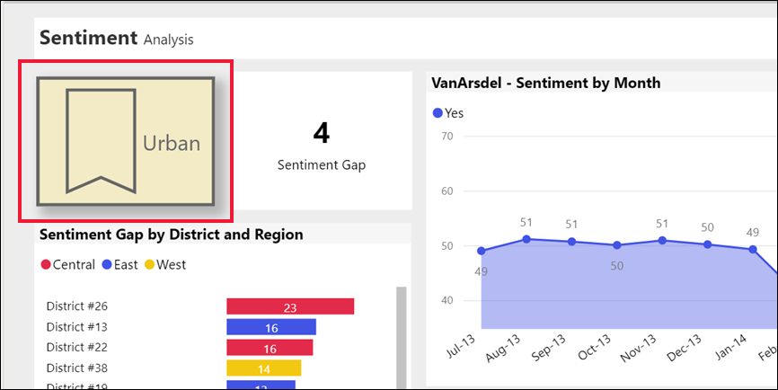

# ปุ่มในบริการ Power BIButtons in the Power BI service
ในรายงานที่คุณได้รับจากเพื่อนร่วมงาน คุณอาจสังเกตเห็นปุ่มต่าง ๆ และสงสัยว่าจะใช้งานอย่างไรIn the reports that you receive from colleagues, you may have noticed buttons and wondered how to use them. บางปุ่มมีคำศัพท์ บางปุ่มมีลูกศร บางปุ่มมีกราฟิก และบางปุ่มยังมีเมนูแบบดรอปดาวน์ด้วยSome have words, some have arrows, others have graphics, and some even have dropdown menus. บทความนี้จะสอนวิธีการรับรู้ปุ่มและวิธีการที่จะคิดออกว่าจะทำอย่างไรกับปุ่มดังกล่าวThis article will teach you how to recognize a button and how to figure out what to do with it.

## วิธีการรับรู้ปุ่มHow to recognize a button
ปุ่มสามารถมีลักษณะได้มากมาย เช่น รูปร่าง รูปภาพ หรือไอคอนในหน้ารายงานButtons can look a lot like shapes, images, or icons on a report page. แต่ถ้ามีการดำเนินการเกิดขึ้นเมื่อคุณเลือก (คลิก) วัตถุดังกล่าว อาจเป็นไปได้ว่าวัตถุนั้นอาจเป็นปุ่มBut if an action occurs when you select (click) it -- then it's probably a button.

## ชนิดของปุ่มTypes of buttons
ผู้สร้างรายงานจะเพิ่มปุ่มในรายงานเพื่อช่วยให้คุณสามารถนำทางและสำรวจได้Report creators add buttons to reports to help you with navigation and exploration. ปุ่มบางประเภท ได้แก่ ย้อนกลับ บุ๊กมาร์ก ลูกศร ถามและ ตอบ วิธีใช้ และว่างJust some of the button types are: back, bookmark, arrows, Q&A, help, and blank. 

### ปุ่ม ย้อนกลับBack buttons 
ปุ่มย้อนกลับอาจมีไอคอนลูกศรและเมื่อคุณเลือกแล้ว Power BI จะนำคุณกลับไปที่หน้าก่อนหน้าA back button may have an arrow icon and when you select it, Power BI takes you back to the previous page.  ปุ่มย้อนกลับมักจะใช้กับการเข้าถึงรายละเอียดBack buttons are often used with drillthrough. นี่คือตัวอย่างของปุ่มย้อนกลับที่ใช้กับการดูรายละเอียดเจาะลึกHere's an example of a back button used with drillthrough.

1. ผู้ใช้ได้เลือก **Word** ในแผนภูมิแท่งและกำลังเจาะลึกถึง **การวิเคราะห์ตะกร้าตลาด**The user has selected **Word** in the bar chart and is drilling through to  **Market basket analysis**.

    

2. โดยการเลือก **การวิเคราะห์ตะกร้าสินค้า** Power BI จะเปิดหน้ารายงาน *การวิเคราะห์ตะกร้าสินค้า* และใช้การเลือกที่สร้างขึ้นบนหน้าต้นทางเพื่อกรองสิ่งที่จะแสดงบนหน้าปลายทางBy choosing **Market basket analysis**, Power BI opens the *Market basket analysis* report page and uses the selections made on the source page to filter what is shown on the destination page.

    

    ตอนนี้คุณอยู่ในหน้ารายงาน **การวิเคราะห์ตะกร้าตลาด** ซึ่งถูกกรองสำหรับ **Word**You're now on the **Market basket analysis** report page, which is filtered for **Word**. หากต้องการกลับไปที่หน้าก่อนหน้านี้ให้เลือกปุ่มย้อนกลับที่มีข้อความว่า **ย้อนกลับ**To return to the previous page, select the back button that is labeled **Go back**. 

## ปุ่ม บุ๊กมาร์กBookmark buttons
รายงาน *นักออกแบบ* มักจะรวมบุ๊กมาร์กไว้ในรายงานของพวกเขาReport *designers* often include bookmarks with their reports. คุณสามารถดูรายการบุ๊กมาร์กรายงานได้โดยเลือก **บุ๊กมาร์ก** จากมุมขวาบนYou can view the list of report bookmarks by selecting **Bookmarks** from the upper right corner. เมื่อผู้ออกแบบรายงานเพิ่ม *ปุ่ม* บุ๊กมาร์ก ซึ่งเป็นเพียงอีกวิธีหนึ่งในการนำทางไปยังหน้ารายงานเฉพาะที่เกี่ยวข้องกับบุ๊กมาร์กนั้นWhen a report designer adds a bookmark *button*, it's just an alternate way to navigate to the particular report page that's associated with that bookmark. หน้านี้จะมีตัวกรองและการตั้งค่าที่ใช้งานอยู่ ซึ่งคั่นหน้าด้วยบุ๊กมาร์กThe page will have the applied filters and settings that are captured by the bookmark. [เรียนรู้เพิ่มเติมเกี่ยวกับบุ๊กมาร์กใน Power BI](end-user-bookmarks.md)[Learn more about bookmarks in Power BI](end-user-bookmarks.md). 

ในตัวอย่างนี้ ปุ่มมีไอคอนบุ๊กมาร์กและชื่อของบุ๊กมาร์ก คือ *เมือง*In this example, the button has a bookmark icon and the name of the bookmark, *Urban*. 

เมื่อเลือกปุ่มบุ๊กมาร์ก Power BI จะนำคุณไปยังตำแหน่งที่ตั้งและการตั้งค่าตามที่กำหนดไว้สำหรับบุ๊กมาร์กนั้นBy choosing the bookmark button, Power BI takes you to the location and settings as defined for that bookmark.  ในกรณีนี้ บุ๊กมาร์กอยู่บนหน้ารายงาน *โอกาสการเติบโต* และหน้านั้นจะถูกกรองข้ามสำหรับ **เมือง**In this case, the bookmark is on the *Growth opportunities* report page and that page is cross-filtered for **Urban**.

## ปุ่มการเข้าถึงรายละเอียดDrillthrough buttons
มีแนวทางสองวิธีในการเจาะลึกรายละเอียดผ่านในบริการ Power BIThere are two ways to drill through in the Power BI service. การเข้าถึงรายละเอียดจะนำคุณไปยังหน้ารายงานอื่นและข้อมูลในหน้าปลายทางนั้นจะแสดงตามตัวกรองและการเลือกที่คุณได้ทำบนหน้าต้นทางDrillthrough takes you to a different report page and the data on that destination page is presented according to the filters and selections you've made on the source page.

วิธีหนึ่งในการใช้การดูรายละเอียดเจาะลึกในรายงานคือคลิกขวาที่จุดข้อมูลในภาพเลือก **ดูข้อมูลรายละเอียด** และเลือกปลายทางOne way to use drillthrough in a report is to right-click a data point in a visual, select **Drill through**, and choose the destination. วิธีการนี้อธิบายไว้ข้างต้นในส่วนที่ชื่อ **ปุ่มย้อนกลับ**This method is described above in the section titled **Back button**. แต่บางครั้งผู้ออกแบบรายงานใช้ *ปุ่ม* การเข้าถึงรายละเอียดแทน เพื่อให้การดำเนินการชัดเจนมากขึ้น และเรียกความสนใจไปยังข้อมูลเชิงลึกที่สำคัญBut sometimes the report designers use a drillthrough *button* instead, to make the action more obvious and to call attention to important insights.  

ปุ่ม การเข้าถึงรายละเอียด สามารถมีข้อกำหนดเบื้องต้นได้มากกว่าหนึ่งรายการDrillthrough buttons can have more than one prerequisite. หากคุณไม่ปฏิบัติตามข้อกำหนดเบื้องต้นทั้งหมด ปุ่มจะไม่ทำงานUnless you fulfill all the prerequisites, the button will not work. มาลองดูตัวอย่างกันLet's look at an example.

ต่อไปนี้คือปุ่ม การเข้าถึงรายละเอียด ที่จะนำเราไปยังหน้า *รายละเอียดร้านค้า*Here is a drillthrough button that will take us to the *Store details* page. การวางเมาส์เหนือปุ่มจะแสดงคำแนะนำเครื่องมือที่ช่วยให้เราทราบว่าเราต้องเลือกทั้งร้านค้าและผลิตภัณฑ์Hovering over the button reveals a tooltip that lets us know that we need to select both a store and a product. จนกว่าเราจะเลือกหนึ่งรายการ ปุ่มก็ยังคงไม่ทำงานUntil we select one of each, the button remains inactive.

ตอนนี้เราได้เลือกผลิตภัณฑ์หนึ่งรายการ (**Word**) และร้านค้าหนึ่งรายการ (**ลีโอ**) ปุ่มจะเปลี่ยนสีเพื่อแจ้งให้เราทราบว่าขณะนี้มีการใช้งานอยู่Now that we've selected one product (**Word**), and one store (**Leo**), the button changes color to let us know that it is now active.

การเลือกปุ่ม การเข้าถึงรายละเอียด จะนำเราไปยังหน้ารายงาน *Store*Selecting the drillthrough button takes us to the *Store* report page. หน้า *ร้านค้า* ถูกกรองสำหรับการเลือก **Word** และ **Leo** ของเราThe *Store* page is filtered for our selections of **Word** and **Leo**.

ปุ่ม การเข้าถึงรายละเอียดข้อมูล ยังสามารถมีเมนูแบบดรอปดาวน์ที่ให้คุณเลือกจุดหมายปลายทางได้Drillthrough buttons can also have dropdown menus that offer you a choice of destinations. เมื่อคุณทำการเลือกในหน้ารายงานต้นทางแล้ว ให้เลือกหน้ารายงานปลายทางสำหรับการเข้าถึงรายละเอียดข้อมูลOnce you've made your selections on the source report page, select the destination report page for the drillthrough. ในตัวอย่างด้านล่าง เรากำลังเปลี่ยนการเลือกของเราเป็นการดูรายละเอียดเจาะลึกไปที่หน้ารายงาน *รายละเอียดตลาด*In the example below, we're changing our selection to drillthrough to the *Market details* report page. 

## การนำทางเพจPage navigation

ปุ่มการนำทางของหน้าจะนำคุณไปยังหน้าอื่นในรายงานเดียวกันPage navigation buttons take you to a different page in the same report. ผู้ออกแบบรายงานมักสร้างปุ่มการนำทางเพื่อเล่าเรื่องราวหรือแนะนำคุณผ่านข้อมูลเชิงลึกของรายงานReport designers often create navigation buttons to tell a story or guide you through the report insights. ในตัวอย่างด้านล่าง ผู้ออกแบบรายงานได้เพิ่มปุ่มบนหน้ารายงานแต่ละหน้าซึ่งจะนำคุณกลับไปที่หน้าแรกซึ่งเป็นหน้าสรุประดับบนสุดในรายงานIn the example below, the report designer added a button on each report page that takes you back to the first page, the top-level summary page, in the report. ปุ่มการนำทางของหน้านี้มีประโยชน์เนื่องจากมีหลายหน้าในรายงานนี้This page navigation button is helpful because there are many pages in this report.

## ปุ่ม Q&AQ&A buttons 
การเลือกปุ่ม Q&A จะเปิดหน้าต่าง Power BI Q&A ExplorerSelecting a Q&A button opens the Power BI Q&A Explorer window. หน้าต่าง Q&A ปรากฏที่ด้านบนของหน้ารายงานและสามารถปิดได้โดยเลือก X [เรียนรู้เกี่ยวกับ Q&A](end-user-q-and-a.md)The Q&A window displays on top of the report page and can be closed by selecting the X. [Learn about Q&A](end-user-q-and-a.md)

## URL ของเว็บWeb URL
ปุ่ม URL ของเว็บเปิดหน้าต่างเบราว์เซอร์ใหม่Web URL buttons open a new browser window. ผู้ออกแบบรายงานอาจเพิ่มปุ่มประเภทนี้เป็นแหล่งอ้างอิง เพื่อเชื่อมโยงไปยังเว็บไซต์ขององค์กรหรือหน้าความช่วยเหลือหรือแม้กระทั่งเป็นลิงก์ไปยังรายงานหรือแดชบอร์ดอื่นReport designers might add this type of button as a reference source, to link to the corporate website or a help page, or even as a link to a different report or dashboard. ในตัวอย่างด้านล่าง ปุ่ม URL ของเว็บช่วยให้คุณดาวน์โหลดไฟล์ต้นฉบับสำหรับรายงานIn the example below, the Web URL button let's you download the source file for the report. 

เนื่องจากหน้าจะเปิดขึ้นในหน้าต่างแยกต่าง ให้ปิดหน้าต่างหรือเลือกแท็บ Power BI ของคุณเพื่อกลับไปที่รายงาน Power BISince the page opens in a separate window, close the window or select your Power BI tab to return to the Power BI report.

## ขั้นตอนถัดไปNext steps
[บุ๊กมาร์ก](end-user-bookmarks.md)  [Bookmarks](end-user-bookmarks.md)    
[เจาะดูข้อมูลลึกขึ้น เจาะดูรายละเอียดแนวลึกDrill up, drill down](end-user-drill.md)
