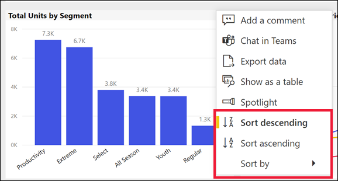

# เปลี่ยนวิธีการเรียงลำดับแผนภูมิในรายงาน Power BIChange how a chart is sorted in a Power BI report

[!INCLUDE[consumer-appliesto-ynnn](../includes/consumer-appliesto-ynnn.md)]

> [!IMPORTANT]
> **บทความนี้มีไว้สำหรับผู้ใช้ Power BI ที่ไม่มีสิทธิ์ในการแก้ไขรายงานหรือชุดข้อมูล และผู้ที่ทำงานในเวอร์ชันออนไลน์ของ Power BI (บริการของ Power BI) เท่านั้น ถ้าคุณเป็น *ผู้ออกแบบ* รายงาน หรือ *ผู้ดูแลระบบ* หรือ *เจ้าของข้อมูล* บทความนี้อาจไม่มีรายละเอียดทั้งหมดที่คุณต้องการ แต่โปรดอ่าน [เรียงลำดับตามคอลัมน์ใน Power BI Desktop](../create-reports/desktop-sort-by-column.md)****This article is intended for Power BI users who do not have edit permissions to the report or dataset and who only work in the online version of Power BI (the Power BI service). If you are a report *designer* or *administrator* or *owner*, this article may not have all the information you need. Instead, please read [Sort by column in Power BI Desktop](../create-reports/desktop-sort-by-column.md)**.

ในบริการของ Power BI คุณสามารถเปลี่ยนลักษณะของวิชวล โดยเรียงลำดับตามเขตข้อมูลที่แตกต่างกันได้In the Power BI service, you can change how a visual looks by sorting it by different data fields. โดยการเปลี่ยนวิธีการเรียงลำดับวิชวล คุณสามารถไฮไลท์ข้อมูลที่คุณต้องการถ่ายทอดไปBy changing how you sort a visual, you can highlight the information you want to convey. ไม่ว่าคุณจะใช้ข้อมูลเชิงตัวเลข (เช่น ตัวเลขยอดขาย) หรือข้อมูลแบบข้อความ (เช่น ชื่อรัฐ) คุณสามารถเรียงลำดับการแสดงผลข้อมูลด้วยภาพตามที่คุณต้องการได้Whether you're using numeric data (such as sales figures) or text data (such as state names), you can sort your visuals as desired. Power BI มีความยืดหยุ่นมากมายสำหรับการรียงลำดับ และเมนูด่วนให้คุณใช้Power BI provides lots of flexibility for sorting, and quick menus for you to use. 

ไม่สามารถเรียงลำดับการแสดงผลด้วยภาพบนแดชบอร์ดได้Visuals on a dashboard cannot be sorted. แต่ในรายงาน Power BI คุณสามารถเรียงลำดับการแสดงภาพส่วนใหญ่ได้หนึ่งและบางครั้งสองเขตข้อมูลในแต่ละครั้งBut in a Power BI report, you can sort most visuals by one, and sometimes two, fields at a time. สำหรับการแสดงผลด้วยภาพบางชนิดการเรียงลำดับไม่สามารถใช้งานได้เลย: แผนผังต้นไม้, เกจ, แผนที่ ฯลฯFor certain types of visuals, sorting is not available at all: tree maps, gauges, maps, etc. 

## เริ่มใช้งานGet started

เมื่อต้องการเริ่มต้นใช้งาน ให้เปิดรายงานใดก็ตามที่คุณสร้างขึ้นหรือได้แชร์กับคุณTo get started, open any report that you have created or that has been shared with you. เลือกวิชวล (ที่สามารถเรียงลำดับได้) และเลือก **การดำเนินการเพิ่มเติม** (...)  มีตัวเลือกสำหรับการเรียงลำดับสามตัวเลือก: **เรียงลำดับจากมากไปหาน้อย** **เรียงลำดับจากน้อยไปหามาก** และ **เรียงลำดับตาม**Select a visual (that can be sorted) and choose **More actions** (...).  There are three options for sorting: **Sort descending**, **Sort ascending**, and **Sort by**. 
    

### เรียงลำดับตามตัวอักษรหรือตามตัวเลขSort alphabetically or numerically

คุณสามารถเรียงลำดับวิชวลตามตัวอักษรโดยชื่อของหมวดหมู่ในวิชวล หรือโดยค่าตัวเลขของแต่ละหมวดหมู่ได้Visuals can be sorted alphabetically by the names of the categories in the visual, or by the numeric values of each category. ตัวอย่างเช่น แผนภูมินี้จะเรียงตาม **ชื่อ** ร้านค้าของหมวดหมู่บนแกน x โดยเรียงลำดับตัวอักษรFor example, this chart is sorted alphabetically by the X-axis category store **Name**.

เมื่อต้องการเปลี่ยนการเรียงลำดับจากประเภท (ชื่อร้านค้า) เป็นค่า (ยอดขายต่อตารางฟุต) เลือก **การดำเนินการเพิ่มเติม** (...) และเลือก **เรียงลำดับตาม**To change the sort from a category (store name) to a value (sales per square feet), select **More actions** (...) and choose **Sort by**. เลือกค่าเชิงตัวเลขที่ใช้ในวิชวลSelect a numeric value used in the visual.  ในตัวอย่างนี้ เราได้เลือก **ยอดขายต่อตารางฟุต (Sales Per Sq Ft)**In this example, we've selected **Sales Per Sq Ft**.

ถ้าจำเป็น ให้เปลี่ยนลำดับการจัดเรียงระหว่างจากน้อยไปหามากและจากมากไปหาน้อยIf necessary, change the sort order between ascending and descending.  เลือก **การดำเนินการเพิ่มเติม** (...) อีกครั้ง และเลือก **เรียงลำดับจากมากไปน้อย** หรือ **เรียงลำดับจากน้อยไปมาก**Select **More actions** (...) again and choose **Sort descending** or **Sort ascending**. เขตข้อมูลที่ใช้ในการเรียงลำดับจะเป็นตัวหนาและมีแถบสีเหลืองThe field that is being used to sort is in bold and has a yellow bar.

   

> [!NOTE]
> ภาพไม่สามารถเรียงลำดับได้ทั้งหมดNot all visuals can be sorted. ตัวอย่างเช่น ไม่สามารถจัดเรียงวิชวลต่อไปนี้ แผนภาพต้นไม้ แผนที่ แผนที่กรอกข้อมูล แผนภูมิกระจาย หน้าปัด บัตร น้ำตกFor example, the following visuals cannot be sorted: treemap, map, filled map, scatter, gauge, card, waterfall.

## การเรียงลำดับตามหลายคอลัมน์Sorting by multiple columns
ข้อมูลในตารางนี้จะเรียงลำดับตาม **จำนวนลูกค้า**The data in this table is sorted by **Number of customers**.  เรารู้สิ่งนี้เพราะลูกศรเล็กๆ ใต้คำว่า *หมายเลข*We know this because of the small arrow beneath the word *Number*. ลูกศรชี้ลงซึ่งหมายความว่าคอลัมน์จะถูกเรียงลำดับ *จากมากไปหาน้อย*The arrow is pointing down which means the column is being sorted in *descending* order.

หากต้องการเพิ่มคอลัมน์เพิ่มเติมลงในลำดับการจัดเรียงให้ Shift + คลิกส่วนหัวของคอลัมน์ที่คุณต้องการเพิ่มถัดจากลำดับการจัดเรียงTo add more columns to the sort order, Shift + click the column header you would like to add next in the sort order. ตัวอย่างเช่นถ้าคุณคลิก **จำนวนลูกค้า** จากนั้น Shift + คลิก **รายได้รวม** ตารางจะถูกเรียงลำดับจากลูกค้าก่อนแล้วตามด้วยรายได้For example, if you click **Number of customers** and then Shift + click **Total revenue**, then the table is sorted first by customers, then by revenue. เส้นขอบสีแดงแสดงพื้นที่ที่เปลี่ยนลำดับการจัดเรียงThe red outline show areas where sort order changed.

ถ้าคุณ Shift + คลิกที่ครั้งที่สองในคอลัมน์เดียวกัน การดำเนินการนี้จะเป็นการเปลี่ยนทิศทางการเรียงลำดับ (จากน้อยไปหามาก) สำหรับคอลัมน์นั้นIf you Shift + click a second time on the same column, this will change the sort direction (ascending, descending) for that column. นอกจากนี้ ถ้าคุณกด Shift + คลิกที่คอลัมน์ที่คุณได้เพิ่มไปยังลำดับการจัดเรียงก่อนหน้านี้ จะย้ายคอลัมน์นั้นไปยังด้านหลังของลำดับการจัดเรียงFurthermore, if you Shift + click a column you have previously added to the sort order, this will move that column to the back of the sort order.

## บันทึกการเปลี่ยนแปลงที่คุณทำกับการเรียงลำดับSaving changes you make to sort order
รายงาน Power BI จะคงตัวกรอง ตัวแบ่งส่วนข้อมูล การเรียงลำดับ และการเปลี่ยนแปลงอื่น ๆ ในมุมมองที่คุณทำไว้ -- แม้คุณจะทำงานอยู่ใน [มุมมองการอ่าน](end-user-reading-view.md)Power BI reports retain the filters, slicers, sorting, and other data view changes that you make -- even if you're working in [Reading view](end-user-reading-view.md). ดังนั้นถ้าคุณออกจากรายงาน และกลับมาในภายหลัง การเปลี่ยนแปลงการเรียงลำดับของคุณก็ยังถูกบันทึกไว้So, if you navigate away from a report, and return later, your sorting changes are saved.  ถ้าคุณต้องการย้อนกลับการเปลี่ยนแปลงของคุณ ให้กลับไปยังการตั้งค่าของ *ผู้ออกแบบ* รายงาน และเลือก **รีเซ็ตเป็นค่าเริ่มต้น** จากแถบเมนูด้านบนIf you want to revert your changes back to the report *designer's* settings, select **Reset to default** from the upper menu bar. 

อย่างไรก็ตาม ถ้าปุ่ม **รีเซ็ตเป็นค่าเริ่มต้น** เป็นสีเทา แสดงว่า *ผู้ออกแบบ* รายงานได้ปิดใช้งานความสามารถในการบันทึก (คงอยู่) การเปลี่ยนแปลงของคุณIf however, the **Reset to default** button is greyed out, that means the report *designer* has disabled the ability to save (persist) your changes.

## ข้อควรพิจารณาและการแก้ไขปัญหาConsiderations and troubleshooting

### เรียงลำดับโดยใช้เกณฑ์อื่นSorting using other criteria
บางครั้ง คุณต้องการเรียงลำดับวิชวลของคุณโดยใช้เขตข้อมูลที่แตกต่างกัน (ที่ไม่รวมอยู่ในวิชวล) หรือเกณฑ์อื่น ๆSometimes, you want to sort your visual using a different field (that isn't included in the visual) or other criteria.  ตัวอย่างเช่น คุณอาจต้องการเรียงลำดับตามเดือนตามลำดับต่อเนื่องกัน
 (และไม่ได้อยู่ในลำดับตัวอักษร) หรือคุณอาจต้องการเรียงลำดับตามตัวเลขทั้งหมด แทนที่เรียงด้วยตัวเลข (ตัวอย่าง 0, 1, 9, 20 และไม่ 0, 1, 20, 9)For example, you might want to sort by month in sequential order (and not in alphabetical order) or you might want to sort by entire numbers instead of by digit (example, 0, 1, 9, 20 and not 0, 1, 20, 9).  

เฉพาะผู้ที่ออกแบบรายงานเท่านั้นที่สามารถทำการเปลี่ยนแปลงเหล่านี้ให้คุณได้Only the person who designed the report can make these changes for you. คุณสามารถค้นหาข้อมูลการติดต่อสำหรับ *ผู้ออกแบบ* ได้โดยการเลือกชื่อรายงานจากแถบส่วนหัวContact information for the *designer* can be found by selecting the report name from the header bar.

ถ้าคุณเป็น *ผู้ออกแบบ* และมีสิทธิ์ในการแก้ไขเนื้อหา ให้อ่าน [เรียงลำดับตามคอลัมน์ใน Power BI Desktop](../create-reports/desktop-sort-by-column.md) เพื่อเรียนรู้วิธีการอัปเดตชุดข้อมูลและเปิดใช้งานการเรียงลำดับชนิดนี้If you are a *designer* and have edit permissions to the content, read [Sort by column in Power BI Desktop](../create-reports/desktop-sort-by-column.md) to learn how to update the dataset and enable this type of sorting.

## ขั้นตอนถัดไปNext steps
อ่านเพิ่มเติมเกี่ยวกับ[การแสดงภาพในรายงาน Power BI](end-user-visualizations.md)More about [Visualizations in Power BI reports](end-user-visualizations.md).

[Power BI แนวคิดพื้นฐานPower BI - Basic Concepts](end-user-basic-concepts.md)
