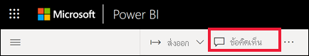
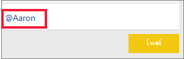
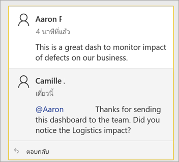
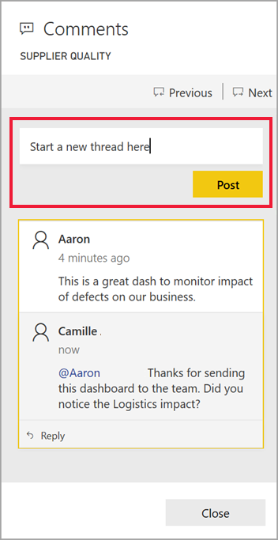
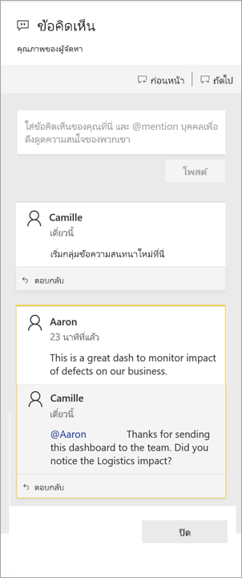
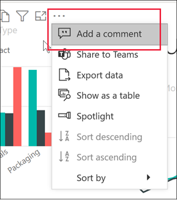
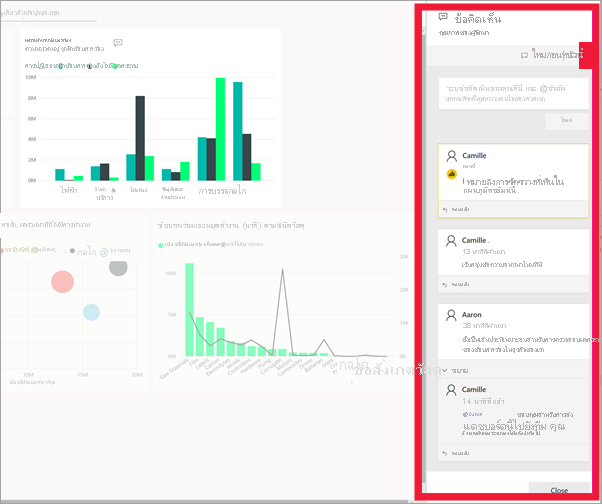

# เพิ่มความคิดเห็นในแดชบอร์ดหรือรายงานAdd comments to a dashboard or report

[!INCLUDE[consumer-appliesto-ynny](../includes/consumer-appliesto-ynny.md)]

เพิ่มข้อคิดเห็นส่วนบุคคล หรือเริ่มการสนทนาเกี่ยวกับแดชบอร์ดหรือรายงานกับเพื่อนร่วมงานของคุณAdd a personal comment or start a conversation about a dashboard or report with your colleagues. คุณลักษณะ **ข้อคิดเห็น** เป็นเพียงหนึ่งในหลายวิธีการที่ *ผู้ใช้ทางธุรกิจ* สามารถทำงานร่วมกับผู้อื่นได้The **comment** feature is just one of the ways a *business user* can collaborate with others. 

> [!NOTE]
> การทำงานร่วมกับบุคคลอื่น รวมถึงการเพิ่มข้อคิดเห็นไปยังรายงานที่แชร์ จำเป็นต้องมีสิทธิการใช้งาน Power BI Pro หรือสำหรับเนื้อหาที่จะโฮสต์ในความจุของ Power BI PremiumCollaborating with others, including adding comments to shared reports, requires a Power BI Pro license or for the content to be hosted in Power BI Premium capacity. [ประเภทสิทธิการใช้งานใดที่ฉันมีWhich license type do I have?](end-user-license.md)

## วิธีการใช้คุณลักษณะข้อคิดเห็นHow to use the Comments feature
คุณสามารถเพิ่มข้อคิดเห็นลงในแดชบอร์ดทั้งหมด ลงในภาพแต่ละภาพบนแดชบอร์ด ลงในหน้ารายงาน ลงในรายงานที่มีการแบ่งหน้า และลงในการแสดงผลด้วยภาพของแต่ละบุคคลบนหน้ารายงานได้Comments can be added to an entire dashboard, to individual visuals on a dashboard, to a report page, to a paginated report, and to individual visuals on a report page. เพิ่มข้อคิดเห็นทั่วไปหรือข้อคิดเห็นที่กำหนดเป้าหมายที่เพื่อนร่วมงานที่เฉพาะเจาะจงAdd a general comment or add a comment targeted at specific colleagues.  

เมื่อคุณเพิ่มข้อคิดเห็นไปยังรายงาน Power BI จะบันทึกตัวกรองปัจจุบันและค่าตัวแบ่งส่วนข้อมูล และสร้าง[บุ๊กมาร์ก](end-user-bookmarks.md)When you add a comment to a report, Power BI captures the current filter and slicer values and creates a [bookmark](end-user-bookmarks.md). ซึ่งหมายความว่าเมื่อคุณเลือกหรือตอบกลับข้อคิดเห็นหน้ารายงานหรือภาพรายงานอาจเปลี่ยนแปลงเพื่อแสดงตัวเลือกและตัวแบ่งส่วนข้อมูลที่ใช้งานอยู่เมื่อมีการเพิ่มข้อคิดเห็นครั้งแรกThis means that when you select or respond to a comment, the report page or report visual may change to show you the filter and slicer selections that were active when the comment was first added.  

ทำไมจึงเป็นสิ่งสำคัญ?Why is this important? บอกให้เพื่อนร่วมงานใช้ตัวกรองที่เปิดเผยข้อมูลเชิงลึกที่น่าสนใจที่พวกเขาต้องการแชร์กับทีมSay a colleague applied a filter that revealed an interesting insight that they want to share with the team. หากไม่มีตัวกรองที่เลือกไว้ข้อคิดเห็นอาจไม่เป็นที่เข้าใจWithout that filter selected, the comment might not make sense.

หากคุณกำลังใช้รายงานที่มีการแบ่งหน้า คุณอาจสามารถทำได้แค่ให้ข้อคิดเห็นทั่วไปเกี่ยวกับรายงานของคุณเท่านั้นIf you are using a paginated report, you may only leave a general comment about your report.  โดยจะไม่สามารถแสดงข้อคิดเห็นลงบนภาพรายงานแบบแบ่งหน้าแต่ละภาพได้Support for leaving comments on individual paginated report visuals is not available.

### เพิ่มข้อคิดเห็นทั่วไปไปยังแดชบอร์ดหรือรายงานAdd a general comment to a dashboard or report
กระบวนการสำหรับการเพิ่มข้อคิดเห็นไปยังแดชบอร์ดหรือรายงานจะคล้ายกันThe process for adding comments to a dashboard or report is similar.  ในตัวอย่างนี้ เรากำลังใช้แดชบอร์ดIn this example, we're using a dashboard. 

1. เปิดแดชบอร์ด Power BI หรือรายงาน และเลือกไอคอน **ข้อคิดเห็น**Open a Power BI dashboard or report and select the **Comment** icon. ซึ่งเปิดกล่องโต้ตอบความคิดเห็นThis opens the Comments dialog.

    

    ที่นี่เราเห็นว่าผู้สร้างแดชบอร์ดได้เพิ่มความคิดเห็นทั่วไปแล้วHere we see that the dashboard creator has already added a general comment.  ทุกคนที่สามารถเข้าถึงแดชบอร์ดนี้สามารถเห็นความคิดเห็นนี้Anyone with access to this dashboard can see this comment.

    

2. เมื่อต้องตอบกลับ เลือก **ตอบกลับ** พิมพ์การตอบกลับของคุณ และเลือก **โพสต์**To respond, select **Reply**, type your response, and select **Post**.  

    

    ตามค่าเริ่มต้น Power BI นำการตอบกลับของคุณไปยังเพื่อนร่วมงานที่เริ่มเธรดความคิดเห็นในกรณีนี้ Aaron.By default, Power BI directs your response to the colleague who started the comment thread, in this case Aaron. 

    

 3. หากคุณต้องการเพิ่มความคิดเห็นแดชบอร์ดที่ไม่ได้เป็นส่วนหนึ่งของเธรดที่มีอยู่ ให้ป้อนความคิดเห็นของคุณในฟิลด์ข้อความด้านบนIf you want to add a comment that is not part of an existing thread, enter your comment in the upper text field.

    

    ตอนนี้ความคิดเห็นสำหรับแดชบอร์ดนี้มีลักษณะดังนี้The comments for this dashboard now look like this.

    

### เพิ่มข้อคิดเห็นไปยังการแสดงผลภาพแดชบอร์ดหรือรายงานที่เฉพาะเจาะจงAdd a comment to a specific dashboard or report visual
นอกเหนือจากการเพิ่มข้อคิดเห็นไปยังแดชบอร์ดทั้งหมดหรือไปยังหน้ารายงานทั้งหมด คุณสามารถเพิ่มข้อคิดเห็นไปยังไทล์แดชบอร์ดแต่ละรายการและการแสดงผลด้วยภาพของแต่ละรายงานได้In addition to adding comments to an entire dashboard or to an entire report page, you can add comments to individual dashboard tiles and individual report visuals. กระบวนการนี้จะคล้ายกันและในตัวอย่างนี้เรากำลังใช้รายงานThe processes are similar, and in this example we're using a report.

1. วางเมาส์เหนือวิชวล และเลือก **แอคชันเพิ่มเติม** (...)Hover over the visual and select **More actions** (...).    
2. จากรายการแบบเลื่อนลง เลือก **เพิ่มข้อคิดเห็น**From the dropdown, select **Add a comment**.

      

3.  กล่องโต้ตอบ **ข้อคิดเห็น** เปิดขึ้นและการแสดงผลภาพอื่นๆ บนหน้าจะเป็นสีเทา ภาพนี้ยังไม่มีความคิดเห็นใด ๆThe **Comments** dialog opens, and the other visuals on the page are greyed out. This visual doesn't have any comments yet. 

      

4. เพิมพ์ข้อคิดเห็นของคุณ และเลือก **โพสต์**Type your comment and select **Post**.

      

    - บนหน้ารายงาน ให้เลือกข้อคิดเห็นที่สร้างขึ้นด้วยการแสดงผลภาพ ไฮไลต์วิชวลนั้น (ดูข้างล่าง)On a report page, selecting a comment that was made on a visual, highlights that visual (see below).

    - บนแดชบอร์ด ไอคอนแผนภูมิOn a dashboard, the chart icon  ช่วยให้เราทราบว่าความคิดเห็นนี้เชื่อมโยงกับการแสดงภาพเฉพาะlets us know that a comment is tied to a specific visual. ข้อคิดเห็นที่นำไปใช้กับทั้งแดชบอร์ดไม่มีไอคอนพิเศษComments that apply to the entire dashboard do not have a special icon. การเลือกไอคอนแผนภูมิจะไฮไลท์การแสดงผลด้วยภาพที่เกี่ยวข้องบนแดชบอร์ดSelecting the chart icon highlights the related visual on the dashboard.
    

    

5. เลือก **ปิด** เพื่อกลับไปยังแดชบอร์ดหรือรายงานSelect **Close** to return to the dashboard or report.

### ดึงดูดความสนใจเพื่อนร่วมงานของคุณ โดยใช้เครื่องหมาย @Get your colleagues attention by using the @ sign
ไม่ว่าคุณจะสร้างแดชบอร์ด รายงาน ไทล์ หรือความคิดเห็นในภาพใดภาพหนึ่ง ให้ดึงดูดความสนใจของเพื่อนร่วมงานโดยใช้สัญลักษณ์ "\@"Whether you're creating a dashboard, report, tile, or visual comment, grab your colleagues' attention by using the "\@" symbol.  เมื่อคุณพิมพ์สัญลักษณ์ "\@" Power BI จะเปิดรายการแบบเลื่อนลงซึ่งคุณสามารถค้นหาและเลือกบุคคลจากองค์กรของคุณWhen you type the "\@" symbol, Power BI opens a dropdown where you can search for and select individuals from your organization. ชื่อที่ถูกตรวจสอบไว้ล่วงหน้าซึ่งมีสัญลักษณ์ "\@" จะปรากฏเป็นตัวอักษรสีน้ำเงินAny verified name prefaced with the "\@" symbol, appears in blue font. @mentioned แต่ละบุคคลจะได้รับอีเมลในกล่องขาเข้าของตนเอง และหากพวกเขาใช้แอป Power BI Mobile พวกเขาจะได้รับข้อความแจ้งเตือนผ่านอุปกรณ์ของตนเองThe @mentioned individuals will immediately receive an e-mail in their inbox, and if they are using a Power BI Mobile app, they will receive a push notification on their device. พวกเขาสามารถเปิดรายงานหรือแดชบอร์ดจากการแจ้งเตือนได้โดยตรง ดูความคิดเห็น ดูข้อมูล และตอบกลับรายงานหรือแดชบอร์ดนั้น ๆ ได้They can open the report or dashboard directly from the notification, see the comment, view the data, and reply accordingly.

นี่คือการสนทนาที่ฉันมีด้วย *นักออกแบบ* การแสดงผลด้วยภาพHere's a conversation I'm having with the visualization *designer*. โดยใช้สัญลักษณ์ @ เพื่อให้แน่ใจว่าฉันเห็นข้อคิดเห็นThey are using the @ symbol to ensure I see the comment. ฉันได้รับการแจ้งเตือนและเลือกลิงก์เพื่อเปิดแดชบอร์ดนี้และการสนทนาที่เกี่ยวข้องI receive a notification and select the link to open this dashboard and the relevant conversation.  

  

## ข้อควรพิจารณาและการแก้ไขปัญหาConsiderations and troubleshooting

- จะไม่มีการบันทึกบุ๊กมาร์กเมื่อคุณตอบกลับการสนทนาBookmarks are not captured when you reply to a conversation. จะสร้างบุ๊กมาร์กเฉพาะข้อคิดเห็นแรกในการสนทนาเท่านั้นOnly the first comment in a conversation creates a bookmark.
- หากคุณกำลังใช้รายงานที่มีการแบ่งหน้า คุณอาจสามารถทำได้แค่ให้ข้อคิดเห็นทั่วไปเกี่ยวกับรายงานของคุณเท่านั้นIf you are using a paginated report, you may only leave a general comment about your report.  โดยจะไม่สามารถแสดงข้อคิดเห็นลงบนภาพรายงานแบบแบ่งหน้าแต่ละภาพได้Support for leaving comments on individual paginated report visuals is not available.

## ขั้นตอนถัดไปNext steps
กลับไปยัง[การแสดงผลด้วยภาพสำหรับผู้ใช้ทางธุรกิจ](end-user-visualizations.md)  Back to [visualizations for business users](end-user-visualizations.md)    
[เลือกการแสดงภาพเพื่อเปิดรายงานSelect a visualization to open a report](end-user-report-open.md)
