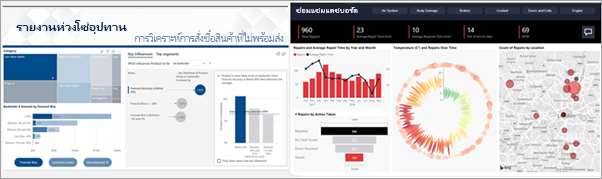

# บริการของ Power BI สำหรับผู้ใช้ทางธุรกิจ

[!INCLUDE[consumer-appliesto-ynny](../includes/consumer-appliesto-ynny.md)]

คุณมีส่วนเกี่ยวข้องในวัฒนธรรมข้อมูล ซึ่งการตัดสินใจทางธุรกิจจะขึ้นอยู่กับข้อเท็จจริง ไม่มีความคิดเห็น คุณต้องการข้อมูลเพื่อทำการตัดสินใจเหล่านี้ และเพื่อนร่วมงานของคุณจะไม่ทำให้คุณผิดหวัง     
 
พวกเขาส่งรายงานทุกประเภท สเปรดชีต อีเมลพร้อมแผนภูมิ และแม้แต่เอกสารประกอบคำบรรยายที่พิมพ์ออกมาให้กับคุณ เมื่อข้อมูลซ้อนกัน จะกลายเป็นเรื่องยากและยากมากขึ้นในการค้นหาสิ่งที่คุณต้องการอย่างรวดเร็ว และคุณกังวลว่าคุณอาจไม่ได้ใช้ข้อมูลล่าสุด  
 

## บริการของ Power BI สำหรับ *ผู้ใช้ทางธุรกิจ*

Power BI ทำให้งานของคุณง่ายขึ้นและมีประสิทธิภาพมากขึ้นในเวลาเดียวกัน ข้อมูลทั้งหมดจะกลายเป็นแผนภูมิและกราฟซึ่งแสดงข้อมูลของคุณเป็นภาพสำหรับคุณ ข้อมูลเชิงลึกของข้อมูลของคุณมี***ความสวยงาม** – ภาพที่มีสีสันและน่าสนใจที่บอกเล่าเรื่องราวเกี่ยวกับข้อมูลเชิงลึกในข้อมูล แทนที่จะเป็นรายการที่ยาวหรือตารางของตัวเลขและคำ 

 
เพียงแค่เปิดบริการของ Power BI ในเบราว์เซอร์หรือบนอุปกรณ์เคลื่อนที่ คุณและเพื่อนร่วมงานของคุณสามารถใช้งานได้จากแดชบอร์ดและรายงานที่เชื่อถือได้ฉบับเดียวกัน ซึ่งมีการอัปเดตและการรีเฟรชโดยอัตโนมัติ ดังนั้นคุณจะใช้ได้เนื้อหาที่สดใหม่อยู่เสมอ   

เนื่องจากเนื้อหาไม่ใช่แบบคงที่ คุณสามารถเจาะดูแนวโน้ม ข้อมูลเชิงลึก และข่าวกรองทางธุรกิจอื่นๆ ได้ แบ่งส่วนและแยกย่อยเนื้อหาและแม้แต่ถามคำถามโดยใช้คำพูดของคุณเอง หรือนั่งลง และปล่อยให้ข้อมูลของคุณค้นพบข้อมูลเชิงลึกที่น่าสนใจสำหรับคุณ ส่งการแจ้งเตือนเมื่อมีการเปลี่ยนแปลงข้อมูล และรายงานทางอีเมลถึงคุณตามกำหนดเวลาที่คุณตั้งไว้ ข้อมูลทั้งหมดของคุณได้ทุกที่ทุกเวลาในระบบคลาวด์หรือภายในองค์กรจากอุปกรณ์ใดก็ได้ นี่เป็นเพียงจุดเริ่มต้นของสิ่งที่ Power BI สามารถทำได้ 

## ฉันเป็นผู้ใช้ทางธุรกิจของ_ Power BI หรือไม่*?

วิธีคุณโต้ตอบกับ Power BI จะขึ้นอยู่กับบทบาทงานของคุณ ในฐานะ *ผู้ใช้ทางธุรกิจ* คุณเป็นบุคคลที่ได้รับเนื้อหา (แดชบอร์ด รายงาน และแอป) จากเพื่อนร่วมงาน คุณใช้งานใน Power BI เวอร์ชันออนไลน์หรือมือถือ ซึ่งเรียกว่าบริการของ Power BI โดยการตรวจสอบและการโต้ตอบกับเนื้อหานี้เพื่อทำการตัดสินใจทางธุรกิจ 
   
ในฐานะที่เป็นผู้ใช้ทางธุรกิจ คุณจะไม่สามารถเข้าถึงขีดความสามารถทั้งหมดของ Power BI ได้ แต่นั่นไม่เป็นไร เนื่องจากงานของคุณไม่ใช่การสร้างแดชบอร์ดและรายงาน คุณจะใช้บริการของ Power BI สำหรับการวิเคราะห์ การตรวจสอบ การสำรวจ และการตัดสินใจ 

คุณจะสงสัยคำว่า "Power BI Desktop" หรือแค่ "Desktop" และนี่เป็นเครื่องมือแบบสแตนด์อะโลนที่ใช้โดย *นักออกแบบ* ที่เป็นผู้สร้างและแบ่งปันแดชบอร์ดและรายงานกับคุณ  สิ่งสำคัญคือต้องรู้ว่ามีเครื่องมือ Power BI ตัวอื่นอยู่ในเครื่อง แต่ถ้าคุณเป็น *ผู้ใช้ทางธุรกิจ* คุณจะใช้งานได้เฉพาะบริการของ Power BI เท่านั้น 

และเนื่องจากคุณจะทำงานกับเนื้อหา *ที่ใช้ร่วมกัน* คุณจะต้องมีหนึ่งในรายการต่อไปนี้:
- สิทธิการใช้งาน Power BI Pro
- เพื่อให้องค์กรของคุณมีการสมัครใช้งานสำหรับ Power BI Premium และเนื้อหาที่จะใช้ร่วมกันกับคุณจากความจุ Power BI Premium 

สำหรับข้อมูลเพิ่มเติมเกี่ยวกับสิทธิ์การใช้งานและการสมัครสมาชิก โปรดดู [ฉันมีใบอนุญาตใดบ้าง](end-user-license.md)

## โต้ตอบกับเนื้อหาอย่างปลอดภัย 
ในขณะที่คุณกรอง แบ่ง สมัครใช้งาน และส่งออก ไม่ต้องกังวลไป งานของคุณจะไม่ส่งผลกระทบต่อชุดข้อมูลพื้นฐานหรือเนื้อหาที่มีการแชร์ดั้งเดิม (แดชบอร์ด รายงาน และแอป)  

คุณไม่ได้ทำให้ข้อมูลเสียหาย  Power BI เป็นพื้นที่ที่ดีที่สุดสำหรับคุณในการสำรวจ และการทดลองโดยไม่ต้องกังวลว่าคุณจะทำให้ข้อมูลเสียหาย  
 
ซึ่งไม่ได้หมายความว่า คุณไม่สามารถบันทึกการเปลี่ยนแปลงของคุณ - คุณสามารถ แต่การเปลี่ยนแปลงเหล่านั้นมีผลเฉพาะกับมุมมองของเนื้อหาของคุณเท่านั้น และการย้อนกลับไปยังมุมมองเริ่มต้นดั้งเดิมนั้นง่าย เพียงแค่การคลิกปุ่ม  

## ขั้นตอนถัดไป

[ชมการแนะนำบริการของ Power BI สำหรับผู้ใช้ทางธุรกิจ](end-user-reading-view.md)    
[การฝึกอบรมบริการของ Power BI สำหรับผู้ใช้ทางธุรกิจ](/learn/paths/consume-data-with-power-bi/)    
[คำศัพท์และแนวคิดสำหรับ *ผู้ใช้ทางธุรกิจ*](end-user-basic-concepts.md) ของ Power BI