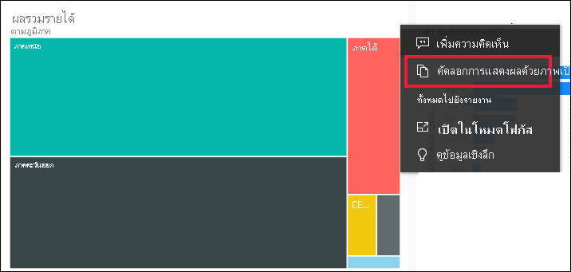
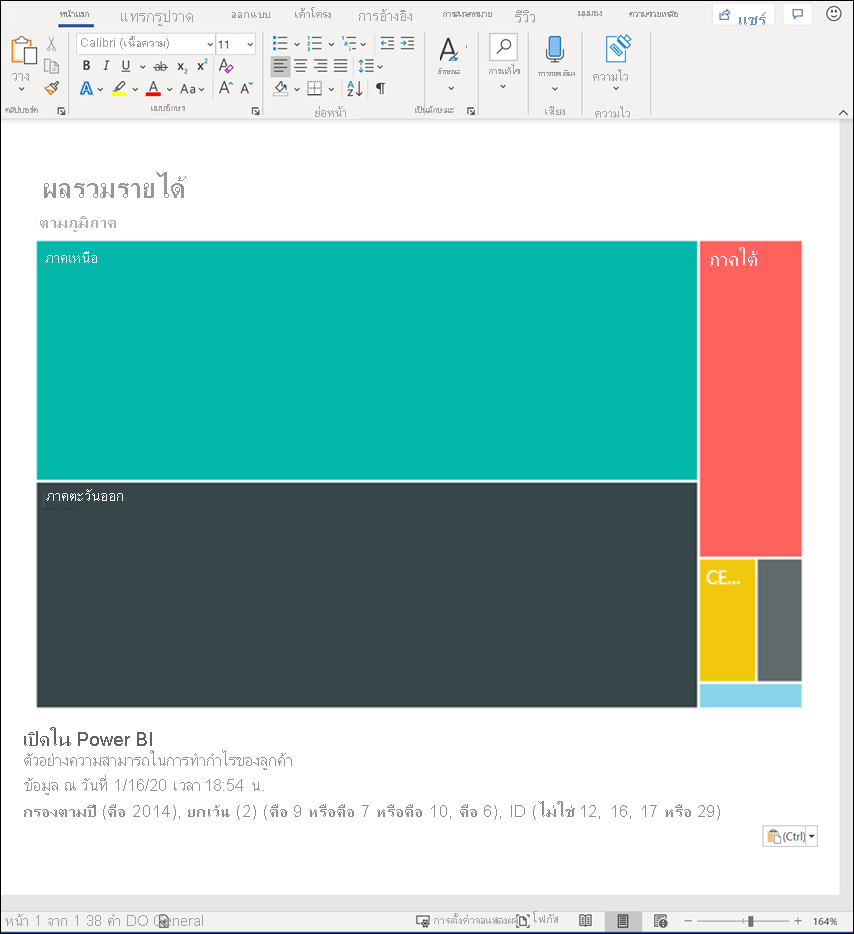
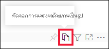
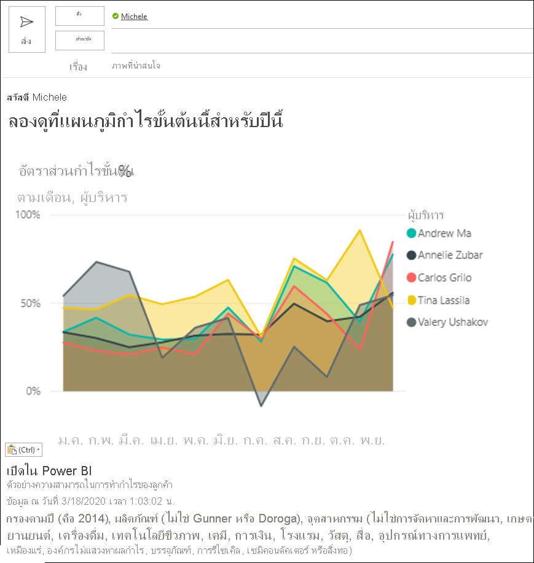
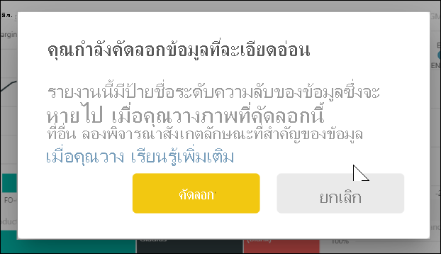
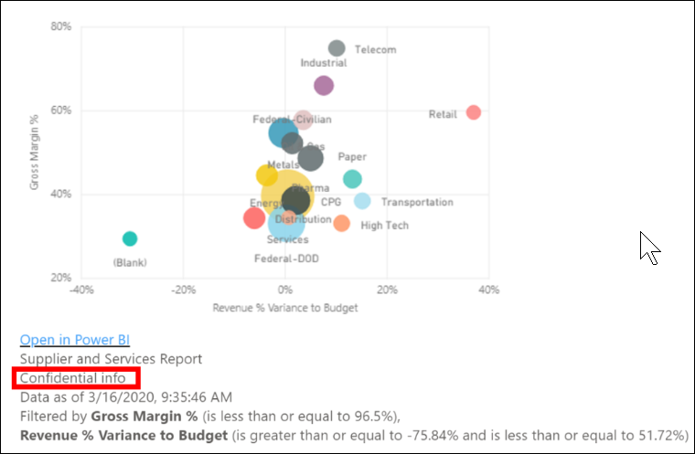
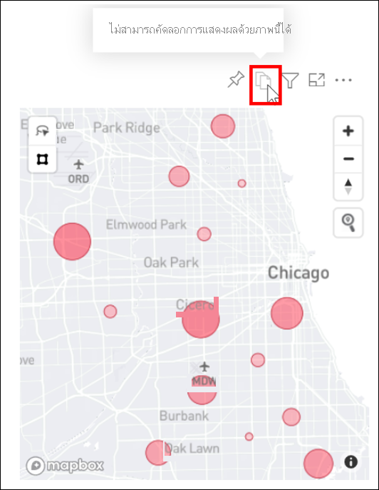

# คัดลอกวิชวลเป็นรูปภาพไปยังคลิปบอร์ดของคุณ

[!INCLUDE[consumer-appliesto-yyyn](../includes/consumer-appliesto-yyyn.md)]

คุณเคยต้องการแชร์รูปภาพจากรายงานหรือแดชบอร์ด Power BI หรือไม่ ในตอนนี้ คุณสามารถคัดลอกวิชวลและวางลงในแอปพลิเคชันอื่น ๆ ที่สนับสนุนการวางได้แล้ว 

เมื่อคุณคัดลอกรูปภาพของวิชวลแบบสแตติก คุณจะได้รับสำเนาของวิชวลพร้อมกับเมตาดาต้า รวมถึง:
* ลิงก์กลับไปที่รายงานหรือแดชบอร์ด Power BI
* ชื่อเรื่องของรายงานหรือแดชบอร์ด
* สังเกตว่ารูปมีข้อมูลที่เป็นความลับหรือไม่
* การประทับเวลาที่อัปเดตครั้งล่าสุด
* ตัวกรองที่นำไปใช้กับวิชวล

### คัดลอกจากไทล์แดชบอร์ด

1. นำทางไปยังแดชบอร์ดที่คุณต้องการคัดลอก

2. จากมุมบนขวาของวิชวล ให้เลือก **ตัวเลือกเพิ่มเติม (...)** และเลือก **คัดลอกวิชวลเป็นรูปภาพ** 

    

3. เมื่อกล่องโต้ตอบ **วิชวลของคุณพร้อมที่จะคัดลอก** ปรากฏขึ้น ให้เลือก **คัดลอกไปยังคลิปบอร์ด**

    

4. เมื่อวิชวลของคุณถูกคัดลอกแล้ว ให้วางลงในแอปพลิเคชันอื่นโดยใช้ **Ctrl + V** หรือ **คลิกขวา** > **วาง** ในภาพหน้าจอด้านล่าง เราได้วางวิชวลลงใน Microsoft Word 

    

### คัดลอกจากวิชวลรายงาน 

1. นำทางไปยังรายงานที่คุณต้องการคัดลอก

2. จากมุมบนขวาของวิชวล ให้เลือกไอคอนสำหรับ **คัดลอกวิชวลเป็นรูปภาพ** 

    

3. เมื่อกล่องโต้ตอบ **วิชวลของคุณพร้อมที่จะคัดลอก** ปรากฏขึ้น ให้เลือก **คัดลอกไปยังคลิปบอร์ด**

    

4. เมื่อวิชวลของคุณถูกคัดลอกแล้ว ให้วางลงในแอปพลิเคชันอื่นโดยใช้ **Ctrl + V** หรือ **คลิกขวา** > **วาง** ในภาพหน้าจอด้านล่าง เราได้วางวิชวลลงในอีเมล

    

5. ถ้ามีการใช้ป้ายชื่อระดับความลับของข้อมูลกับรายงาน คุณจะได้รับคำเตือนเมื่อคุณเลือกไอคอนคัดลอก  

    

    และป้ายชื่อระดับความลับจะถูกเพิ่มลงในเมตาดาต้าด้านล่างของวิชวลที่วาง 

    

## ข้อควรพิจารณาและการแก้ไขปัญหา

   

Q: ทำไมไอคอนคัดลอกจึงปิดใช้งานบนวิชวล?    
A: ขณะนี้เราสนับสนุนวิชวล Power BI แบบเนทีฟและวิชวลแบบกำหนดเองที่ได้รับการรับรอง มีการสนับสนุนที่จำกัดสำหรับวิชวลบางอย่าง ซึ่งประกอบด้วย: 
- ESRI และวิชวลแผนที่อื่น ๆ 
- การแสดงผลด้วยภาพของ Python 
- วิชวล R 
- วิชวล PowerApps   

A: สามารถปิดใช้งานความสามารถในการคัดลอกวิชวลได้โดยแผนกไอทีหรือผู้ดูแลระบบ Power BI ของคุณ

Q: เหตุใดวิชวลของฉันจึงวางไม่ถูกต้อง    
A: มีข้อจำกัดสำหรับวิชวลแบบกำหนดเองและวิชวลแบบเคลื่อนไหว 

## ขั้นตอนถัดไป
อ่านเพิ่มเติมเกี่ยวกับ[การแสดงภาพในรายงาน Power BI](end-user-visual-type.md)

ถ้าคุณมีสิทธิ์ในการแก้ไขรายงานคุณสามารถ [คัดลอกและวางวิชวลภายในรายงานเดียวกัน](../visuals/power-bi-visualization-copy-paste.md) 

มีคำถามเพิ่มเติมหรือไม่ [ลองไปที่ชุมชน Power BI](https://community.powerbi.com/)

