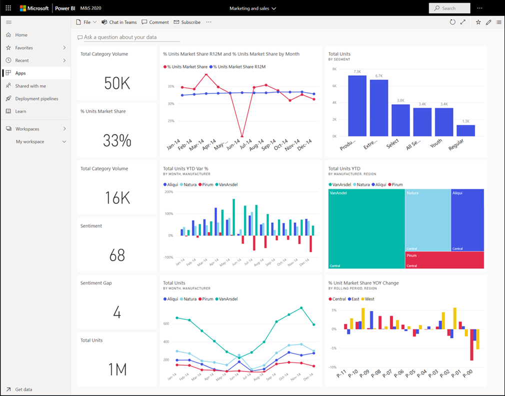
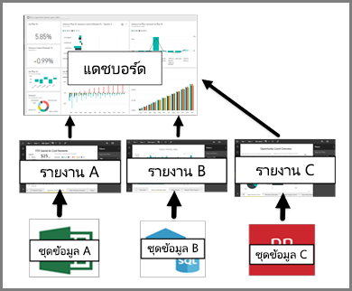

# แดชบอร์ดสำหรับผู้ใช้ทางธุรกิจของบริการของ Power BIDashboards for business users of the Power BI service

[!INCLUDE[consumer-appliesto-ynny](../includes/consumer-appliesto-ynny.md)]

\***แดชบอร์ด** Power BI_ ป็นแบบหน้าเดียว ซึ่งมักเรียกว่าพื้นที่ทำงานที่ใช้การแสดงผลข้อมูลด้วยภาพเพื่อบอกเล่าเรื่องราวหนึ่งๆ ได้A Power BI \***dashboard** _ is a single page, often called a canvas, that uses visualizations to tell a story. เนื่องจากจำกัดอยู่เพียงหนึ่งหน้า แดชบอร์ดทีี่ออกแบบมาอย่างดีจะประกอบด้วยองค์ประกอบที่สำคัญที่สุดของเรื่องราวเท่านั้นBecause it is limited to one page, a well-designed dashboard contains only the most-important elements of that story.

การแสดงผลข้อมูลด้วยภาพที่คุณเห็นบนแดชบอร์ดเรียกว่า _ไทล์\* และจะถูก *ปักหมุด* ไปยังแดชบอร์ดโดยรายงานของ *นักออกแบบ*The visualizations you see on the dashboard are called _tiles\* and are *pinned* to the dashboard by report *designers*. ในกรณีส่วนใหญ่ การเลือกไทล์ที่จะนำคุณไปยังหน้ารายงานที่การแสดงภาพถูกสร้างขึ้นIn most cases, selecting a tile takes you to the report page where the visualization was created. ถ้าคุณไม่คุ้นเคยกับ Power BI คุณสามารถเรียนรู้ข้อมูลพื้นฐานได้โดยการอ่าน[แนวคิดพื้นฐานของ Power BI](end-user-basic-concepts.md)If you're new to Power BI, you can get a good foundation by reading [Power BI basic concepts](end-user-basic-concepts.md).

> [!NOTE]
> เราสามารถ[ดูและแชร์แดชบอร์ดบนมือถือได้](mobile/mobile-apps-view-dashboard.md)Dashboards can be [viewed and shared on mobile devices](mobile/mobile-apps-view-dashboard.md).
>
> สำหรับเพื่อนร่วมงานที่จะสามารถแชร์แดชบอร์ดกับคุณ รุ่นของ Power BI ของคุณต้องเป็น "Pro" หรือ "Premium"For colleagues to be able to share dashboards with you, your version of Power BI must be "Pro" or "Premium." สำหรับข้อมูลเพิ่มเติม ดู [ชนิดสิทธิ์การใช้งาน Power BI](end-user-license.md)For more information, see [Power BI license types](end-user-license.md).

การแสดงภาพบนแดชบอร์ดมาจากรายงาน และแต่ละรายงานจะยึดตามชุดข้อมูลชุดเดียวThe visualizations on a dashboard come from reports and each report is based on one dataset. อันที่จริง วิธีหนึ่งในการนึกภาพแดชบอร์ดคือ ทางเข้าไปยังรายงานและชุดข้อมูลพื้นฐานIn fact, one way to think of a dashboard is as an entryway into the underlying reports and datasets. การเลือกการแสดงภาพนำคุณไปยังรายงานที่ใช้เพื่อสร้างการแสดงภาพดังกล่าวSelecting a visualization takes you to the report that was used to create it.

## ข้อดีของแดชบอร์ดAdvantages of dashboards
แดชบอร์ดเป็นวิธีที่ยอดเยี่ยมในการตรวจดูธุรกิจของคุณ ในการค้นหาคำตอบ และดูเมตริกที่สำคัญที่สุดของคุณอย่างรวดเร็วDashboards are a wonderful way to monitor your business, to look for answers, and to see all of your most-important metrics at a glance. การแสดงภาพบนแดชบอร์ดอาจมาจากหนึ่งหรือหลายชุดข้อมูลพื้นฐาน และจากรายงานหนึ่งหรือหลายรายงานพื้นฐานThe visualizations on a dashboard may come from one underlying dataset or many, and from one underlying report or many. แดชบอร์ดสามารถรวมข้อมูลภายในองค์กรและข้อมูลบนระบบคลาวด์ ให้มุมมองแบบรวมโดยไม่คำนึงถึงตำแหน่งที่ข้อมูลอยู่A dashboard can combine on-premises and cloud data, providing a consolidated view regardless of where the data lives.

แดชบอร์ดไม่ได้เป็นเพียงภาพที่สวยงาม เนื่องจากแดชบอร์ดสามารถโต้ตอบได้และมีการอัปเดตไทล์เมื่อมีการเปลี่ยนแปลงข้อมูลพื้นฐานA dashboard isn't just a pretty picture; it's interactive and the tiles update as the underlying data changes.

## แดชบอร์ดเทียบกับรายงานสำหรับ Power BI \***ผู้ใช้ทางธุรกิจ** _Dashboards versus reports for Power BI \***business users** _
เรามักสับสนระหว่างแดชบอร์ดเนื่องจากทั้งสองเป็นพื้นที่ที่กรอกข้อมูลด้วยการแสดงภาพเหมือนกันReports are often confused with dashboards since they too are canvases filled with visualizations. แต่ก็มีความแตกต่างที่สำคัญบางประการจากมุมมองของ _ผู้ใช้ทางธุรกิจ\* Power BIBut there are some major differences from a Power BI _business user\* point of view.

| **ขีดความสามารถ****Capability** | **แดชบอร์ด****Dashboards** | **รายงาน****Reports** |
| --- | --- | --- |
| หน้าPages |หนึ่งหน้าOne page |อย่างน้อยหนึ่งหน้าOne or more pages |
|**ถามคำถามเกี่ยวกับข้อมูลของคุณ** (Power BI Q & A) ที่ด้านบน**Ask a question about your data** (Power BI Q&A) field at top |เกือบตลอดเวลาalmost always | ไม่no |
| แหล่งข้อมูลData sources |อย่างน้อยหนึ่งรายงานและอย่างน้อยหนึ่งชุดข้อมูลต่อแดชบอร์ดOne or more reports and one or more datasets per dashboard |ชุดข้อมูลเดียวต่อรายงานA single dataset per report |
| การกรองFiltering |ไม่สามารถกรองหรือแบ่งส่วนได้Can't filter or slice |มีหลายวิธีในการกรอง ทำไฮไลท์ และแบ่งส่วนMany different ways to filter, highlight, and slice |
| ตั้งค่าการแจ้งเตือนSet alerts |สามารถสร้างการแจ้งเตือนไปยังอีเมลของคุณเมื่อเป็นไปตามเงื่อนไขบางประการCan create alerts to email you when certain conditions are met |ไม่No |
| แนะนำFeatured |สามารถตั้งค่าแดชบอร์ดหนึ่งเป็นแดชบอร์ด "แนะนำ" ของคุณได้Can set one dashboard as your "featured" dashboard |ไม่สามารถสร้างรายงานที่แนะนำได้Cannot create a featured report |
| สามารถดูตารางชุดข้อมูลพื้นฐานและพื้นที่ข้อมูลได้Can see underlying dataset tables and fields |หมายเลขNo. สามารถส่งออกข้อมูล แต่ไม่สามารถมองเห็นตารางและช่องข้อมูลในแดชบอร์ดCan export data but can't see tables and fields in the dashboard itself. |ใช่Yes. สามารถดูตารางชุดข้อมูล ช่องข้อมูล และค่าได้Can see dataset tables and fields and values. |

## สำหรับผู้ออกแบบแดชบอร์ดและผู้ใช้ทางธุรกิจแดชบอร์ดDashboard designers and dashboard business users
ในฐานะที่เป็น \**_ผู้ใช้ทางธุรกิจ_* _, ของ Power BI คุณได้รับแดชบอร์ดจากผู้ออกแบบAs a Power BI **_business user_* _, you receive dashboards from _designers*. สามารถเรียนรู้เกี่ยวกับแดชบอร์ดตที่มีหัวข้อเหล่านี้:Continue learning about dashboards with these topics:

* [ดูแดชบอร์ดView a dashboard](end-user-dashboard-open.md)
* เรียนรู้เกี่ยวกับ[ไทล์แดชบอร์ด](end-user-tiles.md)และสิ่งที่จะเกิดขึ้นเมื่อคุณเลือกหนึ่งแดชบอร์ดLearn about [dashboard tiles](end-user-tiles.md) and what will happen when you select one.
* ต้องการติดตามไทล์แดชบอร์ดแต่ละรายการและได้รับอีเมลเมื่อถึงขีดจำกัดหนึ่งหรือไม่?Want to track an individual dashboard tile and receive an email when it reaches a certain threshold? [สร้างการแจ้งเตือนบนไทล์](end-user-alerts.md)[Create alerts on tiles](end-user-alerts.md).
* เพลิดเพลินกับการถามคำถามเกี่ยวกับแดชบอร์ดของคุณHave fun asking your dashboard questions. เรียนรู้วิธีใช้ [การถามตอบ Power BI](end-user-q-and-a.md) เพื่อถามคำถามเกี่ยวกับข้อมูลของคุณและรับคำตอบในรูปแบบการแสดงภาพLearn how to use [Power BI Q&A](end-user-q-and-a.md) to ask a question about your data and get the answer in the form of a visualization.

> [!TIP]
> ถ้าคุณไม่พบสิ่งที่คุณกำลังค้นหาที่นี่ ใช้สารบัญทางด้านซ้ายIf you didn’t find what you’re looking for here, use the Table of Contents to the left.
> 

## ขั้นตอนถัดไปNext steps
[ดูแดชบอร์ดView a dashboard](end-user-dashboard-open.md) 