# โหมดการดูข้อมูลแบบเจาะลึกของภาพใน Power BIDrill mode in a visual in Power BI

[!INCLUDE[consumer-appliesto-yyny](../includes/consumer-appliesto-yyny.md)]

บทความนี้แสดงวิธีการดูข้อมูลแบบเจาะลึกในการแสดงภาพในบริการของ Microsoft Power BIThis article shows how to drill down in a visual in the Microsoft Power BI service. ใช้การดูรายละเอียดแนวลึกดูข้อมูลสรุปบนจุดข้อมูลของคุณ คุณสามารถสำรวจรายละเอียดเชิงลึกเกี่ยวกับข้อมูลของคุณUsing drill down and drill up on your data points, you can explore in-depth details about your data. 

## การดูรายละเอียดแนวลึก จำเป็นต้องมีลำดับชั้นDrill requires a hierarchy

เมื่อวิชวลมีลำดับชั้น คุณสามารถเจาะลงไปเพื่อดูรายละเอียดเพิ่มเติมWhen a visual has a hierarchy, you can drill down to reveal additional details. ตัวอย่างเช่น คุณอาจมีภาพที่ดูการนับจำนวนเหรียญรางวัลโอลิมปิก โดยมีลำดับชั้นที่สร้างขึ้นจากชนิดกีฬา ประเภทกีฬา และรายการแข่งขันFor example, you might have a visual that looks at Olympic medal count by a hierarchy made up of sport, discipline, and event. ตามค่าเริ่มต้น ภาพจะแสดงจำนวนเหรียญรางวัลตามชนิดกีฬา: ยิมนาสติก, สกี, กีฬาทางน้ำ และอื่น ๆBy default, the visual would show medal count by sport: gymnastics, skiing, aquatics, and so on. แต่เนื่องจากมีลำดับชั้น การเลือกองค์ประกอบหนึ่งของภาพ (ตัวอย่างเช่น แท่ง เส้น หรือฟอง) จะแสดงรูปภาพที่มีรายละเอียดเพิ่มขึ้นอย่างมากBut, because it has a hierarchy, selecting one of the visual elements (like a bar, line, or bubble), would display an increasingly more-detailed picture. การเลือกองค์ประกอบ **กีฬาทางน้ำ** จะแสดงข้อมูลสำหรับการว่ายน้ำ การกระโดดน้ำ และโปโลน้ำSelecting the **aquatics** element would show you data for swimming, diving, and water polo.  การเลือกองค์ประกอบ **การกระโดดน้ำ** จะแสดงรายละเอียดสำหรับการแข่งขัน กระดานสปริงบอร์ด แพลตฟอร์ม และ กระโดดน้ำแบบคู่Selecting the **diving** element would show you details for springboard, platform, and synchronized diving events.

วันที่คือประเภทเฉพาะของลำดับชั้นDates are a unique type of hierarchy.  *นักออกแบบ* รายงานมักจะเพิ่มลำดับชั้นของวันที่ไปยังวิชวลReport *designers* often add date hierarchies to visuals. ลำดับชั้นของวันที่ทั่วไปคือลำดับชั้นที่ประกอบด้วยปี ไตรมาส เดือน และวันA common date hierarchy is one that contains year, quarter, month, and day. 

## ตรวจสอบว่าภาพใดบ้างที่สามารถการดูข้อมูลแบบเจาะลึกได้Figure out which visuals can be drilled
ไม่แน่ใจว่าการแสดงภาพ Power BI ภาพใดที่มีลำดับชั้นใช่หรือไม่?Not sure which Power BI visuals contain a hierarchy? เลื่อนเมาส์ไปบนภาพHover over a visual. หากคุณเห็นชุดข้อมูลการควบคุมการดูข้อมูลแบบเจาะลึกเหล่านี้ที่ด้านบน แสดงว่าภาพของคุณมีลำดับชั้นIf you see a combination of these drill controls at the top, your visual has a hierarchy.

  

## เรียนรู้วิธการดูข้อมูลแบบเจาะลึกและข้อมูลสรุปLearn how to drill down and up

ในตัวอย่างนี้ เรากำลังใช้แผนที่ต้นไม้ที่มีลำดับชั้นซึ่งสร้างขึ้นจากเขตแดน เมือง รหัสไปรษณีย์ และชื่อร้านค้าIn this example we're using a treemap that has a hierarchy made up of territory, city, postal code, and store name. แผนที่ต้นไม้แสดงหน่วยทั้งหมดที่ขายในปีนี้ตามเขตแดน ก่อนการดูข้อมูลแบบเจาะลึกThe treemap, before drilling, looks at total units sold this year by territory. เขตแดนคือระดับบนสุดของลำดับชั้นTerritory is the top level of the hierarchy.

  

### มีสองวิธีในการเข้าถึงคุณลักษณะการดูข้อมูลแบบเจาะลึกTwo ways to access the drill features

คุณมีสองวิธีสำหรับการเข้าถึงการดูข้อมูลแบบเจาะลึก ข้อมูลสรุป และขยายคุณลักษณะในการแสดงผลภาพที่มีลำดับชั้นYou have two ways for accessing the drill-down, drill-up, and expand features for visuals that have hierarchies. ลองใช้งานทั้งสองวิธี และเลือกใช้หนึ่งวิธีที่คุณชื่นชอบมากที่สุดTry them both, and use the one that you enjoy the most.

- วิธีแรก: เลื่อนเมาส์ไปบนภาพเพื่อดูและใช้ไอคอนFirst way: hover over a visual to see and use the icons. เปิดใช้งานการดูรายละเอียดแนวลึกก่อนโดยเลือกลูกศรชี้ลงTurn on drill down first by selecting the downward arrow. พื้นหลังสีเทาช่วยให้คุณทราบว่าการดูรายละเอียดแนวลึกทำงานอยู่The grey background lets you know that drill down is active.   

    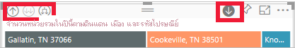

- วิธีที่สอง: คลิกขวาที่ภาพเพื่อเปิดและใช้เมนูSecond way: right-click a visual to reveal and use the menu.

    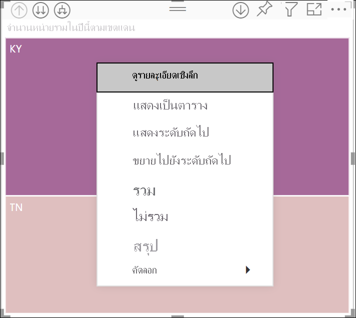

## เส้นทางการดูรายละเอียดDrill pathways

### ดูรายละเอียดแนวลึกทุกเขตข้อมูลในครั้งเดียวDrill down all fields at once

คุณมีหลายวิธีที่จะดูข้อมูลภาพของคุณแบบเจาะลึกYou have several ways to drill into your visual. การเลือกไอคอนลูกศรคู่ ไอคอนดูรายละเอียดแนวลึกจะนำคุณไปยังระดับถัดไปในลำดับชั้นSelecting the double arrow drill-down icon takes you to the next level in the hierarchy. หากคุณกำลังมองหาระดับ **เขตแดน** สำหรับเคนทักกีและเทนเนสซี คุณสามารถดูข้อมูลแบบเจาะลึกในระดับเมืองสำหรับทั้งสองรัฐ ตามด้วยระดับรหัสไปรษณีย์สำหรับทั้งสองรัฐ และสุดท้ายคือระดับชื่อร้านค้าสำหรับทั้งสองรัฐIf you're looking at the **Territory** level for Kentucky and Tennessee, you can drill down to city level for both states, then postal code level for both states, and, finally, the store name level for both states. แต่ละขั้นตอนในเส้นทางจะแสดงข้อมูลใหม่ให้คุณEach step in the path shows you new information.

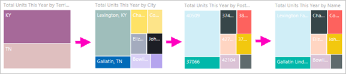

เลือกไอคอนการดูข้อมูลสรุปSelect the drill-up icon  จนกว่าคุณจะย้อนกลับไปที่ “หน่วยรวมปีนี้ตามเขตแดน”until you get back to "Total units this year by territory".

### ขยายเขตข้อมูลทั้งหมดพร้อมกันExpand all fields at once

**ขยาย** เป็นการเพิ่มระดับของลำดับชั้นในมุมมองปัจจุบัน**Expand** adds an additional hierarchy level to the current view. ดังนั้นถ้าคุณกำลังดูระดับ **เขตแดน** คุณสามารถขยายใบปัจจุบันทั้งหมดในต้นไม้ในเวลาเดียวกันได้So if you're looking at the **Territory** level, you can expand all current leaves in the tree at the same time.  การดูรายละเอียดแบบเจาะลึกแรกของคุณสำหรับทั้ง **KY** และ **TN**Your first drill adds city data for both **KY** and **TN**. การดูรายละเอียดแบบเจาะลึกต่อไปเพิ่มข้อมูลรหัสไปรษณีย์สำหรับทั้ง **KY** และ **TN** และเก็บข้อมูลเมืองไว้ด้วยเช่นกันThe next drill adds postal code data for both **KY** and **TN**, and keeps city data as well. แต่ละขั้นตอนในเส้นทางแสดงข้อมูลเดียวกัน และเพิ่มข้อมูลใหม่อีกหนึ่งระดับEach step in the path shows you the same information and adds on one level of new information.

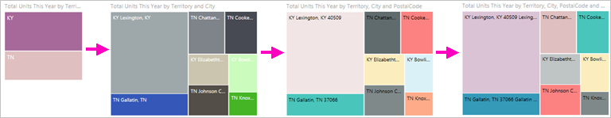

### ดูรายละเอียดแนวลึกทีละเขตข้อมูลDrill down one field at a time

1. เลือกไอคอนดูรายละเอียดเพื่อเปิดใช้งานการดูรายละเอียดแนวลึกSelect the drill-down icon to turn it on ..

    ในตอนนี้คุณมีตัวเลือกในการดูข้อมูลแบบเจาะลึก **ทีละหนึ่งเขตข้อมูล** โดยการเลือกองค์ประกอบการแสดงภาพNow you have the option of drilling down **one field at a time** by selecting a visual element. ตัวอย่างขององค์ประกอบการแสดงภาพคือ: แท่ง ฟอง และใบไม้Examples of visual elements are: bar, bubble, and leaf.

    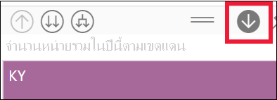

    ถ้าคุณไม่เปิดใช้งานการดูข้อมูลแบบเจาะลึก การเลือกองค์ประกอบภาพ (เช่น แท่ง ฟอง หรือใบไม้) จะไม่ดูข้อมูลแบบเจาะลึกIf you don't turn on drill down, selecting a visual element (like a bar, bubble, or leaf) won't drill down. แต่กลายเป็นว่าระบบจะกรองข้ามแผนภูมิอื่นๆ บนหน้ารายงานInstead, it will cross-filter the other charts on the report page.

1. เลือกใบไม้สำหรับ **TN**Select the leaf for **TN**. แผนที่ต้นไม้ของคุณจะแสดงเมืองทั้งหมดและเขตแดนในรัฐเทนเนสซีที่มีร้านค้าYour treemap now shows all the cities and territories in Tennessee that have a store.

    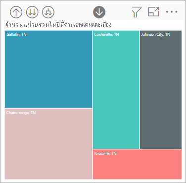

1. ถึงจุดนี้ คุณสามารถ:At this point, you can:

    1. ดูรายละเอียดแนวลึกต่อไปได้สำหรับ TennesseeContinue drilling down for Tennessee.

    1. ดูรายละเอียดแนวลึกสำหรับเมืองที่ระบุในรัฐ TennesseeDrill down for a particular city in Tennessee.

    1. ใช้การขยายแทนExpand instead.

    ลองดูรายละเอียดแนวลึกทีละเขตข้อมูลLet's continue to drill down one field at a time.  เลือก **Knoxville, TN** (เมือง Knoxville รัฐ Tennessee)Select **Knoxville, TN**. แผนที่ต้นไม้ของคุณขณะนี้ แสดงรหัสไปรษณีย์สำหรับร้านค้าของคุณใน KnoxvilleYour treemap now shows the postal code for your store in Knoxville.

    

    สังเกตว่า ชื่อเรื่องเปลี่ยนไปขณะที่คุณเจาะลึกลงรายละเอียด และย้อนกลับขึ้นมาอีกครั้งNotice that the title changes as you drill down and back up again.

    และดูรายละเอียดแนวลึกอีกหนึ่งเขตข้อมูลAnd drill down one more field. เลือกรหัสไปรษณีย์ **37919** และดูรายละเอียดแนวลึกลงของชื่อร้านค้าSelect postal code **37919** and drill down to store name. 

    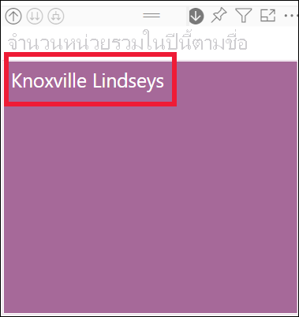    

    สำหรับข้อมูลนี้โดยเฉพาะ การเจาะลึกระดับทั้งหมดในครั้งเดียวอาจไม่น่าสนใจFor this particular data, drilling down all levels at once may not be interesting. ลองขยายออกมาแทนLet's try expanding instead.

### ขยายทั้งหมด และขยายหนึ่งทีละเขตข้อมูลExpand all and expand one field at a time

การมีแผนภูมิต้นไม้ที่แสดงเพียงรหัสไปรษณีย์ หรือชื่อของร้านค้าไม่ได้ให้ข้อมูลมากเท่าไหร่Having a treemap that shows us only a postal code or only a store name isn't informative.  ดังนั้นเรามา *ขยาย* ลำดับชั้นลงไปอีกหนึ่งระดับSo let's *expand* down one level in the hierarchy.  

1. ก่อนอื่นให้ดูรายละเอียดย้อนกลับไปยังระดับรหัสไปรษณีย์First, drill back up to the postal code level.     
1. ด้วยแผนที่ต้นไม้ที่ถูกเลือกไว้ก่อนแล้ว เลือกไอคอน *ขยายลง* With the treemap active, select the *expand down* icon . แผนภูมิต้นไม้ของคุณตอนนี้จะแสดง 2 ลำดับชั้น: คือ รหัสไปรษณีย์ และชื่อร้านค้าYour treemap now shows two levels of the hierarchy: postal code and store name.

    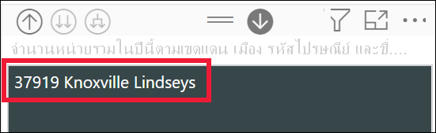

1. หากต้องการดูข้อมูลเกี่ยวกับ Tennesee ทั้ง 4 ลำดับชั้น ให้เลือกลูกศรการดูข้อมูลสรุปจนกว่าคุณไปถึงระดับที่สอง **จำนวนหน่วยรวมปีนี้ที่จำแนกตามเขตแดนและเมือง**To see all four hierarchy levels of data for Tennessee, select the drill-up arrow until you reach the second level, **Total units this year by territory and city**.

    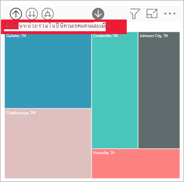

1. ตรวจสอบให้แน่ใจว่าการดูรายละเอียดแนวลึกยังคงเปิดใช้งานอยู่Make sure drill down is still turned on,  และเลือกไอคอน *ขยายลง* and select the *expand down* icon . ในตอนนี้แผนที่ต้นไม้ของคุณแสดงจำนวนใบไม้ (กล่อง) เท่ากัน แต่ใบไม้แต่ละใบนั้นมีรายละเอียดเพิ่มเติมYour treemap now shows the same number of leaves (boxes), but each leaf has additional detail. นอกจากการแสดงผลแค่เมืองและรัฐแล้ว ยังแสดงรหัสไปรษณีย์อีกด้วยInstead of only showing city and state, it now also shows us postal code.

    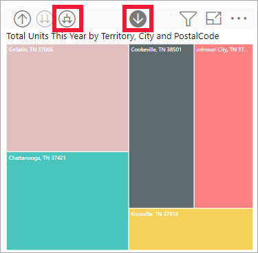

1. เลือกไอคอน *ขยายลง* อีกครั้งเพื่อแสดงลำดับชั้นทั้ง 4 เกี่ยวกับรายละเอียดของ Tennesee บนแผนภูมิต้นไม้ของคุณSelect the *expand down* icon one more time to display all four hierarchy levels of detail for Tennessee on your treemap. โฮเวอร์เหนือเป็นใบไม้เพื่อดูรายละเอียดเพิ่มเติมHover over a leaf to see even more detail.

    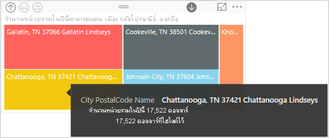

## แสดงข้อมูลขณะที่คุณดูข้อมูลแบบเจาะลึกShow the data as you drill
ใช้ตัวเลือก **แสดงเป็นตาราง** เพื่อดูเบื้องหลังฉากUse **Show as a table** to get a look behind the scenes. แต่ละครั้งที่คุณดูข้อมูลแบบเจาะลึกหรือขยาย **แสดงเป็นตาราง** จะแสดงผลข้อมูลที่ใช้ในการสร้างวิชวลEach time you drill or expand, **Show as a table** displays the data being used to build the visual. ซึ่งอาจช่วยให้คุณเข้าใจวิธีการทำงานของลำดับชั้น การดูข้อมูลแบบเจาะลึก และขยายการทำงานร่วมกันเพื่อสร้างการแสดงภาพThis may help you understand how hierarchies, drill, and expand work together to build visuals. 

ในมุมขวาบน เลือก **ตัวเลือกเพิ่มเติม** (...) แล้วเลือก **แสดงเป็นตาราง**In the upper-right corner, select **More actions** (...), and then select **Show as a table**. 

Power BI เปิดแผนที่ต้นไม้เพื่อให้เติมพื้นที่ทำงานPower BI opens the treemap so that it fills the canvas. ข้อมูลในแผนที่ต้นไม้จะแสดงด้านล่างวิชวลThe data that makes up the treemap displays below the visual. 

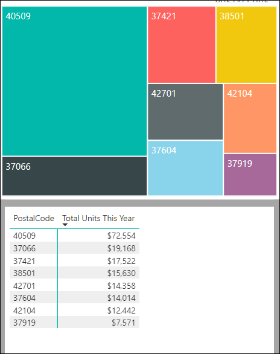

ด้วยวิชวลเพียงอย่างเดียวในพื้นที่ทำงาน ให้เจาะลึกรายละเอียดต่อไปWith the visual alone in the canvas, continue drilling. ดูข้อมูลในการเปลี่ยนแปลงตารางเพื่อแสดงให้เห็นถึงข้อมูลที่ใช้ในการสร้างแผนที่ต้นไม้Watch the data in the table change to reflect the data being used to create the treemap. ตารางต่อไปนี้แสดงผลลัพธ์ของการดูข้อมูลแบบเจาะลึกในเขตข้อมูลทั้งหมดพร้อม ๆ กันตั้งแต่เขตแดนไปจนถึงร้านค้าThe following table shows the results of drilling down all fields at once from territory to store name. ตารางแรกแสดงระดับบนสุดของลำดับชั้น แผนที่ต้นไม้แสดงสองใบ หนึ่งใบสำหรับ **KY** และหนึ่งใบสำหรับ **TN**The first table represents the top level of the hierarchy, the treemap showing two leaves, one for **KY** and one for **TN**. ตารางสามรายการถัดไปแสดงข้อมูลของแผนที่ต้นไม้ในขณะที่คุณดูรายละเอียดระดับทั้งหมดในครั้งเดียว--จากเขตแดนไปยังเมืองไปยังรหัสไปรษณีย์ไปยังชื่อร้านค้าThe next three tables represent the treemap's data as you drill down all levels at once--from territory to city to postal code to store name.

โปรดสังเกตว่าผลรวมจะเหมือนกันสำหรับ **เมือง\*\*\*\*รหัสไปรษณีย์** และ **ชื่อ**Notice that the totals are the same for **City**, **PostalCode**, and **Name**. ผลรวมที่ตรงกันจะไม่เป็นเช่นนี้เสมอไปMatching totals won't always be the case.  แต่สำหรับข้อมูลนี้ มีร้านค้าเพียงแห่งเดียวในแต่ละรหัสไปรษณีย์และในแต่ละเมืองBut for this data, there's only one store in each postal code and in each city.  

## ข้อควรพิจารณาและข้อจำกัดConsiderations and limitations
- ตามค่าเริ่มต้น การดูรายละเอียดจะไม่กรองวิชวลอื่น ๆ ในรายงานBy default, drilling won't filter other visuals in a report. อย่างไรก็ตาม ผู้ออกแบบรายงานสามารถเปลี่ยนลักษณะการทำงานเริ่มต้นนี้ได้However, the report designer can change this default behavior. ในขณะที่คุณดูข้อมูลแบบเจาะลึก ให้ดูว่าการแสดงภาพอื่น ๆ บนหน้านั้นมีการกรองข้ามหรือไฮไลท์ข้ามหรือไม่As you drill, look to see if the other visuals on the page are cross-filtering or cross-highlighting.

- การดูรายงานที่มีการแชร์กับคุณต้องมีสิทธิ์การใช้งาน Power BI Pro หรือใบอนุญาตแบบ Premium หรือสำหรับรายงานต้องจัดเก็บอยู่ในความจุ Power BI PremiumViewing a report that has been shared with you requires a Power BI Pro or Premium license or for the report to be stored in Power BI Premium capacity. [ฉันมีสิทธิการใช้งานใดอยู่บ้างWhich license do I have?](end-user-license.md)

## ขั้นตอนถัดไปNext steps

[การแสดงผลด้วยภาพในรายงาน Power BIVisuals in Power BI reports](../visuals/power-bi-report-visualizations.md)

[รายงาน Power BIPower BI reports](end-user-reports.md)

[Power BI แนวคิดพื้นฐานPower BI - Basic Concepts](end-user-basic-concepts.md)

มีคำถามเพิ่มเติมหรือไม่More questions? [ลองไปที่ชุมชน Power BITry the Power BI Community](https://community.powerbi.com/)
