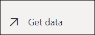
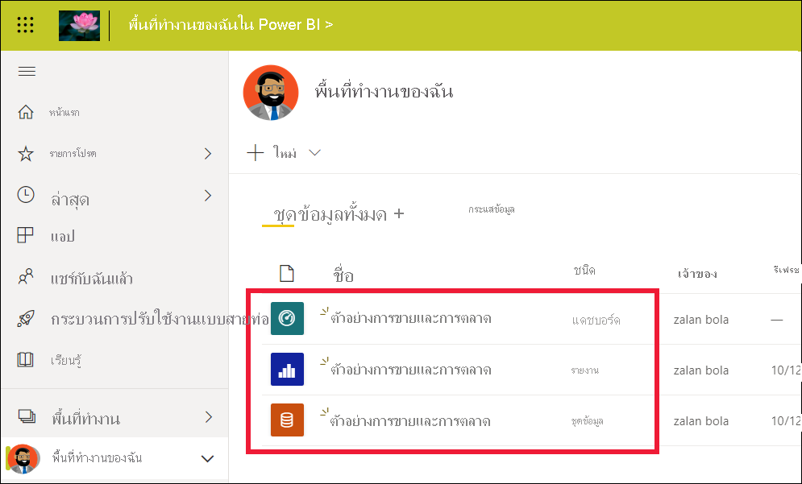
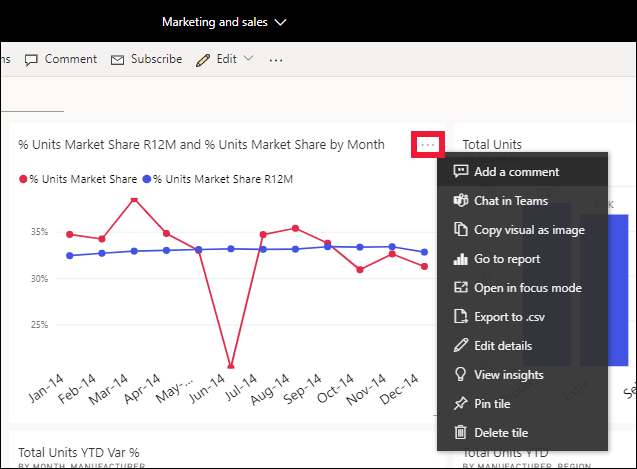

# เริ่มต้นใช้งานด่วน - ทำความรู้จักบริการของ Power BIQuickstart - Getting around in Power BI service

[!INCLUDE [power-bi-service-new-look-include](../includes/power-bi-service-new-look-include.md)]

ขณะนี้คุณทราบถึง [พื้นฐานของ Power BI](end-user-basic-concepts.md) แล้ว เรามาดู **บริการของ Power BI** กันบ้างNow that you know the [basics of Power BI](end-user-basic-concepts.md), let's take a look around the **Power BI service** . ตามที่กล่าวไว้ในบทความก่อนหน้านี้ เพื่อนร่วมงานในทีมของคุณอาจใช้เวลาทั้งหมดใน **Power BI Desktop** เพื่อรวมข้อมูลและสร้างรายงาน แดชบอร์ด และแอปสำหรับบุคคลอื่นAs mentioned in the previous article, colleagues on your team might spend all of their time in **Power BI Desktop** , combining data and creating reports, dashboards, and apps for others. พวกเขาคือ *นักออกแบบ*They're *designers* . ในทางกลับกัน คุณอาจใช้เวลาทั้งหมดของคุณในบริการของ Power BI เพื่อดูและโต้ตอบกับเนื้อหาที่สร้างโดยบุคคลอื่น (ประสบการณ์ **การใช้งาน** )You, on the other hand, might spend all of your time in the Power BI service, viewing and interacting with content created by others ( **consuming** experience). คุณคือ *ผู้ใช้ทางธุรกิจ*You're a *business user* . การเริ่มต้นใช้งานด่วนสำหรับ *ผู้ใช้ทางธุรกิจ*This quickstart is for *business users* . 

   
 
## ข้อกำหนดเบื้องต้นPrerequisites

- ถ้าคุณไม่ได้ลงทะเบียน Power BI ให้[ลงทะเบียนรุ่นทดลองใช้ฟรี](https://app.powerbi.com/signupredirect?pbi_source=web)ก่อนที่คุณจะเริ่มต้นใช้งานIf you're not signed up for Power BI, [sign up for a free trial](https://app.powerbi.com/signupredirect?pbi_source=web) before you begin.

- อ่าน [แนวคิดพื้นฐานเกี่ยวกับบริการของ Power BI](end-user-basic-concepts.md)Read [Power BI service basic concepts](end-user-basic-concepts.md)

- การดูเนื้อหา Power BI (รายงาน แดชบอร์ด แอป) ที่สร้างขึ้นโดย *นักออกแบบ* ต้องการเป็นไปตามหนึ่งในเงื่อนไขต่อไปนี้:Viewing Power BI content (reports, dashboards, apps) created by *designers* requires one of two conditions:
    - สิทธิการใช้งาน Power BI Proa Power BI Pro license
    - เพื่อให้องค์กรของคุณมีการสมัครใช้งานสำหรับ Power BI Premium และเนื้อหาที่จะใช้ร่วมกันกับคุณจากความจุ Power BI PremiumYour organization to have a Power BI Premium subscription, and the content to be shared with you from Premium capacity.    
    [เรียนรู้เกี่ยวกับสิทธิ์การใช้งานและการสมัครใช้งาน](end-user-license.md)[Learn about licenses and subscriptions](end-user-license.md).     

    สำหรับวัตถุประสงค์ของการเริ่มต้นใช้งานด่วนนี้ ไม่จำเป็นต้องมีเงื่อนไขใดๆFor the purposes of this quickstart, we aren't requiring either of these conditions to be met. Microsoft ได้สร้างเนื้อหาตัวอย่างให้คุณโดยตรงจากอินเทอร์เฟซบริการของ Power BIMicrosoft has made sample content available to you directly from the Power BI service interface. เราจะใช้เนื้อหาตัวอย่างนี้เพื่อเรียนรู้วิธีการของเราในบริการของ Power BIWe'll use this sample content to learn our way around the Power BI service. 

## เปิดบริการ Power BIOpen the Power BI service

หากต้องการเริ่มต้น ให้เปิดบริการของ Power BI (app.powerbi.com)To begin, open the Power BI service (app.powerbi.com). 
1. ถ้าบานหน้าต่างการนำทางด้านซ้ายถูกยุบ ให้เลือกไอคอนบานหน้าต่างการนำทางIf the left navigation pane is collapsed, select the nav pane icon  เพื่อขยายบานหน้าต่างto expand it. 

1. จากมุมล่างซ้าย เลือก **รับข้อมูล**From the lower left corner, select **Get data** . เราจะนำข้อมูลตัวอย่างบางส่วนไปใช้สำหรับการนำเสนอบริการของ Power BI ของเราWe'll grab some sample data to use for our tour of the Power BI service. มีข้อมูลตัวอย่างทุกชนิดให้คุณได้ค้นหา และในครั้งนี้ เราจะใช้ข้อมูลเกี่ยวกับการตลาดและการขายThere are all types of sample data provided for you to explore, and this time we'll use the data about marketing and sales. 

   

1. หลังจากหน้าจอ **รับข้อมูล** เปิดขึ้น เลือก **ตัวอย่าง**After the **Get data** screen opens, select **Samples** .

   

1. เลือก **การขายและการตลาด** > **เชื่อมต่อ**Select **Sales and Marketing** > **Connect** . 

   

5. บริการของ Power BI จะติดตั้งตัวอย่างใน **พื้นที่ทำงานของฉัน**The Power BI service installs the sample in your **My workspace** .  **พื้นที่ทำงานของฉัน** คือ sandbox ส่วนตัวของคุณสำหรับการเรียนรู้และการทดลองใช้**My workspace** is your private sandbox for learning and experimenting.  เฉพาะคุณเท่านั้นที่สามารถดูเนื้อหาใน **พื้นที่ทำงานของฉัน**Only you can see the content in **My workspace** . ตัวอย่างประกอบด้วยหนึ่งแดชบอร์ด หนึ่งรายงาน และหนึ่งชุดข้อมูลThe sample includes one dashboard, one report, and one dataset. โดยทั่วไปแล้ว *ผู้ใช้ทางธุรกิจ* จะไม่ได้รับชุดข้อมูล แต่ตัวอย่างนี้ถูกออกแบบมาสำหรับผู้ใช้ทั้งหมด จึงมีชุดข้อมูลรวมอยู่ด้วยTypically, *business users* won't receive datasets, but this sample is designed for all users and it does include one.

    

    ในฐานะที่เป็น *ผู้ใช้ทางธุรกิจ* เนื้อหาส่วนใหญ่ที่ใช้ร่วมกันกับคุณจะไม่รวมการเข้าถึงโดยตรงไปยังชุดข้อมูลเบื้องต้นAs a *business user* , most content that is shared with you won't include direct access to the underlying datasets. เนื่องจากตัวอย่าง Power BI ถูกสร้างขึ้นสำหรับลูกค้า Power BI ทั้งหมด จึงมีการรวมชุดข้อมูลไว้Because the Power BI samples are created for all Power BI customers, datasets are included.   

    หากต้องการเรียนรู้เพิ่มเติมเกี่ยวกับตัวอย่าง โปรดดู [รับตัวอย่างสำหรับ Power BI](../create-reports/sample-datasets.md)To learn more about samples, see [Get samples for Power BI](../create-reports/sample-datasets.md).

## ดูเนื้อหา (แดชบอร์ดและรายงาน)View content (dashboards and reports)
เนื้อหาได้รับการจัดระเบียบภายในบริบทของพื้นที่ทำงานContent is organized within the context of a workspace. ผู้ใช้ทางธุรกิจทุกคนมีพื้นที่ทำงานอย่างน้อยหนึ่งแห่ง และเรียกว่า **พื้นที่ทำงานของฉัน**Every business user has at least one workspace, and it's called **My workspace** . เมื่อเพื่อนร่วมงาน *นักออกแบบ* แชร์เนื้อหากับคุณ คุณมีอาจพื้นที่ทำงานอื่นๆ เพิ่มเติมWhen *designer* colleagues share content with you, you may end up with additional workspaces.  ตัวอย่างเช่น ถ้า *นักออกแบบ* กำหนดสิทธิ์ในการเข้าถึงให้กับคุณไปยังพื้นที่ทำงานของพวกเขา พื้นที่ทำงานนั้นจะแสดงในไซต์ Power BI ของคุณFor example, if a *designer* assigns you access permissions to one of their workspaces, that workspace will show up in your Power BI site.  

**พื้นที่ทำงานของฉัน** จัดเก็บเนื้อหาทั้งหมดที่คุณเป็นเจ้าของและสร้าง**My Workspace** stores all the content that you own and create. ให้คิดว่าเป็น sandbox ส่วนบุคคลของคุณหรือพื้นที่ทำงานสำหรับเนื้อหาของคุณเองThink of it as your personal sandbox or work area for your own content. สำหรับ *ผู้ใช้ทางธุรกิจ* Power BI หลายคน **พื้นที่ทำงานของฉัน** ยังว่างเปล่าเพราะงานของคุณไม่เกี่ยวข้องกับการสร้างเนื้อหาใหม่For many Power BI *business user* , **My workspace** remains empty because your job doesn't involve creating new content.  *ผู้ใช้ทางธุรกิจ* โดยความหมายนั้น ใช้ข้อมูลที่สร้างขึ้นโดยผู้อื่นและใช้ข้อมูลนั้นเพื่อตัดสินใจทางธุรกิจ*Business users* , by definition, consume data created by others and use that data to make business decisions. หากคุณกำลังสร้างเนื้อหา ลองอ่าน [บทความ Power BI สำหรับ *ผู้ออกแบบ*](../index.yml) แทนIf you find that you are creating content, consider reading the [Power BI articles for *report creators*](../index.yml) instead.

พื้นที่ทำงานมีจำนวนมากกว่ารายการของเนื้อหาแบบง่ายอย่างมากA workspace is much more than a simple listing of content. ในหน้านี้ คุณสามารถเรียนรู้มากมายเกี่ยวกับแดชบอร์ดและรายงานของพื้นที่ทำงานOn this page, you can learn a lot about the workspace's dashboards and reports. ใช้เวลาสักครู่เพื่อระบุเจ้าของเนื้อหา วันที่รีเฟรชครั้งล่าสุด ความอ่อนไหวของข้อมูล และการประทับรับรอง ถ้ามีTake a few minutes to identify the content owner, last refreshed date, data sensitivity, and endorsements, if any. เลือก **การดำเนินการเพิ่มเติม (...)** เพื่อแสดงรายการของการดำเนินการสำหรับแดชบอร์ดและรายงานSelect **More actions (...)** to display a list of actions for the dashboard and report.   

หากต้องการเรียนรู้เพิ่มเติม โปรดดู [พื้นที่ทำงาน](end-user-workspaces.md)To learn more, see [Workspaces](end-user-workspaces.md).

พื้นที่ทำงานเป็นหนึ่งในเส้นทางของข้อมูลของคุณA workspace is also one of the paths into your data. จากพื้นที่ทำงาน คุณสามารถเปิดแดชบอร์ดหรือรายงานโดยการเลือกจากรายการFrom a workspace you can open a dashboard or report by selecting it from the list.  คุณสามารถสร้างรายการโปรดของแดชบอร์ดหรือรายงานได้โดยการวางเมาส์เหนือและเลือกไอคอนรูปดาวYou can favorite a dashboard or report by hovering and selecting the star icon. ถ้า *นักออกแบบ* ให้ [สิทธิ์การแชร์](end-user-shared-with-me.md) แก่คุณ คุณสามารถแบ่งปันจากที่นี่ได้เช่นกันIf the *designer* gave you [sharing permissions](end-user-shared-with-me.md), you can share from here as well. 

1. เลือกชื่อแดชบอร์ดเพื่อเปิดSelect the name of the dashboard to open it. แดชบอร์ดคือสิ่งที่ทำให้บริการของ Power BI แตกต่างจาก Power BI DesktopDashboards are something that differentiates the Power BI service from Power BI Desktop. [เรียนรู้เกี่ยวกับแดชบอร์ดLearn about dashboards](end-user-dashboards.md)

    

2. การดำเนินการที่คุณสามารถทำได้ในแดชบอร์ดจะแสดงอยู่ในแถบเมนูด้านบนThe actions you can take on a dashboard are displayed in the top menu bar.    

    

3. วางเมาส์เหนือไทล์แดชบอร์ดและเลือก **ตัวเลือกเพิ่มเติม (...)** เพื่อดูตัวเลือกที่คุณมีสำหรับการโต้ตอบกับไทล์นั้นHover over a dashboard tile and select **More options (...)** to see the options you have for interacting with that tile.

    

4. เลือกไทล์แดชบอร์ดเพื่อเปิดรายงานที่ถูกใช้เพื่อสร้างไทล์นั้นSelect a dashboard tile to open the report that was used to create that tile. รายงานจะเปิดไปยังหน้าที่มีวิชวลที่อยู่บนไทล์นั้นThe report opens to the page that contains the visual that is on the tile. นี่ไง ฉันได้เลือกไทล์แดชบอร์ดด้วยแผนที่ต้นไม้Here, I've selected the dashboard tile with the treemap. บริการของ Power BI เปิดหน้ารายงานของ **ประเภท YTD**The Power BI service opens the **YTD Category** report page.

    

    รายงานมีหลายส่วนReports have several sections. ทางด้านซ้ายคือรายการของหน้ารายงานที่คลิกได้On the left is the clickable list of report pages. ด้านบนคือแถบเมนูที่มีการดำเนินการที่คุณสามารถทำได้ในรายงานAcross the top is the menu bar containing actions you can take with the report.  ตัวเลือกที่พร้อมใช้งานจะขึ้นอยู่กับบทบาทและสิทธิ์ของรายงานที่ *นักออกแบบ* มอบหมายให้กับคุณThe options available will depend on the role and permission the report *designer* assigned to you. ทางด้านขวาคือบานหน้าต่าง **ตัวกรอง**On the right side is the **Filters** pane. และพื้นที่กึ่งกลางคือส่วนของรายงานAnd the center canvas contains the report itself. เช่นเดียวกันกับแดชบอร์ด มีการดำเนินการที่คุณสามารถใช้สำหรับรายงานทั้งหมด สำหรับแต่ละวิชวล และยังสำหรับแต่ละหน้ารายงานSimilar to the dashboard, there are actions that you can take for the entire report, for individual visuals, and also for a single report page. 

    เรียนรู้เกี่ยวกับรายงาน [รายงาน Power BI](end-user-reports.md)Learn about reports [Power BI reports](end-user-reports.md).

## การใช้บานหน้าต่างนำทางด้านซ้ายUsing the left navigation pane
บานหน้าต่างนำทางจะเป็นประโยชน์มากขึ้นเมื่อเพื่อนร่วมงานแชร์เนื้อหากับคุณThe nav pane will become more useful as colleagues share content with you. ในส่วนของการเริ่มต้นใช้งานด่วน เราจะวางตัวอย่าง *การขายและการตลาด* ไว้ก่อนและไปดูที่แดชบอร์ดและรายงานที่เป็นของ *ผู้ใช้ทางธุรกิจ* ของ Power BI ผู้มีเนื้อหาที่ใช้ร่วมกันจำนวนมากIn this section of the Quickstart, we'll put the *Sales and marketing* sample aside, and look at a dashboard and report that belong to a Power BI *business user* who has a lot of shared content.

1. **หน้าแรก** คือหน้า landing page เริ่มต้นเมื่อคุณเข้าสู่ระบบบริการของ Power BI**Home** is the default landing page when you log in to the Power BI service. หน้าแรกเป็นจุดเริ่มต้นที่ยอดเยี่ยมและเป็นอีกวิธีในการนำทางไปยังเนื้อหาของคุณHome is a great jumping off point and alternate way to navigate your content. เนื้อหาบนหน้าแรกจะถูกจัดเรียงตามรายการโปรด ล่าสุด ที่เปิดบ่อย และความสำคัญContent on Home is organized by favorite, recent, frequent, and featured. นอกจากนี้หน้าแรกยังแสดงพื้นที่ทำงานและแอปล่าสุดของคุณHome also displays your most recent workspaces and apps. เพียงแค่เลือกรายการเพื่อเปิดJust select an item to open it.

    หน้าแรกรวบรวมเครื่องมือค้นหาและเรียงลำดับ บานหน้าต่างการนำทาง และพื้นที่การทำงานพร้อม *การ์ด* ที่คุณสามารถเลือกเพื่อเปิดแดชบอร์ด รายงาน และแอปของคุณเข้าด้วยกันHome brings together the searching and sorting tools, the nav pane, and a canvas with *cards* that you can select to open your dashboards, reports, and apps. ในตอนแรก คุณอาจไม่มีการ์ดจำนวนมากบนพื้นที่ทำงานของคุณ แต่จะเปลี่ยนไปเมื่อคุณเริ่มใช้ Power BI กับเพื่อนร่วมงานของคุณAt first, you might not have many cards on your Home canvas, but that will change as you start to use Power BI with your colleagues. พื้นที่ทำงานของหน้าแรกของคุณจะมีการอัปเดตเนื้อหาที่แนะนำและแหล่งข้อมูลการเรียนรู้ให้ด้วยYour Home canvas also updates with recommended content and learning resources.

   

    เมื่อต้องการเรียนรู้เพิ่มเติม ดู [หน้าแรก Power BI](end-user-home.md)To learn more, see [Power BI Home](end-user-home.md)

2. **รายการโปรด** และ **ล่าสุด** มีลูกศร**Favorites** and **Recent** both have arrows. เลือกลูกศรเพื่อดูรายการโปรดห้ารายการ หรือเนื้อหาที่เยี่ยมชมล่าสุดห้ารายการได้อย่างรวดเร็วSelect an arrow to quickly see the top five favorites or five most recently visited content. จากเมนูลอย ให้เลือกเนื้อหาเพื่อเปิดFrom the flyout, select content to open it. 

   

    หากต้องการดูรายการโปรดหรือล่าสุดทั้งหมดของคุณ ให้เลือกคำหรือไอคอนTo see your full list of favorites or recents, select the word or icon. รายการเนื้อหาเหล่านี้แสดงรายละเอียดเพิ่มเติมเกี่ยวกับรายงาน แอป และแดชบอร์ดThese content lists provide additional details about the reports, apps, and dashboards.

    

    หากต้องการเรียนรู้เพิ่มเติม ดู [ล่าสุดใน Power BI](end-user-recent.md) และ [รายการโปรดใน Power BI](end-user-recent.md)To learn more, see [Recents in Power BI](end-user-recent.md) and [Favorites in Power BI](end-user-recent.md).

4. เลือก **แอป** เพื่อแสดงแอปทั้งหมดที่แชร์กับคุณ หรือที่คุณได้ติดตั้งแล้วSelect **Apps** to display all apps that have been shared with you or that you have installed. และเลือก **แชร์กับฉัน** เพื่อดูแดชบอร์ดและรายงานที่ได้แชร์กับคุณAnd select **Shared with me** to see dashboards and reports that have been shared with you. เนื่องจากคุณเพิ่งเริ่มต้นใช้บริการของ Power BI พื้นที่เนื้อหาเหล่านี้จะว่างเปล่าSince you're just starting out with the Power BI service, these content areas will be empty. 

    เรียนรู้เกี่ยวกับ [แอป](end-user-apps.md) และ [แชร์กับฉัน](end-user-shared-with-me.md)Learn about [Apps](end-user-apps.md) and [Shared with me](end-user-shared-with-me.md).

### ค้นหาและเรียงลำดับเนื้อหาSearch and sort content
เมื่อคุณเพิ่งเริ่มใช้บริการ Power BI คุณจะมีเนื้อหาเพียงไม่กี่ชิ้นWhen you're new to the Power BI service, you'll have only a few pieces of content. แต่ในขณะที่เพื่อนร่วมงานเริ่มแบ่งปันเนื้อหากับคุณ และคุณเริ่มดาวน์โหลดแอปคุณอาจจบลงด้วยรายการเนื้อหาที่ยาวBut as colleagues begin sharing content with you and you begin downloading apps, you may end up with long lists of content. นั่นคือเวลาที่คุณจะพบการค้นหาและการเรียงลำดับที่เป็นประโยชน์อย่างยิ่งThat's when you'll find searching and sorting extremely helpful.

การค้นหาพร้อมใช้งานจากเกือบทุกส่วนของบริการ Power BISearch is available from almost every part of the Power BI service. เพียงแค่มองหากล่องค้นหาหรือเลือกไอคอนแว่นขยายการค้นหาJust look for the search box or search magnifying glass icon.    

ในเขตข้อมูลการค้นหา ให้พิมพ์ชื่อทั้งหมดหรือบางส่วนของแดชบอร์ด รายงาน สมุดงาน แอป หรือเจ้าของIn the Search field, type all or part of the name of a dashboard, report, workbook, app, or owner. Power BI ค้นหาเนื้อหาทั้งหมดของคุณPower BI searches all of your content.

นอกจากนี้ยังมีหลายวิธีในการเรียงลำดับเนื้อหาThere are also many ways to sort content. วางเมาส์เหนือส่วนหัวของคอลัมน์ และค้นหาลูกศรที่ระบุว่าคอลัมน์สามารถเรียงลำดับได้Hover over column headers and look for arrows indicating that the column can be sorted. ไม่ใช่ทุกคอลัมน์ที่จะสามารถจัดเรียงได้Not all columns can be sorted. 

หรือมองหา **ตัวกรอง** การค้นหา ใกล้กับมุมขวาบนของรายการเนื้อหาของคุณOr, look for the Search **Filters** near the upper right corner of your content lists. ค้นหาเนื้อหาได้อย่างรวดเร็วโดยการเลือกจากชนิดของเนื้อหา เจ้าของ หรือเขตข้อมูลอื่นๆ ที่พร้อมใช้งานFind content quickly by selecting from the type of content, owner, or any other available field.

เมื่อต้องการเรียนรู้เพิ่มเติม ให้ดู [การนำทางใน Power BI: ค้นหาและจัดเรียง](end-user-search-sort.md)To learn more, see [Power BI navigation: search and sort](end-user-search-sort.md)

## ค้นหาเจ้าของFind the owner
และเราจะจบการเริ่มต้นใช้งานด่วนนี้ด้วยคำแนะนำที่เป็นประโยชน์And we'll end this quickstart with a helpful tip. หากคุณมีคำถามเกี่ยวกับแดชบอร์ด รายงาน หรือแอป -- คุณสามารถค้นหาเจ้าของได้If you have questions about a dashboard, report, or app -- you can look up the owner. ด้วยการเปิดเนื้อหา ให้เลือกรายการดรอปดาวน์ของชื่อเรื่องเพื่อแสดงเจ้าของWith the content open, select the title dropdown to display the owner. เจ้าของอาจเป็นบุคคลหรือกลุ่มThe owner may be a person or a group.

## เพิ่มพื้นที่ทรัพยากรClean up resources
หลังจากที่คุณดำเนินการเริ่มต้นด่วนนี้เสร็จสิ้นแล้ว คุณสามารถลบแดชบอร์ดตัวอย่าง รายงาน และชุดข้อมูลได้หากต้องการAfter you finish this quickstart, you can delete the sample dashboard, report, and dataset, if you wish.

1. เปิดบริการของ Power BI (app.powerbi.com) และลงชื่อเข้าใช้Open the Power BI service (app.powerbi.com) and sign in.    
2. เปิดหน้าแรก Power BI เลื่อนลงและเลือก **พื้นที่ทำงานของฉัน**Open Power BI Home, scroll down and select **My workspace** .      

3. วางเมาส์เหนือแดชบอร์ด รายงาน หรือชุดข้อมูล และเลือก **ตัวเลือกเพิ่มเติม (...)**  > **ลบ**Hover over the dashboard, report, or dataset and select **More options (...)** > **Delete** . ทำซ้ำจนกว่าลบรายการทั้งสามออกหมดRepeat until all three are removed.

    

## ขั้นตอนถัดไปNext steps

> [!div class="nextstepaction"]
> [มุมมองการอ่านในบริการของ Power BIReading view in Power BI service](end-user-reading-view.md)
