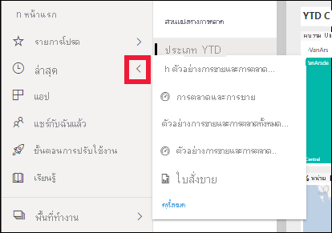

# เริ่มต้นใช้งานด่วน - ทำความรู้จักบริการของ Power BI

[!INCLUDE [power-bi-service-new-look-include](../includes/power-bi-service-new-look-include.md)]

ขณะนี้คุณทราบถึง [พื้นฐานของ Power BI](end-user-basic-concepts.md) แล้ว เรามาดู **บริการของ Power BI** กันบ้าง ตามที่กล่าวไว้ในบทความก่อนหน้านี้ เพื่อนร่วมงานในทีมของคุณอาจใช้เวลาทั้งหมดใน **Power BI Desktop** เพื่อรวมข้อมูลและสร้างรายงาน แดชบอร์ด และแอปสำหรับบุคคลอื่น พวกเขาคือ *นักออกแบบ* ในทางกลับกัน คุณอาจใช้เวลาทั้งหมดของคุณในบริการของ Power BI เพื่อดูและโต้ตอบกับเนื้อหาที่สร้างโดยบุคคลอื่น (ประสบการณ์ **การใช้งาน** ) คุณคือ *ผู้ใช้ทางธุรกิจ* การเริ่มต้นใช้งานด่วนสำหรับ *ผู้ใช้ทางธุรกิจ* 

   
 
## ข้อกำหนดเบื้องต้น

- ถ้าคุณไม่ได้ลงทะเบียน Power BI ให้[ลงทะเบียนรุ่นทดลองใช้ฟรี](https://app.powerbi.com/signupredirect?pbi_source=web)ก่อนที่คุณจะเริ่มต้นใช้งาน

- อ่าน [แนวคิดพื้นฐานเกี่ยวกับบริการของ Power BI](end-user-basic-concepts.md)

- การดูเนื้อหา Power BI (รายงาน แดชบอร์ด แอป) ที่สร้างขึ้นโดย *นักออกแบบ* ต้องการเป็นไปตามหนึ่งในเงื่อนไขต่อไปนี้:
    - สิทธิการใช้งาน Power BI Pro
    - เพื่อให้องค์กรของคุณมีการสมัครใช้งานสำหรับ Power BI Premium และเนื้อหาที่จะใช้ร่วมกันกับคุณจากความจุ Power BI Premium    
    [เรียนรู้เกี่ยวกับสิทธิ์การใช้งานและการสมัครใช้งาน](end-user-license.md)     

    สำหรับวัตถุประสงค์ของการเริ่มต้นใช้งานด่วนนี้ ไม่จำเป็นต้องมีเงื่อนไขใดๆ Microsoft ได้สร้างเนื้อหาตัวอย่างให้คุณโดยตรงจากอินเทอร์เฟซบริการของ Power BI เราจะใช้เนื้อหาตัวอย่างนี้เพื่อเรียนรู้วิธีการของเราในบริการของ Power BI 

## เปิดบริการ Power BI

หากต้องการเริ่มต้น ให้เปิดบริการของ Power BI (app.powerbi.com) 
1. ถ้าบานหน้าต่างการนำทางด้านซ้ายถูกยุบ ให้เลือกไอคอนบานหน้าต่างการนำทาง  เพื่อขยายบานหน้าต่าง 

1. จากมุมล่างซ้าย เลือก **รับข้อมูล** เราจะนำข้อมูลตัวอย่างบางส่วนไปใช้สำหรับการนำเสนอบริการของ Power BI ของเรา มีข้อมูลตัวอย่างทุกชนิดให้คุณได้ค้นหา และในครั้งนี้ เราจะใช้ข้อมูลเกี่ยวกับการตลาดและการขาย 

   

1. หลังจากหน้าจอ **รับข้อมูล** เปิดขึ้น เลือก **ตัวอย่าง**

   

1. เลือก **การขายและการตลาด** > **เชื่อมต่อ** 

   

5. บริการของ Power BI จะติดตั้งตัวอย่างใน **พื้นที่ทำงานของฉัน**  **พื้นที่ทำงานของฉัน** คือ sandbox ส่วนตัวของคุณสำหรับการเรียนรู้และการทดลองใช้  เฉพาะคุณเท่านั้นที่สามารถดูเนื้อหาใน **พื้นที่ทำงานของฉัน** ตัวอย่างประกอบด้วยหนึ่งแดชบอร์ด หนึ่งรายงาน และหนึ่งชุดข้อมูล โดยทั่วไปแล้ว *ผู้ใช้ทางธุรกิจ* จะไม่ได้รับชุดข้อมูล แต่ตัวอย่างนี้ถูกออกแบบมาสำหรับผู้ใช้ทั้งหมด จึงมีชุดข้อมูลรวมอยู่ด้วย

    

    ในฐานะที่เป็น *ผู้ใช้ทางธุรกิจ* เนื้อหาส่วนใหญ่ที่ใช้ร่วมกันกับคุณจะไม่รวมการเข้าถึงโดยตรงไปยังชุดข้อมูลเบื้องต้น เนื่องจากตัวอย่าง Power BI ถูกสร้างขึ้นสำหรับลูกค้า Power BI ทั้งหมด จึงมีการรวมชุดข้อมูลไว้   

    หากต้องการเรียนรู้เพิ่มเติมเกี่ยวกับตัวอย่าง โปรดดู [รับตัวอย่างสำหรับ Power BI](../create-reports/sample-datasets.md)

## ดูเนื้อหา (แดชบอร์ดและรายงาน)
เนื้อหาได้รับการจัดระเบียบภายในบริบทของพื้นที่ทำงาน ผู้ใช้ทางธุรกิจทุกคนมีพื้นที่ทำงานอย่างน้อยหนึ่งแห่ง และเรียกว่า **พื้นที่ทำงานของฉัน** เมื่อเพื่อนร่วมงาน *นักออกแบบ* แชร์เนื้อหากับคุณ คุณมีอาจพื้นที่ทำงานอื่นๆ เพิ่มเติม  ตัวอย่างเช่น ถ้า *นักออกแบบ* กำหนดสิทธิ์ในการเข้าถึงให้กับคุณไปยังพื้นที่ทำงานของพวกเขา พื้นที่ทำงานนั้นจะแสดงในไซต์ Power BI ของคุณ  

**พื้นที่ทำงานของฉัน** จัดเก็บเนื้อหาทั้งหมดที่คุณเป็นเจ้าของและสร้าง ให้คิดว่าเป็น sandbox ส่วนบุคคลของคุณหรือพื้นที่ทำงานสำหรับเนื้อหาของคุณเอง สำหรับ *ผู้ใช้ทางธุรกิจ* Power BI หลายคน **พื้นที่ทำงานของฉัน** ยังว่างเปล่าเพราะงานของคุณไม่เกี่ยวข้องกับการสร้างเนื้อหาใหม่  *ผู้ใช้ทางธุรกิจ* โดยความหมายนั้น ใช้ข้อมูลที่สร้างขึ้นโดยผู้อื่นและใช้ข้อมูลนั้นเพื่อตัดสินใจทางธุรกิจ หากคุณกำลังสร้างเนื้อหา ลองอ่าน [บทความ Power BI สำหรับ *ผู้ออกแบบ*](../index.yml) แทน

พื้นที่ทำงานมีจำนวนมากกว่ารายการของเนื้อหาแบบง่ายอย่างมาก ในหน้านี้ คุณสามารถเรียนรู้มากมายเกี่ยวกับแดชบอร์ดและรายงานของพื้นที่ทำงาน ใช้เวลาสักครู่เพื่อระบุเจ้าของเนื้อหา วันที่รีเฟรชครั้งล่าสุด ความอ่อนไหวของข้อมูล และการประทับรับรอง ถ้ามี เลือก **การดำเนินการเพิ่มเติม (...)** เพื่อแสดงรายการของการดำเนินการสำหรับแดชบอร์ดและรายงาน   

หากต้องการเรียนรู้เพิ่มเติม โปรดดู [พื้นที่ทำงาน](end-user-workspaces.md)

พื้นที่ทำงานเป็นหนึ่งในเส้นทางของข้อมูลของคุณ จากพื้นที่ทำงาน คุณสามารถเปิดแดชบอร์ดหรือรายงานโดยการเลือกจากรายการ  คุณสามารถสร้างรายการโปรดของแดชบอร์ดหรือรายงานได้โดยการวางเมาส์เหนือและเลือกไอคอนรูปดาว ถ้า *นักออกแบบ* ให้ [สิทธิ์การแชร์](end-user-shared-with-me.md) แก่คุณ คุณสามารถแบ่งปันจากที่นี่ได้เช่นกัน 

1. เลือกชื่อแดชบอร์ดเพื่อเปิด แดชบอร์ดคือสิ่งที่ทำให้บริการของ Power BI แตกต่างจาก Power BI Desktop [เรียนรู้เกี่ยวกับแดชบอร์ด](end-user-dashboards.md)

    

2. การดำเนินการที่คุณสามารถทำได้ในแดชบอร์ดจะแสดงอยู่ในแถบเมนูด้านบน    

    

3. วางเมาส์เหนือไทล์แดชบอร์ดและเลือก **ตัวเลือกเพิ่มเติม (...)** เพื่อดูตัวเลือกที่คุณมีสำหรับการโต้ตอบกับไทล์นั้น

    

4. เลือกไทล์แดชบอร์ดเพื่อเปิดรายงานที่ถูกใช้เพื่อสร้างไทล์นั้น รายงานจะเปิดไปยังหน้าที่มีวิชวลที่อยู่บนไทล์นั้น นี่ไง ฉันได้เลือกไทล์แดชบอร์ดด้วยแผนที่ต้นไม้ บริการของ Power BI เปิดหน้ารายงานของ **ประเภท YTD**

    

    รายงานมีหลายส่วน ทางด้านซ้ายคือรายการของหน้ารายงานที่คลิกได้ ด้านบนคือแถบเมนูที่มีการดำเนินการที่คุณสามารถทำได้ในรายงาน  ตัวเลือกที่พร้อมใช้งานจะขึ้นอยู่กับบทบาทและสิทธิ์ของรายงานที่ *นักออกแบบ* มอบหมายให้กับคุณ ทางด้านขวาคือบานหน้าต่าง **ตัวกรอง** และพื้นที่กึ่งกลางคือส่วนของรายงาน เช่นเดียวกันกับแดชบอร์ด มีการดำเนินการที่คุณสามารถใช้สำหรับรายงานทั้งหมด สำหรับแต่ละวิชวล และยังสำหรับแต่ละหน้ารายงาน 

    เรียนรู้เกี่ยวกับรายงาน [รายงาน Power BI](end-user-reports.md)

## การใช้บานหน้าต่างนำทางด้านซ้าย
บานหน้าต่างนำทางจะเป็นประโยชน์มากขึ้นเมื่อเพื่อนร่วมงานแชร์เนื้อหากับคุณ ในส่วนของการเริ่มต้นใช้งานด่วน เราจะวางตัวอย่าง *การขายและการตลาด* ไว้ก่อนและไปดูที่แดชบอร์ดและรายงานที่เป็นของ *ผู้ใช้ทางธุรกิจ* ของ Power BI ผู้มีเนื้อหาที่ใช้ร่วมกันจำนวนมาก

1. **หน้าแรก** คือหน้า landing page เริ่มต้นเมื่อคุณเข้าสู่ระบบบริการของ Power BI หน้าแรกเป็นจุดเริ่มต้นที่ยอดเยี่ยมและเป็นอีกวิธีในการนำทางไปยังเนื้อหาของคุณ เนื้อหาบนหน้าแรกจะถูกจัดเรียงตามรายการโปรด ล่าสุด ที่เปิดบ่อย และความสำคัญ นอกจากนี้หน้าแรกยังแสดงพื้นที่ทำงานและแอปล่าสุดของคุณ เพียงแค่เลือกรายการเพื่อเปิด

    หน้าแรกรวบรวมเครื่องมือค้นหาและเรียงลำดับ บานหน้าต่างการนำทาง และพื้นที่การทำงานพร้อม *การ์ด* ที่คุณสามารถเลือกเพื่อเปิดแดชบอร์ด รายงาน และแอปของคุณเข้าด้วยกัน ในตอนแรก คุณอาจไม่มีการ์ดจำนวนมากบนพื้นที่ทำงานของคุณ แต่จะเปลี่ยนไปเมื่อคุณเริ่มใช้ Power BI กับเพื่อนร่วมงานของคุณ พื้นที่ทำงานของหน้าแรกของคุณจะมีการอัปเดตเนื้อหาที่แนะนำและแหล่งข้อมูลการเรียนรู้ให้ด้วย

   

    เมื่อต้องการเรียนรู้เพิ่มเติม ดู [หน้าแรก Power BI](end-user-home.md)

2. **รายการโปรด** และ **ล่าสุด** มีลูกศร เลือกลูกศรเพื่อดูรายการโปรดห้ารายการ หรือเนื้อหาที่เยี่ยมชมล่าสุดห้ารายการได้อย่างรวดเร็ว จากเมนูลอย ให้เลือกเนื้อหาเพื่อเปิด 

   

    หากต้องการดูรายการโปรดหรือล่าสุดทั้งหมดของคุณ ให้เลือกคำหรือไอคอน รายการเนื้อหาเหล่านี้แสดงรายละเอียดเพิ่มเติมเกี่ยวกับรายงาน แอป และแดชบอร์ด

    

    หากต้องการเรียนรู้เพิ่มเติม ดู [ล่าสุดใน Power BI](end-user-recent.md) และ [รายการโปรดใน Power BI](end-user-recent.md)

4. เลือก **แอป** เพื่อแสดงแอปทั้งหมดที่แชร์กับคุณ หรือที่คุณได้ติดตั้งแล้ว และเลือก **แชร์กับฉัน** เพื่อดูแดชบอร์ดและรายงานที่ได้แชร์กับคุณ เนื่องจากคุณเพิ่งเริ่มต้นใช้บริการของ Power BI พื้นที่เนื้อหาเหล่านี้จะว่างเปล่า 

    เรียนรู้เกี่ยวกับ [แอป](end-user-apps.md) และ [แชร์กับฉัน](end-user-shared-with-me.md)

### ค้นหาและเรียงลำดับเนื้อหา
เมื่อคุณเพิ่งเริ่มใช้บริการ Power BI คุณจะมีเนื้อหาเพียงไม่กี่ชิ้น แต่ในขณะที่เพื่อนร่วมงานเริ่มแบ่งปันเนื้อหากับคุณ และคุณเริ่มดาวน์โหลดแอปคุณอาจจบลงด้วยรายการเนื้อหาที่ยาว นั่นคือเวลาที่คุณจะพบการค้นหาและการเรียงลำดับที่เป็นประโยชน์อย่างยิ่ง

การค้นหาพร้อมใช้งานจากเกือบทุกส่วนของบริการ Power BI เพียงแค่มองหากล่องค้นหาหรือเลือกไอคอนแว่นขยายการค้นหา    

ในเขตข้อมูลการค้นหา ให้พิมพ์ชื่อทั้งหมดหรือบางส่วนของแดชบอร์ด รายงาน สมุดงาน แอป หรือเจ้าของ Power BI ค้นหาเนื้อหาทั้งหมดของคุณ

นอกจากนี้ยังมีหลายวิธีในการเรียงลำดับเนื้อหา วางเมาส์เหนือส่วนหัวของคอลัมน์ และค้นหาลูกศรที่ระบุว่าคอลัมน์สามารถเรียงลำดับได้ ไม่ใช่ทุกคอลัมน์ที่จะสามารถจัดเรียงได้ 

หรือมองหา **ตัวกรอง** การค้นหา ใกล้กับมุมขวาบนของรายการเนื้อหาของคุณ ค้นหาเนื้อหาได้อย่างรวดเร็วโดยการเลือกจากชนิดของเนื้อหา เจ้าของ หรือเขตข้อมูลอื่นๆ ที่พร้อมใช้งาน

เมื่อต้องการเรียนรู้เพิ่มเติม ให้ดู [การนำทางใน Power BI: ค้นหาและจัดเรียง](end-user-search-sort.md)

## ค้นหาเจ้าของ
และเราจะจบการเริ่มต้นใช้งานด่วนนี้ด้วยคำแนะนำที่เป็นประโยชน์ หากคุณมีคำถามเกี่ยวกับแดชบอร์ด รายงาน หรือแอป -- คุณสามารถค้นหาเจ้าของได้ ด้วยการเปิดเนื้อหา ให้เลือกรายการดรอปดาวน์ของชื่อเรื่องเพื่อแสดงเจ้าของ เจ้าของอาจเป็นบุคคลหรือกลุ่ม

## เพิ่มพื้นที่ทรัพยากร
หลังจากที่คุณดำเนินการเริ่มต้นด่วนนี้เสร็จสิ้นแล้ว คุณสามารถลบแดชบอร์ดตัวอย่าง รายงาน และชุดข้อมูลได้หากต้องการ

1. เปิดบริการของ Power BI (app.powerbi.com) และลงชื่อเข้าใช้    
2. เปิดหน้าแรก Power BI เลื่อนลงและเลือก **พื้นที่ทำงานของฉัน**      

3. วางเมาส์เหนือแดชบอร์ด รายงาน หรือชุดข้อมูล และเลือก **ตัวเลือกเพิ่มเติม (...)**  > **ลบ** ทำซ้ำจนกว่าลบรายการทั้งสามออกหมด

    

## ขั้นตอนถัดไป

> [!div class="nextstepaction"]
> [มุมมองการอ่านในบริการของ Power BI](end-user-reading-view.md)
