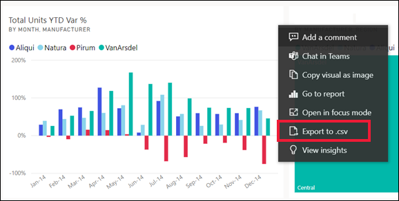
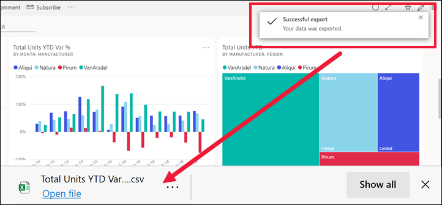
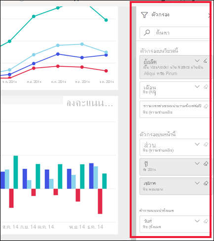
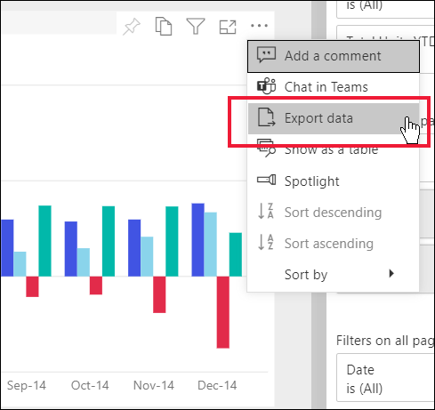
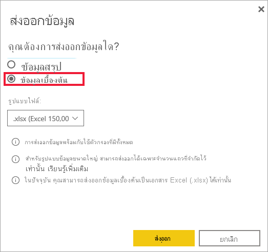
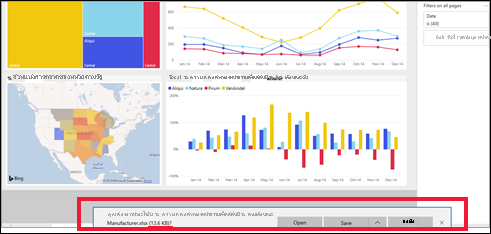

# ส่งออกข้อมูลจากการแสดงผลด้วยภาพExport data from a visual

[!INCLUDE[consumer-appliesto-yyny](../includes/consumer-appliesto-yyny.md)]

ถ้าคุณต้องการดูข้อมูลที่ใช้ในการสร้างการแสดงผลด้วยภาพ [คุณสามารถแสดงข้อมูลนั้นใน Power BI](end-user-show-data.md) หรือส่งออกข้อมูลนั้นไปยัง Excel ได้To see the data that's used to create a visual, [you can display that data in Power BI](end-user-show-data.md), or export it to Excel. ตัวเลือกในการส่งออกข้อมูลต้องมีประเภทเฉพาะบางอย่างหรือสิทธิ์การใช้งาน และแก้ไขสิทธิ์ในชุดข้อมูลและรายงานThe option to export the data requires a certain type or license and edit permissions to the content. หากคุณไม่สามารถส่งออกได้ ให้ตรวจสอบกับผู้ดูแลระบบ Power BI หรือฝ่าย IT ของคุณIf you can't export, check with your Power BI administrator or IT help desk. 

การส่งออกข้อมูลจำเป็นต้องมีสิทธิ์การใช้งาน Power BI Pro หรือสำหรับแดชบอร์ดหรือรายงานที่จะใช้ร่วมกันกับคุณโดยใช้ความจุพรีเมียมExporting data requires a Power BI Pro license, or for the dashboard or report to be shared with you using Premium capacity. หากต้องการเรียนรู้เพิ่มเติม โปรดดูหัวข้อ[ฉันมีสิทธิ์การใช้งานประเภทใดบ้าง](end-user-license.md)To learn more, see [Which license do I have?](end-user-license.md). ผู้เขียนรายงานอาจปิดการส่งออกข้อมูลสำหรับรายงานThe report author may have turned off data export for a report. ถ้าคุณไม่สามารถส่งออกข้อมูลได ้ให้ตรวจสอบกับผู้สร้างรายงานIf you can't export data, check with the report author.

## จากการแสดงผลด้วยภาพบนแดชบอร์ด Power BIFrom a visual on a Power BI dashboard

1. เริ่มต้นที่จากแดชบอร์ด Power BIStart on a Power BI dashboard. ในส่วนนี้เราใช้แดชบอร์ดจากแอป \***ตัวอย่างการตลาดและการขาย**Here we're using the dashboard from the \***Marketing and sales sample** _ app. คุณสามารถ[ดาวน์โหลดแอปนี้ได้จาก AppSource.com](https://appsource.microsoft.com/en-us/product/power-bi/microsoft-retail-analysis-sample.salesandmarketingsample
)You can [download this app from AppSource.com](https://appsource.microsoft.com/en-us/product/power-bi/microsoft-retail-analysis-sample.salesandmarketingsample
).

    

2. วางเมาส์เหนือการแสดงผลด้วยภาพเพื่อแสดง_ *ตัวเลือกเพิ่มเติม*\* (...) แล้วคลิกเพื่อแสดงเมนูการดำเนินการHover over a visual to reveal _ *More options*\* (...) and click to display the action menu.

    

3. เลือก **ส่งออกไปยัง .csvl**Select  **Export to .csv**.

4. สิ่งที่จะเกิดขึ้นต่อไปนั้นขึ้นอยู่กับเบราว์เซอร์ที่คุณกำลังใช้What happens next depends on which browser you're using. คุณอาจได้รับการแจ้งเตือนให้บันทึกไฟล์หรือคุณอาจเห็นลิงก์ไปยังไฟล์ที่ส่งออกอยู่ที่ด้านล่างของเบราว์เซอร์You may be prompted to save the file or you may see a link to the exported file at the bottom of the browser. ตามค่าเริ่มต้น การส่งออกของคุณจะถูกบันทึกไว้ในโฟลเดอร์ดาวน์โหลดในเครื่องของคุณBy default, your export is saved to your local Downloads folder. 

    

5. เปิดไฟล์ใน ExcelOpen the file in Excel. 

    > [!NOTE]
    > ถ้าคุณไม่มีสิทธิ์ในการเข้าถึงข้อมูล คุณจะไม่สามารถส่งออกหรือเปิดใน Excel ได้If you don't have permissions to the data, you won't be able to export or open in Excel.  

    

## จากการแสดงผลด้วยภาพในรายงานFrom a visual in a report
คุณสามารถส่งออกข้อมูลจากการแสดงผลด้วยภาพในรายงานที่มีรูปแบบ .csv หรือ .xlsx (Excel) ได้You can export data from a visual in a report as .csv or .xlsx (Excel) format. 

1. บนแดชบอร์ด ให้เลือกไทล์เพื่อเปิดรายงานเบื้องต้นOn a dashboard, select a tile to open the underlying report.  ในตัวอย่างนี้ เรากำลังเลือกการแสดงผลด้วยภาพเดียวกันกับที่แสดงข้างต้น *% ความแตกต่างของผลรวมหน่วยตั้งแต่ต้นปี*In this example, we're selecting the same visual as above, *Total Units YTD Var %*. 

    

    เนื่องจากไทล์นี้สร้างจากรายงาน *ตัวอย่างการขายและการตลาด* ซึ่งเป็นรายงานที่เปิดอยู่Since this tile was created from the *Sales and Marketing Sample* report, that is the report that opens. และจะเปิดไปยังหน้าที่มีการแสดงผลด้วยภาพของไทล์ที่เลือกไว้And, it opens to the page that contains the selected tile visual. 

2. เลือกวิชวลในรายงานSelect the visual in the report. สังเกตบานหน้าต่าง **ตัวกรอง** ทางด้านขวาNotice the **Filters** pane to the right. การแสดงผลด้วยภาพนี้มีการใช้ตัวกรองThis visual has filters applied. หากต้องการเรียนรู้เพิ่มเติมเกี่ยวกับตัวกรอง ให้ดูที่ [ใช้ตัวกรองในรายงาน](end-user-report-filter.md)To learn more about filters, see [Use filters in a report](end-user-report-filter.md).

    

3. เลือก **ตัวเลือกเพิ่มเติม (...)** จากมุมขวาบนของการแสดงผลข้อมูลด้วยภาพSelect **More options (...)** from the upper right corner of the visualization. เลือก **ส่งออกข้อมูล**Choose **Export data**.

    

4. คุณจะเห็นตัวเลือกในการส่งออกข้อมูลสรุปหรือข้อมูลเบื้องต้นYou'll see options to export Summarized data or Underlying data. หากคุณใช้แอป *ตัวอย่างการขายและการตลาด\*\*\*ข้อมูลเบื้องต้น*\* จะถูกปิดใช้งานIf you're using the *Sales and marketing sample* app, **Underlying data** will be disabled. แต่คุณอาจพบรายงานที่มีการเปิดใช้งานทั้งสองตัวเลือกBut you may find reports where both options are enabled. ต่อไปนี้คือคำอธิบายความแตกต่างHere's an explanation of the difference.

    **ข้อมูลสรุป**: เลือกตัวเลือกนี้ถ้าคุณต้องการส่งออกข้อมูลสำหรับสิ่งที่คุณเห็นในวิชวลอย่างเป็นปัจจุบัน**Summarized data**: select this option if you want to export data for what you currently see in the visual.  การส่งออกชนิดนี้แสดงเฉพาะข้อมูลที่ใช้สร้างสถานะปัจจุบันของวิชวลThis type of export shows you only the data that was used to create the current state of the visual. หากการแสดงผลด้วยภาพมีการใช้ตัวกรอง ข้อมูลที่คุณส่งออกก็จะถูกกรองด้วยเช่นกันIf the visual has filters applied, then the data you export will also be filtered. ตัวอย่างเช่น สำหรับการแสดงผลด้วยภาพนี้ การส่งออกของคุณจะรวมเฉพาะข้อมูลสำหรับปี 2014 และภาคกลาง รวมถึงข้อมูลสำหรับผู้ผลิตสี่รายเท่านั้น: VanArsdel, Natura, Aliqui และ PirumFor example, for this visual, your export will include only data for 2014 and the central region, and only data for four of the manufacturers: VanArsdel, Natura, Aliqui, and Pirum. หากการแสดงผลด้วยภาพของคุณมีการรวม (ผลรวม ค่าเฉลี่ย เป็นต้น) การส่งออกจะถูกรวมเข้าไว้ด้วยIf your visual has aggregates (sum, average, and so on), the export will also be aggregated. 
  

    **ข้อมูลเบื้องต้น**: เลือกตัวเลือกนี้ หากคุณต้องการส่งออกข้อมูลสำหรับสิ่งที่คุณเห็นในการแสดงผลด้วยภาพ **เสริมด้วย** ข้อมูลเพิ่มเติมจากชุดข้อมูลเบื้องต้น**Underlying data**: select this option if you want to export data for what you see in the visual **plus** additional data from the underlying dataset.  ซึ่งอาจรวมถึงข้อมูลที่มีอยู่ในชุดข้อมูล แต่ไม่ได้ใช้ในการแสดงผลด้วยภาพThis may include data that is contained in the dataset but not used in the visual. หากการแสดงผลด้วยภาพมีการใช้ตัวกรอง ข้อมูลที่คุณส่งออกก็จะถูกกรองด้วยเช่นกันIf the visual has filters applied, then the data you export will also be filtered.  หากวิชวลของคุณมีการรวม (ผลรวม เฉลี่ย เป็นต้น) การส่งออกจะลบการรวม; ทำให้ข้อมูลแบนราบเป็นหลักIf your visual has aggregates (sum, average, etc.), the export will remove the aggregation; essentially flattening the data. 

    

5. สิ่งที่จะเกิดขึ้นต่อไปนั้นขึ้นอยู่กับเบราว์เซอร์ที่คุณกำลังใช้What happens next depends on which browser you're using. คุณอาจได้รับการแจ้งเตือนให้บันทึกไฟล์ หรือคุณอาจเห็นลิงก์ไปยังไฟล์ที่ส่งออกอยู่ที่ด้านล่างของเบราว์เซอร์You might be prompted to save the file or you might see a link to the exported file at the bottom of the browser. หากคุณกำลังใช้แอป Power BI ใน Microsoft Teams ไฟล์ที่ส่งออกของคุณจะถูกบันทึกไว้ในโฟลเดอร์ดาวน์โหลดในเครื่องของคุณIf you're using the Power BI app in Microsoft Teams, your exported file is saved in your local Downloads folder. 

    

    > [!NOTE]
    > ถ้าคุณไม่มีสิทธิ์ในการเข้าถึงข้อมูล คุณจะไม่สามารถส่งออกหรือเปิดใน Excel ได้If you don't have permissions to the data, you won't be able to export or open in Excel.  

6. เปิดไฟล์ใน ExcelOpen the file in Excel. เปรียบเทียบจำนวนข้อมูลที่ส่งออกกับข้อมูลที่เราส่งออกจากการแสดงผลด้วยภาพเดียวกันบนแดชบอร์ดCompare the amount of data exported to the data we exported from the same visual on the dashboard. ความแตกต่างก็คือการส่งออกนี้รวม **ข้อมูลเบื้องต้น** ด้วยThe difference is that this export includes **Underlying data**. 

    

## ขั้นตอนถัดไปNext steps

[แสดงข้อมูลที่ใช้เพื่อสร้างวิชวลDisplay the data used to create a visual](end-user-show-data.md)