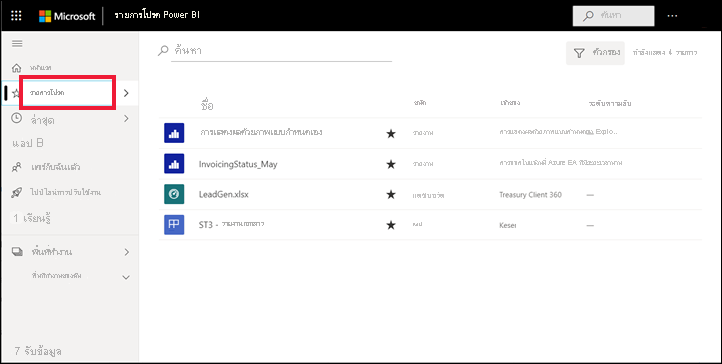
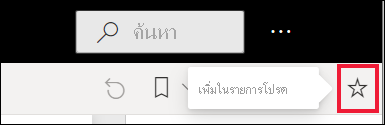
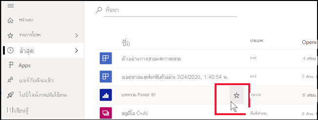
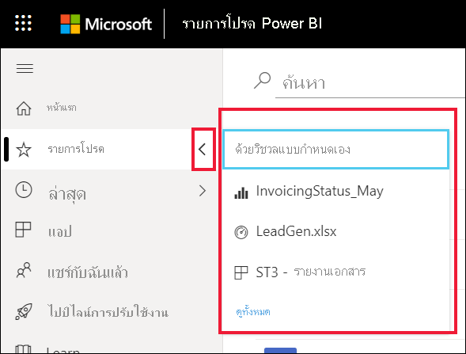
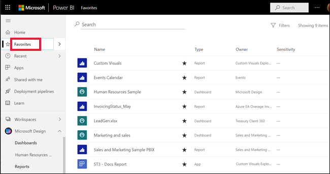
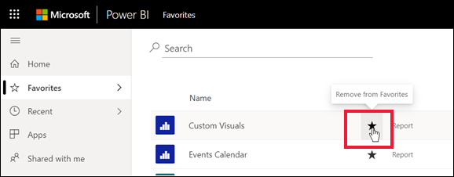

# เพิ่มรายการโปรด แดชบอร์ด รายงาน และแอปใน Power BI serviceFavorite dashboards, reports, and apps in the Power BI service

[!INCLUDE[consumer-appliesto-yyny](../includes/consumer-appliesto-yyny.md)]

เมื่อคุณกำหนดเนื้อหาให้เป็น *รายการโปรด* แล้ว คุณจะสามารถเข้าถึงเนื้อหานั้นได้อย่างรวดเร็วจากรายการเนื้อหาของ **รายการโปรด** และจาก > **รายการโปรด + รายการที่ใช้บ่อย** ที่ **่หน้าแรกของ Power BI**When you make content a *favorite*, you can access it quickly from the **Favorites** content list and from Power BI **Home** > **Favorites + frequents**. โดยปกติแล้วรายการโปรดคือเนื้อหาที่คุณเยี่ยมชมบ่อยที่สุดและระบุด้วยดาวที่มีสีFavorites are typically content that you visit most often and are identified with a filled star.

   

   

## เพิ่มแดชบอร์ด หรือรายงานเป็นแบบรายการโปรดAdd a dashboard or report as a favorite

1. เปิดแดชบอร์ดหรือรายงานที่คุณใช้บ่อยOpen a dashboard or report that you use often. แม้แต่เนื้อหาที่ถูกแชร์กับคุณสามารถเป็นรายการโปรดได้Even content that has been shared with you can be a favorite.

2. แถบเมนูด้านบนของบริการของ Power BI ให้เลือก **รายการโปรด** หรือไอคอนFrom the upper menu bar of the Power BI service, select **Favorite** or the star  icon.
   
   
   
   และคุณยังสามารถกำหนดแดชบอร์ดหรือรายงานให้เป็นรายการโปรดได้จากทุกที่ที่คุณเห็นไอคอนรูปดาว เช่น หน้าแรก ล่าสุด แอป และแชร์กับฉันYou can also favorite a dashboard or report from anywhere you see the star icon, such as Home, Recent, Apps, and Shared with me. 
   
   

## เพิ่มแอปเป็นแบบรายการโปรดAdd an app as a favorite

1. จากบานหน้าต่างนำทาง ให้เลือก **Apps**From the nav pane, select **Apps**.

   

2. เลื่อนเคอร์เซอร์เหนือแอปเมื่อต้องแสดงรายละเอียดเพิ่มเติมHover over an app to display more detail. เลือกกรูปดาวSelect the star  ไอคอนการตั้งค่าเป็นรายการโปรดicon to set as a favorite.
   
   

## ทำงานกับรายการโปรดWork with favorites
1. เมื่อต้องการเข้าไปยังรายการโปรดของคุณ ให้เลือกลูกศรลอยทางด้านขวาของ **รายการโปรด**To access your favorites, select the flyout arrow to the right of **Favorites**. จากที่นี่ คุณสามารถเลือกเปิดรายการโปรดFrom here, you can select a favorite to open it. มากกว่าห้ารายการโปรดจะอยู่ในรายการตามตัวอักษรUp to five favorites are listed alphabetically. ถ้าคุณมีมากกว่าห้า ให้เลือก **ดูทั้งหมด** เพื่อเปิดรายการเนื้อหาของรายการโปรดIf you have more than five, select **See all** to open the favorites content list. 
   
   
2. หากต้องการดูเนื้อหาทั้งหมดที่คุณเพิ่มไว้ในรายการโปรด ในบานหน้าต่างนำทาง ให้เลือก **รายการโปรด** หรือTo see all the content that you've added as favorites, in the nav pane, select **Favorites** or the Favorites  ไอคอนicon. 
   
    
   
   จากจุดนี้ คุณสามารถดำเนินการต่อไปได้From here, you can take action. คุณสามารถเปิดรายการโปรด ระบุตัวผู้ดูแลและแชร์รายการโปรดกับเพื่อนร่วมงานของคุณYou can open a favorite, identify owners, and even share favorites with your colleagues.

## ยกเลิกเนื้อหาโปรดUnfavorite content
หากคุณไม่ได้ใช้รายงานบ่อยเท่าที่เคย สามารถยกเลิกรายการโปรดนี้ได้If you no longer use a report as often as you used to, you can unfavorite it. เมื่อคุณยกเลิกเนื้อหาโปรด มันจะถูกเอาออกจากรายการโปรดของคุณ แต่ไม่ใชออกจาก Power BIWhen you unfavorite content, it's removed from your Favorites list but not from Power BI.

1. ในบานหน้าต่างนำทาง ให้เลือก **รายการโปรด** เพื่อเปิดจอ **รายการโปรด**In the nav pane, select **Favorites** to open the **Favorites** screen.
   
   
2. เลือกรูปดาวสีดำซึ่งอยู่ถัดจากเนื้อหาที่คุณต้องการยกเลิกรายการโปรดSelect the black star next to the content you want to unfavorite.

> [!NOTE]
> คุณยังสามารถยกเลิกแดชบอร์ดรายการโปรด ส่งรายงาน หรือแอปได้เช่นกันYou can also unfavorite a dashboard, a report, or an app. เพียงแค่เปิดและเลือกดาวสีดำเพื่อเปลี่ยนกลับเป็นดาวสีขาวJust open and select the black star to turn it back to a white star. 
> 
> 
## ข้อจำกัดและข้อควรพิจารณาLimitations and considerations
ในขณะนี้ คุณสามารถกำหนดแอปให้เป็นรายการโปรดได้ ซึ่งจะเป็นการกำหนดรายงานและแดชบอร์ดทั้งหมดสำหรับแอปนั้นให้เป็นรายการโปรดโดยอัตโนมัติAt the current time, you can favorite an app and this automatically favorites all the reports and dashboards for that app. แต่คุณจะไม่สามารถกำหนดรายงานแอปหรือแดชบอร์ดให้เป็นรายการโปรดแยกแต่ละรายการได้It isn't possible to favorite individual app reports or dashboards. 

## ขั้นตอนถัดไปNext steps
- [Power BI: แนวคิดพื้นฐานPower BI: Basic concepts](end-user-basic-concepts.md)
- มีคำถามเพิ่มเติมหรือไม่More questions? ลองไปที่ [ชุมชน Power BI](https://community.powerbi.com/)Try the [Power BI Community](https://community.powerbi.com/).

