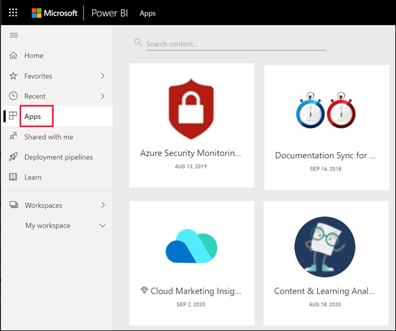

# เพิ่มรายการโปรด แดชบอร์ด รายงาน และแอปใน Power BI service

[!INCLUDE[consumer-appliesto-yyny](../includes/consumer-appliesto-yyny.md)]

เมื่อคุณกำหนดเนื้อหาให้เป็น *รายการโปรด* แล้ว คุณจะสามารถเข้าถึงเนื้อหานั้นได้อย่างรวดเร็วจากรายการเนื้อหาของ **รายการโปรด** และจาก > **รายการโปรด + รายการที่ใช้บ่อย** ที่ **่หน้าแรกของ Power BI** โดยปกติแล้วรายการโปรดคือเนื้อหาที่คุณเยี่ยมชมบ่อยที่สุดและระบุด้วยดาวที่มีสี

   

   

## เพิ่มแดชบอร์ด หรือรายงานเป็นแบบรายการโปรด

1. เปิดแดชบอร์ดหรือรายงานที่คุณใช้บ่อย แม้แต่เนื้อหาที่ถูกแชร์กับคุณสามารถเป็นรายการโปรดได้

2. แถบเมนูด้านบนของบริการของ Power BI ให้เลือก **รายการโปรด** หรือไอคอน
   
   
   
   และคุณยังสามารถกำหนดแดชบอร์ดหรือรายงานให้เป็นรายการโปรดได้จากทุกที่ที่คุณเห็นไอคอนรูปดาว เช่น หน้าแรก ล่าสุด แอป และแชร์กับฉัน 
   
   

## เพิ่มแอปเป็นแบบรายการโปรด

1. จากบานหน้าต่างนำทาง ให้เลือก **Apps**

   

2. เลื่อนเคอร์เซอร์เหนือแอปเมื่อต้องแสดงรายละเอียดเพิ่มเติม เลือกกรูปดาว  ไอคอนการตั้งค่าเป็นรายการโปรด
   
   

## ทำงานกับรายการโปรด
1. เมื่อต้องการเข้าไปยังรายการโปรดของคุณ ให้เลือกลูกศรลอยทางด้านขวาของ **รายการโปรด** จากที่นี่ คุณสามารถเลือกเปิดรายการโปรด มากกว่าห้ารายการโปรดจะอยู่ในรายการตามตัวอักษร ถ้าคุณมีมากกว่าห้า ให้เลือก **ดูทั้งหมด** เพื่อเปิดรายการเนื้อหาของรายการโปรด 
   
   
2. หากต้องการดูเนื้อหาทั้งหมดที่คุณเพิ่มไว้ในรายการโปรด ในบานหน้าต่างนำทาง ให้เลือก **รายการโปรด** หรือ ไอคอน 
   
    
   
   จากจุดนี้ คุณสามารถดำเนินการต่อไปได้ คุณสามารถเปิดรายการโปรด ระบุตัวผู้ดูแลและแชร์รายการโปรดกับเพื่อนร่วมงานของคุณ

## ยกเลิกเนื้อหาโปรด
หากคุณไม่ได้ใช้รายงานบ่อยเท่าที่เคย สามารถยกเลิกรายการโปรดนี้ได้ เมื่อคุณยกเลิกเนื้อหาโปรด มันจะถูกเอาออกจากรายการโปรดของคุณ แต่ไม่ใชออกจาก Power BI

1. ในบานหน้าต่างนำทาง ให้เลือก **รายการโปรด** เพื่อเปิดจอ **รายการโปรด**
   
   
2. เลือกรูปดาวสีดำซึ่งอยู่ถัดจากเนื้อหาที่คุณต้องการยกเลิกรายการโปรด

> [!NOTE]
> คุณยังสามารถยกเลิกแดชบอร์ดรายการโปรด ส่งรายงาน หรือแอปได้เช่นกัน เพียงแค่เปิดและเลือกดาวสีดำเพื่อเปลี่ยนกลับเป็นดาวสีขาว 
> 
> 
## ข้อจำกัดและข้อควรพิจารณา
ในขณะนี้ คุณสามารถกำหนดแอปให้เป็นรายการโปรดได้ ซึ่งจะเป็นการกำหนดรายงานและแดชบอร์ดทั้งหมดสำหรับแอปนั้นให้เป็นรายการโปรดโดยอัตโนมัติ แต่คุณจะไม่สามารถกำหนดรายงานแอปหรือแดชบอร์ดให้เป็นรายการโปรดแยกแต่ละรายการได้ 

## ขั้นตอนถัดไป
- [Power BI: แนวคิดพื้นฐาน](end-user-basic-concepts.md)
- มีคำถามเพิ่มเติมหรือไม่ ลองไปที่ [ชุมชน Power BI](https://community.powerbi.com/)

