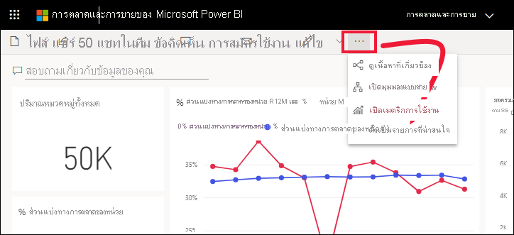
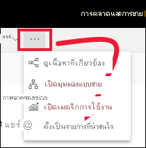
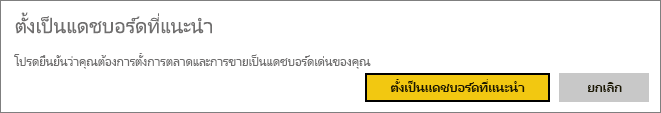
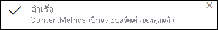
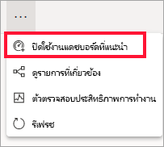

# แดชบอร์ดแนะนำใน Power BI serviceFeatured dashboards in the Power BI service

[!INCLUDE [power-bi-service-new-look-include](../includes/power-bi-service-new-look-include.md)]

พวกเราหลายคนมีแดชบอร์ดหนึ่งที่เราเยี่ยมชมมากกว่าผู้อื่นMany of us have one dashboard that we visit more than any others. อาจเป็นแดชบอร์ดที่เราใช้เพื่อรองรับธุรกิจของเราIt might be the dashboard we use to run our business. หรืออาจเป็นแดชบอร์ดที่ประกอบด้วยการรวมของไทล์จากรายงานและแดชบอร์ดมากมายOr, it might be a dashboard that contains an aggregation of tiles from many different dashboards and reports.

## สร้างแดชบอร์ดแนะนำCreate a featured dashboard
เมื่อคุณตั้งค่าแดชบอร์ดไว้เป็น*เรื่องเด่น* ทุกครั้งที่คุณเปิดบริการของ Power BI แดชบอร์ดนั้นจะเปิดขึ้นพร้อมกับการแสดงแดชบอร์ดนั้นขึ้นมาWhen you set a dashboard as *featured*, each time you open the Power BI service, it opens with that dashboard displayed. 

นอกจากนี้คุณสามารถเลือกแดชบอร์ดสัก และตั้งค่าเหล่านั้นเป็นรายการโปรดYou can also select a few dashboards and set them as favorites. ดู[แดชบอร์ดโปรด](end-user-favorite.md)See [Dashboard favorites](end-user-favorite.md).

ถ้าคุณยังไม่ได้ตั้งค่าแดชบอร์ดเด่น Power BI จะเปิดแดชบอร์ดล่าสุดที่คุณใช้หรือ**หน้าแรก**ของ Power BIIf you haven't set a featured dashboard, Power BI opens to the last dashboard you used or to Power BI **Home**. 

### กำหนดให้นำเสนอแดชบอร์ดSet a dashboard as featured

1. เปิดแดชบอร์ดที่คุณต้องการนำเสนอOpen the dashboard that you want to set as featured. 
2. ในแถบเมนูด้านบนสุด เลือก**ตัวเลือกเพิ่มเติม** (...) แล้วเลือก**ตั้งเป็นรายการที่แนะนำ**On the top menu bar, select **More options** (...) and select **Set as featured**. 
   
    
3. ยืนยันการเลือกของคุณConfirm your selection.
   
    

## เปลี่ยนแดชบอร์ดแนะนำChange the featured dashboard
ถ้าคุณเปลี่ยนใจในภายหลัง คุณสามารถตั้งแดชบอร์ดใหมให้่เป็นแดชบอร์ดแนะนำIf you change your mind later, you can set a new dashboard as the featured dashboard. เลิกแดชบอร์ดไม่ลบออกจาก Power BIUnfeaturing a dashboard doesn't remove it from Power BI. 

1. ทำตามขั้นตอนที่ 1 และ 2 ก่อนหน้าFollow the previous steps 1 and 2.
   
2. เลือก **กำหนดเป็นแดชบอร์ดที่นำเสนอ**Select **Set as featured dashboard**. 
   
    

## ลบแดชบอร์ดแนะนำRemove the featured dashboard
ถ้าคุณตัดสินใจว่า คุณไม่ต้องการแดชบอร์ดใดๆ เมื่อต้องได้รับการมอบหมายเป็นแบบี่แนะนำ นี่คือวิธีการยกเลิกการแนะนำแดชบอร์ดIf you decide that you don't want any dashboard to be designated as featured, here's how to unfeature a dashboard.

1. เปิดแดชบอร์ดที่นำเสนอในปัจจุบันOpen the currently featured dashboard.
2. ในแถบเมนูด้านบนสุด เลือก**ตัวเลือกเพิ่มเติม** (...) แล้วเลือก **ปิดใช้งานรายการที่แนะนำ**On the top menu bar, select **More options** (...) and select **Disable featured**.

    
   
## ขั้นตอนถัดไปNext steps
- [เพิ่มแดชบอร์ดรายการโปรดFavorite a dashboard](end-user-favorite.md)    
- มีคำถามเพิ่มเติมหรือไม่More questions? ลองไปที่ [ชุมชน Power BI](https://community.powerbi.com/)Try the [Power BI Community](https://community.powerbi.com/).

