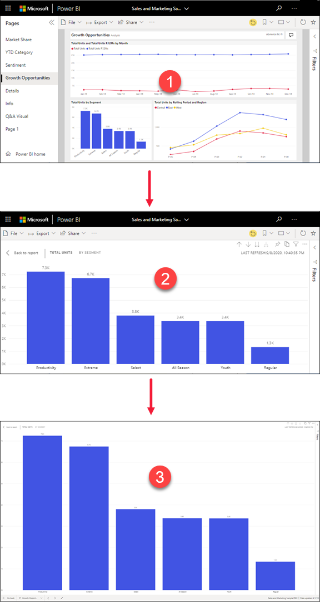
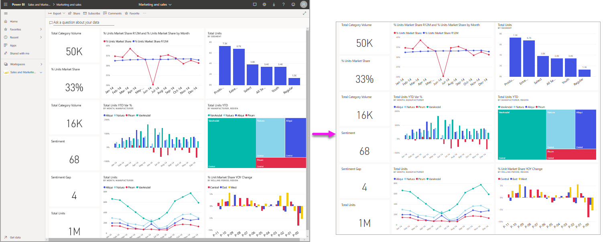
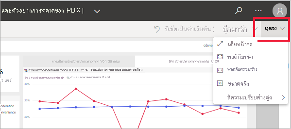
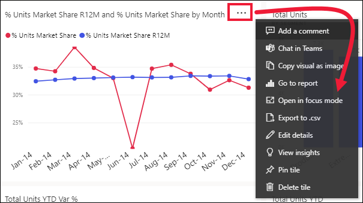
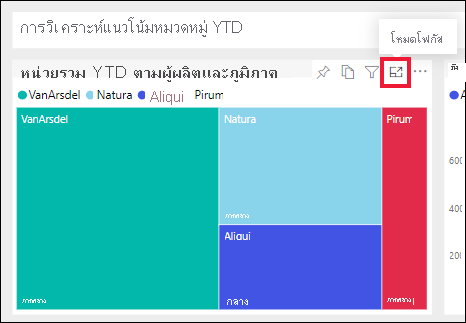
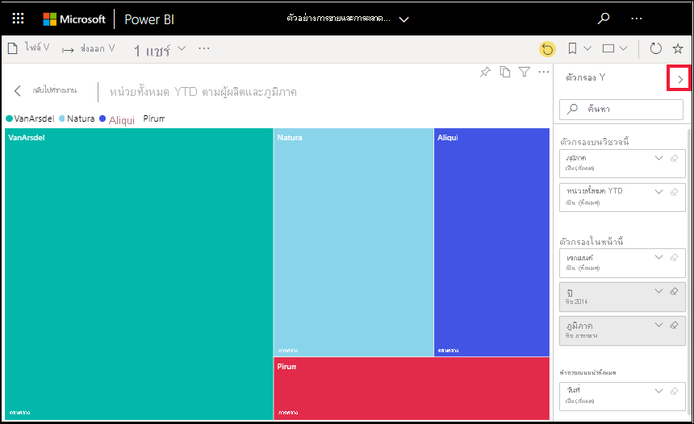
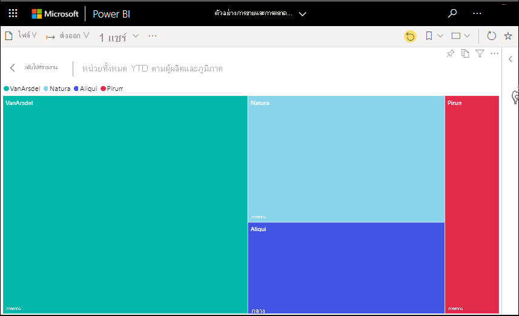
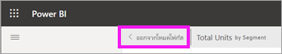
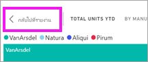

# แสดงเนื้อหาในรายละเอียดที่มากขึ้น: โหมดโฟกัสและโหมดเต็มหน้าจอ

[!INCLUDE [consumer-appliesto-yynn](../includes/consumer-appliesto-yynn.md)]

<iframe width="560" height="315" src="https://www.youtube.com/embed/dtdLul6otYE" frameborder="0" allowfullscreen></iframe>

โหมดโฟกัสและโหมดเต็มหน้าจอเป็นสองวิธีที่ใช้ดูรายละเอียดที่มากขึ้นในวิชวล รายงานและแดชบอร์ด  ความแตกต่างหลักระหว่างสองโหมดนี้คือ โหมดเต็มหน้าจอจะเอาแผงทั้งหมดที่อยู่รอบเนื้อหาออกไป ในขณะที่โหมดโฟกัสจะให้คุณยังโต้ตอบกับวิชวลของคุณได้ มาดูความเหมือนและความต่างให้มากกว่านี้กัน  

|เนื้อหา    | โหมดโฟกัส  |โหมดเต็มหน้าจอ  |
|---------|---------|----------------------|
|แดชบอร์ด     |   ทำไม่ได้     | ใช่ |
|หน้ารายงาน   | ทำไม่ได้  | ใช่|
|ส่วนการแสดงผลรายงาน | ใช่    | ใช่ |
|แดชบอร์ดไทล์ | ใช่    | ทำไม่ได้ |
|มือถือ Windows 10 | ทำไม่ได้ | ใช่ |

ในตัวอย่างด้านล่างนี้ เราได้เริ่มต้นด้วยรายงาน (1) เปิดวิชวลหนึ่งวิชวลในโหมดโฟกัส (2) จากนั้นเปิดวิชวลเดียวกันในโหมดเต็มหน้าจอ (3) 

## เวลาที่ต้องใช้โหมดเต็มหน้าจอ

แสดงเนื้อหาบริการของ Power BI ของคุณ (แดชบอร์ด, หน้ารายงาน และวิชวล) โดยไม่มีเมนูและบานหน้าต่างนำทางรบกวน  คุณสามารถดูในมุมมองไม่เปลี่ยนได้แบบเต็มรูปแบบเนื้อหาของคุณได้อย่างรวดเร็ว ตลอดเวลา ซึ่งในบางครั้งจะเรียกว่าโหมดโทรทัศน์   

ถ้าคุณกำลังใช้ Power BI บนมือถือ [หน้าจอแบบเต็มพร้อมใช้งานสำหรับแอป Windows 10 สำหรับอุปกรณ์เคลื่อนที่](./mobile/mobile-windows-10-app-presentation-mode.md) 

การใช้งานบางอย่างในโหมดเต็มหน้าจอเช่น

* นำเสนอแดชบอร์ด วิชวล หรือรายงานการประชุมหรือการประชุมของคุณ
* แสดงในที่ทำงานบนหน้าจอขนาดใหญ่แบบเฉพาะหรือใช้เครื่องฉายภาพ
* การดูบนหน้าจอขนาดเล็ก
* การตรวจทานในโหมดล็อก คุณสามารถสัมผัสหน้าจอหรือใช้เมาส์เหนือไทล์โดยไม่ต้องเปิดรายงานหรือแดชบอร์ดพื้นฐาน

## ต้องใช้โหมดโฟกัสเมื่อใด

โหมด***โฟกัส** _ จะให้คุณได้ขยาย (ป๊อปเอาต์) วิชวลหรือไทล์เพื่อดูรายละเอียดที่มากขึ้น  บางทีคุณอาจมีแดชบอร์ดหรือรายงานที่เนื้อหาค่อนข้างจะเบียดเสียด และคุณต้องการขยายวิชวลเพียงวิชวลเดียว  การใช้งานโหมดโฟกัสจะเหมาะสมที่สุด  

ขณะที่อยู่ในโหมดโฟกัส *ผู้ใช้ธุรกิจของ Power BI _ จะสามารถโต้ตอบกับตัวกรองที่ใช้งานเมื่อสร้างภาพนี้ขึ้นมาได้  ในบริการของ Power BI คุณสามารถใช้โหมดโฟกัสกับแดชบอร์ดไทล์หรือการแสดงผลด้วยภาพของรายงานได้

## การทำงานในโหมดเต็มหน้าจอ

โหมดเต็มหน้าจอพร้อมใช้งานสำหรับแดชบอร์ด หน้ารายงาน และรายงานวิชวล 

- ในการเปิดแดชบอร์ดในโหมดเต็มหน้าจอ ให้เลือกไอคอนเต็มหน้าจอ  จากแถบเมนูด้านบน 

- ในการเปิดหน้ารายงานในโหมดเต็มหน้าจอ ให้เลือก **มุมมอง** > **เต็มหน้าจอ**

    

- ในการดูวิชวลในโหมดเต็มหน้าจอ ก่อนอื่นให้เปิดในโหมดโฟกัส จากนั้นเลือก **มุมมอง** > **เต็มหน้าจอ**  

เนื้อหาที่คุณเลือกจะเต็มทั้งหน้าจอ เมื่อคุณอยู่ในโหมดเต็มหน้าจอ ให้เลือกการทำงานโดยใช้แถบเมนูที่ด้านบนและด้านล่าง (รายงาน) หรือเมนูที่ปรากฏขึ้นเมื่อคุณย้ายเคอร์เซอร์ (แดชบอร์ดและวิชวล) ของคุณ และเนื่องจากโหมดเต็มหน้าจอจะพร้อมให้ใช้งานกับเนื้อหาที่หลากหลาย ดังนั้น ตัวเลือกการทำงานอาจแตกต่างไปได้   

  * ใช้ปุ่ม **กลับ** **ย้อนกลับ** หรือ **กลับไปที่รายงาน** เพื่อย้อนกลับไปยังหน้าก่อนหน้าในเบราว์เซอร์ของคุณ ถ้าหน้าก่อนหน้าเป็นหน้า Power BI มันจะแสดงในโหมดเต็มหน้าจอเช่นกัน  โหมดเต็มหน้าจอจะยังคงอยู่จนกว่าคุณออกไป

  *     
    ให้ใช้ปุ่ม **จัดให้พอดีกับหน้าจอ** เพื่อแสดงแดชบอร์ดของคุณให้มีขนาดใหญ่ที่สุดที่เป็นไปได้ โดยไม่ต้องปรับแถบเลื่อน  

    

  *        
    ในบางครั้งคุณไม่สนใจแถบเลื่อน แต่ต้องการให้แดชบอร์ดเติมความกว้างของช่องว่างที่พร้อมใช้งาน ให้เลือกปุ่ม **ให้พอดีกับความกว้าง**    

    

  *        
    ในรายงานแบบเต็มหน้าจอ ให้ใช้ลูกศรเหล่านี้เพื่อย้ายไปมาระหว่างหน้าในรายงาน    
  *      
  เพื่อออกจากโหมดเต็มหน้าจอ ให้เลือกไอคอน **จบการทำงานแบบเต็มหน้าจอ**

      

## การทำงานในโหมดโฟกัส

โหมดโฟกัสพร้อมใช้งานสำหรับแดชบอร์ด ไทล์ และวิชวลรายงาน 

- ในการเปิดไทล์แดชบอร์ดในโหมดโฟกัส ให้วางเมาส์เหนือไทล์แดชบอร์ดหรือวิชวลของรายงาน เลือก **ตัวเลือกเพิ่มเติม** (...) แล้วเลือก **เปิดในโหมดโฟกัส**

    .. 

- ในการเปิดวิชวลรายงานในโหมดโฟกัส ให้เลื่อนเคอร์เซอร์เหนือวิชวล และเลือกไอคอน **โหมดโฟกัส**  

   

การแสดงภาพเปิดขึ้นและเติมเต็มทั้งผืนผ้าใบ คุณยังมีแถบคำสั่ง **ตัวกรอง** ที่คุณสามารถใช้เพื่อโต้ตอบกับส่วนการแสดงผล แถบคำสั่ง **ตัวกรอง** สามารถยุบได้

   

     

สำรวจเพิ่มเติมโดย[การปรับเปลี่ยนตัวกรอง](end-user-report-filter.md) และมองหาการค้นพบที่น่าสนใจในข้อมูลของคุณ ในฐานะที่เป็น *ผู้ใช้แบบธุรกิจ* คุณจะไม่สามารถเพิ่มตัวกรองใหม่ เปลี่ยนเขตข้อมูลที่ใช้อยู่ในวิชวล หรือสร้างวิชวลใหม่ได้  อย่างไรก็ตาม คุณยังสามารถโต้ตอบกับตัวกรองที่มีอยู่ได้ 

สำหรับไทล์แดชบอร์ด การเปลี่ยนแปลงของคุณจะไม่สามารถบันทึกได้ สำหรับวิชวลรายงาน การแก้ไขใดๆ ที่คุณทำกับตัวกรองที่มีอยู่จะถูกบันทึกเมื่อคุณออกจาก Power BI ถ้าคุณไม่ต้องการให้ Power BI จดจำการปรับเปลี่ยน ให้คุณเลือก **รีเซ็ตเป็นค่าเริ่มต้น**   

ออกจากโหมดโฟกัส แล้วย้อนกลับไปที่แดชบอร์ดหรือรายงาน โดยการเลือก **ออกจากโหมดโฟกัส** หรือ **ย้อนกลับไปที่รายงาน** (ที่มุมซ้ายบนของวิชวล)

    

  

## ข้อควรพิจารณาและการแก้ไขปัญหา

* เมื่อคุณใช้โหมดโฟกัสกับภาพในรายงาน คุณจะสามารถดูและปรับเปลี่ยนตัวกรองทั้งหมดได้ เช่น: ระดับการแสดงภาพ ระดับหน้า ระดับเจาะลึกรายละเอียด และระดับรายงาน    
* ขณะใช้โหมดโฟกัสกับส่วนการแสดงผลในแดชบอร์ด คุณจะสามารถดูและโต้ตอบได้เฉพาะกับตัวกรองระดับส่วนการแสดงผลเท่านั้น

## ขั้นตอนถัดไป

[ดูการตั้งค่าสำหรับรายงาน](end-user-report-view.md)