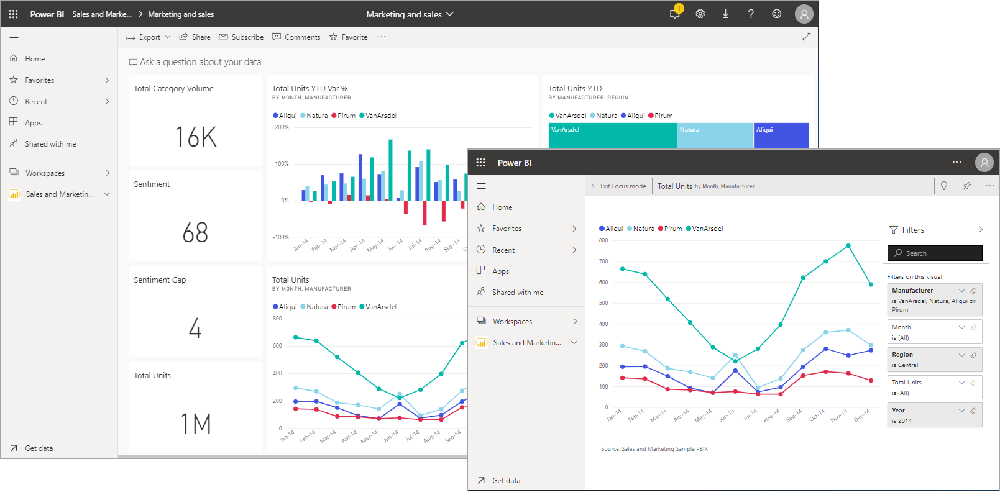
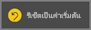

# แสดงเนื้อหาในรายละเอียดที่มากขึ้น: โหมดโฟกัสและโหมดเต็มหน้าจอDisplay content in more detail: focus mode and full screen mode

[!INCLUDE [consumer-appliesto-yynn](../includes/consumer-appliesto-yynn.md)]

<iframe width="560" height="315" src="https://www.youtube.com/embed/dtdLul6otYE" frameborder="0" allowfullscreen></iframe>

โหมดโฟกัสและโหมดเต็มหน้าจอเป็นสองวิธีที่ใช้ดูรายละเอียดที่มากขึ้นในวิชวล รายงานและแดชบอร์ดFocus mode and full screen mode are two different ways to see more detail in your visuals, reports, and dashboards.  ความแตกต่างหลักระหว่างสองโหมดนี้คือ โหมดเต็มหน้าจอจะเอาแผงทั้งหมดที่อยู่รอบเนื้อหาออกไป ในขณะที่โหมดโฟกัสจะให้คุณยังโต้ตอบกับวิชวลของคุณได้The main difference between the two is that full screen removes all the panes surrounding your content while focus mode allows you to still interact with your visuals. มาดูความเหมือนและความต่างให้มากกว่านี้กันLet's take a closer look at the similarities and differences.  

|เนื้อหาContent    | โหมดโฟกัสFocus mode  |โหมดเต็มหน้าจอFull screen mode  |
|---------|---------|----------------------|
|แดชบอร์ดDashboard     |   ทำไม่ได้Not possible     | ใช่yes |
|หน้ารายงานReport page   | ทำไม่ได้Not possible  | ใช่yes|
|ส่วนการแสดงผลรายงานReport visual | ใช่yes    | ใช่yes |
|แดชบอร์ดไทล์Dashboard tile | ใช่yes    | ทำไม่ได้Not possible |
|มือถือ Windows 10Windows 10 mobile | ทำไม่ได้Not possible | ใช่Yes |

ในตัวอย่างด้านล่างนี้ เราได้เริ่มต้นด้วยรายงาน (1) เปิดวิชวลหนึ่งวิชวลในโหมดโฟกัส (2) จากนั้นเปิดวิชวลเดียวกันในโหมดเต็มหน้าจอ (3)In this example below, we started with a report (1), opened one of the visuals in focus mode (2) and then opened that same visual in full screen mode (3). 

## เวลาที่ต้องใช้โหมดเต็มหน้าจอWhen to use full screen mode

แสดงเนื้อหาบริการของ Power BI ของคุณ (แดชบอร์ด, หน้ารายงาน และวิชวล) โดยไม่มีเมนูและบานหน้าต่างนำทางรบกวนDisplay your Power BI service content (dashboards, report pages, and visuals) without the distraction of menus and nav panes.  คุณสามารถดูในมุมมองไม่เปลี่ยนได้แบบเต็มรูปแบบเนื้อหาของคุณได้อย่างรวดเร็ว ตลอดเวลาYou get an unadulterated, full view of your content at a glance, all the time. ซึ่งในบางครั้งจะเรียกว่าโหมดโทรทัศน์This is sometimes referred to as TV mode.   

ถ้าคุณกำลังใช้ Power BI บนมือถือ [หน้าจอแบบเต็มพร้อมใช้งานสำหรับแอป Windows 10 สำหรับอุปกรณ์เคลื่อนที่](./mobile/mobile-windows-10-app-presentation-mode.md)If you're using Power BI mobile, [full screen is available for Windows 10 mobile apps](./mobile/mobile-windows-10-app-presentation-mode.md). 

การใช้งานบางอย่างในโหมดเต็มหน้าจอเช่นSome uses for full screen mode are:

* นำเสนอแดชบอร์ด วิชวล หรือรายงานการประชุมหรือการประชุมของคุณpresenting your dashboard, visual, or report at a meeting or conference
* แสดงในที่ทำงานบนหน้าจอขนาดใหญ่แบบเฉพาะหรือใช้เครื่องฉายภาพdisplaying in an office on a dedicated large screen or projector
* การดูบนหน้าจอขนาดเล็กviewing on a small screen
* การตรวจทานในโหมดล็อก คุณสามารถสัมผัสหน้าจอหรือใช้เมาส์เหนือไทล์โดยไม่ต้องเปิดรายงานหรือแดชบอร์ดพื้นฐานreviewing in locked mode -- you can touch the screen or mouse over tiles without opening the underlying report or dashboard

## ต้องใช้โหมดโฟกัสเมื่อใดWhen to use focus mode?

โหมด\***โฟกัส** _ จะให้คุณได้ขยาย (ป๊อปเอาต์) วิชวลหรือไทล์เพื่อดูรายละเอียดที่มากขึ้น\***Focus** _ mode lets you expand (pop out) a visual or tile to see more detail.  บางทีคุณอาจมีแดชบอร์ดหรือรายงานที่เนื้อหาค่อนข้างจะเบียดเสียด และคุณต้องการขยายวิชวลเพียงวิชวลเดียวMaybe you have a dashboard or report that is a little crowded and you want to zoom in on only one visual.  การใช้งานโหมดโฟกัสจะเหมาะสมที่สุดThis is a perfect use of focus mode.  

ขณะที่อยู่ในโหมดโฟกัส \*ผู้ใช้ธุรกิจของ Power BI _ จะสามารถโต้ตอบกับตัวกรองที่ใช้งานเมื่อสร้างภาพนี้ขึ้นมาได้While in focus mode, a Power BI _business user\* can interact with any filters that were applied when this visual was created.  ในบริการของ Power BI คุณสามารถใช้โหมดโฟกัสกับแดชบอร์ดไทล์หรือการแสดงผลด้วยภาพของรายงานได้In the Power BI service, you can use focus mode on a dashboard tile or report visual.

## การทำงานในโหมดเต็มหน้าจอWorking in full screen mode

โหมดเต็มหน้าจอพร้อมใช้งานสำหรับแดชบอร์ด หน้ารายงาน และรายงานวิชวลFull screen mode is available for dashboards, report pages, and report visuals. 

- ในการเปิดแดชบอร์ดในโหมดเต็มหน้าจอ ให้เลือกไอคอนเต็มหน้าจอTo open a dashboard in full screen mode, select the full screen icon  จากแถบเมนูด้านบนfrom the top menu bar. 

- ในการเปิดหน้ารายงานในโหมดเต็มหน้าจอ ให้เลือก **มุมมอง** > **เต็มหน้าจอ**To open a report page in full screen mode, select **View** > **Full screen**.

    

- ในการดูวิชวลในโหมดเต็มหน้าจอ ก่อนอื่นให้เปิดในโหมดโฟกัส จากนั้นเลือก **มุมมอง** > **เต็มหน้าจอ**To see a visual in full screen mode, first open it in focus mode and then select **View** > **Full screen**.  

เนื้อหาที่คุณเลือกจะเต็มทั้งหน้าจอYour selected content fills the entire screen. เมื่อคุณอยู่ในโหมดเต็มหน้าจอ ให้เลือกการทำงานโดยใช้แถบเมนูที่ด้านบนและด้านล่าง (รายงาน) หรือเมนูที่ปรากฏขึ้นเมื่อคุณย้ายเคอร์เซอร์ (แดชบอร์ดและวิชวล) ของคุณOnce you're in full screen mode, navigate using either the menu bars at the top and bottom (reports) or the menu that appears when you move your cursor (dashboards and visuals). และเนื่องจากโหมดเต็มหน้าจอจะพร้อมให้ใช้งานกับเนื้อหาที่หลากหลาย ดังนั้น ตัวเลือกการทำงานอาจแตกต่างไปได้Because full screen is available for such a wide variety of content, the navigation options vary.   

  * ใช้ปุ่ม **กลับ** **ย้อนกลับ** หรือ **กลับไปที่รายงาน** เพื่อย้อนกลับไปยังหน้าก่อนหน้าในเบราว์เซอร์ของคุณSelect the **Back**, **Go back**, or **Back to report** button  to navigate to the previous page in your browser. ถ้าหน้าก่อนหน้าเป็นหน้า Power BI มันจะแสดงในโหมดเต็มหน้าจอเช่นกันIf the previous page was a Power BI page, it too will display in full screen mode.  โหมดเต็มหน้าจอจะยังคงอยู่จนกว่าคุณออกไปFull screen mode will persist until you exit out.

  *       
    ให้ใช้ปุ่ม **จัดให้พอดีกับหน้าจอ** เพื่อแสดงแดชบอร์ดของคุณให้มีขนาดใหญ่ที่สุดที่เป็นไปได้ โดยไม่ต้องปรับแถบเลื่อนUse the **Fit to screen** button to display your dashboard at the largest size possible without resorting to scrollbars.  

    

  *             
    ในบางครั้งคุณไม่สนใจแถบเลื่อน แต่ต้องการให้แดชบอร์ดเติมความกว้างของช่องว่างที่พร้อมใช้งานSometimes you don't care about scrollbars, but want the dashboard to fill the entire width of the available space. ให้เลือกปุ่ม **ให้พอดีกับความกว้าง**Select the **Fit to width** button.    

    

  *        
    ในรายงานแบบเต็มหน้าจอ ให้ใช้ลูกศรเหล่านี้เพื่อย้ายไปมาระหว่างหน้าในรายงานIn full screen reports, use these arrows to move between the pages in the report.    
  *         
  เพื่อออกจากโหมดเต็มหน้าจอ ให้เลือกไอคอน **จบการทำงานแบบเต็มหน้าจอ**To exit full screen mode, select the **Exit full screen** icon.

      

## การทำงานในโหมดโฟกัสWorking in focus mode

โหมดโฟกัสพร้อมใช้งานสำหรับแดชบอร์ด ไทล์ และวิชวลรายงานFocus mode is available for dashboards tiles and report visuals. 

- ในการเปิดไทล์แดชบอร์ดในโหมดโฟกัส ให้วางเมาส์เหนือไทล์แดชบอร์ดหรือวิชวลของรายงาน เลือก **ตัวเลือกเพิ่มเติม** (...) แล้วเลือก **เปิดในโหมดโฟกัส**To open a dashboard tile in focus mode, hover over a dashboard tile or report visual, select **More options** (...) and choose **Open in focus mode**.

    .... 

- ในการเปิดวิชวลรายงานในโหมดโฟกัส ให้เลื่อนเคอร์เซอร์เหนือวิชวล และเลือกไอคอน **โหมดโฟกัส**To open a report visual in focus mode, hover over the visual and select the **focus mode** icon .  

   

การแสดงภาพเปิดขึ้นและเติมเต็มทั้งผืนผ้าใบThe visual opens and fills the entire canvas. คุณยังมีแถบคำสั่ง **ตัวกรอง** ที่คุณสามารถใช้เพื่อโต้ตอบกับส่วนการแสดงผลNotice that you still have a **Filters** pane that you can use to interact with the visual. แถบคำสั่ง **ตัวกรอง** สามารถยุบได้The **Filters** pane can be collapsed.

   

     

สำรวจเพิ่มเติมโดย[การปรับเปลี่ยนตัวกรอง](end-user-report-filter.md) และมองหาการค้นพบที่น่าสนใจในข้อมูลของคุณExplore further by [modifying the filters](end-user-report-filter.md) and looking for interesting discoveries in your data. ในฐานะที่เป็น *ผู้ใช้แบบธุรกิจ* คุณจะไม่สามารถเพิ่มตัวกรองใหม่ เปลี่ยนเขตข้อมูลที่ใช้อยู่ในวิชวล หรือสร้างวิชวลใหม่ได้As a *business user*, you can't add new filters, change the fields being used in the visuals, or create new visuals.  อย่างไรก็ตาม คุณยังสามารถโต้ตอบกับตัวกรองที่มีอยู่ได้However, you can interact with the existing filters. 

สำหรับไทล์แดชบอร์ด การเปลี่ยนแปลงของคุณจะไม่สามารถบันทึกได้For a dashboard tile, your changes can't be saved. สำหรับวิชวลรายงาน การแก้ไขใดๆ ที่คุณทำกับตัวกรองที่มีอยู่จะถูกบันทึกเมื่อคุณออกจาก Power BIFor a report visual, any modifications you make to the existing filters are saved when you exit Power BI. ถ้าคุณไม่ต้องการให้ Power BI จดจำการปรับเปลี่ยน ให้คุณเลือก **รีเซ็ตเป็นค่าเริ่มต้น**If  you don't want Power BI to remember your modifications, select **Reset to default**.   

ออกจากโหมดโฟกัส แล้วย้อนกลับไปที่แดชบอร์ดหรือรายงาน โดยการเลือก **ออกจากโหมดโฟกัส** หรือ **ย้อนกลับไปที่รายงาน** (ที่มุมซ้ายบนของวิชวล)Leave focus mode and return to the dashboard or report by selecting either **Exit focus mode**,  or **Back to report** (in the upper left corner of the visual).

    

  

## ข้อควรพิจารณาและการแก้ไขปัญหาConsiderations and troubleshooting

* เมื่อคุณใช้โหมดโฟกัสกับภาพในรายงาน คุณจะสามารถดูและปรับเปลี่ยนตัวกรองทั้งหมดได้ เช่น: ระดับการแสดงภาพ ระดับหน้า ระดับเจาะลึกรายละเอียด และระดับรายงานWhen using focus mode with a visual in a report, you'll be able to view and interact with all filters: Visual level, Page level, Drillthrough, and Report level.    
* ขณะใช้โหมดโฟกัสกับส่วนการแสดงผลในแดชบอร์ด คุณจะสามารถดูและโต้ตอบได้เฉพาะกับตัวกรองระดับส่วนการแสดงผลเท่านั้นWhen using focus mode with a visual on a dashboard, you'll be able to view and interact with only the Visual level filter.

## ขั้นตอนถัดไปNext steps

[ดูการตั้งค่าสำหรับรายงานView settings for reports](end-user-report-view.md)