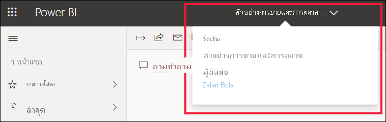
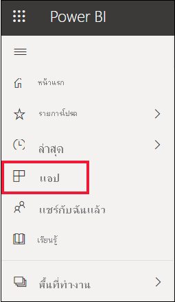
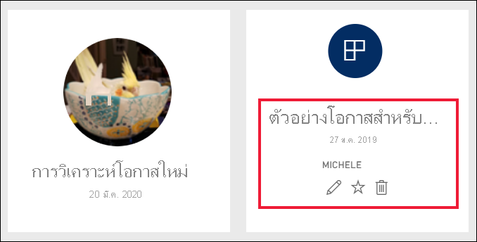
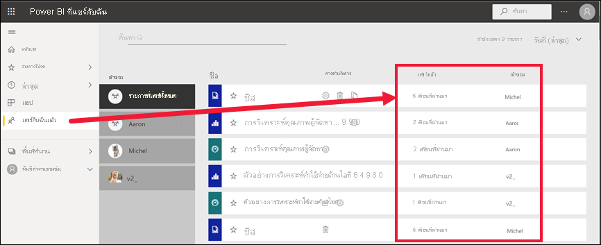
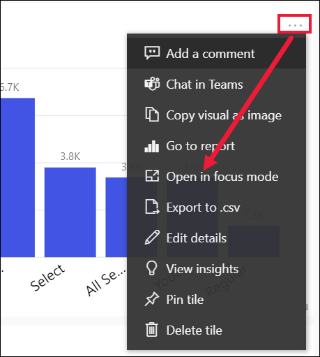
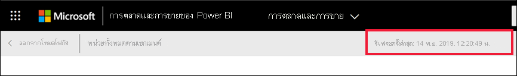
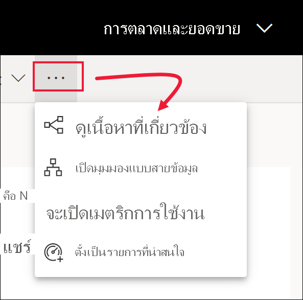
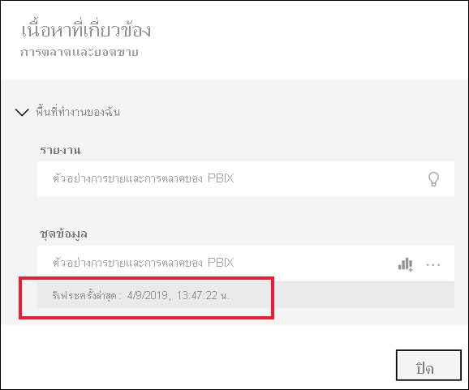

# เนื้อหาของคุณเป็นเวอร์ชันล่าสุดYour content is up-to-date

[!INCLUDE[consumer-appliesto-ynny](../includes/consumer-appliesto-ynny.md)]

[!INCLUDE [power-bi-service-new-look-include](../includes/power-bi-service-new-look-include.md)]

ในฐานะ *ผู้ใช้ทางธุรกิจ* คุณโต้ตอบกับเนื้อหาที่ถูกสร้างขึ้นโดย *นักออกแบบ* และแชร์กับคุณAs a *business user*, you interact with content that is created by *designers* and shared with you. คุณอาจสงสัยว่าเนื้อหานั้นเป็นเวอร์ชันล่าสุดหรือไม่ หรือคุณอาจแค่ต้องการทราบว่าเนื้อหานั้นได้รับการรีเฟรชครั้งล่าสุดเมื่อใดYou might wonder if that content is up-to-date or maybe you just want to know when that content was last refreshed. เมื่อทราบว่าคุณกำลังทำงานกับเนื้อหาล่าสุด นั่นจะช่วยเพิ่มความมั่นใจให้กับคุณKnowing that you are working with the freshest content gives you confidence.  
 

การทำให้แน่ใจว่าคุณกำลังใช้งานข้อมูลล่าสุดมักเป็นเรื่องที่สำคัญอย่างยิ่งต่อการตัดสินใจให้ถูกต้องMaking sure you’re using the latest data is often critical in making the right decisions. คุณสามารถทำอะไรได้บ้างเพื่อให้แน่ใจว่าคุณกำลังใช้เนื้อหาล่าสุดอยู่What can you do to ensure you're using the latest content? ในหลายกรณี คุณไม่จำเป็นต้องทำอะไรเลยIn most cases, you don’t need to do anything at all. แอปที่แชร์กับคุณจะรีเฟรชโดยอัตโนมัติ และอัปเดตตามกำหนดการที่กำหนดโดยนักออกแบบแอปApps that have been shared with you are automatically refreshed and updated on a schedule set by the app designer. เช่นเดียวกันสำหรับแดชบอร์ดและรายงานที่มีการแชร์กับคุณ - นักออกแบบต้องทำให้แน่ใจว่าเนื้อหานั้นใหม่ไม่ว่าจะดำเนินการด้วยตัวเอง หรือใช้การจัดกำหนดการการรีเฟรชอัตโนมัติSame goes for dashboards and reports that have been shared with you -- the designer either manually, or using an automated refresh schedule, ensures that the content is fresh.  

ถ้าคุณมีคำถามเกี่ยวกับความใหม่ของข้อมูล ติดต่อนักออกแบบIf you have questions about the data freshness, contact the designer.

## วิธีการค้นหาชื่อของนักออกแบบหรือเจ้าของHow to locate the name of the designer or owner

### แดชบอร์ดหรือรายงานDashboard or report

ชื่อของเจ้าของจะพร้อมใช้งานจากแถบชื่อเรื่องของแดชบอร์ดและรายงานThe name of the owner is available from the title bar of dashboards and reports. เลือกชื่อรายงานหรือแดชบอร์ดที่จะแสดงรายละเอียดเพิ่มเติมรวมถึง **เจ้าของ**Select the report or dashboard name to reveal additional details, including the **Owner**.

### แอปApps

หน้าจอแอปแสดงทั้งสองชื่อของผู้ออกแบบตลอดจนวันที่อัปเดตแอปล่าสุดThe app screen shows you both the name of the designer as well as the date the app was last updated.  

1. จากบานหน้าต่างนำทาง ให้เลือก**Apps**From the nav pane, select **Apps**.

    

2. วางเมาส์เหนือแอปเพื่อแสดงชื่อเรื่องวันที่อัปเดตล่าสุดและชื่อของตัวออกแบบHover over the app to display the title, freshness date, and name of the designer. 

    

### ที่แชร์กับฉันShared with me
หน้าจอ**แชร์กับฉัน**แสดงชื่อของเจ้าของเนื้อหา ตลอดจนวันที่เนื้อหาถูกแชร์ครั้งล่าสุดกับคุณThe **Shared with me** screen shows you the name of the content owner, as well as the date the content was last shared with you.

 

## วิธีการค้นหาวันที่รีเฟรชล่าสุดHow to look up the last refresh date
ถ้าสนใจ คุณสามารถค้นหาวันที่รีเฟรชล่าสุดสำหรับเนื้อหาส่วนใหญ่If interested, you can look up the last refreshed date for most content. 

### ไทล์แดชบอร์ดDashboard tiles
สำหรับไทล์แดชบอร์ด ดูไทล์ในโหมดโฟกัสเพื่อดูการประทับเวลาการรีเฟรชล่าสุดFor dashboard tiles, view the tile in Focus mode to see the Last refresh timestamp.

1. บนไทล์แดชบอร์ด เลือก**ตัวเลือกเพิ่มเติม** (...) แล้วเลือก **เปิดในโหมดโฟกัส**On a dashboard tile, select **More options** (...) and choose **Open in Focus mode**.

    

2. วันที่รีเฟรชล่าสุดแสดงอยู่ที่มุมบนขวาThe last refresh date displays in the upper right corner. ถ้าคุณไม่เห็น ลองขยายเพื่อทำใหเบราว์เซอร์ของคุณ้กว้างขึ้นIf you don't see it, expand your browser to make it wider. 

    

### แดชบอร์ดและรายงานDashboards and reports
อีกหนึ่งวิธีในการดูข้อมูลล่าสุดคือการใช้ส่วน **ดูเนื้อหาที่เกี่ยวข้อง**Another way to look up a last refreshed date is by using **See  related content**.  **ดูรายการที่เกี่ยวข้อง** สามารถใช้ได้โดยการเลือก **ตัวเลือกเพิ่มเติม** (...) จากแถบเมนูด้านบนของ Power BI**See related content** is available by selecting **More actions** (...) from the Power BI upper menu bar.

บานหน้าต่าง**เนื้อหาที่เกี่ยวข้อง**แสดงข้อมูลการรีเฟรชล่าสุดสำหรับชุดข้อมูลพื้นฐานของแดชบอร์ดหรือของรายงานThe **Related content** pane displays the last refresh information for the dashboard's or report's underlying dataset.

## จะเกิดอะไรขึ้นถ้าแอปถูกลบโดยนักออกแบบWhat happens if an app is deleted by the designer

ถ้านักออกแบบลบแอป แดชบอร์ดและรายงานที่เกี่ยวข้องกับแอปนั้นจะถูกลบจากพื้นที่ทำงาน Power BI ของคุณโดยอัตโนมัติได้เช่นกันIf a designer deletes an app, the dashboards and reports associated with that app are automatically removed from your Power BI workspace as well. ซึ่งแดชบอร์ดและรายงานจะใช้งานไม่ได้อีกต่อไป และแอปจะไม่ปรากฏในแอปหรือบานหน้าต่างนำทางThey're no longer available, and the app doesn't appear in the Apps container or elsewhere in the nav pane.

## สมัครใช้งานเพื่อดูการเปลี่ยนแปลงSubscribe to see changes
อีกวิธีหนึ่งเพื่อคงข้อมูลให้เป็นปัจจุบันก็คือ การสมัครใช้งานไปยังรายงานหรือแดชบอร์ดAnother way to stay up-to-date, is to subscribe to a report or dashboard. แทนที่จะต้องเข้าสู่ระบบ และเปิดรายงานหรือแดชบอร์ด คุณสามารถแจ้ง Power BI เพื่อส่งสแนปช็อตตามกำหนดการที่คุณตั้งค่าไว้Instead of having to log in and open a report or dashboard, you tell Power BI to send you a snapshot on a schedule you set.  สำหรับข้อมูลเพิ่มเติม ดู[สมัครใช้งานแดชบอร์ดและรายงาน](end-user-subscribe.md)For more information, see [subscribe to dashboards and reports](end-user-subscribe.md).

## ตั้งค่าการแจ้งเตือนข้อมูลSet data alerts
ต้องการรับการแจ้งเตือนถ้าข้อมูลเปลี่ยนแปลงเหนือหรือเกินขีดจำกัดที่คุณตั้งค่าไว้หรือไม่Want to be notified if data changes above or beyond a limit you set? [สร้างการแจ้งเตือนข้อมูล](end-user-alerts.md)[Create a data alert](end-user-alerts.md).  ถือเป็นเรื่องง่ายในการคงข้อมูลให้เป็นปัจจุบันโดยใช้การแจ้งเตือนข้อมูลIt's easy to stay up-to-date using data alerts. ด้วยการแจ้งเตือนข้อมูล คุณสามารถแจ้ง Power BI ให้ส่งอีเมลถึงคุณได้ถ้าค่าในรายงานผ่านค่าเกณฑ์เฉพาะWith data alerts, you tell Power BI to send you an email if a value in a report passes a specific threshold.  ตัวอย่างเช่น ถ้าสินค้าคงคลังลดลงต่ำกว่า 25 หน่วย หรือถ้ายอดขายเกินเป้าหมายFor example, if inventory falls below 25 units or if sales exceed goals.  

## ขั้นตอนถัดไปNext steps
[สร้างการแจ้งเตือนข้อมูล](end-user-alerts.md)  [Create a data alert](end-user-alerts.md)    
[สมัครใช้งานแดชบอร์ดและรายงาน](end-user-subscribe.md)  [Subscribe to dashboards and reports](end-user-subscribe.md)    
[ดูเนื้อหาที่เกี่ยวข้องView related content](end-user-related.md)    
